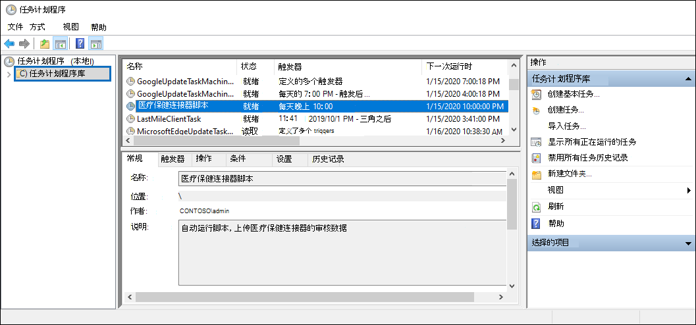

# <a name="set-up-a-connector-to-import-healthcare-ehr-audit-data-preview"></a>设置连接器以导入医疗保健 EHR 审核数据 (预览) 

您可以在组织中设置数据连接器Microsoft 365 合规中心在组织的电子医疗保健记录服务 EHR) 系统中导入用户活动的 (数据。 您的医疗保健 EHR 系统审核数据包括与访问患者健康记录相关的事件的数据。 医疗保健 EHR 审核数据可用于Microsoft 365风险管理[解决方案](insider-risk-management.md)，以帮助保护组织免受对患者信息的未经授权的访问。

设置医疗保健连接器包括以下任务：

- 在 Azure Active Directory (Azure AD) 应用程序以访问 API 终结点，该终结点接受以制表符分隔的文本文件，其中包含医疗保健 EHR 审核数据。

- 创建包含连接器架构中定义的所有必填字段的文本文件。

- 在服务中心内创建Microsoft 365 合规中心。

- 运行脚本将医疗保健 EHR 审核数据推送到 API 终结点。

- （可选）将脚本安排为自动运行以导入审核数据。

## <a name="before-you-set-up-the-connector"></a>设置连接器之前

- 必须在步骤 3 中为在步骤 3 中创建医疗保健连接器的用户分配邮箱导入导出Exchange Online。 默认情况下，不会向 Exchange Online 中任何角色组分配此角色。 可以将"邮箱导入导出"角色添加到"邮箱管理"角色Exchange Online。 也可以创建新的角色组，分配"邮箱导入导出"角色，然后将相应的用户添加为成员。 有关详细信息，请参阅"管理角色[组中的角色组](\Exchange\permissions-exo\role-groups#create-role-groups)"[](\Exchange\permissions-exo\role-groups#modify-role-groups)一文的"创建角色组"或"修改角色组"Exchange Online。

- 您需要确定如何每天从组织的医疗保健 EHR 系统 (检索或导出数据) 并创建步骤 2 中所述的文本文件。 在步骤 4 中运行的脚本将文本文件中的数据推送到 API 终结点。

- 在步骤 4 中运行的示例脚本将医疗保健 EHR 审核数据从文本文件推送到连接器 API，以便内部风险管理解决方案可以使用该数据。 本示例脚本在任何 Microsoft 标准支持计划或服务下都不受支持。 示例脚本“原样”提供，不提供任何形式的保证。 Microsoft 进一步拒绝所有默示保证，包括但不限于针对特定用途的适销性或适用性的任何默示保证。 由于示例脚本及文档的使用或性能所引起的全部风险均由你承担。 在任何情况下，对于由于使用或者无法使用示例脚本或文档所引起的任何损失（包括但不限于商业利润损失、业务中断、商业信息丢失或者其他经济损失），Microsoft、其作者或者参与创建、制作或交付脚本的任何人概不负责，即使 Microsoft 已被告知可能会出现此类损失。

## <a name="step-1-create-an-app-in-azure-active-directory"></a>步骤 1：在 Azure Active Directory

第一步是在应用程序创建和注册Azure Active Directory (Azure AD) 。 该应用将对应于你在步骤 3 创建的医疗保健连接器。 创建此应用Azure AD对包含医疗保健 EHR 审核数据的文本文件的推送请求进行身份验证。 创建此应用程序Azure AD，请务必保存以下信息。 这些值将在稍后的步骤中使用。

- Azure AD ID (也称为 *应用 ID* 或 *客户端 ID*) 

- Azure AD应用程序密码 (也称为 *客户端密码*) 

- 租户 ID (*也称为目录 ID*) 

有关在应用程序中创建应用的分步Azure AD，请参阅使用 Microsoft 标识平台 注册[应用程序](\azure\active-directory\develop\quickstart-register-app)。

## <a name="step-2-prepare-a-text-file-with-healthcare-ehr-auditing-data"></a>步骤 2：准备包含医疗保健 EHR 审核数据的文本文件

下一步是创建一个文本文件，其中包含有关员工在组织的医疗保健 EHR 系统中访问患者健康记录的信息。 如前所述，您需要确定如何从医疗保健 EHR 系统生成此文本文件。 医疗保健连接器工作流需要具有制表符分隔值的文本文件，以使用所需连接器架构映射文本文件中的该数据。 支持的文件格式是逗号 (.csv) 、管道 (.psv) 或选项卡 (.tsv) 分隔的文本文件。

> [!NOTE]
> 包含审核数据的文本文件的最大大小为 3 GB。 最大行数为 500 万。 此外，请务必仅包含来自医疗保健 EHR 系统的相关审核数据。

下表列出了启用内部风险管理方案所需的字段。 这些字段的子集是必需的。 这些字段用星号 (*) 。 如果文本文件中缺少任何必需字段，将不会验证该文件，并且不会导入该文件的数据。

|字段|类别|
|:----|:----------|
| 创建时间 *<br/> 事件名称*<br/>工作站 ID<br/>Event Section<br/>事件类别 |这些字段用于标识您的医疗保健 EHR 系统中的访问活动事件。|
| 患者注册表 ID<br/>患者名字 *<br/> 患者中间名 <br/> 患者姓氏* <br/>患者地址第 1 行* <br/>患者地址第 2 行<br/>患者城市* <br/>患者邮政编码*  <br/>患者状态 <br/>患者国家/地区 <br/>患者部门              | 这些字段用于标识患者配置文件信息。|
| 受限访问原因*<br/> 受限访问注释 | 这些字段用于标识对受限记录的访问。|
| 电子邮件地址 (UPN) SamAccountName*<br/>员工用户名 <br/> 员工 ID <br/> 员工姓氏 <sup>1</sup> <br/> 员工名字 <sup>1</sup> | 这些字段用于标识确定对"家庭/邻接/员工"记录的访问权限所需的地址和名称匹配的员工个人资料信息。 |
|||

> [!NOTE] 
> <sup>1</sup>默认情况下，此字段在医疗保健 EHR 系统中可能不可用。 您需要配置导出以确保文本文件包含此字段。

## <a name="step-3-create-the-healthcare-connector"></a>步骤 3：创建医疗保健连接器

下一步是在安全中心内创建Microsoft 365 合规中心。 在步骤 4 中运行脚本后，将处理在步骤 2 中创建的文本文件，并推送到在步骤 1 中设置的 API 终结点。 在此步骤中，请确保复制创建连接器时生成的 JobId。 运行脚本时，将使用 JobId。

1. 转到 ， <https://compliance.microsoft.com> 然后单击左侧 **导航中的** "数据连接器"。

2. 在"**概述"** 选项卡上，单击"医疗保健 **(预览) "。**

3. 在"**医疗保健 (预览) ，** 单击"添加 **连接器"。**

4. 接受服务条款。

5. 在"**身份验证凭据"** 页上，执行以下操作，然后单击"下一步 **"：**

    1. 键入或粘贴Azure AD 1 中创建的 Azure 应用的应用程序 ID。

    2. 键入医疗保健连接器的名称。

6. 在"**文件映射方法**"页上，选择下列选项之一，然后单击"下一步 **"。**

   - **Upload示例文件**。 如果选择此选项，请单击"Upload文件"以上载在步骤 2 中准备的文件。 此选项允许你从下拉列表中快速选择文本文件中的列名称，以将列映射到医疗保健连接器所需的架构。 

    或

   - **手动提供映射详细信息**。 如果选择此选项，您必须在文本文件中键入列的名称，以将列映射到医疗保健连接器所需的架构。

7. 在" **文件映射详细信息** "页上，执行下列操作之一，具体取决于是否在上一步骤中上载了示例文件：

   - 使用下拉列表将示例文件的列映射到医疗保健连接器的每个必填字段。

    或

   - 对于每个字段，键入在步骤 2 中准备的与医疗保健连接器的字段对应的文件的列名称。

8. 在" **审阅** "页上，查看设置，然后单击" **完成** "以创建连接器。

   将显示一个状态页，确认连接器已创建。 此页面包含两个重要内容，您需要完成下一步以运行示例脚本来上载您的医疗保健 EHR 审核数据。

    - **作业 ID。** 您需要此作业 ID，以在下一步中运行脚本。 可以从此页面或连接器飞出页复制它。

    - **指向示例脚本的链接。** 单击 **"此处**"链接可转到GitHub网站以访问示例脚本 (该链接将打开一个新窗口) 。 保持此窗口为打开状态，以便你可以复制步骤 4 中的脚本。 或者，您可以为目标添加书签或复制 URL，以便可以在运行脚本时再次访问它。 连接器飞出页面上也提供此链接。

9. 单击“**完成**”。

   新连接器显示在"连接器"选项卡 **上的** 列表中。

10. 单击刚创建的医疗保健连接器以显示该飞出页面，其中包含有关连接器的属性和其他信息。

如果你尚未这样做，你可以复制 **Azure 应用 ID** 和连接器作业 **ID 的值**。 下一步中，将需要使用这些脚本来运行脚本。 您还可以从飞出页面下载脚本 (下一步中的链接下载脚本。) 

还可以单击" **编辑"** 更改在"文件映射"页上定义的 Azure 应用 ID 或列 **标题** 名称。

## <a name="step-4-run-the-sample-script-to-upload-your-healthcare-ehr-auditing-data"></a>步骤 4：运行示例脚本以上载医疗保健 EHR 审核数据

设置医疗保健连接器的最后一步是运行示例脚本，该脚本将在你在步骤 1) 中创建的文本文件 (中将医疗保健 EHR 审核数据上载到 Microsoft 云。 具体而言，脚本将数据上载到医疗保健连接器。 运行脚本后，在步骤 3 中创建的医疗保健连接器将医疗保健 EHR 审核数据导入 Microsoft 365 组织，其他合规性工具（如预览体验成员风险管理解决方案）可以访问该数据。 运行脚本后，请考虑安排每天自动运行该脚本的任务，以便将最新的员工离职数据上传到 Microsoft 云。 请参阅 [ (可选) 步骤 6：将脚本安排为自动运行](#optional-step-6-schedule-the-script-to-run-automatically)。

> [!NOTE]
> 如前所述，包含审核数据的文本文件的最大大小为 3 GB。 最大行数为 500 万。 在此步骤中运行的脚本将大约需要 30 至 40 分钟从大型文本文件导入审核数据。 此外，该脚本还将大型文本文件划分为包含 10 万行的较小块，然后按顺序导入这些块。

1. 转到上一步中打开的窗口，通过示例脚本GitHub网站。 或者，打开已添加书签的网站或使用您复制的 URL。

2. 单击" **原始** "按钮以在文本视图中显示脚本。

3. 复制示例脚本中所有行，然后将它们保存到文本文件。

4. 如有必要，修改组织的示例脚本。

5. 使用 文件名后缀 将文本文件另存为Windows PowerShell脚本文件 `.ps1` ;例如， `HealthcareConnector.ps1` 。

6. 在本地计算机上打开命令提示符，然后转到保存脚本的目录。

7. 运行以下命令，将文本文件中的医疗保健审核数据上载到 Microsoft 云;例如：

   ```powershell
   .\HealthcareConnector.ps1 -tenantId <tenantId> -appId <appId>  -appSecret <appSecret>  -jobId <jobId>  -filePath '<filePath>'
   ```

下表介绍了要用于此脚本的参数及其所需值。 在之前步骤中获取的信息将使用这些参数的值。

|参数  |说明|
|:----------|:----------|
|tenantId|这是在步骤 1 Microsoft 365获取的组织的 ID。 还可以在管理中心的"概述"边栏选项卡上获取Azure AD ID。 这用于标识您的组织。|
|appId|这是Azure AD步骤 1 中创建的应用的应用程序Azure AD ID。 当脚本尝试Azure AD组织时，此参数Microsoft 365进行身份验证。|
|appSecret|这是Azure AD步骤 1 中创建的应用的Azure AD密码。 这还用于身份验证。|
|jobId|这是在步骤 3 中创建的医疗保健连接器的作业 ID。 这用于将上载到 Microsoft 云的医疗保健 EHR 审核数据与医疗保健连接器关联。|
|filePath|这是文本文件的文件路径， (步骤 2 中创建的脚本) 存储在同一系统中。 尝试避免文件路径中的空格;否则请使用单引号。|
|||

以下是针对每个参数使用实际值的医疗保健连接器脚本的语法示例：

```powershell
.\HealthcareConnector.ps1 -tenantId d5723623-11cf-4e2e-b5a5-01d1506273g9 -appId 29ee526e-f9a7-4e98-a682-67f41bfd643e -appSecret MNubVGbcQDkGCnn -jobId b8be4a7d-e338-43eb-a69e-c513cd458eba -filePath 'C:\Users\contosoadmin\Desktop\Data\healthcare_audit_records.csv'
```

如果上传成功，脚本将显示Upload **成功** 消息。

> [!NOTE]
> 如果由于执行策略而运行上一个命令时遇到问题，[](\powershell\module\microsoft.powershell.core\about\about_execution_policies)请参阅关于执行策略和[Set-ExecutionPolicy，](\powershell\module\microsoft.powershell.security\set-executionpolicy)了解设置执行策略的指南。

## <a name="step-5-monitor-the-healthcare-connector"></a>步骤 5：监视医疗保健连接器

创建医疗保健连接器并推送 EHR 审核数据后，可以查看该连接器，并上传Microsoft 365 合规中心。 如果安排脚本定期自动运行，还可以在上次运行脚本后查看当前状态。

1. 转到左侧 <https://compliance.microsoft.com> 导航 **导航中的"数据** 连接器"，然后单击" 数据连接器"。

2. 单击 **"连接器"** 选项卡，然后选择"医疗保健"连接器以显示飞出页面。 此页面包含有关连接器的属性和信息。

3. 在 **"上次导入**"下，单击"下载日志"链接 (或) 连接器的状态日志。 此日志包含有关脚本每次运行以及将数据从文本文件上载到 Microsoft 云时的信息。

    `RecordsSaved`该字段指示已上载的文本文件中的行数。 例如，如果文本文件包含四行，则字段的值为 4（如果脚本已成功上载文本文件中所有 `RecordsSaved` 行）。

如果尚未在步骤 4 中运行脚本，则"上次导入"下将显示用于下载脚本 **的链接**。 可以下载脚本，然后按照步骤运行脚本。

## <a name="optional-step-6-schedule-the-script-to-run-automatically"></a> (可选) 步骤 6：将脚本安排为自动运行

若要确保医疗保健 EHR 系统中的最新审核数据可供内部风险管理解决方案等工具使用，建议安排脚本每天自动运行。 这还要求在类似的 (（如果不是同一) 计划）上更新同一文本文件中的 EHR 审核数据，以便其中包含员工有关患者记录访问活动的最新信息。 目标是上载最新的审核数据，以便医疗保健连接器能够将其提供给内部风险管理解决方案。

You can user the Task Scheduler app in Windows to automatically run the script every day.

1. 在本地计算机上，单击 **"Windows"** 按钮，然后键入 **"任务计划程序"。**

2. 单击任务 **计划程序** 应用以打开它。

3. 在"**操作"部分**，单击"**创建任务"。**

4. 在" **常规"** 选项卡上，键入计划任务的描述性名称;例如， **医疗保健连接器脚本**。 还可以添加可选说明。

5. 在 **"安全选项**"下，执行以下操作：

    1. 确定是仅在您登录到计算机时运行脚本，还是在您登录时运行该脚本。

    2. 确保选中 **了"使用最高权限** 运行"复选框。

6. 选择 **"触发器"** 选项卡，单击 **"新建**"，然后执行以下操作：

    1. 在 **设置"** 下，选择"**每天**"选项，然后选择首次运行脚本的日期和时间。 脚本将每天在同一指定时间运行。

    2. 在 **"高级设置**"下，确保 **选中"已启用** "复选框。

    3. 单击“确定”。

7. 选择" **操作"** 选项卡，单击 **"新建**"，然后执行以下操作：

   

    1. 在 **"操作** "下拉列表中，确保已 **选择"启动程序** "。

    2. 在"**程序/脚本**"框中，单击"浏览"，然后转到以下位置并选择它，以便路径显示在框中：C:.0.exe。

    3. 在" **添加 (可选) "** 框中，粘贴在步骤 4 中运行相同的脚本命令。 例如，`.\HealthcareConnector.ps1 -tenantId "d5723623-11cf-4e2e-b5a5-01d1506273g9" -appId "c12823b7-b55a-4989-faba-02de41bb97c3" -appSecret "MNubVGbcQDkGCnn" -jobId "e081f4f4-3831-48d6-7bb3-fcfab1581458" -filePath "C:\Healthcare\audit\records.txt"`

    4. 在 **" (可选**) "框中，粘贴在步骤 4 中运行脚本的文件夹位置。 例如，C：\Healthcare\audit。

    5. 单击 **"** 确定"保存新操作的设置。

8. 在" **创建任务"** 窗口中，单击" **确定** "保存计划任务。 系统可能会提示您输入用户帐户凭据。

   新任务将显示在任务计划程序库中。

   

   显示脚本上次运行的时间和计划运行的下一次。 可以双击任务进行编辑。

   还可以验证脚本上次在合规中心中相应医疗保健连接器的飞出页面上运行的时间。
