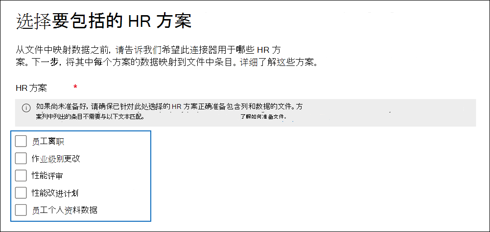

# <a name="set-up-a-connector-to-import-hr-data"></a>设置连接器以导入 HR 数据

可以在Microsoft 365 合规中心中设置数据连接器，以导入人力资源 (人力资源) 与事件（如用户辞职或用户工作级别更改）相关的数据。 然后， [内部风险管理解决方案](insider-risk-management.md) 可以使用 HR 数据生成风险指示器，帮助你识别组织内用户可能的恶意活动或数据盗窃。

为内部风险管理策略可用于生成风险指标的 HR 数据设置连接器包括创建包含 HR 数据的 CSV 文件、在用于身份验证的Azure Active Directory中创建应用、在Microsoft 365 合规中心中创建 HR 数据连接器Microsoft 365 合规中心，然后按计划运行脚本 () 将 CSV 文件中的 HR 数据引入 Microsoft 云，使其可用于内部风险管理解决方案。

> [!IMPORTANT]
> 新版本的 HR 连接器现在可用于公共预览版。 若要为内部风险管理的医疗保健策略方案创建新的 HR 连接器或导入 [新员工配置文件方案](#csv-file-for-employee-profile-data-preview)的数据，请转到Microsoft 365 合规中心中的 **“数据连接器**”页，选择 **“连接器”** 选项卡，然后单击 **“添加连接器>人力资源 (预览)** 启动设置。 现有 HR 连接器将继续工作，不会造成任何中断。

## <a name="before-you-begin"></a>准备工作

- 确定要导入到Microsoft 365的 HR 方案和数据。 这将有助于确定需要创建多少个 CSV 文件和 HR 连接器，以及如何生成和构建 CSV 文件。 导入的 HR 数据由要实施的内部风险管理策略决定。 有关详细信息，请参阅步骤 1。

- 确定如何从组织的 HR 系统 (定期检索或导出数据) 并将其添加到在步骤 1 中创建的 CSV 文件。 在步骤 4 中运行的脚本会将 CSV 文件中的 HR 数据上传到 Microsoft 云。

- 在步骤 3 中创建 HR 连接器的用户必须分配 Data Connector 管理员角色。 在Microsoft 365 合规中心 **的数据连接器** 页上添加连接器需要此角色。 默认情况下，此角色将添加到多个角色组。 有关这些角色组的列表，请参阅 [安全&合规中心](../security/office-365-security/permissions-in-the-security-and-compliance-center.md#roles-in-the-security--compliance-center)“权限”中的“安全与合规中心中的角色”部分。 或者，组织中的管理员可以创建自定义角色组，分配数据连接器管理员角色，然后将相应的用户添加为成员。 有关说明，请参阅Microsoft 365 合规中心中的权[限中的](microsoft-365-compliance-center-permissions.md#create-a-custom-role-group)“创建自定义角色组”部分。

- 在步骤 4 中运行的示例脚本会将 HR 数据上传到 Microsoft 云，以便内部风险管理解决方案可以使用它。 任何 Microsoft 标准支持计划或服务都不支持此示例脚本。 示例脚本“原样”提供，不提供任何形式的保证。 Microsoft 进一步拒绝所有默示保证，包括但不限于针对特定用途的适销性或适用性的任何默示保证。 由于示例脚本及文档的使用或性能所引起的全部风险均由你承担。 在任何情况下，对于由于使用或者无法使用示例脚本或文档所引起的任何损失（包括但不限于商业利润损失、业务中断、商业信息丢失或者其他经济损失），Microsoft、其作者或者参与创建、制作或交付脚本的任何人概不负责，即使 Microsoft 已被告知可能会出现此类损失。

- 此连接器在美国政府云Microsoft 365 GCC环境中可用。 第三方应用程序和服务可能涉及在Microsoft 365基础结构之外的第三方系统上存储、传输和处理组织的客户数据，因此Microsoft 365合规性和数据保护承诺不涵盖这些数据。 Microsoft 没有表示使用此产品连接到第三方应用程序意味着这些第三方应用程序符合 FEDRAMP。 有关在GCC环境中设置 HR 连接器的分步说明，请参阅[设置连接器以在美国政府中导入 HR 数据](import-hr-data-US-government.md)。

## <a name="step-1-prepare-a-csv-file-with-your-hr-data"></a>步骤 1：使用 HR 数据准备 CSV 文件

第一步是创建一个 CSV 文件，其中包含连接器将导入到Microsoft 365的 HR 数据。 内部风险解决方案将使用此数据来生成潜在风险指标。 可以将以下 HR 方案的数据导入到Microsoft 365：

- 员工辞职。 有关已离开组织的员工的信息。

- 作业级别更改。 有关员工工作级别更改的信息，例如晋升和降级。

- 性能评审。 有关员工绩效的信息。

- 性能改进计划。 有关员工性能改进计划的信息。

- 员工个人资料 (预览) 。 有关员工的一般信息。

要导入的 HR 数据类型取决于要实现的内部风险管理策略和相应的策略模板。 下表显示了每个策略模板需要哪种 HR 数据类型：

|  策略模板 |  HR 数据类型 |
|:------------------------------|:--------------------------------|
| 离职用户窃取数据 | 员工辞职|
| 常规数据泄露                             | 不适用|
| 优先用户的数据泄露                   | 不适用 |
| 心怀不满用户的数据泄露活动                | 作业级别更改、性能评审、性能改进计划|
| 违反常规安全策略             | 不适用 |
| 离职用户的安全策略违规活动  | 员工辞职|
| 优先用户的安全策略违规   | 不适用|
| 心怀不满员工的安全策略违规活动| 作业级别更改、性能评审、性能改进计划 |
| 邮件中的冒犯性语言                    | 不适用 |
| 医疗保健策略| 员工配置文件 |
|||

有关内部风险管理的策略模板的详细信息，请参阅 [预览体验成员风险管理策略](insider-risk-management-policies.md#policy-templates)。

对于每个 HR 方案，需要在一个或多个 CSV 文件中提供相应的 HR 数据。 本部分稍后将讨论要用于内部风险管理实现的 CSV 文件数。

使用所需的 HR 数据创建 CSV 文件后，将其存储在在步骤 4 中运行脚本的本地计算机上。 还应实施更新策略，以确保 CSV 文件始终包含最新的信息，以便无论运行脚本什么，最新的 HR 数据都将上传到 Microsoft 云，并可供内部风险管理解决方案访问。

> [!IMPORTANT]
> 以下部分中所述的列名称不是必需的参数，而只是示例。 可以在 CSV 文件中使用任何列名。 但是，在步骤 3 中创建 HR 连接器时， *必须在* CSV 文件中使用的列名称映射到数据类型。 另请注意，以下部分中的示例 CSV 文件显示在记事本视图中。 在Microsoft Excel中查看和编辑 CSV 文件要容易得多。

以下部分介绍每个 HR 方案所需的 CSV 数据。

### <a name="csv-file-for-employee-resignation-data"></a>员工辞职数据的 CSV 文件

下面是员工辞职数据的 CSV 文件示例。

```text
EmailAddress,ResignationDate,LastWorkingDate
sarad@contoso.com,2019-04-23T15:18:02.4675041+05:30,2019-04-29T15:18:02.4675041+05:30
pilarp@contoso.com,2019-04-24T09:15:49Z,2019-04-29T15:18:02.7117540
```

下表描述了适用于员工辞职数据的 CSV 文件中的每个列。

|  列   |   说明 |
|:------------|:----------------|
|**EmailAddress**| 指定已终止用户的电子邮件地址 (UPN) 。|
| **ResignationDate** | 指定用户在组织中正式终止雇佣的日期。 例如，这可能是用户发出有关离开组织的通知的日期。 此日期可能与人员最后一天的工作日期不同。 使用以下日期格式： `yyyy-mm-ddThh:mm:ss.nnnnnn+|-hh:mm`即 [ISO 8601 日期和时间格式](https://www.iso.org/iso-8601-date-and-time-format.html)。|
| **LastWorkingDate** | 指定已终止用户的最后一天工作。 使用以下日期格式： `yyyy-mm-ddThh:mm:ss.nnnnnn+|-hh:mm`即 [ISO 8601 日期和时间格式](https://www.iso.org/iso-8601-date-and-time-format.html)。|
|||

### <a name="csv-file-for-job-level-changes-data"></a>作业级别更改数据的 CSV 文件

下面是作业级别更改数据的 CSV 文件示例。

```text
EmailAddress,EffectiveDate,OldLevel,NewLevel
sarad@contoso.com,2019-04-23T15:18:02.4675041+05:30,Level 61 - Sr. Manager,Level 60- Manager
pillar@contoso.com,2019-04-23T15:18:02.4675041+05:30,Level 62 - Director,Level 60- Sr. Manager
```

下表描述了 CSV 文件中作业级别更改数据的每个列。

|  列 | 说明 |
|:--------- |:------------- |
| **EmailAddress**  | 指定用户的电子邮件地址 (UPN) 。|
| **EffectiveDate** | 指定正式更改用户的作业级别的日期。 使用以下日期格式： `yyyy-mm-ddThh:mm:ss.nnnnnn+|-hh:mm`即 [ISO 8601 日期和时间格式](https://www.iso.org/iso-8601-date-and-time-format.html)。|
| **备注**| 指定评估者提供的有关作业级别更改的备注。 可以输入 200 个字符的限制。 此参数是可选的。 无需将其包含在 CSV 文件中。|
| **OldLevel**| 在更改用户的作业级别之前指定该级别。 这是一个自由文本参数，可以包含组织的分层分类。 此参数是可选的。 无需将其包含在 CSV 文件中。|
| **NewLevel**| 指定用户在更改后的作业级别。 这是一个自由文本参数，可以包含组织的分层分类。 此参数是可选的。 无需将其包含在 CSV 文件中。|
|||

### <a name="csv-file-for-performance-review-data"></a>用于性能评审数据的 CSV 文件

下面是用于性能数据的 CSV 文件的示例。

```text
EmailAddress,EffectiveDate,Remarks,Rating
sarad@contoso.com,2019-04-23T15:18:02.4675041+05:30,Met expectations but bad attitude,2-Below expectation
pillar@contoso.com,2019-04-23T15:18:02.4675041+05:30, Multiple conflicts with the team
```

下表描述了用于性能评审数据的 CSV 文件中的每个列。

|  列 | 说明 |
|:----------|:--------------|
| **EmailAddress**  | 指定用户的电子邮件地址 (UPN) 。|
| **EffectiveDate** | 指定正式通知用户其性能评审结果的日期。 这可能是性能评审周期结束的日期。 使用以下日期格式： `yyyy-mm-ddThh:mm:ss.nnnnnn+|-hh:mm`即 [ISO 8601 日期和时间格式](https://www.iso.org/iso-8601-date-and-time-format.html)。|
| **备注**| 指定评估器为性能评审向用户提供的任何注释。 这是一个文本参数，限制为 200 个字符。 此参数是可选的。 无需将其包含在 CSV 文件中。|
| **评级**| 指定为性能评审提供的分级。 这是一个文本参数，可以包含组织用来识别评估的任何自由格式文本。 例如，“3 满足预期”或“2 低于平均值”。 这是限制为 25 个字符的文本参数。 此参数是可选的。 无需将其包含在 CSV 文件中。|
|||

### <a name="csv-file-for-performance-improvement-plan-data"></a>用于性能改进计划数据的 CSV 文件

下面是性能改进计划数据的数据的 CSV 文件示例。

```text
EmailAddress,EffectiveDate,ImprovementRemarks,PerformanceRating
sarad@contoso.com,2019-04-23T15:18:02.4675041+05:30,Met expectation but bad attitude,2-Below expectation
pillar@contoso.com,2019-04-23T15:18:02.4675041+05:30, Multiple conflicts with the team
```

下表描述了用于性能评审数据的 CSV 文件中的每个列。

|  列 |  说明 |
|:----------|:---------------|
| **EmailAddress**  | 指定用户的电子邮件地址 (UPN) 。|
| **EffectiveDate** | 指定正式通知用户其性能改进计划的日期。 必须使用以下日期格式： `yyyy-mm-ddThh:mm:ss.nnnnnn+|-hh:mm`即 [ISO 8601 日期和时间格式](https://www.iso.org/iso-8601-date-and-time-format.html)。|
| **备注**| 指定评估者提供的有关性能改进计划的任何备注。 这是一个文本参数，限制为 200 个字符。 这是一个可选参数。 无需将其包含在 CSV 文件中。 |
| **评级**| 指定与性能评审相关的任何分级或其他信息。 这是一个文本参数，可以包含组织用来识别评估的任何自由格式文本。 例如，“3 满足预期”或“2 低于平均值”。 这是限制为 25 个字符的文本参数。 这是一个可选参数。 无需将其包含在 CSV 文件中。|
|||

### <a name="csv-file-for-employee-profile-data-preview"></a>员工配置文件数据的 CSV 文件 (预览) 

> [!NOTE]
> 为员工配置文件数据创建 HR 连接器的功能以公共预览版提供。 若要创建支持员工配置文件数据的 HR 连接器，请转到Microsoft 365 合规中心中的 **“数据连接器**”页，选择 **“连接器”** 选项卡，然后单击 **“添加连接器** > **(预览)**”。 按照步骤在 [步骤 3 中创建连接器：创建 HR 连接器](#step-3-create-the-hr-connector)。

下面是员工配置文件数据的 CSV 文件示例。

```text
EmailAddress,UserName,EmployeeFirstName,EmployeeLastName,EmployeeAddLine1,EmployeeAddLine2,EmployeeCity,EmployeeState,EmployeeZipCode,EmployeeDept,EmployeeType,EmployeeRole
jackq@contoso.com,jackq,jack,qualtz,50 Oakland Ave,#206,City,Florida,32104,Orthopaedic,Regular,Nurse
```

下表描述了适用于员工配置文件数据的 CSV 文件中的每个列。

|  列 |  说明 |
|:----------|:---------------|
| EmailAddress<sup>*</sup>    | 员工的 UPN) 或电子邮件地址 (用户主体名称。|
| EmployeeFirstName<sup>*</sup>   | 员工的名字。|
| EmployeeLastName<sup>*</sup>   | 员工的姓氏。|
| EmployeeAddressLine1<sup>*</sup>    | 员工的街道地址。|
| EmployeeAddressLine2   | 员工的辅助地址信息（如公寓号）。|
| EmployeeCity | 员工的居住城市。|
| EmployeeState | 员工的居住状态。|
| EmployeeZipCode<sup>*</sup>  | 员工的居住邮政编码。 |
| EmployeeCountry| 雇员的居住国。|
| EmployeeDepartment | 组织中的员工部门。|
| EmployeeType |员工的就业类型，如常规、豁免或承包商。|
| EmployeeRole |员工在组织中的角色、指定或职务。|
|||

> [!NOTE]
> <sup>*</sup> 此列是必需的。 如果缺少必需列，则不会验证 CSV 文件，并且不会导入文件中的其他数据。

建议创建仅导入员工配置文件数据的 HR 连接器。 对于此连接器，请确保每隔 15 到 20 天频繁刷新员工配置文件数据。 如果员工个人资料记录在过去 30 天内未更新，则会将其删除。

### <a name="determining-how-many-csv-files-to-use-for-hr-data"></a>确定要用于 HR 数据的 CSV 文件数

在步骤 3 中，可以选择为每个 HR 数据类型创建单独的连接器，也可以选择为所有数据类型创建单一连接器。 可以使用单独的 CSV 文件，这些文件包含一个 HR 方案的数据 (如前面部分中所述的 CSV 文件示例) 。 或者，可以使用包含两个或更多 HR 方案的数据的单个 CSV 文件。 下面是一些指南，可帮助你确定要用于 HR 数据的 CSV 文件数。

- 如果要实现的内部风险管理策略需要多种 HR 数据类型，请考虑使用包含所有必需数据类型的单个 CSV 文件。

- 生成或收集 HR 数据的方法可以确定 CSV 文件数。 例如，如果用于配置 HR 连接器的不同类型的 HR 数据位于组织中的单个 HR 系统中，则可以将数据导出到单个 CSV 文件。 但是，如果数据分布在不同的 HR 系统中，则将数据导出到不同的 CSV 文件可能更容易。 例如，员工辞职数据可能位于与作业级别或性能评审数据不同的人力资源系统中。 在这种情况下，创建单独的 CSV 文件可能更容易，而不必将数据手动合并到单个 CSV 文件中。 因此，如何从 HR 系统检索或导出数据可能会确定所需的 CSV 文件数。

- 一般情况下，需要创建的 HR 连接器数由 CSV 文件中的数据类型决定。 例如，如果 CSV 文件包含支持内部风险管理实现所需的所有数据类型，则只需要一个 HR 连接器。 但是，如果有两个单独的 CSV 文件，每个文件都包含一个数据类型，则必须创建两个 HR 连接器。 例外情况是，如果将 **HRScenario** 列添加到 CSV 文件 (请参阅下一部分) ，则可以配置一个可以处理不同 CSV 文件的单个 HR 连接器。

### <a name="configuring-a-single-csv-file-for-multiple-hr-data-types"></a>为多个 HR 数据类型配置单个 CSV 文件

可以将多个 HR 数据类型添加到单个 CSV 文件。 如果要实现的内部风险管理解决方案需要多个 HR 数据类型，或者数据类型位于组织中的单个 HR 系统中，则此方法非常有用。 使用更少的 CSV 文件始终可以减少创建和管理的 HR 连接器。

下面是配置具有多种数据类型的 CSV 文件的要求：

- 如果对每个数据类型和标题行中的相应列名使用所需的列) ，则必须将所需的列添加 (和可选列。 如果数据类型与列不对应，则可以将值留空。

- 若要将 CSV 文件与多种类型的 HR 数据配合使用，HR 连接器需要知道 CSV 文件中的哪些行包含哪种类型的 HR 数据。 这可以通过将其他 **HRScenario** 列添加到 CSV 文件来实现。 此列中的值标识每行中的 HR 数据类型。 例如，对应于四个 HR 方案的值可以是 \`“辞职\`”、“ \`作业级别更改\`”、“ \`性能评审\`”、“ \`性能改进计划\`”和 \`“员工配置文件\`”。

- 如果有多个包含 HRScenario** 列的 CSV 文件，请确保每个文件使用相同的列名和相同的值来标识特定的 HR 方案。

以下示例演示包含 **HRScenario** 列的 CSV 文件。 HRScenario 列中的值标识相应行中的数据类型。

```text
HRScenario,EmailAddress,ResignationDate,LastWorkingDate,EffectiveDate,Remarks,Rating,OldLevel,NewLevel
Resignation,sarad@contoso.com,2019-04-23T15:18:02.4675041+05:30,2019-04-29T15:18:02.4675041+05:30,,,,
Resignation,pilarp@contoso.com,2019-04-24T09:15:49Z,2019-04-29T15:18:02.7117540,,,,
Job level change,sarad@contoso.com,2019-04-23T15:18:02.4675041+05:30,,,,,Level 61 Sr. Manager, Level 60 Manager
Job level change,pillarp@contoso.com,2019-04-23T15:18:02.4675041+05:30,,,,,Level 62 Director,Level 60 Sr Manager
Performance review,sarad@contoso.com,,,2019-04-23T15:18:02.4675041+05:30,Met expectation but bad attitude,2 Below expectations,,
Performance review,pillarp@contoso.com,,,2019-04-23T15:18:02.4675041+05:30, Multiple conflicts with the team,,
Performance improvement plan,sarad@contoso.com,,,2019-04-23T15:18:02.4675041+05:30,Met expectations but bad attitude,2 Below expectations,,
Performance improvement plan,pillarp@contoso.com,,,2019-04-23T15:18:02.4675041+05:30,Multiple conflicts with the team,,
```

> [!NOTE]
> 可以对标识 HR 数据类型的列使用任何名称，因为在步骤 3 中设置连接器时，将 CSV 文件中列的名称映射为标识 HR 数据类型的列。 设置连接器时，还将映射用于数据类型列的值。

### <a name="adding-the-hrscenario-column-to-a-csv-file-that-contains-a-single-data-type"></a>将 HRScenario 列添加到包含单个数据类型的 CSV 文件

根据组织的 HR 系统以及如何将 HR 数据导出到 CSV 文件，可能需要创建多个包含单个 HR 数据类型的 CSV 文件。 在这种情况下，仍可创建单个 HR 连接器以从不同的 CSV 文件导入数据。 为此，只需将 HRScenario 列添加到 CSV 文件并指定 HR 数据类型。 然后，可以为每个 CSV 文件运行脚本，但对连接器使用相同的作业 ID。 请参阅 [步骤 4](#step-4-run-the-sample-script-to-upload-your-hr-data)。

## <a name="step-2-create-an-app-in-azure-active-directory"></a>步骤 2：在Azure Active Directory中创建应用

下一步是在Azure Active Directory (Azure AD) 中创建和注册新应用。 该应用将对应于在步骤 3 中创建的 HR 连接器。 创建此应用将允许Azure AD在运行 HR 连接器并尝试访问组织时对其进行身份验证。 此应用还将用于对在步骤 4 中运行的脚本进行身份验证，以便将 HR 数据上传到 Microsoft 云。 在创建此Azure AD应用期间，请务必保存以下信息。 这些值将在步骤 3 和步骤 4 中使用。

- Azure AD应用程序 ID (也称为 *应用 ID* 或 *客户端 ID*) 

- Azure AD应用程序机密 (也称为 *客户端机密*) 

- 租户 ID (也称为 *目录 ID*) 

有关在Azure AD中创建应用的分步说明，请参阅向[Microsoft 标识平台注册应用程序](/azure/active-directory/develop/quickstart-register-app)。

## <a name="step-3-create-the-hr-connector"></a>步骤 3：创建 HR 连接器

下一步是在Microsoft 365 合规中心中创建 HR 连接器。 在步骤 4 中运行脚本后，创建的 HR 连接器会将 CSV 文件中的 HR 数据引入Microsoft 365组织。 在创建连接器之前，请确保有 HR 方案的列表以及每个方案的相应 CSV 列名称。 配置连接器时，必须将每个方案所需的数据映射到 CSV 文件中的实际列名。 或者，你可以在配置连接器时上传示例 CSV 文件，向导将帮助你将列的名称映射到所需的数据类型。

完成此步骤后，请务必复制创建连接器时生成的作业 ID。 运行脚本时，将使用作业 ID。

1. 转到Microsoft 365 合规中心，然后选择 <a href="https://go.microsoft.com/fwlink/p/?linkid=2173865" target="_blank">**“数据连接器**</a>”。

2. 在 **“数据连接器** ”页上，单击“ **HR (预览)**。

3. 在 **HR (预览)** 页上，单击 **“添加连接器**”。

4. 在 **“设置连接** ”页上，执行以下操作，然后单击 **“下一步**”：

   1. 键入或粘贴在步骤 2 中创建的 Azure 应用的Azure AD应用程序 ID。

   2. 键入 HR 连接器的名称。

5. 在“HR 方案”页上，选择要导入数据的一个或多个 HR 方案，然后单击 **“下一步**”。

   

6. 在文件映射方法页上，根据需要选择文件类型，然后选择以下选项之一，然后单击 **“下一步**”。

   - **Upload示例文件**。 如果选择此选项，请单击 **Upload示例文件** 上传在步骤 1 中准备的 CSV 文件。 此选项允许从下拉列表中快速选择 CSV 文件中的列名称，以便将它们映射到以前选择的 HR 方案的数据类型。

   或

   - **手动提供映射详细信息**。 如果选择此选项，则必须键入 CSV 文件中列的名称，以便将其映射到以前选择的 HR 方案的数据类型。

7. 在“文件映射详细信息”页上，执行以下操作之一，具体取决于是否上传了示例 CSV 文件，以及是为单个 HR 方案还是针对多个方案配置连接器。 如果上传了示例文件，则无需键入列名。 从下拉列表中选取它们。

    - 如果在上一步中选择了单个 HR 方案，则键入列标头名称 (也称为从在步骤 1 中创建的 CSV 文件中的 *参数*) 每个相应的框。 键入的列名称不区分大小写，但如果 CSV 文件中的列名包含空格，请务必包含空格。 如前所述，在这些框中键入的名称必须与 CSV 文件中的参数名称匹配。 例如，以下屏幕截图显示了步骤 1 中所示员工辞职 HR 方案的示例 CSV 文件中的参数名称。

    - 如果在上面的步骤中选择了多个数据类型，则需要输入标识符列名称，以标识 CSV 文件中的 HR 数据类型。 输入标识符列名称后，键入标识此 HR 数据类型的值，并在每个选定数据类型的每个适当框中键入在步骤 1 中创建的 CSV 文件 () 中所选数据类型的列标题名称。 如前所述，在这些框中键入的名称必须与 CSV 文件中的列名称匹配。

8. 在 **“审阅** ”页上，查看设置，然后单击 **“完成** ”以创建连接器。

   将显示一个状态页，确认已创建连接器。 此页包含完成下一步以运行示例脚本上传 HR 数据所需的两个重要事项。

   

   1. **作业 ID。** 在下一步中，需要此作业 ID 才能运行脚本。 可以从此页面或从连接器浮出控件页复制它。

   2. **指向示例脚本的链接。** 单击 **此** 处的链接转到GitHub站点以访问示例脚本 (链接将打开一个新窗口) 。 使此窗口保持打开状态，以便你可以在步骤 4 中复制脚本。 或者，可以对目标进行书签或复制 URL，以便在运行脚本时再次访问它。 连接器浮出控件页上也提供了此链接。

9. 单击“**完成**”。

   新连接器显示在 **“连接器** ”选项卡上的列表中。

10. 单击刚刚创建的 HR 连接器以显示浮出控件页，其中包含有关连接器的属性和其他信息。

   

如果尚未这样做，可以复制 **Azure 应用 ID** 和 **连接器作业 ID 的值**。 在下一步中，需要这些操作才能运行脚本。 还可以从浮出控件页下载脚本 (或使用下一步中的链接下载该脚本。) 

还可以单击 **“编辑**”以更改在 **“文件映射**”页上定义的Azure 应用 ID 或列标题名称。

## <a name="step-4-run-the-sample-script-to-upload-your-hr-data"></a>步骤 4：运行示例脚本上传 HR 数据

设置 HR 连接器的最后一步是运行一个示例脚本，该脚本将 CSV 文件 (中创建的 HR 数据) 上传到 Microsoft 云。 具体而言，脚本将数据上传到 HR 连接器。 运行脚本后，在步骤 3 中创建的 HR 连接器会将 HR 数据导入到Microsoft 365组织，其他合规性工具（例如预览体验成员风险管理解决方案）可以访问该数据。 运行脚本后，请考虑安排任务以每天自动运行该脚本，以便将最新的员工离职数据上传到 Microsoft 云。 请参阅 [计划要自动运行的脚本](#optional-step-6-schedule-the-script-to-run-automatically)。

1. 转到从上一步打开的窗口，使用示例脚本访问GitHub站点。 或者，打开书签网站或使用复制的 URL。 也可以 [在此](https://github.com/microsoft/m365-compliance-connector-sample-scripts/blob/main/sample_script.ps1)处访问脚本。

2. 单击 **“原始** ”按钮可在文本视图中显示脚本。

3. 复制示例脚本中的所有行，然后将其保存到文本文件中。

4. 如有必要，请修改组织的示例脚本。

5. 使用文件名后缀`.ps1`（例如`HRConnector.ps1`）将文本文件另存为Windows PowerShell脚本文件。 或者，可以使用脚本的GitHub文件名，即`upload_termination_records.ps1`。

6. 在本地计算机上打开命令提示符，然后转到保存脚本的目录。

7. 运行以下命令，将 CSV 文件中的 HR 数据上传到 Microsoft 云;例如：

    ```powershell
    .\HRConnector.ps1 -tenantId <tenantId> -appId <appId>  -appSecret <appSecret>  -jobId <jobId>  -filePath '<filePath>'
    ```

   下表介绍了要用于此脚本的参数及其所需的值。 在前面的步骤中获取的信息将用于这些参数的值。

   | 参数 | 说明 |
   |:-----|:-----|:-----|
   |`tenantId`|这是在步骤 2 中获取的Microsoft 365组织的 ID。 还可以在Azure AD管理中心的 **“概述**”边栏选项卡上获取组织的租户 ID。 这用于标识组织。|
   |`appId` |这是在步骤 2 中Azure AD中创建的应用的Azure AD应用程序 ID。 当脚本尝试访问Microsoft 365组织时，Azure AD将使用此功能进行身份验证。 | 
   |`appSecret`|这是在步骤 2 中Azure AD中创建的应用的Azure AD应用程序机密。 这也用于身份验证。|
   |`jobId`|这是在步骤 3 中创建的 HR 连接器的作业 ID。 这用于将上传到 Microsoft 云的 HR 数据与 HR 连接器相关联。|
   |`filePath`|这是文件的文件路径， (存储在步骤 1 中创建的脚本) 所在的同一系统上。 尽量避免文件路径中出现空格;否则使用单引号。|
   |||

   下面是使用每个参数的实际值的 HR 连接器脚本的语法示例：

   ```powershell
    .\HRConnector.ps1 -tenantId d5723623-11cf-4e2e-b5a5-01d1506273g9 -appId 29ee526e-f9a7-4e98-a682-67f41bfd643e -appSecret MNubVGbcQDkGCnn -jobId b8be4a7d-e338-43eb-a69e-c513cd458eba -filePath 'C:\Users\contosoadmin\Desktop\Data\employee_termination_data.csv'
    ```

   如果上传成功，脚本将显示 **Upload成功** 的消息。

   > [!NOTE]
   > 如果由于执行策略而运行上一个命令时遇到问题，请 [参阅有关执行策略](/powershell/module/microsoft.powershell.core/about/about_execution_policies) 和 [Set-ExecutionPolicy](/powershell/module/microsoft.powershell.security/set-executionpolicy) 的信息，以获取有关设置执行策略的指导。

## <a name="step-5-monitor-the-hr-connector"></a>步骤 5：监视 HR 连接器

创建 HR 连接器并运行脚本上传 HR 数据后，可以在Microsoft 365 合规中心中查看连接器和上传状态。 如果计划脚本定期自动运行，还可以在上次运行脚本后查看当前状态。

1. 转到Microsoft 365 合规中心，然后选择 <a href="https://go.microsoft.com/fwlink/p/?linkid=2173865" target="_blank">**“数据连接器**</a>”。

2. 单击 **“连接器”** 选项卡，然后选择 HR 连接器以显示浮出控件页。 此页包含有关连接器的属性和信息。

   

3. 在 **“进度”** 下，单击 **“下载日志** ”链接打开 (或保存) 连接器的状态日志。 此日志包含有关每次运行脚本并将数据从 CSV 文件上传到 Microsoft 云的信息。 

   

   该 `RecordsSaved` 字段指示上传的 CSV 文件中的行数。 例如，如果 CSV 文件包含四行，则如果脚本成功上传了 CSV 文件中的所有行，则字段的 `RecordsSaved` 值为 4。

如果尚未在步骤 4 中运行脚本，则下载脚本的链接将显示在 **“上次导入**”下。 可以下载脚本，然后按照步骤运行脚本。

## <a name="optional-step-6-schedule-the-script-to-run-automatically"></a> (可选) 步骤 6：计划脚本自动运行

若要确保组织中的最新 HR 数据可用于内部风险管理解决方案等工具，我们建议计划脚本定期自动运行，例如每天运行一次。 这还要求你以类似的 (（如果不是相同的) 计划）更新 CSV 文件中的 HR 数据，以便它包含有关离开组织的员工的最新信息。 目标是上传最新的 HR 数据，以便人力资源连接器可以将其提供给内部风险管理解决方案。

可以使用Windows中的任务计划程序应用每天自动运行脚本。

1. 在本地计算机上，单击Windows **“开始”** 按钮，然后键入 **任务计划程序**。

2. 单击 **任务计划程序** 应用将其打开。

3. 在 **“操作”** 部分中，单击 **“创建任务**”。

4. 在“ **常规** ”选项卡上，键入计划任务的描述性名称;例如， **HR 连接器脚本**。 还可以添加可选说明。

5. 在 **“安全”选项** 下，执行以下操作：

   1. 确定是仅在登录到计算机时运行脚本，还是在登录时运行该脚本。

   1. 确保选中具有 **最高权限的运行** 复选框。

6. 选择 **“触发器”** 选项卡，单击 **“新建**”，然后执行以下操作：

   1. 在 **设置** 下，选择 **“每日**”选项，然后选择首次运行脚本的日期和时间。 该脚本将每天在同一指定时间运行。

   1. 在 **“高级”设置** 下，确保选中 **“已启用** ”复选框。

   1. 单击“确定”。

7. 选择 **“操作”** 选项卡，单击 **“新建**”，然后执行以下操作：

   

   1. 在 **“操作** ”下拉列表中，确保已选择 **“启动程序** ”。

   1. 在 **“程序/脚本**”框中，单击 **“浏览”**，然后转到以下位置并选择它，以便路径显示在框中： `C:\Windows\System32\WindowsPowerShell\v1.0\powershell.exe`

   1. 在 **“添加参数 (可选)** 框中，粘贴在步骤 4 中运行的同一脚本命令。 例如，`.\HRConnector.ps1 -tenantId "d5723623-11cf-4e2e-b5a5-01d1506273g9" -appId "c12823b7-b55a-4989-faba-02de41bb97c3" -appSecret "MNubVGbcQDkGCnn"  -jobId "e081f4f4-3831-48d6-7bb3-fcfab1581458" -filePath "C:\Users\contosoadmin\Desktop\Data\employee_termination_data.csv"`

   1. 在 **(可选) 框中的“开始** ”框中，粘贴在步骤 4 中运行的脚本的文件夹位置。 例如，`C:\Users\contosoadmin\Desktop\Scripts`。

   1. 单击 **“确定** ”以保存新操作的设置。

8. 在 **“创建任务”** 窗口中，单击 **“确定** ”以保存计划的任务。 系统可能会提示输入用户帐户凭据。

   新任务显示在任务计划程序库中。

   

   上次运行脚本时，以及下一次计划运行时，将显示该脚本。 可以双击任务进行编辑。

   还可以验证脚本上次在合规中心相应 HR 连接器的浮出页上运行的时间。

## <a name="existing-hr-connectors"></a>现有 HR 连接器

2021 年 12 月 13 日，我们发布了 HR 连接器的员工配置文件数据方案。 如果在此日期之前创建了 HR 连接器，我们将迁移现有实例或组织的 HR 连接器，以便继续将 HR 数据导入到 Microsoft 云。 无需执行任何操作即可维护此功能。 可以继续使用这些连接器，而不会造成中断。

如果要实现员工配置文件数据方案，请创建新的 HR 连接器并根据需要对其进行配置。 创建新的 HR 连接器后，使用新连接器和 CSV 文件的作业 ID 以及本文前面所述 [的员工配置文件数据](#csv-file-for-employee-profile-data-preview) 运行脚本。
