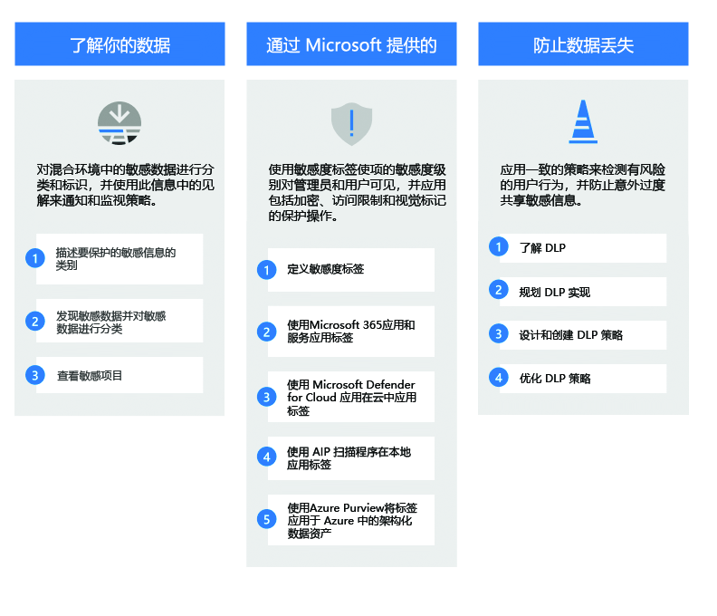
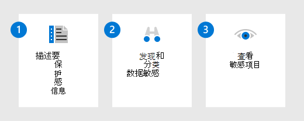
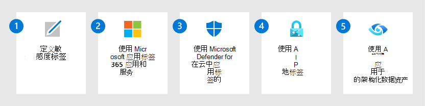
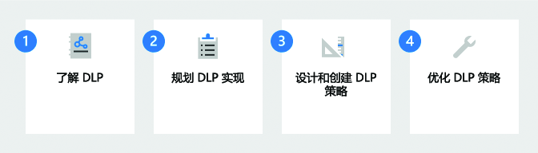

# 部署 Microsoft 信息保护解决方案

>*[Microsoft 365 安全和合规性许可](/office365/servicedescriptions/microsoft-365-service-descriptions/microsoft-365-tenantlevel-services-licensing-guidance/microsoft-365-security-compliance-licensing-guidance)*

你的信息保护策略由业务需求驱动。 许多组织必须遵守法规、法律和业务实践。 此外，组织需要保护专有信息，例如特定项目的数据。

Microsoft 信息保护 (MIP) 提供了可用于实现特定业务目标的框架、流程和功能。 

## Microsoft 信息保护框架

使用 Microsoft 信息保护来帮助你发现、分类、保护和管理敏感信息，无论其身在何处或去到哪里。

观看下面的 Ignite 会话，了解这些功能如何相互支持和构建：[使用 Microsoft 信息保护了解你的数据、保护你的数据，并防止数据丢失](https://myignite.microsoft.com/archives/IG20-OD273)。

有关管理数据的信息，请参阅 [Microsoft 365 中的 Microsoft 信息管理](manage-Information-governance.md)。

## 授权

MIP 功能包含在 Microsoft 365 合规中心中。 授权要求甚至可能在功能中有所不同，具体取决于配置选项。 若要确定许可要求和选项，请参阅 [Microsoft 365 安全性与合规性指南](/office365/servicedescriptions/microsoft-365-service-descriptions/microsoft-365-tenantlevel-services-licensing-guidance/microsoft-365-security-compliance-licensing-guidance)。

## 了解你的数据

对于许多组织来说，了解敏感数据所在的位置通常是最大的挑战。 MIP 数据分类可帮助你发现并准确分类组织创建的不断增加的数据。 图形表示形式可帮助你深入了解此数据，以便你可以设置和监控策略以保护并管理这些数据。

|步骤|说明|更多信息|
|:---|:----------|:---------------|
|1| 描述要保护的敏感信息的类别。    你已了解哪些类型的信息对组织最有价值，哪些类型没有。 与利益干系人合作来描述这些类别，因为这是你的起点。 | [了解敏感信息类型](sensitive-information-type-learn-about.md) 
 [了解可训练的分类器](classifier-learn-about.md)|
|2| 发现敏感数据并进行分类。    可以使用许多不同的方法查找项目中的敏感数据，这些方法包括默认 DLP 策略、用户手动标记以及使用敏感信息类型或机器学习的自动模式识别。 | [了解数据分类](data-classification-overview.md) 
 [视频：合规中心中的数据分类](https://www.microsoft.com/videoplayer/embed/RE4vx8x)|
|3| 查看敏感项目。     使用内容资源管理器和活动资源管理器对敏感项目以及用户对这些项目采取的操作进行更深入的分析。| [内容资源管理器入门](data-classification-content-explorer.md) 
 [活动资源管理器入门](data-classification-activity-explorer.md)|

## 保护数据

使用了解敏感数据所在位置的信息来帮助你更有效地保护敏感数据。 但无需等待，你可以结合使用手动、默认和自动标记来立即开始保护数据。 然后，使用上一部分中的[内容资源管理器](data-classification-content-explorer.md)和[活动资源管理器](data-classification-activity-explorer.md)确认标记了哪些项目以及标签的使用方式。

|步骤|说明|更多信息|
|:---|-----------|:---------------|
| 1|定义将保护组织数据的[敏感度标签](sensitivity-labels.md)和策略。   除了标识内容的敏感度外，这些标签还可以应用保护操作，如页眉、页脚、水印和加密。 | [开始使用敏感度标签](get-started-with-sensitivity-labels.md)    [创建和配置敏感度标签及其策略](create-sensitivity-labels.md)    [通过敏感度标签应用加密，从而限制对内容的访问](encryption-sensitivity-labels.md) |
| 2|为 Microsoft 365 应用和服务标记和保护项目。   Microsoft 365 Word、Excel、PowerPoint、Outlook 以及包括 SharePoint、OneDrive 网站和 Microsoft 365 组的容器支持敏感度标签。 结合使用标记方法，如手动标记、自动标记、默认标签和强制标记。| [管理 Office 应用中的敏感度标签](sensitivity-labels-office-apps.md)    [启用 SharePoint 和 OneDrive 中 Office 文件的敏感度标签](sensitivity-labels-sharepoint-onedrive-files.md)    [为使用敏感度标签加密的文件启用共同创作](sensitivity-labels-coauthoring.md)    [将敏感度标签自动应用于内容](apply-sensitivity-label-automatically.md)    [将敏感度标签与 Microsoft Teams、Microsoft 365 组和 SharePoint 网站配合使用](sensitivity-labels-teams-groups-sites.md)    [使用敏感度标签设置 SharePoint 和 OneDrive 中网站和文档的默认共享链接](sensitivity-labels-default-sharing-link.md)    [在 Microsoft SharePoint Syntex 中向模型应用保留标签](/microsoft-365/contentunderstanding/apply-a-sensitivity-label-to-a-model)    [如何在 Power BI 中应用敏感度标签](/power-bi/admin/service-security-sensitivity-label-overview) |
|3|使用 [Microsoft Defender for Cloud Apps](/cloud-app-security/what-is-cloud-app-security) 和敏感度标签，发现、标记和保护驻留在云中数据存储中的敏感项目。| [发现、分类、标记和保护存储在云中的管控和敏感数据](/cloud-app-security/best-practices#discover-classify-label-and-protect-regulated-and-sensitive-data-stored-in-the-cloud)|
|4|通过使用敏感度标签部署 [Azure 信息保护统一标签扫描程序](/azure/information-protection/deploy-aip-scanner) ，发现、标记和保护驻留在本地数据存储中的敏感项目。| [配置和安装 Azure 信息保护统一标记扫描器](/azure/information-protection/deploy-aip-scanner-configure-install)|
|5|使用 [Azure Purview](/azure/purview/overview)将敏感度标签扩展到 Azure，来为 Azure Blob 存储、Azure 文件、Azure Data Lake Storage Gen1 和 Azure Data Lake Storage Gen12 发现和标记项目。 | [在 Azure Purview 中贴标签](/azure/purview/create-sensitivity-label)|

如果你是想要将敏感度标签扩展到业务范围应用或第三方 SaaS 应用的开发人员，请参阅 [Microsoft 信息保护 （MIP） SDK 设置和配置](/information-protection/develop/setup-configure-mip)。 

### 其他保护功能

Microsoft 365 包含有助于保护数据的其他功能。 并非每个客户都需要这些功能，而且一些功能可能会被较新版本取代。

使用[Microsoft 365 中的 Microsoft 信息保护](information-protection.md)页面，查看保护功能的完整列表。

## 防止数据丢失

部署数据丢失防护 (DLP) 策略来管理和防止应用和服务之间的不当共享、传输或对敏感数据的使用。 这些策略可帮助用户在使用敏感数据时做出正确的决策并采取正确的操作。

|步骤|说明|更多信息|
|:---|:----------|:---------------|
|1|了解 DLP。    组织掌控其敏感信息，例如财务数据、专有数据、信用卡号、健康记录或社会保险号码。 为了帮助保护此敏感数据并降低风险，他们需要一种方法来防止其用户与不应拥有该数据的人进行不当共享。 这种做法称为数据丢失防护 (DLP)。| [了解数据丢失防护](dlp-learn-about-dlp.md)|
|2|规划 DLP 实施。    每个组织都将以不同的方式规划并实施数据丢失防护 (DLP)，因为每个组织的业务需求、目标、资源和情况对于他们来说都是独一无二的。 但是，所有成功的 DLP 实施都有一些共同的元素。 | [数据丢失预防计划](dlp-overview-plan-for-dlp.md)|
|3|设计和创建 DLP 策略。    创建数据丢失防护 (DLP) 策略简单快速，但如果要进行大量优化，则让策略生成预期结果可能非常耗时。 与只通过试错进行优化相比，在实施策略之前花些时间设计策略会使你更快地获得所需的结果，并减少意外问题。| [设计 DLP 策略](dlp-policy-design.md) 
 [DLP 策略参考](dlp-policy-reference.md) 
[创建、测试和优化 DLP 策略](create-test-tune-dlp-policy.md)|
|4|优化 DLP 策略。    部署 DLP 策略后，你将看到它满足预期目的的程度。 使用该信息调整策略设置以提高性能。 | [创建、测试和优化 DLP 策略](create-test-tune-dlp-policy.md)|

## 培训资源

面向顾问和管理员的学习模块：

- [Microsoft 365 信息保护和管理简介](/learn/modules/m365-compliance-information-governance)
- [对数据进行分类，以便保护和管理](/learn/modules/m365-compliance-information-classify-data)
- [Microsoft 365 中的信息保护](/learn/modules/m365-compliance-information-protect-information)
- [Microsoft 365 中的数据丢失防护](/learn/modules/m365-compliance-information-prevent-data-loss)

若要帮助培训用户应用和使用为其配置的敏感度标签，请参阅 [敏感度标签的最终用户文档](get-started-with-sensitivity-labels.md#end-user-documentation-for-sensitivity-labels)。

为 Teams 部署数据丢失防护策略时，你可能会发现以下最终用户指南作为此技术的简介非常有用，其中可能显示一些潜在消息： [有关数据丢失防护 （DLP） 和通信合规性策略的 Teams 消息](https://support.microsoft.com/office/teams-messages-about-data-loss-prevention-dlp-and-communication-compliance-policies-c5631c3f-f61b-4306-a6ac-6603d9fc5ff0)。
