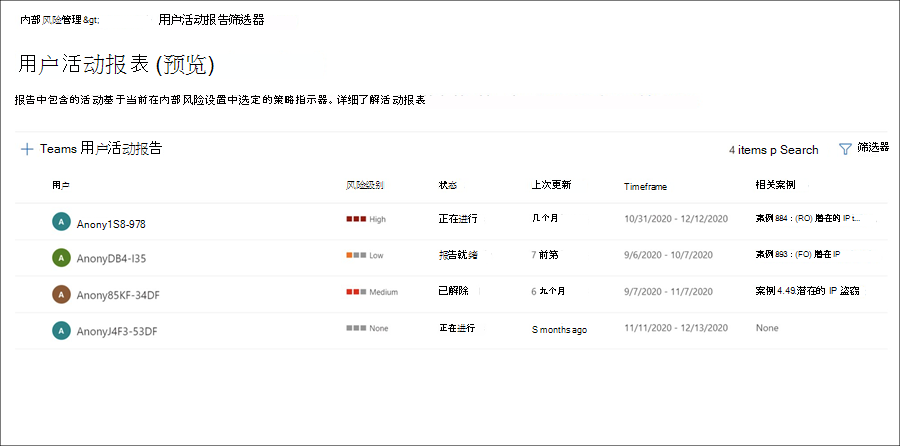
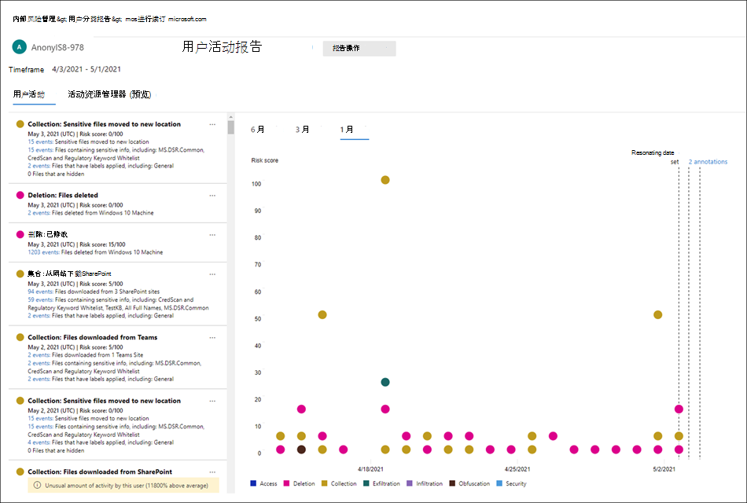
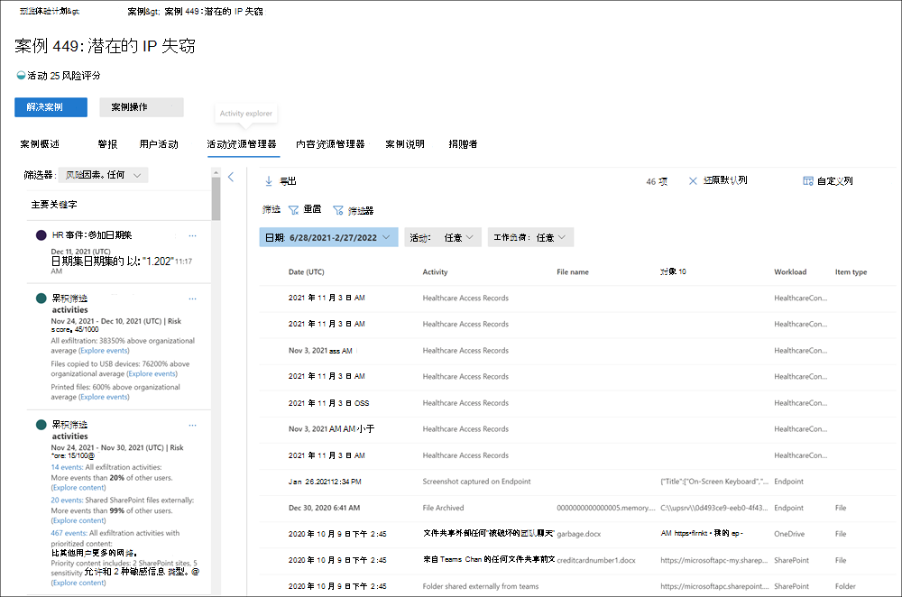
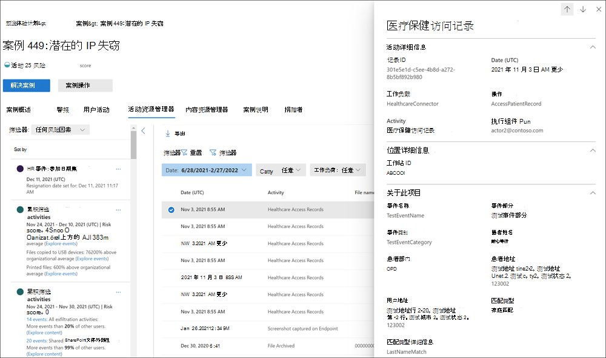

# 调查内部风险管理活动

调查有风险的用户活动是最大程度地降低组织内部风险的重要第一步。 这些风险可能是从内部风险管理策略生成警报的活动，或者是从策略检测到的活动生成风险，但不立即为用户创建内部风险管理警报。 可以使用用户活动报表或警报仪表板， (预览 **) 调查这些****类型的活动**。

## 用户活动报表 (预览) 

用户活动报告允许你检查指定时段内特定用户的活动，而无需将其临时或显式分配给内部风险管理策略。 在大多数内部风险管理方案中，用户明确在策略中定义，并且他们可能具有策略警报 (具体取决于触发事件) 以及与活动关联的风险评分。 但在某些情况下，你可能想要检查未在策略中显式定义的用户的活动。 这些活动可能适用于你已收到有关用户和可能存在风险的活动的提示的用户，或者通常不需要分配给内部风险管理策略的用户。

在内部风险管理中心页面上配置 **设置后，** 将检测到与所选指标关联的风险活动的用户活动。 不需要为用户活动报告配置策略来检测和报告组织中用户的风险活动。 用户活动报告中包括的活动不需要触发事件来显示活动。 此配置意味着用户的所有检测到的活动都可供查看，无论活动是否触发事件或是否创建警报。 报告是按用户创建的，可以包含自定义 90 天期间的所有活动。 不支持同一用户的多个报告。

在检查用户的活动后，调查人员可以以恶意方式消除个别活动，与其他调查人员共享或通过电子邮件发送指向报告的链接，或者选择将用户临时或显式分配给内部风险管理策略。 必须将用户分配到预览体验 *成员风险管理研究人员* 角色组，以查看" **用户活动报告"** 页。  

可通过在内部风险管理 **概述页上的**"调查用户活动"部分选择"管理报告 **"开始** 操作。 若要查看用户的活动，请首先选择"创建用户 **活动** 报告"，并填写"新建用户活动报告"窗格中 **的以下** 字段：

- **用户**：按姓名或电子邮件地址搜索用户
- **开始日期**：使用日历控件选择用户活动的开始日期。
- **结束日期**：使用日历控件选择用户活动的结束日期。 选择的结束日期必须大于所选开始日期的两天，且自所选开始日期起不超过 90 天。
新报告通常需要 10 小时才能准备好审阅。 报告准备就绪后，你将在"用户活动报告"*页上的*"状态"列中看到"报告已就绪"。 选择用户以查看详细报告：

所选 **用户的用户** 活动报告包含" **用户活动"** 和" **活动资源管理器"** 选项卡：

- **用户活动**：使用此图表视图可调查活动并查看序列中发生的潜在活动。 此选项卡的结构用于快速查看案例，包括所有活动的历史时间线、活动详细信息、用户在这种情况下的当前风险评分、风险事件的顺序，以及有助于调查工作的筛选控件。
- **活动资源管理器****："活动资源管理器**"选项卡为风险调查人员提供了一个全面的分析工具，该工具提供有关活动的详细信息。 使用活动资源管理器，审阅者可以快速查看检测到的风险活动的日程表，并识别并筛选与警报关联的所有风险活动。 若要了解有关使用活动资源管理器的更多信息，请参阅本文稍后介绍的活动资源管理器部分。

## 警报仪表板

内部风险管理警报是由内部风险管理策略中定义的风险指标自动生成的。 这些警报使合规分析员和调查员对当前的风险状况有一个全面的了解，并使贵组织能够对发现的风险进行分类并采取措施。 默认情况下，策略会生成一定数量的低、中和高严重性警报，但你可以增加或减少警报量以满足你的需求。 此外，可以使用策略 [创建工具](insider-risk-management-settings.md#indicator-level-settings-preview) 创建新策略时配置策略指示器的警报阈值。

请查看 [Insider Risk Management Alerts Triage Experience](https://www.youtube.com/watch?v=KgmpxBLJLPI) 视频，大致了解警报如何为风险活动提供详细信息、上下文和相关内容，以及如何提高调查过程效率。

内部风险 **警报仪表板** 允许你查看和操作由内部风险策略生成的警报。 每个报表小部件显示最近 30 天的信息。

- **需要检查的警报** 总数：列出了需要审阅和会审的警报总数，包括按警报严重性分类。
- **打开过去 30** 天的警报：过去 30 天内由策略匹配创建的警报总数，按高、中和低警报严重性级别排序。
- **解决警报的平均时间**：有用的警报统计信息摘要：
  - 解决高严重性警报的平均时间，以小时、天或月列出。
  - 解决中等严重性警报的平均时间，以小时、天或月列出。
  - 解决低严重性警报的平均时间，以小时、天或月列出。

> [!NOTE]
> 预览体验计划风险管理使用内置警报限制来帮助保护和优化风险调查和审阅体验。 此限制可以防止可能导致策略警报过载的问题，例如配置不当的数据连接器或 DLP 策略。 因此，为用户显示新的警报可能会存在延迟。

## 警报状态和严重性

你可以将警报分类为以下状态之一：

- **已** 确认：已确认警报并分配给新案例或现有案例。
- **已消除**：在会审过程中消除的警报为恶意警报。
- **需要审阅**：尚未执行会审操作的新警报。
- **已** 解决：属于已关闭和已解决案例的警报。

警报风险评分从多个风险活动指示器自动计算。 这些指标包括风险活动的类型、活动发生的数量和频率、用户风险活动的历史记录，以及增加可能提高活动严重程度的活动风险。 警报风险分数推动针对每个警报的编程严重性级别分配，且无法自定义。 如果警报保持未重试状态，并且风险活动继续计入警报，则风险严重性级别可能会增加。 风险分析师和研究人员可以使用警报风险严重性来帮助根据组织的风险策略和标准对警报进行会审。

警报风险严重性级别为：

- **高严重性**：警报的活动和指示器会带来高风险。 相关的风险活动是严重的、重复的，并且对于其他重大风险因素影响很大。
- **中等严重性**：警报的活动和指示器会带来中等风险。 关联的风险活动适中、频繁，且与其他风险因素具有一些相关性。
- **低严重性**：警报的活动和指示器构成较小的风险。 关联的风险活动是次要的、不频繁发生，并且不会与其他重大风险因素相关。

## 筛选警报仪表板上的警报

查看大型警报队列可能困难，具体取决于组织中活动的预览体验计划风险管理策略的数量和类型。 使用警报筛选器可帮助分析员和研究人员按多个属性对警报进行排序。 若要筛选警报仪表板上的 **警报，****请选择筛选器控件**。 可以按一个或多个属性筛选警报：

- **状态**：选择一个或多个状态值以筛选警报列表。 这些选项包括 *、**关闭*、*需求审阅* 以及 *解决方案*。
- **严重性：** 选择一个或多个警报风险严重性级别以筛选警报列表。 这些选项包括 *高*、*中* 和 *低*。
- **检测到的时间**：选择创建警报的开始日期和结束日期。 此筛选器搜索开始日期 UTC 00：00 和结束日期 UTC 00：00 之间的警报。 若要筛选特定日期的警报，请在"开始日期"字段中输入当天的日期，在"结束日期"字段中输入第二 **天的日期。**
- **策略**：选择一个或多个策略以筛选所选策略生成的警报。

## 警报仪表板上的搜索警报

若要搜索特定字词的警报名称，请选择 **搜索** 并键入要搜索的字词。 搜索结果将显示任何包含搜索中定义的单词的策略警报。

## 消除预览版 (多个) 

这有助于为分析员和研究人员节省会审时间，以立即立即消除多个警报。 "**消除警报**"命令栏选项允许你在仪表板上选择一个或多个具有"需要评审"状态的警报，并快速消除这些警报，就像在会审过程中适当一样。 可以选择一次最多消除 400 个警报。

若要消除内部风险警报，请完成以下步骤：

1. In the [Microsoft 365 合规中心，](https://compliance.microsoft.com)go to **Insider risk management** and select the **Alerts** tab.
2. 在 **警报仪表板上**，选择 (或) 需要审阅状态的警报。 
3. 在警报命令栏上，选择 **消除警报**。
4. 在 **"消除警报详细信息** "窗格中，你可以查看与所选警报关联的用户和策略详细信息。
5. 选择 **"消除警报**"以将警报解析为恶意警报，或选择"取消"关闭详细信息窗格而不消除警报。

## 会审警报

若要对内部风险警报进行会审，请完成以下步骤：

1. In the [Microsoft 365 合规中心，](https://compliance.microsoft.com)go to **Insider risk management** and select the **Alerts** tab.
2. 在 **警报仪表板上**，选择要会审的警报。
3. 在 **"警报详细信息** "页上，你可以查看有关警报的信息，并可以确认警报并创建新案例、确认警报并添加到现有案例，或者消除警报。 此页面还包括警报的当前状态和警报风险严重性级别，列为"高、中"或"低"。 如果警报未分类，严重性级别可能会随着时间的推移而增加或减小。

    警报详细信息页面上 **的** 选项卡提供有关警报的详细信息：
    - **摘要：** 此选项卡包含有关警报的常规信息。
        - **触发事件是什么？：** 显示提示策略开始为用户活动分配风险评分的最新触发事件。
        - **生成此警报的活动**：显示活动评估期间导致生成警报的风险活动和策略匹配最高。
        - **此警报中活动的风险见解**：显示警报的任何风险见解的数量。 例如，如果警报包含序列活动、累积的 exfiltration 活动风险、包含不允许域的事件的活动、包含具有优先级内容的事件的活动，或者用户不常见的活动。
        - **用户详细信息**：显示有关分配给警报的用户的常规信息。 如果启用匿名处理，则用户名、电子邮件地址、别名和组织字段将进行匿名处理。
        - **警报详细信息**：包括自生成警报以来的时长、列出生成警报的策略以及从警报生成的情况。 对于新警报，" **案例"** 字段显示"无"。
        - **检测到的内容**：包括与警报的风险活动相关的内容，并按关键区域汇总活动事件。 选择活动链接将打开活动资源管理器并显示有关活动的更多详细信息。
    - **活动资源管理器**：此选项卡将打开 **活动资源管理器**。 有关详细信息，请参阅本文的下一节。

## 活动资源管理器

> [!NOTE]
> 在组织中提供此功能后，活动资源管理器可用于具有触发事件的用户的警报管理区域。

活动资源管理器为风险研究人员和分析员提供了一个全面的分析工具，该工具提供有关警报的详细信息。 使用活动资源管理器，审阅者可以快速查看检测到的风险活动的日程表，并识别并筛选与警报关联的所有风险活动。 

若要在"活动资源管理器"上筛选列信息警报，请选择"筛选器"控件。 可以按警报的详细信息窗格中列出的一个或多个属性筛选通知。 活动资源管理器还支持可自定义的列，以帮助研究人员和分析师将仪表板集中在他们最重要的信息上。

使用"活动范围"和"风险见解"筛选器显示和排序以下领域的活动和见解。

- **活动范围筛选器**：筛选用户的所有已评分活动。
    - 此用户的所有得分活动
    - 仅此警报中的已评分活动

- **风险见解筛选器**：适用于分配风险评分的所有策略的活动筛选器。
    - 累计 exfiltration 活动
    - 包含具有优先级内容的事件
    - 包含包含不允许域的事件
    - 序列活动
    - 异常活动

若要使用 **活动资源管理器**，请完成以下步骤：

1. In the Microsoft 365 合规中心， go to **Insider risk management** and select the **Alerts** tab.
2. 在 **警报仪表板上**，选择要会审的警报。
3. 在警报 **详细信息窗格中，选择** 打开 **展开的视图**。
4. 在所选警报的页面上，选择" **活动资源管理器"** 选项卡。

在活动资源管理器中查看活动时，研究人员和分析师可以选择特定活动并打开活动详细信息窗格。 该窗格显示有关调查人员和分析人员可在警报会审过程中使用的活动的详细信息。 详细信息可能会提供警报的上下文，并有助于确定触发警报的风险活动的完整范围。

从活动时间线选择活动的事件时，资源管理器中显示的活动数可能与时间线中列出的活动事件数不匹配。 出现此差异的原因的示例：

- **累积排查** 检测：累积筛选检测可分析事件日志，但应用包括取消复制类似活动的模型来计算累积的筛选风险。 此外，如果对现有策略或设置进行更改，活动资源管理器中显示的活动数也可能有所不同。 例如，如果在创建策略并发生活动匹配后修改允许/不允许的域或添加新的文件类型排除项，则累积的 exfiltration 检测活动将不同于策略或设置更改之前的结果。 累积 exfiltration 检测活动总数基于计算时的策略和设置配置，不包括策略和设置更改之前的活动
- **发送给外部收件人的电子邮件**：发送给外部收件人的电子邮件活动根据发送的电子邮件数（可能与活动事件日志不匹配）分配风险评分。

## 为警报创建案例

在审核和会审警报时，您可以创建一个新案例以进一步调查风险活动。 若要为警报创建案例，请按照以下步骤操作：

1. In the [Microsoft 365 合规中心，](https://compliance.microsoft.com)go to **Insider risk management** and select the **Alerts** tab.
2. 在 **警报仪表板上**，选择要确认的警报并创建一个新案例。
3. 在警报 **详细信息窗格中，选择****操作**  >  **确认警报&创建案例**。
4. 在" **确认警报并创建内部** 风险案例"对话框中，输入案例名称，选择要添加为参与者的用户，并根据需要添加注释。 注释会自动作为案例注释添加到案例。
5. 选择 **"创建** 案例"创建新案例，或选择" **取消** "关闭对话框而不创建案例。

创建案例后，研究人员和分析师可以管理和处理该案例。 有关详细信息，请参阅预览体验 [成员风险管理案例](insider-risk-management-cases.md) 文章。

## 获取有关管理内部风险警报队列的帮助

查看、调查和操作内部风险警报是最大程度地降低组织中内部风险的重要部分。 快速采取措施以最大限度地减少这些风险的影响可能会为组织节省时间、金钱以及法规或法律后果。 在此修正过程中，查看警报的第一步对于许多分析师和调查人员来说似乎是最困难的任务。 根据你的环境，你在处理内部风险警报时可能会面临一些次要障碍。 查看以下建议并了解如何优化警报审阅过程。

### 要审阅的警报过多

因内部风险管理策略产生的警报数量而不知所措可能会让人感到沮丧。 可以使用简单的步骤快速解决警报数量，具体取决于你接收到的警报卷的类型。 您可能会收到太多有效警报，或者收到太多过时的低风险警报。 请考虑执行以下操作：

- **调整内部风险策略**：选择和配置正确的内部风险策略是解决警报类型和数量的最基本方法。 从相应的 [策略模板开始](insider-risk-management-policies.md#policy-templates) 有助于关注你将看到的风险活动和警报的类型。 可能会影响警报量的其他因素是范围内用户和组的大小，以及具有优先级 [的内容和频道](insider-risk-management-policies.md#prioritize-content-in-policies)。 请考虑调整策略，以将这些方面细化到对组织最重要的方面。
- **修改内部风险设置**：内部风险设置包括各种配置选项，这些选项会影响你将收到的警报数量和类型。 其中包括策略 [指示器、](insider-risk-management-settings.md#indicators)指示器 [阈值](insider-risk-management-settings.md#indicator-level-settings-preview)和策略 [时间范围的设置](insider-risk-management-settings.md#policy-timeframes)。 请考虑配置 [智能检测](insider-risk-management-settings.md#intelligent-detections) 选项以排除特定文件类型，在策略报告活动警报之前定义最小阈值，以及将警报量配置更改为较低设置。
- **批量删除警报（如果适用**）：这有助于为分析员和研究人员节省会审时间，立即立即消除 [多个](insider-risk-management-activities.md#dismiss-multiple-alerts-preview) 警报。 可以选择一次最多消除 400 个警报。

### 不熟悉警报会审过程

调查和处理内部风险管理中的警报很简单：

1. **查看 [警报仪表板](insider-risk-management-activities.md#alert-dashboard) ，查看状态为"需要评审"的警报**。 [按](insider-risk-management-activities.md#filter-alerts-on-the-alert-dashboard) 警报 *状态进行* 筛选（如果需要）以帮助找到这些类型的警报。
2. **从严重性最高的警报开始**。 [根据需要](insider-risk-management-activities.md#filter-alerts-on-the-alert-dashboard) 按警报 *严重性* 进行筛选，以帮助找到这些类型的警报。
3. **选择警报以发现详细信息并查看警报详细信息**。 如果需要，使用 [活动资源管理器](insider-risk-management-activities.md#activity-explorer) 查看关联的风险行为的时间线，并确定警报的所有风险活动。
4. **对警报 采取行动**。 你可以确认并 [创建警报](insider-risk-management-activities.md#create-a-case-for-an-alert) 案例，也可以消除并解决警报。

### 我的组织的资源约束

现代工作场所用户通常对时间承担各种责任和需求。 你可以采取一些操作来帮助解决资源约束：

- **首先将分析员和调查人员的工作集中在最高风险警报上**。 根据你的策略，你可能会捕获活动并生成对风险缓解工作造成不同程度潜在影响的警报。 [按严重性筛选](insider-risk-management-activities.md#filter-alerts-on-the-alert-dashboard) 警报，并设置 *高严重性警报的* 优先级。
- **将用户分配为分析员和研究人员**。 将合适的用户分配到适当的角色是内部风险警报审阅流程的一个重要步骤。 确保你已向内部风险管理分析师和内部风险管理研究人员角色组 *分配了适当的* 用户。  
- **使用自动内部风险功能帮助发现风险最高的活动**。 内部风险管理[序列检测和](insider-risk-management-policies.md#sequence-detection-preview)[累积的筛选检测](insider-risk-management-policies.md#cumulative-exfiltration-detection-preview)功能可帮助你快速发现更难在组织中查找风险。 请考虑微调风险[评分分数、](insider-risk-management-settings.md#indicators)文件类型排除项、域[和策略的最低](insider-risk-management-settings.md#indicator-level-settings-preview)指示器阈值设置。
