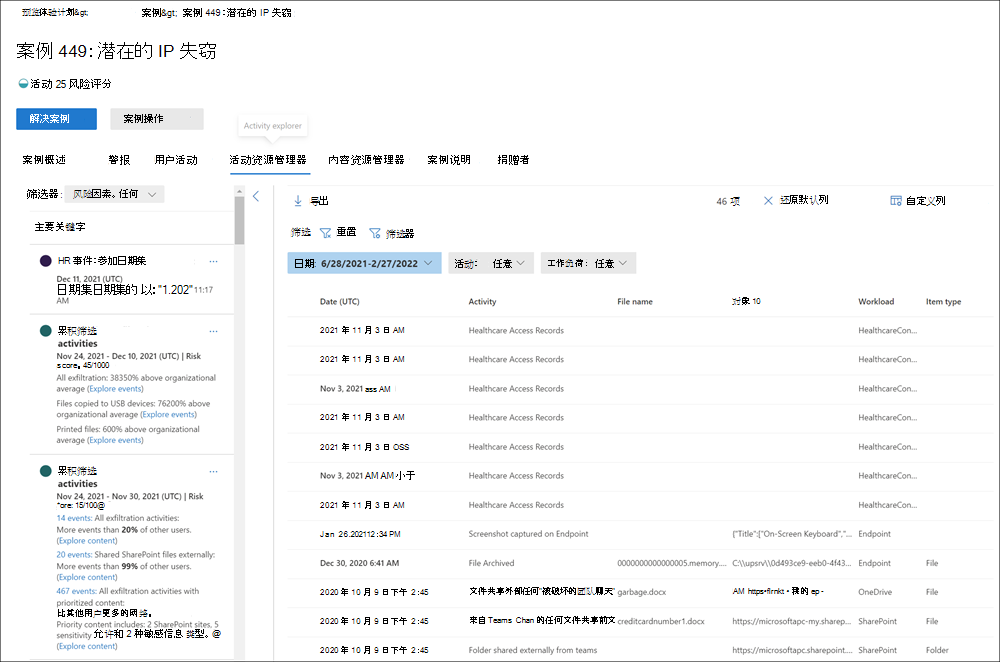

# 内部风险管理警报

内部风险管理警报是由内部风险管理策略中定义的风险指标自动生成的。 这些警报使合规分析员和调查员对当前的风险状况有一个全面的了解，并使贵组织能够对发现的风险进行分类并采取措施。 默认情况下，策略会生成一定数量的低、中和高严重性警报，但你可以增加或减少警报量以满足你的需求。 此外，可以使用策略向导 [创建新](insider-risk-management-settings.md#indicator-level-settings-preview) 策略时配置策略指示器的警报阈值。

请查看 [Insider Risk Management Alerts Triage Experience](https://www.youtube.com/watch?v=KgmpxBLJLPI) 视频，大致了解警报如何为风险活动提供详细信息、上下文和相关内容，以及如何提高调查过程效率。

## 警报仪表板

内部风险 **警报仪表板** 允许你查看和操作由内部风险策略生成的警报。 每个报表小部件显示最近 30 天的信息。

- **需要检查的警报** 总数：列出了需要审阅和会审的警报总数，包括按警报严重性分类。
- **打开过去 30** 天的警报：过去 30 天内由策略匹配创建的警报总数，按高、中和低警报严重性级别排序。
- **解决警报的平均时间**：有用的警报统计信息摘要：
    - 解决高严重性警报的平均时间，以小时、天或月列出。
    - 解决中等严重性警报的平均时间，以小时、天或月列出。
    - 解决低严重性警报的平均时间，以小时、天或月列出。

>[!NOTE]
>预览体验计划风险管理使用内置警报限制来帮助保护和优化风险调查和审阅体验。 此限制可以防止可能导致策略警报过载的问题，例如配置不当的数据连接器或 DLP 策略。 因此，为用户显示新的警报可能会存在延迟。

## 警报状态和严重性

你可以将警报分类为以下状态之一：

- **已** 确认：已确认警报并分配给新案例或现有案例。
- **已消除**：在会审过程中消除的警报是无害的。
- **需要审阅**：尚未执行会审操作的新警报。
- **已** 解决：属于已关闭和已解决案例的警报。

警报风险评分从多个风险活动指示器自动计算。 这些指标包括风险活动的类型、活动发生的数量和频率、用户风险活动的历史记录，以及增加可能提高活动严重程度的活动风险。 警报风险分数推动针对每个警报的编程严重性级别分配，且无法自定义。 如果警报保持未重试状态，并且风险活动继续计入警报，则风险严重性级别可能会增加。 风险分析师和研究人员可以使用警报风险严重性来帮助根据组织的风险策略和标准对警报进行会审。

警报风险严重性级别为：

- **高严重性**：警报的活动和指示器会带来高风险。 相关的风险活动是严重的、重复的，并且对于其他重大风险因素影响很大。
- **中等严重性**：警报的活动和指示器会带来中等风险。 关联的风险活动适中、频繁，且与其他风险因素具有一些相关性。
- **低严重性**：警报的活动和指示器构成较小的风险。 关联的风险活动是次要的、不频繁发生，并且不会与其他重大风险因素相关。

## 筛选警报仪表板上的警报

查看大型警报队列可能困难，具体取决于组织中活动的预览体验计划风险管理策略的数量和类型。 使用警报筛选器可帮助分析员和研究人员按多个属性对警报进行排序。 若要筛选警报仪表板上的 **警报，****请选择筛选器控件**。 可以按一个或多个属性筛选警报：

- **状态**：选择一个或多个状态值以筛选警报列表。 这些选项包括 *、**关闭*、*需求审阅* 以及 *解决方案*。
- **严重性：** 选择一个或多个警报风险严重性级别以筛选警报列表。 这些选项包括 *高*、*中* 和 *低*。
- **检测到的时间**：选择创建警报的开始日期和结束日期。
- **策略**：选择一个或多个策略以筛选所选策略生成的警报。

## 警报仪表板上的搜索警报

若要搜索特定字词的警报名称，请选择 **搜索** 并键入要搜索的字词。 搜索结果将显示任何包含搜索中定义的单词的策略警报。

## 会审警报

若要对内部风险警报进行会审，请完成以下步骤：

1. 在 [Microsoft 365](https://compliance.microsoft.com)合规中心中，转到 **"内部风险管理** "并选择 **"警报"** 选项卡。
2. 在 **警报仪表板上**，选择要会审的警报。
3. 在 **警报详细信息窗格中**，你可以查看以下选项卡并会审警报：
    - **摘要：** 此选项卡包含有关警报的常规信息，并允许你确认警报并创建新案例或允许你消除警报。 它包括警报的当前状态和警报风险严重性级别，列为 *高*、*中或**低*。 如果警报未分类，严重性级别可能会随着时间的推移增加或减小。
        - **预览 (** 发生的情况：) 活动评估期间显示前三个风险活动和策略匹配，包括与活动关联的违反类型和发生次数。
        - **用户详细信息**：显示有关分配给警报的用户的常规信息。 如果启用匿名处理，则用户名、电子邮件地址、别名和组织字段将进行匿名处理。
        - **警报详细信息**：包括自生成警报以来的时长、列出生成警报的策略以及从警报生成的情况。 对于新警报，" **案例"** 字段显示"无"。
        - **检测到 (预览) ：** 包括与警报的风险活动关联的内容，并按关键区域汇总活动事件。 选择活动链接将打开活动资源管理器并显示有关活动的其他详细信息。
    - **用户活动**：此选项卡显示与警报关联的用户的活动历史记录。 此历史记录包括与分配给此警报的策略的模板中定义的风险指示器相关的其他警报和活动。 此历史记录允许风险分析师和研究人员在会审过程中考虑员工过去的任何风险行为。
    - **操作**：每个警报都提供以下操作：
        - **打开展开的视图**：打开 **活动资源管理器** 仪表板。
        - **确认并创建案例**：使用此操作确认并创建与用户关联的所有警报的新案例。 此操作会自动将警报状态更改为 *"已确认"。*
        - **消除警报**：使用此操作可消除警报。 此操作将警报状态更改为已 *解决*。

## 活动资源管理器 (预览) 

>[!NOTE]
>在组织中提供此功能后，活动资源管理器可用于具有触发事件的用户的警报管理区域。

活动资源管理器为风险研究人员和分析员提供了一个全面的分析工具，该工具提供有关警报的详细信息。 使用活动资源管理器，审阅者可以快速查看检测到的风险活动的日程表，并识别并筛选与警报关联的所有风险活动。 若要筛选活动资源管理器上的警报，请选择"筛选器"控件。 可以按警报的详细信息窗格中列出的一个或多个属性筛选通知。 活动资源管理器还支持可自定义的列，以帮助研究人员和分析师将仪表板集中在他们最重要的信息上。

若要使用 **活动资源管理器**，请完成以下步骤：

1. 在 Microsoft 365 合规中心，转到 **"预览** 体验成员风险管理"并选择 **"警报"** 选项卡。
2. 在 **警报仪表板上**，选择要会审的警报。
3. 在警报 **详细信息窗格中，选择** 打开 **展开的视图**。
4. 在所选警报的页面上，选择" **活动资源管理器"** 选项卡。

在活动资源管理器中查看活动时，研究人员和分析师可以选择特定活动并打开活动详细信息窗格。 该窗格显示有关调查人员和分析人员可在警报会审过程中使用的活动的详细信息。 详细信息可能会提供警报的上下文，并有助于确定触发警报的风险活动的完整范围。

## 为警报创建案例

在审核和会审警报时，您可以创建一个新案例以进一步调查风险活动。 若要为警报创建案例，请按照以下步骤操作：

1. 在 [Microsoft 365](https://compliance.microsoft.com)合规中心中，转到 **"内部风险管理** "并选择 **"警报"** 选项卡。
2. 在 **警报仪表板上**，选择要确认的警报并创建一个新案例。
3. 在警报 **详细信息窗格中，选择****操作**  >  **确认警报&创建案例**。
4. 在" **确认警报并创建内部** 风险案例"对话框中，输入案例名称，选择要添加为参与者的用户，并根据需要添加注释。 注释会自动作为案例注释添加到案例。
5. 选择 **"创建** 案例"创建新案例，或选择" **取消** "关闭对话框而不创建案例。

创建案例后，研究人员和分析师可以管理和处理该案例。 有关详细信息 [，请参阅预览体验成员](insider-risk-management-cases.md) 风险管理案例文章。
