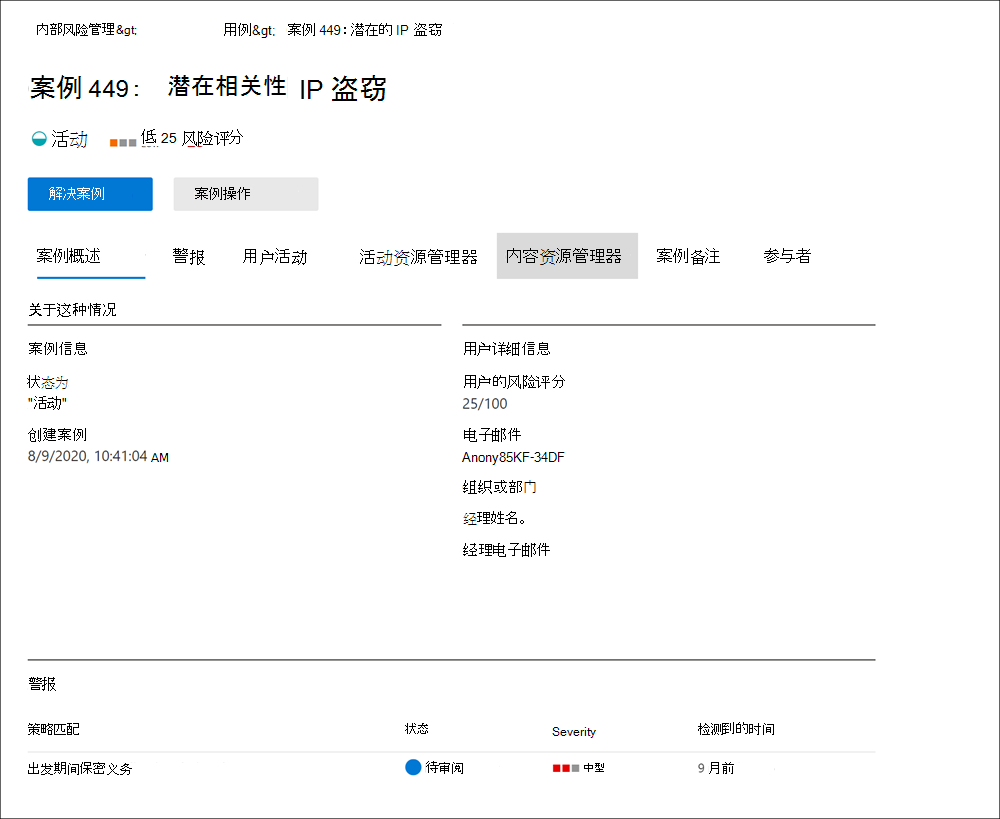
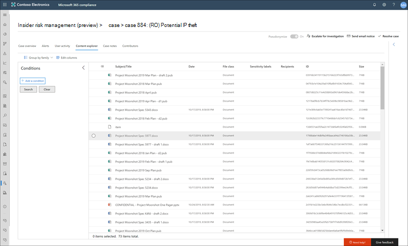

# 内部风险管理案例

案例是内部风险管理的核心，可让你深入调查和处理由策略中定义的风险指标生成的问题。 当需要进一步操作来解决用户的合规性相关问题时，根据警报手动创建案例。 每个案例的范围都为一个用户，并且可以将该用户的多个警报添加到现有案例或新案例。

调查案件的详细信息后，可以采取以下措施：

- 向用户发送通知
- 将案例解析为恶意案例
- 与 ServiceNow 实例或电子邮件收件人共享案例
- 升级调查Advanced eDiscovery案例

查看内部 [风险管理调查和](https://www.youtube.com/watch?v=UONUSmkRC8s) 上报视频，大致了解内部风险管理中如何调查和管理案例。

## 事例仪表板

内部风险管理案例 **仪表板** 允许你查看和操作案例。 仪表板上的每个报表小部件显示最近 30 天的信息。

- **活跃案例**：正在调查的活动事例总数。
- **过去 30** 天内的事例数：创建的事例总数，按"活动"和"已关闭 *"**状态* 排序。
- **统计信息**：活动案例的平均时间，以小时、天或月列出。

事例队列列出了组织的所有活动案例和结束案例，以及以下事例属性的当前状态：

- **案例** 名称：案例名称，在确认警报并创建案例时定义。  
- **Status**： The status of the case， *either Active* or *Closed*.
- **用户**：案例的用户。 如果启用用户名的匿名处理，则显示匿名信息。
- **打开案例** 的时间：打开案例后经过的时间。
- **策略警报总数**：案例中包含的策略匹配数。 如果向案例添加了新警报，此数值可能会增加。
- **Case last updated**： The time that has been passed since there has been added case note or change in the case state.
- **上次更新者**：上次更新案例的内部风险管理分析师或研究人员的姓名。

使用 **搜索** 控件搜索特定文本的大小写名称，并使用事例筛选器按以下属性对事例进行排序：

- 状态
- 案例打开时间、开始日期和结束日期
- 上次更新时间、开始日期和结束日期

## 筛选事例

根据组织中活动的内部风险管理策略的数量和类型，查看大型案例队列可能充满挑战。 使用事例筛选器可帮助分析员和调查人员按多个属性对事例进行排序。 若要筛选事例仪表板上的 **警报，****请选择筛选器控件**。 可以按一个或多个属性筛选事例：

- **状态**：选择一个或多个状态值以筛选案例列表。 选项为 *"活动"* 和"*关闭"。*
- **打开案例** 的时间：选择打开案例的开始日期和结束日期。
- **Last updated**： Select the start and end dates for when the case was updated.

## 调查案例

深入调查内部风险管理警报对于采取正确的纠正措施至关重要。 内部风险管理案例是深入了解用户风险活动历史记录、警报详细信息、风险事件序列，以及探索暴露给风险的内容和消息的中心管理工具。 风险分析师和研究人员还使用案例集中审阅反馈和备注并处理案例解决。

选择案例将打开案例管理工具，该工具可让分析员和调查员深入了解案例的详细信息。

### 案例概述

" **案例概述** "选项卡汇总了风险分析师和研究人员的案例详细信息。 其中包括"关于此案例 **"区域中的** 以下信息

- **状态**：案例的当前状态，即"活动"或"已关闭"。
- **在 上创建** 案例：创建案例的日期和时间。
- **用户的风险评分**：当前计算案例的用户风险级别。 此分数每 24 小时计算一次，并使用与用户关联的所有活动警报的警报风险评分。
- **电子邮件**：案例的用户的电子邮件别名。
- **组织或部门**：用户分配到的组织或部门。
- **经理** 姓名：用户的经理的姓名。
- **经理电子邮件**：用户的经理的电子邮件别名。

" **案例概述** "选项卡还包括一 **个** "警报"部分，其中包括有关与案例关联的策略匹配警报的以下信息：

- **策略匹配**：与用户活动的匹配警报关联的内部风险管理策略的名称。
- **状态**：警报的状态。
- **严重性**：警报的严重性。
- **检测到的时间**：自生成警报以来经过的时间。

### 警报

" **警报"** 选项卡汇总了案例中包含的当前警报。 新警报可能会添加到现有案例，并将在分配时添加到警报队列中。  队列列出了以下警报属性：

- 状态
- Severity
- 检测到的时间

Select an alert from the queue to display the **Alert detail** page.

使用搜索控件搜索特定文本的警报名称，并使用警报筛选器按以下属性对事例进行排序：

- 状态
- Severity
- 检测时间、开始日期和结束日期

使用筛选器控件按多个属性筛选警报，包括：

- **状态**：选择一个或多个状态值以筛选警报列表。 这些选项包括 *、**关闭*、*需求审阅* 以及 *解决方案*。
- **严重性：** 选择一个或多个警报风险严重性级别以筛选警报列表。 这些选项包括 *高*、*中* 和 *低*。
- **检测到的时间**：选择创建警报的开始日期和结束日期。
- **策略**：选择一个或多个策略以筛选所选策略生成的警报。

### 用户活动

“**用户活动**”选项卡是内部风险管理解决方案中用于案例内部风险分析和调查的最强大工具之一。 此选项卡的结构用于快速查看案例，包括所有警报的历史时间线、警报详细信息、用户在这种情况下的当前风险评分、风险事件序列，以及采取有效措施以包含案例风险的控制。

1. **时间筛选器**：默认情况下，在案例确认的最近六个月警报显示在用户活动图表中。 通过选择气泡图上的 *"6* 个月 *、3* 个月"或 *"1* 个月"选项卡，可以轻松筛选图表视图。
2. **风险提醒活动和详细信息**：风险活动在用户活动图表中以彩色气泡显示。 为不同类别的风险创建气泡，而气泡大小与类别的风险活动数成比例。 选择气泡以显示每个风险活动的详细信息。 详细信息包括：
    - 风险活动的 **日期**。
    - 风险 **活动类别**。 例如，*电子邮件 ()* 组织外部发送的附件，或者从 *SharePoint Online* 下载的文件 (文件) 附件。
    - 警报的 **风险分数**。 此分数是警报风险严重性级别的数字分数。
    - 与警报相关联的事件数。 还会提供指向与风险活动关联的每个文件或电子邮件的链接。
3. 风险 **(预览**) ：风险活动按时间顺序是风险调查的一个重要方面，确定这些相关活动是评估组织的总体风险的重要部分。 与相关的警报活动通过连接线显示，以突出显示这些活动与较大的风险区域相关联。 这种活动视图可帮助调查人员逐字地"连接点"可能被视为独立或一次事件的风险活动。 选择序列中的任意气泡以显示所有关联风险活动的详细信息。 详细信息包括：

    - **序列** 的名称。
    - **序列****的日期或** 日期范围。
    - **序列** 的风险评分。 此分数是序列中每个相关活动的组合警报风险严重性级别序列的数字分数。
    - **与序列中每个警报关联的事件数**。 还可链接到与每个风险活动关联的每个文件或电子邮件。
    - **按顺序显示活动**。 将序列显示为气泡图上的突出显示线，并展开警报详细信息以显示序列中的所有相关警报。

4. **风险活动** 图例：在用户活动图表的底部，颜色编码的图例可帮助你快速确定每个警报的风险类别。
5. **风险活动时间：** 列出了与案例关联的所有风险警报的完整时间顺序，包括相应警报气泡中提供的所有详细信息。
6. **案例操作**：用于解决大小写的选项位于案例操作工具栏上。 可以解决案例、向用户发送电子邮件通知，或上报案件以用于数据或用户调查。

### 活动资源管理器 (预览) 

> [!IMPORTANT]
> 在组织中提供此功能后，"活动资源管理器"选项卡可用于具有触发事件的用户案例管理区域。

" **活动资源管理器** "选项卡允许风险分析师和研究人员查看与风险警报相关的活动详细信息。 例如，作为案例管理措施的一部分，研究人员和分析师可能需要查看与案例相关的所有风险活动，了解更多详细信息。 使用 **活动资源管理器**，审阅者可以快速查看检测到的风险活动的日程表，并识别并筛选与警报关联的所有风险活动。

有关活动资源管理器详细信息，请参阅 [预览体验成员风险管理警报](insider-risk-management-activities.md#activity-explorer) 文章。

### 内容资源管理器

" **内容资源管理器** "选项卡允许风险调查人员查看与风险警报相关联的所有单个文件和电子邮件的副本。 例如，如果用户从 SharePoint Online 下载数百个文件时创建了警报，并且活动触发了策略警报，则警报的所有下载文件将被捕获并复制到原始存储源中的内部风险管理案例。

内容资源管理器是一款功能强大的工具，具有基本的高级搜索和筛选功能。 若要详细了解如何使用内容资源管理器，请参阅预览体验 [成员风险管理内容资源管理器](insider-risk-management-content-explorer.md)。

### 案例备注

在 **案例的"** 案例备注"选项卡中，风险分析员和调查人员可以分享有关其案例工作的评论、反馈和见解。 注释将永久添加到案例，在保存注释后无法编辑或删除它。 当通过警报创建案例时，在“**确认警报并创建内部风险案例**”对话框中输入的注释会自动添加为案例注释。

案例笔记仪表板显示创建便笺的用户的备注以及自保存便笺以来经过的时间。 若要搜索特定关键字的"案例注释文本"字段，请使用案例仪表板上的"搜索"按钮并输入特定关键字。

向案例添加注释：

1. In the [Microsoft 365 合规中心，](https://compliance.microsoft.com)go to **Insider risk management** and select the **Cases** tab.
2. 选择一个案例，然后选择" **案例备注"** 选项卡。
3. 选择 **"添加大小写注释"。**
4. 在" **添加大小写注释** "对话框中，键入适用于该案例的注释。 Select **Save** to add the note to the case or select **Cancel** close without saving the note to the case.

### 参与者

在案例的“**参与者**”选项卡中，风险分析员和调查员可以为该案例添加其他审阅者。 默认情况下，分配有 **内部** 风险管理分析师和 **内部** 风险管理研究人员角色的所有用户都列为每个活动案例和已关闭案例的参与者。 只有分配了 **"内部风险管理** 调查人员"角色的用户才有权在内容资源管理器中查看文件和邮件。

可通过将用户添加为参与者来授予对案例的临时访问权。 参与者对特定案例具有所有案例管理控制，以下情况除外：

- 确认或关闭警报的权限
- 编辑案例参与者的权限
- 在内容资源管理器中查看文件和消息的权限

向案例添加参与者：

1. In the [Microsoft 365 合规中心，](https://compliance.microsoft.com)go to **Insider risk management** and select the **Cases** tab.
2. 选择一个案例，然后选择"参与者 **"** 选项卡。
3. 选择 **"添加参与者"。**
4. 在 **"添加参与者** "对话框中，开始键入要添加的用户的名称，然后从建议的用户列表中选择该用户。 此列表从租户订阅Azure Active Directory生成。
5. 选择 **"** 添加"将用户添加为参与者，或 **选择"取消** 关闭对话框"而不将用户添加为参与者。

## 案例操作

风险调查人员可以通过多种方法之一对案例采取措施，具体取决于该案例的严重性、用户的风险历史记录和组织的风险准则。 在某些情况下，您可能需要将案例上报给用户或数据调查，以与组织的其他活动协作，并深入了解风险活动。 内部风险管理与其他合规性解决方案Microsoft 365紧密集成，以帮助你进行端到端解决方案管理。

### 发送电子邮件通知

在大多数情况下，创建内部风险警报的用户操作是无意或无意的。 通过电子邮件向用户发送提醒通知是记录案例审阅和操作的有效方法，也是提醒用户了解公司策略或让他们刷新培训的方法。 通知由你为内部风险管理基础结构 [创建的通知](insider-risk-management-notices.md) 模板生成。

必须记住，向用户 ***** 发送电子邮件通知不会将情况解析为 _Closed*。 在某些情况下，在向用户发送通知以查找更多风险活动而不打开新案例后，您可能需要保持案例为打开状态。 如果你希望在发送通知后解决案例，则必须在发送通知后选择“**解决案件**”作为后续步骤。

若要向分配给案例的用户发送通知，请执行以下操作：

1. In the [Microsoft 365 合规中心，](https://compliance.microsoft.com)go to **Insider risk management** and select the **Cases** tab.
2. 选择一个案例，然后选择案例 **操作** 工具栏上的"发送电子邮件通知"按钮。
3. 在 **"发送电子邮件通知"对话框中** ，选择" **选择** 通知模板"下拉列表控件以选择通知的通知模板。 此选择会预填充通知上的其他字段。
4. 查看通知字段并在适当时进行更新。 此处输入的值将替代模板上的值。
5. 选择 **"** 发送"将通知发送给用户，或选择 **"取消** "关闭对话框，而不向用户发送通知。 所有已发送的通知将添加到"案例笔记"仪表板上的 **"案例笔记"** 队列中。

### 升级以便进行调查

在需要针对用户的风险活动进行其他法律审查的情况下，升级此案例以用于用户调查。 此升级将在你的 Microsoft 365 组织中打开新的高级电子数据展示案例。 高级电子数据展示提供了端到端的工作流程，可用于保留、收集、审阅、分析和导出响应组织的内部和外部法律调查的内容。 它帮助法律团队管理整个法定保留通知工作流，与案例涉及的保管人进行沟通。 在根据内部风险管理案例创建的高级电子数据展示案例中，将审阅者指定为保管人可以帮助法律团队采取适当的措施并管理内容的保留。 若要了解有关高级电子数据展示案例的详细信息，请参阅 [Microsoft 365 中的高级电子数据展示概述](overview-ediscovery-20.md)。

将案例上报给用户调查：

1. In the [Microsoft 365 合规中心，](https://compliance.microsoft.com)go to **Insider risk management** and select the **Cases** tab.
2. 选择一个案例，然后选择案例操作工具栏上的"上报进行调查"按钮。
3. 在" **上报进行调查** "对话框中，输入新用户调查的名称。 如果需要，请输入关于案例的注释， **然后选择升级**。
4. 查看通知字段并在适当时进行更新。 此处输入的值将替代模板上的值。
5. 选择 **"** 确认"以创建用户调查案例，或选择" **取消** "关闭对话框，而不创建新的用户调查案例。

将内部风险管理案例升级为新用户调查案例后，可以在管理中心电子数据展示高级区域中查看  >  Microsoft 365 合规中心。

### 使用适用于Power Automate流运行自动任务

使用建议Power Automate流，风险研究人员和分析师可以快速采取措施：

- 向 HR 或业务请求有关内部风险案例用户的信息
- 当用户有内部风险警报时通知经理
- 在 ServiceNow 中为内部风险管理案例创建记录
- 将用户添加到内部风险策略时通知用户

若要运行、管理或创建Power Automate内部风险管理案例的流：

1. 在 **"案例** 操作"工具栏上选择"自动"。 
2. 选择要运行的Power Automate流，然后选择"运行 **流"。** 
3. 流完成后，**选择完成。**

若要了解有关内部Power Automate流的信息，请参阅内部[风险管理设置入门](insider-risk-management-settings.md#power-automate-flows-preview)。

### 查看或创建Microsoft Teams案例团队

在Microsoft Teams启用内部风险管理集成后，Microsoft Teams每次确认警报并创建案例时，都会自动创建一个团队。 风险研究人员和分析员可以快速打开Microsoft Teams并在案例操作工具栏上选择"查看Microsoft Teams团队，直接导航 **到** 团队查看案例。

对于在启用 Microsoft Team 集成之前打开的事例，风险研究人员和分析师可以通过在事例操作工具栏上选择"创建 Microsoft Teams团队"，为事例创建新的 Microsoft Teams 团队。

解决案例后，关联的 Microsoft 团队将自动存档 (隐藏，并打开为只读) 。

若要了解有关内部Microsoft Teams风险管理的信息，请参阅内部[风险管理设置入门](insider-risk-management-settings.md#microsoft-teams-preview)。

### 解决案例

风险分析师和调查人员完成审阅和调查后，可以解决一个案例，以对当前包含在该案例内的所有警报采取行动。 解决案例会添加解决方案分类，将案例状态更改为"已关闭"，解决方案操作原因会自动添加到"案例笔记"仪表板上的案例 **注释队列中。** 案例将解决为：

- **恶意**：策略匹配警报评估为低风险、非严重或误报的情况的分类。
- **已确认** 的策略违反：对策略匹配警报评估为有风险、严重或恶意目的结果的情况的分类。

要解决这种情况，需要：

1. In the [Microsoft 365 合规中心，](https://compliance.microsoft.com)go to **Insider risk management** and select the **Cases** tab.
2. 选择一个案例，然后选择案例操作工具栏上的"解决大小写"按钮。
3. 在" **解决案例** "对话框中 **，选择"** 解析为"下拉列表控件以选择案例的解析分类。 选项为 **"安全"****或"已确认的策略违反"。**
4. 在" **解决案例** "对话框中，在"已采取操作的文本"字段中输入解析 **分类** 的原因。
5. 选择 **"** 解决"以关闭案例，或选择 **"取消** 关闭对话框"而不解决该案例。
