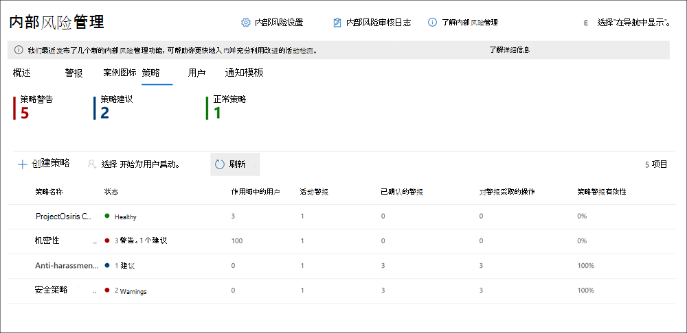
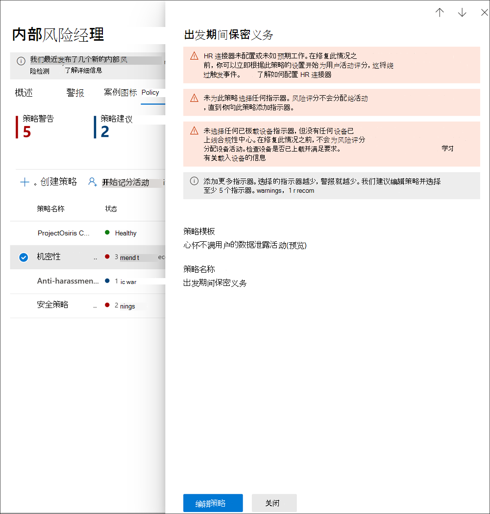

# <a name="insider-risk-management-policies"></a>预览体验计划风险管理策略

预览体验计划风险管理策略确定哪些用户位于范围内以及为警报配置了哪些类型的风险指示器。 可以快速创建一个应用于组织中所有用户的策略，或定义单个用户或组以在策略中管理。 策略支持内容优先级，重点关注多个或特定 Microsoft Teams、SharePoint 网站、数据敏感度类型和数据标签的策略条件。 通过使用模板，可以选择特定风险指示器并自定义策略指示器的事件阈值，有效自定义风险分数，以及警报级别和频率。 此外，风险分数检查和值检测可帮助识别重要性更高或更异常的用户活动。 通过策略窗口，可定义应用策略提醒活动的时间框架，并用于确定激活策略的持续时间。

查看 [预览体验计划（风险管理策略）](https://www.youtube.com/watch?v=kudK5ajZTUo) 视频，了解使用内置策略模板创建的策略可如何帮助您快速针对潜在风险采取措施。

## <a name="policy-dashboard"></a>策略仪表板

使用 **策略仪表板** ，可以快速查看组织的策略、策略的运行状况、将用户手动添加到策略，以及查看与每个策略相关联的通知状态。

- **策略名称：** 在策略向导中分配给策略的名称。
- **状态**：每个策略的运行状况状态。 显示策略警告和建议的数量，或没有问题的策略的 *“健康”* 状态。  可单击该策略查看任何警告或建议的状态详细信息。
- **活动警报：** 各策略的活动警报数。
- **确认的警报数：** 最近 365 天内因策略引起的案例警报总数。
- **对警报执行的操作数：** 最近 365 天内已确认或已关闭的警报总数。
- **策略警报有效性**：由总已确认警报来确定的百分比，除以对警报执行的总操作（过去一年已确认或关闭的警报总数）。



## <a name="policy-recommendations-from-analytics-preview"></a>分析中的策略建议（预览）

通过预览体验计划风险分析，无需配置任何预览体验计划风险策略，即可对组织中潜在的预览体验成员风险进行评估。 此评估可以帮助组织确定用户风险更高的潜在领域，并可帮助确定可能考虑配置的预览体验计划风险管理策略的类型和范围。

若要了解有关预览体验计划风险分析和策略建议的详细信息，请参阅 [预览体验计划风险管理设置：分析（预览版）](insider-risk-management-settings.md#analytics-preview)。

## <a name="policy-templates"></a>策略模板

预览体验计划风险管理模板是预定义的策略条件，用于定义该策略使用的风险指示器和风险管理模型的类型。 在创建策略之前，每个策略必须在策略创建向导中指定一个模板。 预览体验计划风险管理针对每个策略模板支持最多五个策略。 使用策略向导创建新的预览体验成员风险策略时，可选择以下策略模板之一：

### <a name="data-theft-by-departing-users"></a>离职用户窃取数据

当用户离开组织时，有与离开用户的数据盗用相关联的特定风险指示器。 此策略模板使用企业筛选指标进行风险筛选，并专注于此风险区域中的检测和警报。 对于离开用户的数据盗用，可能包括从 SharePoint Online 下载文件、打印文件，以及将数据复制到个人云邮件和存储服务，访问其聘用日期和结束日期附近的内容。 通过使用 Microsoft 365 HR 连接器或自动监视组织的 Azure Active Directory 中用户帐户删除的选项，该模板会开始关注与这些活动相关的风险指示器，以及它们如何与用户雇用状态相关联。

> [!IMPORTANT]
> 使用此模板时，您可以将 Microsoft 365 HR 连接器配置为定期为贵组织的用户导入客户端和终止日期信息。 请参阅 [HR 连接器导入数据](import-hr-data.md) 文章，了解为组织配置 Microsoft 365 HR 连接器的分步指导。 如果选择不使用 HR 连接器，则配置策略向导中的触发事件时，必须选择从 Azure AD 中删除的用户帐户。

### <a name="general-data-leaks"></a>常规数据泄露

保护数据并防止数据泄露是大多数组织持续的挑战，尤其是在用户、设备和服务创建的新数据快速增长时。 用户可跨服务和设备创建、存储和共享信息，从而让数据泄露的管理变得复杂和困难。 数据泄漏包括将信息意外过度共享到组织外部或出于恶意目的的数据窃取。 通过分配的数据丢失防护 （DLP） 策略或内置触发事件，此模板可开始实时检测可疑 SharePoint Online 数据下载、文件和文件夹共享、打印文件以及将数据复制到个人云消息和存储服务。

使用 *数据泄露* 模板时，可分配 DLP 策略，触发预览体验计划风险策略中的指示，以发现组织中出现严重严重警报。 每当向 Office 365 审核日志添加 DLP 策略规则生成的严重性警报时，使用此模板创建的预览体验成员风险策略将自动检查严重性 DLP 警报。 如果警报包含预览体验计划风险策略中定义的适用范围用户，则通知由预览体验成员风险策略作为新警报进行处理，并分配了预览体验成员风险严重性和风险分数。 此策略允许你根据案例中包含的其他活动对此警报进行评估。 如果不选择 DLP 策略，必须选择内置触发事件。

#### <a name="data-leaks-policy-guidelines"></a>数据泄露策略准则

创建或修改 DLP 策略以与预览体验计划风险管理策略一并使用时，请考虑以下准则：

- 在DLP策略中配置规则时，对数据泄漏事件进行优先级排序，并在将 **事件报告** 设置分配为 *“高”* 时具有选择性。 例如，通过电子邮件将敏感文档发送给已知竞争对手应该是 *高* 警报级别的渗透事件。 其他 DLP 策略规则中的 **事件报告** 设置中的 *高* 级别可能会增加预览体验计划风险管理警报工作流的干扰，使数据保存员和分析人员更难以正确评估这些警报。 例如，分配 *高* 级别以访问 DLP 策略中的拒绝活动，则更难以评估真正具有风险的用户行为和活动。
- 请确保你了解并正确配置 DLP 和预览体验计划风险管理策略中的适用范围用户。 只有使用 **数据泄漏** 模板被定义为内部风险管理策略的范围内的用户，才会处理严重性高的DLP策略警报。 此外，只有在严重性 DLP 警报的规则中定义为范围的用户由预览体验成员风险管理策略进行检测。 必须注意，不要以冲突的方式在 DLP 和预览体验成员风险策略中不知情地配置范围内用户。

     例如，如果 DLP 策略规则的范围仅适用于销售团队的用户，并且根据 **数据泄露** 模板创建的预览体验成员风险策略将所有用户定义为范围内，则预览体验计划风险策略只会处理针对销售团队用户的严重 DLP 警报。 对于本示例中 DLP 规则中未定义的流程，预览体验成员风险策略不会收到任何高优先级 DLP 警报。 相反，如果从 **数据泄露创建的预览体验计划风险管理策略** 模板的范围只针对销售团队的用户，且分配的 DLP 策略适用于所有用户，则预览体验成员风险策略仅处理针对销售团队成员的高严重性 DLP 警报。 预览体验计划风险管理策略将忽略针对不是销售团队的所有用户的严重性 DLP 警报。

- 确保用于此内部人员风险管理模板的DLP策略中的 **“事件报告”** 规则设置配置为 *高* 严重性级别警报。 *高* 严重性级别是触发事件，且预览体验计划风险管理警报不会根据 DLP 策略中的规则生成，**事件报告** 字段设置为 *低* 或 *中*。

    

     > [!NOTE]
     > 使用内置模板创建新的 DLP 策略时，需要选择 **创建或自定义高级 DLP 规则** 选项，为 *高* 严重级别配置 **事件报告** 设置。

从 **数据泄漏** 模板创建的每个内部风险管理策略只能分配一个DLP策略。 考虑创建一个专用的DLP策略，该策略将您要检测的不同活动组合在一起，并充当使用 **数据泄漏** 模板的内部风险策略的触发事件。

请参阅 [创建、测试和优化 DLP 策略](create-test-tune-dlp-policy.md) ，了解为组织配置 DLP 策略的分步指导。

### <a name="data-leaks-by-priority-users-preview"></a>优先用户的数据泄露活动(预览)

保护数据并防止数据泄露给组织用户可能取决于其位置、敏感信息的访问权限级别或风险历史记录。 泄露数据可能包括意外过度共享组织外部高度敏感信息，或利用恶意企图盗用数据。 通过分配的数据丢失防护 （DLP） 策略，该模板开始实时检测可疑活动，导致发生预览体验成员风险警报和较高严重性级别的警报的可能性更大。 优先级用户是在内部人员风险管理设置区域中配置的[优先级用户组](insider-risk-management-settings.md#priority-user-groups-preview)中定义的。

与" **一般数据泄露"模板** 一样，必须分配 DLP 策略来触发预览体验计划风险策略中的指示，以发现组织中出现严重严重警报。 使用此模板创建策略时，请按照上述数据泄露策略指南操作。 此外，需要分配在 **预览体验计划** > **设置"中创建的** > **优先级用户组** 策略。

### <a name="data-leaks-by-disgruntled-users-preview"></a>心怀不满用户的数据泄露活动(预览)

当用户遇到工作压力时，他们可能会感到不满，这可能增加预览体验成员风险活动的可能性。 标识出与解除管理关联的指示器时，此模板会启动用户活动。 例如，性能改进通知、低绩效审阅或工作级状态更改。 数据泄露对于不法用户可能包括从 SharePoint Online 下载文件，以及将数据复制到个人云消息和存储服务，远离使用困难事件。

使用此模板时，还必须配置 Microsoft 365 HR 连接器，以便定期导入性能改进通知、性能审阅状态不佳或组织中用户的作业级别更改信息。 请参阅 [HR 连接器导入数据](import-hr-data.md) 文章，了解为组织配置 Microsoft 365 HR 连接器的分步指导。

### <a name="general-security-policy-violations-preview"></a>安全策略常规违规活动(预览)

在许多组织中，用户有权在设备上安装软件或修改设备设置以帮助完成任务。 用户可能会安装恶意软件或禁用可帮助保护设备上或网络资源上的信息的重要安全功能。 此策略模板使用 Microsoft Defender for Endpoint 的安全警报开始执行这些活动，并针对此风险区域执行焦点检测和警报。 当用户可能拥有可能为预览体验成员带来风险的安全策略冲突历史记录时，使用此模板提供有关安全策略冲突情况见解。

需要在你的组织中配置 Microsoft Defender for Endpoint，并且启用 Defender for Endpoint 以实现在 Defender 安全中心中的预览体验计划风险管理集成，以导入安全冲突警报。 若要详细了解如何配置 Defender for Endpoint，实现预览体验计划风险管理集成，请参阅 [在Defender for Endpoint中配置高级功能](/windows/security/threat-protection/microsoft-defender-atp/advanced-features#share-endpoint-alerts-with-microsoft-compliance-center)。

### <a name="security-policy-violations-by-departing-users-preview"></a>离职用户的安全策略违规活动(预览)

离开的用户（无论是正数还是负数）都可能会增加出现安全策略冲突的风险。 为帮助防止离开用户的无意中或恶意安全冲突，此策略模板使用 Defender for Endpoint 警报，提供有关安全相关活动的见解。 这些活动包括用户安装恶意软件或其他可能有害应用程序，以及禁止其设备上使用安全功能。 通过使用 [Microsoft 365 HR 连接器](import-hr-data.md) 或选择自动监视组织的 Azure Active Directory 中的用户帐户删除，此模板开始关注与这些安全活动相关的风险指示器，以及它们与用户雇用状态有关的风险指示器。

需要在你的组织中配置 Microsoft Defender for Endpoint，并且启用 Defender for Endpoint 以实现在 Defender 安全中心中的预览体验计划风险管理集成，以导入安全冲突警报。 若要详细了解如何配置 Defender for Endpoint，实现预览体验计划风险管理集成，请参阅 [在Defender for Endpoint中配置高级功能](/windows/security/threat-protection/microsoft-defender-atp/advanced-features#share-endpoint-alerts-with-microsoft-compliance-center)。

### <a name="security-policy-violations-by-priority-users-preview"></a>优先用户的安全策略违规活动(预览)

针对组织中用户的安全冲突进行保护可能取决于其位置、敏感信息的访问权限级别或风险历史记录。 因为优先级用户的安全冲突可能会对组织的关键区域产生巨大影响，因此此策略模板开始考虑这些指标，并使用 Microsoft Defender for Endpoint 警报为这些用户提供与安全相关的活动的见解。 这些活动可能包括优先级用户安装恶意软件或其他可能有害应用程序，以及禁止其设备上使用安全功能。 优先级用户在预览体验计划风险管理设置区域中配置的优先级用户组中定义。

需要在你的组织中配置 Microsoft Defender for Endpoint，并且启用 Defender for Endpoint 以实现在 Defender 安全中心中的预览体验计划风险管理集成，以导入安全冲突警报。 若要详细了解如何配置 Defender for Endpoint，实现预览体验计划风险管理集成，请参阅 [在Defender for Endpoint中配置高级功能](/windows/security/threat-protection/microsoft-defender-atp/advanced-features#share-endpoint-alerts-with-microsoft-compliance-center)。 此外，需要分配在 **预览体验计划** > **设置"中创建的** > **优先级用户组** 策略。

### <a name="security-policy-violations-by-disgruntled-users-preview"></a>心怀不满员工的安全策略违规活动(预览)

遇到使用压力的用户因无意中或恶意安全策略冲突的风险更高。 这些压力可能包括用户被置于性能改进计划、低性能审阅状态或从当前位置降级。 此策略模板基于与这些用户这些事件关联的指标和活动启动风险策略。

使用此模板时，还必须配置 Microsoft 365 HR 连接器，以便定期导入性能改进通知、性能审阅状态不佳或组织中用户的作业级别更改信息。 请参阅 [HR 连接器导入数据](import-hr-data.md) 文章，了解为组织配置 Microsoft 365 HR 连接器的分步指导。

还需要在组织中配置 Microsoft Defender for Endpoint，并启用 Defender for Endpoint 以实现预览体验成员风险管理集成，以导入安全冲突警报。 若要详细了解如何配置 Defender for Endpoint，实现预览体验计划风险管理集成，请参阅 [在Defender for Endpoint中配置高级功能](/windows/security/threat-protection/microsoft-defender-atp/advanced-features#share-endpoint-alerts-with-microsoft-compliance-center)。

### <a name="policy-template-prerequisites-and-triggering-events"></a>策略模板先决条件和触发事件

根据为预览体验计划风险管理策略选择的模板，触发事件和策略先决条件各不相同。 触发事件是决定用户是否处于活动状态的预览体验计划风险管理策略的先决条件。 如果用户被添加到预览体验计划风险管理策略，但无触发事件，则策略不会评估用户活动，除非手动将用户活动添加到用户仪表板中。 策略先决条件是必需项目，这样策略才能接收评估风险所需的信号或活动。

下表列出了触发事件以及基于每个预览体验计划风险管理策略模板创建的策略的先决条件：

| **策略模板** | **触发策略事件** | **先决条件** |
| :------------------ | :--------------------------------- | :---------------- |
| 离职用户窃取数据 | HR 连接器或客户删除帐户的Azure Active Directory终止日期指示器 | （可选）配置用于终止和截止日期指示器的 Microsoft 365 HR 连接器 |
| 常规数据泄露 | 数据泄漏策略活动可创建 *高严重性* 警报或内置渗透事件触发器 | （可选）为高严重性警报配置 DLP 策略 |
| 优先用户的数据泄露 | 数据泄漏策略活动可创建 *高严重性* 警报或内置渗透事件触发器 | （可选）为高严重性警报配置 DLP 策略 <br><br> 在预览体验计划风险设置中配置优先级用户组 |
| 心怀不满用户的数据泄露活动 | 人力资源连接器中的绩效改善、工作表现较差或职务更改指标 | 为解除管理指示器配置的 Microsoft 365 HR 连接器 |
| 违反常规安全策略 | Microsoft Defender for Endpoint 检测到的安全控件或不需要的软件的防御程序 | 适用于终结点的 Active Microsoft Defender 订阅 <br><br> 配置了 Microsoft Defender for Endpoint 与 Microsoft 365 合规中心集成 |
| 离职用户的安全策略违规活动 | 人力资源连接器或 Azure Active Directory 帐户删除中的提前期或终止日期指示器 | （可选）配置用于终止和截止日期指示器的 Microsoft 365 HR 连接器 <br><br> 适用于终结点的 Active Microsoft Defender 订阅 <br><br> 配置了 Microsoft Defender for Endpoint 与 Microsoft 365 合规中心集成 |
| 优先用户的安全策略违规 | Microsoft Defender for Endpoint 检测到的安全控件或不需要的软件的防御程序 | 适用于终结点的 Active Microsoft Defender 订阅 <br><br> 配置了 Microsoft Defender for Endpoint 与 Microsoft 365 合规中心集成 <br><br> 在预览体验计划风险设置中配置优先级用户组 |
| 心怀不满员工的安全策略违规活动 | 人力资源连接器中的绩效改善、工作表现较差或职务更改指标 | 为解除管理指示器配置的 Microsoft 365 HR 连接器 <br><br> 适用于终结点的 Active Microsoft Defender 订阅 <br><br> 配置了 Microsoft Defender for Endpoint 与 Microsoft 365 合规中心集成 |

## <a name="prioritize-content-in-policies"></a>确定策略中内容的优先级

预览体验计划风险管理策略支持为内容指定更高优先级，具体取决于内容的存储位置或分类方式。 将内容指定为优先级会增加任何关联活动的风险分数，反过来会增加生成严重性警报的可能性。 但某些活动不会生成警报，除非相关内容包含内置或自定义敏感信息类型或被指定为策略中的优先级。

例如，你的组织为高度机密项目专门了 SharePoint 网站。 此 SharePoint 网站中信息泄露可能泄露到项目，并可能严重影响项目成功。 通过针对数据泄露策略中此 SharePoint 网站的优先级，符合条件的活动的风险分数会自动增加。 此优先顺序会增加这些活动生成预览体验成员风险警报的可能性，提高警报严重性级别。

在策略向导中创建预览体验计划风险管理策略时，可以从以下优先级中选择：

- **SharePoint 网站**：与所定义的 SharePoint 网站中所有文件类型关联的任何活动都将被分配更高的风险分数。 配置策略并选择优先级 Share Point 网站的用户可以选择SharePoint他们有权访问的网站。 如果SharePoint当前用户无法选择策略中的网站，则具有所需权限的其他用户稍后可以选择策略的网站，或者应向当前用户授予对所需网站的访问权限。
- **敏感信息类型**：与包含 [敏感信息类型](sensitive-information-type-entity-definitions.md)的内容相关的任何活动都被分配了较高的风险评分。
- **敏感度标签**：与具有特定标签 [敏感度标签](sensitivity-labels.md) 的任何活动都将被分配更高的风险分数。

## <a name="sequence-detection-preview"></a>顺序检测（预览）

有风险的活动可能未作为独立事件发生。 这些风险通常是大量事件的一部分。 顺序是两个或多个用户活动在一组之后执行，可能建议增加的风险。 标识这些相关活动是评估总体风险的重要组成部分。 当为数据盗用或数据泄露策略启用顺序检测时，预览体验计划案例的 **用户活动** 选项卡上会显示关于顺序信息活动的见解。 以下策略模板支持顺序检测：

- 离职用户窃取数据
- 常规数据泄露
- 优先用户的数据泄露
- 心怀不满用户的数据泄露活动

这些预览体验计划风险管理策略可以使用特定指标及其出现的顺序来按风险顺序检测每个步骤。 跨序列映射活动时，使用文件名。 这些风险分为四个主要活动类别：

- **集合**：这些类别信号侧重于范围内策略用户的下载活动。 此类别中的示例活动是从 SharePoint 网站下载文件。
- **外泄**：这些类别信号专注于通过范围内策略用户向内部和外部源共享或提取活动。 此类别中的示例活动是向外部收件人发送带有组织附件的电子邮件。
- **混淆**：这些类别信号重点关注范围内策略用户对风险活动的掩盖。 此类别中的示例活动是重命名设备中的文件。
- **清理**：这些类别信号侧重于范围内策略用户的删除活动。 此类别中的示例活动是删除设备中的文件。

> [!NOTE]
> 顺序检测使用在预览体验计划风险管理的全局设置中启用的指标和在策略中选定的指标。 如果未选择适当的指示器，则顺序检测将不起作用。

在策略中配置时，可自定义每种序列检测类型的单个阈值设置。 这些阈值设置根据与序列关联的文件量调整警报。

要在 **“用户活动”** 视图中了解有关序列检测管理的更多信息，请参阅 [预览体验计划风险管理事例：用户活动](insider-risk-management-cases.md#user-activity)。

## <a name="cumulative-exfiltration-detection-preview"></a>累积外泄检测

对超出预览体验成员风险策略范围的用户每天进行评估时，预览体验计划风险指标可帮助确定异常的风险级别。 累积筛选检测使用机器学习模型来帮助你识别用户筛选活动何时超过组织平均值（在一段时间并超过多个筛选活动类型时）。 预览体验计划风险管理分析员和预览体验成员可能使用累积内筛选检测见解来帮助识别通常不会生成警报，但高于组织的典型警报的筛选活动。 一些示例可能离开用户，某几天内数据会缓慢地外卷显示，或者当用户为组织进行数据共享时，他们反复超过通常的跨多个频道共享数据。

使用下列策略模板时，默认情况下将启用累积筛选检测：

- 离职用户窃取数据
- 常规数据泄露
- 优先用户的数据泄露
- 心怀不满用户的数据泄露活动

> [!NOTE]
> 累积筛选检测使用全局设置中启用了内部筛选指示器，以用于预览体验风险管理和在策略中选择的筛选指示器。 因此，只会针对选中的必要筛选指示器对累积筛选检测进行评估。 在优先级内容中配置的敏感度标签[](sensitivity-labels.md)的累积筛选活动会产生更高的风险评分。

当为数据盗用或数据泄露策略启用了累积泄露检测时，预览体验计划内" **用户活动** "选项卡上会显示累积泄露活动的见解。

若要深入了解用户活动管理，请参阅 [预览体验计划风险管理事例：用户活动](insider-risk-management-cases.md#user-activity)。

## <a name="policy-health"></a>策略运行状况

通过策略运行状况状态，可深入了解预览体验计划风险管理策略的潜在问题。 "策略"选项卡上的"状态"列可提醒你注意可能会阻止报告用户活动的策略问题或活动警报数异常的原因。 策略运行状况状态还可以确认策略运行状态，不需要注意或配置更改。

如果策略出现问题，策略运行状况会显示通知警告和建议，以帮助你采取措施解决策略问题。这些通知可帮助你解决以下问题：

- 配置不完整的策略。这些问题可能包括策略或其他不完整的策略配置步骤中缺少用户或组。
- 具有指示器配置问题的策略。 指标是每个策略的重要组成部分。 如果没有配置指标，或者选择的指标过少，策略可能不会如期评估风险活动。
- 策略触发器无法正常工作或策略触发要求未正确配置。 策略功能可能取决于其他服务或配置要求，才能有效地检测触发事件以向策略中的用户激活风险评分分配。 这些相关性可能包括连接器配置问题、Microsoft Defender for Endpoint 警报共享或数据丢失防护策略配置设置问题。
- 音量限制即将或超过限制。 预览体验计划风险管理策略使用许多 Microsoft 365 服务和终结点聚合风险管理信号。 根据策略中的用户数，批量限制可能会延迟标识和报告风险活动。 若要详细了解这些限制，请通过本文的"策略模板限制"部分了解。

若要快速查看策略的运行状况状态，请导航"策略"选项卡和"状态"列。 在这里，你将看到每个策略的下列策略运行状况选项：

- 运行状态：该策略未发现任何问题。
- 建议：策略存在一些问题，可能会阻止策略如预期运行。
- 警告：策略存在一些问题，会阻止它识别具有风险的活动。

有关任何建议或警告的更多详细信息，请在 **“策略”** 选项卡上选择一个策略以打开策略详细信息卡。 详细信息卡的"通知"部分将显示有关建议和警告的详细信息，包括有关如何解决这些问题的指南。



### <a name="notification-messages"></a>通知消息

使用下表详细了解解决潜在问题的建议和警告通知及操作。

|**通知消息**|**策略模板**|**原因/请尝试此操作进行修复**|
|:------------------------|:-------------------|:---------------------------|
| 策略并未向活动分配风险分数 | 所有策略模板 | 可能需要查看策略范围并触发事件配置，以便策略可以将风险分数分配给活动 <br><br> 1. 查看为策略选择的用户。 如果选择了几个用户，可能需要选择其他用户。 <br> 2. 如果使用的是人力资源连接器，请检查 HR 连接器是否发送正确的数据。 <br> 3. 如果将 DLP 策略用作触发事件，请检查 DLP 策略配置，确保已配置为在此策略中使用此策略。 <br> 4. 有关安全策略，请查看在预览体验成员风险设置 > 智能检测中选择的 Microsoft Defender for Endpoint 警报会审状态。请确认警报筛选器不会太窄。 |
| 策略未生成任何警报 | 所有策略模板 | 你可能希望查看你的策略配置，以便分析你关注的活动。 <br><br> 1. 确认已选择了要评分的指标。 选择的指标越多，分配给风险分数的活动就更多。 <br> 2. 检查策略的阈值自定义。如果所选阈值与组织的风险降低不一致，可调整所选内容，以便根据首选阈值创建警报。 <br> 3.查看为策略选择的用户和组。 确认你已选择所有适用的用户和组。 <br> 4. 对于安全策略，请确认你已选择在设置中为 Microsoft Defender for Endpoint 警报评分的警报分报状态。|
| 此策略中不包括任何用户或组 | 所有策略模板 | 未向用户或组分配该策略。 <br><br> 编辑策略，然后选择该策略的用户或组。 |
| 未为此策略选择任何指示器 | 所有策略模板 | 尚未为策略选择指示器 <br><br> 编辑策略并选择相应的策略指示器。 |
| 此策略中不包括优先级用户组 | 优先用户的数据泄露 <br> 优先用户的安全策略违规 | 优先级用户组未分配到策略。 <br><br> 在预览体验计划风险管理设置中配置优先级用户组，并将优先级用户组分配给策略。 |
| 未为此策略选择任何触发事件 | 所有策略模板 | 未为策略配置触发事件 <br><br> 在编辑策略并选择触发事件之前，风险分数不会分配给用户活动。 |
| HR 连接器未如预期配置或运行 | - 离开用户的数据被窃取 <br> - 离开用户时发生安全策略冲突 <br> - 心怀不满用户造成数据泄露 <br> - 心怀不满用户的安全策略违规活动 | HR 连接器存在问题。 <br><br> 1. 如果使用的是 HR 连接器，请检查 HR 连接器是否发送正确的数据 <br><br> 或 <br><br> 2.选择 Azure AD 帐户已删除的触发事件。 |
| 未载入任何设备 | - 离职用户窃取数据 <br> - 常规数据泄露 <br> - 心怀不满用户造成数据泄露 <br> - 优先用户的数据泄露 | 已选中设备指示器，但 Microsoft 365 中未载入任何设备 <br><br> 检查设备是否载入且满足要求。 |
| 人力资源连接器最近尚未上传数据 | - 离开用户的数据被窃取 <br> - 离开用户时发生安全策略冲突 <br> - 心怀不满用户造成数据泄露 <br> - 心怀不满用户的安全策略违规活动 | HR 连接器 7 天内未导入数据。 <br><br> 检查 HR 连接器是否配置正确并发送数据。 |
| 目前无法检查 HR 连接器的状态，请稍后再次检查 | - 离开用户的数据被窃取 <br> - 离开用户时发生安全策略冲突 <br> - 心怀不满用户造成数据泄露 <br> - 心怀不满用户的安全策略违规活动 | 预览体验计划风险管理解决方案无法检查 HR 连接器的状态。 <br><br> 检查 HR 连接器是否配置正确并发送数据，或者返回并检查策略状态。  |
| DLP 策略未选择为触发事件 | - 常规数据泄露 <br> - 优先用户的数据泄露 | 尚未选择 DLP 策略作为触发事件，或者已删除所选的 DLP 策略。 <br><br> 编辑策略，然后选择活动的 DLP 策略或"用户执行筛选活动"作为策略配置中的触发事件。 |
| 已关闭此策略所使用的 DLP 策略 | - 常规数据泄露 <br> - 优先用户的数据泄露 | 已关闭此策略中使用的 DLP 策略。 <br><br> 1. 打开分配给此策略的 DLP 策略。 <br><br> 或 <br><br> 2. 编辑此策略，并选择新的 DLP 策略或"用户执行筛选活动"作为策略配置中的触发事件。 |
| DLP 策略不满足要求 | - 常规数据泄露 <br> - 优先用户的数据泄露 | 必须配置用作触发事件的 DLP 策略以生成高严重性警报。 <br><br>  1.编辑您的DLP策略，以将适用的警报分配为 *高严重性*。 <br><br> 或 <br><br> 2.编辑此策略，然后选择 *“用户执行外泄活动”* 作为触发事件。 |
| 你的组织没有 Microsoft Defender for Endpoint 订阅 | - 违反常规安全策略 <br> - 离职用户的安全策略违规活动 <br> - 心怀不满用户的安全策略违规活动 <br> - 优先用户的安全策略违规 | 系统未检测到组织有活动的 Microsoft Defender for Endpoint 订阅。 <br><br> 在添加 Microsoft Defender for Endpoint 订阅之前，这些策略不会向用户活动分配风险分数。 |
| 不与合规中心共享 Microsoft Defender for Endpoint 警报 | - 违反常规安全策略 <br> - 离职用户的安全策略违规活动 <br> - 心怀不满用户的安全策略违规活动 <br> - 优先用户的安全策略违规 | 并未与合规中心共享 Microsoft Defender for Endpoint 警报。 <br><br> 配置 Microsoft Defender 的共享以使用终结点警报。 |
| 正接近此策略模板主动对用户评分的最大限制。 | 所有策略模板 | 每个策略模板具有最大范围用户数。 请参阅模板限制部分的详细信息。 <br><br> 在"用户"选项卡中查看用户，并删除任何无需再评分的用户。 |

## <a name="policy-template-limits"></a>策略模板限制

预览体验计划风险管理策略模板使用限制来管理范围内用户风险活动的处理量和速度，以及如何将此过程与支持 Microsoft 365 服务集成。 每个策略模板的最大用户数都可以为其可支持并有效处理和报告风险活动的策略主动分配风险分数。 范围用户是触发策略事件的用户。

根据每种策略模板类型获得风险分数的唯一用户总数计算每个策略的限制。 如果策略模板类型的用户数接近或超过用户限制，将减少策略性能。 若要查看策略的当前用户数，请导航到"策略"选项卡和"范围"列中的"用户"。 任何策略模板的策略最多可能为 5 个。 这些最大限制适用于使用给定策略模板的所有策略中的用户。

使用下表确定每个策略模板支持的最大范围用户数：

|**策略模板**|**当前范围用户上限**|
|:------------------|:--------------------------------|
| 常规数据泄露 | 15,000 |
| 心怀不满用户的数据泄露活动 | 7,500 |
| 优先级用户的数据泄露 | 1,000 |
| 离职用户窃取数据 | 20,000 |
| 违反常规安全策略 | 1,000 |
| 优先用户的安全策略违规 | 1,000 |
| 离职用户的安全策略违规活动 | 15,000 |
| 心怀不满员工的安全策略违规活动 | 7,500 |

## <a name="create-a-new-policy"></a>创建新策略

若要创建新的内部人员风险管理策略，您将使用Microsoft 365合规性中心的 **预览体验计划风险管理** 解决方案中的策略向导。

完成以下步骤以创建新策略：

1. 在 [Microsoft 365 合规中心](https://compliance.microsoft.com)中，转到 **预览体验计划** ，然后选择" **策略** 选项卡。
2. 选择 **创建策略** 以打开策略向导。
3. 在 **“策略模板”** 页面上，选择一个策略类别，然后为新策略选择模板。 这些模板由定义要检测并调查的风险活动的条件和指标。 查看模板先决条件、触发事件和检测到的活动，以确认此策略模板符合你的需要。

    > [!IMPORTANT]
    > 某些策略模板包含为策略配置以生成相关警报的先决条件。 如果尚未配置适用的策略先决条件，请参阅上面的 **步骤4**。

4. 选择“**下一步**”以继续。
5. 在 **名称和说明** 页上，完成以下字段：
    - **名称（必需）**：输入策略的友好名称。 创建策略后，不能更改此名称。
    - **说明（可选）**：输入策略的说明。

6. 选择“**下一步**”以继续。
7. 在 **用户和组** 页上，选择 **"包括所有用户和组** 或 **包括特定的用户和组** 以定义策略中包含的用户或组，或者选择了基于用户的优先级模板； 选择 **添加或编辑优先级用户组**。 选择此选项 **包括所有用户和组** 将查找触发组织中所有用户和组的事件，以便开始为策略分配风险分数。 通过 **包括特定用户和组** 可定义要分配到该策略的用户和组。 不支持来宾用户帐户。
8. 选择“**下一步**”以继续。
9. 在 **“要优先排序的内容”** 页面上，可以分配（如果需要）要优先排序的源，这增加了为这些源生成高严重性警报的机会。 选择下列选项之一：

    - **我希望将 SharePoint 网站、敏感度标签和/或敏感信息类型指定为优先级**。 选择此选项将在向导中启用详细信息页面以配置这些通道。
    - **我不想指定优先级内容（创建策略后你将能够指定）**。 选择此选项将跳过向导中的频道详细信息页面。

10. 选择“**下一步**”以继续。

11. 如果选择 **我想在上一步中将 SharePoint 网站、敏感度标签和/或敏感信息类型指定为优先级内容** ，你将看到 *SharePoint 网站*、 *敏感信息类型* 和 *敏感度标签* 的详细信息页面。 使用这些详细信息页面定义 SharePoint、敏感信息类型和敏感度标签以在策略中确定优先级。

    - **SharePoint** 选项： **添加 SharePoint** ，然后选择你有权访问和要设置优先顺序的 SharePoint 网站。 例如，将 *"group1@contoso.sharepoint.com/sites/group1"*。
    - **敏感信息类型**：选择 **添加敏感信息类型** 并选择要确定优先顺序的敏感度类型。 例如， *"美国银行帐户帐号"* ， *"信用卡号"*。
    - **敏感度标签**： 选择 **添加敏感度标签**，然后选择要设置优先级的标签。 例如， *机密* ， *"机密*。

    >[!NOTE]
    >配置策略并选择优先级 Share Point 网站的用户可以选择SharePoint他们有权访问的网站。 如果SharePoint当前用户无法选择策略中的网站，则具有所需权限的另一个用户稍后可以选择策略的网站，或者应为当前用户授予访问所需网站的权限。

12. 选择“**下一步**”以继续。
13. 在 **指标及触发事件** 页面上，你将在 **预览体验计划风险设置** > **指标** 页面看到到您定义为可用的 [指标](insider-risk-management-settings.md#indicators)。 如果在向导开头选择了 *数据泄露* 模板，则必须从 **DLP 策略** 下拉列表中选择 DLP 策略，以启用触发策略指示器或选择内置触发事件。

    > [!IMPORTANT]
    > 如果无法选中此页上的指标，需要选择要为所有策略启用的指标。 可使用向导中的 **打开指标** 按钮，或选择 **预览体验计划风险管理** > **设置** > **策略指示器** 标记。

    选择要应用于策略的指标。 如果您不想对这些指标使用默认策略阈值设置，请禁用 **“使用Microsoft建议的使用默认阈值”**，然后为每个选定的指标输入阈值。

    - 如果已选择至少一 *Office* 或 *Device* 指示器，请根据情况选择 **风险评分** 分数。 风险分数仅应用于所选指示器。
    - 如果选择了 *数据盗窃* 或 *数据泄露* 策略模板，请选择一个或多个 **序列检测** 方法以及一种 **累积泄露检测** 方法，以应用到该策略。

14. 选择“**下一步**”以继续。
15. 在" **指示器阈值** 页面上，选择使用默认指示器阈值或为各个指示器指定自定义阈值的选项。 对于每个指标，选择适当的级别以生成所需的活动警报级别。
16. 选择“**下一步**”以继续。
17. 在 **审阅** 页面上，查看为策略选择的设置以及针对你的选择选择的任何建议或警告。 选择 **“编辑”** 以更改任何策略值，或选择 **“提交”** 以创建并激活该策略。

## <a name="update-a-policy"></a>更新策略

若要创建新的预览体验计划风险管理策略，可使用 Microsoft 365 合规中心 **预览体验计划风险管理** 解决方案中的策略向导。

完成以下步骤来管理现有策略：

1. 在 [Microsoft 365 合规中心](https://compliance.microsoft.com)中，转到 **预览体验计划** ，然后选择" **策略** 选项卡。
2. 在策略仪表板上，选择要管理的策略。
3. 在策略详细信息页面上，选择 **编辑策略**
4. 在策略向导中，无法编辑以下内容：
    - **策略模板**：用于定义受策略监视的风险指示器类型的模板。
    - **名称**：策略的友好名称
5. 在 **名称和说明** 页上，在 **“描述”** 字段中更新策略的描述。
6. 选择“**下一步**”以继续。
7. 在 **用户和组** 页上，选择 **"包括所有用户和组** 或 **包括特定的用户和组** 以定义策略中包含的用户或组，或者选择了基于用户的优先级模板； 选择 **添加或编辑优先级用户组**。 选择此选项 **包括所有用户和组** 将查找触发组织中所有用户和组的事件，以便开始为策略分配风险分数。 通过 **包括特定用户和组** 可定义要分配到该策略的用户和组。
8. 选择“**下一步**”以继续。
9. 在 **“要优先排序的内容”** 页面上，可以分配（如果需要）要优先排序的源，这增加了为这些源生成高严重性警报的机会。 选择下列选项之一：

    - **我希望将 SharePoint 网站、敏感度标签和/或敏感信息类型指定为优先级**。 选择此选项将在向导中启用详细信息页面以配置这些通道。
    - **我不想指定优先级内容（创建策略后你将能够指定）**。 选择此选项将跳过向导中的频道详细信息页面。

10. 选择“**下一步**”以继续。

11. 如果选择 **我想在上一步中将 SharePoint 网站、敏感度标签和/或敏感信息类型指定为优先级内容** ，你将看到 *SharePoint 网站*、 *敏感信息类型* 和 *敏感度标签* 的详细信息页面。 使用这些详细信息页面定义 SharePoint、敏感信息类型和敏感度标签以在策略中确定优先级。

    - **SharePoint** 选项： **添加 SharePoint** ，然后选择你有权访问和要设置优先顺序的 SharePoint 网站。 例如，将 *"group1@contoso.sharepoint.com/sites/group1"*。
    - **敏感信息类型**：选择 **添加敏感信息类型** 并选择要确定优先顺序的敏感度类型。 例如， *"美国银行帐户帐号"* ， *"信用卡号"*。
    - **敏感度标签**： 选择 **添加敏感度标签**，然后选择要设置优先级的标签。 例如， *机密* ， *"机密*。

12. 选择“**下一步**”以继续。
13. 在 **指标及触发事件** 页面上，你将在 **预览体验计划风险设置** > **指标** 页面看到到您定义为可用的 [指标](insider-risk-management-settings.md#indicators)。 如果在向导开头选择了 *数据泄露* 模板，则必须从 **DLP 策略** 下拉列表中选择 DLP 策略，以启用触发策略指示器或选择内置触发事件。

    > [!IMPORTANT]
    > 如果无法选中此页上的指标，需要选择要为所有策略启用的指标。 可使用向导中的 **打开指标** 按钮，或选择 **预览体验计划风险管理** > **设置** > **策略指示器** 标记。

    选择要应用于策略的指标。 如果您不想对这些指标使用默认策略阈值设置，请禁用 **“使用Microsoft建议的使用默认阈值”**，然后为每个选定的指标输入阈值。

    - 如果已选择至少一 *Office* 或 *Device* 指示器，请根据情况选择 **风险评分** 分数。 风险分数仅应用于所选指示器。
    - 如果选择了 *数据盗窃* 或 *数据泄露* 策略模板，请选择一个或多个 **序列检测** 方法以及一种 **累积泄露检测** 方法，以应用到该策略。

14. 选择“**下一步**”以继续。
15. 在" **指示器阈值** 页面上，选择使用默认指示器阈值或为各个指示器指定自定义阈值的选项。 对于每个指标，选择适当的级别以生成所需的活动警报级别。
16. 选择“**下一步**”以继续。
17. 在 **审阅** 页面上，查看为策略选择的设置以及针对你的选择选择的任何建议或警告。 选择 **“编辑”** 以更改任何策略值，或选择 **“提交”** 以创建并激活该策略。

## <a name="copy-a-policy"></a>复制策略

可能需要创建一个类似于现有策略的新策略，但只需进行几个配置更改。 可以复制现有策略，然后修改需要在新策略中更新的区域，而不是从头开始创建新策略。

完成以下步骤以复制现有策略：

1. 在 Microsoft 365 合规中心，转到预览体验计划风险管理并选择"策略"选项卡。
2. 在策略仪表板上，选择要复制的策略。
3. 在策略详细信息页面上，选择"复制"。
4. 在策略向导中，命名新策略并根据需要更新策略配置。

## <a name="immediately-start-scoring-user-activity"></a>立即开始使用用户活动

在某些情况下，你可能需要立即开始向具有预览体验计划风险策略的用户分配风险分数，这些用户需在预览体验计划风险管理以及触发事件工作流外执行。 使用 **“策略”** 选项卡上的 **“为用户启动评分活动”** 可在特定时间段内手动将一个或多个用户添加到一个或多个内部风险策略中，立即开始为其活动分配风险评分，并绕过对 用户具有触发指示符（例如DLP策略匹配）。 还可添加将用户添加到策略的原因，该策略会显示在用户的活动日程表上。 手动添加到策略的用户将显示在 **“用户”** 仪表板中，如果活动达到策略警报阈值，则会创建警报。

某些情况可能需要立即开始使用用户活动：

- 会在有风险担忧时标识用户，你希望立即针对一个或多个策略向其活动分配风险分数
- 有一个事件可能要求你立即开始针对一个或多个策略向所涉用户的活动分配风险分数
- 如果尚未配置 HR 连接器，但希望通过为用户上传 .csv 文件，开始为 HR 事件向用户活动分配风险分数

> [!NOTE]
> 新的手动添加的用户可能需要几个小时才能出现在 **“用户”** 信息中心中。 过去 90 天内这些用户的活动可能需要多达 24 小时才能显示。 若要查看手动添加的用户的活动，请导航到" **用户** "选项卡，在 **用户** 仪表板上选择该用户，然后打开详细信息窗格上的" **用户活动** "选项卡。

若要手动开始为一个或多个预览体验计划风险管理策略中的用户启动活动，请完成以下步骤：

1. 在 [Microsoft 365 合规中心](https://compliance.microsoft.com)中，转到 **预览体验计划** ，然后选择" **策略** 选项卡。
2. 在策略仪表板上，选择要添加用户的策略。
3. 选择 **开始为用户启动**。
4. 在 **“将用户添加到多个策略”** 窗格中的 **“原因”字段** 中，添加添加用户的原因。
5. 在 **此操作应持续到（选择 5 到 30 天）** 字段，定义为用户添加到的策略评分的天数
6. 若要在 Active Directory 中搜索用户，请使用" **搜索"用户添加到"策略** 字段。 键入要添加到策略的用户的名称。 选择用户名，然后重复操作，向策略分配其他用户。 所选用户的列表会出现在"将用户添加到多个策略"窗格的用户部分。
7. 若要导入要添加到策略的用户列表，请选择" **导入** .csv（逗号分隔值）文件。 该文件必须采用以下格式，并且您必须在文件中列出用户主体名称：

    ```csv
    user principal name
    user1@domain.com
    user2@domain.com
    ```

8. 选择"向策略添加用户"以接受更改，将用户添加到策略，或选择"取消"以放弃更改并关闭对话框。

## <a name="stop-scoring-users-in-a-policy"></a>停止在策略中设置用户

若要停止搜索策略中的用户，请参阅 [预览体验计划风险管理用户：将用户从策略范围内分配中删除](insider-risk-management-users.md#remove-users-from-in-scope-assignment-to-policies) 文章。

## <a name="delete-a-policy"></a>删除策略

> [!NOTE]
> 删除策略不会删除从该策略生成的活动警报或已存档的警报。

若要删除现有预览体验计划风险管理策略，请完成以下步骤：

1. 在 [Microsoft 365 合规中心](https://compliance.microsoft.com)中，转到 **预览体验计划** ，然后选择" **策略** 选项卡。
2. 在策略仪表板上，选择要删除的策略。
3. 在仪表板工具栏上选择 **“删除”**。
4. 在 **删除** 对话框中，选择 **是** 以删除策略，或选择 **取消** 以关闭该对话框。
