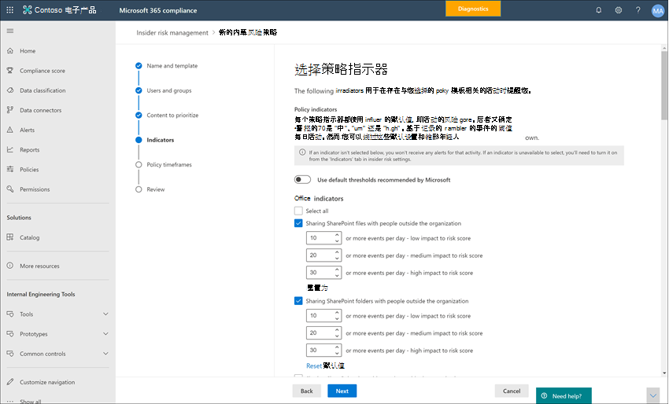

# 内部风险管理设置入门

内部风险管理设置适用于所有内部风险管理策略，而不考虑创建策略时选择的模板。 设置位于所有内部风险管理页面顶部的"内部风险设置"控件配置策略。 这些设置控制以下方面的策略组件：

- 隐私
- 指示器
- 策略日程表
- 智能检测
- 导出警报
- 预览版 (用户组) 
- 预览版 (优先) 
- Power Automate预览 (流) 
- Microsoft Teams (预览) 
- 分析

在开始使用和创建内部风险管理策略之前，了解这些设置并选择最适合组织的合规性需求的设置级别非常重要。

## 隐私

保护具有策略匹配项的用户隐私极为重要，并且有助于在针对内部风险警报的数据调查和分析审阅中提升客观性。 对于具有内部风险策略匹配项的用户，可以选择以下设置之一：

- **显示用户名的** 匿名版本：对用户名进行匿名处理，以防止管理员、数据调查者和审阅者看到与策略警报相关联的人员。 例如在内部风险管理体验的所有领域中，用户 “Grace Taylor” 将以随机的化名显示，例如 “AnonIS8-988”。 选择此设置会匿名处理具有当前和过去策略匹配项的所有用户，并适用于所有策略。 如果选择此选项，内部风险警报和案例详细信息中的用户配置文件信息将不可用。 但是，将新用户添加到现有策略或向新策略分配用户时，将显示用户名。 如果选择关闭此设置，将为具有当前或过去策略匹配项的所有用户显示用户名。

    >[!IMPORTANT]
    >若要为在 Microsoft 365 或其他系统中具有内部风险警报或案例的用户维护参照完整性，不会为导出的警报保留用户名的匿名化。 导出的警报将显示每个警报的用户名。

- **不显示用户名的** 匿名版本：针对警报和事例的所有当前和过去策略匹配显示用户名。 用户配置文件信息 (、职务、别名以及组织或部门) 针对所有内部风险管理警报和案例向用户显示。

## 指示器

内部风险策略模板定义要检测和调查的风险活动类型。 每个策略模板都基于与特定触发器和风险活动对应的特定指标。 默认情况下禁用所有指示器，在配置内部风险管理策略之前，必须选择一个或多个策略指示器。

当用户执行与符合所需阈值的策略指示器相关的活动时，策略将触发警报。 内部风险管理使用两种类型的指示器：

- **触发事件**：确定用户是否正在内部风险管理策略中处于活动状态的事件。 如果添加到内部风险管理策略的用户没有触发事件，则策略不会评估用户活动。 例如，用户 A 通过离开用户策略模板添加到从数据盗窃创建的策略中，并且正确配置了策略Microsoft 365 HR 连接器。 在 HR 连接器报告用户 A 的终止日期之前，此内部风险管理策略不会评估用户 A 活动的风险。 触发事件的另一个示例是用户使用数据泄露策略时是否具有高严重性 DLP *策略* 警报。
- **策略指标**：内部风险管理策略中包含的指示器，用于确定范围内用户的风险评分。 这些策略指示器仅在用户触发事件发生后激活。 策略指示器的一些示例包括：用户将数据复制到个人云存储服务或便携存储设备时、从 Azure Active Directory 中删除用户帐户时，或者用户与未经授权的外部方共享内部文件和文件夹。

某些策略指示器还可用于自定义特定策略模板的触发事件。 在策略向导中为"常规数据泄露"或"按优先用户泄露的数据"模板进行配置时，这些指示器允许您更灵活和自定义策略，以及当用户在策略范围内时。 此外，你可以为这些触发指示器定义单个活动阈值，从而在策略中实现更精细的控制。

策略指示器分为以下几个区域。 在创建内部风险策略时，你可以选择指示器来激活和自定义每个指示器级别的指示器事件限制：

- **Office指示器**：其中包括用于网站SharePoint、Microsoft Teams和电子邮件的策略指示器。
- **设备指示器**：其中包括用于活动（例如，通过网络或设备共享文件）的策略指示器。 指示器包括涉及所有文件类型的活动，不包括可执行 (.exe) 和动态链接库 (.dll) 文件活动。 如果选择"*设备* 指示器"，将处理具有 Windows 10 内部版本 1809 或更高版本以及 macOS (Catalina 10.15 或更高版本的设备) 活动。 对于 Windows 和 macOS 设备，你必须先将设备载入到合规中心。 设备指示器还包括浏览器信号检测，可帮助你的组织检测和处理在 Microsoft Edge 和 Google Chrome 中查看、复制、共享或打印的非可执行文件的过滤信号。 有关配置设备以与内部Windows集成的信息，请参阅本文中的以下启用设备指示器和载入 Windows 设备部分。 有关配置 macOS 设备以便与内部风险集成的信息，请参阅本文中的以下启用设备指示器和载入 macOS 设备部分。 有关浏览器信号检测详细信息，请参阅了解和 [配置内部风险管理浏览器信号检测](insider-risk-management-browser-support.md)。
- **安全策略违反指示器 (预览**) ：其中包括 Microsoft Defender for Endpoint 中与未批准或恶意软件安装或绕过安全控制相关的指示器。 若要在内部风险管理中接收警报，必须启用有效的 Defender for Endpoint 许可证和内部风险集成。 有关为终结点配置 Defender 进行内部风险管理集成的信息，请参阅在 [Microsoft Defender for Endpoint 中配置高级功能](/windows/security/threat-protection/microsoft-defender-atp/advanced-features\#share-endpoint-alerts-with-microsoft-compliance-center)。
- **运行状况记录访问指示器 (预览)**：其中包括患者医疗记录访问的策略指示器。 例如，尝试访问电子医疗记录中的患者医疗记录 (EMR) 可以与内部风险管理医疗保健策略共享。 若要在内部风险管理中接收这些类型的警报，您必须配置了特定于医疗保健的数据连接器和 HR 数据连接器。
- **预览版 (访问**) ：其中包括对敏感资产进行物理访问的策略指示器。 例如，尝试访问物理保护系统日志中的受限区域可以与内部风险管理策略共享。 若要在内部风险管理中接收这些类型的警报，必须在内部风险管理中启用优先物理资产，并配置物理保护 [数据](import-physical-badging-data.md) 连接器。 若要详细了解如何配置物理访问，请参阅本文 [的优先级物理](#priority-physical-assets-preview) 访问部分。
- **Microsoft Defender for Cloud Apps 指示器 (预览)**：其中包括来自 Defender for Cloud Apps 的共享警报的策略指示器。 在 Defender for Cloud Apps 中自动启用异常检测，立即开始检测和整理结果，针对用户以及连接到网络的计算机和设备中的大量行为异常。 若要将这些活动包括在内部风险管理策略警报中，请选择此部分中的一个或多个指示器。 若要了解有关 Defender for Cloud Apps 分析和异常检测的信息，请参阅 [获取行为分析和异常检测](/cloud-app-security/anomaly-detection-policy)。
- **风险评分分数**：这包括提高活动的风险评分（高于用户一天中的常规活动）或针对之前已解决为违反策略的用户的风险评分。 启用风险评分可增加风险评分以及针对这些类型的活动发出警报的可能性。 对于高于用户一天中常规活动的活动，如果检测到的活动偏离用户的典型行为，分数将提高。 对于将以前案例解决为违反策略的用户，如果用户之前将多个案例解析为已确认的策略违反，分数将提高。 只有在选择了一个或多个指标时，才能选择风险评分分数。

在某些情况下，你可能希望限制应用于组织中内部风险策略的内部风险策略指标。 可以通过禁用特定区域的所有内部风险策略来禁用这些策略指示器。 触发事件只能针对根据常规数据泄露或优先用户模板的数据泄露 *创建* 的策略进行修改。 从所有其他模板创建的策略没有可自定义的触发指示器或事件。

要定义在所有内部风险 > 策略中启用的内部风险策略指示器，请导航到"内部风险设置""内部风险设置"**，** 然后选择一个或多个策略指示器。 在策略向导中创建或编辑内部风险策略时，无法单独配置在"指示器设置"页上选择的指示器。

> [!NOTE]
> 手动添加的新用户可能需要几个小时才能显示在用户 **仪表板中**。 过去 90 天内这些用户的活动可能需要多达 24 小时才能显示。 若要查看手动添加的用户的活动，请选择"用户"仪表板上的用户，然后打开详细信息窗格上的"用户 **活动**"选项卡。

### 启用设备指示器并载入Windows设备

若要在 Windows 设备上启用风险活动的监视并包括这些活动的策略指示器，Windows 设备必须满足以下要求，并且必须完成以下载入步骤。

#### 步骤 1：准备终结点

确保在内部Windows 10中规划报告功能的设备满足这些要求。

1. 必须运行 Windows 10 x64 版本 1809 或更高版本，并且必须已安装从 2020 年 2 月 20 日起的 [Windows 10 更新 (OS 内部版本 17763.1075) ](https://support.microsoft.com/help/4537818/windows-10-update-kb4537818)。
2. 用于登录到设备Windows 10用户帐户必须是活动Azure Active Directory (AAD) 帐户。 设备Windows 10已注册AAD、AAD或 Active Directory AAD注册。
3. 在Microsoft Edge设备上安装客户端浏览器，以监视云上传活动的操作。 请参见[下载基于 Chromium 的新 Microsoft Edge](https://support.microsoft.com/help/4501095/download-the-new-microsoft-edge-based-on-chromium)。

#### 步骤 2：载入设备

必须先启用设备监视并载入终结点，然后才能监视设备上内部风险管理活动。 这两项操作均在 Microsoft 365 合规性门户中执行。

当你希望载入尚未载入的设备时，你将下载相应的脚本，并按照以下步骤所述进行部署。

如果你的设备已载入 [到 Microsoft Defender for Endpoint](/windows/security/threat-protection/) 中，则它们已经显示在托管设备列表中。 按照 [步骤 3：如果你的设备已载入下一节中的 Microsoft Defender for Endpoint](insider-risk-management-settings.md#OnboardStep3) 。

在此部署方案中，你将载入尚未载入的设备，并且你只想监视设备内部风险Windows 10活动。

1. 打开 [Microsoft 365 合规中心](https://compliance.microsoft.com)。
2. 打开合规中心设置页面，然后选择“**载入设备**”。

   > [!NOTE]
   > 设备载入通常需要大约 60 秒才能启用，请先等待 30 分钟，然后再与 Microsoft 支持人员接洽。

3. 选择“**设备管理**”，以打开“**设备**”列表。 在载入设备之前，此列表将为空。
4. 选择“**载入**”以开始载入流程。
5. 从部署方法列表中选择你想要部署到这些更多 **设备的方式，** 然后 **下载程序包**。
6. 按照[适用于 Windows 10 计算机的载入工具和方法](/windows/security/threat-protection/microsoft-defender-atp/configure-endpoints)中的相应程序进行操作。 此链接会将你定位到登录页面，你可以在其中访问与在步骤 5 中选择的部署程序包相匹配的 Microsoft Defender for Endpoint 过程：
    - 使用组策略载入 Windows 10 计算机
    - 使用 Microsoft Endpoint Configuration Manager 载入 Windows 10 计算机
    - 使用移动设备管理工具载入 Windows 10 计算机
    - 使用本地脚本载入 Windows 10 计算机
    - 载入非持久性虚拟桌面基础结构 (VDI) 计算机。

完成操作并载入终结点后，它应显示在设备列表中，并且终结点将开始向内部风险管理报告审核活动日志。

> [!NOTE]
> 此体验根据许可证强制实施。 如果没有所需的许可证，数据将不可见或不可访问。

#### 步骤 3：如果你的设备已载入 Microsoft Defender for Endpoint

如果已部署 Microsoft Defender for Endpoint 并且有报告终结点，所有这些终结点都将显示在托管设备列表中。 你可以继续使用步骤 2：载入设备部分将新设备载入内部风险管理，以 [扩大覆盖范围](insider-risk-management-settings.md#OnboardStep2) 。

1. 打开 [Microsoft 365 合规中心](https://compliance.microsoft.com)。
2. 打开合规中心设置页面，然后选择“**启用设备监视**”。
3. 选择“**设备管理**”，以打开“**设备**”列表。 你应该会看到已报告到 Microsoft Defender for Endpoint 中的设备列表。
4. 如果你需要 **载入** 更多设备，请选择载入。
5. 从部署方法列表中选择你想要部署到这些更多 **设备的方式，** 然后选择下载 **程序包**。
6. 按照[适用于 Windows 10 计算机的载入工具和方法](/windows/security/threat-protection/microsoft-defender-atp/configure-endpoints)中的相应程序进行操作。 此链接会将你定位到登录页面，你可以在其中访问与在步骤 5 中选择的部署程序包相匹配的 Microsoft Defender for Endpoint 过程：
    - 使用组策略载入 Windows 10 计算机
    - 使用 Microsoft Endpoint Configuration Manager 载入 Windows 10 计算机
    - 使用移动设备管理工具载入 Windows 10 计算机
    - 使用本地脚本载入 Windows 10 计算机
    - 载入非持久性虚拟桌面基础结构 (VDI) 计算机。

完成后，终结点载入后，它应显示在 **"设备** "表下，终结点将开始向内部风险管理报告审核活动日志。

> [!NOTE]
>此体验根据许可证强制实施。 如果没有所需的许可证，数据将不可见或不可访问。

### 启用设备指示器和载入 macOS 设备

可以将加泰罗尼亚 (10.15 或更高版本) 的 macOS 设备载入 Microsoft 365 以支持使用 Intune 或 JAMF Pro 的内部风险管理策略。 有关详细信息和配置指南，请参阅[将 macOS ](device-onboarding-macos-overview.md)设备载入Microsoft 365预览 (概述) 。

### 预览版 (指示器级别) 

在策略向导中创建策略时，可以配置每日风险事件数如何影响内部风险警报的风险评分。 这些指示器设置可帮助你控制组织中发生风险事件的数量应该如何影响这些事件的风险评分，以及相关的警报严重性。 如果愿意，还可以选择保留 Microsoft 建议的所有已启用指示器的默认事件阈值级别。

例如，你决定在内部风险策略设置中启用 SharePoint 指示器，并设置 SharePoint 事件的自定义阈值，同时配置新的内部风险数据泄露策略 *的指示器。* 在内部风险策略向导中，为每个警报指示器配置三个不同的每日事件级别SharePoint影响与这些事件关联的警报的风险评分。

对于第一个每日事件级别，将阈值设置为每天 *10* 个或多个事件，以将影响低于事件的风险分数、每天 *20* 个或多个事件（中等影响）设置为事件的风险评分，每天 *30* 个或多个事件对事件的风险评分产生更高的影响。 这些设置实际上意味着：

- 如果在触发事件后SharePoint 1-9 个事件，风险评分会受最小影响，并且不会生成警报。
- 如果在触发事件后SharePoint 10-19 个事件，则风险评分本身较低，警报严重性级别往往较低。
- 如果触发后发生 20-29 SharePoint，则风险评分本身会更高，警报严重性级别通常处于中等级别。
- 如果在触发后SharePoint 30 个或多个事件，则风险评分本身会更高，警报严重性级别通常较高。

## 策略时间范围

通过策略时间范围，可以根据内部风险管理策略模板的事件和活动来定义在策略匹配时将触发的过去和将来的审查期。 根据你选择的策略模板，可以使用以下策略时间范围：

- **激活窗口**：激活窗口可用于所有策略模板，它是在触发事件后该窗口激活的已定义天数。 对于分配到策略的任何用户，该窗口在触发事件发生后的 1 到 30 天内激活。 例如，你已配置内部风险管理策略，将激活 *窗口设置为* 30 天。 配置策略后已经过几个月，并且策略中包含的用户之一将发生触发事件。 触发事件将激活 *"* 激活"窗口，并且该策略在触发事件发生后的 30 天内为该用户激活。
- **过去的活动** 检测：过去的活动检测可用于所有策略模板，它是在触发事件之前窗口激活的已定义天数。 在分配给该策略的任何用户触发事件发生之前，窗口将激活 0 到 90 天。 例如，你已配置内部风险管理策略，将过去 *的活动检测* 设置为 90 天。 配置策略后已经过几个月，并且策略中包含的用户之一将发生触发事件。 触发事件激活" *过去"活动检测* ，并且策略在触发事件前 90 天内收集该用户的历史活动。

## 智能检测

智能检测设置有助于优化如何针对警报处理风险活动的检测。 在某些情况下，您可能需要定义要忽略的文件类型，或者希望对日常事件强制执行检测级别以提高用户的风险评分。 使用这些设置可控制文件类型排除、增加异常活动的风险评分以及文件卷限制。

### 文件类型排除项

若要从所有内部风险管理策略匹配中排除特定文件类型，请输入以逗号分隔的文件类型扩展名。 例如，如果要从策略匹配中排除某些类型的音乐文件，可以在“**文件类型排除**”字段中输入 *aac、mp3、wav、wma*。 具有这些扩展名的文件将被所有内部风险管理策略忽略。

### 用于提升异常活动的分数的最小每日事件数

通过此设置，可定义需要多少每日事件才能提升用户认为异常的活动的风险评分。 例如，假设你为此风险防范者输入 25。 如果用户在过去 30 天内平均下载了 10 个文件，但策略检测到他们一天下载了 20 个文件，该活动的分数不会提高，即使对于该用户来说不常见，因为当天他们下载的文件数小于你为此风险防范输入的数量。

### 警报量

为内部风险策略检测到的用户活动分配一个特定的风险评分，该分数反过来确定低、 (、中等、高) 。 默认情况下，我们将生成一定数量的低、中和高严重性警报，但你可以增加或减少量以满足你的需求。 若要调整所有内部风险管理策略的警报量，请选择以下设置之一：

- **更少的警报**：你将看到所有高严重性警报、更少的中等严重性警报和低严重性警报。 此设置级别意味着你可能错过一些真正的误报。
- **默认卷**：你将看到所有高严重性警报以及中等和低严重性警报的平衡量。
- **更多警报**：你将看到所有中高严重性警报和最低严重性警报。 此设置级别可能会导致误报更多。

### Microsoft Defender for Endpoint (预览) 

[Microsoft Defender for Endpoint](/windows/security/threat-protection/microsoft-defender-atp/microsoft-defender-advanced-threat-protection) 是一个企业终结点安全平台，旨在帮助企业网络预防、检测、调查和响应高级威胁。 为了更好地查看组织中安全违规的情况，你可以导入并筛选 Defender for Endpoint 警报，以用于从内部风险管理安全违反策略模板创建的策略中使用的活动。

根据你感兴趣的信号类型，你可以选择根据 Defender for Endpoint 警报会审状态将警报导入内部风险管理。 可以在要导入的全局设置中定义以下一个或多个警报会审状态：

- 未知
- 新增
- 正在进行
- 已解决

来自 Defender for Endpoint 的警报每天导入一次。 根据你选择的会审状态，你可能会看到与 Defender for Endpoint 中的会审状态更改相同的警报的多个用户活动。

例如，如果你为此设置选择"新建"、正在进行和"已解决"，则当生成 Microsoft Defender for Endpoint 警报且状态为 *"* 新建"时，会为存在内部风险的用户导入初始警报活动。 当 Defender for Endpoint 会审状态更改为"正在进行"时，会为存在内部风险的用户导入此警报的第二个活动。 当设置"已解决"的最终 Defender 终结点会审状态时，会为存在内部风险的用户导入此警报的第三个活动。 此功能允许调查人员跟踪 Defender for Endpoint 警报进度并选择其调查所需的可见性级别。

> [!IMPORTANT]
> 需要在你的组织中配置 Microsoft Defender for Endpoint，并且启用 Defender for Endpoint 以实现在 Defender 安全中心中的预览体验计划风险管理集成，以导入安全冲突警报。 若要详细了解如何配置 Defender for Endpoint，实现预览体验计划风险管理集成，请参阅 [在Defender for Endpoint中配置高级功能](/windows/security/threat-protection/microsoft-defender-atp/advanced-features\#share-endpoint-alerts-with-microsoft-compliance-center)。

### 域

域设置可帮助你为特定域的活动定义风险级别。 这些活动包括共享文件、发送电子邮件、下载或上载内容。 通过指定这些设置中的域，您可以增加或降低使用这些域进行的活动的风险评分。

使用"添加域"为每个域设置定义一个域。 此外，您还可以使用通配符帮助匹配根域或子域的变体。 例如，若要指定 sales.wingtiptoys.com 和 support.wingtiptoys.com，请使用通配符条目"*.wingtiptoys.com"来匹配这些子域 (以及同一级别的任何子域) 。 若要为根域指定多级子域，必须选中"包括 **多级子域"** 复选框。

对于以下每个域设置，您最多可以输入 500 个域：

- **不允许的域：** 通过指定不允许的域，使用这些域进行的活动将具有 *更高的* 风险评分。 例如，涉及与某人共享内容的活动 (例如向具有 gmail.com 地址) 的用户发送电子邮件，以及用户从这些不允许的域之一将内容下载到设备时。
- **允许的域：** 策略将忽略与允许域相关的某些活动，并且不会生成警报。 这些活动包括：

    - 发送到外部域的电子邮件
    - 与外部域共享的文件、文件夹、网站
    - 使用浏览器管理程序 (外部Microsoft Edge域) 

    通过指定设置中的允许域，将处理具有这些域的此活动，这类似于处理内部组织活动的方式。 例如，此处添加的域映射到活动可能涉及与组织外部的某人共享内容 (例如向具有 gmail.com 地址的用户发送电子邮件) 。

- **第三方域：** 如果你的组织将第三方域用于业务用途 (如云存储) ，请在此处包括它们，以便你可以收到与设备指示器使用浏览器下载第三方网站内容相关的活动的警报。

## 导出警报

内部风险管理警报信息可导出到安全信息和事件管理 (SIEM) ，以及安全业务流程通过使用 Office 365 管理活动 [API](/office/office-365-management-api/office-365-management-activity-api-schema#security-and-compliance-alerts-schema) 架构自动响应 (SOAR) 解决方案。 可以使用管理Office 365 API 将警报信息导出到组织可能用于管理或聚合内部风险信息的其他应用程序。 警报信息通过管理活动 API 每 60 分钟导出Office 365一次。

如果你的组织使用 Microsoft Sentinel，则还可使用开箱即用的内部风险管理数据连接器将内部风险警报信息导入 Sentinel。 有关详细信息，请参阅 Microsoft Sentinel Microsoft 365中的预览Microsoft 365内部风险管理 ([I)  (RM ](/azure/sentinel/data-connectors-reference#microsoft-365-insider-risk-management-irm-preview)) 预览版。

>[!IMPORTANT]
>若要为在 Microsoft 365 或其他系统中具有内部风险警报或案例的用户维护参照完整性，不会为导出的警报保留用户名的匿名化。 导出的警报将显示每个警报的用户名。

若要使用 API 查看内部风险警报信息：

1. 在Office 365风险管理中启用管理活动 API >  >  设置 **报告警报**。 默认情况下，为组织禁用Microsoft 365设置。
2. 按 *SecurityComplianceAlerts* Office 365常见审核活动。
3. 按 *InsiderRiskManagement* 类别筛选 *SecurityComplianceAlerts*。

警报信息包含来自安全与合规性警报架构以及 Office 365活动 API 通用架构的信息。

针对安全与合规警报架构的内部风险管理警报导出&值：

| **Alert 参数** | **说明** |
|:------------------|:----------------|
| AlertType | 警报的类型为 *"自定义"*。  |
| AlertId | 警报的 GUID。 内部风险管理警报是可变的。 当警报状态更改时，将生成一个同一 AlertID 的新日志。 此 AlertID 可用于关联警报的更新。 |
| 类别 | 警报的类别为 *InsiderRiskManagement*。 此类别可用于区别于其他安全与合规&警报。 |
| 备注 | 警报的默认注释。 值为"*新建* (警报"，) 警报更新 (更新时记录警报更新) 。 使用 AlertID 关联警报的更新。 |
| Data | 警报的数据包括唯一用户 ID、用户主体名称以及将用户触发到策略 (UTC) 日期和时间。 |
| 名称 | 生成警报的内部风险管理策略的策略名称。 |
| PolicyId | 触发警报的内部风险管理策略的 GUID。 |
| Severity | 警报的严重性。 值为 *High、**Medium* 或 *Low*。 |
| Source | 警报的来源。 此值为Office 365 *安全&合规性*。 |
| 状态 | 警报的状态。 值为内部风险) 中的活动  (需要评审、*调查 (在* 内部风险) 中确认、已 *解决 (在* 内部风险) 中已解决、在内部风险中 (已消除) 。  |
| 版本 | 安全性和合规性警报架构的版本。 |

针对管理活动 API 通用架构的内部风险管理警报导出Office 365[和值](/office/office-365-management-api/office-365-management-activity-api-schema#common-schema)。

- UserID
- Id
- RecordType
- CreationTime
- 操作
- OrganizationId
- UserType
- UserKey

## 预览版 (用户组) 

您组织的用户可能具有不同的风险级别，具体取决于他们的位置、对敏感信息的访问级别或风险历史记录。 确定检查这些用户的活动并评分的优先级可帮助提醒您注意可能给组织造成更大后果的潜在风险。 内部风险管理中的优先用户组有助于定义组织中需要更仔细的检查和更敏感的风险评分的用户。 与优先级用户违反安全策略和按优先级用户泄露数据策略模板一起，添加到优先级用户组的用户具有更高严重性级别的内部风险警报和警报的可能性。

优先级用户组可能还需要将审阅活动限制为特定用户或内部风险角色组，而不是所有分析师和研究人员都进行审核。 可以选择分配单个用户和角色组，以便查看每个优先级用户组的用户、警报、案例和报告。 优先级用户组可以拥有分配给内置内部风险管理、内部风险管理分析师和内部风险管理研究人员角色组、这些角色组的一个或多个角色组或自定义选择的用户的审阅权限。

例如，您需要防止高度机密项目的数据泄露，其中用户有权访问敏感信息。 选择 *为组织中Project* 此项目的用户创建"用户优先级"用户组。 此外，此优先级用户组不应让与组关联的用户、警报、案例和报告对所有默认的内部风险管理管理员、分析师和研究人员可见。 在 **设置** 中，创建"机密Project *用户* 优先级用户"组，并分配两个用户作为审阅者来查看与组相关的数据。 使用策略向导和"按优先级用户泄露数据"策略模板，可创建新策略并将"机密Project *用户* 优先级用户"组分配给该策略。 策略针对机密 *Project 用户* 优先级用户组的成员检查的活动对风险更为敏感，这些用户的活动更有可能生成警报，并且具有严重性级别更高的警报。

### 创建优先级用户组

若要创建新的优先级用户组，你将使用预览体验成员风险管理解决方案中的设置Microsoft 365 合规中心。 若要创建优先级用户组，您必须是 *Insider Risk Management* 或 *Insider Risk Management Admin* 角色组的成员。

完成以下步骤以创建优先级用户组：

1. In the [Microsoft 365 合规中心](https://compliance.microsoft.com)， go to **Insider risk management** and select **Insider risk settings**.
2. Select the **Priority user groups (preview)** page.
3. 在"**预览 (** 用户组) 页上，选择"创建优先级用户组"以启动组创建向导。
4. 在" **名称和描述"** 页上，填写以下字段：
    - **名称 (必)**：输入优先级用户组的友好名称。 完成向导后，你无法更改优先级用户组的名称。
    - **说明 (可选)**：输入优先级用户组的说明。
5. 选择“**下一步**”以继续。
6. 在 **"选择成员**"页上，选择"选择要搜索的成员"，然后选择组中包含哪些已启用邮件的用户帐户，或选中"全选"复选框以将组织中所有用户添加到组中。 选择 **"添加** "继续，或 **选择"取消** "以关闭而不向组添加任何用户。
7. 选择“**下一步**”以继续。
8. 在 **"选择可以查看此组** 的用户"页上，您必须定义可以查看优先用户组的用户、警报、案例和报告的用户。 必须至少分配一个用户或内部风险管理角色组。 选择 **"选择用户和角色组** "，然后选择要分配给优先级用户组的用户或内部风险管理角色组。 选择 **"** 添加"将所选用户或角色组分配给该组。
9. 选择“下一步”以继续。
10. 在 **"审阅** "页上，查看为优先级用户组选择的设置。 选择" **编辑** "链接以更改任何组值，或 **选择"提交** "创建并激活优先级用户组。
11. 在确认页上，选择" **完成** "退出向导。

### 更新优先级用户组

若要更新现有优先级用户组，你将使用预览体验成员风险管理解决方案中的设置Microsoft 365 合规中心。 若要更新优先级用户组，您必须是 *Insider Risk Management* 或 *Insider Risk Management Admin* 角色组的成员。

完成以下步骤以编辑优先级用户组：

1. In the [Microsoft 365 合规中心](https://compliance.microsoft.com)， go to **Insider risk management** and select **Insider risk settings**.
2. Select the **Priority user groups (preview)** page.
3. 选择要编辑的优先级用户组，然后选择"编辑 **组"**。
4. 在" **名称和描述"页上** ，根据需要更新"说明"字段。 无法更新优先级用户组的名称。 选择“**下一步**”以继续。
5. 在" **选择成员** "页上，使用"选择成员"控件将 **新成员添加到** 组中。 若要从组中删除用户，请选择要删除的用户旁边的"X"。 选择“**下一步**”以继续。
6. 在 **"选择可以查看此组** 的用户"页上，添加或删除可以查看优先用户组的用户、警报、事例和报告的用户或角色组。
7. 选择“**下一步**”以继续。
8. 在 **"审阅** "页上，查看为优先级用户组选择的更新设置。 选择" **编辑** "链接以更改任何组值，或 **选择"提交** "以更新优先级用户组。
9. 在确认页上，选择" **完成** "退出向导。

### 删除优先级用户组

若要删除现有的优先级用户组，你将使用预览体验成员风险管理解决方案中的设置Microsoft 365 合规中心。 若要删除优先级用户组，您必须是 *Insider Risk Management* 或 *Insider Risk Management Admin* 角色组的成员。

> [!IMPORTANT]
> 删除优先级用户组会将其从分配到的任何活动策略中删除。 如果删除分配给活动策略的优先级用户组，该策略将不包含任何范围内用户，并且实际上处于空闲状态，并且不会创建警报。

完成以下步骤以删除优先级用户组：

1. In the [Microsoft 365 合规中心](https://compliance.microsoft.com)， go to **Insider risk management** and select **Insider risk settings**.
2. Select the **Priority user groups (preview)** page.
3. 选择要编辑的优先级用户组， **然后从仪表板** 菜单中选择"删除"。
4. 在" **删除** "对话框中，选择 **"** 是"删除优先级用户组，或选择" **取消** "返回到仪表板。

## 预览版 (优先) 

确定对优先物理资产的访问权限以及将访问活动与用户事件关联是合规性基础结构的一个重要组件。 这些物理资产代表组织中优先的位置，例如公司大楼、数据中心或服务器会议室。 内部风险活动可能与非正常时间工作、尝试访问这些未经授权的敏感或安全区域的用户以及请求在没有合理需求的情况下访问高级区域相关联。

启用优先物理资产并配置 [物理](import-physical-badging-data.md) 保护数据连接器后，内部风险管理将来自物理控制和访问系统的信号与其他用户风险活动集成在一起。 通过检查物理访问系统之间的行为模式，以及将这些活动与其他内部风险事件关联，内部风险管理可帮助合规研究人员和分析师对警报做出更明智的响应决策。 对优先物理资产的访问权限的评分和标识在见解中与访问非优先级资产的方式不同。

例如，您的组织具有一个供用户监视和批准对正常工作区域和敏感项目区域的物理访问的保护系统。 多个用户在处理敏感项目，项目完成后，这些用户将返回到组织的其他区域。 当敏感项目接近完成时，您需要确保项目工作保持机密，并严格控制对项目区域的访问权限。

选择在安全机制中启用物理Microsoft 365连接器，以从物理保护系统导入访问信息，并指定内部风险管理中的优先物理资产。 通过从错误系统导入信息，将物理访问信息与内部风险管理中确定的其他风险活动关联，你会注意到项目中的一个用户在正常工作时间之后访问项目办公室，并且正在从正常的工作区将大量数据导出到个人云存储服务。 此与联机活动相关的物理访问活动可能指向可能的数据盗窃和合规性研究人员，分析员可以按照此用户的情况采取相应操作。

### 配置优先物理资产

若要配置优先物理资产，您需要配置物理保护连接器，并使用预览体验成员风险管理解决方案中的设置Microsoft 365 合规中心。 若要配置优先物理资产，您必须是 *Insider Risk Management* 或 *Insider Risk Management Admin 角色组的成员*。

完成以下步骤以配置优先物理资产：

1. 按照内部风险管理入门一文中的内部 [风险管理配置](insider-risk-management-configure.md) 步骤操作。 在步骤 3 中，确保配置物理保护连接器。

    > [!IMPORTANT]
    > 若要内部风险管理策略使用与离开和终止用户相关的信号数据并将该数据与物理控制和访问平台的事件数据关联，还必须配置 Microsoft 365 HR 连接器。 如果在未启用 Microsoft 365 HR 连接器的情况下启用物理保护连接器，内部风险管理策略将仅处理组织中用户的物理访问活动的事件。

2. In the [Microsoft 365 合规中心](https://compliance.microsoft.com)， go to **Insider risk management** and select **Insider risk** **settingsPriority** >  physical assets.
3. 在"优先级物理资产"页上，您可以手动添加要监视的物理资产 ID，以检查物理保护连接器导入的资产事件，也可以导入由物理保护连接器导入的所有物理资产 ID 的 .csv 文件：一个) 若要手动添加物理资产 ID，请选择"添加优先物理资产 **"，** 输入物理资产 ID，然后选择"添加 **"**。 输入其他物理资产 ID，然后选择" **添加优先级物理** 资产"以保存输入的所有资产。
    b) 若要从文件添加物理资产.csv，请选择"导入优先 **物理资产"**。 从文件资源管理器对话框中，选择要导入.csv文件，然后选择"打开 **"**。 文件的物理资产.csv添加到列表中。
4. 导航到策略 **中的"策略指示器**"**设置**。
5. 在"**策略指示器"** 页上，导航到"物理访问指示器"部分，然后选中"终止或无法访问敏感资产后的物理 **访问"复选框**。
6. 选择 **"保存** "以配置并退出。

### 删除优先级物理资产

若要删除现有优先级物理资产，你将使用预览体验成员风险管理解决方案中的设置Microsoft 365 合规中心。 若要删除优先级物理资产，您必须是 Insider Risk Management 或 Insider Risk Management Admin 角色组的成员。

> [!IMPORTANT]
> 删除优先级物理资产会将其从之前包含到的任何活动策略的检查中取消。 不删除由与优先级物理资产关联的活动生成的警报。

完成以下步骤以删除优先物理资产：

1. In the [Microsoft 365 合规中心](https://compliance.microsoft.com)， go to **Insider risk management** and select **Insider risk** **settingsPriority** >  physical assets.
2. 在" **优先级物理资产** "页上，选择要删除的资产。
3. 在 **操作** 菜单上选择"删除"以删除资产。

## Power Automate预览 (流) 

[Microsoft Power Automate](/power-automate/getting-started) 是一种工作流服务，可跨应用程序和服务自动执行操作。 通过使用来自模板的流或手动创建的流，可以自动执行与这些应用程序和服务关联的常见任务。 启用内部Power Automate流时，可以自动执行事例和用户的重要任务。 你可以配置Power Automate流来检索用户、警报和案例信息，并与利益干系人和其他应用程序共享此信息，以及自动执行内部风险管理中的操作，例如发布到案例记录。 Power Automate流适用于策略范围内的情况和任何用户。

具有 Microsoft 365（包括内部风险管理）的客户无需额外的 Power Automate 许可证，就可使用建议的内部风险管理模板Power Automate模板。 可以自定义这些模板以支持你的组织并涵盖核心内部风险管理方案。 如果您选择使用这些模板中的高级 Power Automate 功能、使用 Microsoft 365 合规性连接器创建自定义模板或使用 Microsoft 365 中其他合规性领域的 Power Automate 模板，您可能需要更多 Power Automate 许可证。

以下Power Automate模板提供给客户，以支持内部风险管理用户和事例的过程自动化：

- 将 **用户添加到** 内部风险策略时通知用户：此模板适用于具有内部策略、隐私或法规要求的组织，在用户受内部风险管理策略的约束时，必须通知他们。 在"用户"页中为用户配置和选择此流时，当用户添加到内部风险管理策略时，会向用户及其经理发送电子邮件。 此模板还支持更新 SharePoint 网站上承载SharePoint列表，以帮助跟踪通知邮件详细信息，如日期/时间和邮件收件人。 如果你已选择在"隐私设置"中匿名处理用户，则从此模板创建的流将不会如预期方式工作，以维持用户隐私。 Power Automate模板的流在用户仪表板 **上可用**。
- 向 **HR 或业务** 请求有关内部风险案例中用户的信息：当对案例采取行动时，内部风险分析员和调查人员可能需要咨询 HR 或其他利益干系人，以了解案例活动的上下文。 为案例配置和选择此流后，分析员和研究人员会向为此流程配置的 HR 和业务利益干系人发送电子邮件。 向每个收件人发送一封邮件，其中包含预配置或可自定义的响应选项。 当收件人选择响应选项时，该响应将记录为案例注释，并包括收件人和日期/时间信息。 如果你已选择在"隐私设置"中匿名处理用户，则从此模板创建的流将不会如预期方式工作，以维持用户隐私。 Power Automate模板的流在案例仪表板 **上可用**。
- **当用户有内部风险警报时** 通知经理：当用户具有内部风险管理警报时，某些组织可能需要立即发送管理通知。 配置和选择此流后，会向案例用户的经理发送一封电子邮件，包含有关所有案例警报的以下信息：
    - 警报的适用策略
    - 警报的日期/时间
    - 警报的严重性级别

    该流自动更新案例，提示消息已发送且流已激活。 如果你已选择在"隐私设置"中匿名处理用户，则从此模板创建的流将不会如预期方式工作，以维持用户隐私。 Power Automate模板的流在案例仪表板 **上可用**。
- **在 ServiceNow 中为内部** 风险案例创建记录：此模板适用于想要使用其 ServiceNow 解决方案跟踪内部风险管理案例的组织。  在这种情况下，内部风险分析师和研究人员可以在 ServiceNow 中为案例创建记录。 您可以自定义此模板，以根据组织的要求填充 ServiceNow 中的选定字段。 Power Automate模板的流在案例仪表板 **上可用**。 有关可用 ServiceNow 字段的信息，请参阅 [ServiceNow 连接器参考](/connectors/service-now/) 文章。

### 从内部Power Automate模板创建管理流

若要从建议的内部风险管理模板创建 Power Automate 流，你将使用 Microsoft 365 合规中心 中预览体验成员风险管理解决方案中的设置控件，或者当直接在"案例"或"事例"中操作时，从"自动化"控件使用"管理 **Power Automate**  **流"选项。用户仪表板**。

若要在Power Automate区域创建管理流，您必须是 *Insider Risk Management* 或 *Insider Risk Management Admin* 角色组的成员。 若要使用Power Automate流"选项创建Power Automate流，您必须至少是一个内部风险管理角色组的成员。

完成以下步骤以从建议的Power Automate内风险管理模板创建一个流：

1. In the [Microsoft 365 合规中心](https://compliance.microsoft.com)， go to **Insider risk management** and select **Insider risk settings** >  **Power Automate flows**. 您还可以通过选择"自动管理流"，从"事例"或"用户 > "仪表板 **Power Automate访问**。
2. 在"**Power Automate** 流"页上，从页面上的"预览体验成员风险管理模板"部分选择推荐的模板。
3. 该流列出流所需的嵌入连接，并记录连接状态是否可用。 如果需要，请更新任何未显示为可用的连接。 选择 **继续**。
4. 默认情况下，推荐流预配置了建议的内部风险管理Microsoft 365完成流的分配任务所需的服务数据字段。 如果需要，使用"显示高级选项"控件并配置流组件的可用属性来自定义流组件。
5. 如果需要，通过选择"新建步骤"按钮将任何其他步骤 **添加到** 流中。 在大多数情况下，建议的默认模板不需要这样做。
6. 选择 **"保存草稿** "以保存流以进一步配置，或选择" **保存** "以完成流的配置。
7. 选择 **"** 关闭"以返回到"**Power Automate流"** 页。 新模板将在"我的流"选项卡上作为流列出，当为创建流程的用户处理内部风险管理案例时，它将自动从"自动"下拉列表控件中提供。

> [!IMPORTANT]
> 如果组织中其他用户需要访问流，则必须共享该流。

### 为内部Power Automate创建自定义管理流

您的组织的一些流程和工作流可能位于建议的内部风险管理流模板之外，您可能需要为内部风险管理领域创建自定义 Power Automate 流。 Power Automate流程非常灵活，并支持大量自定义，但需要执行一些步骤来与内部风险管理功能集成。

完成以下步骤，为内部风险管理Power Automate自定义管理模板：

1. **检查你的Power Automate** 流许可证：若要Power Automate内部风险管理触发器的自定义流，你将需要一个Power Automate许可证。 建议的内部风险管理流模板不需要额外的许可，并作为内部风险管理许可证的一部分包含在内。
2. **创建自动化流**：创建在内部风险管理事件触发后执行一个或多个任务的流。 若要详细了解如何创建自动化流，[请参阅在 Power Automate](/power-automate/get-started-logic-flow)。
3. **Select the Microsoft 365 compliance connector**： Search for and select the Microsoft 365 compliance connector. 此连接器支持内部风险管理触发器和操作。 有关连接器详细信息，请参阅连接器 [参考概述](/connectors/connector-reference/) 文章。
4. **为流选择内部风险管理触发器**：内部风险管理有两个触发器可用于自定义Power Automate流：
    - **对于所选的内部风险管理案例**：可以从内部风险管理案例仪表板页面选择具有此触发器的流。
    - **对于选定的内部风险管理用户**：可以从内部风险管理用户仪表板页面选择具有此触发器的流。
5. 为流选择内部风险管理操作：可以从多个内部风险管理操作中选择，以包括在自定义流中：
    - 获取内部风险管理警报
    - 获取内部风险管理案例
    - 获取内部风险管理用户
    - 获取案例的内部风险管理警报
    - 添加内部风险管理案例注释

### 共享Power Automate流

默认情况下，Power Automate创建的流仅对该用户可用。 若要使其他内部风险管理用户能够访问和使用流，该流必须由流创建者共享。 若要共享流，当直接在"事例"或"用户"仪表板页面中操作时，你将使用 Microsoft 365 合规中心 中的预览体验成员风险管理解决方案中的设置控件或自动执行控件中的"管理 **Power Automate** 流 **"选项。**  共享流后，共享它的每个人都可以在"案例"和"用户"仪表板的"自动控制"下拉列表中访问 **该流**。

若要在Power Automate共享管理流，你必须是 *内部* 风险管理或内部风险管理 *管理员角色* 组的成员。 若要通过"Power Automate流"选项共享Power Automate流，您必须至少是一个内部风险管理角色组的成员。

完成以下步骤以共享Power Automate流：

1. In the [Microsoft 365 合规中心](https://compliance.microsoft.com)， go to **Insider risk management** and select **Insider risk settings** >  **Power Automate flows**. 您还可以通过选择"自动管理流"，从"事例"或"用户 > "仪表板 **Power Automate访问**。
2. 在"**Power Automate"** 页上，选择"**我的** 流"或"**团队流"** 选项卡。
3. 选择要共享的流 **，然后从** "流选项"菜单中选择"共享"。
4. 在"流共享"页上，输入要添加为流所有者的用户或组的名称。
5. 在" **已使用** 连接"对话框中，选择 **"确定** "确认添加的用户或组将具有对流的完全访问权限。

### 编辑Power Automate流

若要编辑流，当直接在事例或用户仪表板中操作时，你将使用 Microsoft 365 合规中心 中的预览体验成员风险管理解决方案中的设置控件或自动执行控件中的"管理 **Power Automate** 流"**选项**。 

若要编辑Power Automate区域中的流，您必须是 *Insider Risk Management* 或 *Insider Risk Management Admin* 角色组的成员。 若要使用"Power Automate流"选项编辑Power Automate流，您必须至少是一个内部风险管理角色组的成员。

完成以下步骤以编辑Power Automate流：

1. In the [Microsoft 365 合规中心](https://compliance.microsoft.com)， go to **Insider risk management** and select **Insider risk settings** >  **Power Automate flows**. 您还可以通过选择"自动管理流"，从"事例"或"用户 > "仪表板 **Power Automate访问**。
2. 在"**Power Automate流**"页上，选择要编辑的流，然后从"流控制"菜单中选择"编辑"。
3. 选择 **省略号** > **设置** 更改流组件设置或省略 **号** > **删除** 流组件。
4. 选择 **"保存****"，** 然后选择"关闭"以完成流的编辑。

### 删除Power Automate流

若要删除流，当你直接在事例或用户仪表板中操作时，你将使用 Microsoft 365 合规中心 中的预览体验成员风险管理解决方案中的设置控件或自动执行控件中的"管理 **Power Automate** 流"**选项**。  删除流时，会将其作为所有用户的选项删除。

若要删除Power Automate区域中的流，您必须是 *Insider Risk Management* 或 *Insider Risk Management Admin* 角色组的成员。 若要使用"Power Automate流"选项删除Power Automate流，您必须至少是一个内部风险管理角色组的成员。

完成以下步骤以删除Power Automate流：

1. In the [Microsoft 365 合规中心](https://compliance.microsoft.com)， go to **Insider risk management** and select **Insider risk settings** >  **Power Automate flows**. 您还可以通过选择"自动管理流"，从"事例"或"用户 > "仪表板 **Power Automate访问**。
2. 在"**Power Automate** 流"页上，选择要删除的流，然后从"流控制"菜单中选择"删除"。
3. 在删除确认对话框中，选择 **"删除** "以删除流，或选择" **取消** "退出删除操作。

## Microsoft Teams (预览) 

合规性分析师和研究人员可以轻松使用Microsoft Teams内部风险管理案例进行协作。 他们可以与其他利益干系人进行协调和沟通，Microsoft Teams：

- 协调并审阅私人频道中Teams活动
- 安全地共享和存储与个别案件相关的文件和证据
- 跟踪和审阅分析员和调查人员的响应活动

启用Microsoft Teams内部风险管理后，每次确认Microsoft Teams并创建案例时，都会创建专用团队。 默认情况下，该团队自动包括预览体验成员风险管理、内部风险管理分析师和内部风险管理研究人员角色组的所有成员 (最多 100 名初始) 。 创建团队后，可在适当时将其他组织参与者添加到团队中。 对于在启用Microsoft Teams之前创建的现有事例，分析员和Microsoft Teams如果需要，可以选择创建一个新的事例团队。  在内部风险管理中解决关联案例后，团队会自动存档 (移动到隐藏和只读) 。

有关如何使用团队和频道在 Microsoft Teams 中[Microsoft Teams。](/MicrosoftTeams/teams-channels-overview)

启用Microsoft Teams案例支持快速且易于配置。 若要启用Microsoft Teams内部风险管理，请完成以下步骤：

1. In the [Microsoft 365 合规中心](https://compliance.microsoft.com)， go to **Insider risk** **managementInsider** >  risk settings.
2. 选择"**Microsoft Teams**"页。
3. 启用Microsoft Teams风险管理的集成。
4. 选择 **"保存** "以配置并退出。

### 为Microsoft Teams案例创建一个团队

如果你在拥有Microsoft Teams案例后启用对内部风险管理的支持，则需要根据需要手动为每个案例创建一个团队。 在内部Microsoft Teams设置中启用支持后，新案例将自动创建新Microsoft Teams团队。

用户需要在组织中创建Microsoft 365组，才能根据Microsoft Teams创建团队。 有关管理组权限Microsoft 365，请参阅管理[哪些人可以创建Microsoft 365组](../solutions/manage-creation-of-groups.md)。

若要为案例创建团队，你将在直接处理现有案例时使用"创建 Microsoft 团队"控件。 完成以下步骤以创建新团队：

1. In the [Microsoft 365 合规中心](https://compliance.microsoft.com)， go to **Insider risk** **managementCases** >  and select an existing case.
2. 在"案例操作"菜单上，选择 **"创建 Microsoft 团队"**。
3. 在"**团队名称**"字段中，输入新团队Microsoft Teams的名称。
4. 选择 **"创建 Microsoft 团队"** ，然后选择"关闭 **"**。

根据分配给内部风险管理角色组的用户数，可能需要 15 分钟，才能将所有研究人员和分析师添加到案例的 Microsoft Teams 团队。

## 分析

通过预览体验计划风险分析，无需配置任何预览体验计划风险策略，即可对组织中潜在的预览体验成员风险进行评估。 此评估可以帮助组织确定用户风险更高的潜在领域，并可帮助确定可能考虑配置的预览体验计划风险管理策略的类型和范围。 分析扫描为组织提供了以下优势：

- 易于配置：若要开始使用分析 > 扫描，可以选择"在分析建议提示时运行扫描"或转到"预览体验成员风险设置"**"** 分析"并启用分析。
- 设计时的隐私：扫描结果和见解作为聚合和匿名用户活动返回，审阅者无法识别各个用户名。
- 通过综合见解了解潜在风险：扫描结果可帮助您快速识别用户的潜在风险区域，以及最适合帮助降低这些风险的策略。

请查看 [Insider Risk Management Analytics 视频](https://www.youtube.com/watch?v=5c0P5MCXNXk) ，帮助了解分析如何有助于加快识别潜在内部风险并帮助快速采取行动。

分析扫描多个来源的风险活动事件，以帮助识别对潜在风险领域的见解。 根据当前的配置，分析将查找以下领域的符合条件的风险活动：

- **Microsoft 365审核日志**：这一点包含在所有扫描中，是标识大多数可能存在风险的活动的主要来源。
- **Exchange Online**：所有扫描中都包含Exchange Online活动有助于识别将附件数据通过电子邮件发送给外部联系人或服务的活动。
- **Azure Active Directory**：所有扫描中都包含Azure Active Directory历史记录有助于识别与具有已删除用户帐户的用户关联的有风险活动。
- **Microsoft 365 HR** 数据连接器：如果配置，HR 连接器事件有助于识别与具有提前或即将终止日期的用户相关的风险活动。

来自扫描的分析见解基于内部风险管理策略使用的相同风险活动信号，并基于单一和顺序用户活动报告结果。 但是，分析的风险评分基于最多 30 天的活动，而内部风险策略使用每日活动进行见解。 首次在组织中启用和运行分析时，你将看到一天的扫描结果。 如果保持启用分析功能，你将看到每个每日扫描的结果添加到见解报告中，了解前 30 天活动的最大范围。

### 启用分析并启动扫描

若要启用内部风险分析，你必须是内部风险管理、内部风险管理管理员或全局Microsoft 365 *组* 的成员。 
完成以下步骤以启用内部风险分析：

1. 在 [Microsoft 365 合规中心中](https://compliance.microsoft.com)，转到 **"内部风险管理"**。
2. 在 **"内部** 风险管理概述"选项卡上的"扫描 **组织卡中的** 内部风险"中选择" **运行扫描"** 。这将为组织启用分析扫描。 您还可以在组织中打开 > 扫描，方法为导航到"内部风险设置""分析"，并启用"扫描租户的用户活动"以 **识别潜在内部风险**。
3. 在" **分析详细信息"** 窗格中，选择" **运行扫描** "开始组织的扫描。 分析扫描结果可能最多需要 48 小时，之后见解才可作为报告可用以供评审。

### 查看分析见解并创建新策略

为组织完成第一次分析扫描后，您可以查看用户对可能存在风险的活动的见解和建议。 除非你为组织关闭分析，否则每日扫描将继续进行。 若要查看组织的潜在风险，请转到概述选项卡，然后选择预览体验成员风险分析卡上的 **查看** 结果。 如果组织的扫描未完成，你将看到一条消息，表明扫描仍处于活动状态。

对于已完成的扫描，你将看到在组织中发现的潜在风险，以及解决这些风险的见解和建议。 已识别的风险和特定见解包含在按区域分组的报告、具有已识别风险的用户总数、具有潜在风险活动的这些用户的百分比，以及可帮助缓解这些风险的建议内部风险策略中。 报告包括：

- **数据泄露见解**：所有用户的活动，这些活动可能包括在组织外部意外泄露信息或用户恶意泄露数据。
- **数据盗窃见解**：针对已删除 Azure Active Directory 帐户的离职用户的活动，这些活动可能包括在组织外部共享信息的风险或用户恶意窃取数据。
- **热门筛选见解**：可能包含在组织外部共享数据的所有用户的活动。

若要显示有关见解的详细信息，请选择" **查看详细信息** "以显示该见解的详细信息窗格。 详细信息窗格包括完整的见解结果、内部风险策略建议和"创建策略"按钮，可帮助你快速创建建议的策略。 选择"创建策略"将你添加到策略向导，并自动选择与见解相关的推荐策略模板。 例如，如果分析见解适用于数据 *泄露活动，* 将在策略向导中为用户预选择"常规数据泄露"策略模板。

### 关闭分析

若要关闭内部风险分析，你必须是内部风险管理、内部风险管理管理员或全局Microsoft 365 *组* 的成员。 禁用分析后，分析见解报告将保持静态，不会针对新风险进行更新。

完成以下步骤以关闭内部风险分析：

1. 在 [Microsoft 365 合规中心中](https://compliance.microsoft.com)，转到 **"内部风险管理"**。
2. 选择 **"内部风险设置** > **""分析"** 页面。
3. 在 **"分析"** 页上，关闭 **"扫描租户的用户活动"，以确定潜在的内部风险**。

## 管理员通知

当为新策略生成第一个警报时，管理员通知会自动将电子邮件通知发送给内部风险管理组、内部风险管理分析师和内部风险管理研究人员角色组中包含的用户。 默认情况下，会针对所有组织启用此功能，并且每 24 小时检查一次首次警报的策略。 对于第一个警报后的策略中发生的任何警报，不会发送通知。

如果你想要禁用管理员通知，请完成以下步骤：

1. In the [Microsoft 365 合规中心](https://compliance.microsoft.com)， go to **Insider risk** **managementInsider** >  risk settings.
2. 选择" **管理员通知"** 页。
3. 清除" **为新策略生成第** 一个警报时发送通知电子邮件"复选框。
4. 选择 **"保存** "以配置并退出。

