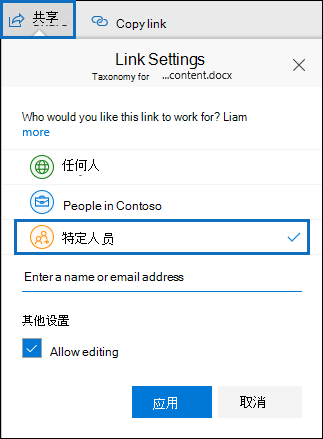

# <a name="keyword-queries-and-search-conditions-for-ediscovery"></a>电子数据展示的关键字查询和搜索条件

本文介绍了您可以在 Exchange Online 中的电子邮件项目和 Microsoft Teams 聊天对话中搜索的电子邮件和文档属性，以及使用 SharePoint 和 OneDrive for Business 网站中的电子数据展示搜索工具存储的文档。Microsoft 365 合规中心。 这包括内容搜索、核心电子数据展示Advanced eDiscovery (电子数据展示搜索 *Advanced eDiscovery集合*) 。 您还可以使用安全与合规中心 PowerShell 中的 **\* -ComplianceSearch** cmdlet &搜索这些属性。 本文还介绍了：

- 使用布尔搜索运算符、搜索条件和其他搜索查询技术优化搜索结果。
- 在 SharePoint 和 OneDrive for Business 中搜索敏感数据类型和自定义OneDrive for Business。
- 搜索与组织外部的用户共享的网站内容

有关如何创建不同电子数据展示搜索的分步说明，请参阅：

- [内容搜索](content-search.md)
- [在核心电子数据展示中搜索内容](search-for-content-in-core-ediscovery.md)
- [在集合中创建草稿Advanced eDiscovery](create-draft-collection.md)

> [!NOTE]
> 电子数据展示搜索Microsoft 365 合规中心安全与合规中心 PowerShell 中的相应 **\* -ComplianceSearch** cmd & let 使用关键字查询语言 (KQL) 。 有关详细信息，请参阅关键字 [查询语言语法参考](/sharepoint/dev/general-development/keyword-query-language-kql-syntax-reference)。

## <a name="searchable-email-properties"></a>可搜索的电子邮件属性

下表列出了可以使用 Microsoft 365 合规中心 中的电子数据展示搜索工具或 **New-ComplianceSearch** 或 **Set-ComplianceSearch** cmdlet 搜索的电子邮件属性。 该表包含每个属性的  _property：value_ 语法示例，以及示例返回的搜索结果的说明。 可以在电子  `property:value` 数据展示搜索的关键字框中键入这些对。

> [!NOTE]
> 在搜索电子邮件属性时，无法搜索指定属性为空或为空的项目。 例如，使用 **subject：""** 的 *property：value* 对搜索主题行为空的电子邮件将返回零结果。 这同样适用于搜索网站和联系人属性的情况。

|属性|属性描述|示例|示例返回的搜索结果|
|---|---|---|---|
|AttachmentNames|电子邮件附件的文件名。|`attachmentnames:annualreport.ppt` <p> `attachmentnames:annual*` <br/> `attachmentnames:.pptx`|含有名称为 annualreport.ppt 的附件的邮件。 第二个示例使用通配符 ( * ) 返回附件文件名中带单词"annual"的邮件。 第三个示例返回文件扩展名为 pptx 的所有附件。|
|Bcc|电子邮件的"Bcc"字段。<sup>1</sup>|`bcc:pilarp@contoso.com` <p> `bcc:pilarp` <p> `bcc:"Pilar Pinilla"`|所有示例都返回"密件抄送"字段中包含"Pilar Pinilla"的邮件。|
|Category|搜索类别。 用户可以通过使用以前称为"自定义Outlook或Outlook 网页版 (自定义类别Outlook Web App) 。 可能的值是： <ul><li>蓝色<li>绿色<li>橙色<li>紫色<li>红色<li>黄色</li></ul>|`category:"Red Category"`|在源邮箱中已指定红色类别的邮件。|
|抄送|电子邮件的"抄送"字段。<sup>1</sup>|`cc:pilarp@contoso.com` <p> `cc:"Pilar Pinilla"`|在这两个示例中，在"抄送"字段中指定了 Pilar Pinilla 的邮件。|
|Folderid|文件夹 ID (特定) 文件夹的 GUID。 如果使用此属性，请确保搜索指定文件夹所在的邮箱。 将仅搜索指定的文件夹。 不会搜索文件夹中的任何子文件夹。 若要搜索子文件夹，您需要对要搜索的子文件夹使用 Folderid 属性。 <p> 有关搜索 Folderid 属性和使用脚本获取特定邮箱的文件夹 ID 的信息，请参阅对目标集合使用内容 [搜索](use-content-search-for-targeted-collections.md)。|`folderid:4D6DD7F943C29041A65787E30F02AD1F00000000013A0000` <p> `folderid:2370FB455F82FC44BE31397F47B632A70000000001160000 AND participants:garthf@contoso.com`|第一个示例返回指定邮箱文件夹中的所有项目。 第二个示例返回指定邮箱文件夹中由用户发送或接收的所有 garthf@contoso.com。|
|发件人|电子邮件的发件人。<sup>1</sup>|`from:pilarp@contoso.com` <p> `from:contoso.com`|由指定用户或指定域发送的邮件。|
|HasAttachment|指示邮件是否有附件。 使用值 **true 或** **false**。|`from:pilar@contoso.com AND hasattachment:true`|由具有附件的指定用户发送的邮件。|
|Importance|The importance of an email message, which a sender can specify when sending a message. By default, messages are sent with normal importance, unless the sender sets the importance as **high** or **low**.  |`importance:high` <p> `importance:medium` <p> `importance:low`|将重要性标记为高、中等或低的邮件。|
|IsRead|指示是否已阅读邮件。 使用值 **true 或** **false**。|`isread:true` <p> `isread:false`|第一个示例返回 IsRead 属性设置为 **True 的邮件**。 第二个示例返回 IsRead 属性设置为 **False 的邮件**。|
|ItemClass|使用此属性可搜索组织导入到数据库的特定第三方Office 365。 对此属性使用以下语法：  `itemclass:ipm.externaldata.<third-party data type>*`|`itemclass:ipm.externaldata.Facebook* AND subject:contoso` <p> `itemclass:ipm.externaldata.Twitter* AND from:"Ann Beebe" AND "Northwind Traders"`|第一个示例返回 Subject 属性中包含单词"contoso"的 Facebook 项目。 第二个示例返回 Ann Beebe 发布且包含关键字短语"Northwind Traders"的 Twitter 项目。 <p> 有关用于 ItemClass 属性的第三方数据类型的值的完整列表，请参阅使用内容搜索搜索导入到第三方[Office 365。](use-content-search-to-search-third-party-data-that-was-imported.md)|
|Kind|要搜索的电子邮件的类型。 可能的值： <p>  联系人 <p>  文档 <p>  电子邮件 <p>  externaldata <p>  传真 <p>  即时消息 <p>  日志 <p>  会议 <p>  microsoftteams (返回来自聊天、会议和通话中的Microsoft Teams)  <p>  注释 <p>  公告 <p>  RSS 源 <p>  任务 <p>  语音邮件|`kind:email` <p> `kind:email OR kind:im OR kind:voicemail` <p> `kind:externaldata`|第一个示例返回符合搜索条件的电子邮件。 第二个示例返回电子邮件、即时消息对话 (包括 Skype for Business 中的Microsoft Teams) 对话以及符合搜索条件的语音邮件。 第三个示例返回从第三方数据源（如 Twitter、Facebook 和 Cisco Jabber）导入 Microsoft 365 中的邮箱的项目，这些项目符合搜索条件。 有关详细信息，请参阅 Archiving [third-party data in Office 365](https://www.microsoft.com/?ref=go)。|
|参与者|电子邮件中的"所有人员"字段。 这些字段为 From、To、Cc 和<sup>Bcc。1</sup>|`participants:garthf@contoso.com` <p> `participants:contoso.com`|发送自/到 garthf@contoso.com 的邮件。第二个示例返回 contoso.com 域中的用户发送的所有邮件或发送至 contoso.com 域中的用户的所有邮件。|
|Received|收件人接收电子邮件的日期。|`received:2021-04-15` <p> `received>=2021-01-01 AND received<=2021-03-31`|2021 年 4 月 15 日收到的邮件。 第二个示例返回 2021 年 1 月 1 日到 2021 年 3 月 31 日之间收到的所有邮件。|
|收件人|电子邮件中所有收件人字段。 这些字段为"To"、Cc 和<sup>Bcc。1</sup>|`recipients:garthf@contoso.com` <p> `recipients:contoso.com`|发送到 garthf@contoso.com 的邮件。第二个示例返回发送至 contoso.com 域中任何收件人的邮件。|
|Sent|发件人发送电子邮件的日期。|`sent:2021-07-01` <p> `sent>=2021-06-01 AND sent<=2021-07-01`|在指定日期或指定日期范围内发送的邮件。|
|Size|邮件的大小（以字节为单位）。|`size>26214400` <p> `size:1..1048567`|大于 25 MB 的邮件。第二个示例返回大小介于 1 到 1,048,567 (1 MB) 字节之间的邮件。|
|Subject|电子邮件主题行中的文本。 <p> **注意：** 在查询中使用 Subject 属性时，搜索将返回主题行包含要搜索的文本的所有邮件。 换句话说，查询不会仅返回那些完全匹配的邮件。 例如，如果搜索 ，结果将包括主题为  `subject:"Quarterly Financials"` "Quarterly Financials 2018"的邮件。|`subject:"Quarterly Financials"` <p> `subject:northwind`|主题行文本中任意位置包含短语"Quarterly Financials"的邮件。 第二个示例返回主题行中包含单词"northwind"的所有邮件。|
|收件人|电子邮件的"收件人"字段。<sup>1</sup>|`to:annb@contoso.com` <p> `to:annb ` <br/> `to:"Ann Beebe"`|所有示例返回在"收件人:"行中指定为 Ann Beebe 的邮件。|

> [!NOTE]
> <sup>1</sup>对于收件人属性的值，您可以使用电子邮件地址 (也称为用户主体名称或 UPN) 、显示名称 或别名来指定用户。  例如，你可以使用 annb@contoso.com、annb 或"Ann Beebe"指定用户 Ann Beebe。

### <a name="recipient-expansion"></a>收件人展开

在搜索任何收件人属性 (From、To、Cc、Bcc、Participants 和 Recipients) 时，Microsoft 365 会尝试在 Azure Active Directory (Azure AD) 中查找每个用户的标识。  如果在 Azure AD 找到用户，则查询将扩展为包括用户的电子邮件地址 (或 UPN) 、别名、显示名称 和 LegacyExchangeDN。 例如，查询（如 ） `participants:ronnie@contoso.com` 将展开到 `participants:ronnie@contoso.com OR participants:ronnie OR participants:"Ronald Nelson" OR participants:"<LegacyExchangeDN>"` 。

若要阻止收件人展开， (电子邮件地址) 添加通配符，并使用缩减域名;例如， `participants:"ronnie@contoso*"` 请务必用双引号将电子邮件地址括起来。

但是，请注意，在搜索查询中阻止收件人展开可能会导致搜索结果中未返回相关项目。 电子邮件中Exchange可以在收件人字段中使用不同的文本格式进行保存。 收件人展开旨在帮助通过返回可能包含不同文本格式的邮件来缓解这种情况。 因此，阻止收件人展开可能会导致搜索查询不返回与调查相关的所有项目。

> [!NOTE]
> 如果需要检查或减少由于收件人展开而由搜索查询返回的项目，请考虑使用Advanced eDiscovery。 您可以搜索利用收件人展开 (的邮件，) 审阅集，然后使用审阅集查询或筛选器查看或缩小结果范围。 有关详细信息，请参阅收集[案例的数据和](collecting-data-for-ediscovery.md)[查询审阅集内的数据](review-set-search.md)。

## <a name="searchable-site-properties"></a>可搜索网站属性

下表列出了可以使用 Microsoft 365 合规中心中的电子数据展示搜索工具或 **New-ComplianceSearch** 或 **Set-ComplianceSearch** cmdlet 搜索的一些 SharePoint 和 OneDrive for Business 属性。 该表包含每个属性的  _property：value_ 语法示例，以及示例返回的搜索结果的说明。

有关可搜索SharePoint属性的完整列表，请参阅 Overview [of crawled and managed properties in SharePoint](/SharePoint/technical-reference/crawled-and-managed-properties-overview)。 可以 **搜索"可** 查询 **"列中标** 有"是"的属性。

|属性|属性描述|示例|示例返回的搜索结果|
|---|---|---|---|
|作者|作者字段位于 Office 文档中，复制文档后仍然存在其中。 例如，如果用户创建一个文档，并将其通过电子邮件发送给其他人，然后将该文档上载到SharePoint，则该文档仍将保留原始作者。 请务必使用用户的 显示名称 此属性。|`author:"Garth Fort"`|所有文档的作者均为 Garth Fort。|
|ContentType|The SharePoint content type of an item， such as Item， Document， or Video.|`contenttype:document`|将返回所有文档。|
|Created|创建项目的日期。|`created>=2021-06-01`|在 2021 年 6 月 1 日当天或之后创建的所有项目。|
|CreatedBy|创建或上载项目的人员。 请务必使用用户的 显示名称 此属性。|`createdby:"Garth Fort"`|所有项目均由 Garth Fort 创建或上载。|
|DetectedLanguage|项目的语言。|`detectedlanguage:english`|所有项目均为英语。|
|DocumentLink|URL () 或网站中特定文件夹SharePoint OneDrive for Business URL。 如果使用此属性，请确保搜索指定文件夹所在的网站。 <p> 若要返回位于为 documentlink 属性指定的文件夹的子文件夹中的项目，您必须将 /添加到指定文件夹的 URL 中; \* 例如， `documentlink: "https://contoso.sharepoint.com/Shared Documents/*"` <p> <br/>有关搜索 documentlink 属性和使用脚本获取特定网站上文件夹的文档链接 URL 的信息，请参阅对目标集合使用内容 [搜索](use-content-search-for-targeted-collections.md)。|`documentlink:"https://contoso-my.sharepoint.com/personal/garthf_contoso_com/Documents/Private"` <p> `documentlink:"https://contoso-my.sharepoint.com/personal/garthf_contoso_com/Documents/Shared with Everyone/*" AND filename:confidential`|第一个示例返回指定文件夹OneDrive for Business项。 第二个示例返回指定网站文件夹中的文档 (文件名中包含) "机密"的所有子文件夹。|
|FileExtension|文件的扩展名;例如，docx、one、pptx 或 xlsx。|`fileextension:xlsx`|所有Excel 2007 (Excel及更高版本的文件) |
|FileName|文件的名称。|`filename:"marketing plan"` <p> `filename:estimate`|第一个示例返回标题中具有完全匹配短语“marketing plan”的文件。第二个示例返回文件名中具有单词“estimate”的文件。|
|LastModifiedTime|项目的上次更改日期。|`lastmodifiedtime>=2021-05-01` <p> `lastmodifiedtime>=2021-05-01 AND lastmodifiedtime<=2021-06-01`|第一个示例返回在 2021 年 5 月 1 日当天或之后更改的项目。 第二个示例返回 2021 年 5 月 1 日到 2021 年 6 月 1 日之间更改的项目。|
|ModifiedBy|上次更改项目的人员。 请务必使用用户的 显示名称 此属性。|`modifiedby:"Garth Fort"`|由 Garth Fort 最后更改的所有项目。|
|Path|网站 (或) 网站中特定网站SharePoint URL OneDrive for Business路径。 <p> 若要仅返回指定网站中的项目，您必须将尾随添加到 URL 的 `/` 末尾;例如， `path: "https://contoso.sharepoint.com/sites/international/"` <p> 若要返回在 path 属性中指定的网站文件夹中的项目，您必须添加到 URL 的 `/*` 末尾;例如，  `path: "https://contoso.sharepoint.com/Shared Documents/*"` <p> **注意：** 使用 属性搜索OneDrive不会在搜索结果中返回媒体文件，如 `Path` .png、.tiff 或 .wav 文件。 在搜索查询中使用不同的网站属性来搜索文件夹中的OneDrive文件。 <br/>|`path:"https://contoso-my.sharepoint.com/personal/garthf_contoso_com/"` <p> `path:"https://contoso-my.sharepoint.com/personal/garthf_contoso_com/*" AND filename:confidential`|第一个示例返回指定网站中OneDrive for Business项。 第二个示例返回指定网站 (中的文档和网站) 文件名中包含"机密"一词的文件夹。|
|SharedWithUsersOWSUser|已与指定用户共享并显示在用户网站中"我共享的内容"页上OneDrive for Business文档。 这些是组织中其他人已与指定用户显式共享的文档。 导出与使用 SharedWithUsersOWSUser 属性的搜索查询匹配的文档时，文档从与指定用户共享文档的用户的原始内容位置导出。 有关详细信息，请参阅搜索 [在组织中共享的网站内容](#searching-for-site-content-shared-within-your-organization)。|`sharedwithusersowsuser:garthf` <p> `sharedwithusersowsuser:"garthf@contoso.com"`|这两个示例都返回已与 Garth Fort 显式共享且显示在 Garth  Fort 的 OneDrive for Business 页面上的所有内部文档。|
|Site|组织中站点或站点组的 URL。|`site:"https://contoso-my.sharepoint.com"` <p> `site:"https://contoso.sharepoint.com/sites/teams"`|第一个示例返回组织中所有用户OneDrive for Business网站中的项目。 第二个示例返回所有团队网站中的项目。|
|Size|邮件的大小（以字节为单位）。|`size>=1` <p> `size:1..10000`|第一个示例返回大于 1 字节的项目。第二个示例返回大小介于 1 到 10,000 字节之间的项目。|
|Title|文档的标题。 Title 属性是在文档中指定的元数据Microsoft Office元数据。 它不同于文档的文件名。|`title:"communication plan"`|Office 文档的 Title 元数据属性中包含短语“communication plan”的任何文档。|

## <a name="searchable-contact-properties"></a>可搜索联系人属性

下表列出了已编制索引且可以使用电子数据展示搜索工具进行搜索的联系人属性。 这些属性可供用户为位于用户邮箱的个人通讯簿中的联系人 (也称为个人联系人) 配置。 若要搜索联系人，可以选择要搜索的邮箱，然后在关键字查询中使用一个或多个联系人属性。

> [!TIP]
> 若要搜索包含空格或特殊字符的值，请使用双引号 (") 包含短语;例如， `businessaddress:"123 Main Street"` 。

|属性|属性描述|
|---|---|
|BusinessAddress|"商务地址 **"属性中的** 地址。 该属性在联系人属性 **页上也称为** "工作地址"。|
|BusinessPhone|任何 Business 中 **的电话号码电话号码** 属性。|
|CompanyName|Company 属性 **中** 的名称。|
|Department|Department 属性 **中** 的名称。|
|DisplayName|联系人显示名称。 这是联系人的 **"全名"** 属性中的名称。|
|EmailAddress|联系人的任何电子邮件地址属性的地址。 用户可以为联系人添加多个电子邮件地址。 使用此属性将返回与联系人的任何电子邮件地址匹配的联系人。|
|FileAs|**File 作为** 属性。 此属性用于指定联系人在用户的联系人列表中的列出方式。 例如，联系人可以列为  *FirstName，LastName*  或  *LastName，FirstName*。|
|GivenName|First Name 属性 **中** 的名称。|
|HomeAddress|任何家庭地址 **属性中的** 地址。|
|HomePhone|任何家庭电话号码 **属性中** 的电话号码。|
|IMAddress|IM 地址属性，通常为用于即时消息的电子邮件地址。|
|MiddleName|Middle **name** 属性中的名称。|
|MobilePhone|移动电话号码 **属性** 中的电话号码。|
|Nickname|Nickname 属性 **中** 的名称。|
|OfficeLocation|location 属性 **Office** 或 **Office 中的** 值。|
|OtherAddress|Other **address** 属性的值。|
|Surname|Last **name** 属性中的名称。|
|Title|Job title 属性 **中** 的标题。|

## <a name="searchable-sensitive-data-types"></a>可搜索敏感数据类型

您可以使用 Microsoft 365 合规中心 中的电子数据展示搜索工具搜索存储在 SharePoint 和 OneDrive for Business 网站的文档中的敏感数据，例如信用卡号或社会保险号。 为此，可以使用 属性和名称， (关键字) 敏感信息类型的名称或 `SensitiveType` ID。 例如，查询 `SensitiveType:"Credit Card Number"` 返回包含信用卡号的文档。 查询  `SensitiveType:"U.S. Social Security Number (SSN)"` 返回包含美国社会保险号的文档。

To see a list of the sensitive information types that you can search for， go to **Data classifications** \> **Sensitive info types** in the Microsoft 365 合规中心. 或者，您可以使用安全与合规中心 PowerShell & **Get-DlpSensitiveInformationType** cmdlet 来显示敏感信息类型列表。

有关使用 属性创建查询的信息，请参阅创建查询 `SensitiveType` [以查找网站上存储的敏感数据](form-a-query-to-find-sensitive-data-stored-on-sites.md)。

### <a name="limitations-for-searching-sensitive-data-types"></a>搜索敏感数据类型的限制

- 若要搜索自定义敏感信息类型，您必须在 属性中指定敏感信息类型的 `SensitiveType` ID。 使用自定义敏感信息类型的名称 (如上一节中内置敏感信息类型的示例所示，) 返回任何结果。 使用合规 **中心** (中的"敏感信息类型"页面上的"Publisher"列或 PowerShell) 中的 **Publisher** 属性区分内置和自定义敏感信息类型。 内置敏感数据类型具有值 Publisher `Microsoft Corporation` 属性。 

  若要显示组织中自定义敏感数据类型的名称和 ID，请运行安全与合规中心 PowerShell &命令：

  ```powershell
  Get-DlpSensitiveInformationType | Where-Object {$_.Publisher -ne "Microsoft Corporation"} | FT Name,Id
  ```

  然后，可以使用搜索属性中的 ID 返回包含自定义敏感数据类型 `SensitiveType` 例如， `SensitiveType:7e13277e-6b04-3b68-94ed-1aeb9d47de37`

- 你不能使用敏感信息类型和搜索属性在邮箱中搜索Exchange Online `SensitiveType` 数据。 这包括 1：1 聊天消息、1：N 群聊消息和 Microsoft Teams 因为所有这些内容都存储在邮箱中。 但是，您可以使用 DLP 策略 (数据丢失) 保护传输中的敏感数据。 有关详细信息，请参阅 [了解数据丢失](dlp-learn-about-dlp.md) 防护和 [搜索和查找个人数据](/compliance/regulatory/gdpr)。

## <a name="search-operators"></a>搜索运算符

布尔搜索运算符（如 **AND、OR** 和 **NOT）** 可帮助您通过包括或排除搜索查询中的特定词来定义更精确的搜索。 其他技术（如使用属性运算符 (或) 、引号、括号和通配符）可帮助您优化 `>=` `..` 搜索查询。 下表列出了可用于缩小或扩大搜索结果范围运算符。

|运算符|用法|说明|
|---|---|---|
|AND|keyword1 AND keyword2|返回包含所有指定关键字或表达式  `property:value` 的项。 例如，将返回 Ann Beebe 发送的所有邮件，这些邮件的主题行中包含  `from:"Ann Beebe" AND subject:northwind` 单词 northwind。 <sup>2</sup>|
|+|keyword1 + keyword2 + keyword3|Returns items that contain  *either*  `keyword2` or  `keyword3` *and*  that also contain  `keyword1`. Therefore, this example is equivalent to the query  `(keyword2 OR keyword3) AND keyword1`.  <p> 查询 (符号后的空格)  `keyword1 + keyword2` **+** 与使用 **AND** 运算符不同。 This query would be equivalent to  `"keyword1 + keyword2"` and return items with the exact phase  `"keyword1 + keyword2"`.|
|OR|keyword1 OR keyword2|返回包含一个或多个指定关键字或表达式  `property:value` 的项目。 <sup>2</sup>|
|NOT|keyword1 NOT keyword2 <p> NOT from:"Ann Beebe" <p> NOT kind：im|排除关键字或表达式指定的  `property:value` 项。 第二个示例排除 Ann Beebe 发送的邮件。 第三个示例排除任何即时消息对话，Skype for Business保存到"对话历史记录"邮箱文件夹的即时消息对话。 <sup>2</sup>|
|-|keyword1 -keyword2|与 **NOT** 运算符作用相同。 因此，此查询将返回包含  `keyword1` 的项，并排除包含 的项  `keyword2` 。|
|NEAR|keyword1 NEAR(n) keyword2|返回包含邻近字词的项目，其中 n 表示间隔的字词数量。 例如， `best NEAR(5) worst` 返回单词"worst"在五个单词"best"之内的任何项。 如果您没有指定数目，则默认距离是 8 个字词。 <sup>2</sup>|
|:|property:value|语法中的冒号 (：) 指定要搜索的属性的值  `property:value` 包含指定值。 例如，  `recipients:garthf@contoso.com` 返回发送至 garthf@contoso.com 的所有邮件。|
|=|property=value|与 ： **运算符相同** 。|
|\<|property\<value|表示正在搜索的属性小于指定的值。<sup>1</sup>|
|\>|property\>value|表示正在搜索的属性大于指定的值。<sup>1</sup>|
|\<=|property\<=value|表示正在搜索的属性小于等于指定的值。<sup>1</sup>|
|\>=|property\>=value|表示正在搜索的属性大于等于指定的值。<sup>1</sup>|
|..|property：value1..value2|表示正在搜索的属性大于等于 value1，小于等于 value2。<sup>1</sup>|
|"  "|"fair value" <p> subject:"Quarterly Financials"|在关键字查询 (关键字框中键入对) ，请使用双引号 (" ") 搜索精确短语 `property:value` 或术语。  但是，如果使用"主题"或"主题 **/**[](#search-conditions)标题"搜索条件条件，请不要向该值添加双引号，因为使用这些搜索条件时会自动添加引号。 如果将引号添加到值中，则两对双引号将添加到条件值中，并且搜索查询将返回错误。 |
|\*|cat\* <p> subject:set\*|前缀搜索 (前缀 *匹配*) ，其中通配符 ( * ) 放在关键字或查询中的单词 `property:value` 末尾。 在前缀搜索中，搜索将返回包含字词后跟零个或多个字符的字词的结果。 例如，返回文档标题中包含单词 `title:set*` "set"、"setup"和"setting" (以及其他以"set") 开始的文档。 <p> **注意：** 只能使用前缀搜索;例如 **，cat \* *_ 或 _* set \* *_。后缀 (_* \* cat**) ， (**c t \*) ，** 不支持 (**\* cat \***) 子字符串搜索。 <p> 此外，添加一个 ( \。 ) 前缀搜索将更改返回的结果。 这是因为句点被视为一个结束词。 例如，搜索 cat **\* *_ 并搜索 _* cat。 \*** 将返回不同的结果。 建议不要将一个时间段用于前缀搜索。|
|(  )| (fair OR free) AND (from:contoso.com) <p> (IPO OR initial) AND (stock OR shares) <p> (quarterly financials)|括号将布尔短语、 `property:value` 项目和关键字结合到一起。例如，  `(quarterly financials)` 返回包含单词"quarterly"和"financials"的项目。  |

> [!NOTE]
> <sup>1</sup> 为含有日期或数值的属性使用此运算符。<br/> <sup>2</sup> 布尔搜索运算符必须为大写形式；例如， **AND** 。 如果使用小写运算符（如 和 **），** 它将在搜索查询中视为关键字。

## <a name="search-conditions"></a>搜索条件

您可以向搜索查询添加条件，以缩小搜索范围并返回更精确的结果集。 每个条件向开始搜索时创建和运行的 KQL 搜索查询添加一个子句。

[通用属性的条件 ](#conditions-for-common-properties)

[邮件属性的条件](#conditions-for-mail-properties)

[文档属性的条件](#conditions-for-document-properties)

[与条件一起使用的运算符](#operators-used-with-conditions)

[使用条件的准则](#guidelines-for-using-conditions)

[示例](#examples-of-using-conditions-in-search-queries)

### <a name="conditions-for-common-properties"></a>通用属性的条件

在同一搜索中同时搜索邮箱和网站时，使用通用属性创建一个条件。 下表列出了在添加条件时可使用的可用属性。

|条件|说明|
|---|---|
|日期|对于电子邮件而言，是指收件人收到邮件的日期，或发件人发送邮件的日期。 对于文档，是上次修改文档的日期。|
|发件人/作者|对于电子邮件而言，是指发送邮件的人。 对于文档而言，是指从 Office 文档的作者字段中引用的人员。 你可以键入多个名称，用逗号分隔。 通过 **OR** 运算符在逻辑上连接两个或多个值。|
|大小 (字节数) |对于电子邮件和文档而言，是项目的大小（以字节为单位）。|
|主题/标题|对电子邮件而言，是指邮件的主题行中的文本。 对于文档而言，是指文档的标题。 如前所述，Title 属性是在文档中指定的Microsoft Office元数据。 您可以键入多个主题/标题值的名称，用逗号分隔。 通过 **OR** 运算符在逻辑上连接两个或多个值。 <p> **注意**：请勿在此条件的值中添加双引号，因为使用此搜索条件时会自动添加引号。 如果将引号添加到值中，则两对双引号将添加到条件值中，并且搜索查询将返回错误。|
|保留标签|对于电子邮件和文档，已由自动标签策略或用户手动分配的保留标签自动分配给邮件和文档的保留标签。 保留标签用于对电子邮件和文档进行分类，以用于信息治理，并基于标签定义的设置强制执行保留规则。 可以键入部分保留标签名称并使用通配符或键入完整标签名称。 有关保留标签详细信息，请参阅 [了解保留策略和保留标签](retention.md)。|

### <a name="conditions-for-mail-properties"></a>邮件属性的条件

搜索邮箱或公用文件夹时使用邮件属性创建条件。 下表列出了可以用于条件的电子邮件属性。 这些属性是之前描述的电子邮件属性的子集。 为了方便起见，将重复这些说明。

|条件|说明|
|---|---|
|邮件类型|要搜索的邮件类型。 此属性与“Kind”电子邮件属性相同。 可能的值： <ul><li>联系人</li><li>文档</li><li>电子邮件</li><li>externaldata</li><li>fax</li><li>即时消息</li><li>日志</li><li>会议</li><li>microsoftteams</li><li>注释</li><li>公告</li><li>RSS 源</li><li>任务</li><li>语音邮件</li></ul>|
|参与者|电子邮件中的"所有人员"字段。 这些字段为 From、To、Cc 和 Bcc。|
|类型|电子邮件项目的邮件类属性。 此属性与 ItemClass 电子邮件属性相同。 它还为多值条件。 因此，若要选择多个邮件类，请按住 **Ctrl** 键，然后单击下拉列表中要添加到条件的两个或多个邮件类。 在列表中选择的每个邮件类将在逻辑上由相应的搜索查询中的 **OR** 运算符进行连接。 <p> 有关邮件类 (及其相应的邮件类 ID) ，Exchange您可以在"邮件类"列表中选择这些类，请参阅项目类型和[邮件类](/office/vba/outlook/Concepts/Forms/item-types-and-message-classes)。 |
|接收时间|收件人接收电子邮件的日期。此属性与“Received”电子邮件属性相同。|
|收件人|电子邮件中所有收件人字段。 这些字段为"To"、Cc 和 Bcc。|
|Sender|电子邮件的发件人。|
|Sent|发件人发送电子邮件的日期。 此属性与“Sent”电子邮件属性相同。|
|Subject|电子邮件主题行中的文本。 <p> **注意**：请勿在此条件的值中添加双引号，因为使用此搜索条件时会自动添加引号。 如果将引号添加到值中，则两对双引号将添加到条件值中，并且搜索查询将返回错误。|
|To|"收件人"字段中电子邮件的收件人。|

### <a name="conditions-for-document-properties"></a>文档属性的条件

在网站和网站中搜索文档时，使用文档属性SharePoint OneDrive for Business条件。 下表列出了可以用于条件的文档属性。 这些属性是之前描述的网站属性的子集。 为了方便起见，将重复这些说明。

|条件|说明|
|---|---|
|作者|作者字段位于 Office 文档中，复制文档后仍然存在其中。 例如，如果用户创建一个文档并将其通过电子邮件发送给其他人，然后将该文档上载到SharePoint，则该文档仍将保留原始作者。|
|Title|文档的标题。 Title 属性是 Office 文档中指定的元数据。 它不同于文档的文件名。|
|Created|创建文档的日期。|
|上次修改时间|上次修改文档的日期。|
|文件类型|文件的扩展名;例如，docx、one、pptx 或 xlsx。 此属性与 FileExtension 网站属性相同。 <p> **注意：** 如果在搜索查询中包括使用 **"等于** "或" **等于** "任意运算符的"文件类型"条件，则不能将通配符 ( ) 包括在文件类型) 的末尾以返回文件类型的所有版本，以使用前缀搜索 \* (。 如果这样做，通配符将被忽略。 例如，如果包含 条件 `Equals any of doc*` ，将仅返回扩展 `.doc` 名 为 的文件。 不会返回扩展名 为 `.docx` 的文件。 若要返回文件类型的所有版本，在关键字查询中使用 *property：value* 对;例如， `filetype:doc*` 。|

### <a name="operators-used-with-conditions"></a>与条件一起使用的运算符

当您添加一个条件时，您可以选择与该条件的属性类型相关的运算符。下表描述了与条件一起使用的运算符，并列出了在搜索查询中使用的等效项。

|运算符|查询等效项|说明|
|---|---|---|
|活动后|`property>date`|使用日期条件。返回在指定日期后发送、接收或修改的项。 |
|活动前|`property<date`|使用日期条件。返回在指定日期前发送、接收或修改的项。|
|Between|`date..date`|使用日期和大小条件。 当使用日期条件时，返回在指定的日期范围内发送、接收或修改的项。 当使用大小条件时，返回大小在指定范围内的项。|
|包含任意|`(property:value) OR (property:value)`|与指定字符串值的属性条件一起使用。 返回包含一个或多个指定字符串值任何部分的项目。|
|不包含任何|`-property:value` <p> `NOT property:value`|与指定字符串值的属性条件一起使用。返回不包含指定字符串值任何部分的项目。|
|不等于任何|`-property=value` <p> `NOT property=value`|与指定字符串值的属性条件一起使用。返回不包含特定字符串的项目。|
|等于|`size=value`|返回等于指定大小的项目。<sup>1</sup>|
|等于任何|`(property=value) OR (property=value)`|与指定字符串值的属性条件一起使用。 返回与一个或多个指定字符串值匹配的项。|
|大|`size>value`|返回指定属性大于指定值的项目。<sup>1</sup>|
|大于或等于|`size>=value`|返回指定属性大于或等于指定值的项目。<sup>1</sup>|
|Less|`size<value`|返回大于或等于特定值的项。<sup>1</sup>|
|小于或等于|`size<=value`|返回大于或等于特定值的项。<sup>1</sup>|
|不等于|`size<>value`|返回不等于指定大小的项目。<sup>1</sup>|

> [!NOTE]
> <sup>1</sup> 此运算符仅适用于使用 Size 属性的条件。

### <a name="guidelines-for-using-conditions"></a>使用条件的准则

在使用搜索条件时，请牢记以下几点。

- 可通过使用 **AND** 运算符在逻辑上将条件连接至关键字查询（在关键字框中指定）。 这意味着，项目必须满足关键字查询和要在结果中包括的条件。 这就是条件如何帮助缩小结果范围的原理。

- 如果将两个或多个唯一性条件（指定不同属性的条件）添加到搜索查询中，这些条件将在逻辑上使用 **AND** 运算符来连接。 这意味着仅返回满足所有条件（除了任何关键字查询以外）的项目。

- 如果您对相同属性添加多个条件，则使用 **OR** 运算符在逻辑上对这些条件进行连接。 这意味着将返回满足关键字查询以及任何一个条件的项。 因此，相同条件的组通过 **OR** 运算符彼此相连，然后唯一性条件集通过 **AND** 运算符彼此相连。

- 如果向单个条件中添加多个值（用逗号或分号分隔），这些值将通过 **OR** 运算符来连接。 这意味着如果这些项包含条件中指定的任何属性值，则返回这些项。

- 将运算符与 **Contains** 和 Equals 逻辑一同 **使用的任何** 条件都将为简单字符串搜索返回类似的搜索结果。 简单字符串搜索是条件中不包含通配符字符串) 。 例如，使用 **Equals any of** 的条件将返回与使用 Contains any of 的条件 **相同的项**。

- 使用关键字框和条件创建的搜索查询将显示在"搜索"页上所选搜索的详细信息窗格中。  在查询中，表示法右侧的所有  `(c:c)` 内容都指示添加到查询的条件。

- 条件只将属性添加到搜索查询中，而不会添加运算符。 这就是详细信息窗格中显示的查询在表示法右侧不显示运算符  `(c:c)` 的原因。 执行查询时，KQL 会添加逻辑运算符（根据前面所述的规则）。

- 您可以使用拖放控件重新排序条件的顺序。 单击某个条件的控件，然后向上或向下移动它。

- 如前所述，某些条件属性允许您键入多个值 (用分号分隔) 。 每个值都由 **OR** 运算符在逻辑上连接，结果为查询 `(filetype=docx) OR (filetype=pptx) OR (filetype=xlsx)` 。 下图显示了具有多个值的条件的示例。

    

  > [!NOTE]
  > 无法通过单击同一属性 (**添加条件来** 添加多个条件。 相反，您必须为条件提供多个值 (用分号分隔) ，如上一示例所示。

### <a name="examples-of-using-conditions-in-search-queries"></a>示例

以下示例显示具有条件的基于 GUI 的搜索查询版本、显示在选定搜索 (（也由 **Get-ComplianceSearch** cmdlet) 返回）的详细信息窗格中的搜索查询语法，以及相应的 KQL 查询的逻辑。

#### <a name="example-1"></a>示例 1

本示例返回SharePoint OneDrive for Business信用卡号且上次修改时间在 2021 年 1 月 1 日之前的网站的文档。

**GUI：**


**搜索查询语法**：

`SensitiveType:"Credit Card Number"(c:c)(lastmodifiedtime<2021-01-01)`

**搜索查询逻辑**：

`SensitiveType:"Credit Card Number" AND (lastmodifiedtime<2021-01-01)`

请注意，在上一张屏幕截图中，搜索 UI 强调关键字查询和条件由 **AND** 运算符连接。

#### <a name="example-2"></a>示例 2

本示例返回包含关键字"report"、在 2021 年 4 月 1 日之前发送或创建的电子邮件项目或文档，以及电子邮件主题字段或文档标题属性中包含单词"northwind"的电子邮件项目或文档。 查询不包括符合其他搜索条件的网页。

**GUI：**


**搜索查询语法**：

`report(c:c)(date<2021-04-01)(subjecttitle:"northwind")(-filetype:aspx)`

**搜索查询逻辑**：

`report AND (date<2021-04-01) AND (subjecttitle:"northwind") NOT (filetype:aspx)`

#### <a name="example-3"></a>示例 3

本示例返回在 2019 年 12 月 1 日到 2020 年 11 月 30 日之间发送且包含以"phone"或"smartphone"开始的单词的电子邮件或日历会议。

**GUI：**


**搜索查询语法**：

`phone* OR smartphone*(c:c)(sent=2019-12-01..2020-11-30)(kind="email")(kind="meetings")`

**搜索查询逻辑**：

`phone* OR smartphone* AND (sent=2019-12-01..2020-11-30) AND ((kind="email") OR (kind="meetings"))`

## <a name="special-characters"></a>特殊字符

某些特殊字符不包含在搜索索引中，因此不可搜索。 这还包括表示搜索查询中的搜索运算符的特殊字符。 下面是在实际搜索查询中由空格替换或导致搜索错误的特殊字符的列表。

`+ - = : ! @ # % ^ & ; _ / ? ( ) [ ] { }`

## <a name="searching-for-site-content-shared-with-external-users"></a>搜索与外部用户共享的网站内容

您还可以使用合规中心中的电子数据展示搜索工具搜索存储在 SharePoint 和 OneDrive for Business 网站上且已与组织外部人员共享的文档。 这可以帮助你识别与组织外部人员共享的敏感信息或专有信息。 您可以通过在关键字查询  `ViewableByExternalUsers` 中使用 属性来这样做。 此属性返回已使用下列共享方法之一与外部用户共享的文档或网站：

- 要求用户以经过身份验证的用户身份登录到组织的共享邀请。
- 匿名来宾链接，允许具有此链接的任何人无需经过身份验证即可访问资源。

下面是一些示例：

- 查询  `ViewableByExternalUsers:true AND SensitiveType:"Credit Card Number"` 返回已与组织外部人员共享并包含信用卡号的所有项目。
- 查询  `ViewableByExternalUsers:true AND ContentType:document AND site:"https://contoso.sharepoint.com/Sites/Teams"` 返回组织中所有工作组网站上已与外部用户共享的文档列表。

> [!TIP]
> 搜索查询（如  `ViewableByExternalUsers:true AND ContentType:document` ）可能在搜索结果中返回大量 .aspx 文件。 若要消除 (或其他类型的文件) ，可以使用 属性排除  `FileExtension` 特定文件类型;例如  `ViewableByExternalUsers:true AND ContentType:document NOT FileExtension:aspx` 。

哪些内容视为与组织的外部人员共享的内容？ 通过发送共享邀请SharePoint OneDrive for Business共享的网站和网站中的文档。 例如，下列用户活动会产生外部用户可以查看的内容：

- 用户与组织外部的人员共享文件或文件夹。
- 用户创建共享文件并将链接发送给组织外部的人员。 此链接允许外部用户查看（或编辑）该文件。
- 用户向组织外部的人员发送共享邀请或来宾链接以查看（或编辑）共享文件。

### <a name="issues-using-the-viewablebyexternalusers-property"></a>使用 ViewableByExternalUsers 属性时的问题

虽然属性表示文档或网站是否与外部用户共享的状态，但此属性确实存在一些注意事项，但  `ViewableByExternalUsers` 无法反映这一点。 在下列情况下，不会更新属性的值，并且使用此属性的搜索查询  `ViewableByExternalUsers` 的结果可能不准确。

- 对共享策略的更改，例如为站点或组织关闭外部共享。 即使已撤消外部访问，属性仍将以前共享的文档显示为可从外部访问。
- 对组成员身份的更改，例如向安全组Microsoft 365或删除Microsoft 365用户。 对于组有权访问的项目，该属性不会自动更新。
- 向收件人尚未接受邀请的外部用户发送共享邀请，因此尚无法访问内容。

在这些情况下，在重新对网站或文档库进行重新绘制和重新索引之前，该属性不会  `ViewableByExternalUsers` 反映当前共享状态。

## <a name="searching-for-site-content-shared-within-your-organization"></a>搜索在组织中共享的网站内容

如前所述，您可以使用 属性搜索组织中人员之间共享  `SharedWithUsersOWSUser` 的文档。 当某人与 () 共享文件或文件夹时，共享文件的链接会显示在共享文件的用户的 OneDrive for Business 帐户的"我共享"页面上。  例如，若要搜索已与 Sara Davis 共享的文档，可以使用查询  `SharedWithUsersOWSUser:"sarad@contoso.com"` 。 如果导出此搜索的结果，将下载 (与 Sara 共享文档的人的内容位置中) 文档。

使用 属性时，文档必须与特定用户显式共享，以在搜索结果中  `SharedWithUsersOWSUser` 返回。 例如，当用户在 OneDrive 帐户中共享文档时，他们可以选择与组织) 内外的任何 (共享该文档、仅与组织内部人员共享该文档，或与特定人员共享文档。 下面是 share window in  OneDrive 的屏幕截图，其中显示了三个共享选项。



使用 属性的搜索查询) 仅返回使用"与特定人员 (共享的第三个选项共享 `SharedWithUsersOWSUser` 的文档。

## <a name="searching-for-skype-for-business-conversations"></a>搜索Skype for Business对话

您可以使用以下关键字查询来专门搜索对话Skype for Business内容：

```powershell
kind:im
```

上一个搜索查询还返回来自搜索Microsoft Teams。 为了防止这种情况，可以通过以下关键字查询将搜索结果范围缩小为Skype for Business对话：

```powershell
kind:im AND subject:conversation
```

前面的关键字查询将排除Microsoft Teams，因为Skype for Business对话保存为电子邮件，主题行以单词"Conversation"开头。

若要搜索Skype for Business日期范围内发生的对话，请使用以下关键字查询：

```powershell
kind:im AND subject:conversation AND (received=startdate..enddate)
```

## <a name="character-limits-for-searches"></a>搜索的字符限制

搜索网站和用户帐户中的内容时，搜索查询的字符限制为 4，000 SharePoint 4，000 OneDrive帐户。
下面是如何计算搜索查询中的字符总数：

- 关键字搜索查询查询中的 (包括用户和筛选器字段) 此限制计数。
- 任何位置属性中的字符 (，例如要搜索的所有 SharePoint 或 OneDrive 位置的 URL) 此限制计数。
- 应用于运行搜索计数的用户的所有搜索权限筛选器中的字符数限制。

有关字符限制的信息，请参阅电子 [数据展示搜索限制](limits-for-content-search.md#search-limits)。

> [!NOTE]
> 4，000 个字符的限制适用于内容搜索、核心电子数据展示和Advanced eDiscovery。

## <a name="search-tips-and-tricks"></a>搜索提示和技巧

- 关键字搜索不区分大小写。 例如， **cat** 和 **CAT** 将返回相同的结果。

- 布尔运算符 **AND**、 **OR**、 **NOT** 和 **NEAR** 必须为大写。

- 两个关键字或两个  `property:value` 表达式之间的空格与使用 **AND** 相同。 例如，返回 Sara Davis 发送  `from:"Sara Davis" subject:reorganization` 的所有邮件，这些邮件在主题行中包含单词重新组织。

- 使用与格式匹配的 `property:value` 语法。 值不区分大小写，且运算符后不能有空格。 如果有空格，则预期值为全文搜索。 例如 `to: pilarp` ，搜索"pilarp"作为关键字，而不是发送到 pilarp 的邮件。

- 在搜索收件人属性（如 To、From、Cc 或 Recipients）时，您可以使用 SMTP 地址、别名或显示名来表示收件人。例如，您可以使用 pilarp@contoso.com、pilarp 或"Pilar Pinilla"。

- 只能使用前缀搜索;例如 **，cat \* *_ 或 _* set \* *_。后缀 (_* \* cat**) ， (**c t \*) ，** 不支持 (**\* cat \***) 子字符串搜索。

- 在搜索属性时，如果 (多个单词) ，则使用双引号") "。 例如 `subject:budget Q1` ，返回主题行 **中包含 budget** 且在邮件中的任何位置或任意邮件属性中包含 **Q1** 的邮件。 Using `subject:"budget Q1"` 返回主题行中任意位置包含 **budget Q1** 的所有邮件。

- 若要将使用某个属性值标记的内容从搜索结果中排除，请在属性名称前放置减号 (-)。 例如，排除 Sara `-from:"Sara Davis"` Davis 发送的任何邮件。

- 您可以根据邮件类型导出项目。 例如，若要导出Skype中的对话和聊天Microsoft Teams，请使用语法 `kind:im` 。 若要仅返回电子邮件，请使用 `kind:email` 。 若要在会议中返回聊天、会议和Microsoft Teams，请使用 `kind:microsoftteams` 。

- 如前所述，在搜索网站时，当使用 属性仅返回指定网站中的项目时，您必须将尾随添加到 `/` URL `path` 的末尾。 如果不包括尾随，还将返回具有相似路径名称 `/` 的网站中的项目。 例如，如果使用 `path:sites/HelloWorld` ，则也会返回名为 `sites/HelloWorld_East` 或 `sites/HelloWorld_West` 的网站中的项目。 若要仅从 HelloWorld 网站返回项目，你必须使用 `path:sites/HelloWorld/` 。
