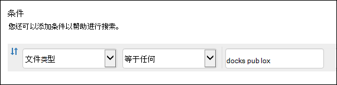
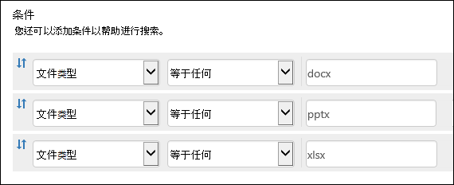

# <a name="keyword-queries-and-search-conditions-for-content-search-and-ediscovery"></a>内容搜索和电子数据展示的关键字查询和搜索条件

本主题介绍电子邮件和文档属性，您可以使用 Microsoft 365 合规中心的内容搜索功能在 Exchange Online 中的电子邮件项目以及 SharePoint 和 OneDrive for Business 网站上存储的文档中搜索这些属性。 您还可以使用安全与合规中心 PowerShell 中的 **\* -ComplianceSearch** cmdlet &搜索这些属性。 本主题还介绍了：
  
- 使用布尔搜索运算符、搜索条件和其他搜索查询技术优化搜索结果。

- 在 SharePoint 和 OneDrive for Business 中搜索敏感数据类型和自定义敏感数据类型。

- 搜索与组织外部的用户共享的网站内容

有关如何创建内容搜索的分步说明，请参阅内容 [搜索](content-search.md)。

> [!NOTE]
> Microsoft 365 合规中心的内容搜索和安全 & 合规中心 PowerShell 中的相应 **\* -ComplianceSearch** cmdlet 使用关键字查询语言 (KQL) 。 有关更多详细信息，请参阅关键字 [查询语言语法参考](/sharepoint/dev/general-development/keyword-query-language-kql-syntax-reference)。 
  
## <a name="searchable-email-properties"></a>可搜索的电子邮件属性

下表列出了可以使用 Microsoft 365 合规中心中的内容搜索功能或 **New-ComplianceSearch** 或 **Set-ComplianceSearch** cmdlet 搜索的电子邮件属性。 该表包含每个属性的  _property：value_ 语法示例，以及示例返回的搜索结果的说明。 您可以在内容  `property:value` 搜索的关键字框中键入这些对。 

> [!NOTE]
> 在搜索电子邮件属性时，无法搜索指定属性为空或为空的项目。 例如，使用 **subject：""** 的 *property：value* 对搜索主题行为空的电子邮件将返回零结果。 这同样适用于搜索网站和联系人属性的情况。
  
| 属性 | 属性描述 | 示例 | 示例返回的搜索结果 |
|:-----|:-----|:-----|:-----|
|AttachmentNames|电子邮件附件的文件名。|`attachmentnames:annualreport.ppt`  <br/> `attachmentnames:annual*` <br/> `attachmentnames:.pptx` |含有名称为 annualreport.ppt 的附件的邮件。 在第二个示例中，使用通配符返回附件名中带有单词"annual"的邮件。 第三个示例返回文件扩展名为 pptx 的所有附件。|
|Bcc|电子邮件的"Bcc"字段。<sup>1</sup>|`bcc:pilarp@contoso.com`  <br/> `bcc:pilarp`  <br/> `bcc:"Pilar Pinilla"`|所有示例都返回"密件抄送"字段中包含"Pilar Pinilla"的邮件。|
|Category| 搜索类别。 用户可以通过使用 Outlook 或 Web 上的 Outlook 定义类别 (以前称为Outlook Web App) 。 可能的值是：  <br/><br/>  蓝色  <br/>  绿色  <br/>  橙色  <br/>  紫色  <br/>  红色  <br/>  黄色|`category:"Red Category"`|在源邮箱中已指定红色类别的邮件。|
|抄送|电子邮件的"抄送"字段。<sup>1</sup>|`cc:pilarp@contoso.com`  <br/> `cc:"Pilar Pinilla"`|在这两个示例中，在"抄送"字段中指定了 Pilar Pinilla 的邮件。|
|Folderid|文件夹 ID (特定) 文件夹的 GUID。 如果使用此属性，请确保搜索指定文件夹所在的邮箱。 将仅搜索指定的文件夹。 不会搜索文件夹中的任何子文件夹。 若要搜索子文件夹，您需要对要搜索的子文件夹使用 Folderid 属性。  <br/> 有关搜索 Folderid 属性和使用脚本获取特定邮箱的文件夹 ID 的信息，请参阅对目标集合使用内容 [搜索](use-content-search-for-targeted-collections.md)。|`folderid:4D6DD7F943C29041A65787E30F02AD1F00000000013A0000`  <br/> `folderid:2370FB455F82FC44BE31397F47B632A70000000001160000 AND participants:garthf@contoso.com`|第一个示例返回指定邮箱文件夹中的所有项目。 第二个示例返回指定邮箱文件夹中由用户发送或接收的所有 garthf@contoso.com。|
|发件人|电子邮件的发件人。<sup>1</sup>|`from:pilarp@contoso.com`  <br/> `from:contoso.com`|由指定用户或指定域发送的邮件。|
|HasAttachment|指示邮件是否有附件。 使用值 **true 或** **false**。|`from:pilar@contoso.com AND hasattachment:true`|由具有附件的指定用户发送的邮件。|
|Importance|The importance of an email message, which a sender can specify when sending a message. By default, messages are sent with normal importance, unless the sender sets the importance as **high** or **low**.  |`importance:high`  <br/> `importance:medium`  <br/> `importance:low`|将重要性标记为高、中等或低的邮件。|
|IsRead|指示是否已阅读邮件。 使用值 **true 或** **false**。|`isread:true`  <br/> `isread:false`|第一个示例返回 IsRead 属性设置为 **True 的邮件**。 第二个示例返回 IsRead 属性设置为 **False 的邮件**。|
|ItemClass|使用此属性可搜索组织导入到 Office 365 的特定第三方数据类型。 对此属性使用以下语法：  `itemclass:ipm.externaldata.<third-party data type>*`|`itemclass:ipm.externaldata.Facebook* AND subject:contoso`  <br/> `itemclass:ipm.externaldata.Twitter* AND from:"Ann Beebe" AND "Northwind Traders"`|第一个示例返回 Subject 属性中包含单词"contoso"的 Facebook 项目。 第二个示例返回 Ann Beebe 发布且包含关键字短语"Northwind Traders"的 Twitter 项目。  <br/> 有关用于 ItemClass 属性的第三方数据类型的值的完整列表，请参阅使用内容搜索搜索已导入 [到 Office 365 的第三方数据](use-content-search-to-search-third-party-data-that-was-imported.md)。|
|Kind| 要搜索的电子邮件的类型。 可能的值：  <br/>  联系人  <br/>  文档  <br/>  电子邮件  <br/>  externaldata  <br/>  传真  <br/>  即时消息  <br/>  日志  <br/>  会议  <br/>  microsoftteams (Microsoft Teams) 中的聊天、会议和通话中返回项目  <br/>  注释  <br/>  公告  <br/>  RSS 源  <br/>  任务  <br/>  语音邮件|`kind:email`  <br/> `kind:email OR kind:im OR kind:voicemail`  <br/> `kind:externaldata`|第一个示例返回符合搜索条件的电子邮件。 第二个示例返回电子邮件、即时消息 (包括 Microsoft Teams) 中的 Skype for Business 对话和聊天以及符合搜索条件的语音邮件。 第三个示例返回从第三方数据源（如 Twitter、Facebook 和 Cisco Jabber）导入到 Microsoft 365 中的邮箱的项目，这些项目符合搜索条件。 有关详细信息，请参阅存档 [Office 365 中的第三方数据](https://www.microsoft.com/?ref=go)。|
|参与者|电子邮件中的"所有人员"字段。 这些字段为 From、To、Cc 和<sup>Bcc。1</sup>|`participants:garthf@contoso.com`  <br/> `participants:contoso.com`|发送自/到 garthf@contoso.com 的邮件。第二个示例返回 contoso.com 域中的用户发送的所有邮件或发送至 contoso.com 域中的用户的所有邮件。|
|Received|收件人接收电子邮件的日期。|`received:04/15/2016`  <br/> `received>=01/01/2016 AND received<=03/31/2016`|2016 年 4 月 15 日收到的邮件。 第二个示例返回 2016 年 1 月 1 日到 2016 年 3 月 31 日之间收到的所有邮件。|
|收件人|电子邮件中所有收件人字段。 这些字段为"To"、Cc 和<sup>Bcc。1</sup>|`recipients:garthf@contoso.com`  <br/> `recipients:contoso.com`|发送到 garthf@contoso.com 的邮件。第二个示例返回发送至 contoso.com 域中任何收件人的邮件。|
|Sent|发件人发送电子邮件的日期。|`sent:07/01/2016`  <br/> `sent>=06/01/2016 AND sent<=07/01/2016`|在指定日期或指定日期范围内发送的邮件。|
|Size|邮件的大小（以字节为单位）。|`size>26214400`  <br/> `size:1..1048567`|大于 25 的邮件？MB。 第二个示例返回大小介于 1 到 1,048,567 (1 MB) 字节之间的邮件。|
|Subject|电子邮件主题行中的文本。  <br/> **注意：** 在查询中使用 Subject 属性时，搜索将返回主题行包含要搜索的文本的所有邮件。 换句话说，查询不会仅返回那些完全匹配的邮件。 例如，如果搜索 ，结果将包括主题为  `subject:"Quarterly Financials"` "Quarterly Financials 2018"的邮件。|`subject:"Quarterly Financials"`  <br/> `subject:northwind`|主题行文本中任意位置包含短语"Quarterly Financials"的邮件。 第二个示例返回主题行中包含单词"northwind"的所有邮件。|
|收件人|电子邮件的"收件人"字段。<sup>1</sup>|`to:annb@contoso.com`  <br/> `to:annb ` <br/> `to:"Ann Beebe"`|所有示例返回在"收件人:"行中指定为 Ann Beebe 的邮件。|
|||||
   
> [!NOTE]
> <sup>1</sup>对于收件人属性的值，您可以使用电子邮件地址 (也称为用户主体名称或 UPN ) 、显示名称 或别名来指定用户。 例如，你可以使用 annb@contoso.com、annb 或"Ann Beebe"指定用户 Ann Beebe。

### <a name="recipient-expansion"></a>收件人展开

在搜索任何收件人属性 (From、To、Cc、Bcc、Participants 和 Recipients) 时，Microsoft 365 会尝试通过查找 Azure Active Directory (Azure AD) 来扩展每个用户的身份。  如果在 Azure AD 中找到了该用户，则查询将扩展为包括用户的电子邮件地址 (或 UPN) 、别名、显示名称 和 LegacyExchangeDN。 例如，查询（如 ） `participants:ronnie@contoso.com` 将展开到 `participants:ronnie@contoso.com OR participants:ronnie OR participants:"Ronald Nelson" OR participants:"<LegacyExchangeDN>"` 。

若要阻止收件人展开， (电子邮件地址) 添加通配符，并使用缩减域名;例如， `participants:"ronnie@contoso*"` 请务必用双引号将电子邮件地址括起来。

但是，请注意，在搜索查询中阻止收件人展开可能会导致搜索结果中未返回相关项目。 Exchange 中的电子邮件可以在收件人字段中使用不同的文本格式进行保存。 收件人展开旨在帮助通过返回可能包含不同文本格式的邮件来缓解这一情况。 因此，阻止收件人展开可能会导致搜索查询不返回与调查相关的所有项目。

> [!NOTE]
> 如果需要检查或减少由于收件人展开而由搜索查询返回的项目，请考虑使用高级电子数据展示。 您可以搜索利用收件人展开 (的邮件，) 审阅集，然后使用审阅集查询或筛选器查看或缩小结果范围。 有关详细信息，请参阅收集[案例的数据和](collecting-data-for-ediscovery.md)[查询审阅集内的数据](review-set-search.md)。

## <a name="searchable-site-properties"></a>可搜索网站属性

下表列出了一些 SharePoint 和 OneDrive for Business 属性，可以使用安全 & 合规中心中的内容搜索功能或 **New-ComplianceSearch** 或 **Set-ComplianceSearch** cmdlet 搜索这些属性。 该表包含每个属性的  _property：value_ 语法示例，以及示例返回的搜索结果的说明。 
  
有关可搜索的 SharePoint 属性的完整列表，请参阅 SharePoint 中的已爬网 [和托管属性概述](/SharePoint/technical-reference/crawled-and-managed-properties-overview)。 可以 **搜索"可** 查询 **"列中标记为** "是"的属性。 
  
| 属性 | 属性描述 | 示例 | 示例返回的搜索结果 |
|:-----|:-----|:-----|:-----|
|作者|作者字段位于 Office 文档中，复制文档后仍然存在其中。 例如，如果用户创建一个文档，并将其通过电子邮件发送给随后将其上载到 SharePoint 的其他人，该文档仍将保留原始作者。 请务必使用用户的 显示名称 此属性。|`author:"Garth Fort"`|所有文档的作者均为 Garth Fort。|
|ContentType|项的 SharePoint 内容类型，如项、文档或视频。|`contenttype:document`|将返回所有文档。|
|已创建|创建项目的日期。|`created>=06/01/2016`|在 2016 年 6 月 1 日当天或之后创建的所有项目。|
|CreatedBy|创建或上载项目的人员。 请务必使用用户的 显示名称 此属性。|`createdby:"Garth Fort"`|所有项目均由 Garth Fort 创建或上载。|
|DetectedLanguage|项目的语言。|`detectedlanguage:english`|所有项目均为英语。|
|DocumentLink|SharePoint () OneDrive for Business 网站上特定文件夹的路径 URL。 如果使用此属性，请确保搜索指定文件夹所在的网站。  <br/> 若要返回位于为 documentlink 属性指定的文件夹的子文件夹中的项目，您必须将 /添加到指定文件夹的 URL 中; \* 例如，  `documentlink: "https://contoso.sharepoint.com/Shared Documents/*"`  <br/> <br/>有关搜索 documentlink 属性和使用脚本获取特定网站上文件夹的文档链接 URL 的信息，请参阅对目标集合使用内容 [搜索](use-content-search-for-targeted-collections.md)。|`documentlink:"https://contoso-my.sharepoint.com/personal/garthf_contoso_com/Documents/Private"`  <br/> `documentlink:"https://contoso-my.sharepoint.com/personal/garthf_contoso_com/Documents/Shared with Everyone/*" AND filename:confidential`|第一个示例返回指定 OneDrive for Business 文件夹中的所有项目。 第二个示例返回指定网站文件夹中的文档 (文件名中包含) "机密"一词的所有子文件夹。|
|FileExtension|文件的扩展名;例如，docx、one、pptx 或 xlsx。|`fileextension:xlsx`|Excel 2007 (及更高版本的所有 Excel) |
|FileName|文件的名称。|`filename:"marketing plan"`  <br/> `filename:estimate`|第一个示例返回标题中具有完全匹配短语“marketing plan”的文件。第二个示例返回文件名中具有单词“estimate”的文件。|
|LastModifiedTime|项目的上次更改日期。|`lastmodifiedtime>=05/01/2016`  <br/> `lastmodifiedtime>=05/10/2016 AND lastmodifiedtime<=06/1/2016`|第一个示例返回在 2016 年 5 月 1 日当天或之后更改的项目。 第二个示例返回 2016 年 5 月 1 日到 2016 年 6 月 1 日之间更改的项目。|
|ModifiedBy|上次更改项目的人员。 请务必使用用户的 显示名称 此属性。|`modifiedby:"Garth Fort"`|由 Garth Fort 最后更改的所有项目。|
|Path|SharePoint () OneDrive for Business 网站中特定网站的路径 URL。<br/><br/>若要仅返回指定网站中的项目，您必须将尾随添加到 URL 的 `/` 末尾;例如， `path: "https://contoso.sharepoint.com/sites/international/"` <br/><br/> 若要返回在 path 属性中指定的网站文件夹中的项目，您必须添加到 URL 的 `/*` 末尾;例如，  `path: "https://contoso.sharepoint.com/Shared Documents/*"`  <br/><br/> **注意：** 使用 属性搜索 OneDrive 位置不会在搜索结果中返回媒体文件，如  `Path` .png、.tiff 或 .wav 文件。 在搜索查询中使用不同的网站属性来搜索 OneDrive 文件夹中的媒体文件。 <br/>|`path:"https://contoso-my.sharepoint.com/personal/garthf_contoso_com/"`  <br/> `path:"https://contoso-my.sharepoint.com/personal/garthf_contoso_com/*" AND filename:confidential`|第一个示例返回指定 OneDrive for Business 网站中的所有项目。 第二个示例返回指定网站 (中的文档和网站) 文件名中包含"机密"一词的文件夹。|
|SharedWithUsersOWSUser|已与指定用户共享并显示在用户的 OneDrive for  Business 网站中的"与我共享"页面上的文档。 这些是组织中其他人已与指定用户显式共享的文档。 导出与使用 SharedWithUsersOWSUser 属性的搜索查询匹配的文档时，文档从与指定用户共享文档的用户的原始内容位置导出。 有关详细信息，请参阅搜索 [在组织中共享的网站内容](#searching-for-site-content-shared-within-your-organization)。|`sharedwithusersowsuser:garthf`  <br/> `sharedwithusersowsuser:"garthf@contoso.com"`|这两个示例都返回已与 Garth Fort 显式共享且显示在 Garth  Fort 的 OneDrive for Business 帐户的"共享我"页面上的所有内部文档。|
|Site|组织中站点或站点组的 URL。|`site:"https://contoso-my.sharepoint.com"`  <br/> `site:"https://contoso.sharepoint.com/sites/teams"`|第一个示例返回组织中所有用户的 OneDrive for Business 网站中的项目。 第二个示例返回所有团队网站中的项目。|
|Size|邮件的大小（以字节为单位）。|`size>=1`  <br/> `size:1..10000`|第一个示例返回大于 1 字节的项目。第二个示例返回大小介于 1 到 10,000 字节之间的项目。|
|标题|文档的标题。 Title 属性是在文档中指定的元数据Microsoft Office元数据。 它不同于文档的文件名。|`title:"communication plan"`|Office 文档的 Title 元数据属性中包含短语“communication plan”的任何文档。|
|||||

## <a name="searchable-contact-properties"></a>可搜索联系人属性

下表列出了已编制索引且可以使用内容搜索进行搜索的联系人属性。 这些属性可供用户为位于用户邮箱的个人通讯簿中的联系人 (也称为个人联系人) 配置。 若要搜索联系人，可以选择要搜索的邮箱，然后在关键字查询中使用一个或多个联系人属性。
  
> [!TIP]
> 若要搜索包含空格或特殊字符的值，请使用双引号 (" ") 包含短语;例如， `businessaddress:"123 Main Street"` 。
  
| 属性 | 属性描述 |
|:-----|:-----|
|BusinessAddress|"商务地址 **"属性中的** 地址。 该属性在联系人属性 **页上也称为** "工作地址"。|
|BusinessPhone|任何商务电话号码 **属性中** 的电话号码。|
|CompanyName|Company 属性 **中** 的名称。|
|部门|Department 属性 **中** 的名称。|
|DisplayName|联系人显示名称。 这是联系人的 **"全名"** 属性中的名称。|
|EmailAddress|联系人的任何电子邮件地址属性的地址。 用户可以为联系人添加多个电子邮件地址。 使用此属性将返回与联系人的任何电子邮件地址匹配的联系人。|
|FileAs|**File 作为** 属性。 此属性用于指定联系人在用户的联系人列表中的列出方式。 例如，联系人可以列为  *FirstName，LastName*  或  *LastName，FirstName*。|
|GivenName|First Name 属性 **中** 的名称。|
|HomeAddress|任何家庭地址 **属性中的** 地址。|
|HomePhone|任何家庭电话号码 **属性中** 的电话号码。|
|IMAddress|IM 地址属性，通常为用于即时消息的电子邮件地址。|
|MiddleName|Middle **name** 属性中的名称。|
|MobilePhone|移动电话号码 **属性** 中的电话号码。|
|Nickname|Nickname 属性 **中** 的名称。|
|OfficeLocation|Office 或 **Office** **位置属性的值** 。|
|OtherAddress|Other **address** 属性的值。|
|Surname|Last **name** 属性中的名称。|
|标题|Job title 属性 **中** 的标题。|
|||||

## <a name="searchable-sensitive-data-types"></a>可搜索敏感数据类型

可以使用 Microsoft 365 合规中心中的电子数据展示搜索工具搜索存储在 SharePoint 和 OneDrive for Business 网站上文档中的敏感数据，如信用卡号或社会保险号。 为此，可以在关键字查询 (敏感信息) 属性和名称或 `SensitiveType` ID。 例如，查询 `SensitiveType:"Credit Card Number"` 返回包含信用卡号的文档。 查询  `SensitiveType:"U.S. Social Security Number (SSN)"` 返回包含美国社会保险号的文档。

若要查看可搜索的敏感信息类型的列表，请转到 Microsoft 365合规中心内的数据 \> 分类敏感信息类型。 或者，您可以使用安全与合规中心 PowerShell & **Get-DlpSensitiveInformationType** cmdlet 来显示敏感信息类型列表。
  
有关使用 属性创建查询的信息，请参阅创建查询 `SensitiveType` [以查找网站上存储的敏感数据](form-a-query-to-find-sensitive-data-stored-on-sites.md)。

### <a name="limitations-for-searching-sensitive-data-types"></a>搜索敏感数据类型的限制

- 若要搜索自定义敏感信息类型，您必须在 属性中指定敏感信息类型的 `SensitiveType` ID。 使用自定义敏感信息类型的名称 (如上一节中内置敏感信息类型的示例所示，) 返回任何结果。 使用合规 **中心** (中"敏感信息类型"页面上的"发布者"列或 PowerShell) 中的 **Publisher** 属性区分内置和自定义敏感信息类型。 内置的敏感数据类型具有 `Microsoft Corporation` **Publisher** 属性的值。

  若要显示组织中自定义敏感数据类型的名称和 ID，请运行安全与合规中心 PowerShell &命令：

  ```powershell
  Get-DlpSensitiveInformationType | Where-Object {$_.Publisher -ne "Microsoft Corporation"} | FT Name,Id
  ```

  然后，可以使用搜索属性中的 ID 返回包含自定义敏感数据类型 `SensitiveType` 的文档;例如， `SensitiveType:7e13277e-6b04-3b68-94ed-1aeb9d47de37`
  
- 你不能使用敏感信息类型和搜索属性来搜索 Exchange Online 邮箱中的敏感数据 `SensitiveType` 。 这包括一对一聊天消息、一对 N 组聊天消息和 Microsoft Teams 中的团队频道对话，因为所有这些内容都存储在邮箱中。 但是，您可以使用 DLP 策略 (数据丢失) 保护传输中的敏感数据。 有关详细信息，请参阅 [数据丢失](data-loss-prevention-policies.md) 防护策略概述和 [搜索和查找个人数据](/compliance/regulatory/gdpr)。
  
## <a name="search-operators"></a>搜索运算符

布尔搜索运算符（如 **AND、OR** 和 **NOT）** 可帮助您通过包括或排除搜索查询中的特定词来定义更精确的搜索。 其他技术（如使用属性运算符 (或) 、引号、括号和通配符）可帮助您优化 `>=` `..` 搜索查询。 下表列出了可用于缩小或扩大搜索结果范围运算符。 
  
| 运算符 | 用法 | 说明 |
|:-----|:-----|:-----|
|AND|keyword1 AND keyword2|返回包含所有指定关键字或表达式  `property:value` 的项。 例如，将返回 Ann Beebe 发送的所有邮件，这些邮件的主题行中包含  `from:"Ann Beebe" AND subject:northwind` 单词 northwind。 <sup>2</sup>|
|+|keyword1 + keyword2 + keyword3|Returns items that contain  *either*  `keyword2` or  `keyword3` *and*  that also contain  `keyword1`. Therefore, this example is equivalent to the query  `(keyword2 OR keyword3) AND keyword1`.  <br/> 查询 (符号后使用空格) 与使用 AND 运算符 `keyword1 + keyword2` **+** 不同。  This query would be equivalent to  `"keyword1 + keyword2"` and return items with the exact phase  `"keyword1 + keyword2"`.|
|OR|keyword1 OR keyword2|返回包含一个或多个指定关键字或表达式  `property:value` 的项目。 <sup>2</sup>|
|NOT|keyword1 NOT keyword2  <br/> NOT from:"Ann Beebe"  <br/> NOT kind：im|排除关键字或表达式指定的  `property:value` 项。 第二个示例排除 Ann Beebe 发送的邮件。 第三个示例排除任何即时消息对话，例如保存到对话历史记录邮箱文件夹的 Skype for Business 对话。 <sup>2</sup>|
|-|keyword1 -keyword2|与 **NOT** 运算符作用相同。 因此，此查询将返回包含  `keyword1` 的项，并排除包含 的项  `keyword2` 。|
|NEAR|keyword1 NEAR(n) keyword2|返回包含邻近字词的项目，其中 n 表示间隔的字词数量。 例如， `best NEAR(5) worst` 返回单词"worst"在五个单词"best"之内的任何项。 如果您没有指定数目，则默认距离是 8 个字词。 <sup>2</sup>|
|:|property:value|语法中的冒号 (：) 指定要搜索的属性的值  `property:value` 包含指定值。 例如，  `recipients:garthf@contoso.com` 返回发送至 garthf@contoso.com 的所有邮件。|
|=|property=value|与 ： **运算符相同** 。|
|\<|property\<value|表示正在搜索的属性小于指定的值。<sup>1</sup>|
|\>|property\>value|表示正在搜索的属性大于指定的值。<sup>1</sup>|
|\<=|property\<=value|表示正在搜索的属性小于等于指定的值。<sup>1</sup>|
|\>=|property\>=value|表示正在搜索的属性大于等于指定的值。<sup>1</sup>|
|..|property：value1..value2|表示正在搜索的属性大于等于 value1，小于等于 value2。<sup>1</sup>|
|"  "|"fair value"  <br/> subject:"Quarterly Financials"|使用双引号 (" ") 搜索关键字和搜索查询中的确切短语  `property:value` 或术语。|
|\*|cat\*  <br/> subject:set\*|前缀通配符（其中星号放在单词的末尾）用于在关键字或  `property:value` 查询中搜索零个或多个匹配字符。 例如，返回包含单词 set、setup 和 setting (以及文档标题中以  `title:set*` "set") 的其他单词的文档。  <br/><br/> **注意：** 只能使用前缀通配符搜索;例如 **，cat \* *_ 或 _* set \* *_。后缀 (_* \* cat** ) ， (**c t \*) ，** 不支持 cat (**\* 子 \*** 字符串) 搜索。<br/><br/>此外，添加一个 ( \。 ) 前缀通配符搜索将更改返回的结果。 这是因为句点被视为一个结束词。 例如，搜索 cat **\* *_ 并搜索 _* cat。 \*** 将返回不同的结果。 建议不要将一个时间段用于前缀通配符搜索。 |
|(  )| (fair OR free) AND (from:contoso.com)  <br/> (IPO OR initial) AND (stock OR shares)  <br/> (quarterly financials)|括号将布尔短语、 `property:value` 项目和关键字结合到一起。例如，  `(quarterly financials)` 返回包含单词"quarterly"和"financials"的项目。  |
|||||
   
> [!NOTE]
> <sup>1</sup> 为含有日期或数值的属性使用此运算符。<br/> <sup>2</sup> 布尔搜索运算符必须为大写形式；例如， **AND** 。 如果使用小写运算符（如 和 **），** 它将在搜索查询中视为关键字。 
  
## <a name="search-conditions"></a>搜索条件

您可以向搜索查询添加条件，以缩小搜索范围并返回更精确的结果集。 每个条件向开始搜索时创建和运行的 KQL 搜索查询添加一个子句。
  
[通用属性的条件 ](#conditions-for-common-properties)

[邮件属性的条件](#conditions-for-mail-properties)

[文档属性的条件](#conditions-for-document-properties)

[与条件一起使用的运算符](#operators-used-with-conditions)

[使用条件的准则](#guidelines-for-using-conditions)

[示例](#examples-of-using-conditions-in-search-queries)
  
### <a name="conditions-for-common-properties"></a>通用属性的条件

在同一搜索中同时搜索邮箱和网站时，使用通用属性创建一个条件。 下表列出了在添加条件时可使用的可用属性。
  
| Condition | 说明 |
|:-----|:-----|
|日期|对于电子邮件而言，是指收件人收到邮件的日期，或发件人发送邮件的日期。 对于文档，是上次修改文档的日期。|
|发件人/作者|对于电子邮件而言，是指发送邮件的人。 对于文档而言，是指从 Office 文档的作者字段中引用的人员。 你可以键入多个名称，用逗号分隔。 通过 **OR** 运算符在逻辑上连接两个或多个值。|
|大小 (以字节为单位) |对于电子邮件和文档而言，是项目的大小（以字节为单位）。|
|主题/标题|对电子邮件而言，是指邮件的主题行中的文本。 对于文档而言，是指文档的标题。 如前所述，Title 属性是在文档中指定的Microsoft Office元数据。 您可以键入多个主题/标题的名称，用逗号分隔。 通过 **OR** 运算符在逻辑上连接两个或多个值。|
|合规性标签|对于电子邮件和文档，已由自动标签策略或用户手动分配的保留标签自动分配给邮件和文档的保留标签。 保留标签用于对电子邮件和文档进行分类，以用于信息治理，并基于标签定义的设置强制执行保留规则。 可以键入部分保留标签名称并使用通配符或键入完整标签名称。 有关保留标签详细信息，请参阅 [了解保留策略和保留标签](retention.md)。|
|||
  
### <a name="conditions-for-mail-properties"></a>邮件属性的条件

搜索邮箱或公用文件夹时使用邮件属性创建条件。 下表列出了可以用于条件的电子邮件属性。 这些属性是之前描述的电子邮件属性的子集。 为了方便起见，将重复这些说明。
  
| Condition | 说明 |
|:-----|:-----|
|邮件类型| 要搜索的邮件类型。 此属性与“Kind”电子邮件属性相同。 可能的值：  <br/><br/>  联系人  <br/>  文档  <br/>  电子邮件  <br/>  externaldata  <br/>  传真  <br/>  即时消息  <br/>  日志  <br/>  会议  <br/>  microsoftteams  <br/>  注释  <br/>  公告  <br/>  RSS 源  <br/>  任务  <br/>  语音邮件|
|参与者|电子邮件中的"所有人员"字段。 这些字段为 From、To、Cc 和 Bcc。|
|类型|电子邮件项目的邮件类属性。 此属性与 ItemClass 电子邮件属性相同。 它还为多值条件。 因此，若要选择多个邮件类，请按住 **Ctrl** 键，然后单击下拉列表中要添加到条件的两个或多个邮件类。 在列表中选择的每个邮件类将在逻辑上由相应的搜索查询中的 **OR** 运算符进行连接。  <br/> 有关 Exchange 使用的邮件类 (及其相应的邮件类 ID) 以及您可以在"邮件类"列表中选择的邮件类列表，请参阅项目类型和[邮件类](/office/vba/outlook/Concepts/Forms/item-types-and-message-classes)。 |
|Received|收件人接收电子邮件的日期。 此属性与“Received”电子邮件属性相同。|
|收件人|电子邮件中所有收件人字段。 这些字段为"To"、Cc 和 Bcc。|
|发件人|电子邮件的发件人。|
|Sent|发件人发送电子邮件的日期。 此属性与“Sent”电子邮件属性相同。|
|Subject|电子邮件主题行中的文本。|
|到|"收件人"字段中电子邮件的收件人。|
|||
  
### <a name="conditions-for-document-properties"></a>文档属性的条件

在 SharePoint 和 OneDrive for Business 网站上搜索文档时，使用文档属性创建条件。 下表列出了可以用于条件的文档属性。 这些属性是之前描述的网站属性的子集。 为了方便起见，将重复这些说明。
  
| Condition | 说明 |
|:-----|:-----|
|作者|作者字段位于 Office 文档中，复制文档后仍然存在其中。 例如，如果用户创建一个文档，并将其通过电子邮件发送给随后将其上载到 SharePoint 的其他人，该文档仍将保留原始作者。|
|标题|文档的标题。 Title 属性是 Office 文档中指定的元数据。 它不同于文档的文件名。|
|已创建|创建文档的日期。|
|上次修改时间|上次修改文档的日期。|
|文件类型|文件的扩展名;例如，docx、one、pptx 或 xlsx。 此属性与 FileExtension 网站属性相同。|
|||
  
### <a name="operators-used-with-conditions"></a>与条件一起使用的运算符

当您添加一个条件时，您可以选择与该条件的属性类型相关的运算符。下表描述了与条件一起使用的运算符，并列出了在搜索查询中使用的等效项。
  
| 运算符 | 查询等效项 | 说明 |
|:-----|:-----|:-----|
|段后|`property>date`|使用日期条件。返回在指定日期后发送、接收或修改的项。 |
|Before|`property<date`|使用日期条件。返回在指定日期前发送、接收或修改的项。|
|Between|`date..date`|使用日期和大小条件。 当使用日期条件时，返回在指定的日期范围内发送、接收或修改的项。 当使用大小条件时，返回大小在指定范围内的项。|
|包含任意|`(property:value) OR (property:value)`|与指定字符串值的属性条件一起使用。 返回包含一个或多个指定字符串值任何部分的项目。|
|不包含任何|`-property:value`  <br/> `NOT property:value`|与指定字符串值的属性条件一起使用。 返回不包含指定字符串值任何部分的项目。|
|不等于任何|`-property=value`  <br/> `NOT property=value`|与指定字符串值的属性条件一起使用。返回不包含特定字符串的项目。|
|等于|`size=value`|返回等于指定大小的项目。<sup>1</sup>|
|等于任何|`(property=value) OR (property=value)`|与指定字符串值的属性条件一起使用。返回完全匹配一个或多个指定字符串值的项目。|
|大|`size>value`|返回指定属性大于指定值的项目。<sup>1</sup>|
|大于或等于|`size>=value`|返回指定属性大于或等于指定值的项目。<sup>1</sup>|
|Less|`size<value`|返回大于或等于特定值的项。<sup>1</sup>|
|小于或等于|`size<=value`|返回大于或等于特定值的项。<sup>1</sup>|
|不等于|`size<>value`|返回不等于指定大小的项目。<sup>1</sup>|
|||
   
> [!NOTE]
> <sup>1</sup> 此运算符仅适用于使用 Size 属性的条件。 
  
### <a name="guidelines-for-using-conditions"></a>使用条件的准则

在使用搜索条件时，请牢记以下几点。
  
- 可通过使用 **AND** 运算符在逻辑上将条件连接至关键字查询（在关键字框中指定）。 这意味着，项目必须满足关键字查询和要在结果中包括的条件。 这就是条件如何帮助缩小结果范围的原理。 
    
- 如果将两个或多个唯一条件添加到搜索查询 (指定不同属性的条件，) AND 运算符在逻辑上 **连接这些条件** 。 这意味着仅返回满足所有条件（除了任何关键字查询以外）的项目。 
    
- 如果您对相同属性添加多个条件，则使用 **OR** 运算符在逻辑上对这些条件进行连接。 这意味着将返回满足关键字查询以及任何一个条件的项。 因此，相同条件的组通过 **OR** 运算符彼此相连，然后唯一性条件集通过 **AND** 运算符彼此相连。 
    
- 如果添加多个值 (用逗号或分号分隔) 一个条件，则这些值由 **OR** 运算符连接。 这意味着如果这些项包含条件中指定的任何属性值，则返回这些项。 
    
- 使用关键字框和条件创建的搜索查询将显示在"搜索"页上所选搜索的详细信息窗格中。  在查询中，表示法右侧的所有  `(c:c)` 内容都指示添加到查询的条件。 
    
- 条件只将属性添加到搜索查询中，而不会添加运算符。 这就是详细信息窗格中显示的查询在表示法右侧不显示运算符  `(c:c)` 的原因。 执行查询时，KQL 会添加逻辑运算符（根据前面所述的规则）。 
    
- 您可以使用拖放控件重新排序条件的顺序。 单击某个条件的控件，然后向上或向下移动它。
    
- 同前面所述一样，某些条件属性允许您输入多个值。 各个值在逻辑上使用 **OR** 运算符相连。 这会导致出现使用相同逻辑表示有相同条件的多个实例，而每个实例都有一个值。 下图显示了一个包含多个值的单个条件的示例，以及一个包含多个条件的示例 (一个值) 同一属性。 这两个示例都产生相同的查询：  `(filetype:docx) OR (filetype:pptx) OR (filetype:xlsx)`
    
    
  
    
  
> [!TIP]
> 如果条件接受多个值，则建议您使用一个条件，并指定多个值（用逗号或分号分隔）。这有助于确保所应用的查询逻辑就是您想要的。 
  
### <a name="examples-of-using-conditions-in-search-queries"></a>示例

以下示例显示具有条件的基于 GUI 的搜索查询版本、显示在选定搜索 (（也由 **Get-ComplianceSearch** cmdlet) 返回）的详细信息窗格中的搜索查询语法，以及相应的 KQL 查询的逻辑。 
  
#### <a name="example-1"></a>示例 1

此示例返回 SharePoint 和 OneDrive for Business 网站上包含信用卡号且上次修改时间在 2016 年 1 月 1 日之前的文档。
  
 **GUI**
  

  
 **搜索查询语法**
  
 `SensitiveType:"Credit Card Number"(c:c)(lastmodifiedtime<2016-01-01)`
  
 **搜索查询逻辑**
  
 `SensitiveType:"Credit Card Number" AND (lastmodifiedtime<2016-01-01)`
  
#### <a name="example-2"></a>示例 2

本示例返回包含关键字“report”且在 2105 年 4 月 1 日之前发送或创建的电子邮件项目或文档，且电子邮件的主题字段或文档的标题属性中包含词语“northwind”。查询不包括符合其他搜索条件的网页。 
  
 **GUI**
  

  
 **搜索查询语法**
  
 `report(c:c)(date<2016-04-01)(subjecttitle:"northwind")(-filetype:aspx)`
  
 **搜索查询逻辑**
  
 `report AND (date<2016-04-01) AND (subjecttitle:"northwind") NOT (filetype:aspx)`
  
#### <a name="example-3"></a>示例 3

本示例返回在 2016 年 12 月 1 日至 2016 年 11 月 30 日之间发送且包含以"phone"或"smartphone"开始的单词的电子邮件或日历会议。
  
 **GUI**
  

  
 **搜索查询语法**
  
 `phone* OR smartphone*(c:c)(sent=2016-12-01..2016-11-30)(kind="email")(kind="meetings")`
  
 **搜索查询逻辑**
  
 `phone* OR smartphone* AND (sent=2016-12-01..2016-11-30) AND ((kind="email") OR (kind="meetings"))`
  
## <a name="special-characters"></a>特殊字符

某些特殊字符不包含在搜索索引中，因此不可搜索。 这还包括表示搜索查询中的搜索运算符的特殊字符。 下面是在实际搜索查询中由空格替换或导致搜索错误的特殊字符的列表。

`+ - = : ! @ # % ^ & ; _ / ? ( ) [ ] { }`

## <a name="searching-for-site-content-shared-with-external-users"></a>搜索与外部用户共享的网站内容

您还可以 &使用安全与合规中心内的内容搜索功能搜索存储在 SharePoint 和 OneDrive for Business 网站上且已与组织外部人员共享的文档。 这可以帮助你识别与组织外部人员共享的敏感信息或专有信息。 您可以通过在关键字查询  `ViewableByExternalUsers` 中使用 属性来这样做。 此属性返回已使用下列共享方法之一与外部用户共享的文档或网站： 
  
- 要求用户以经过身份验证的用户身份登录到组织的共享邀请。
    
- 匿名来宾链接，允许具有此链接的任何人无需经过身份验证即可访问资源。
    
下面是一些示例：
  
- 查询返回已与组织外部人员共享并包含信用卡号  `ViewableByExternalUsers:true AND SensitiveType:"Credit Card Number"` 的所有项目。 
    
- 查询  `ViewableByExternalUsers:true AND ContentType:document AND site:"https://contoso.sharepoint.com/Sites/Teams"` 返回组织中所有工作组网站上已与外部用户共享的文档列表。 
    
> [!TIP]
> 搜索查询（如  `ViewableByExternalUsers:true AND ContentType:document` ）可能在搜索结果中返回大量 .aspx 文件。 若要消除 (或其他类型的文件) ，可以使用 属性排除特定  `FileExtension` 文件类型;例如  `ViewableByExternalUsers:true AND ContentType:document NOT FileExtension:aspx` 。 
  
哪些内容视为与组织的外部人员共享的内容？ 通过发送共享邀请共享或在公共位置共享的组织的 SharePoint 和 OneDrive for Business 网站中的文档。 例如，下列用户活动会产生外部用户可以查看的内容：
  
- 用户与组织外部的人员共享文件或文件夹。
    
- 用户创建共享文件并将链接发送给组织外部的人员。 此链接允许外部用户查看（或编辑）该文件。
    
- 用户向组织外部的人员发送共享邀请或来宾链接以查看（或编辑）共享文件。
    
### <a name="issues-using-the-viewablebyexternalusers-property"></a>使用 ViewableByExternalUsers 属性时的问题

虽然属性表示文档或网站是否与外部用户共享的状态，但此属性确实存在一些注意事项，但  `ViewableByExternalUsers` 无法反映这一点。 在下列情况下，不会更新属性的值，并且使用此属性的内容搜索查询  `ViewableByExternalUsers` 的结果可能不准确。 
  
- 对共享策略的更改，例如为站点或组织关闭外部共享。 即使已撤消外部访问，属性仍将以前共享的文档显示为可从外部访问。
    
- 更改组成员身份，例如向 Microsoft 365 组或 Microsoft 365 安全组添加或删除外部用户。 对于组有权访问的项目，该属性不会自动更新。
    
- 向收件人尚未接受邀请的外部用户发送共享邀请，因此尚无法访问内容。
    
在这些情况下，在重新对网站或文档库进行重新绘制和重新索引之前，该属性不会  `ViewableByExternalUsers` 反映当前共享状态。 

## <a name="searching-for-site-content-shared-within-your-organization"></a>搜索在组织中共享的网站内容

如前所述，您可以使用 属性搜索组织中人员之间共享  `SharedWithUsersOWSUser` 的文档。 当用户与组织内部的其他用户共享文件 (或文件夹) 时，共享文件的链接会显示在共享文件的用户的 OneDrive for Business帐户的"已共享我"页面上。 例如，若要搜索已与 Sara Davis 共享的文档，可以使用查询  `SharedWithUsersOWSUser:"sarad@contoso.com"` 。 如果导出此搜索的结果，将下载 (与 Sara 共享文档的人的内容位置) 原始文档。
  
使用 属性时，文档必须与特定用户显式共享，以在搜索结果中  `SharedWithUsersOWSUser` 返回。 例如，当用户在 OneDrive 帐户中共享文档时，他们可以选择与组织) 内外的任何 (共享文档、仅与组织内部人员共享文档或与特定人员共享文档。 以下是 OneDrive 中的"共享 **"窗口的** 屏幕截图，其中显示了三个共享选项。 
  

  
使用 属性的搜索查询 (，将仅) 使用"特定人员"共享的第三个选项共享 `SharedWithUsersOWSUser` 的文档。 

## <a name="searching-for-skype-for-business-conversations"></a>搜索 Skype for Business 对话

可以使用以下关键字查询来专门搜索 Skype for Business 对话中的内容：

```powershell
kind:im
```

上一个搜索查询还返回来自 Microsoft Teams 的聊天。 为了防止这种情况，可以使用以下关键字查询将搜索结果缩小为仅包含 Skype for Business 对话：

```powershell
kind:im AND subject:conversation
```

前面的关键字查询不包括 Microsoft Teams 中的聊天，因为 Skype for Business 对话保存为电子邮件，主题行以单词"Conversation"开头。

若要搜索特定日期范围内发生的 Skype for Business 对话，请使用以下关键字查询：

```powershell
kind:im AND subject:conversation AND (received=startdate..enddate)
```

## <a name="search-tips-and-tricks"></a>搜索提示和技巧

- 关键字搜索不区分大小写。 例如， **cat** 和 **CAT** 将返回相同的结果。 

- 布尔运算符 **AND**、 **OR**、 **NOT** 和 **NEAR** 必须为大写。 

- 两个关键字或两个  `property:value` 表达式之间的空格与使用 **AND** 相同。 例如，返回 Sara Davis 发送  `from:"Sara Davis" subject:reorganization` 的所有邮件，这些邮件在主题行中包含单词重新组织。 

- 使用与格式匹配的 `property:value` 语法。 值不区分大小写，并且它们不可以在运算符后留有空格。 如果存在空格，则预期值为全文搜索。 例如 `to: pilarp` ，搜索"pilarp"作为关键字，而不是发送到 pilarp 的邮件。 

- 在搜索收件人属性（如 To、From、Cc 或 Recipients）时，您可以使用 SMTP 地址、别名或显示名来表示收件人。例如，您可以使用 pilarp@contoso.com、pilarp 或"Pilar Pinilla"。

- 只能使用前缀通配符搜索;例如 **，cat \* *_ 或 _* set \* *_。后缀 (_* \* cat**) ， (**c t t \*) ，** 不支持 (**\* cat \***) 搜索。

- 在搜索属性时，如果 (多个单词) ，请使用双引号") "。 例如 `subject:budget Q1` ，返回主题行 **中包含 budget** 且在邮件中的任何位置或任意邮件属性中包含 **Q1** 的邮件。 Using `subject:"budget Q1"` 返回主题行中任意位置包含 **budget Q1** 的所有邮件。

- 若要将使用某个属性值标记的内容从搜索结果中排除，请在属性名称前放置减号 (-)。 例如，排除 Sara `-from:"Sara Davis"` Davis 发送的任何邮件。

- 您可以根据邮件类型导出项目。 例如，若要导出 Microsoft Teams 中的 Skype 对话和聊天，请使用语法 `kind:im` 。 若要仅返回电子邮件，请使用 `kind:email` 。 若要在 Microsoft Teams 中返回聊天、会议和通话，请使用 `kind:microsoftteams` 。

- 如前所述，在搜索网站时，当使用 属性仅返回指定网站中的项目时，您必须将尾随添加到 `/` URL `path` 的末尾。 如果不包括尾随，还将返回具有相似路径名称 `/` 的网站中的项目。 例如，如果使用 `path:sites/HelloWorld` ，则也会返回名为 `sites/HelloWorld_East` 或 `sites/HelloWorld_West` 的网站中的项目。 若要仅从 HelloWorld 网站返回项目，你必须使用 `path:sites/HelloWorld/` 。
