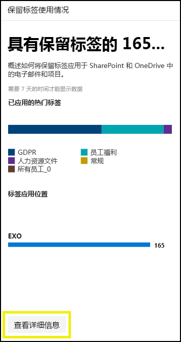
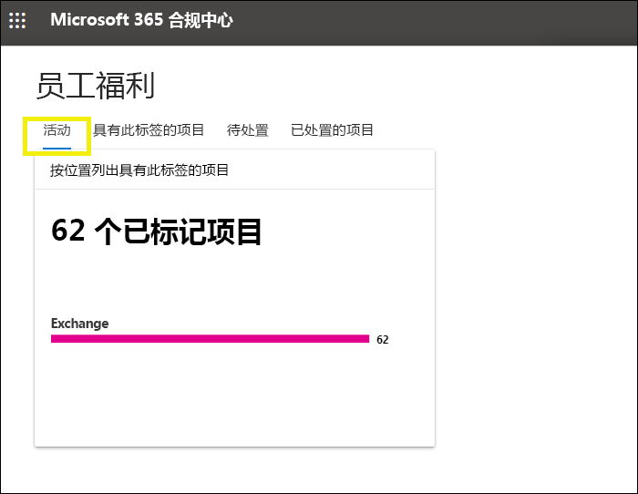

# 使用标签分析查看标签使用情况View label usage with label analytics

创建保留标签和敏感度标签后，你将希望了解它们如何在租户中使用。After you create your retention labels and sensitivity labels, you’ll want to see how they’re being used across your tenant. 借助 Microsoft 365 合规中心和 Microsoft 365 安全中心中的标签分析，你可以快速查看最常用的标签以及它们的应用位置。With label analytics in the Microsoft 365 compliance center and Microsoft 365 security center, you can quickly see which labels are used the most and where they’re being applied.

例如，借助标签分析，你可以查看：For example, with label analytics, you can view the:

- 应用于内容的保留标签和敏感度标签的总数。Total number of retention labels and sensitivity labels applied to content.
- 顶部标签和每个标签应用次数的计数。Top labels and the count of how many times each label was applied.
- 应用标签的位置和每个位置的计数。Locations where labels are applied and the count for each location.
- 更改或删除其保留标签的文件和文件夹的计数。Count for how many files and folders had their retention label changed or removed.

可以在 [Microsoft 365 合规中心](https://compliance.microsoft.com/labelanalytics)或 [Microsoft 365 安全中心](https://security.microsoft.com/labelanalytics) > “**分类**” > “**标签分析**”中找到标签分析。You can find label analytics in the [Microsoft 365 compliance center](https://compliance.microsoft.com/labelanalytics) or [Microsoft 365 security center](https://security.microsoft.com/labelanalytics) > **Classification** > **Label analytics**.

## 敏感度标签使用情况Sensitivity label usage

有关敏感度标签使用情况的数据是从 Azure 信息保护的报告中提取的 – 有关详细信息，请参阅 [Azure 信息保护的中央报告](https://docs.microsoft.com/azure/information-protection/reports-aip)。The data on sensitivity label usage is pulled from the reports for Azure Information Protection – for more information, see [Central reporting for Azure Information Protection](https://docs.microsoft.com/azure/information-protection/reports-aip).

请注意，Azure 信息保护报告的[先决条件](/azure/information-protection/reports-aip#prerequisites)也适用于 Microsoft 365 合规中心和 Microsoft 365 安全中心中敏感度标签上的标签分析。Note that the Azure Information Protection reports have [prerequisites](/azure/information-protection/reports-aip#prerequisites) that also apply to label analytics on sensitivity labels in the Microsoft 365 compliance center and Microsoft 365 security center. 例如，你需要包含 Log Analytics 的 Azure 订阅，因为这些报告是将信息保护审核事件从 Azure 信息保护客户端和扫描程序发送到基于 Azure Log Analytics 服务的集中位置的结果。For example, you need an Azure subscription that includes the Log Analytics because these reports are a result of sending information protection audit events from Azure Information Protection clients and scanners to a centralized location based on Azure Log Analytics service.

对于敏感度标签用使用情况法：For sensitivity label usage:

- 该数据中没有延迟。There is no latency in the data. 这是实时报告。This is a real-time report.
- 若要查看每个顶部标签的计数，请指向条形图，然后阅读显示的工具提示。To see the count for each top label, point to the bar graph and read the tool tip that appears.
- 该报告显示每个应用应用敏感度标签的位置（而每个位置都显示保留标签）。The report shows where sensitivity labels are applied per app (whereas retention labels are shown per location).

## 保留标签使用情况Retention label usage

此报告可快速查看顶部标签的内容及其应用位置。This report shows a quick view of what the top labels are and where they’re applied. 有关如何标记 SharePoint 和 OneDrive 中内容的详细信息，请参阅[查看文档的标签活动](view-label-activity-for-documents.md)。For more detailed information on how content in SharePoint and OneDrive is labeled, see [View label activity for documents](view-label-activity-for-documents.md).

对于保留标签使用情况：For retention label usage:

- 数据每周汇总一次，因此数据最多可能需要 7 天才能显示在报告中。Data is aggregated weekly, so it may take up to seven days for data to appear in the report.
- 若要查看每个顶部标签的计数，请指向条形图，然后阅读显示的工具提示。To see the count for each top label, point to the bar graph and read the tool tip that appears.
- 该报告显示每个位置应用保留标签的位置（而每个应用都显示敏感度标签）。The report shows where retention labels are applied per location (whereas sensitivity labels are shown per app).
- 对于保留标签，这是租户中所有时间数据的汇总；它没有筛选到特定的日期范围。For retention labels, this is a summary of the all-time data in your tenant; it’s not filtered to a specific date range. 相比之下，[标签活动资源管理器](view-label-activity-for-documents.md)仅显示过去 30 天的数据。By contrast, the [Label Activity Explorer](view-label-activity-for-documents.md) shows data from only the past 30 days.

## 查看具有特定保留标签的所有内容View all content with a specific retention label

从保留标签使用情况报告中，可以快速浏览应用了该标签的所有内容。From the retention label usage report, you can quickly explore all content with that label applied. （请注意，我们目前正在使用此功能，因此查看所有标记内容所需的步骤更少。）(Note that we're currently working on this feature, so that it will take fewer steps to view all the labeled content.)

首先，选择报告底部的“**查看详细信息**”。First, choose **View Details** at the bottom of the report.

然后在右侧窗格中选择保留标签 >“**查看项目**”。Then choose a retention label > **Explore items** in the right pane.

对于该标签，可以选择“**活动**”选项卡以按位置查看具有该标签的项目数。For that label, you can choose the **Activity** tab to view a count of items with that label by location.

也可以选择“**具有此标签的项目**”选项卡。然后可以深入了解特定位置：You can also choose the **Items with this label** tab. Then you can drill into specific locations:

- 对于 Exchange Online，你会看到一个邮箱列表，其中包含每个邮箱中已标记项目的计数。For Exchange Online, you see a list of mailboxes with the count of labeled items in each mailbox.
- 对于 SharePoint Online 和 OneDrive for Business，你会看到网站集和 OneDrive 帐户的列表，其中包含每个位置中已标记项目的计数。For SharePoint Online and OneDrive for Business, you see a list of site collections and OneDrive accounts with the count of labeled items in each location.

选择邮箱或站点集时，可以在该位置中查看具有该保留标签的项目的列表。When you choose a mailbox or site collection, you can view a list of items with that retention label in that location.

## 权限Permissions

若要查看标签分析，必须在 Azure Active Directory 中为你分配以下角色之一：To view label analytics, you must be assigned one of the following roles in Azure Active Directory:

- 全局管理员Global administrator
- 合规性管理员Compliance administrator
- 安全管理员Security administrator
- 安全读者Security reader

此外，请注意这些报告使用 Azure Monitor 将数据存储在组织拥有的 Log Analytics 工作区中。In addition, note these reports use Azure Monitor to store the data in a Log Analytics workspace that your organization owns. 因此，应将用户作为读者添加到包含数据的 Azure 监视工作区 - 有关详细信息，请参阅 [Azure 信息保护分析所需的权限](https://docs.microsoft.com/azure/information-protection/reports-aip#permissions-required-for-azure-information-protection-analytics)。Therefore, the user should be added as a reader to the Azure Monitoring workspace that holds the data - for more information, see [Permissions required for Azure Information Protection analytics](https://docs.microsoft.com/azure/information-protection/reports-aip#permissions-required-for-azure-information-protection-analytics).

