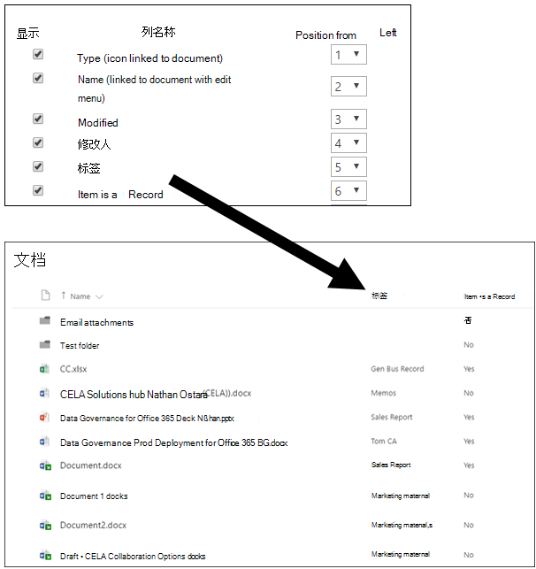
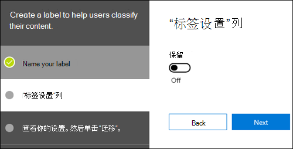
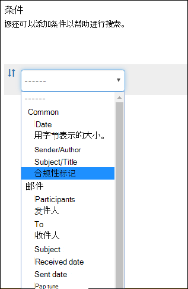

# <a name="overview-of-retention-labels"></a><span data-ttu-id="ae0d8-104">保留标签概述</span><span class="sxs-lookup"><span data-stu-id="ae0d8-104">Overview of retention labels</span></span>

<span data-ttu-id="ae0d8-p102">整个组织中可能有不同类型的内容。为了遵守行业法规和内部策略，必须采取不同的操作。例如，可能有：</span><span class="sxs-lookup"><span data-stu-id="ae0d8-p102">Across your organization, you probably have different types of content that require different actions taken on them in order to comply with industry regulations and internal policies. For example, you might have:</span></span>
  
- <span data-ttu-id="ae0d8-107">至少必须**保留**一段时间的纳税申报表格。</span><span class="sxs-lookup"><span data-stu-id="ae0d8-107">Tax forms that need to be **retained** for a minimum period of time.</span></span> 
    
- <span data-ttu-id="ae0d8-108">达到一定年限后必须**永久删除**的新闻材料。</span><span class="sxs-lookup"><span data-stu-id="ae0d8-108">Press materials that need to be **permanently deleted** when they reach a certain age.</span></span> 
    
- <span data-ttu-id="ae0d8-109">必须先**保留**再**永久删除**的竞争性研究。</span><span class="sxs-lookup"><span data-stu-id="ae0d8-109">Competitive research that needs to be both **retained** and then **permanently deleted**.</span></span> 
    
- <span data-ttu-id="ae0d8-110">必须**标记为记录**以免被编辑或删除的工作签证。</span><span class="sxs-lookup"><span data-stu-id="ae0d8-110">Work visas that must be **marked as a record** so that they can't be edited or deleted.</span></span> 
    
<span data-ttu-id="ae0d8-p103">无论是上述哪种用途，Office 365 中的保留标签都可有助于对正确的内容执行适当的操作。借助保留标签，可对整个组织中的数据进行分类来管理数据，并根据此分类强制执行保留规则。</span><span class="sxs-lookup"><span data-stu-id="ae0d8-p103">In all of these cases, retention labels in Office 365 can help you take the right actions on the right content. With retention labels, you can classify data across your organization for governance, and enforce retention rules based on that classification.</span></span>
  
<span data-ttu-id="ae0d8-113">借助保留标签，你可以：</span><span class="sxs-lookup"><span data-stu-id="ae0d8-113">With retention labels, you can:</span></span>
  
- <span data-ttu-id="ae0d8-p104">**方便组织内人员手动将保留标签应用于** Outlook 网页版、Outlook 2010 及更高版本、OneDrive、SharePoint 和 Office 365 组中的内容。用户通常最了解自己处理的内容类型，因此可对数据进行分类，并应用适当策略。</span><span class="sxs-lookup"><span data-stu-id="ae0d8-p104">**Enable people in your organization to apply a retention label manually** to content in Outlook on the web, Outlook 2010 and later, OneDrive, SharePoint, and Office 365 groups. Users often know best what type of content they're working with, so they can classify it and have the appropriate policy applied.</span></span> 
    
- <span data-ttu-id="ae0d8-116">**将保留标签自动应用于**符合特定条件的内容，如内容包含：</span><span class="sxs-lookup"><span data-stu-id="ae0d8-116">**Apply retention labels to content automatically** if it matches specific conditions, such as when the content contains:</span></span> 
    
    - <span data-ttu-id="ae0d8-117">特定类型敏感信息。</span><span class="sxs-lookup"><span data-stu-id="ae0d8-117">Specific types of sensitive information.</span></span>
    
    - <span data-ttu-id="ae0d8-118">与所创建的查询匹配的特定关键字。</span><span class="sxs-lookup"><span data-stu-id="ae0d8-118">Specific keywords that match a query you create.</span></span>
    
    - <span data-ttu-id="ae0d8-119">可训练分类器的模式匹配。</span><span class="sxs-lookup"><span data-stu-id="ae0d8-119">Pattern matches for a trainable classifier.</span></span>
    
  <span data-ttu-id="ae0d8-120">能否将保留标签自动应用于内容非常重要，这是因为：</span><span class="sxs-lookup"><span data-stu-id="ae0d8-120">The ability to apply retention labels to content automatically is important because:</span></span>
    
     - <span data-ttu-id="ae0d8-121">无需为用户提供有关所有分类的培训。</span><span class="sxs-lookup"><span data-stu-id="ae0d8-121">You don't need to train your users on all of your classifications.</span></span>
    
     - <span data-ttu-id="ae0d8-122">无需依赖用户，即可对全部内容进行正确分类。</span><span class="sxs-lookup"><span data-stu-id="ae0d8-122">You don't need to rely on users to classify all content correctly.</span></span>
    
   - <span data-ttu-id="ae0d8-123">用户不再需要了解数据管理策略，反而可以专注于自己的工作。</span><span class="sxs-lookup"><span data-stu-id="ae0d8-123">Users no longer need to know about data governance policies - they can instead focus on their work.</span></span>

- <span data-ttu-id="ae0d8-p105">**在 Office 365 中实现记录管理**，包括电子邮件和文档。可使用保留标签将内容分类为记录。如果这样做，既无法更改或删除保留标签，也无法编辑或删除内容。</span><span class="sxs-lookup"><span data-stu-id="ae0d8-p105">**Implement records management across Office 365**, including both email and documents. You can use a retention label to classify content as a record. When this happens, the label can't be changed or removed, and the content can't be edited or deleted.</span></span> 

- <span data-ttu-id="ae0d8-127">**将默认保留标签应用于 SharePoint 中的文档库、文件夹或文档集**，以让到达该位置的所有文档都继承默认保留标签。</span><span class="sxs-lookup"><span data-stu-id="ae0d8-127">**Apply a default retention label to a document library, folder, or document set** in SharePoint, so that all documents that arrive in that location inherit the default retention label.</span></span>  
    
<span data-ttu-id="ae0d8-128">在 Microsoft 365 合规中心、Microsoft 365 安全中心或 Office 365 安全与合规中心，创建保留标签。</span><span class="sxs-lookup"><span data-stu-id="ae0d8-128">You create retention labels in the Microsoft 365 compliance center, Microsoft 365 security center, or Office 365 Security & Compliance Center.</span></span>

## <a name="how-retention-labels-work-with-retention-label-policies"></a><span data-ttu-id="ae0d8-129">如何结合使用保留标签和保留标签策略</span><span class="sxs-lookup"><span data-stu-id="ae0d8-129">How retention labels work with retention label policies</span></span>

<span data-ttu-id="ae0d8-130">使组织中的人员可使用保留标签，便于其按两步操作进行内容分类：首先创建保留标签，然后将其发布到所选位置。</span><span class="sxs-lookup"><span data-stu-id="ae0d8-130">Making retention labels available to people in your organization so that they can classify content is a two-step process: first you create the retention labels, and then you publish them to the locations you choose.</span></span> <span data-ttu-id="ae0d8-131">发布保留标签时，将创建保留标签策略。</span><span class="sxs-lookup"><span data-stu-id="ae0d8-131">When you publish retention labels, a retention label policy gets created.</span></span>
  

  
<span data-ttu-id="ae0d8-133">保留标签是独立且可重复使用的构建基块，其包含在一个或多个保留标签策略中。</span><span class="sxs-lookup"><span data-stu-id="ae0d8-133">Retention labels are independent, reusable building blocks that are included in one or more retention label policies.</span></span> <span data-ttu-id="ae0d8-134">保留标签策略的主要目的是对一组保留标签进行分组，并指定要显示标签的位置。</span><span class="sxs-lookup"><span data-stu-id="ae0d8-134">The primary purpose of a retention label policy is to group a set of retention labels and specify the locations where you want those labels to appear.</span></span>
  

  
1. <span data-ttu-id="ae0d8-136">发布保留标签时，它们将包含在保留标签策略中。</span><span class="sxs-lookup"><span data-stu-id="ae0d8-136">When you publish retention labels, they're included in a retention label policy.</span></span> <span data-ttu-id="ae0d8-137">请注意，保留标签名称是不可变的，创建后将无法编辑。</span><span class="sxs-lookup"><span data-stu-id="ae0d8-137">Please note, retention label names are immutable and cannot be edited once created.</span></span>


2. <span data-ttu-id="ae0d8-138">一个保留标签可以包含在多个保留标签策略中。</span><span class="sxs-lookup"><span data-stu-id="ae0d8-138">A single retention label can be included in many retention label policies.</span></span>

3. <span data-ttu-id="ae0d8-139">一个位置也可以包括在许多保留标签策略中。</span><span class="sxs-lookup"><span data-stu-id="ae0d8-139">A single location can also be included in many retention label policies.</span></span>    
    
3. <span data-ttu-id="ae0d8-140">保留标签策略指定保留标签发布位置。</span><span class="sxs-lookup"><span data-stu-id="ae0d8-140">Retention label policies specify the locations to publish the retention labels.</span></span>
    
## <a name="only-one-retention-label-at-a-time"></a><span data-ttu-id="ae0d8-141">一次只能分配一个保留标签</span><span class="sxs-lookup"><span data-stu-id="ae0d8-141">Only one retention label at a time</span></span>

<span data-ttu-id="ae0d8-142">请务必了解，电子邮件或文档等内容一次只能分配有一个保留标签：</span><span class="sxs-lookup"><span data-stu-id="ae0d8-142">It's important to know that content like an email or document can have only a single retention label assigned to it at a time:</span></span>
  
- <span data-ttu-id="ae0d8-143">对于最终用户手动分配的保留标签，用户可删除或更改所分配的保留标签。</span><span class="sxs-lookup"><span data-stu-id="ae0d8-143">For retention labels assigned manually by end users, people can remove or change the retention label that's assigned.</span></span>
    
- <span data-ttu-id="ae0d8-144">可将内容分配有的自动应用标签替换为，最终用户手动分配的保留标签。</span><span class="sxs-lookup"><span data-stu-id="ae0d8-144">If content has an auto-apply label assigned, an auto-apply label can be replaced by a retention label assigned manually by an end user.</span></span>
    
- <span data-ttu-id="ae0d8-145">如果最终用户已手动向内容分配保留标签，无法使用自动应用标签来替换手动分配的保留标签。</span><span class="sxs-lookup"><span data-stu-id="ae0d8-145">If content has a retention label assigned manually by an end user, an auto-apply label cannot replace the manually assigned retention label.</span></span>
    
- <span data-ttu-id="ae0d8-146">若有多个规则要分配自动应用标签，且内容满足多个规则的条件，那么分配的是年限最长规则的保留标签。</span><span class="sxs-lookup"><span data-stu-id="ae0d8-146">If there are multiple rules that assign an auto-apply label and content meets the conditions of multiple rules, the retention label for the oldest rule is assigned.</span></span>
    
<span data-ttu-id="ae0d8-p109">手动分配标签是显式分配标签；自动应用标签是隐式分配标签；显式保留标签优先于隐式标签。有关详细信息，请参阅下面的[保留原则或优先级](#the-principles-of-retention-or-what-takes-precedence)部分。</span><span class="sxs-lookup"><span data-stu-id="ae0d8-p109">Manually assigned labels are explicitly assigned; auto-apply labels are implicitly assigned; an explicit retention label takes precedence over an implicit label. For more information, see the below section on [The principles of retention, or what takes precedence?](#the-principles-of-retention-or-what-takes-precedence).</span></span>

<span data-ttu-id="ae0d8-p110">此部分中的所有信息仅适用于保留标签。请注意，除了一个保留标签之外，内容项还可以再应用有一个敏感度标签。</span><span class="sxs-lookup"><span data-stu-id="ae0d8-p110">All of the information in this section applies only to retention labels. Note that an item of content can also have one sensitivity label applied to it, in addition to one retention label.</span></span>
  
## <a name="how-long-it-takes-for-retention-labels-to-take-effect"></a><span data-ttu-id="ae0d8-151">保留标签需要多长时间才能生效</span><span class="sxs-lookup"><span data-stu-id="ae0d8-151">How long it takes for retention labels to take effect</span></span>

<span data-ttu-id="ae0d8-152">保留标签在发布或自动应用后不会立即生效：</span><span class="sxs-lookup"><span data-stu-id="ae0d8-152">When you publish or auto-apply retention labels, they don't take effect immediately:</span></span>
  
1. <span data-ttu-id="ae0d8-153">首先，需要将标签策略从管理中心同步到策略中的位置。</span><span class="sxs-lookup"><span data-stu-id="ae0d8-153">First the label policy needs to be synced from the admin center to the locations in the policy.</span></span>
    
2. <span data-ttu-id="ae0d8-154">然后，该位置可能需要一段时间才能使已发布的保留标签对最终用户可用，或需要一段时间将标签自动应用到内容。</span><span class="sxs-lookup"><span data-stu-id="ae0d8-154">Then the location may require time to make published retention labels available to end users or time to auto-apply labels to content.</span></span> <span data-ttu-id="ae0d8-155">所需时间长短取决于保留标签的位置和类型。</span><span class="sxs-lookup"><span data-stu-id="ae0d8-155">How long this takes depends on the location and type of retention label.</span></span>
    
### <a name="published-retention-labels"></a><span data-ttu-id="ae0d8-156">已发布的保留标签</span><span class="sxs-lookup"><span data-stu-id="ae0d8-156">Published retention labels</span></span>

<span data-ttu-id="ae0d8-p112">如果将保留标签发布到 SharePoint 或 OneDrive，可能需要等待 1 天时间，这些保留标签才会向最终用户显示。此外，如果向 Exchange 发布保留标签，可能需要等待 7 天，这些保留标签才会向最终用户显示，并且邮箱至少必须包含 10MB 数据。</span><span class="sxs-lookup"><span data-stu-id="ae0d8-p112">If you publish retention labels to SharePoint or OneDrive, it can take one day for those retention labels to appear for end users. In addition, if you publish retention labels to Exchange, it can take 7 days for those retention labels to appear for end users, and the mailbox needs to contain at least 10 MB of data.</span></span>
  

  
### <a name="auto-apply-retention-labels"></a><span data-ttu-id="ae0d8-160">自动应用保留标签</span><span class="sxs-lookup"><span data-stu-id="ae0d8-160">Auto-apply retention labels</span></span>

<span data-ttu-id="ae0d8-161">如果将保留标签自动应用于符合特定条件的内容，可能需要等待 7 天，才能将保留标签应用于与条件匹配的所有现有内容。</span><span class="sxs-lookup"><span data-stu-id="ae0d8-161">If you auto-apply retention labels to content matching specific conditions, it can take seven days for the retention labels to be applied to all existing content that matches the conditions.</span></span>
  

  
### <a name="how-to-check-on-the-status-of-retention-labels-published-to-exchange"></a><span data-ttu-id="ae0d8-163">如何检查发布到 Exchange 的保留标签的状态</span><span class="sxs-lookup"><span data-stu-id="ae0d8-163">How to check on the status of retention labels published to Exchange</span></span>

<span data-ttu-id="ae0d8-p113">在 Exchange Online 中，有一个流程每 7 天运行一次，用于向最终用户提供保留标签。使用 PowerShell，可查看此流程的上次运行时间，从而确定它何时再次运行。</span><span class="sxs-lookup"><span data-stu-id="ae0d8-p113">In Exchange Online, retention labels are made available to end users by a process that runs every seven days. By using Powershell, you can see when this process last ran and thus determine when it will run again.</span></span>
  
1. <span data-ttu-id="ae0d8-166">[连接到 Exchange Online PowerShell](https://go.microsoft.com/fwlink/?linkid=799773)。</span><span class="sxs-lookup"><span data-stu-id="ae0d8-166">[Connect to Exchange Online PowerShell](https://go.microsoft.com/fwlink/?linkid=799773).</span></span>
    
2. <span data-ttu-id="ae0d8-167">运行下面这些命令。</span><span class="sxs-lookup"><span data-stu-id="ae0d8-167">Run these commands.</span></span>
    
   ```powershell
   $logProps = Export-MailboxDiagnosticLogs <user> -ExtendedProperties
   ```

   ```powershell
   $xmlprops = [xml]($logProps.MailboxLog)
   ```

   ```powershell
   $xmlprops.Properties.MailboxTable.Property | ? {$_.Name -like "ELC*"}
   ```

<span data-ttu-id="ae0d8-168">在结果中，`ELCLastSuccessTimeStamp` (UTC) 属性显示系统上次处理你邮箱的时间。</span><span class="sxs-lookup"><span data-stu-id="ae0d8-168">In the results, the `ELCLastSuccessTimeStamp` (UTC) property shows when the system last processed your mailbox.</span></span> <span data-ttu-id="ae0d8-169">如果自创建策略起未处理，则不会显示标签。</span><span class="sxs-lookup"><span data-stu-id="ae0d8-169">If it has not happened since the time you created the policy, the labels are not going to appear.</span></span> <span data-ttu-id="ae0d8-170">若要强制处理，请运行 `Start-ManagedFolderAssistant -Identity <user>`。</span><span class="sxs-lookup"><span data-stu-id="ae0d8-170">To force processing, run  `Start-ManagedFolderAssistant -Identity <user>`.</span></span>
    
<span data-ttu-id="ae0d8-171">如果标签没有显示在 Outlook 网页版中，但你认为标签应显示，请务必清除浏览器中的缓存 (Ctrl+F5)。</span><span class="sxs-lookup"><span data-stu-id="ae0d8-171">If labels aren't appearing in Outlook on the web and you think they should be, make sure to clear the cache in your browser (CTRL+F5).</span></span>
    
## <a name="retention-label-policies-and-locations"></a><span data-ttu-id="ae0d8-172">保留标签策略和位置</span><span class="sxs-lookup"><span data-stu-id="ae0d8-172">Retention label policies and locations</span></span>

<span data-ttu-id="ae0d8-173">不同类型的保留标签可发布到不同位置，具体视保留标签用途而定。</span><span class="sxs-lookup"><span data-stu-id="ae0d8-173">Different types of retention labels can be published to different locations, depending on what the retention label does.</span></span>
  
|<span data-ttu-id="ae0d8-174">**如果保留标签…**</span><span class="sxs-lookup"><span data-stu-id="ae0d8-174">**If the retention label is…**</span></span>|<span data-ttu-id="ae0d8-175">**可将标签策略应用于…**</span><span class="sxs-lookup"><span data-stu-id="ae0d8-175">**Then the label policy can be applied to…**</span></span>|
|:-----|:-----|
|<span data-ttu-id="ae0d8-176">发布给最终用户</span><span class="sxs-lookup"><span data-stu-id="ae0d8-176">Published to end users</span></span>  <br/> |<span data-ttu-id="ae0d8-177">Exchange、SharePoint、OneDrive 和 Office 365 组</span><span class="sxs-lookup"><span data-stu-id="ae0d8-177">Exchange, SharePoint, OneDrive, Office 365 groups</span></span>  <br/> |
|<span data-ttu-id="ae0d8-178">根据敏感信息类型自动应用</span><span class="sxs-lookup"><span data-stu-id="ae0d8-178">Auto-applied based on sensitive information types</span></span>  <br/> |<span data-ttu-id="ae0d8-179">Exchange（仅全部邮箱）、SharePoint 和 OneDrive</span><span class="sxs-lookup"><span data-stu-id="ae0d8-179">Exchange (all mailboxes only), SharePoint, OneDrive</span></span>  <br/> |
|<span data-ttu-id="ae0d8-180">根据查询自动应用</span><span class="sxs-lookup"><span data-stu-id="ae0d8-180">Auto-applied based on a query</span></span>  <br/> |<span data-ttu-id="ae0d8-181">Exchange、SharePoint、OneDrive 和 Office 365 组</span><span class="sxs-lookup"><span data-stu-id="ae0d8-181">Exchange, SharePoint, OneDrive, Office 365 groups</span></span>  <br/> |
   
<span data-ttu-id="ae0d8-182">在 Exchange 中，自动应用（同时针对查询和敏感信息类型）的保留标签只会应用于新发送的邮件（传输中的数据），而非当前邮箱中的所有项目（静态数据）。</span><span class="sxs-lookup"><span data-stu-id="ae0d8-182">In Exchange, auto-apply retention labels (for both queries and sensitive information types) are applied only to messages newly sent (data in transit), not to all items currently in the mailbox (data at rest).</span></span> <span data-ttu-id="ae0d8-183">此外，用于敏感信息类型的自动应用的保留标签只能应用于全部邮箱；不能选择特定邮箱。</span><span class="sxs-lookup"><span data-stu-id="ae0d8-183">Also, auto-apply retention labels for sensitive information types can apply only to all mailboxes; you can't select the specific mailboxes.</span></span>
  
<span data-ttu-id="ae0d8-184">Exchange 公用文件夹和 Skype 不支持标签。</span><span class="sxs-lookup"><span data-stu-id="ae0d8-184">Exchange public folders and Skype do not support labels.</span></span>
  
## <a name="how-retention-labels-enforce-retention"></a><span data-ttu-id="ae0d8-185">保留标签如何强制执行保留</span><span class="sxs-lookup"><span data-stu-id="ae0d8-185">How retention labels enforce retention</span></span>

<span data-ttu-id="ae0d8-186">保留标签能够执行保留策略可执行的相同保留操作。</span><span class="sxs-lookup"><span data-stu-id="ae0d8-186">Retention labels can enforce the same retention actions that a retention policy can.</span></span> <span data-ttu-id="ae0d8-187">可使用保留标签执行复杂的内容计划（或文件计划）。</span><span class="sxs-lookup"><span data-stu-id="ae0d8-187">You can use retention labels to implement a sophisticated content plan (or file plan).</span></span> <span data-ttu-id="ae0d8-188">有关保留操作工作原理的详细信息，请参阅[保留策略概述](retention-policies.md)。</span><span class="sxs-lookup"><span data-stu-id="ae0d8-188">For more information on how retention works, see [Overview of retention policies](retention-policies.md).</span></span>
  
<span data-ttu-id="ae0d8-p117">此外，保留标签有两个保留选项，这两个选项只能用于保留标签，而不能用于保留策略。借助保留标签，你可以：</span><span class="sxs-lookup"><span data-stu-id="ae0d8-p117">In addition, a retention label has two retention options that are available only in a retention label and not in a retention policy. With a retention label, you can:</span></span>
  
- <span data-ttu-id="ae0d8-p118">在保留期到期时触发处置评审。这样一来，必须先评审 SharePoint 和 OneDrive 文档，然后才能删除它们。有关详细信息，请参阅[处置评审概述](disposition-reviews.md)。</span><span class="sxs-lookup"><span data-stu-id="ae0d8-p118">Trigger a disposition review at the end of the retention period, so that SharePoint and OneDrive documents must be reviewed before they can be deleted. For more information, see [Overview of disposition reviews](disposition-reviews.md).</span></span>
    
- <span data-ttu-id="ae0d8-193">保留期从内容分配有标签时开始计算，而不是根据内容年限或上次修改时间计算。</span><span class="sxs-lookup"><span data-stu-id="ae0d8-193">Start the retention period from when the content was labeled, instead of the age of the content or when it was last modified.</span></span> <span data-ttu-id="ae0d8-194">此选项仅适用于 SharePoint 网站和 OneDrive 帐户中的内容。</span><span class="sxs-lookup"><span data-stu-id="ae0d8-194">This option applies only to content in SharePoint sites and OneDrive accounts.</span></span> <span data-ttu-id="ae0d8-195">对于 Exchange 电子邮件，保留期限始终基于发送或接收邮件的日期，无论此处选择哪个选项，都是如此。</span><span class="sxs-lookup"><span data-stu-id="ae0d8-195">For Exchange email, the retention period is always based on the date when the message was sent or received, no matter which option you choose here.</span></span>
    

  
## <a name="where-published-retention-labels-can-appear-to-end-users"></a><span data-ttu-id="ae0d8-197">在哪些位置上发布的保留标签可向最终用户显示</span><span class="sxs-lookup"><span data-stu-id="ae0d8-197">Where published retention labels can appear to end users</span></span>

<span data-ttu-id="ae0d8-198">如果保留标签将由最终用户分配给内容，可将保留标签发布到：</span><span class="sxs-lookup"><span data-stu-id="ae0d8-198">If your retention label will be assigned to content by end users, you can publish it to:</span></span>
  
- <span data-ttu-id="ae0d8-199">Outlook 网页版</span><span class="sxs-lookup"><span data-stu-id="ae0d8-199">Outlook on the web</span></span>
    
- <span data-ttu-id="ae0d8-200">Outlook 2010 及更高版本</span><span class="sxs-lookup"><span data-stu-id="ae0d8-200">Outlook 2010 and later</span></span>
    
- <span data-ttu-id="ae0d8-201">OneDrive</span><span class="sxs-lookup"><span data-stu-id="ae0d8-201">OneDrive</span></span>
    
- <span data-ttu-id="ae0d8-202">SharePoint</span><span class="sxs-lookup"><span data-stu-id="ae0d8-202">SharePoint</span></span>
    
- <span data-ttu-id="ae0d8-203">Office 365 组（Outlook 网页版中的组网站和组邮箱）</span><span class="sxs-lookup"><span data-stu-id="ae0d8-203">Office 365 groups (both the group site and group mailbox in Outlook on the web)</span></span>
    
<span data-ttu-id="ae0d8-204">下面各部分介绍了标签如何在不同的应用程序中向组织用户显示。</span><span class="sxs-lookup"><span data-stu-id="ae0d8-204">The sections below show how labels appear in different apps to people in your organization.</span></span>
  
### <a name="outlook-on-the-web"></a><span data-ttu-id="ae0d8-205">Outlook 网页版</span><span class="sxs-lookup"><span data-stu-id="ae0d8-205">Outlook on the web</span></span>

<span data-ttu-id="ae0d8-206">若要在 Outlook 网页版中标记项，请右键单击项，单击“分配策略”\*\*\*\*，再选择保留标签。</span><span class="sxs-lookup"><span data-stu-id="ae0d8-206">To label an item in Outlook on the web, right-click the item \> **Assign policy** \> choose the retention label.</span></span> 
  

  
<span data-ttu-id="ae0d8-p120">在保留标签应用后，可在项顶部查看此保留标签及其执行的操作。如果电子邮件已分类且有关联的保留期，电子邮件的到期时间便一目了然。</span><span class="sxs-lookup"><span data-stu-id="ae0d8-p120">After the retention label is applied, you can view that retention label and what action it takes at the top of the item. If an email is classified and has an associated retention period, you can know at a glance when the email will expire.</span></span>
  

  
<span data-ttu-id="ae0d8-211">还可将保留标签应用于文件夹，在这种情况下：</span><span class="sxs-lookup"><span data-stu-id="ae0d8-211">You can also apply retention labels to folders, in which case:</span></span>
  
- <span data-ttu-id="ae0d8-p121">文件夹中的所有项都会自动获得相同的保留标签，已向其显式应用保留标签的项除外\*\*\*\*。显式标记的项保留现有保留标签。有关详细信息，请参阅以下关于保留原则的部分。</span><span class="sxs-lookup"><span data-stu-id="ae0d8-p121">All items in the folder automatically get the same retention label, **except** for items that have had a retention label applied explicitly to them. Explicitly labeled items keep their existing retention label. For more information, see the below section on the principles of retention.</span></span> 
    
- <span data-ttu-id="ae0d8-215">如果你更改或删除文件夹的默认保留标签，文件夹中所有项的保留标签都会随之更改或删除，具有显式保留标签的项除外\*\*\*\*。</span><span class="sxs-lookup"><span data-stu-id="ae0d8-215">If you change or remove the default retention label for a folder, the retention label's also changed or removed for all items in the folder, **except** items with explicit retention labels.</span></span> 
    
- <span data-ttu-id="ae0d8-216">如果你将具有默认保留标签的项从一个文件夹移至另一个具有不同默认保留标签的文件夹，此项会获得新的默认保留标签。</span><span class="sxs-lookup"><span data-stu-id="ae0d8-216">If you move an item with a default retention label from one folder to another folder with a different default retention label, the item gets the new default retention label.</span></span>
    
- <span data-ttu-id="ae0d8-217">如果你将具有默认保留标签的项从一个文件夹移至另一个具有不同默认保留标签的文件夹，旧的默认保留标签会遭删除。</span><span class="sxs-lookup"><span data-stu-id="ae0d8-217">If you move an item with a default retention label from one folder to another folder with no default retention label, the old default retention label is removed.</span></span>
    
### <a name="outlook-2010-and-later"></a><span data-ttu-id="ae0d8-218">Outlook 2010 及更高版本</span><span class="sxs-lookup"><span data-stu-id="ae0d8-218">Outlook 2010 and later</span></span>

<span data-ttu-id="ae0d8-219">若要在 Outlook 桌面客户端中标记项目，请选择该项目。</span><span class="sxs-lookup"><span data-stu-id="ae0d8-219">To label an item in the Outlook desktop client, select the item.</span></span> <span data-ttu-id="ae0d8-220">在功能区上的“**开始**”选项卡上，单击“**分配策略**”，然后选择保留标签。</span><span class="sxs-lookup"><span data-stu-id="ae0d8-220">On the **Home** tab on the ribbon, click **Assign Policy**, and then choose the retention label.</span></span> 
  

  
<span data-ttu-id="ae0d8-222">也可以右键单击项目，在上下文菜单中单击“**分配策略**”，然后选择保留标签。</span><span class="sxs-lookup"><span data-stu-id="ae0d8-222">You can also right-click an item, click **Assign Policy** in the context menu, and then choose the retention label.</span></span> 

<span data-ttu-id="ae0d8-223">应用保留标签后，可查看此保留标签以及基于此项目执行的操作。</span><span class="sxs-lookup"><span data-stu-id="ae0d8-223">After the retention label is applied, you can view that retention label and what action it takes at the top of the item.</span></span> <span data-ttu-id="ae0d8-224">如果某电子邮件应用了具有相关保留期的保留标签，则可以一目了然地查看该电子邮件的过期时间。</span><span class="sxs-lookup"><span data-stu-id="ae0d8-224">If an email has a retention label applied that has an associated retention period, you can see at a glance when the email expires.</span></span>
  
<span data-ttu-id="ae0d8-225">还可将保留标签应用于文件夹。</span><span class="sxs-lookup"><span data-stu-id="ae0d8-225">You can also apply retention labels to folders.</span></span> <span data-ttu-id="ae0d8-226">其在 Outlook​​ 2010 及更高版本中的工作原理与在 Outlook 网页版中的相同。</span><span class="sxs-lookup"><span data-stu-id="ae0d8-226">This works the same in Outlook 2010 and later as it does in Outlook on the web.</span></span> <span data-ttu-id="ae0d8-227">请参阅上一节了解详细信息。</span><span class="sxs-lookup"><span data-stu-id="ae0d8-227">See the previous section for more info.</span></span>
  
### <a name="onedrive-and-sharepoint"></a><span data-ttu-id="ae0d8-228">OneDrive 和 SharePoint</span><span class="sxs-lookup"><span data-stu-id="ae0d8-228">OneDrive and SharePoint</span></span>

<span data-ttu-id="ae0d8-229">若要在 OneDrive 或 SharePoint 中标记文档（包括 OneNote 文件），请选择项 \> 在右上角选择“**打开细节窗格**” \>“**应用保留标签**”\> 选择保留标签。</span><span class="sxs-lookup"><span data-stu-id="ae0d8-229">To label a document (including OneNote files) in OneDrive or SharePoint, select the item \> in the upper-right corner, choose **Open the details pane** \> **Apply retention label** \> choose the retention label.</span></span> 
  
<span data-ttu-id="ae0d8-230">还可将保留标签应用于文件夹或文档集，并能为文档库设置默认保留标签。</span><span class="sxs-lookup"><span data-stu-id="ae0d8-230">You can also apply a retention label to a folder or document set, and you can set a default retention label for a document library.</span></span> <span data-ttu-id="ae0d8-231">有关详细信息，请参阅下面的部分。</span><span class="sxs-lookup"><span data-stu-id="ae0d8-231">See the section below for more information.</span></span>
  

  
<span data-ttu-id="ae0d8-233">在保留标签应用于项后，可在选择项后在细节窗格中查看保留标签。</span><span class="sxs-lookup"><span data-stu-id="ae0d8-233">After a retention label is applied to an item, you can view it in the details pane when that item's selected.</span></span>
  

  
<span data-ttu-id="ae0d8-p126">还可创建包含“标签”\*\*\*\* 列或“项是记录”\*\*\*\* 列的库的视图，这样分配给所有项的保留标签以及哪些项是记录便一目了然。不过，请注意，无法按“项是记录”\*\*\*\* 列筛选视图。</span><span class="sxs-lookup"><span data-stu-id="ae0d8-p126">You can also create a view of the library that contains the **Labels** column or **Item is a Record** column, so that you can see at a glance the retention labels assigned to all items and which items are records. Note, however, that you can't filter the view by the **Item is a Record** column.</span></span> 
  

  
### <a name="office-365-groups"></a><span data-ttu-id="ae0d8-238">Office 365 组</span><span class="sxs-lookup"><span data-stu-id="ae0d8-238">Office 365 groups</span></span>

<span data-ttu-id="ae0d8-p127">发布到 Office 365 组的保留标签同时显示在，Outlook 网页版的组网站和组邮箱中。将保留标签应用于内容的过程，与上述将保留标签应用于电子邮件和文档的过程完全相同。</span><span class="sxs-lookup"><span data-stu-id="ae0d8-p127">When you publish retention labels to an Office 365 group, the retention labels appear in both the group site and group mailbox in Outlook on the web. The experience of applying a retention label to content is identical to that shown above for email and documents.</span></span>

<span data-ttu-id="ae0d8-p128">保留 Office 365 组内容需要使用 Office 365 组位置。即使 Office 365 组有 Exchange 邮箱，包含整个 Exchange 位置的保留策略也不会包含 Office 365 组邮箱中的内容。</span><span class="sxs-lookup"><span data-stu-id="ae0d8-p128">To retain content for an Office 365 group, you need to use the Office 365 groups location. Even though an Office 365 group has an Exchange mailbox, a retention policy that includes the entire Exchange location won't include content in Office 365 group mailboxes.</span></span>

<span data-ttu-id="ae0d8-243">此外，不可能通过使用 Exchange 位置来包含或排除某个组邮箱。</span><span class="sxs-lookup"><span data-stu-id="ae0d8-243">In addition, it's not possible to use the Exchange location to include or exclude a specific group mailbox.</span></span> <span data-ttu-id="ae0d8-244">尽管 Exchange 位置最初允许选择组邮箱，但在尝试保存保留策略时，你将收到一条错误消息，表明“RemoteGroupMailbox”不是有效的 Exchange 位置选项。</span><span class="sxs-lookup"><span data-stu-id="ae0d8-244">Although the Exchange location initially allows a group mailbox to be selected, when you try to save the retention policy, you receive an error that "RemoteGroupMailbox" is not a valid selection for the Exchange location.</span></span>
  
## <a name="applying-a-retention-label-automatically-based-on-conditions"></a><span data-ttu-id="ae0d8-245">根据条件自动应用保留标签</span><span class="sxs-lookup"><span data-stu-id="ae0d8-245">Applying a retention label automatically based on conditions</span></span>

<span data-ttu-id="ae0d8-246">保留标签最强大的功能之一是能够将其自动应用于符合特定条件的内容。</span><span class="sxs-lookup"><span data-stu-id="ae0d8-246">One of the most powerful features of retention labels is the ability to apply them automatically to content that matches certain conditions.</span></span> <span data-ttu-id="ae0d8-247">此情况下，组织中的人员无需应用保留标签。</span><span class="sxs-lookup"><span data-stu-id="ae0d8-247">In this case, people in your organization don't need to apply the retention labels.</span></span> <span data-ttu-id="ae0d8-248">Office 365 会代为操作。</span><span class="sxs-lookup"><span data-stu-id="ae0d8-248">Office 365 does the work for them.</span></span>
  

  
<span data-ttu-id="ae0d8-250">自动应用保留标签的功能非常强大，这是因为：</span><span class="sxs-lookup"><span data-stu-id="ae0d8-250">Auto-apply retention labels are powerful because:</span></span>
  
- <span data-ttu-id="ae0d8-251">无需为用户提供有关所有分类的培训。</span><span class="sxs-lookup"><span data-stu-id="ae0d8-251">You don't need to train your users on all of your classifications.</span></span>
    
- <span data-ttu-id="ae0d8-252">无需依赖用户，即可对全部内容进行正确分类。</span><span class="sxs-lookup"><span data-stu-id="ae0d8-252">You don't need to rely on users to classify all content correctly.</span></span>
    
- <span data-ttu-id="ae0d8-253">用户不再需要了解数据管理策略，反而可以专注于自己的工作。</span><span class="sxs-lookup"><span data-stu-id="ae0d8-253">Users no longer need to know about data governance policies - they can focus on their work.</span></span>
    
<span data-ttu-id="ae0d8-254">可选择将保留标签自动应用于包含以下各项的内容：</span><span class="sxs-lookup"><span data-stu-id="ae0d8-254">You can choose to apply retention labels to content automatically when that content contains:</span></span>
  
- [<span data-ttu-id="ae0d8-255">特定类型敏感信息</span><span class="sxs-lookup"><span data-stu-id="ae0d8-255">Specific types of sensitive information</span></span>](#auto-apply-retention-labels-to-content-with-specific-types-of-sensitive-information)
    
- [<span data-ttu-id="ae0d8-256">与你创建的查询匹配的特定关键字</span><span class="sxs-lookup"><span data-stu-id="ae0d8-256">Specific keywords that match a query you create</span></span>](#auto-apply-labels-to-content-with-keywords-or-searchable-properties)

- [<span data-ttu-id="ae0d8-257">可训练分类器的匹配项</span><span class="sxs-lookup"><span data-stu-id="ae0d8-257">A match for trainable classifiers</span></span>](#auto-apply-labels-to-content-by-using-trainable-classifiers)
    


<span data-ttu-id="ae0d8-259">自动应用保留标签最多可能需要 7 天才会应用到与你配置的条件相匹配的所有内容。</span><span class="sxs-lookup"><span data-stu-id="ae0d8-259">It can take up to seven days for auto-apply retention labels to be applied to all content that matches the conditions you've configured.</span></span>
  
> [!TIP]
> <span data-ttu-id="ae0d8-260">有关使用 SharePont 中的托管属性来自动应用保留标签并实施事件驱动保留的详细方案，请参阅[使用保留标签管理 SharePoint 文档的生命周期](auto-apply-retention-labels-scenario.md)。</span><span class="sxs-lookup"><span data-stu-id="ae0d8-260">See [Manage the lifecycle of SharePoint documents with retention labels](auto-apply-retention-labels-scenario.md) for a detailed scenario about using managed properties in SharePoint to auto-apply retention labels and implement event-driven retention.</span></span>

### <a name="auto-apply-retention-labels-to-content-with-specific-types-of-sensitive-information"></a><span data-ttu-id="ae0d8-261">将保留标签自动应用于包含特定类型敏感信息的内容</span><span class="sxs-lookup"><span data-stu-id="ae0d8-261">Auto-apply retention labels to content with specific types of sensitive information</span></span>

<span data-ttu-id="ae0d8-262">为敏感信息创建自动应用保留标签时，可看到与创建数据丢失防护 (DLP) 策略时相同的策略模板列表。</span><span class="sxs-lookup"><span data-stu-id="ae0d8-262">When you create auto-apply retention labels for sensitive information, you see the same list of policy templates as when you create a data loss prevention (DLP) policy.</span></span> <span data-ttu-id="ae0d8-263">预配置每个策略模板以查找特定类型的敏感信息。</span><span class="sxs-lookup"><span data-stu-id="ae0d8-263">Each policy template is preconfigured to look for specific types of sensitive information.</span></span> <span data-ttu-id="ae0d8-264">例如，此处显示的模板用于查找美国 ITIN、SSN 和护照号码。</span><span class="sxs-lookup"><span data-stu-id="ae0d8-264">For example, the template shown here looks for U.S. ITIN, SSN, and passport numbers.</span></span> <span data-ttu-id="ae0d8-265">若要深入了解 DLP，请参阅[数据丢失防护策略概述](data-loss-prevention-policies.md)。</span><span class="sxs-lookup"><span data-stu-id="ae0d8-265">To learn more about DLP, see [Overview of data loss prevention policies](data-loss-prevention-policies.md).</span></span>
  

  
<span data-ttu-id="ae0d8-p132">选择策略模板后，既可以添加或删除任意类型敏感信息，也可以更改实例计数和匹配准确度。在下面的示例中，保留标签仅在以下情况下自动应用：</span><span class="sxs-lookup"><span data-stu-id="ae0d8-p132">After you select a policy template, you can add or remove any types of sensitive information, and you can change the instance count and match accuracy. In the example shown here, a retention label will be auto-applied only when:</span></span>
  
- <span data-ttu-id="ae0d8-p133">内容包含的这三种类型敏感信息的实例数介于 1 和 9 个之间。可删除“最大”\*\*\*\* 值，这样就会变为“任意”\*\*\*\*。</span><span class="sxs-lookup"><span data-stu-id="ae0d8-p133">The content contains between 1 and 9 instances of any of these three sensitive information types. You can delete the **max** value so that it changes to **any**.</span></span>
    
- <span data-ttu-id="ae0d8-p134">检测到的敏感信息类型的匹配准确度（或可信度）至少为 75。许多敏感信息类型都是通过多个模式进行定义，其中模式的匹配准确度越高，需要发现的证据（如关键字、日期或地址）就越多，而模式的匹配准确度越低，需要发现的证据就越少。简而言之，“最小”\*\*\*\* 匹配准确度越低，内容就越容易与条件匹配。</span><span class="sxs-lookup"><span data-stu-id="ae0d8-p134">The type of sensitive information that's detected has a match accuracy (or confidence level) of at least 75. Many sensitive information types are defined with multiple patterns, where a pattern with a higher match accuracy requires more evidence to be found (such as keywords, dates, or addresses), while a pattern with a lower match accuracy requires less evidence. Simply put, the lower the **min** match accuracy, the easier it is for content to match the condition.</span></span> 
    
<span data-ttu-id="ae0d8-274">要详细了解这些选项，请参阅[微调规则以增加或降低匹配的难度](data-loss-prevention-policies.md#tuning-rules-to-make-them-easier-or-harder-to-match)。</span><span class="sxs-lookup"><span data-stu-id="ae0d8-274">For more information on these options, see [Tuning rules to make them easier or harder to match](data-loss-prevention-policies.md#tuning-rules-to-make-them-easier-or-harder-to-match).</span></span>
    

  
### <a name="auto-apply-labels-to-content-with-keywords-or-searchable-properties"></a><span data-ttu-id="ae0d8-276">将标签自动应用于包含关键字或可搜索属性的内容</span><span class="sxs-lookup"><span data-stu-id="ae0d8-276">Auto-apply labels to content with keywords or searchable properties</span></span>

<span data-ttu-id="ae0d8-p135">可将标签自动应用于满足特定条件的内容。目前可用的条件支持将标签应用于包含特定字词、短语或可搜索属性值的内容。可使用搜索运算符（如 AND、OR 和 NOT）优化查询。</span><span class="sxs-lookup"><span data-stu-id="ae0d8-p135">You can auto-apply labels to content that satisfies certain conditions. The conditions now available support applying a label to content that contains specific words, phrases, or values of searchable properties. You can refine your query by using search operators like AND, OR, and NOT.</span></span>

<span data-ttu-id="ae0d8-280">有关查询语法的详细信息，请参阅：</span><span class="sxs-lookup"><span data-stu-id="ae0d8-280">For more information on query syntax, see:</span></span>

- [<span data-ttu-id="ae0d8-281">关键字查询语言 (KQL) 语法参考</span><span class="sxs-lookup"><span data-stu-id="ae0d8-281">Keyword Query Language (KQL) syntax reference</span></span>](https://docs.microsoft.com/sharepoint/dev/general-development/keyword-query-language-kql-syntax-reference)

<span data-ttu-id="ae0d8-p136">基于查询的标签使用搜索索引来标识内容。有关有效可搜索属性的详细信息，请参阅：</span><span class="sxs-lookup"><span data-stu-id="ae0d8-p136">Query-based labels use the search index to identify content. For more information on valid searchable properties, see:</span></span>

- [<span data-ttu-id="ae0d8-284">内容搜索的关键字查询和搜索条件</span><span class="sxs-lookup"><span data-stu-id="ae0d8-284">Keyword queries and search conditions for Content Search</span></span>](keyword-queries-and-search-conditions.md)
- [<span data-ttu-id="ae0d8-285">已爬网和托管属性在 SharePoint Server 中的概述</span><span class="sxs-lookup"><span data-stu-id="ae0d8-285">Overview of crawled and managed properties in SharePoint Server</span></span>](https://docs.microsoft.com/SharePoint/technical-reference/crawled-and-managed-properties-overview)

<span data-ttu-id="ae0d8-286">示例查询：</span><span class="sxs-lookup"><span data-stu-id="ae0d8-286">Examples queries:</span></span>

- <span data-ttu-id="ae0d8-287">Exchange</span><span class="sxs-lookup"><span data-stu-id="ae0d8-287">Exchange</span></span>
    - <span data-ttu-id="ae0d8-288">subject:"Quarterly Financials"</span><span class="sxs-lookup"><span data-stu-id="ae0d8-288">subject:"Quarterly Financials"</span></span>
    - <span data-ttu-id="ae0d8-289">recipients:garthf</span><span class="sxs-lookup"><span data-stu-id="ae0d8-289">recipients:garthf</span></span><!--nolink--><span data-ttu-id="ae0d8-290">@contoso.com</span><span class="sxs-lookup"><span data-stu-id="ae0d8-290">@contoso.com</span></span>
- <span data-ttu-id="ae0d8-291">Sharepoint 和 OneDrive for Business</span><span class="sxs-lookup"><span data-stu-id="ae0d8-291">SharePoint and OneDrive for Business</span></span>
    - <span data-ttu-id="ae0d8-292">contenttype:contract</span><span class="sxs-lookup"><span data-stu-id="ae0d8-292">contenttype:contract</span></span>
    - <span data-ttu-id="ae0d8-293">site:https</span><span class="sxs-lookup"><span data-stu-id="ae0d8-293">site:https</span></span><!--nolink--><span data-ttu-id="ae0d8-294">://contoso.sharepoint.com/sites/teams/procurement AND contenttype:contract</span><span class="sxs-lookup"><span data-stu-id="ae0d8-294">://contoso.sharepoint.com/sites/teams/procurement AND contenttype:contract</span></span>


### <a name="auto-apply-labels-to-content-by-using-trainable-classifiers"></a><span data-ttu-id="ae0d8-296">使用可训练分类器向内容自动应用标签</span><span class="sxs-lookup"><span data-stu-id="ae0d8-296">Auto-apply labels to content by using trainable classifiers</span></span>

<span data-ttu-id="ae0d8-297">选择可训练分类器的选项后，可选择其中一个内置分类器或选择自定义分类器。</span><span class="sxs-lookup"><span data-stu-id="ae0d8-297">When you choose the option for a trainable classifier, you can select one of the built-in classifiers, or a custom classifier.</span></span> <span data-ttu-id="ae0d8-298">内置分类器包含**冒犯性语言**、**简历**、**源代码**、**有针对性的骚扰**、**侮辱**和**威胁**：</span><span class="sxs-lookup"><span data-stu-id="ae0d8-298">The built-in classifiers include **Offensive Language**, **Resumes**, **SourceCode**, **Targeted Harassment**, **Profanity**, and **Threat**:</span></span>


<span data-ttu-id="ae0d8-300">要通过此选项自动应用标签，SharePoint Online 网站和邮箱必须至少有 10 MB 的数据。</span><span class="sxs-lookup"><span data-stu-id="ae0d8-300">To automatically apply a label by using this option, SharePoint Online sites and mailboxes must have at least 10 MB of data.</span></span>

<span data-ttu-id="ae0d8-301">有关可训练分类器的详细信息，请参阅[可训练分类器（预览版）入门](classifier-getting-started-with.md)。</span><span class="sxs-lookup"><span data-stu-id="ae0d8-301">For more information about trainable classifiers, see [Getting started with trainable classifiers (preview)](classifier-getting-started-with.md).</span></span>

<span data-ttu-id="ae0d8-302">有关示例配置，请参阅[如何做好准备并使用内置分类器](classifier-using-a-ready-to-use-classifier.md#how-to-prepare-for-and-use-a-built-in-classifier)。</span><span class="sxs-lookup"><span data-stu-id="ae0d8-302">For an example configuration, see [How to prepare for and use a built-in classifier](classifier-using-a-ready-to-use-classifier.md#how-to-prepare-for-and-use-a-built-in-classifier).</span></span>

## <a name="applying-a-default-retention-label-to-all-content-in-a-sharepoint-library-folder-or-document-set"></a><span data-ttu-id="ae0d8-303">将默认保留标签应用于 SharePoint 库、文件夹或文档集中的所有内容</span><span class="sxs-lookup"><span data-stu-id="ae0d8-303">Applying a default retention label to all content in a SharePoint library, folder, or document set</span></span>

<span data-ttu-id="ae0d8-304">除了能让人员将保留标签应用于各个文档之外，还能将默认保留标签应用于 SharePoint 库、文件夹或文档集，这样这些位置上的所有文档都会获得默认保留标签。</span><span class="sxs-lookup"><span data-stu-id="ae0d8-304">In addition to enabling people to apply a retention label to individual documents, you can also apply a default retention label to a SharePoint library, folder, or document set, so that all documents in that location get the default retention label.</span></span>
  
<span data-ttu-id="ae0d8-305">对于文档库，此操作在文档库的“**库设置**”页上完成。</span><span class="sxs-lookup"><span data-stu-id="ae0d8-305">For a document library, this is done on the **Library settings** page for a document library.</span></span> <span data-ttu-id="ae0d8-306">选择默认保留标签时，还可选择将其应用到库中的现有项目。</span><span class="sxs-lookup"><span data-stu-id="ae0d8-306">When you choose the default retention label, you can also choose to apply it to existing items in the library.</span></span> 
  
<span data-ttu-id="ae0d8-307">例如，若有“营销材料”标记，并且确定特定文档库仅包含这种类型内容，可将“营销材料”标记设置为此库中所有文档的默认标签。</span><span class="sxs-lookup"><span data-stu-id="ae0d8-307">For example, if you have a tag for marketing materials, and you know a specific document library contains only that type of content, you can make the Marketing Materials tag the default for all documents in that library.</span></span>
  

  
<span data-ttu-id="ae0d8-309">如果将默认保留标签应用于库、文件夹或文档集中的现有项：</span><span class="sxs-lookup"><span data-stu-id="ae0d8-309">If you apply a default retention label to existing items in the library, folder, or document set:</span></span>
  
- <span data-ttu-id="ae0d8-310">**除**显式应用保留标签（例如，记录）的项之外，库、文件夹或文档集中的所有项都会自动获得相同的保留标签。</span><span class="sxs-lookup"><span data-stu-id="ae0d8-310">All items in the library, folder, or document set automatically get the same retention label, **except** for items that have had a retention label applied explicitly to them (such as records).</span></span> <span data-ttu-id="ae0d8-311">显式标记的项目将保留其现有标签。</span><span class="sxs-lookup"><span data-stu-id="ae0d8-311">Explicitly labeled items keep their existing label.</span></span> <span data-ttu-id="ae0d8-312">有关详细信息，请参阅下面的[保留原则或优先级](#the-principles-of-retention-or-what-takes-precedence)部分。</span><span class="sxs-lookup"><span data-stu-id="ae0d8-312">For more information, see the below section on [The principles of retention, or what takes precedence](#the-principles-of-retention-or-what-takes-precedence).</span></span>
    
- <span data-ttu-id="ae0d8-313">如果你更改或删除库、文件夹或文档集的默认保留标签，库、文件夹或文档集中所有项的保留标签都会随之更改或删除，具有显式保留标签（例如，记录）的项**除外**。</span><span class="sxs-lookup"><span data-stu-id="ae0d8-313">If you change or remove the default retention label for a library, folder, or document set, the retention label is also changed or removed for all items in the library, folder, or document set, **except** items with explicit retention labels (such as records).</span></span>
    
- <span data-ttu-id="ae0d8-314">如果你将具有默认保留标签的项从一个网站集、库、文件夹或文档集移至另一个网站集、库、文件夹或文档集，此项会保留现有默认保留标签，即使新位置的默认保留标签不同也是如此。</span><span class="sxs-lookup"><span data-stu-id="ae0d8-314">If you move an item with a default retention label from one site collection, library, folder, or document set to another site collection, library, folder, or document set that has a different label, the item keeps its existing default retention label, even if the new location has a different default retention label.</span></span> <span data-ttu-id="ae0d8-315">如果该项目移动前没有标签，它将使用新位置的默认保留标签。</span><span class="sxs-lookup"><span data-stu-id="ae0d8-315">If the item does not have a label before moving, it will take on the default retention label of the new location.</span></span>

<span data-ttu-id="ae0d8-316">**记录：** 如果将默认记录标签应用于库、文件夹或文档集，则会对这些位置中的所有单个项应用记录标签。</span><span class="sxs-lookup"><span data-stu-id="ae0d8-316">**Records:** If you apply a default record label to a library, folder, or document set, then a record label is applied to all the individual items within those locations.</span></span> <span data-ttu-id="ae0d8-317">将新项移动到包含记录标签的位置时，该项将标记为记录。</span><span class="sxs-lookup"><span data-stu-id="ae0d8-317">When you move a new item into a location with a record label, that item is labeled a record.</span></span> <span data-ttu-id="ae0d8-318">但是，如果将默认保留标签更改为未将内容声明为记录的标签，则该操作**不会**从单个项中删除记录标签；这些项会保留其记录标签。</span><span class="sxs-lookup"><span data-stu-id="ae0d8-318">However, if you change the default retention label to a label that doesn't declare content as a record, that action **does not** remove the record label from the individual items; those items retain their record label.</span></span> <span data-ttu-id="ae0d8-319">只有网站集管理员可显式删除或更改记录项的保留标签。</span><span class="sxs-lookup"><span data-stu-id="ae0d8-319">Only a site collection admin can explicitly remove or change the retention label of record items.</span></span>

<span data-ttu-id="ae0d8-320">有关将内容声明为记录的保留标签的详细信息，请参阅[记录概述](records.md)。</span><span class="sxs-lookup"><span data-stu-id="ae0d8-320">For more information about retention labels that declare content as a record, see [Overview of records](records.md).</span></span>
    
## <a name="applying-a-retention-label-to-email-by-using-rules"></a><span data-ttu-id="ae0d8-321">使用规则将保留标签应用于电子邮件</span><span class="sxs-lookup"><span data-stu-id="ae0d8-321">Applying a retention label to email by using rules</span></span>

<span data-ttu-id="ae0d8-322">在 Outlook 2010 或更高版本中，可创建用于应用保留标签或保留策略的规则。</span><span class="sxs-lookup"><span data-stu-id="ae0d8-322">In Outlook 2010 or later, you can create rules to apply a retention label or retention policy.</span></span>
  
<span data-ttu-id="ae0d8-323">例如，可创建一条规则，将特定保留标签应用于发送到/发送自特定通讯组的所有邮件。</span><span class="sxs-lookup"><span data-stu-id="ae0d8-323">For example, you can create a rule that applies a specific retention label to all messages sent to or from a specific distribution group.</span></span>
  
<span data-ttu-id="ae0d8-324">若要创建规则，请右键单击项，依次单击“规则”\*\*\*\*、“创建规则”\*\*\*\*、“高级选项”\*\*\*\* 和“规则向导”\*\*\*\*，再选中“应用保留策略”\*\*\*\*。</span><span class="sxs-lookup"><span data-stu-id="ae0d8-324">To create a rule, right-click an item \> **Rules** \> **Create Rule** \> **Advanced Options** \> **Rules Wizard** \> **apply retention policy**.</span></span>
  

  
## <a name="classifying-content-without-applying-any-actions"></a><span data-ttu-id="ae0d8-326">对内容分类但不执行任何操作</span><span class="sxs-lookup"><span data-stu-id="ae0d8-326">Classifying content without applying any actions</span></span>

<span data-ttu-id="ae0d8-p142">创建保留标签时，可以不启用保留操作或其他任何操作，如下所示。在这种情况下，可以将保留标签仅用作文本标签，而不强制执行任何操作。</span><span class="sxs-lookup"><span data-stu-id="ae0d8-p142">When you create a retention label, you can do so without turning on any retention or other actions, as shown below. In this case, you can use a retention label simply as a text label, without enforcing any actions.</span></span>
  
<span data-ttu-id="ae0d8-329">例如，可创建不含任何操作的“稍后审阅”保留标签，再将此保留标签自动应用于包含敏感信息类型的内容或已查询内容。</span><span class="sxs-lookup"><span data-stu-id="ae0d8-329">For example, you can create a retention label named "Review later" with no actions, and then auto-apply that retention label to content with sensitive information types or queried content.</span></span>
  

  
## <a name="using-retention-labels-for-records-management"></a><span data-ttu-id="ae0d8-331">使用保留标签实现记录管理</span><span class="sxs-lookup"><span data-stu-id="ae0d8-331">Using retention labels for records management</span></span>
    
<span data-ttu-id="ae0d8-332">可以使用保留标签将内容声明为记录。</span><span class="sxs-lookup"><span data-stu-id="ae0d8-332">You can use retention labels to declare content as a record.</span></span> <span data-ttu-id="ae0d8-333">这使你可以在 Office 365 中实现单一、一致的记录管理策略。</span><span class="sxs-lookup"><span data-stu-id="ae0d8-333">This lets you implement a single, consistent records-management strategy across Office 365.</span></span> <span data-ttu-id="ae0d8-334">有关详细信息，请参阅[记录概述](records.md)。</span><span class="sxs-lookup"><span data-stu-id="ae0d8-334">For more information, see [Overview of records](records.md).</span></span>
  
## <a name="using-a-retention-label-as-a-condition-in-a-dlp-policy"></a><span data-ttu-id="ae0d8-335">将保留标签用作 DLP 策略中的条件</span><span class="sxs-lookup"><span data-stu-id="ae0d8-335">Using a retention label as a condition in a DLP policy</span></span>

<span data-ttu-id="ae0d8-p144">保留标签可对内容强制执行保留操作。此外，还可以将保留标签用作数据丢失防护 (DLP) 策略中的条件。也就是说，DLP 策略可对包含特定标签的内容强制执行其他操作（如限制访问）。</span><span class="sxs-lookup"><span data-stu-id="ae0d8-p144">A retention label can enforce retention actions on content. In addition, you can use a retention label as a condition in a data loss prevention (DLP) policy, and the DLP policy can enforce other actions, such as restricting access, on content that contains a specific label.</span></span> 
  
<span data-ttu-id="ae0d8-338">有关详细信息，请参阅[将标签用作 DLP 策略中的条件](data-loss-prevention-policies.md#using-a-label-as-a-condition-in-a-dlp-policy)。</span><span class="sxs-lookup"><span data-stu-id="ae0d8-338">For more information, see [Using a label as a condition in a DLP policy](data-loss-prevention-policies.md#using-a-label-as-a-condition-in-a-dlp-policy).</span></span>
  
## <a name="monitor-retention-labels"></a><span data-ttu-id="ae0d8-339">监视保留标签</span><span class="sxs-lookup"><span data-stu-id="ae0d8-339">Monitor retention labels</span></span>

<span data-ttu-id="ae0d8-p145">发布或自动应用保留标签后，需要验证保留标签是否已按预期应用于内容。若要监视保留标签，可使用：</span><span class="sxs-lookup"><span data-stu-id="ae0d8-p145">After you publish or auto-apply your retention labels, you'll want to verify that they're being applied to content as you intended. To monitor your retention labels, you can use the:</span></span>
  
- <span data-ttu-id="ae0d8-p146">**标签活动资源管理器**。使用此资源管理器（如下所示），可快速搜索和查看过去 30 天内 SharePoint 和 OneDrive for Business 中所有内容的保留标签活动。有关详细信息，请参阅[查看文档的标签活动](view-label-activity-for-documents.md)。</span><span class="sxs-lookup"><span data-stu-id="ae0d8-p146">**Label Activity Explorer**. With the explorer (shown below), you can quickly search and view retention label activity for all content across SharePoint and OneDrive for Business over the past 30 days. For more information, see [View label activity for documents](view-label-activity-for-documents.md).</span></span>

- <span data-ttu-id="ae0d8-345">“**标签分析**”页。</span><span class="sxs-lookup"><span data-stu-id="ae0d8-345">**Label analytics** page.</span></span> <span data-ttu-id="ae0d8-346">在 Microsoft 365 合规中心和 Microsoft 365 安全中心中，你可以快速查看顶部标签以及它们的应用位置。</span><span class="sxs-lookup"><span data-stu-id="ae0d8-346">In the Microsoft 365 compliance center and Microsoft 365 security center, you can quickly view your top labels and where they're applied.</span></span> <span data-ttu-id="ae0d8-347">你也可以查看具有特定标签的所有内容。</span><span class="sxs-lookup"><span data-stu-id="ae0d8-347">You can also view all content with a specific label.</span></span> <span data-ttu-id="ae0d8-348">有关详细信息，请参阅[使用标签分析查看标签使用情况](label-analytics.md)。</span><span class="sxs-lookup"><span data-stu-id="ae0d8-348">For more information, see [View label usage with label analytics](label-analytics.md).</span></span>
    
- <span data-ttu-id="ae0d8-p148">**数据管理报告**。使用这些报告，可快速查看过去 90 天内 Exchange、SharePoint 和 OneDrive for Business 中所有内容的保留标签趋势和活动。有关详细信息，请参阅[查看数据管理报告](view-the-data-governance-reports.md)。</span><span class="sxs-lookup"><span data-stu-id="ae0d8-p148">**Data governance reports**. With these reports, you can quickly view retention label trends and activity for all content across Exchange, SharePoint, and OneDrive for Business over the past 90 days. For more information, see [View the data governance reports](view-the-data-governance-reports.md).</span></span>
    

  
## <a name="using-content-search-to-find-all-content-with-a-specific-retention-label-applied-to-it"></a><span data-ttu-id="ae0d8-353">使用内容搜索来查找所有已应用有特定保留标签的内容</span><span class="sxs-lookup"><span data-stu-id="ae0d8-353">Using Content Search to find all content with a specific retention label applied to it</span></span>

<span data-ttu-id="ae0d8-354">在保留标签分配到内容后（无论是用户分配还是自动应用），你都可通过内容搜索来查找所有已使用特定保留标签进行分类的内容。</span><span class="sxs-lookup"><span data-stu-id="ae0d8-354">After retention labels are assigned to content, either by users or auto-applied, you can use content search to find all content that's classified with a specific retention label.</span></span>
  
<span data-ttu-id="ae0d8-p149">创建内容搜索时，请选择“合规性标记”\*\*\*\* 条件，再输入完整或部分标签名称，并使用通配符。有关详细信息，请参阅[适用于内容搜索的关键字查询和搜索条件](keyword-queries-and-search-conditions.md)。</span><span class="sxs-lookup"><span data-stu-id="ae0d8-p149">When you create a content search, choose the **Compliance Tag** condition, and then enter the complete label name or part of the label name and use a wildcard. For more information, see [Keyword queries and search conditions for Content Search](keyword-queries-and-search-conditions.md).</span></span>
  

  
## <a name="the-principles-of-retention-or-what-takes-precedence"></a><span data-ttu-id="ae0d8-358">保留原则或优先级</span><span class="sxs-lookup"><span data-stu-id="ae0d8-358">The principles of retention, or what takes precedence?</span></span>

<span data-ttu-id="ae0d8-p150">内容可能或甚至很有可能有多个应用的保留策略，每个策略的操作（保留、删除或先保留再删除）和保留期都不同。优先级是什么？最高优先级是，一个策略保留的内容一定不得被另一个策略永久删除。</span><span class="sxs-lookup"><span data-stu-id="ae0d8-p150">It's possible or even likely that content might have several retention policies applied to it, each with a different action (retain, delete, or both) and retention period. What takes precedence? At the highest level, rest assured that content being retained by one policy can't be permanently deleted by another policy.</span></span>
  

  
<span data-ttu-id="ae0d8-363">若要了解包含保留操作的不同标签是如何应用于内容的，请注意下面这些保留原则：</span><span class="sxs-lookup"><span data-stu-id="ae0d8-363">To understand how different labels with retention actions are applied to content, keep these principles of retention in mind:</span></span>
  
1. <span data-ttu-id="ae0d8-p151">**保留优先于删除。** 假设一个保留策略要删除年限超过 3 年的 Exchange 电子邮件，而另一个保留策略则要将 Exchange 电子邮件先保留 5 年再删除。任何年限达到 3 年的内容都会被删除，并隐藏起来对用户不可见，但仍保留在“可恢复项”文件夹中，直到年限达到 5 年，内容才会被永久删除。</span><span class="sxs-lookup"><span data-stu-id="ae0d8-p151">**Retention wins over deletion.** Suppose that one retention policy says to delete Exchange email after three years, but another retention policy says to retain Exchange email for five years and then delete it. Any content that reaches three years old will be deleted and hidden from the users' view, but still retained in the Recoverable Items folder until the content reaches five years old, when it will be permanently deleted.</span></span> 
    
2. <span data-ttu-id="ae0d8-p152">**最长保留期优先。** 如果内容受多个内容保留策略约束，它会一直保留到最长保留期到期。</span><span class="sxs-lookup"><span data-stu-id="ae0d8-p152">**The longest retention period wins.** If content's subject to multiple policies that retain content, it will be retained until the end of the longest retention period.</span></span> 
    
3. <span data-ttu-id="ae0d8-p153">**显式添加的位置优先于隐式添加的位置。** 也就是说：</span><span class="sxs-lookup"><span data-stu-id="ae0d8-p153">**Explicit inclusion wins over implicit inclusion.** This means:</span></span> 
    
    1. <span data-ttu-id="ae0d8-371">如果具有保留设置的保留标签由用户手动分配给某项目（例如 Exchange 电子邮件或 OneDrive 文档），该保留标签优先于在站点或邮箱级别分配的策略以及由文档库分配的默认保留标签。</span><span class="sxs-lookup"><span data-stu-id="ae0d8-371">If a retention label with retention settings is manually assigned by a user to an item, such as an Exchange email or OneDrive document, that retention label takes precedence over both a policy assigned at the site or mailbox level and a default retention label assigned by the document library.</span></span> <span data-ttu-id="ae0d8-372">例如，如果显式保留标签要保留 10 年，但分配给此站点的保留策略仅要保留 5 年，则优选保留标签的保留期。</span><span class="sxs-lookup"><span data-stu-id="ae0d8-372">For example, if the explicit retention label says to retain for 10 years, but the retention policy assigned to the site says to retain for only five years, the retention label takes precedence.</span></span> <span data-ttu-id="ae0d8-373">自动应用保留标签被视为隐式标签，而不是显式标签，因为它们由 Office 365 自动应用。</span><span class="sxs-lookup"><span data-stu-id="ae0d8-373">Auto-applied retention labels are considered implicit, not explicit, because they're applied automatically by Office 365.</span></span>
    
    2. <span data-ttu-id="ae0d8-374">如果保留策略包含特定位置（如特定用户的邮箱或 OneDrive for Business 帐户），此策略优先于应用于所有用户邮箱或 OneDrive for Business 帐户（而不是包含具体用户邮箱）的其他保留策略。</span><span class="sxs-lookup"><span data-stu-id="ae0d8-374">If a retention policy includes a specific location, such as a specific user's mailbox or OneDrive for Business account, that policy takes precedence over another retention policy that applies to all users' mailboxes or OneDrive for Business accounts but doesn't specifically include that user's mailbox.</span></span>
    
4. <span data-ttu-id="ae0d8-p155">**最短删除期优先。** 同样，如果内容受多个内容删除策略约束（无保留），它将在最短保留期到期时被删除。</span><span class="sxs-lookup"><span data-stu-id="ae0d8-p155">**The shortest deletion period wins.** Similarly, if content's subject to multiple policies that delete content (with no retention), it will be deleted at the end of the shortest retention period.</span></span> 
    
<span data-ttu-id="ae0d8-377">请注意，保留原则就像是自上而下打破平局的流：如果所有策略或标签应用的规则在一个级别上是相同的，流就会向下移至下一个级别，以确定优先应用哪个规则。</span><span class="sxs-lookup"><span data-stu-id="ae0d8-377">Understand that the principles of retention work as a tie-breaking flow from top to bottom: If the rules applied by all policies or labels are the same at one level, the flow moves down to the next level to determine precedence for which rule is applied.</span></span>
  
<span data-ttu-id="ae0d8-p156">最后，保留策略或标签无法永久删除任何保留用于电子数据展示的内容。在此类保留释放后，内容便再次符合上文所述清理流程的条件。</span><span class="sxs-lookup"><span data-stu-id="ae0d8-p156">Finally, a retention policy or label cannot permanently delete any content that's on hold for eDiscovery. When the hold is released, the content again becomes eligible for the cleanup process described above.</span></span>
  
## <a name="use-retention-labels-instead-of-these-features"></a><span data-ttu-id="ae0d8-380">使用保留标签代替类似功能</span><span class="sxs-lookup"><span data-stu-id="ae0d8-380">Use retention labels instead of these features</span></span>

<span data-ttu-id="ae0d8-p157">可将保留标签轻松应用于整个组织，及其在 Office 365（包括 Exchange、SharePoint、OneDrive 和 Office 365 组）中的内容。建议使用保留标签在 Office 365 中的任意位置上对内容进行分类或管理记录。</span><span class="sxs-lookup"><span data-stu-id="ae0d8-p157">Retention labels can easily be made available to an entire organization and its content across Office 365, including Exchange, SharePoint, OneDrive, and Office 365 groups. If you need to classify content or manage records anywhere in Office 365, we recommend that you use retention labels.</span></span>
  
<span data-ttu-id="ae0d8-383">还有其他几项先前用于在 Office 365 中进行内容分类或记录管理的功能。</span><span class="sxs-lookup"><span data-stu-id="ae0d8-383">There are several other features that have previously been used to classify content or manage records in Office 365.</span></span> <span data-ttu-id="ae0d8-384">其如下所示。</span><span class="sxs-lookup"><span data-stu-id="ae0d8-384">These are listed below.</span></span> <span data-ttu-id="ae0d8-385">这些功能将继续与保留标签配合使用。</span><span class="sxs-lookup"><span data-stu-id="ae0d8-385">These features will continue to work side by side with retention labels.</span></span> <span data-ttu-id="ae0d8-386">尽管存在保留标签的执行不同于先前功能的情况，但是保留标签的发展会驱动未来跨 Office 365 进行记录管理。</span><span class="sxs-lookup"><span data-stu-id="ae0d8-386">While there are instances where the implementation of retention labels differs from previous features, the evolution of retention labels will drive the future of records management across Office 365.</span></span> <span data-ttu-id="ae0d8-387">因此往前看来，对于数据管理，建议使用保留标签，而不是这些功能。</span><span class="sxs-lookup"><span data-stu-id="ae0d8-387">Therefore, moving forward, for data governance, we recommend that you use retention labels instead of these features.</span></span>
  
### <a name="exchange-online"></a><span data-ttu-id="ae0d8-388">Exchange Online</span><span class="sxs-lookup"><span data-stu-id="ae0d8-388">Exchange Online</span></span>

- <span data-ttu-id="ae0d8-389">[保留标记和保留策略](https://go.microsoft.com/fwlink/?linkid=846125)，亦称为[邮件传递记录管理 (MRM)](https://go.microsoft.com/fwlink/?linkid=846126)（仅限删除）</span><span class="sxs-lookup"><span data-stu-id="ae0d8-389">[Retention tags and retention policies](https://go.microsoft.com/fwlink/?linkid=846125), also known as [messaging records management (MRM)](https://go.microsoft.com/fwlink/?linkid=846126) (Deletion only)</span></span> 
    
### <a name="sharepoint-online-and-onedrive-for-business"></a><span data-ttu-id="ae0d8-390">SharePoint Online 和 OneDrive for Business</span><span class="sxs-lookup"><span data-stu-id="ae0d8-390">SharePoint Online and OneDrive for Business</span></span>

- <span data-ttu-id="ae0d8-391">[配置就地记录管理](https://support.office.com/article/7707a878-780c-4be6-9cb0-9718ecde050a)（保留）</span><span class="sxs-lookup"><span data-stu-id="ae0d8-391">[Configuring in place records management](https://support.office.com/article/7707a878-780c-4be6-9cb0-9718ecde050a) (Retention)</span></span> 
    
- <span data-ttu-id="ae0d8-392">[记录中心简介](https://support.office.com/article/bae6ca5a-7b19-40e0-b433-e3613a747c2c)（保留）</span><span class="sxs-lookup"><span data-stu-id="ae0d8-392">[Introduction to the Records Center](https://support.office.com/article/bae6ca5a-7b19-40e0-b433-e3613a747c2c) (Retention)</span></span> 
    
- <span data-ttu-id="ae0d8-393">[信息管理策略](intro-to-info-mgmt-policies.md)（仅限删除）</span><span class="sxs-lookup"><span data-stu-id="ae0d8-393">[Information management policies](intro-to-info-mgmt-policies.md) (Deletion only)</span></span> 
    
## <a name="permissions"></a><span data-ttu-id="ae0d8-394">Permissions</span><span class="sxs-lookup"><span data-stu-id="ae0d8-394">Permissions</span></span>

<span data-ttu-id="ae0d8-395">负责创建保留标签的合规性团队成员必须有权访问安全&amp;合规中心。</span><span class="sxs-lookup"><span data-stu-id="ae0d8-395">Members of your compliance team who will create retention labels need permissions to the Security &amp; Compliance Center.</span></span> <span data-ttu-id="ae0d8-396">默认情况下，租户管理员有权访问此位置，并可向合规部主管及其他人员授予对安全&amp;合规中心的访问权限，而不授予租户管理员的所有权限。为此，建议转到安全&amp;合规中心内的“**权限**”页，编辑“**合规性管理员**”角色组，再向此角色组添加成员。</span><span class="sxs-lookup"><span data-stu-id="ae0d8-396">By default, your tenant admin has access to this location and can give compliance officers and other people access to the Security &amp; Compliance Center, without giving them all of the permissions of a tenant admin. To do this, we recommend that you go to the **Permissions** page of the Security &amp; Compliance Center, edit the **Compliance Administrator** role group, and add members to that role group.</span></span> 
  
<span data-ttu-id="ae0d8-397">有关详细信息，请参阅[向用户授予对 Office 365 安全与合规中心的访问权限](../security/office-365-security/grant-access-to-the-security-and-compliance-center.md)。</span><span class="sxs-lookup"><span data-stu-id="ae0d8-397">For more information, see [Give users access to the Office 365 Security &amp; Compliance Center](../security/office-365-security/grant-access-to-the-security-and-compliance-center.md).</span></span>
  
<span data-ttu-id="ae0d8-p160">只有在创建和应用保留标签和标签策略时，才必须拥有这些权限。强制执行策略并不需要访问内容。</span><span class="sxs-lookup"><span data-stu-id="ae0d8-p160">These permissions are required only to create and apply retention labels and a label policy. Policy enforcement does not require access to the content.</span></span>  
## <a name="find-the-powershell-cmdlets-for-labels"></a><span data-ttu-id="ae0d8-400">查找标签适用的 PowerShell cmdlet</span><span class="sxs-lookup"><span data-stu-id="ae0d8-400">Find the PowerShell cmdlets for labels</span></span>

<span data-ttu-id="ae0d8-401">若要使用标签 cmdlet，你需要：</span><span class="sxs-lookup"><span data-stu-id="ae0d8-401">To use the label cmdlets, you need to:</span></span>
  
1. [<span data-ttu-id="ae0d8-402">连接到 Office 365 安全与合规中心 Powershell</span><span class="sxs-lookup"><span data-stu-id="ae0d8-402">Connect to the Office 365 Security & Compliance Center Powershell</span></span>](https://docs.microsoft.com/powershell/exchange/office-365-scc/connect-to-scc-powershell/connect-to-scc-powershell)
    
2. <span data-ttu-id="ae0d8-403">使用这些 Office 365 安全与合规中心 cmdlet：</span><span class="sxs-lookup"><span data-stu-id="ae0d8-403">Use these Office 365 Security & Compliance Center cmdlets:</span></span>

  - [<span data-ttu-id="ae0d8-404">Get-ComplianceTag</span><span class="sxs-lookup"><span data-stu-id="ae0d8-404">Get-ComplianceTag</span></span>](https://docs.microsoft.com/powershell/module/exchange/policy-and-compliance-retention/get-compliancetag)

  - [<span data-ttu-id="ae0d8-405">New-ComplianceTag</span><span class="sxs-lookup"><span data-stu-id="ae0d8-405">New-ComplianceTag</span></span>](https://docs.microsoft.com/powershell/module/exchange/policy-and-compliance-retention/new-compliancetag)

  - [<span data-ttu-id="ae0d8-406">Remove-ComplianceTag</span><span class="sxs-lookup"><span data-stu-id="ae0d8-406">Remove-ComplianceTag</span></span>](https://docs.microsoft.com/powershell/module/exchange/policy-and-compliance-retention/remove-compliancetag)

  - [<span data-ttu-id="ae0d8-407">Set-ComplianceTag</span><span class="sxs-lookup"><span data-stu-id="ae0d8-407">Set-ComplianceTag</span></span>](https://docs.microsoft.com/powershell/module/exchange/policy-and-compliance-retention/set-compliancetag)

  - [<span data-ttu-id="ae0d8-408">Enable-ComplianceTagStorage</span><span class="sxs-lookup"><span data-stu-id="ae0d8-408">Enable-ComplianceTagStorage</span></span>](https://docs.microsoft.com/powershell/module/exchange/policy-and-compliance-retention/enable-compliancetagstorage)

  - [<span data-ttu-id="ae0d8-409">Get-ComplianceTagStorage</span><span class="sxs-lookup"><span data-stu-id="ae0d8-409">Get-ComplianceTagStorage</span></span>](https://docs.microsoft.com/powershell/module/exchange/policy-and-compliance-retention/get-compliancetagstorage)

  - [<span data-ttu-id="ae0d8-410">Get-RetentionCompliancePolicy</span><span class="sxs-lookup"><span data-stu-id="ae0d8-410">Get-RetentionCompliancePolicy</span></span>](https://docs.microsoft.com/powershell/module/exchange/policy-and-compliance-retention/get-retentioncompliancepolicy)

  - [<span data-ttu-id="ae0d8-411">New-RetentionCompliancePolicy</span><span class="sxs-lookup"><span data-stu-id="ae0d8-411">New-RetentionCompliancePolicy</span></span>](https://docs.microsoft.com/powershell/module/exchange/policy-and-compliance-retention/new-retentioncompliancepolicy)

  - [<span data-ttu-id="ae0d8-412">Remove-RetentionCompliancePolicy</span><span class="sxs-lookup"><span data-stu-id="ae0d8-412">Remove-RetentionCompliancePolicy</span></span>](https://docs.microsoft.com/powershell/module/exchange/policy-and-compliance-retention/remove-retentioncompliancepolicy)

  - [<span data-ttu-id="ae0d8-413">Set-RetentionCompliancePolicy</span><span class="sxs-lookup"><span data-stu-id="ae0d8-413">Set-RetentionCompliancePolicy</span></span>](https://docs.microsoft.com/powershell/module/exchange/policy-and-compliance-retention/set-retentioncompliancepolicy)

  - [<span data-ttu-id="ae0d8-414">Get-RetentionComplianceRule</span><span class="sxs-lookup"><span data-stu-id="ae0d8-414">Get-RetentionComplianceRule</span></span>](https://docs.microsoft.com/powershell/module/exchange/policy-and-compliance-retention/get-retentioncompliancerule)

  - [<span data-ttu-id="ae0d8-415">New-RetentionComplianceRule</span><span class="sxs-lookup"><span data-stu-id="ae0d8-415">New-RetentionComplianceRule</span></span>](https://docs.microsoft.com/powershell/module/exchange/policy-and-compliance-retention/new-retentioncompliancerule)

  - [<span data-ttu-id="ae0d8-416">Remove-RetentionComplianceRule</span><span class="sxs-lookup"><span data-stu-id="ae0d8-416">Remove-RetentionComplianceRule</span></span>](https://docs.microsoft.com/powershell/module/exchange/policy-and-compliance-retention/remove-retentioncompliancerule)

  - [<span data-ttu-id="ae0d8-417">Set-RetentionComplianceRule</span><span class="sxs-lookup"><span data-stu-id="ae0d8-417">Set-RetentionComplianceRule</span></span>](https://docs.microsoft.com/powershell/module/exchange/policy-and-compliance-retention/set-retentioncompliancerule)
