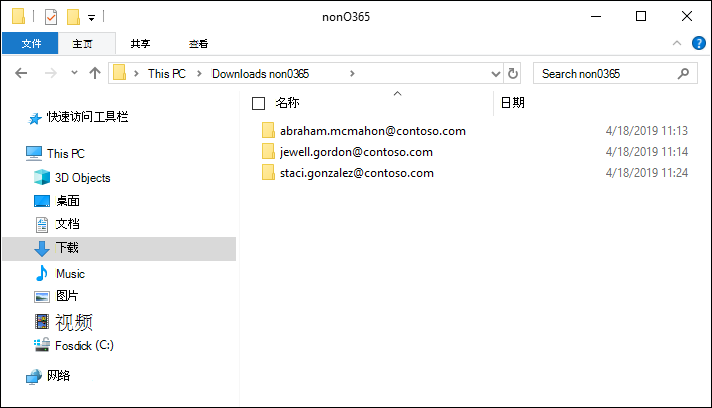

# 将非 Microsoft 365 数据加载到审阅集

并非所有需要在文档中分析Advanced eDiscovery文档都位于Microsoft 365。 使用高级电子数据展示中的非 Microsoft 365 数据导入功能，可以将不在 Microsoft 365 中的文档上传到审阅集。 本文演示如何将非文档Microsoft 365文档Advanced eDiscovery进行分析。

## 上载非内容Office 365要求

使用本文Microsoft 365上载非网站功能需要具备以下各项：

- 必须为要关联非托管Microsoft 365的所有保管人分配适当的许可证。 有关详细信息，请参阅开始[Advanced eDiscovery。](get-started-with-advanced-ediscovery.md#step-1-verify-and-assign-appropriate-licenses)

- 现有Advanced eDiscovery案例。

- 必须先将保管人添加到案例，然后才能上载非托管数据并将其Microsoft 365关联。

- 非 Microsoft 365 数据必须是高级电子数据展示支持的文件类型。 有关详细信息，请参阅 [高级电子数据展示中受支持的文件类型](supported-filetypes-ediscovery20.md)。

- 上传到审阅集的所有文件必须位于文件夹中，每个文件夹与特定保管人关联。 这些文件夹的名称必须使用以下命名格式：*alias@domainname*。 alias@domainname 必须是用户的 Microsoft 365 别名和域。 你可以收集根文件夹中alias@domainname文件夹。 根文件夹只能包含alias@domainname文件夹。 根文件夹中的松散文件不受支持。

   要上载的非Microsoft 365文件夹结构与以下示例类似：

   - c:\nonO365\abraham.mcmahon@contoso.com
   - c:\nonO365\jewell.gordon@contoso.com
   - c:\nonO365\staci.gonzalez@contoso.com

   其中 abraham.mcmahon@contoso.com、jewell.gordon@contoso.com 和 staci.gonzalez@contoso.com 是情况下保管人 SMTP 地址。

   

- 分配给电子数据展示管理员角色组的帐户 (添加为电子数据展示管理员) 。

- AzCopy v8.1 工具安装在有权访问非内容文件夹Microsoft 365的计算机上。 若要安装 AzCopy，请参阅 Windows 上的[使用 AzCopy v8.1 传输Windows。](/previous-versions/azure/storage/storage-use-azcopy) 请务必在默认位置安装 AzCopy，即 **%ProgramFiles (x86) %\Microsoft SDKs\Azure\AzCopy**。 必须使用 AzCopy v8.1。 AzCopy 的其他版本在加载非 Microsoft 365 数据时可能Advanced eDiscovery。

## Upload非Microsoft 365内容放入Advanced eDiscovery

1. 作为电子数据展示管理员或电子数据展示管理员，Advanced eDiscovery，然后转到非Microsoft 365数据将上载到的情况。  

2. 单击 **"审阅** 集"，然后选择要将数据上载到的非Microsoft 365审阅集。  如果没有审阅集，可以创建一个审阅集。 
 
3. 打开审阅集，方法是单击该审阅集或选择该审阅集，然后单击"**打开审阅集"。**

4. 在审阅集内，单击"操作"选项 (后向下箭头中的"管理审阅集) ，然后单击"非Office 365 **数据"** 选项。

5. 单击“**上传文件**”以启动数据导入向导。

   

   向导中的第一步是为上传文件准备安全的由 Microsoft 提供的 Azure 存储位置。  准备完成后，“**下一步：上传文件**”按钮转为活动状态。

   
 
5. 单击“**下一步：上传文件**”。

6. 在 **"Upload文件**"页上，执行以下操作：

   

   a. 在 **"文件的位置** 的路径"框中，验证或键入要上载的非文件存储Microsoft 365文件夹的位置。 例如，对于"开始之前"部分中显示的示例文件的位置，键入 **%USERPROFILE\Downloads\nonO365**。 提供正确的位置可确保正确更新路径下的框中显示的 AzCopy 命令。

   b. 单击 **"复制到剪贴板** "以复制显示在框中的命令。

7. 启动Windows命令提示符，粘贴在上一步中复制的命令，然后按 **Enter** 启动 AzCopy 命令。  启动命令后，非Microsoft 365文件将上载到步骤 4 Azure 存储准备的位置。

   

   > [!NOTE]
   > 如前所述，必须使用 AzCopy v8.1 成功使用"文件"页上Upload **命令**。 如果提供的 AzCopy 命令失败，请参阅疑难解答[AzCopy in Advanced eDiscovery](troubleshooting-azcopy.md)。

8. 返回到"文件Microsoft 365 合规中心，然后单击向导中的"下一步 **： 处理** 文件"。  此操作将启动对已上传到 Azure 存储位置的非 Microsoft 365 文件的处理、文本提取和编制索引。  

9. 通过查看名为将非文件数据添加到审阅集的作业，跟踪"进程文件"页或"作业"**选项卡Microsoft 365处理文件的进度**。  作业完成后，新文件将在审阅集内可用。

   

10. 处理完成后，可以关闭该向导。
