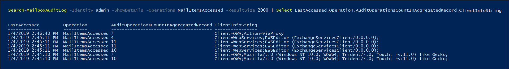

# <a name="use-advanced-audit-to-investigate-compromised-accounts"></a>使用“高级审核”来调查被盗用的帐户

被盗用的用户账户（也称为“*账户接管*”）是攻击的一种类型，攻击者获取用户账户的访问权限并作为用户操作。 这些类型的攻击造成的损害有时比攻击者所需要的更大。 调查被盗电子邮件账户时，必须假设泄露的邮件数据要比通过跟踪攻击者实际存在所指示的数量要多。 根据电子邮件中的数据类型，需要假定敏感信息被盗用或面临着监管罚款，除非能够证明敏感信息未泄露。 例如，如果有证据表明患者健康信息（PHI）被公开，受 HIPAA 监管的组织面临巨额罚款。 在这些情况中，攻击者很可能对患者健康信息感兴趣，但是组织仍然必须汇报数据泄漏，除非他们提供相应证明。

为帮助调查被盗的电子邮件账户，我们现在通过 *MailItemsAccessed* 邮箱审核活动审核由邮件协议和客户端进行的邮件数据存取。 此新审核的操作将可帮助调查人员更好地了解电子邮件数据泄露，并有助于确定可能被盗取指定邮件项的泄漏范围。 使用此新审核活动的目标是司法见证可防御性，以有助于断定特定的邮件数据未被盗取。 如果攻击者获得了对特定邮件的访问权限，Exchange Online 将审核该事件，即使没有迹象表明该邮件项已被阅读。

## <a name="the-mailitemsaccessed-mailbox-auditing-action"></a>MailItemsAccessed 邮箱审核操作

新的 MailItemsAccessed 操作是新的 [高级审核](advanced-audit.md) 功能的一部分。它是 [Exchange 邮箱审核](/office365/securitycompliance/enable-mailbox-auditing#mailbox-auditing-actions) 的一部分，并在默认情况下为分配有 Office 365 或 Microsoft 365 E5 许可证的用户，或具有 Microsoft 365 E5 合规加载项订阅的组织启用。

MailItemsAccessed 邮箱审核操作包含所有邮件协议：POP、IMAP、 MAPI、EWS、Exchange ActiveSync 和 REST。 还包含了两种存取邮件的类型：*同步* 和 *绑定*。

### <a name="auditing-sync-access"></a>审核同步访问权限

仅当邮箱由适用于 Windows 或 Mac 的桌面版 Outlook 客户端存取时，才记录同步操作。 同步操作期间，这些客户端通常从云端下载大型邮件项至本地计算机。 同步操作的审核量非常大。 因此，我们不为同步的每个邮件项目生成审核记录，而是为包含已同步项目的邮件文件夹生成审核事件，并假定已同步文件夹中的 *所有* 邮件项目已泄露。 访问权限类型会记录在审核记录的 OperationProperties 字段中。

参见“[使用 MailItemsAccessed 审核记录进行司法鉴定调查](#use-mailitemsaccessed-audit-records-for-forensic-investigations)”一节的第 2 步了解在审核记录中显示同步访问权限的示例。

### <a name="auditing-bind-access"></a>审核绑定访问权限

绑定操作是对电子邮件所进行的一种单独访问。 对于绑定访问权限，单独邮件的 InternetMessageId 将记录在审核记录中。 MailItemsAccessed 审核操作记录绑定操作并随后聚合至单独的审核记录中。 2分钟间隔内发生的所有绑定操作都聚合在 AuditData 属性内文件夹字段中的一个单独审核记录内。 所访问的每封邮件都由其 InternetMessageId 标识。 聚合在记录中的绑定操作数将在 AuditData 属性的 OperationCount 字段中显示。

参见“[使用 MailItemsAccessed 审核记录进行司法鉴定调查](#use-mailitemsaccessed-audit-records-for-forensic-investigations)”一节的第 4 步了解在审核记录中显示绑定访问权限的示例。

### <a name="throttling-of-mailitemsaccessed-audit-records"></a>MailItemsAccessed 审核记录的限制

如果在不到 24 小时内生成超过 1,000 条 MailItemsAccessed 审核记录，Exchange Online 将停止为 MailItemsAccessed 活动生成审核记录。 如果邮箱被限制，MailItemsAccessed 活动将在邮箱被限制后不记录达 24 小时。 如果邮箱被限制，则在此期间邮箱可能会遭到入侵。 MailItemsAccessed 活动的记录将在 24 小时候恢复。

有关限制的事项，请注意以下几点：

- Exchange Online 中少于 1% 的邮箱被限制
- 邮箱受限时，仅不审核 MailItemsAccessed 活动的审核记录。不影响其他邮箱审核操作。
- 仅限制邮箱进行绑定操作。 同步操作的审核记录不受限制。
- 如果邮箱被限制，可以假设存在未被记录至审核日志中的 MailItemsAccessed 活动。

参见“[使用 MailItemsAccessed 审核记录进行司法鉴定调查](#use-mailitemsaccessed-audit-records-for-forensic-investigations)”一节的第 1 步了解在审核记录中显示 IsThrottled 属性的示例。

## <a name="use-mailitemsaccessed-audit-records-for-forensic-investigations"></a>使用 MailItemsAccessed 审核记录进行司法鉴定调查

Mailbox 审核生成用于存取电子邮件的审核记录，因此可以自信保证电子邮件未被泄露。 因此，在无法确定某些数据已被访问的情况中，我们假设其记录了所有邮件存取活动。

使用 MailItemsAccessed 审核记录进行司法鉴定目的，通常在解决了数据泄露且攻击者被逐出后进行。 若要开始调查，应确定被盗用的一组邮箱并确定攻击者存取组织中邮箱的时间范围。 然后可在 [Exchange Online PowerShell](/powershell/exchange/connect-to-exchange-online-powershell) 中使用 **Search-UnifiedAuditLog** 或 **Search-MailboxAuditLog** cmdlet 搜索与数据泄漏对应的审核记录。

可运行下列之一命令来搜索 MailItemsAccessed 审核记录：

**统一审核日志**：

```powershell
Search-UnifiedAuditLog -StartDate 01/06/2020 -EndDate 01/20/2020 -UserIds <user1,user2> -Operations MailItemsAccessed -ResultSize 1000
```

**邮箱审核日志**：

```powershell
Search-MailboxAuditLog -Identity <user> -StartDate 01/06/2020 -EndDate 01/20/2020 -Operations MailItemsAccessed -ResultSize 1000 -ShowDetails
```

> [!TIP]
> 这两个 cmdlet 的一个主要区别是，可使用 **Search-UnifiedAuditLog** cmdlet 来搜索由一个或更多用户所执行活动的审核记录。 这是因为 *UserIds* 是多值参数。 **Search-MailboxAuditLog** cmdlet 搜索单个用户的邮箱审核日志。

下面是使用 MailItemsAccessed 审核记录来调查被盗用用户的攻击步骤。 各步骤显示 **Search-UnifiedAuditLog** 或 **Search-MailboxAuditLog** cmdlets 的命令语法。

1. 检查邮箱是否被限制。 如果是这样，则意味着部分邮箱审核记录将不被记录。 如果任何审核记录的 "IsThrottled" 为 "True"，则假定 24 小时的期限后生成记录，任何对邮箱的存取未被审核，且所有邮件数据已被盗取。

   如果要搜索邮箱被限制的 MailItemsAccessed 记录，运行下列命令:

   **统一审核日志**：

   ```powershell
   Search-UnifiedAuditLog -StartDate 01/06/2020 -EndDate 01/20/2020 -UserIds <user1,user2> -Operations MailItemsAccessed -ResultSize 1000 | Where {$_.AuditData -like '*"IsThrottled","Value":"True"*'} | FL
   ```

   **邮箱审核日志**：

   ```powershell
   Search-MailboxAuditLog -StartDate 01/06/2020 -EndDate 01/20/2020 -Identity <user> -Operations MailItemsAccessed -ResultSize 10000 -ShowDetails | Where {$_.OperationProperties -like "*IsThrottled:True*"} | FL
   ```

2. 检查同步活动。 如果攻击者使用电子邮件客户端下载邮箱中的邮件，他们可将计算机与互联网断开并本地存取邮件，而不与服务器交互。 在这种情况下，邮箱审核将无法审核这些活动。

   若要搜索被同步操作所存取邮件项的 MailItemsAccessed 记录，运行下列命令：

   **统一审核日志**：

   ```powershell
   Search-UnifiedAuditLog -StartDate 01/06/2020 -EndDate 02/20/2020 -UserIds <user1,user2> -Operations MailItemsAccessed -ResultSize 1000 | Where {$_.AuditData -like '*"MailAccessType","Value":"Sync"*'} | FL
   ```

   **邮箱审核日志**：

   ```powershell
   Search-MailboxAuditLog -StartDate 01/06/2020 -EndDate 01/20/2020 -Identity <user> -Operations MailItemsAccessed -ResultSize 10000 -ShowDetails | Where {$_.OperationProperties -like "*MailAccessType:Sync*"} | FL
   ```

3. 检查同步活动，以在相同的上下文中发生的任何活动作为攻击者存取邮箱所使用的活动。 上下文通过用于存取邮箱和邮件协议的客户端计算机 IP 地址识别和区分。 有关详细信息，请参阅“[识别不同审核记录的存取上下文](#identifying-the-access-contexts-of-different-audit-records)”一节。

   使用下面列出的属性进行调查。 这些属性位于 AuditData 或 OperationProperties 属性中。 如果发生在相同上下文中的任何同步作为攻击者行为，则假定攻击者已同步所有邮件项至其客户端，即整个邮箱可能已被盗取。

   <br>

   ****

   |属性|描述|
   |---|---|
   |ClientInfoString|描述协议、客户端（包含版本）|
   |ClientIPAddress|客户端计算机的 IP 地址。|
   |SessionId|会话 ID 有助于区分攻击者活动与同一账户的日常账户活动（适用于遭到入侵的帐户）|
   |UserID|阅读邮件用户的 UPN。|
   |

4. 检查绑定活动。执行步骤 2 和步骤 3 之后，可以确信攻击者对电子邮件的所有其他访问都将捕获到 MailItemsAccessed 审核记录中，该记录的 MailAccessType 属性的值为“Bind”。

   若要搜索通过绑定操作访问邮件项目的 MailItemsAccessed 记录，请运行以下命令。

   **统一审核日志**：

   ```powershell
   Search-UnifiedAuditLog -StartDate 01/06/2020 -EndDate 01/20/2020 -UserIds <user1,user2> -Operations MailItemsAccessed -ResultSize 1000 | Where {$_.AuditData -like '*"MailAccessType","Value":"Bind"*'} | FL
   ```

   **邮箱审核日志**：

   ```powershell
   Search-MailboxAuditLog -StartDate 01/06/2020 -EndDate 01/20/2020 -Identity <user> -Operations MailItemsAccessed -ResultSize 10000 -ShowDetails | Where {$_.OperationProperties -like "*MailAccessType:Bind*"} | FL
   ```

   所访问的电子邮件由其 Internet 邮件 ID 标识。你还可以检查是否有任何审核记录具有与其他攻击者活动的相同上下文。有关详细信息，请参阅 [识别不同审核记录的访问上下文](#identifying-the-access-contexts-of-different-audit-records) 部分。

   可以使用审核数据采用两种方式进行绑定操作：

   - 访问或收集攻击者访问的所有电子邮件，方法是使用 InternetMessageId 查找这些邮件，然后检查这些邮件是否包含敏感信息。
   - 使用 InternetMessageId 搜索与一组可能敏感的电子邮件相关的审核记录。 如果你只关心几条消息，这将非常有用。

## <a name="filtering-of-duplicate-audit-records"></a>筛选重复的审核记录

一小时内所发生的相同绑定操作的重复审核记录将被依次筛选出，以清除审核噪音。 同步操作还以一小时的间隔进行筛选。 如果对于同一 InternetMessageId，下表中所述的任何属性不同，则此重复数据删除过程会出现异常。 如果这些属性之一与重复操作中的不同，生成新的审核记录。 此流程在下一节中详细描述。

<br>

****

|属性|描述|
|---|---|
|ClientIPAddress|客户端计算机的 IP 地址。|
|ClientInfoString|用于存取邮箱的客户端协议、客户端。|
|ParentFolder|所访问的邮件项的完整文件夹路径。|
|Logon_type|执行操作用户的登录类型。 登录类型（及其相应的 Enum 值）为所有者(0)、管理员 (1)或代理人(2)。|
|MailAccessType|指定访问是绑定还是同步操作。|
|MailboxUPN|被读取邮件所在邮箱的 UPN。|
|User|阅读邮件用户的 UPN。|
|SessionId|会话 id 有助于同一邮箱中的攻击者行为和日常用户行为（如果是账户被盗用）。有关会话的详细信息，参见“[在 Exchange Online 中的会话内根据上下文考虑攻击者的行为](https://techcommunity.microsoft.com/t5/exchange-team-blog/contextualizing-attacker-activity-within-sessions-in-exchange/ba-p/608801)”。|
|

## <a name="identifying-the-access-contexts-of-different-audit-records"></a>识别不同审核记录的存取上下文

通常攻击者在邮箱所有者访问邮箱的同时访问邮箱。 为区分攻击者和邮箱所有者的访问，提供了设定访问上下文的审核日志属性。 如前所述，如果这些属性的值不同时，即使活动在聚合间隔内发生，将生成单独的审核记录。 在下面示例中，有三个不同的审核记录。 每一个通过会话 ID 和 ClientIPAddress 属性进行区分。 另外还识别被存取的邮件。

<br>

****

|审核记录 1|审核记录 2|审核记录 3|
|---|---|---|
|ClientIPAddress **1**<br/>SessionId **2**|ClientIPAddress **2**<br/>SessionId **2**|ClientIPAddress **1**<br/>SessionId **3**|
|InternetMessageId **A**<br/>InternetMessageId **D**<br/>InternetMessageId **E**<br/>InternetMessageId **F**<br/>|InternetMessageId **A**<br/>InternetMessageId **C**|InternetMessageId **B**|
|

如果 [上一节](#filtering-of-duplicate-audit-records) 中的表中列出的任何属性不相同，则会生成单独的审核记录来跟踪新的上下文。 根据活动发生的背景，访问将被排序成单独的审核记录。

例如，在下面的屏幕截图中显示的审计记录中，尽管我们同时访问来自 EWSEditor 和 OWA 的邮件，但根据访问发生的上下文，在不同的审核记录中整理访问活动。在这种情况中，上下文通过 ClientInfoString 属性的不同值确定。



下面是上一屏幕截图中所显示的命令语法：

```powershell
Search-MailboxAuditLog -Identity admin -ShowDetails -Operations MailItemsAccessed -ResultSize 2000 | Select LastAccessed,Operation,AuditOperationsCountInAggregatedRecord,ClientInfoString
```
