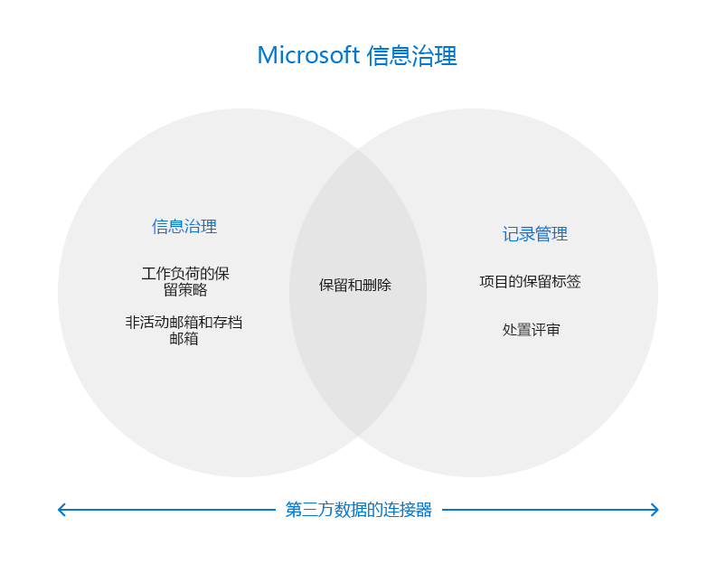

# Microsoft 365 中的 Microsoft 信息治理

>*[Microsoft 365 安全性与合规性许可指南](/office365/servicedescriptions/microsoft-365-service-descriptions/microsoft-365-tenantlevel-services-licensing-guidance/microsoft-365-security-compliance-licensing-guidance)。*

使用 Microsoft 信息管理（有时缩写为 MIG）功能来管理数据，以满足合规性或监管要求。

从[许可角度](#licensing-requirements)出发，信息管理、记录管理、数据连接器之间可能存在相当多的重叠。 所有三个区域都支持保留和删除 Microsoft 365 中的数据。 连接器由信息管理和记录管理以外的合规性解决方案使用。 

使用下图帮助你确定这三种不同解决方案的主要可配置组件，每个解决方案在合规中心都有自己的节点：

需要保护数据？ 请参阅 [Microsoft 365 中的 Microsoft 信息保护](information-protection.md)。

## 信息管理政策

保留所需要的东西，删除不需要的东西：
 
|功能|它能解决什么问题？|开始行动|
|:------|:------------|:--------------------|:-----------------------------|
|[Microsoft 365 工作负载的恢复策略，以及例外的保留标签](retention.md) | 使用电子邮件、文档、Teams 和 Yammer 邮件的策略管理保留或删除内容 | [创建和配置保留策略](create-retention-policies.md)    [为保留策略的例外创建保留标签](create-retention-labels-information-governance.md)|
|[存档邮箱](archive-mailboxes.md)| 为用户提供额外的邮箱存储 | [启用存档邮箱](enable-archive-mailboxes.md) |
|[非活动邮箱](inactive-mailboxes-in-office-365.md)| 在员工离开组织后保留邮箱内容，以便管理员、合规专员和记录经理仍可访问此内容 | [创建和管理非活动邮箱](create-and-manage-inactive-mailboxes.md)|
|[PST 文件的导入服务](importing-pst-files-to-office-365.md)| 将 PST 文件批量导入到 Exchange Online 邮箱，以保留和搜索电子邮件信息，以满足合规性或法规要求 | [使用网络上传将组织的 PST 文件导入到 Microsoft 365](use-network-upload-to-import-pst-files.md)|

## 记录管理

针对法律、业务或法规义务的高价值项目的生命周期管理：

|功能|它能解决什么问题？|开始行动|
|:------|:------------|---------------------|:----------------------------|
|[记录管理](records-management.md)| 用于电子邮件和文档的单个解决方案，其中包含灵活的保留和删除计划和要求，以在需要时使用记录声明和可保护的处置来支持内容的完整生命周期 |[开始进行记录管理](get-started-with-records-management.md) |

## 第三方数据的连接器

将合规性工具扩展到从社交媒体平台、即时消息平台和文档协作平台导入和存档的第三方数据：

|功能|它能解决什么问题？|开始行动|
|:------|:------------|:--------------------|:-----------------------------|
|[数据连接器](archiving-third-party-data.md)| 从社交媒体平台、即时通讯平台、文档协作平台导入、归档、应用第三方数据的合规性解决方案。| [第三方连接器](archiving-third-party-data.md#third-party-data-connectors)|

## 许可要求

Microsoft 信息治理的许可要求取决于使用的方案和功能，而不是为本页列出的每个功能设置许可要求。 若要了解许可要求和选项，请参阅 [Microsoft 365 许可文档](/office365/servicedescriptions/microsoft-365-service-descriptions/microsoft-365-tenantlevel-services-licensing-guidance/microsoft-365-security-compliance-licensing-guidance)中的以下部分： 
- [信息治理](/office365/servicedescriptions/microsoft-365-service-descriptions/microsoft-365-tenantlevel-services-licensing-guidance/microsoft-365-security-compliance-licensing-guidance#information-governance) 
- [记录管理](/office365/servicedescriptions/microsoft-365-service-descriptions/microsoft-365-tenantlevel-services-licensing-guidance/microsoft-365-security-compliance-licensing-guidance#records-management) 
- [数据连接器](/office365/servicedescriptions/microsoft-365-service-descriptions/microsoft-365-tenantlevel-services-licensing-guidance/microsoft-365-security-compliance-licensing-guidance#data-connectors)

文档说明中将包含任何其他许可要求。 例如，特定于管理邮箱的许可可能需要来自 Exchange Online 的许可证。

