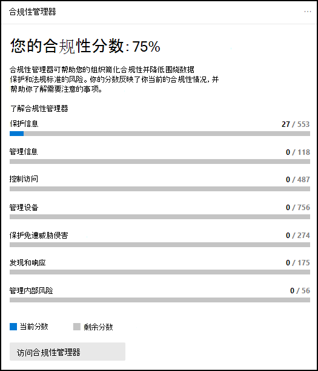
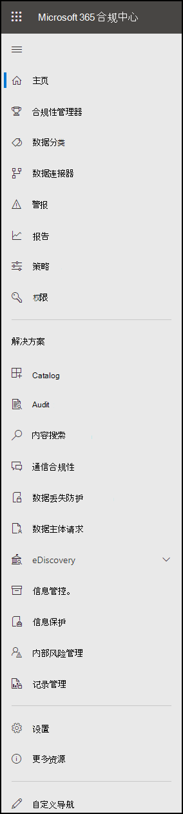

# Microsoft 365 合规中心

如果你对组织的合规性状态感兴趣，你将喜欢<a href="https://go.microsoft.com/fwlink/p/?linkid=2077149" target="_blank">Microsoft 365 合规中心。</a> Microsoft 365 合规中心提供轻松访问管理组织合规性需求所需的数据和工具。

阅读本文，了解Microsoft 365 合规中心、如何[获取](#how-do-i-get-the-compliance-center)、常见问题以及接下来的[步骤](#next-steps)。 

## 欢迎使用Microsoft 365合规性

第一次Microsoft 365 合规中心时，你收到以下欢迎消息：

欢迎横幅为你提供了一些有关入门的指针、接下来的步骤以及一个邀请，让你向我们提供反馈。

## “卡”部分

首次访问 Microsoft 365 合规中心 时，主页上的卡片部分会一目了然地显示组织在数据合规性方面的情况、可供组织使用的解决方案以及任何活动警报的摘要。

在这里，你可以:

- 查看 **Microsoft 合规性管理器** 卡片，这可引导你找到 [合规性管理器](compliance-manager.md) 解决方案。 合规性管理器有助于简化合规性管理方式。 它计算基于风险的分数，用于衡量完成建议操作的进度，以帮助降低数据保护和监管标准的风险。 它还提供工作流功能和内置控件映射，以帮助您有效地执行改进操作。

    

- 查看新的 **解决方案目录** 卡，该卡片链接到可用于管理端到端 合规性方案的集成解决方案集合。 解决方案的功能和工具可能包括策略、警报、报表等的组合。

    

- 查看 **活动警报** 卡片，其中包含最活跃警报的摘要，并包含一 个链接，可在其中查看更详细的信息，如严重性、状态、类别等。

    

您还可以使用"添加卡片"功能添加其他卡片，如一张显示组织的云应用合规性卡，另一张显示共享文件用户的数据，以及指向[云应用安全](/cloud-app-security/)或其他工具的链接，可在其中浏览数据。

## 轻松导航到更多合规性特性和功能

除了主页上的卡片中的链接外，你还会看到屏幕左侧的导航窗格，它让你可以轻松访问警报、报告、策略、合规性解决方案等。    若要添加或删除自定义导航窗格的选项，请使用导航窗格上的 **自定义** 导航控件。 这将打开 **"自定义导航窗格** 设置"，以便可以配置导航窗格中显示哪些项目。

 

****

|导航|注释|
|---|---|
||选择 **"** 主页"返回到Microsoft 365 合规中心主页。 
 访问 **合规性管理器** ，检查合规性分数并开始 [管理组织的](compliance-manager.md) 合规性。 
 选择" **数据分类** "部分以访问 [可训练分类器](classifier-learn-about.md)、 [敏感信息类型实体定义](sensitive-information-type-entity-definitions.md)、内容和 [活动](data-classification-activity-explorer.md) 资源管理器。 
 选择 **"数据连接器**["以配置连接器](archiving-third-party-data.md)以导入和存档 Microsoft 365订阅。 
 转到 **警报以查看** 和 [解决警报](alert-policies.md) 
访问 **报告** 以查看有关标签使用情况 [和保留、DLP](sensitivity-labels.md)[策略匹配](view-the-dlp-reports.md)和覆盖、共享文件、使用的第三 方应用等的数据。 
 转到 **"策略** "以设置用于管理数据、管理设备和接收 [警报的策略](../security/office-365-security/alerts.md)。 您还可以访问 [DLP](dlp-learn-about-dlp.md) 和 [保留](retention.md) 策略。 
 选择 **"权限**"以管理组织中有权访问Microsoft 365 合规中心查看内容和完成任务。 
 使用"解决方案 **"部分** 的链接访问组织的合规性解决方案。 包括： 
 [目录](microsoft-365-solution-catalog.md)   发现、了解并开始使用组织可用的智能合规性和风险管理解决方案。 
 [审核](search-the-audit-log-in-security-and-compliance.md)   使用审核日志调查常见的支持和合规性问题。 
 [内容搜索](search-for-content.md)   使用内容搜索快速查找 Exchange 邮箱中的电子邮件、SharePoint 网站和 OneDrive 位置中的文档，以及 Microsoft Teams 和 Skype for Business 中的即时消息对话。 
 [通信合规性](communication-compliance.md)   通过自动捕获不恰当的邮件、调查可能的策略违反情况并采取措施进行修正，最大程度地降低通信风险。 
 [了解数据丢失防护](dlp-learn-about-dlp.md)   检测在整个组织、云和设备上使用和共享敏感内容，并帮助防止意外数据丢失。 
 [数据主体请求](/compliance/regulatory/gdpr-manage-gdpr-data-subject-requests-with-the-dsr-case-tool)   查找和导出用户的个人数据，以帮助你响应 GDPR 一般数据保护条例 (数据主体) 。 
 [电子数据展示](overview-ediscovery-20.md)   展开此部分以使用核心Advanced eDiscovery，以保留、收集、审阅、分析和导出对组织内部和外部调查做出响应的内容。 
 [信息治理](manage-information-governance.md)   使用导入、存储和分类业务关键数据的功能管理内容生命周期，以便保留所需的内容并删除不需要的内容。 
 [信息保护](information-protection.md)   在整个组织生命周期内发现、分类和保护敏感内容和业务关键内容。 
 [内部风险管理](insider-risk-management.md)   检测整个组织中存在风险的活动，帮助你快速识别、调查和应对内部风险和威胁。 
 [记录管理](records-management.md)   自动执行并简化组织中法规、法律和业务关键记录的保留计划。|
|

## 如何获取合规中心？

- 如果你还没有新的Microsoft 365 合规中心，你很快就会拥有它。 现在Microsoft 365 合规中心 SKU 客户Microsoft 365该版本。
- 若要访问Microsoft 365 合规中心，全局管理员、合规性管理员或合规性数据管理员转到 [https://compliance.microsoft.com](https://compliance.microsoft.com) 并登录。

## 常见问题解答

**为什么我还没有看到Microsoft 365 合规中心？**

首先，请确保你拥有相应的许可证和权限。 然后，从 Microsoft 365 合规中心<a href="https://go.microsoft.com/fwlink/p/?linkid=2077149" target="_blank">登录</a>。 如果你尚未看到新的合规中心，你很快就会拥有它。

## 后续步骤

- **访问 Microsoft 合规性管理器** 以查看合规性分数并开始管理组织的合规性。 若要了解更多信息，请参阅 [合规性管理器](compliance-manager.md)。

- **配置内部风险管理策略以帮助** 最大程度地降低内部风险，并使您能够检测、调查和操作组织中存在风险的活动。 请参阅 [预览体验成员风险管理](insider-risk-management.md)。

- **查看组织的数据丢失防护策略** ，并在必要时进行必要的更改。 若要了解更多信息，请参阅 [了解数据丢失防护](dlp-learn-about-dlp.md)。

- **熟悉并设置Microsoft Cloud App Security。** 请参阅[快速入门：开始Microsoft Cloud App Security。](/cloud-app-security/getting-started-with-cloud-app-security)

- **了解并创建通信合规性策略** ，以快速识别和修正公司行为准则违反策略的行为。 请参阅 Microsoft 365 中的[通信合规性](communication-compliance.md)。

- **经常Microsoft 365 合规中心** 访问你的电子邮件，并确保查看出现的任何警报或潜在风险。 转到 [https://compliance.microsoft.com](https://compliance.microsoft.com) 并登录。