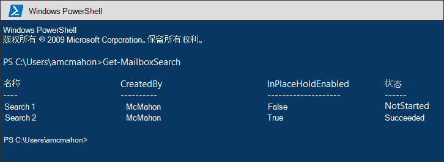
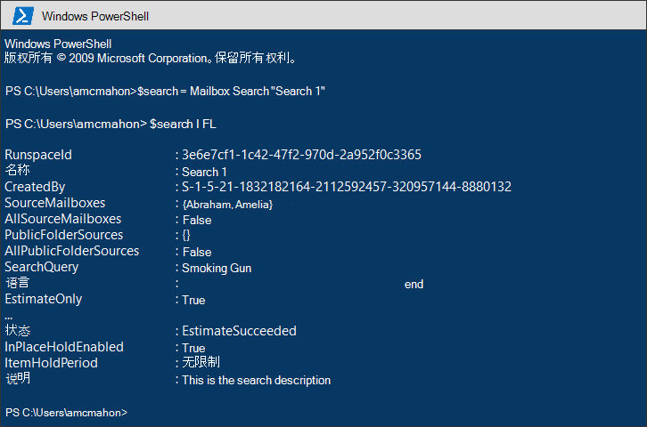
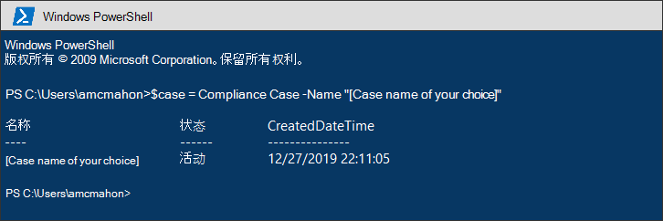
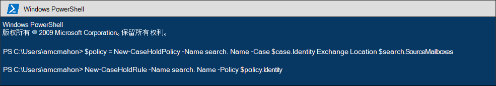
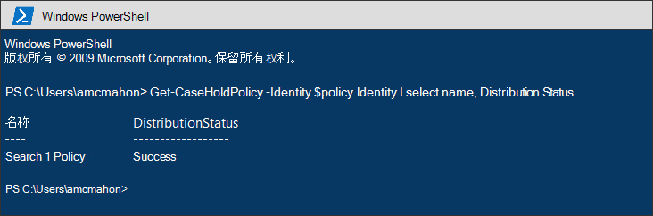
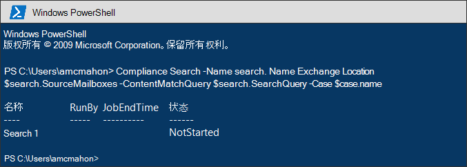
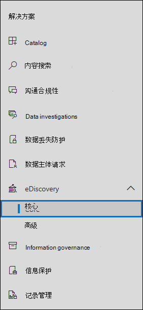

# <a name="migrate-legacy-ediscovery-searches-and-holds-to-the-microsoft-365-compliance-center"></a>将旧版电子数据展示搜索和保留迁移到Microsoft 365 合规中心

Microsoft 365 合规中心 提供了针对电子数据展示使用情况的改进体验，包括：更高的可靠性、更好的性能以及针对电子数据展示工作流定制的许多功能，包括按事项组织内容的情况、审阅集以审阅内容和分析以帮助剔除数据进行审阅，例如近重复分组、电子邮件线程、主题分析和预测编码。

为了帮助客户利用新增和改进的功能，本文提供了有关如何将 In-Place 电子数据展示搜索和保留从<a href="https://go.microsoft.com/fwlink/p/?linkid=2059104" target="_blank">Exchange</a>管理中心迁移到 Microsoft 365 合规中心 的基本指南。

> [!NOTE]
> 由于存在许多不同的方案，因此本文提供了一些常规指南，用于将搜索和保留转换到 Microsoft 365 合规中心 中的核心电子数据展示案例。 使用电子数据展示事例并非始终必需，但是它们通过分配权限来控制谁有权访问组织中电子数据展示事例添加了额外的安全层。

## <a name="before-you-begin"></a>准备工作

- 您必须是电子数据展示管理员角色组的成员，Microsoft 365 合规中心运行本文中所述的 PowerShell 命令。 还必须是发现管理管理中心中发现管理角色<a href="https://go.microsoft.com/fwlink/p/?linkid=2059104" target="_blank">Exchange的成员</a>。

- 本文提供有关如何创建电子数据展示保留的指南。 保留策略将应用于通过异步进程的邮箱。 创建电子数据展示保留时，必须同时创建 CaseHoldPolicy 和 CaseHoldRule，否则将不会创建保留，并且不会将内容位置置于保留状态。

## <a name="step-1-connect-to-exchange-online-powershell-and-security--compliance-center-powershell"></a>步骤 1：连接 Exchange Online PowerShell 和安全&合规中心 PowerShell

第一步是连接到 Exchange Online PowerShell 和安全&中心 PowerShell。 你可以复制以下脚本，将其粘贴到 PowerShell 窗口中，然后运行它。 系统将提示您输入要连接到的组织凭据。 

```powershell
$UserCredential = Get-Credential
$sccSession = New-PSSession -ConfigurationName Microsoft.Exchange -ConnectionUri https://ps.compliance.protection.outlook.com/powershell-liveid -Credential $UserCredential -Authentication Basic -AllowRedirection
Import-PSSession $sccSession -DisableNameChecking
$exoSession = New-PSSession -ConfigurationName Microsoft.Exchange -ConnectionUri https://ps.outlook.com/powershell-liveid/ -Credential $UserCredential -Authentication Basic -AllowRedirection
Import-PSSession $exoSession -AllowClobber -DisableNameChecking
```

您需要在此 PowerShell 会话中运行以下步骤中的命令。

## <a name="step-2-get-a-list-of-in-place-ediscovery-searches-by-using-get-mailboxsearch"></a>步骤 2：使用 In-Place 获取电子数据展示搜索Get-MailboxSearch

通过身份验证后，可以通过运行 **Get-MailboxSearch** cmdlet 获取In-Place电子数据展示搜索的列表。 将以下命令复制并粘贴到 PowerShell 中，然后运行它。 将列出搜索列表及其名称和任何保留In-Place状态。

```powershell
Get-MailboxSearch
```

cmdlet 输出将类似于以下内容：



## <a name="step-3-get-information-about-the-in-place-ediscovery-searches-and-in-place-holds-you-want-to-migrate"></a>步骤 3：获取有关要In-Place电子数据展示搜索In-Place保留的信息

同样，您将使用 **Get-MailboxSearch** cmdlet，但这次是获取搜索的属性。 可以将这些属性存储在变量中，供以后使用。 以下示例将 **Get-MailboxSearch** cmdlet 的结果存储在变量中，然后显示搜索的属性。

```powershell
$search = Get-MailboxSearch -Identity "Search 1"
```

```powershell
$search | FL
```

这两个命令的输出将类似于以下内容：



> [!NOTE]
> The duration of the In-Place Hold in this example is unlimited (*ItemHoldPeriod： Unlimited*) . 这通常适用于电子数据展示和法律调查方案。 如果保留期的值不同于无限期的值，则很可能是因为保留用于保留内容。 建议使用 [New-RetentionCompliancePolicy](/powershell/module/exchange/new-retentioncompliancepolicy) 和 [New-RetentionComplianceRule](/powershell/module/exchange/new-retentioncompliancerule) 保留内容，而不是将安全 & 合规中心 PowerShell 中的电子数据展示 cmdlet 用于保留方案。 使用这些 cmdlet 的结果类似于使用 **New-CaseHoldPolicy** 和 **New-CaseHoldRule，** 但您可以指定保留期和保留操作，例如，在保留期到期后删除内容。 此外，使用保留 cmdlet 不需要您将保留保留与电子数据展示案例关联。

## <a name="step-4-create-a-case-in-the-microsoft-365-compliance-center"></a>步骤 4：在合规中心Microsoft 365案例

若要创建电子数据展示保留，您必须创建一个电子数据展示案例以将保留与关联。 以下示例使用你选择的名称创建电子数据展示案例。 我们将新案例的属性存储在变量中，供以后使用。 您可以在创建案例后运行 `$case | FL` 命令来查看这些属性。

```powershell
$case = New-ComplianceCase -Name "[Case name of your choice]"
```


## <a name="step-5-create-the-ediscovery-hold"></a>步骤 5：创建电子数据展示保留

创建案例后，可以创建保留并将其与在上一步骤中创建的案例关联。 必须记住，必须同时创建案例保留策略和案例保留规则。 如果在创建案例保留策略后未创建案例保留规则，将不会创建电子数据展示保留，并且不会将任何内容置于保留状态。

运行以下命令以重新创建要迁移的电子数据展示保留。 这些示例使用步骤 3 In-Place保留中的属性。 第一个命令创建一个新的案例保留策略，将属性保存到变量中。 第二个命令创建相应的案例保留规则。

```powershell
$policy = New-CaseHoldPolicy -Name $search.Name -Case $case.Identity -ExchangeLocation $search.SourceMailboxes
```

```powershell
New-CaseHoldRule -Name $search.Name -Policy $policy.Identity
```



## <a name="step-6-verify-the-ediscovery-hold"></a>步骤 6：验证电子数据展示保留

若要确保创建保留时没有问题，请务必检查保留分配状态是否成功。 分发意味着保留已应用于上一步 *中 ExchangeLocation* 参数中指定的所有内容位置。 为此，可以运行 **Get-CaseHoldPolicy** cmdlet。 由于保存到变量$policy步骤中创建的属性不会自动更新到变量中，因此您需要重新运行 cmdlet 来验证分发是否成功。 可能需要 5 分钟到 24 小时才能成功分发案例保留策略。

运行以下命令以验证电子数据展示保留已成功分发。

```powershell
Get-CaseHoldPolicy -Identity $policy.Identity | Select name, DistributionStatus
```

*DistributionStatus* 属性的值 **Success** 指示已成功将保留置于内容位置。 如果分发尚未完成，则显示 **Pending** 值。



## <a name="step-7-create-the-search"></a>步骤 7：创建搜索

最后一步是重新创建在步骤 3 中标识的搜索并将其与案例关联。 创建搜索后，可以使用 **Start-ComplianceSearch** cmdlet 运行它，或在以后运行。

```powershell
New-ComplianceSearch -Name $search.Name -ExchangeLocation $search.SourceMailboxes -ContentMatchQuery $search.SearchQuery -Case $case.name
```



## <a name="step-8-verify-the-case-hold-and-search-in-the-microsoft-365-compliance-center"></a>步骤 8：在查询中验证大小写、保留和Microsoft 365 合规中心

若要确保所有内容都正确设置，请转到 上Microsoft 365 合规中心，然后单击"电子数据展示> [https://compliance.microsoft.com](https://compliance.microsoft.com) **核心"。**



在步骤 3 中创建的案例在核心电子 **数据** 展示页面上列出。 打开案例，然后注意你在"保留"选项卡上列出的步骤 4 **中创建的** 保留。您可以选择保留以查看飞出页面上的详细信息，包括应用保留的邮箱数和分发状态。


在步骤 7 中创建的搜索在案例的" **搜索** "选项卡上列出。


如果您迁移In-Place电子数据展示搜索，但不将其与电子数据展示案例关联，它将在"内容搜索"页上Microsoft 365 合规中心。

## <a name="more-information"></a>更多信息

- 有关管理中心In-Place电子数据展示&保留<a href="https://go.microsoft.com/fwlink/p/?linkid=2059104" target="_blank">Exchange，</a>请参阅：
  
  - [就地电子数据展示](/exchange/security-and-compliance/in-place-ediscovery/in-place-ediscovery)

  - [就地保留和诉讼保留](/exchange/security-and-compliance/in-place-and-litigation-holds)

- 有关本文中使用的 PowerShell cmdlet 详细信息，请参阅：

  - [Get-MailboxSearch](/powershell/module/exchange/get-mailboxsearch)
  
  - [New-ComplianceCase](/powershell/module/exchange/new-compliancecase)

  - [New-CaseHoldPolicy](/powershell/module/exchange/new-caseholdpolicy)
  
  - [New-CaseHoldRule](/powershell/module/exchange/new-caseholdrule)

  - [Get-CaseHoldPolicy](/powershell/module/exchange/get-caseholdpolicy)
  
  - [New-ComplianceSearch](/powershell/module/exchange/new-compliancesearch)

  - [Start-ComplianceSearch](/powershell/module/exchange/start-compliancesearch)

- 有关此Microsoft 365 合规中心，请参阅概述[Microsoft 365 合规中心](microsoft-365-compliance-center.md)。