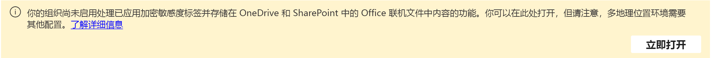

# 默认标签和 Microsoft 信息保护策略

>*[Microsoft 365 安全性与合规性许可指南](/office365/servicedescriptions/microsoft-365-service-descriptions/microsoft-365-tenantlevel-services-licensing-guidance/microsoft-365-security-compliance-licensing-guidance)。*

符合条件的客户可以为Microsoft 信息保护 （MIP） 激活默认标签和策略： 

- 敏感度标签和敏感度标签策略
- 客户端自动标记
- 服务端自动标记
- Teams 和设备的数据丢失防护 （DLP） 策略

这些默认配置可帮助你快速启动并运行Microsoft 365 合规性的 Microsoft 信息保护。 可以按时使用，只需进行一些更改，也可以执行完全自定义，以更好地满足业务要求。 

符合条件的客户包括具有[适用于 Microsoft 365 合规性的免费试用版](compliance-easy-trials.md)的客户和一些已拥有 Microsoft 365 E5 计划的客户：

- **新客户**：如果拥有合规性Microsoft 365 少于 30 天，租户可以激活列出的所有默认配置。 也可以始终对它们禁用、删除或编辑。

- **现有客户**：如果拥有合规性Microsoft 365 超过 30 天，可以激活默认配置（如果尚未配置等效配置）：

    | 默认配置| 等效 |
    |:-----|:-----|
    |敏感度标签和敏感度标签策略 | 已发布的敏感度标签 |
    |客户端自动标记 | 配置为自动应用或向 (应用中) 应用的Office标签|
    |服务端自动标记 | 至少打开一个自动标记策略|
    |适用于 Teams 的 DLP | 至少一个 DLP 策略用于Teams|
    |适用于设备的 DLP | 设备至少有一个 DLP 策略|

## 激活默认标签和策略

若要获取这些预配置的标签和策略，请执行以下操作： 

1. 从 [Microsoft 365 合规中心](https://compliance.microsoft.com/)中，选择 **解决方案** > **信息保护**
    
    如果未立即看到此选项，请首先选择导航窗格中的 **显示全部**。 
    
2. 如果你有资格使用默认标签 Microsoft 信息保护策略，将看到以下信息，可在其中激活默认标签和策略。 例如：
    
    :::image type="content" alt-text="对预配置标签和策略进行 Microsoft 信息保护激活。" source="../media/mip-preconfigured.png" lightbox="../media/mip-preconfigured.png":::
    
    如果未看到此信息与激活选项一起显示，则当前没有资格自动创建敏感度标签和策略。 可以稍后重新检查此状态是否已更改，或者可以使用以下设置信息手动创建相同的标签和策略。

3. 现在为 SharePoint 和 OneDrive 启用敏感度标签。 此步骤是使用 Office 网页版中的敏感度标签以及 SharePoint 和 OneDrive 的自动标记策略的先决条件。
   
    使用信息保护“**概述**”选项卡顶部的以下横幅，然后选择“**立即启用**”。 如果看不到此横幅，则已为租户启用 SharePoint 和 OneDrive 的敏感度标签。
    
    
    
    有关此功能的详细信息，请参阅 [启用 SharePoint 和 OneDrive 中 Office 文件的敏感度标签](sensitivity-labels-sharepoint-onedrive-files.md)。

## 默认敏感度标签

当没有发布的敏感度标签时，我们将创建以下标签：

|标签名称|用户的标签说明|设置|
|-------------------------------|---------------------------|-----------------|
|个人|非业务数据，仅供个人使用。|**范围**：文件、电子邮件   **内容标记**：否  **自动标记**：否   **组设置**：否  **网站设置**：否   **数据库列的自动标记**：无|
|公开|专为公开使用准备和批准的业务数据。|**范围**：文件、电子邮件   **内容标记**：否  **自动标记**：否   **组设置**：否  **网站设置**：否   **数据库列的自动标记**：无|
|常规|不公开使用的业务数据。 但是，可以与外部合作伙伴共享此内容（如果需要）。 示例包括公司内部电话目录、组织结构图、内部标准和大多数内部通信。|**范围**：文件、电子邮件   **内容标记**：否  **自动标记**：否   **组设置**：否  **网站设置**：否   **数据库列的自动标记**：无|
|常规   \ 任何人 (无限制) |不适合公开使用但可在适当时与外部合作伙伴共享的组织数据。 示例是不包括敏感信息或已发布营销材料的客户对话。|**范围**：文件、电子邮件   **内容标记**：否  **自动标记**：否   **组设置**：否  **网站设置**：否   **数据库列的自动标记**：无|
|常规   \ 所有员工 (无限制) |不适合公开使用的组织数据。 如果需要与外部合作伙伴共享此内容，请与其他数据所有者确认可以共享，然后将标签更改为"常规"\"任何人 (不受限制) "。 示例包括公司内部电话目录、组织结构图、内部标准和大多数内部通信。|**范围**：文件、电子邮件   **内容标记**：否  **自动标记**：否   **组设置**：否  **网站设置**：否   **数据库列的自动标记**：无|
|机密|与未经授权的人员共享可能导致业务损失的敏感业务数据。示例包括合同、安全报表、预测摘要和销售帐户数据。|**范围**：文件、电子邮件   **内容标记**：否  **自动标记**：否   **组设置**：否  **网站设置**：否   **数据库列的自动标记**：无|
|机密   \ 任何人 (无限制) |不需要加密的机密数据。 请谨慎使用此选项，并提供合适的业务理由。|已选择此 [ 标签进行客户端自动标记](#client-side-auto-labeling) 和服务器端 [自动标记](#service-side-auto-labeling)。   **范围**：文件、电子邮件   **内容标记**：页脚：分类为机密  **自动标记**：建议用户应用标签   **组设置**：否  **网站设置**：否   **数据库列的自动标记**：无|
|机密   \ 所有员工|需要保护的机密数据，允许所有员工拥有完全权限。 数据所有者可跟踪和撤销内容。|已选择此 [ 标签进行客户端自动标记](#client-side-auto-labeling) 和服务器端 [自动标记](#service-side-auto-labeling)。   **范围**：文件、电子邮件   **加密**：组织中的所有用户和组：共同创作  **内容标记**：页脚：分类为机密  **自动标记**：建议用户应用标签   **组设置**：否  **网站设置**：否   **数据库列的自动标记**：无 |
|机密   \ 受信任人|可以与组织内外的受信任人共享的机密数据。 这些人员还可以根据需要重新共享数据。|**范围**：文件、电子邮件   **加密**：允许用户分配权限：   - 适用于 Outlook 的仅加密  - 在 Word、PowerPoint 和 Excel 中提示用户  **内容标记**：页脚：分类为机密  **自动标记**：否   **组设置**：否  **网站设置**：否   **数据库列的自动标记**：无|
|高度机密|与未经授权的人员共享会导致业务损失的非常敏感业务数据。示例包括员工和客户信息、密码、源代码和预先公布的财务报表。|**范围**：文件、电子邮件   **内容标记**： 水印：高度机密  **自动标记**：否   **组设置**：否  **网站设置**：否   **数据库列的自动标记**：无|
|高度机密   \ 所有员工|高度机密的数据，允许所有员工查看、编辑和答复此内容的权限。 数据所有者可跟踪和撤销内容。|**范围**：文件、电子邮件   **加密**：组织中的所有用户和组：共同创作  **内容标记**：页脚：分类为高度机密  **自动标记**：否   **组设置**：否  **网站设置**：否   **数据库列的自动标记**：无|
|高度机密   \ 特定人员 |需要保护且只有你指定的人员以及你选择的权限级别才能查看的高度机密数据。|**范围**：文件、电子邮件   **加密**：允许用户分配权限：  - 不转发 Outlook  - 在 Word、PowerPoint 和 Excel 中提示用户  **内容标记**：页脚：分类为高度机密  **自动标记**：否   **组设置**：否  **网站设置**：否   **数据库列的自动标记**：无|

> [!NOTE]
> 标签名称和说明自动适用于以下区域设置：美国英语、简体中文和繁体语言、法语、德语、意大利语、日语、韩语、葡萄牙语（巴西）、俄语和西班牙语。
> 
> 如果需要其他语言，可以使用 [PowerShell 指定翻译](create-sensitivity-labels.md#example-configuration-to-configure-a-sensitivity-label-for-different-languages)。

有关这些配置设置以及敏感度标签可以执行哪些操作的详细信息，请参阅 [敏感度标签可以执行哪些操作](sensitivity-labels.md#what-sensitivity-labels-can-do)。

如果需要编辑这些默认敏感度标签，请参阅[创建和配置敏感度标签](create-sensitivity-labels.md#create-and-configure-sensitivity-labels)。

## 默认敏感度标签策略

默认敏感度标签策略使用户可以使用敏感度标签开始标记文档和电子邮件。 它具有以下配置：

- 向租户中的所有用户发布默认标签
- 对于未标记的文档和电子邮件，默认标签为 **常规** \ **所有员工（无限制）**
- 用户必须提供删除标签或降低其分类的理由

有关这些策略设置和其他可用策略设置的信息，请参阅[标签策略可以执行哪些操作](sensitivity-labels.md#what-label-policies-can-do)。

如果需要编辑这些默认策略设置，请参阅 [通过创建标签策略发布敏感度标签](create-sensitivity-labels.md#publish-sensitivity-labels-by-creating-a-label-policy)。

当你在 Windows、macOS、iOS 和 Android 上的 Office 应用中使用这些标签时，用户在刷新浏览器时在四小时内和一小时内看到 Word、Excel 和 PowerPoint web 版 的新标签。 但是，可能需要允许最多 24 小时将更改复制到所有应用和服务。

## 客户端自动标记

默认客户端自动标记配置会自动建议用户在检测到正在处理的文档或电子邮件中的信用卡号时应用敏感度标签。 作为一种推荐，而不是自动应用，此配置是突出显示有关内容的良好第一步，并向用户介绍给他们的文档和电子邮件标记的实践。

客户端自动标记仅适用于 Word、Office、Excel、PowerPoint 和 Outlook 应用程序使用的文档和Outlook。 

默认客户端自动标记具有以下配置： 

- 如果在文档或电子邮件中找到 1-9 个信用卡号实例，建议用户应用敏感度标签 **机密** \ **任何人（不受限制）** 

- 如果在文档或电子邮件中找到 10 个或多个信用卡号实例，建议用户应用敏感度标签 **机密** \ **所有员工** 

> [!NOTE]
> 如果我们检测到你已发布自己的敏感度标签，我们将提示选择你自己的一个标签进行自动标记，然后进行配置。

如果要编辑客户端自动标记配置，请参阅[如何为应用配置 Office 标记](apply-sensitivity-label-automatically.md#how-to-configure-auto-labeling-for-office-apps)。

## 服务端自动标记 

服务器端自动标记可帮助对处于其余位置的敏感文档和传输中的电子邮件进行标记。 默认服务器端自动标记策略，在模拟模式下为存储在所有 SharePoint 或 OneDrive 站点中的文档，以及通过 Exchange Online 发送的所有电子邮件创建策略。 在模拟模式下，在打开策略之前，不会实际标记项目。 模拟模式允许你预览打开策略时标记的项目，因此在将策略部署到租户进行实际标记之前，可以放心地使用标签功能。 

默认服务器端自动标记具有以下配置： 

- 如果在文档中找到 1-9 个信用卡号实例，请将敏感度标签应用 **机密** \ **任何人（不受限制）**

- 如果在文档或电子邮件中找到 10 个或多个信用卡号实例，建议用户应用敏感度标签 **机密** \ **所有员工** 

> [!NOTE]
> 如果我们检测到你已发布自己的敏感度标签，我们将提示为自动标记策略选择自己的一个标签。

模拟完成后，查看结果，如果结果满意，请打开策略。

有关模拟模式的信息，请参阅 [了解模拟模式](apply-sensitivity-label-automatically.md#learn-about-simulation-mode)。

如果要编辑服务器端自动标记策略，请参阅[如何为 SharePoint、OneDrive 和 Exchange 配置自动标记](apply-sensitivity-label-automatically.md#how-to-configure-auto-labeling-policies-for-sharepoint-onedrive-and-exchange)。

## 适用于 Teams 的 DLP

Teams 的默认 DLP 策略检测所有 Teams 聊天和频道消息中是否存在信用卡号。 当检测到此敏感信息时，管理员将收到低严重性警报通知。

此策略不会向用户显示任何策略提示，并且不会阻止任何邮件，但管理员将在这些邮件中共享敏感信息的记录。 如果需要，可以编辑设置以更改此默认配置。

若要查看此策略的结果，请使用 [DLP 活动资源管理器](dlp-learn-about-dlp.md#dlp-activity-explorer)。

如果要编辑 DLP 策略，请参阅[创建、测试和调整 DLP 策略](create-test-tune-dlp-policy.md)。

## 适用于设备的 DLP

设备的默认 DLP 策略检测到已载入Microsoft 365 符合性的 Windows 10 设备上是否存在信用卡号。 然后，它会 (不会阻止) 以下操作： 

- 上传到云服务域或使用不允许的浏览器访问

- 复制到剪贴板、USB 或网络共享 

- 未经允许的应用访问 

- 打印 

- 使用未经允许的蓝牙应用复制或移动 

- 远程桌面服务 

如果内容包含 10 个或多个信用卡实例，并且检测到一个或多个列出的活动，则向管理员发送中等严重性警报通知。

此策略不向用户显示任何策略提示，并且不会阻止任何操作，但管理员将记录所有可疑活动。 如果需要，可以编辑这些设置以更改此默认配置。

若要查看此策略的结果，请使用 [DLP 活动资源管理器](dlp-learn-about-dlp.md#dlp-activity-explorer)。

如果要编辑 DLP 策略，请参阅[创建、测试和调整 DLP 策略](create-test-tune-dlp-policy.md)。

## 其他资源

若要了解有关敏感度标签、数据丢失防护以及 Microsoft 信息保护所有可用功能，请参阅以下资源：

- [了解敏感性标签](sensitivity-labels.md)
- [了解数据丢失防护](dlp-learn-about-dlp.md)
- [Microsoft 365 中的 Microsoft 信息保护](information-protection.md)
