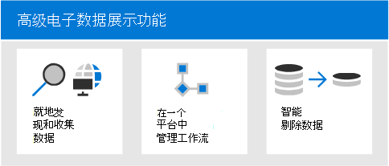

# 概述Microsoft 365 Advanced eDiscovery

Advanced eDiscovery解决方案Microsoft 365现有 Microsoft 电子数据展示和分析功能。 Advanced eDiscovery提供了端到端工作流，以保留、收集、分析、审阅和导出对组织内部和外部调查做出响应的内容。 它帮助法律团队管理整个法定保留通知工作流，与案件有关保管人进行沟通。

## Advanced eDiscovery功能

Advanced eDiscovery通过发现组织所存储的数据来帮助组织对法律事务或内部调查做出响应。 您可以通过识别感兴趣的人员及其数据源无缝管理电子数据展示工作流，无缝应用保留以保留数据，然后管理合法保留通信过程。 通过从源收集数据，你可以搜索实时Microsoft 365平台以快速找到所需的内容。 智能的机器学习功能（如深度索引、电子邮件线程和近重复检测）还有助于将大量的数据减少为相关的数据集。

以下各节介绍这些Advanced eDiscovery功能如何帮助你的组织。

### 就地发现和收集数据

通常，依赖于多个第三方电子数据展示解决方案的组织需要将大量数据从 Microsoft 365复制以处理，并且必须承载重复数据。 这一要求会增加查找相关数据的时间，以及管理多个解决方案的风险、成本和复杂性。

Advanced eDiscovery Microsoft 365，你可以发现源数据并一直位于Microsoft 365安全性和合规性边界内。  通过从实时系统就地收集数据，Advanced eDiscovery 可以减少返回到源的接触，并减少必须查找缺失内容这一不必要的工作，在传统电子数据展示解决方案中记录滞后时，通常会出现这种情况。

Teams、Yammer、SharePoint Online、OneDrive for Business 和 Exchange Online 中的数据的本机搜索和收集功能可进一步增强数据发现。 例如，Advanced eDiscovery：

- 重新Teams对话 (而不是从对话或对话返回单个) 。

- 收集在电子邮件和聊天中通过使用链接或新式附件与用户共享的基于云的Teams内容。

- 内置支持数百种非Microsoft 365文件类型。

- 收集第三方源数据， (数据连接器导入并存档的第三) 、Facebook、Slack 和 Zoom 会议Microsoft 365。 

### 在一个平台中管理电子数据展示工作流

Advanced eDiscovery可以帮助您减少需要依赖的电子数据展示解决方案的数量。 它提供了简化的端到端工作流，所有这些操作都发生在Microsoft 365。 Advanced eDiscovery 通过自动将唯一和共享数据源映射到感兴趣的人员（称为保管人 (*) ）* 以及提供对潜在相关信息的报告和分析，在收集这些数据进行分析和审阅之前，帮助减少识别和收集潜在相关信息源的接触。

此外，Microsoft Graph API 可以帮助你自动执行电子数据展示工作流，并扩展Advanced eDiscovery解决方案的解决方案。

### 智能剔除数据

智能、机器学习功能Advanced eDiscovery可帮助你减少要查看的数据量。 这些智能功能可帮助你减少大量的数据并剔除到相关集合。 例如，内置审阅集查询通过标识几乎重复项来帮助仅筛选唯一内容。 此功能可显著减少要审阅的数据量。

其他机器学习功能可以使用智能标记和技术辅助审阅工具（如相关性模块）进一步优化和识别数据。

## Advanced eDiscovery电子发现参考模型保持一致

Advanced eDiscovery 中的内置Microsoft 365工作流与电子数据展示参考模型 EDRM (概述的电子数据) 。

 (基于 EDRM 模型的图像 edrm.net) 

以下是高级电子数据展示在高级别为 EDRM 工作流提供支持的方式：

- **标识。** 当你在调查中发现潜在利益相关者后，可以将他们添加为高级电子数据展示案件的保管人（也称 *数据保管人*，因为他们可能拥有与调查相关的信息）。 将用户添加为保管人后，可以方便保留、收集和查看保管人文件。

- **保留。** 为了保留和保护与调查相关的数据，高级电子数据展示让你能够法定保留在案件中与保管人有关的数据源。 你也可以保留非保管人数据。 高级电子数据展示也具有内置的通信工作流，让你可以向保管人发送法定保留通知并跟踪他们的确认情况。

- **集合。** 在你发现（并保留）与调查相关的数据源后，你可以使用高级电子数据展示中的搜索工具从保管人数据源处（以及适用情况下的非保管人数据）搜索并收集可能与案件有关的实时数据。

- **处理。** 在你收集完所有与案件相关的数据后，下一步是对其进行处理，以供日后审阅和分析。 在高级电子数据展示中，你在收集阶段中发现的就地数据会被复制到 Azure 存储位置（名为 *审阅集*），供你查看案件数据的静态视图。 

- **查看。** 将数据添加到审阅集后，您可以查看特定文档并运行其他查询，以将数据减少为与案例最相关的内容。 另外，也可以批注和标记特定文档。

- **分析。** 高级电子数据展示提供了集成的分析工具，帮助你从审阅集中进一步剔除与调查无关的数据。 除了缩减相关数据的体量外，高级电子数据展示也可以让你能够整理内容，节省法律审阅的成本，让审阅流程变得更简单、更有效率。

- **生产和****演示。** 当你准备好时，你可以从审阅集导出文档进行法律审阅。 你既可以用原生格式导出文档，也可以用 EDRM 特定格式，这样文档可以被导入到第三方审阅应用程序中。

## 订阅和许可

用户Advanced eDiscovery需要相应的组织订阅和每用户许可。

- **组织订阅：** 若要访问Advanced eDiscovery中的Microsoft 365 合规中心，您的组织必须具有以下项之一：

  - Microsoft 365 E5 或 Office 365 E5 订阅
  
  - 具有 E5 合规性附加设备的 Microsoft 365 E3 订阅

  - Microsoft 365 E3 E5 电子数据展示和审核加载项进行订阅

  - Microsoft 365 教育版A5 或 Office 365 教育版 A5 订阅

   如果你没有现有 Microsoft 365 E5 计划，并且想要尝试 Advanced eDiscovery，可以将[Microsoft 365](/office365/admin/try-or-buy-microsoft-365)添加到现有订阅或注册试用 Microsoft 365 E5。 

- **每用户许可：** 若要在高级电子数据展示案例中将用户添加为保管人，必须为该用户分配以下许可证之一，具体取决于你的组织订阅：

  - Microsoft 365：必须为用户分配以下项之一：
  
    - Microsoft 365 E5许可证、E5 合规性附加许可证或 E5 电子数据展示和审核加载项

    - Microsoft 365必须为前端用户分配 F5 合规性或 F5 安全&合规性加载项

    - Microsoft 365 教育版必须为用户分配 A5 许可证

  - Office 365：必须为用户分配Office 365 E5或Office 365 教育版 A5 许可证。

有关许可的信息，请下载并参阅比较表 中的"电子数据展示和Microsoft 365[部分](https://go.microsoft.com/fwlink/?linkid=2139145)。

若要了解如何分配许可证，请参阅 [向用户分配许可证](/microsoft-365/admin/manage/assign-licenses-to-users)。

> [!NOTE]
> 用户只需要 E5 或 A5 许可证 (或相应的附加许可证) 作为保管人添加到 Advanced eDiscovery 案例。 使用 Advanced eDiscovery 管理事例和审查事例数据的 IT 管理员、电子数据展示管理员、律师、律师或律师不需要 E5、A5 或附加许可证。

## 高级电子数据展示入门

有两个快速而简单的步骤可以开始使用Advanced eDiscovery。

|步骤  |说明  |
|:---------|:---------|
|[设置高级电子数据展示](get-started-with-advanced-ediscovery.md)| 在验证订阅和许可要求后，您可以分配权限并配置组织范围的设置以开始使用 Advanced eDiscovery。|
|[创建和管理事例](create-and-manage-advanced-ediscoveryv2-case.md) | 创建案例以Advanced eDiscovery组织中所有法律和其他类型的调查的工作流。|
|||

## Advanced eDiscovery体系结构

下面是一个 Advanced eDiscovery 体系结构图，它显示了单地理位置环境和多地理位置环境中端到端工作流，以及与[EDRM](#advanced-ediscovery-alignment-with-the-electronic-discovery-reference-model)一致的端到端数据流。

[以图像视图](../media/solutions-architecture-center/m365-advanced-ediscovery-architecture.png)

[下载为 PDF 文件](https://download.microsoft.com/download/d/1/c/d1ce536d-9bcf-4d31-b75b-fcf0dc560665/m365-advanced-ediscovery-architecture.pdf)

[下载为Visio文件](https://download.microsoft.com/download/d/1/c/d1ce536d-9bcf-4d31-b75b-fcf0dc560665/m365-advanced-ediscovery-architecture.vsdx)

## 培训

在 Advanced eDiscovery 基础知识中培训 IT 管理员、电子数据展示管理员和合规性调查团队，可帮助组织使用 Microsoft 365 电子数据展示工具更快入门。 Microsoft 365提供了以下资源来帮助贵组织中这些用户开始使用电子数据展示：描述 Microsoft 365 电子数据[展示和审核Microsoft 365。](/learn/modules/describe-ediscovery-capabilities-of-microsoft-365)
