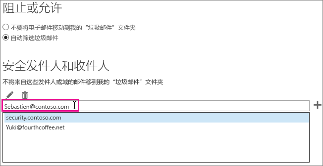

# <a name="how-to-prevent-real-email-from-being-marked-as-spam-in-office-365"></a><span data-ttu-id="7a14b-103">如何避免在 Office 365 中将真实电子邮件标记为“垃圾邮件”</span><span class="sxs-lookup"><span data-stu-id="7a14b-103">How to prevent real email from being marked as spam in Office 365</span></span>

 <span data-ttu-id="7a14b-104">**真实电子邮件是否在 Office 365 中被标记为“垃圾邮件”？试试本文中介绍的方法吧。**</span><span class="sxs-lookup"><span data-stu-id="7a14b-104">**Is your real email getting marked as spam in Office 365? Do this.**</span></span>

<span data-ttu-id="7a14b-p101">如果发生误报，则应使用[使用报告邮件加载项](https://support.office.com/article/b5caa9f1-cdf3-4443-af8c-ff724ea719d2)将此邮件报告给 Microsoft。此外，还可以使用[提交资源管理器](https://docs.microsoft.com/microsoft-365/security/office-365-security/admin-submission)提交邮件。</span><span class="sxs-lookup"><span data-stu-id="7a14b-p101">If you get a false positive, you should report the message to Microsoft by using the [Use the Report Message add-in](https://support.office.com/article/b5caa9f1-cdf3-4443-af8c-ff724ea719d2). Additionally, you can forward the message [as an attachment](https://docs.microsoft.com/microsoft-365/security/office-365-security/admin-submission) to not_junk@office365.microsoft.com.</span></span>

> [!NOTE]
> <span data-ttu-id="7a14b-107">下文未提及的标头中的任何其他字段专供 Microsoft 反垃圾邮件团队用于进行诊断。</span><span class="sxs-lookup"><span data-stu-id="7a14b-107">Any other fields in the header that are not mentioned below are exclusively used by the Microsoft anti-spam team for diagnostic purposes.</span></span>

## <a name="determine-the-reason-why-the-message-was-marked-as-spam"></a><span data-ttu-id="7a14b-108">确定邮件被标记为“垃圾邮件”的原因</span><span class="sxs-lookup"><span data-stu-id="7a14b-108">Determine the reason why the message was marked as spam</span></span>

<span data-ttu-id="7a14b-p102">Office 365 中的许多垃圾邮件问题都可以这样解决：[查看电子邮件的邮件头](https://support.office.com/article/cd039382-dc6e-4264-ac74-c048563d212c)，并确定哪里出错。你需要查找名为 X-Forefront-Antispam-Report 的标头。你可以[详细了解反垃圾邮件的邮件头](https://docs.microsoft.com/microsoft-365/security/office-365-security/anti-spam-message-headers)。</span><span class="sxs-lookup"><span data-stu-id="7a14b-p102">Many issues with spam in Office 365 can be resolved by [View e-mail message headers](https://support.office.com/article/cd039382-dc6e-4264-ac74-c048563d212c) and determining what went wrong. You will need to look for a header named X-Forefront-Antispam-Report. You can [learn more about anti-spam message headers](https://docs.microsoft.com/microsoft-365/security/office-365-security/anti-spam-message-headers).</span></span>

<span data-ttu-id="7a14b-112">在邮件头中查找以下头和值。</span><span class="sxs-lookup"><span data-stu-id="7a14b-112">In the header, look for the following headings and values.</span></span>

### <a name="x-forefront-antispam-report"></a><span data-ttu-id="7a14b-113">X-Forefront-Antispam-Report</span><span class="sxs-lookup"><span data-stu-id="7a14b-113">X-Forefront-Antispam-Report</span></span>

- <span data-ttu-id="7a14b-114">**SFV:SPM**：指明邮件被 EOP 垃圾邮件筛选器标记为“垃圾邮件”。</span><span class="sxs-lookup"><span data-stu-id="7a14b-114">**SFV:SPM** Indicates that the message was marked as spam because of the EOP spam filters.</span></span>

- <span data-ttu-id="7a14b-115">**SFV:BLK**：指明邮件被标记为“垃圾邮件”，因为发送地址位于收件人的阻止的发件人名单中。</span><span class="sxs-lookup"><span data-stu-id="7a14b-115">**SFV:BLK** Indicates that the message was marked as spam because the sending address is on the recipient's Blocked Senders List.</span></span>

- <span data-ttu-id="7a14b-p103">**SFV:SKS**：指明邮件在经内容筛选器筛选前就已被标记为“垃圾邮件”。这可能包含邮件流规则（也称为传输规则），它将邮件标记为“垃圾邮件”。运行邮件跟踪，以确定是否触发了可能已设置高垃圾邮件可信度 (SCL) 的邮件流规则。</span><span class="sxs-lookup"><span data-stu-id="7a14b-p103">**SFV:SKS** Indicates that the message was marked as spam prior to the content filter. This could include a mail flow rule (also known as a transport rule) marking the message as spam. Run a message trace to see if a mail flow rule triggered which may have set a high spam confidence level (SCL).</span></span>

- <span data-ttu-id="7a14b-119">**SFV:SKB**：指明邮件被标记为“垃圾邮件”，因为它符合垃圾邮件筛选器策略中的阻止列表。</span><span class="sxs-lookup"><span data-stu-id="7a14b-119">**SFV:SKB** Indicates that the message was marked as spam because it matched a block list in the spam filter policy.</span></span>

- <span data-ttu-id="7a14b-p104">**SFV:BULK**：指明 x-microsoft-antispam 头中的大量邮件可信度 (BCL) 值高于已为内容筛选器设置的大量邮件阈值。大量电子邮件是指用户已申请，但仍不想接收的电子邮件。在邮件头中的 X-Microsoft-Antispam 头内，找到 BCL（大量邮件可信度）属性。如果 BCL 值低于垃圾邮件筛选器中设置的阈值，建议调整阈值，以将这些类型的大量邮件标记为“垃圾邮件”。用户对[大量电子邮件的处理方式](https://docs.microsoft.com/microsoft-365/security/office-365-security/bulk-complaint-level-values)的容忍度和偏好不同。可创建因用户偏好而异的不同策略或规则。</span><span class="sxs-lookup"><span data-stu-id="7a14b-p104">**SFV:BULK** Indicates that the Bulk Complaint Level (BCL) value located in the x-microsoft-antispam header is above the Bulk threshold that has been set for the content filter. Bulk email is email which users may have signed up for, but may still be undesirable. In the message header find the BCL (Bulk Confidence Level) property in the X-Microsoft-Antispam header. If the BCL value is less than the threshold set in the Spam Filter, you may want to adjust the threshold to instead mark these types of bulk messages as spam. Different users have different tolerances and preferences for [how bulk email is handled](https://docs.microsoft.com/microsoft-365/security/office-365-security/bulk-complaint-level-values). You can create different policies or rules for different user preferences.</span></span>

- <span data-ttu-id="7a14b-p105">**CAT:SPOOF** 或 **CAT:PHISH**：指明邮件可能存在欺骗行为。也就是说，无法验证邮件来源，来源可疑。如果有效，发件人需要确保已正确配置 SPF 和 DKIM。请检查 Authentication-Results 头，以获取更多信息。尽管难以让所有发件人都使用正确的电子邮件身份验证方法，但规避这些检查极为危险，最容易导致泄漏发生。</span><span class="sxs-lookup"><span data-stu-id="7a14b-p105">**CAT:SPOOF** or **CAT:PHISH** Indicates that the message appears to be spoofed, meaning that the message source cannot be validated and could be suspicious. If valid, the sender will need to make sure that they have proper SPF and DKIM configuration. Check the Authentication-Results header for more information. Although it may be difficult to get all senders to use proper email authentication methods, bypassing these checks can be extremely dangerous and is the top cause of compromises.</span></span>

### <a name="x-customspam"></a><span data-ttu-id="7a14b-130">x-customspam</span><span class="sxs-lookup"><span data-stu-id="7a14b-130">x-customspam</span></span>

- <span data-ttu-id="7a14b-p106">此头指明邮件被标记为“垃圾邮件”，因为垃圾邮件筛选器中的[高级垃圾邮件选项之一已启用](https://docs.microsoft.com/microsoft-365/security/office-365-security/advanced-spam-filtering-asf-options)。建议使用默认设置，除非你确实需要这些功能。</span><span class="sxs-lookup"><span data-stu-id="7a14b-p106">The presence of this header indicates that the message was marked as spam because one of the [advanced spam options is enabled](https://docs.microsoft.com/microsoft-365/security/office-365-security/advanced-spam-filtering-asf-options) in your spam filter. Unless you need these features, we recommend that you use the default settings.</span></span>

## <a name="solutions-to-additional-causes-of-too-much-spam"></a><span data-ttu-id="7a14b-133">垃圾邮件过多的其他原因的解决方案</span><span class="sxs-lookup"><span data-stu-id="7a14b-133">Solutions to additional causes of too much spam</span></span>

<span data-ttu-id="7a14b-p107">为了提高工作效率，Exchange Online Protection (EOP) 要求管理员必须完成一些任务。如果你不是 Office 365 租户的管理员，且收到过多垃圾邮件，建议你与管理员一起完成这些任务。如果不愿意这样做，可跳至用户部分。</span><span class="sxs-lookup"><span data-stu-id="7a14b-p107">In order to work effectively, Exchange Online Protection (EOP) requires that administrators complete a few tasks. If you are not the administrator for your Office 365 tenant and you are getting too much spam, then you may want to work with your administrator on these tasks. Otherwise, you can skip to the user section.</span></span>

### <a name="for-admins"></a><span data-ttu-id="7a14b-137">对于管理员</span><span class="sxs-lookup"><span data-stu-id="7a14b-137">For admins</span></span>

- <span data-ttu-id="7a14b-p108">**让 DNS 记录指向 Office 365**：所有域的邮件交换器 (MX) DNS 记录都必须指向 Office 365，且只能指向 Office 365，这样 EOP 才能提供保护。如果 MX 没有指向 Office 365，EOP 就不会为用户提供垃圾邮件筛选服务。若要使用其他服务或设备为域提供垃圾邮件筛选服务，应考虑在 EOP 中禁用垃圾邮件保护。为此，可创建将 SCL 值设为 -1 的邮件流规则。如果稍后决定使用 EOP，请务必删除邮件流规则。</span><span class="sxs-lookup"><span data-stu-id="7a14b-p108">**Point your DNS records to Office 365** In order for EOP to provide protection, your mail exchanger (MX) DNS record(s) for all domains must be pointed to Office 365 -- and only to Office 365. If your MX does not point to Office 365, then EOP will not provide spam filtering for your users. In the situation where you wish to use another service or appliance to provide spam filtering for your domain, you should consider disabling the spam protection in EOP. You can do this by creating a mail flow rule that sets the SCL value to -1. If you later decide to use EOP, make sure to remove this mail flow rule.</span></span>

- <span data-ttu-id="7a14b-143">**为用户开启报告邮件加载项**：我们强烈建议[为用户启用报告邮件加载项](https://docs.microsoft.com/microsoft-365/security/office-365-security/enable-the-report-message-add-in)。</span><span class="sxs-lookup"><span data-stu-id="7a14b-143">**Turn on the report message add-in for users** We strongly recommend that you [enable the report message add-in for you users](https://docs.microsoft.com/microsoft-365/security/office-365-security/enable-the-report-message-add-in).</span></span>

- <span data-ttu-id="7a14b-144">**使用[提交资源管理器](https://docs.microsoft.com/microsoft-365/security/office-365-security/admin-submission)**：管理员现在可以使用文件或网络邮件 ID、URL 和 Microsoft 在 Office 365 中扫描的文件发送电子邮件。</span><span class="sxs-lookup"><span data-stu-id="7a14b-144">**Use [Submissions Explorer](https://docs.microsoft.com/microsoft-365/security/office-365-security/admin-submission)** Admins can now send emails by using file or network message ID, URLs, and files for scanning by Microsoft in Office 365.</span></span> <span data-ttu-id="7a14b-145">作为管理员，你还可以查看用户发送的反馈，并使用任何模式对可能导致问题的任何设置进行调整。</span><span class="sxs-lookup"><span data-stu-id="7a14b-145">As an administrator, you may also be able to view the feedback your users are sending and use any patterns to adjust any settings that may be causing problems.</span></span>

- <span data-ttu-id="7a14b-146">**确保用户在发送和接收电子邮件的允许限制范围内[，如](https://docs.microsoft.com/office365/servicedescriptions/exchange-online-service-description/exchange-online-limits)这篇文章**所述。</span><span class="sxs-lookup"><span data-stu-id="7a14b-146">**Make sure that your users are inside the allowed limits** for sending and receiving emails as showed [here](https://docs.microsoft.com/office365/servicedescriptions/exchange-online-service-description/exchange-online-limits).</span></span>

- <span data-ttu-id="7a14b-147">**仔细检查批量级别**，如[这篇文章](https://docs.microsoft.com/microsoft-365/security/office-365-security/bulk-complaint-level-values)所规定。</span><span class="sxs-lookup"><span data-stu-id="7a14b-147">**Double-check the bulk levels** as specified [here](https://docs.microsoft.com/microsoft-365/security/office-365-security/bulk-complaint-level-values)</span></span>

### <a name="for-users"></a><span data-ttu-id="7a14b-148">对于用户</span><span class="sxs-lookup"><span data-stu-id="7a14b-148">For users</span></span>

- <span data-ttu-id="7a14b-149">**创建安全发件人列表**：用户可以在 [Outlook](https://go.microsoft.com/fwlink/p/?LinkId=270065) 或 [Outlook 网页版](https://go.microsoft.com/fwlink/p/?LinkId=294862)（以前称为 Outlook Web App）中将受信任的发件人地址添加到安全发件人列表中。</span><span class="sxs-lookup"><span data-stu-id="7a14b-149">**Create a safe sender list**: Users can add addresses from senders that they trust to their safe sender list in [Outlook](https://go.microsoft.com/fwlink/p/?LinkId=270065) or [Outlook on the web](https://go.microsoft.com/fwlink/p/?LinkId=294862) (formerly known as Outlook Web App).</span></span> <span data-ttu-id="7a14b-150">若要在 Outlook 网页版中开始使用，请选择“**设置**” \>“**选项**”\>“**阻止或允许**”。</span><span class="sxs-lookup"><span data-stu-id="7a14b-150">To get started in Outlook on the web, choose **Settings**  \> **Options** \> **Block or allow**.</span></span> <span data-ttu-id="7a14b-151">下图所示为向安全发件人列表添加内容的示例。</span><span class="sxs-lookup"><span data-stu-id="7a14b-151">The following diagram shows an example of adding something to a safe sender list.</span></span>



<span data-ttu-id="7a14b-153">EOP 将会指定用户的安全发件人和收件人，但不是安全域。</span><span class="sxs-lookup"><span data-stu-id="7a14b-153">EOP will honor your users' Safe Senders and Recipients, but not Safe Domains.</span></span> <span data-ttu-id="7a14b-154">无论该域是已添加到 Outlook 网页版中还是已添加到 Outlook 并使用 Directory Sync 进行同步，情况均是如此。</span><span class="sxs-lookup"><span data-stu-id="7a14b-154">EOP will honor your users' Safe Senders and Recipients, but not Safe Domains. This is true regardless of whether the domain is added through the Outlook on the Web, or added in Outlook and synchronized using Directory Sync.</span></span>

- <span data-ttu-id="7a14b-155">**在 Outlook 中禁用 SmartScreen 筛选**：如果你使用的是旧版 Outlook 桌面客户端，应禁用 SmartScreen 筛选功能，该功能已停用。</span><span class="sxs-lookup"><span data-stu-id="7a14b-155">**Disable SmartScreen filtering in Outlook** If you are using an older Outlook desktop client, you should disable the SmartScreen filtering functionality, which has been discontinued. If enabled, it can cause false positives. This should not be required if running an updated desktop Outlook client.</span></span> <span data-ttu-id="7a14b-156">如果启用，可能导致误报。</span><span class="sxs-lookup"><span data-stu-id="7a14b-156">If enabled, it can cause false positives.</span></span> <span data-ttu-id="7a14b-157">如果正在运行已更新的桌面 Outlook 客户端，则无需进行此操作。</span><span class="sxs-lookup"><span data-stu-id="7a14b-157">This should not be required if running an updated desktop Outlook client.</span></span>

## <a name="troubleshooting-a-message-ends-up-in-the-junk-folder-even-though-eop-marked-the-message-as-non-spam"></a><span data-ttu-id="7a14b-158">疑难解答：即便 EOP 已将邮件标记为“非垃圾邮件”，邮件还是出现在“垃圾邮件”文件夹中</span><span class="sxs-lookup"><span data-stu-id="7a14b-158">Troubleshooting: A message ends up in the Junk folder even though EOP marked the message as non-spam</span></span>

<span data-ttu-id="7a14b-p113">如果用户在 Outlook 中启用了“仅限安全列表：仅来自安全发件人列表或安全收件人列表的人员或域的邮件将传送至收件箱”，则所有电子邮件均会投递至某个发件人的垃圾邮件文件夹，除非该发件人位于收件人的安全发件人列表上。无论 EOP 是否已将邮件标记为“非垃圾邮件”，或者已在 EOP 中设立将邮件标记为“非垃圾邮件”的规则，情况均会如此。</span><span class="sxs-lookup"><span data-stu-id="7a14b-p113">If your users have the option in Outlook enabled for "Safe Lists Only: Only mail from people or domains on your Safe Senders list or Safe Recipients List will be delivered to your Inbox", then all email will go to the junk folder for a sender unless the sender is on the recipient's Safe Sender list. This will happen regardless of whether EOP marks a message as non-spam, or if you have set up a rule in EOP to mark a message as non-spam.</span></span>

<span data-ttu-id="7a14b-161">如果在 Outlook 网页版中查看邮件，则其中显示的黄色安全提示指示邮件位于垃圾邮件文件夹中，因为该发件人不在收件人的安全发件人列表中。</span><span class="sxs-lookup"><span data-stu-id="7a14b-161">If you view the message in Outlook on the Web, there will be a yellow safety tip that indicates that the message is in the Junk folder because the sender is not on the recipient's Safe Senders list.</span></span>

<span data-ttu-id="7a14b-p114">如果查看邮件头，则其中可能包含戳记 SFV:SKN（IP 允许或 ETR 允许）或 SFV:NSPM（非垃圾邮件），但邮件仍位于用户的垃圾邮件文件夹中。如果邮件头中没有任何内容，则表示用户已启用“仅限安全列表”选项。这是因为用户在 Outlook 中设置的“仅限安全列表”选项将会覆盖 EOP 设置。</span><span class="sxs-lookup"><span data-stu-id="7a14b-p114">If you look at the header of a message, it may include the stamp SFV:SKN (IP Allow or ETR Allow) or SFV:NSPM (non-spam), but the message is still placed in the user's junk folder. There is nothing in the message header that indicates that the user has "Safe Lists Only" enabled. This happens because the "Safe Lists Only" option set by users in Outlook overrides the EOP setting.</span></span>

### <a name="to-verify-why-a-message-from-a-safe-sender-is-marked-as-non-spam-in-the-message-header-but-still-ends-up-in-the-users-junk-folder"></a><span data-ttu-id="7a14b-165">查证为何来自某个安全发件人的邮件在邮件头中被标记为“非垃圾邮件”，但仍出现在用户的垃圾邮件文件夹中</span><span class="sxs-lookup"><span data-stu-id="7a14b-165">To verify why a message from a safe sender is marked as non-spam in the message header, but still ends up in the user's Junk folder</span></span>

1. <span data-ttu-id="7a14b-166">若要了解如何连接到 Exchange Online PowerShell，请查阅[连接到 Exchange Online PowerShell](https://go.microsoft.com/fwlink/p/?LinkId=396554)。</span><span class="sxs-lookup"><span data-stu-id="7a14b-166">To learn how to connect to Exchange Online PowerShell, see [Connect to Exchange Online PowerShell](https://go.microsoft.com/fwlink/p/?LinkId=396554).</span></span>

2. <span data-ttu-id="7a14b-167">运行以下命令，以查看用户的垃圾邮件配置设置：</span><span class="sxs-lookup"><span data-stu-id="7a14b-167">Run the following command to view the user's junk email configuration settings:</span></span>

  ```Powershell
  Get-MailboxJunkEmailConfiguration example@contoso.com | Format-List TrustedListsOnly,ContactsTrusted,TrustedSendersAndDomains
  ```

- <span data-ttu-id="7a14b-168">如果 TrustedListsOnly 为 True，则这意味着此设置已启用。</span><span class="sxs-lookup"><span data-stu-id="7a14b-168">If TrustedListsOnly is set to True, it means that this setting is enabled</span></span>

- <span data-ttu-id="7a14b-169">如果 ContactsTrusted 为 True，则这意味着用户信任联系人和安全发件人。</span><span class="sxs-lookup"><span data-stu-id="7a14b-169">If ContactsTrusted is set to True, it means that the user trusts both Contacts and Safe Senders</span></span>

- <span data-ttu-id="7a14b-170">TrustedSendersAndDomains 将列出用户的安全发件人列表中的内容。</span><span class="sxs-lookup"><span data-stu-id="7a14b-170">The TrustedSendersAndDomains lists the contents of the user's Safe Senders list</span></span>

## <a name="eop-only-customers-use-directory-synchronization"></a><span data-ttu-id="7a14b-171">仅限 EOP 客户：使用目录同步</span><span class="sxs-lookup"><span data-stu-id="7a14b-171">EOP-only customers: use directory synchronization</span></span>

<span data-ttu-id="7a14b-p115">如果为仅限 EOP 客户，即，你已订阅 EOP 服务以用于本地 (Exchange) 单子邮件服务器，则应使用目录同步功能将用户设置与该服务同步。这样做可确保 EOP 接受你的安全发件人列表。有关更多信息，请参阅[在 EOP 中管理邮件用户](https://go.microsoft.com/fwlink/?LinkId=534098)中的“使用目录同步管理邮件用户”。</span><span class="sxs-lookup"><span data-stu-id="7a14b-p115">If you're an EOP-only customer, that is, you subscribe to the EOP service for use with your on-premises (Exchange) email server, you should sync user settings with the service by using directory synchronization. Doing this ensures that your safe senders lists are respected by EOP. For more information, see "Use directory synchronization to manage mail users" in [Manage Mail Users in EOP](https://go.microsoft.com/fwlink/?LinkId=534098).</span></span>
