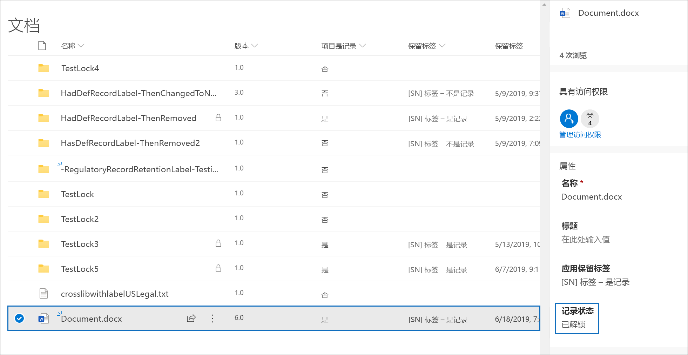
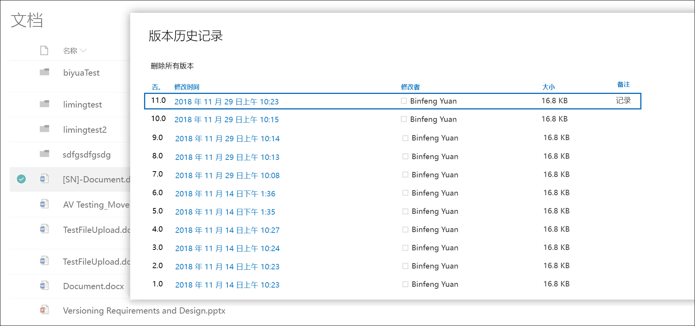
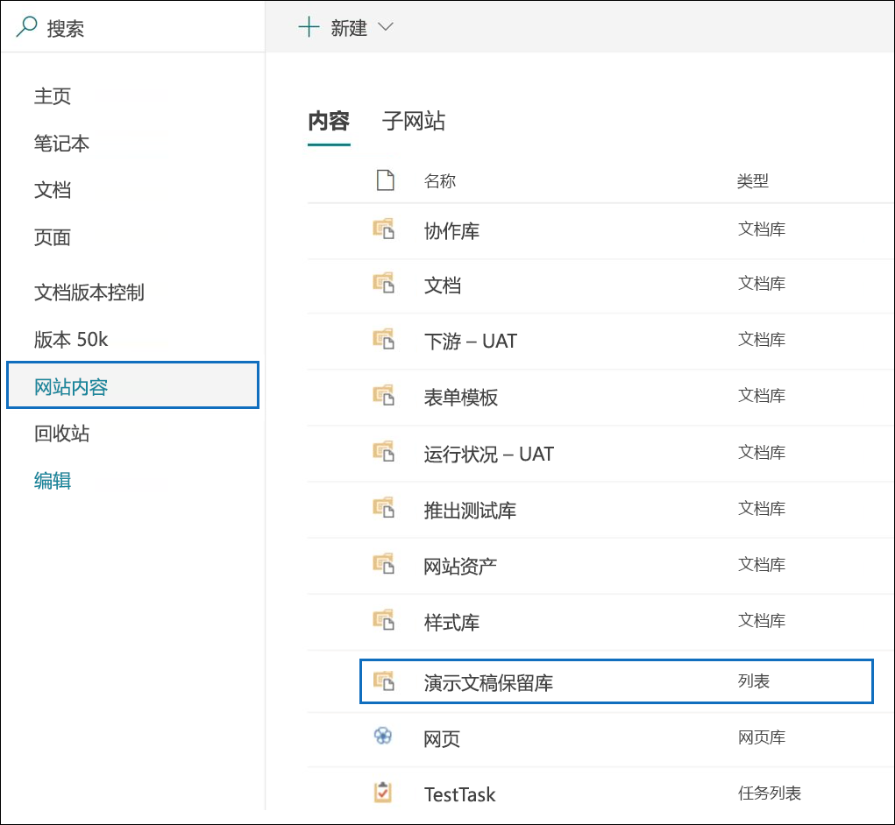
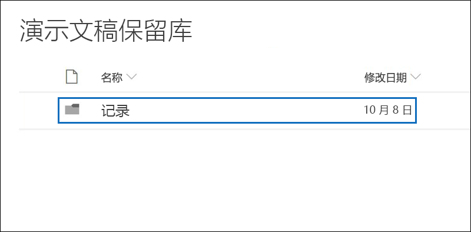

# 使用记录版本控制来更新存储在 SharePoint 或 OneDrive 中的记录

>*[Microsoft 365 安全性与合规性许可指南](https://aka.ms/ComplianceSD)。*

能够将文档标记为[记录](records.md)并限制可对该记录执行的操作是任何记录管理解决方案的重要目标。 但是，用户创建后续版本时也可能需要开展协作。

例如，你可以将销售合同标记为记录，但需要使用新条款更新合同，并将最新版本标记为新记录，同时保留先前的记录版本。 对于这些类型的方案，SharePoint 和 OneDrive 现在支持*记录版本控制*。 OneNote 笔记本文件夹不支持记录版本控制。

若要使用记录版本控制，首先[标记文档并将其标记为记录](declare-records.md)。 完成此操作后，名为“*记录状态*”的文档属性将显示在保留标签旁边，初始记录状态为“**已锁定**”。 

现在，可执行下列操作：

  - **通过解锁和锁定记录状态属性，持续编辑文档的各个版本并将其保留为记录。** 只有当“**记录状态**”属性设置为“**已锁定**”时，才会保留新版本的记录。 在已锁定和已解锁之间切换可降低保留不必要的文档版本和副本的风险。

  - **将文档自动保存在位于网站集内的本地记录存储库中。** SharePoint 和 OneDrive 中的每个网站集将内容保存在其保留库中。 记录版本保存在此库中的“记录”文件夹内。

  - **保存包含所有版本的始终更新的文档。** 默认情况下，每个 SharePoint 和 OneDrive 文档的项菜单上都有可用的版本历史记录。 在此版本历史记录中，你可以轻松查看哪些版本是记录并查看这些文档。

对于具有将项标记为记录的保留标签的任何文档，记录版本控制自动可用。 当用户使用详细信息窗格查看文档属性时，可以将“**记录状态**”从“**已锁定**”切换为“**已解锁**”。 执行此操作即可在保留库的“记录”文件夹中创建一个记录，该记录将在其中保存剩余的保留期。 

当文档处于已解锁状态时，拥有标准编辑权限的任何用户均可编辑此文件。 但是，用户无法编辑此文件，因为它仍然是记录。 完成编辑后，用户可再次将“**记录状态**”从“**已解锁**”切换回“**已锁定**”，此状态下可阻止用户进一步编辑该记录。
  

## 锁定和解锁记录

在向文档应用将内容标记为记录的保留标签后，任何拥有参与权限或更窄权限水平的用户可解锁记录或锁定未解锁的记录。
  

当用户解锁记录时，将会发生以下操作：

1. 如果当前网站集没有保留库，将会创建一个。

2. 如果保留库没有“记录”文件夹，将会创建一个。

3. “复制到”**** 操作会将文档的最新版本复制到“记录”文件夹。 “复制到”**** 操作仅包含最新版本，不包含先前版本。 此复制的文档现在被视为文档的记录版本，其文件名格式为：\[标题 GUID 版本\#\]

4. 在“记录”文件夹中创建的副本已添加到原始文档的版本历史记录中，此版本将在注释字段中显示“**记录**”一词。

5. 原始文档现已成为可编辑但不可删除的新版本。 文档库列“**项为记录**”仍显示“**是**”值，因为文档仍是记录，即使它现在可以编辑。

当用户锁定记录时，原始文档同样无法编辑。 但是，是解锁记录的操作将版本复制到保留库中的“记录”文件夹。

## 记录版本

每次用户解锁记录时，都会将最新版本复制到保留库的“记录”文件夹中，该版本在版本历史记录的“注释”**** 字段中的值为“记录”****。
  

要查看版本历史记录，请在文档库中选择一个文档，然后在项菜单中单击“版本历史记录”****。

## 存储记录的位置。

记录保存在网站集顶层站点的保留库内的“记录”文件夹中。 在顶层站点的左侧导航中，选择“**网站内容**\>**”，“保留库”**。
  

  

保留库仅对网站集管理员可见。 此外，默认情况下保留库不存在。 仅当受保存标签影响的内容在网站集中第一次删除时才会创建。

## 搜索记录版本控制事件的审核日志

锁定和解锁记录的操作会记录在审核日志中。 你可以搜索特定活动“将记录状态更改为已锁定”**** 和“将记录状态更改为已解锁”****，这些活动位于安全与合规性中心“审核日志搜索”**** 页面“活动”**** 下拉列表中的“文件和页面活动”**** 部分。
  

有关搜索这些事件的详细信息，请参阅[在安全与合规性中心中搜索审核日志](search-the-audit-log-in-security-and-compliance.md#file-and-page-activities)的“文件和页面活动”部分。

## 后续步骤

若要将内容标记为记录，请参阅[使用保留标签声明记录](declare-records.md)。

若要了解有关记录的处置，请参阅[处置内容](disposition.md)。
