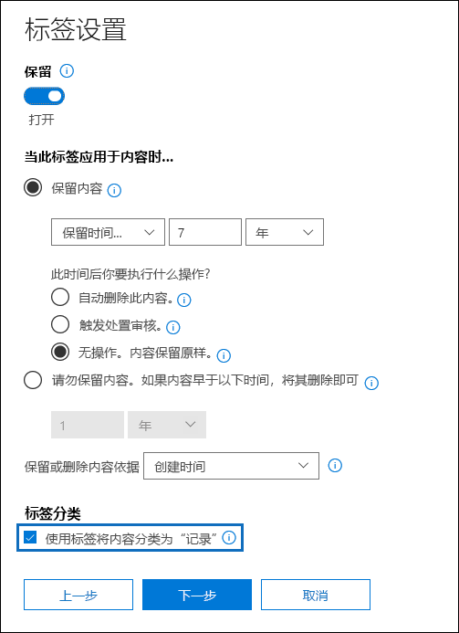
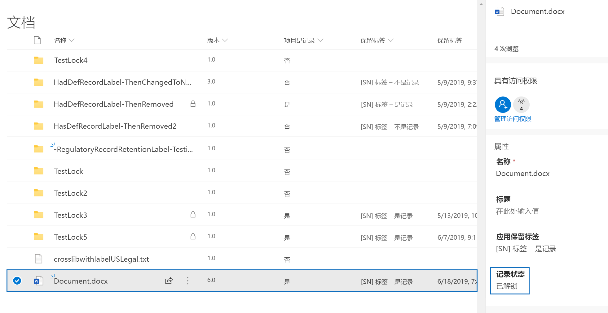
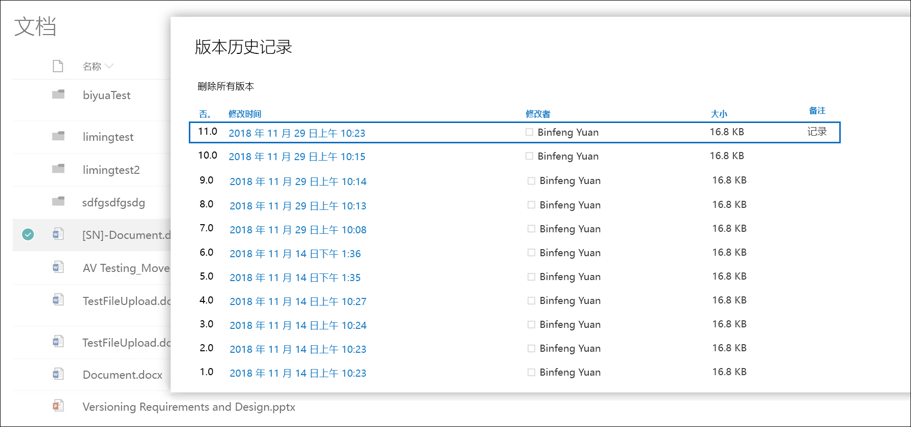
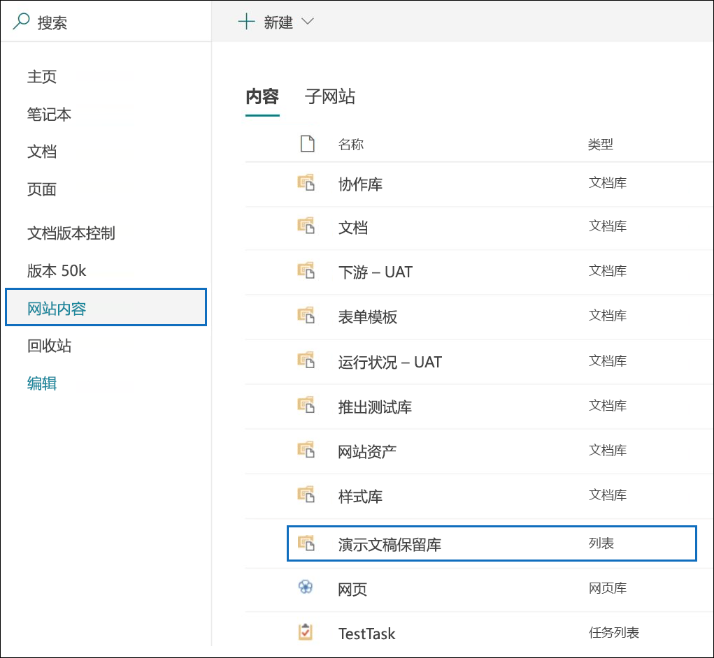
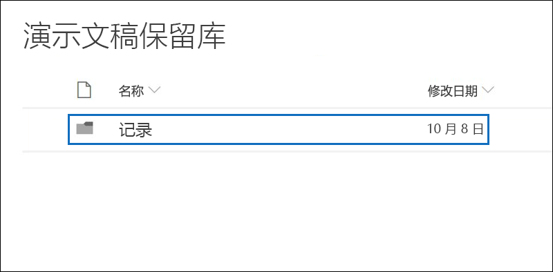
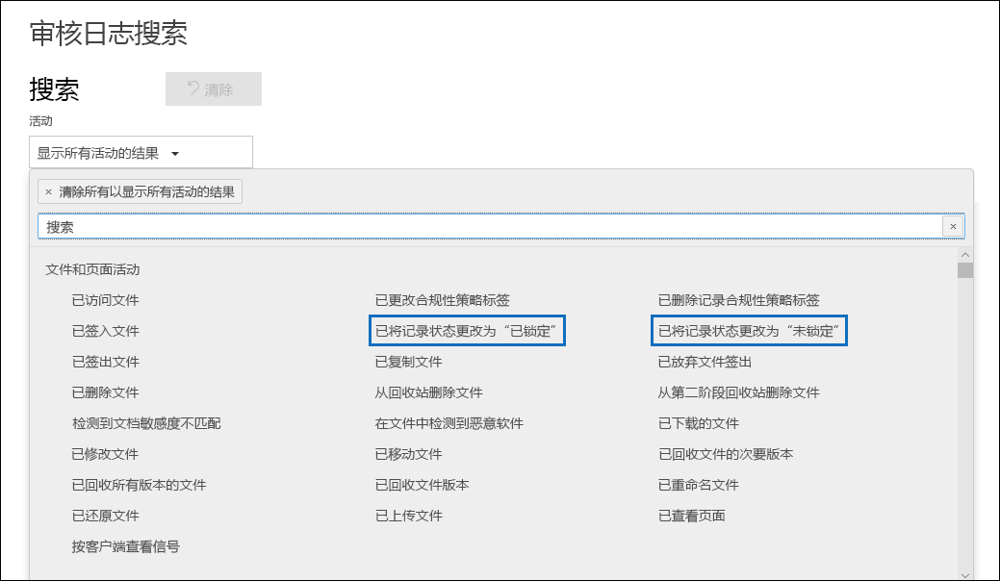

# 记录概述

在 Microsoft 365 中管理记录可帮助组织遵守公司策略、法律和法规义务，同时降低风险和法律责任。

总体来说，将内容声明为记录意味着：

- 该项变为不可变（记录无法修改或删除）

- 记录了有关该项的其他活动

- 记录在声明的保留期结束后被处置

你可以使用[保留标签](labels.md)将内容分类为记录。 创建声明记录的保留标签后，可以将这些标签[发布](labels.md#how-retention-labels-work-with-retention-label-policies)（以便用户可以使用这些标签将内容分类为记录）或[自动应用](labels.md#applying-a-retention-label-automatically-based-on-conditions)到你想分类为记录的内容。 通过使用保留标签声明记录，你可在 Office 365 中实施一致且单一的记录管理策略，而其他记录管理功能（如记录中心）仅适用于 SharePoint Online 内容。

请记住下列有关记录的事项：

  - **记录是不可变的。** 除了 SharePoint 和 OneDrive for Business 以外，将内容声明为记录的保留标签还可以应用到 Exchange 内容。 但是，[记录版本控制](#record-versioning)仅在 SharePoint 和 OneDrive 中可用，对 Exchange 不可用。

    在 Exchange 中，标记为记录的内容不可变，直到其最终删除。 将 Exchange 项标记为记录后，会发生下述四项事件：

    - 无法永久删除项。

    - 无法编辑项。

    - 无法更改标签。

    - 无法删除标签。

  - **记录和文件夹。** 可将保留标签应用于 Exchange、SharePoint 和 OneDrive 中的文件夹。 如果某文件夹被标记为记录，且将某项移到此文件夹中，则该项被标记为记录。 将该项移出文件夹后，该项将仍被标记为记录。

    此外，如果将应用于某个文件夹（在 SharePoint 和 OneDrive 中）的记录标签更改为不将内容声明为记录的保留标签，则该文件夹中的各项将保留其现有的记录标签。

    有关将保留标签应用于 SharePoint 和 OneDrive 文件夹的详细信息，请参阅[将默认保留标签应用于 SharePoint 库、文件夹或文档集中的所有内容](labels.md#applying-a-default-retention-label-to-all-content-in-a-sharepoint-library-folder-or-document-set)。

  - **记录无法删除。** 如果用户尝试删除 Exchange 中的记录，相应项会移至“可恢复项”文件夹中，如[保留策略如何处理留在原处的内容](retention-policies.md#content-in-mailboxes-and-public-folders)中所述。

    如果用户尝试删除 SharePoint 中的记录，将会显示错误，提醒你注意项未删除，仍留在库中。

    

    如果用户尝试删除 OneDrive 中的记录，相应项会移至保留库中，如[保留策略如何处理留在原处的内容](retention-policies.md#content-in-onedrive-accounts-and-sharepoint-sites)中所述。

  - **记录标签无法移除。** 对项应用记录标签后，仅该位置（例如 SharePoint 网站的网站集管理员）的管理员可以移除该记录标签。

## 使用保留标签声明记录

创建保留标签时，可视需要使用保留标签将内容分类为记录。 要将内容声明为记录，你需要执行下列操作：

1. 创建保留标签。 在 Microsoft 365 合规性中心，转到“记录管理”****\>“文件计划”****。 在“文件计划”**** 页面上，单击“创建标签”****。

2. 在向导的“标签设置”**** 页面上，选择将保留标签设置为“将内容声明为记录”的选项。 

   

3. 将保留标签[发布](labels.md#how-retention-labels-work-with-retention-label-policies)或[自动应用](labels.md#applying-a-retention-label-automatically-based-on-conditions)到 SharePoint 网站和/或 OneDrive 帐户。

### 对内容应用保留标签

对于 Exchange，任何具有邮箱写入权限的用户均可对电子邮件应用记录标签。 对于 SharePoint 和 OneDrive 内容，默认“成员”组（“参与”权限级别）中的任何用户均可将记录标签应用于内容。 应用后，仅网站集管理员可删除或更改该记录标签。 如前所述，可以对内容自动应用将内容分类为记录的保留标签。

此处为记录标签应用到 SharePoint 网站或 OneDrive 帐户上的文档的情况。
  

## 记录版本控制

记录管理的重要组成部分是能够将文档声明为记录并且使该记录不可变。 同时，如果用户需要创建后续版本，记录不可变性可阻止文档的协作性。 例如，你可以将销售合同声明为记录，但需要使用新条款更新合同，并将最新版本声明为新记录，同时保留先前的记录版本。 对于这些类型的方案，SharePoint Online 和 OneDrive for Business 现在支持*记录版本控制*。 不支持 OneNote 笔记本文件夹。

要使用记录版本控制，第一步是使用 Microsoft 365 合规性中心创建声明记录的保留标签，并将其发布到所有 SharePoint 网站和/或 OneDrive 帐户，或者将其发布到特定的 SharePoint 网站和/或 OneDrive 帐户。 下一步是将发布的保留记录标签应用到文档。 完成此操作后，名为“记录状态”** 的文档属性将显示在保留标签旁边，初始记录状态将为“已锁定”****。 此时，你可以执行以下操作：

  - **通过解锁和锁定记录状态属性，持续编辑文档的各个版本并将其声明为记录。** 当“记录状态”**** 属性设置为“已锁定”**** 时，仅保留声明为记录的版本。 这将降低保留不必要的文档版本和副本的风险。

  - **将文档自动保存在位于网站集内的本地记录存储库中。** SharePoint 和 OneDrive 中的每个网站集将内容保存在其保留库中。 记录版本保存在此库中的“记录”文件夹内。

  - **保存包含所有版本的始终更新的文档。** 默认情况下，每个 SharePoint 和 OneDrive 文档的项菜单上都有可用的版本历史记录。 在此版本历史记录中，你可以轻松查看哪些版本是记录并查看这些文档。

对于具有将项声明为记录的保留标签的任何文档，记录版本控制自动可用。 当用户通过详细信息窗格查看文档属性时，他们会将“记录状态”**** 从“已锁定”**** 切换为“已解锁”****。 单击一下，即可在保留库的“记录”文件夹中创建一个记录，该记录将在其中保存剩余的保留期。 当文档处于解锁状态时，具有权限的任何用户均可编辑此文件。 但是，用户无法编辑此文件，因为它被视为声明的记录。 进行必要的更改后，用户可以将“记录状态”**** 从“已解锁”**** 切换为“已锁定”****，因此文档会再次声明为记录并且无法编辑。
  

> [!NOTE]
> 记录版本控制需要 Office 365 Enterprise E5 许可证，以便有权限的用户可以编辑无法在 SharePoint 网站或 OneDrive 帐户中声明为记录的内容。 具有只读权限的用户不需要许可证。

### 锁定和解锁记录

记录标签分配到文档后，默认成员组（“参与”权限级别）中的任何用户均可将记录解锁或者锁定已解锁的记录。
  

当用户解锁记录时，将会发生以下操作：

1. 如果当前网站集没有保留库，将会创建一个。

2. 如果保留库没有“记录”文件夹，将会创建一个。

3. “复制到”**** 操作会将文档的最新版本复制到“记录”文件夹。 “复制到”**** 操作仅包含最新版本，不包含先前版本。 此复制的文档现在被视为文档的记录版本，其文件名格式为：\[标题 GUID 版本\#\]

4. 在“记录”文件夹中创建的副本已添加到原始文档的版本历史记录中，此版本将在注释字段中显示“记录”**** 一词。

5. 原始文档现已成为可编辑（但不可删除）的新版本。 文档库列“项为记录”**** 仍显示“是”**** 值，因为文档仍被视为记录，即使它现在可以编辑。

当用户锁定记录时，原始文档同样无法编辑。 但是，是解锁记录的操作将版本复制到保留库中的“记录”文件夹。

### 记录版本

每次用户解锁记录时，都会将最新版本复制到保留库的“记录”文件夹中，该版本在版本历史记录的“注释”**** 字段中的值为“记录”****。
  

要查看版本历史记录，请在文档库中选择一个文档，然后在项菜单中单击“版本历史记录”****。

### 存储记录的位置。

记录保存在网站集顶层站点的保留库内的“记录”文件夹中。 在顶层站点的左侧导航中，选择“网站内容”****\>保留库”****。
  

  

保留库仅对网站集管理员可见。 此外，默认情况下保留库不存在。 仅当受保存标签影响的内容在网站集中第一次删除时才会创建。

### 搜索记录版本控制事件的审核日志

锁定和解锁记录的操作会记录在 Office 365 审核日志中。 你可以搜索特定活动“将记录状态更改为已锁定”**** 和“将记录状态更改为已解锁”****，这些活动位于安全与合规性中心“审核日志搜索”**** 页面“活动”**** 下拉列表中的“文件和页面活动”**** 部分。
  

有关搜索这些事件的详细信息，请参阅[在安全与合规性中心中搜索审核日志](search-the-audit-log-in-security-and-compliance.md#file-and-page-activities)的“文件和页面活动”部分。
