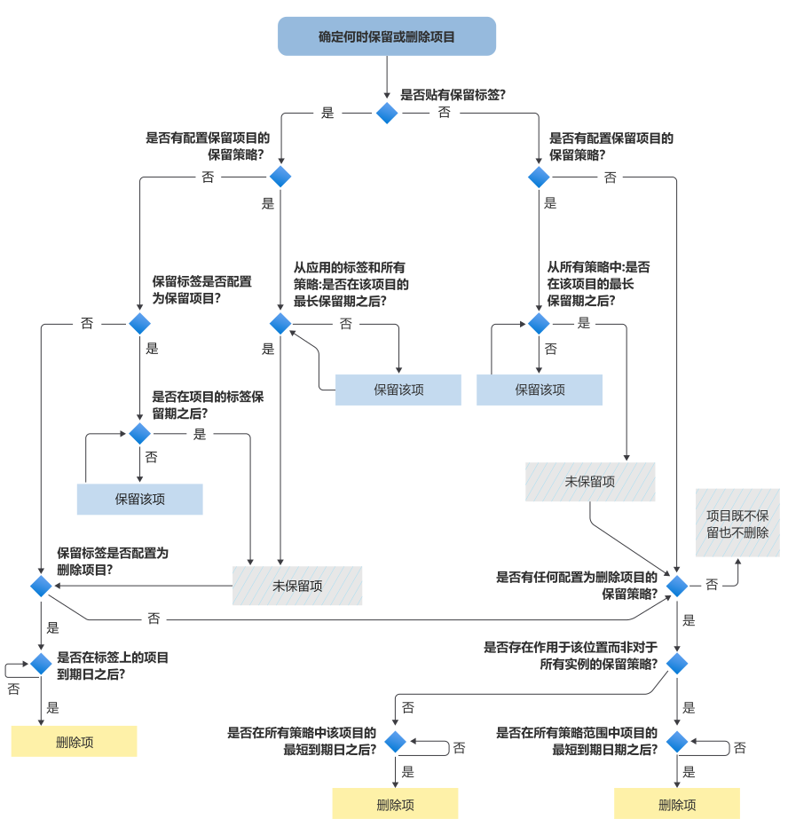

# 用于确定何时保留或永久删除项的流程图

>*[Microsoft 365 安全性与合规性许可指南](/office365/servicedescriptions/microsoft-365-service-descriptions/microsoft-365-tenantlevel-services-licensing-guidance/microsoft-365-security-compliance-licensing-guidance)。*

使用以下流程图将 [保留策略](retention.md#the-principles-of-retention-or-what-takes-precedence) 应用于项，以确定系统因保留标签或保留策略是将其保留还是永久删除。

当下列任一条件适用时，此逻辑流用于项：

- 应用了多个保留策略
- 存在一个保留标签和一个或多个保留策略

当某个项受电子数据展示保留约束时，它将始终保留在保留策略和保留标签的决策流之前。

如果不熟悉此流程图中使用的任何术语，请参阅 [了解保留策略和保留标签](retention.md)。

   

> [!NOTE]
> 请务必区分项的最长保留期与保留策略或标签中指定的最长指定期。 同样，务必区分项的最短过期日期与保留策略中的最短指定期。
> 
> 有关详细信息，请参阅 [保留原则](retention.md#the-principles-of-retention-or-what-takes-precedence) 部分中图形后面的说明。
