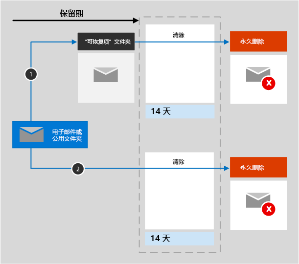

# 了解用于 Exchange 的保留

本文中的信息是对 [了解保留](retention.md) 的补充，因为它包含特定于 Exchange 的信息。有关其他工作负载，请参阅：

- [了解用于 SharePoint 和 OneDrive 的保留](retention-policies-sharepoint.md)
- [了解用于 Microsoft Teams 的保留](retention-policies-teams.md)
- [了解用于 Yammer 的保留](retention-policies-yammer.md)

## 保留和删除包括哪些内容

可通过使用保留策略和保留标签来保留和删除来自用户邮箱和共享邮箱的以下以下 Exchange 项目：带有任何附件的邮件（包括已收到的邮件、草稿、已发送的邮件）、具有结束日期的任务和注释。 

保留策略支持具有结束日期的日历项目，但保留标签不支持。

不支持联系人以及任何没有结束日期的任务和日历项目。

存储在邮箱中的其他项目（如 Skype 和 Teams 消息）不包括在 Exchange 的保留策略或标签内。这些项目有自己的保留策略。

## 用于 Exchange 的保留的工作原理

邮箱和公用文件夹都使用 [可恢复项目文件夹](/exchange/security-and-compliance/recoverable-items-folder/recoverable-items-folder) 来保留项目。只有已分配有电子数据展示权限的人员才能查看其他用户的可恢复邮件文件夹中的项目。
  
当用户从“已删除邮件”文件夹以外的文件夹中删除邮件时，默认情况下，该邮件将移动到“已删除邮件”文件夹中。但是，用户可以软删除 (Shift+Delete) 任何文件夹中的邮件，这会避开“已删除邮件”文件夹，直接将邮件移至“可恢复的项目”文件夹中。
  
将保留设置应用于 Exchange 数据时，计时器作业会定期评估“可恢复的项目”文件夹中的项目。 如果某项目与至少一个保留策略或保留标签的规则不匹配，则将从“可恢复的项目”文件夹中永久删除该项目（亦称为“硬删除”）。

> [!NOTE]
> 由于[第一个保留策略](retention.md#the-principles-of-retention-or-what-takes-precedence)，如果由于另一个保留策略或保留标签而必须保留同一项目，或者由于法律或调查原因而处于电子数据展示保留状态，则永久删除始终处于暂停状态。

计时器作业运行可能需要长达七天时间，并且 Exchange 位置必须至少包含 10 MB。
  
当用户尝试更改邮箱邮件的属性（如主题、正文、附件、发件人和收件人或邮件发送和接收日期）时，在提交更改之前，会将原始邮件的副本保存到“可恢复的项目”文件夹中。每个后续更改都会执行此操作。保留期结束时，将永久删除“可恢复的项目”文件夹中的副本。

在向 Exchange 内容应用保留设置后，内容路径取决于保留设置是“保留后删除”、“仅保留”还是“仅删除”。

如果保留设置为“保留后删除”：

1. 在保留期内，用户 **如果修改或永久删除该项**（按 SHIFT+DELETE 或从已删除项文中删除）：则该项移动（如果编辑则复制）到可恢复项目文件夹中。计时器作业在此处定期运行，并确定保留期到期的项。保留期到期后 14 天内，将永久删除这些向。请注意，默认设置为 14 天，但也可配置为最多 30 天。

2. **如果未在保留期内修改或删除邮件**：对邮箱中的所有文件夹定期运行相同的流程，识别超过保留期限的邮件，并在保留期限结束后 14 天内将这些邮件永久删除。请注意，默认设置是 14 天，但可以将其配置为最多 30 天。 

如果保留设置为“仅保留”或“仅删除”，内容路径在“保留后删除”策略的基础上有所变化：

### “仅保留”保留设置的内容路径

1. **如果有人在保持期内修改或删除项**：则会在“可恢复的项”文件夹中创建原始项的副本，并保留到保持期结束，然后“可恢复的项”文件夹中的副本会在到期后的 14 天后永久删除。 

2. **如果项在保持期内未遭修改或删除**：保持期前后无变化；项仍保留在它的原始位置上。

### “仅删除”保留设置的内容路径

1. **如果项目在配置的期限内未遭删除**：在保留策略中配置的期限结束时，项目会移到“可恢复的项目”文件夹中。 

2. **如果项目在配置的期限内遭到删除**：项目会立即移到“可恢复的项目”文件夹中。 如果用户从“可恢复的项”文件夹中删除项或清空此文件夹，该项将被永久删除。 否则，项会在“可恢复的项”文件夹中保留 14 天后永久删除。 

## 过期日期的用户通知

与其他 Microsoft 365 工作负载的保留策略不同，Exchange 的保留策略会显示用户状态，方法是在每封电子邮件的顶部显示项目到期日期最短的保留策略的名称以及该项目的计算到期日期。如果保留策略不会删除项（仅保留），则用户不会看到此通知。

如果将保留标签应用于电子邮件，则始终显示该标签的名称和相应的到期日期，并将替换应用于邮箱的任何保留策略中的名称和日期。

请记住，在此上下文中，电子邮件删除的到期日期是用户想要电子邮件自动移动到“可恢复邮件”文件夹（如果尚不存在）的日期。 “可恢复邮件”文件夹中的电子邮件不会被永久删除，但如果它们受任何保留设置的约束而保留，或者出于法律或调查原因处于电子数据展示保留状态，则出于合规性目的，将会保留这些电子邮件。

## 如果某用户离开组织 

如果离开组织的用户的邮箱已纳入保留策略中，则在删除用户的 Microsoft 365 帐户时该邮箱成为非活动邮箱。非活动邮箱中的内容仍受其变为非活动状态前对其应用的任何保留策略约束，并且可通过电子数据展示搜索找到这些内容。有关详细信息，请参阅 [Exchange Online 中的非活动邮箱](inactive-mailboxes-in-office-365.md)。

当保留设置因已永久删除数据或保留期已过期而不再适用时，Exchange 管理员现在可以 [删除非活动邮箱](delete-an-inactive-mailbox.md)。在此方案中，非活动邮箱不会自动删除。

## 配置指南

如果你不熟悉如何在Microsoft 365中配置保留期，请参阅[开始使用信息治理](get-started-with-information-governance.md)。

如果你已准备好配置 Exchange 的保留策略或保留标签，请参阅以下说明：
- [创建和配置保留策略](create-retention-policies.md)
- [创建保留标签并在应用中应用它们](create-apply-retention-labels.md)
- [自动向内容应用保留标签](apply-retention-labels-automatically.md)