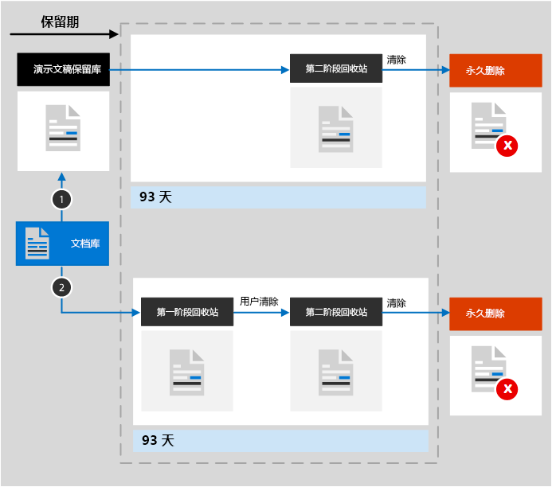

# 了解用于 SharePoint 和 OneDrive 的保留

>*[Microsoft 365 安全性与合规性许可指南](/office365/servicedescriptions/microsoft-365-service-descriptions/microsoft-365-tenantlevel-services-licensing-guidance/microsoft-365-security-compliance-licensing-guidance)。*

本文中的信息是对[了解保留](retention.md)的补充，因为它包含特定于 SharePoint 和 OneDrive 的信息。

有关其他工作负载，请参阅：

- [了解用于 Microsoft Teams 的保留](retention-policies-teams.md)
- [了解用于 Yammer 的保留](retention-policies-yammer.md)
- [了解用于 Exchange 的保留](retention-policies-exchange.md)

## 保留和删除包括哪些内容

通过应用保留策略或保留标签，可以保留 SharePoint 或 OneDrive 站点中存储的所有文件。 

可删除以下文件：

- 使用保留策略时：文档库中的所有文件包括任何自动创建的 SharePoint 文档库，如 **网站资产**。
    
- 使用保留标签时：所有文档库中的所有文件，以及根级别不在文件夹中的所有文件。
    
> [!TIP]
> 当你将[带有自动应用策略的查询用于保留标签](apply-retention-labels-automatically.md#auto-apply-labels-to-content-with-keywords-or-searchable-properties)时，可以使用以下条目排除特定文档库：`NOT(DocumentLink:"<URL to document library>")`

列表项不受保留策略支持，但是受保留标签支持，系统列表中的项例外。 这些是 SharePoint 用于管理系统的隐藏列表，并且包括主控页目录、解决方案目录和数据源。 在将保留标签应用于具有文档附件的受支持列表项时：
- 对于标准保留标签（不会将项目声明为记录）：
    - 文档附件不会自动继承标签的保留设置，但可以单独标记。
- 对于将该项目声明为记录的保留标签： 
    - 如果文档附件尚未标记，则文档附件会自动从标签继承保留设置。

保留策略和保留标签的保留设置不适用于包括库、列表和文件夹的组织结构。

对于保留策略和自动应用标签策略：必须为要应用的保留设置编制 SharePoint 网站索引。 但是，如果 SharePoint 文档库中的项目配置为不显示在搜索结果中，则此配置不会排除保留设置中的文件。

## 用于 SharePoint 和 OneDrive 的保留的工作原理

若要存储需要保留的内容，SharePoint 和 OneDrive 会创建一个保留库（如果站点不存在）。 保留库不是为交互使用而设计的，而是出于合规性原因要自动存储文件。

具有标准保留标签（不声明项目为记录）的 SharePoint 中的项目不需要保留库，因为这些项将保持在其原始位置。 当应用保留标签配置为保留内容时，SharePoint 会防止用户删除项目，而 SharePoint 版本控制功会在编辑项目时保留较旧版本。 但是对于其他方案，当项目必须保留时，会使用保留库：
- OneDrive 中具有标准保留标签的项目
- SharePoint 或 OneDrive 中具有保留标记为记录标签的项目，并且该项目未锁定可以用于编辑
- 受保留策略管理的项目

若要在用户尝试更改或删除内容时保留此内容，会检查自应用保留设置起内容是否发生更改。 如果这是自应用保留设置以来的首次更改，则会将内容复制到保留库中，用户可以在其中更改或删除原始内容。
  
计时器作业会定期清理保留库。 对于在保留库中保留超过 30 天的内容，此作业将内容与该内容的保留设置所使用的全部查询进行比较。 早于其配置的保留期的内容将从保留库和原始位置（如果仍在该位置）中删除。 此计时器作业每 7 天运行一次，这意味着在最少 30 天内，从保留库中删除内容可能需要多达 37 天。

将文件复制到保留库中的这种行为适用于应用保留设置时已经存在的内容。另外，对于保留策略，策略中添加网站集后在网站集中创建或添加的所有新内容都会保留在保留库中。不过，只有在被删除后，新内容才会被复制到保留库中，首次获得编辑时并不会被复制。若要保留一个文件的所有不同版本，需要启用 [版本控制](#how-retention-works-with-document-versions)。
  
如果用户尝试删除受保留的库、列表、文件夹或网站，则会看到错误消息。 如果用户首次移动或删除文件夹中受该策略约束的任何文件，可删除一个文件夹。

在向 OneDrive 帐户或 SharePoint 网站中的内容分配保留设置后，内容路径取决于保留设置是“保留后删除”、“仅保留”还是“仅删除”。

如果保留设置为“保留后删除”：

  
1. **如果内容在保持期内遭修改或删除**：则会在保留库中创建在分配保留设置时存在的原始内容的副本。 计时器作业可识别保留期限已过期的项目。 这些项目会被移到第二阶段回收站中，并在 93 天后永久删除。 第二阶段回收站对最终用户不可见（仅第一阶段回收站可见），但网站集管理员可以在其中查看和还原内容。

    > [!NOTE]
    > 为了防止意外的数据丢失，不再从保留库中永久删除内容。 相反，只从回收站中永久删除内容，因此保留库中的所有内容现在都要移到第二阶段回收站。
    
2. **如果用户在保留期内未修改或删除内容**，内容会在保留期到期时移至第一阶段回收站。如果用户从中删除内容或清空此回收站（亦称为“清除”），文档会移至第二阶段回收站。93 天保留期包含在第一阶段和第二阶段回收站中的保留时间。93 天过后，文档会从其驻留的任何位置（第一阶段或第二阶段回收站）被永久删除。请注意，由于未将回收站编入索引，因此无法搜索查找内容。也就是说，电子数据展示保留无法保留内容，因为在回收站中找不到任何内容。

> [!NOTE]
> 由于[第一个保留策略](retention.md#the-principles-of-retention-or-what-takes-precedence)，如果由于另一个保留策略或保留标签而必须保留同一项目，或者由于法律或调查原因而处于电子数据展示保留状态，则永久删除始终处于暂停状态。

如果保留设置为“仅保留”或“仅删除”，内容路径在“保留后删除”策略的基础上有所变化：

### “仅保留”保留设置的内容路径

1. **如果有人在保持期内修改或删除内容**：则会在保留库中创建原始文档的副本，并保留到保持期结束，然后保留库中的副本会移到第二阶段回收站中，并在 93 天后永久删除。

2. **如果内容在保持期内未遭修改或删除**：保持期前后无变化；文档仍保留在它的原始位置上。

### “仅删除”保留设置的内容路径

1. **如果有人在配置的期限内删除内容**：文档会移到第一阶段回收站中。 如果用户从此回收站中删除文档或清空此回收站，文档就会移到第二阶段回收站中。 在第一阶段和第二阶段回收站中的停留时间都计入 93 天保持期。93 天后，无论文档是位于第一阶段回收站中，还是位于第二阶段回收站中，都会从驻留位置永久删除。 如果有人在配置的期限内修改内容，内容就会在配置的期限到期后遵循相同的删除路径。

2. **如果用户在保留期内未修改或删除内容**：内容会在保留期到期时移至第一阶段回收站。如果用户从中删除内容或清空此回收站（亦称为“清除”），文档会移至第二阶段回收站。93 天保留期包含在第一阶段和第二阶段回收站中的保留时间。93 天过后，文档会从其驻留的任何位置（第一阶段或第二阶段回收站）被永久删除。请注意，由于未将回收站编入索引，因此无法搜索查找内容。也就是说，电子数据展示保留无法保留内容，因为在回收站中找不到任何内容。

## 用于 OneNote 内容的保留的工作原理

当你将保留策略应用于包含 OneNote 内容的位置时，在幕后，不同的 OneNote 部分是单独的文件。 这意味着将根据指定的保留设置分别保留和删除每个分区。

## 如何保留文件版本

版本控制是 SharePoint Online 和 OneDrive 中所有文档库的一项功能。默认情况下，版本控制至少保留 500 个主要版本，但可以提高此限制。有关详细信息，请参阅[为列表或库启用和配置版本控制](https://support.office.com/article/1555d642-23ee-446a-990a-bcab618c7a37)和[版本控制在列表和库中的工作方式](https://support.microsoft.com/office/how-versioning-works-in-lists-and-libraries-0f6cd105-974f-44a4-aadb-43ac5bdfd247)。
  
当带有版本的文档受制于保留设置以保留该内容时，复制到保留库的版本将作为一个单独的项目存在。 如果保留设置在保留期结束时设置为删除：

- 如果保留期以内容创建时间为依据，每一版文档的到期日期都与原始文档相同。原始文档及其各版本全都在同一时间到期。

- 如果保留期以内容的上次修改时间为依据，每一版文档都有自己的到期时间（依据为修改原始文档以创建相应版本的时间）。原始文档及其各版本的到期互不相干。

当保留操作为删除文档时，根据当前版本，将同时删除不在保留库中的所有版本。

对于受制于保留策略（或保留电子数据展示）的项目，将忽略文档库的版本限制，直到达到文档的保留期限（或释放电子数据展示保留）。在本场景中，不会自动清除旧版本，并且用户无法删除版本。

当内容不受制于保留策略（或保留电子数据展示）时，保留标签的情况就不是如此了。 相反，它将遵循版本控制限制，以便自动删除旧版本以容纳新版本，但仍阻止用户删除版本。

## 如果某用户离开组织

**SharePoint**：

如果某用户离开组织，此用户创建的任何内容都不会受到影响，因为 SharePoint 被视为协作环境，与用户的邮箱或 OneDrive 帐户不同。

**OneDrive**：

如果某用户离开组织，任何受保留策略约束或包含保留标签的文件都会在策略或标签有效期间保留。 在此期间，所有共享访问继续有效。 在保留期到期后，内容会移到网站集回收站，且不可供除管理员之外的其他任何人访问。如果文档被保留标签标记为记录，那么文档在保留期到期前不会被删除，到期后将被永久删除。

## 配置指南

如果你刚开始在 Microsoft 365 中配置保留，请参阅[开始使用保留策略和保留标签](get-started-with-retention.md)。

如果你已准备好配置 Exchange 的保留策略或保留标签，请参阅以下说明：
- [创建和配置保留策略](create-retention-policies.md)
- [创建保留标签并在应用中应用它们](create-apply-retention-labels.md)
- [自动向内容应用保留标签](apply-retention-labels-automatically.md)