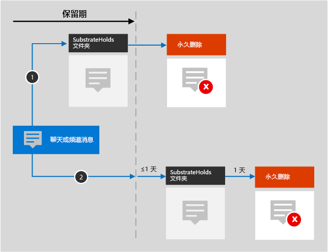
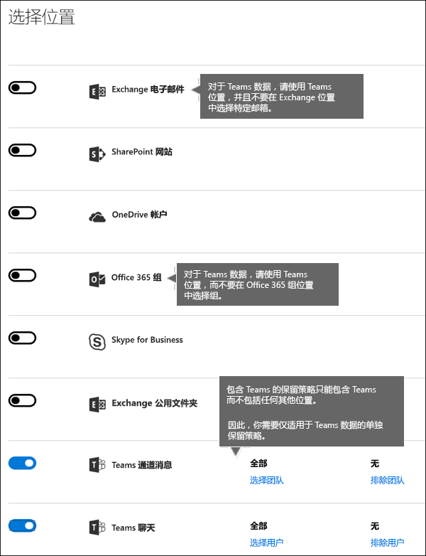

# 保留策略概述

>*[Microsoft 365 安全性与合规性许可指南](https://aka.ms/ComplianceSD)。*

对于大多数组织，数据量和数据复杂性每天都在增加 — 包括电子邮件、文档、即时消息等。有效管理或管理此类信息非常重要，因为要：
  
- **主动遵守规定至少必须在一段时间内保留内容的行业法规和内部策略**：例如，《萨班斯-奥克斯利法案》规定，必须保留特定类型的内容七年。 
    
- **降低发生诉讼或出现安全漏洞的风险**：通过永久删除不再需要保留的旧内容。 
    
- **帮助组织有效共享知识并提高敏捷性**：通过确保用户仅处理与自己相关的最新内容。 
    
保留策略可有助于实现所有这些目标。管理内容通常需要执行以下两项操作：
  
- **保留**内容，这样除非保留期到期，否则无法永久删除内容。 
    
- 在保留期到期时永久**删除**内容。 
    
借助保留策略，你可以：
  
- 主动决定是保留内容还是删除内容 — 亦或是先保留再删除内容。
    
- 将一个策略应用于整个组织，或应用于特定位置或用户。
    
- 将策略应用于所有内容，或应用于满足特定条件（如包含特定关键字或[特定类型敏感信息](what-the-sensitive-information-types-look-for.md)）的内容。
    
如果内容受保留策略约束，用户可以继续编辑和处理内容，就像什么都没改变一样，因为内容留在原处。但若有人编辑或删除受保留策略约束的内容，内容副本就会保存到内容的安全保留位置上，直至策略失效。
  
最后，一些组织必须遵守法规，如美国证券交易委员会 (SEC) 法规 17a-4，这条法规要求在启用保留策略后，不得禁用保留策略或削弱它的限制性。为了遵守这项要求，可以使用保留锁定。保留策略一旦锁定，任何人（包括管理员）都无法禁用保留策略或削弱它的限制性。
  
可以在 [Microsoft 365 合规中心](https://compliance.microsoft.com/)内创建和管理保留策略：依次转到“**策略**” > “**数据**” > “**保留**”

也可以使用“**解决方案**” > “**信息治理**” > “**保留**”选项卡转到 Microsoft 365 合规中心内的相同位置。 

**如果希望能够在永久删除内容之前对其进行审阅，** 考虑使用”[保留标签](labels.md)”，而不是保留策略。 创建保留标签时，可设置“[处置审阅](disposition.md#disposition-reviews)”，以便在保留期结束时查看内容。

## 保留策略如何处理留在原处的内容

如果在保留策略中添加网站或邮箱等位置，内容仍留在原处。用户可以继续处理文档或邮件，就像什么都没改变一样。但若用户编辑或删除受保留策略约束的内容，将会保留在策略应用时存在的内容的副本。
  
对于 SharePoint 网站集，如果用户编辑或删除内容，原始内容的副本保留到保留库中；对于电子邮件或公用文件夹，副本保留到“可恢复项”文件夹中。这些安全位置和已保留内容对大多数用户都不可见。用户甚至都无需知晓其内容受保留策略约束。
  
注意：
  
- Teams（聊天）内容存储在 Exchange 中，其中策略根据消息类型（电子邮件或对话）进行应用。
    
- 应用于 Office 365 组的保留策略涵盖组的邮箱和网站。

- 保存保留库将占用网站的存储配额。
    
### OneDrive 帐户和 SharePoint 网站中的内容

保留策略在网站集级别进行应用。 如果你在保留策略中添加 SharePoint 网站集或 OneDrive 帐户，则会使用保留库来保留文档。 如果此库尚不存在，就会自动创建它。 你可在网站集的最顶级网站中的“**网站内容**”上查看此库。 大多数用户都无法查看保留库，因为此库仅对网站集管理员可见。
  
如果有人尝试更改或删除网站中受“保留后删除”或“仅保留”策略约束的内容，策略会先检查自应用策略后内容是否发生过更改。 如果这是应用保留策略后的首次更改，则保留策略会将内容复制到保留库中，然后允许用户更改或删除原始内容。 网站集上的所有内容都可以复制到保留库中，即使内容与保留策略使用的查询不匹配。

将内容复制到保留库适用于在保留策略应用时就已存在的内容。 此外，对于在保留策略中添加网站集后在网站集中创建或添加的所有新内容都会在删除后保留。 然而，新内容不会在第一次编辑时就复制到保留库，只有在删除时才会这样做。 若要保留文件的所有版本，请按照后面[部分](#how-a-retention-policy-works-with-document-versions-in-a-site-collection)中的说明操作，以启用版本控制。
  
请注意，如果用户尝试删除受保留策略约束的库、列表、文件夹或网站，将收到错误提示。 如果用户首次移动或删除文件夹中受该策略约束的任何文件，可删除一个文件夹。 另请注意，仅在需要将第一个项目复制到库时才创建保留库（而不是在创建保留策略时）。 因此，若要测试策略，首先需要编辑或删除网站中受策略约束的文档，然后转到保留库来查看保留的副本。
  
将保留策略分配给 OneDrive 帐户或 SharePoint 网站后，内容路径取决于保留策略是“保留后删除”、“仅保留”还是“仅删除”。

如果保留策略为“保留后删除”：

  
1. **如果有人在保持期内修改或删除内容**：则会在保留库中创建在分配保留策略时的原始内容的副本。 在保留库中，计时器作业定期运行，并标识保持期已到期的项。 然后，这些项会被移到第二阶段回收站中，并在 93 天后永久删除。 第二阶段回收站对最终用户不可见（仅第一阶段回收站可见），但网站集管理员可以在其中查看和还原内容。

    > [!NOTE]
    > 为了防止意外的数据丢失，内容绝不会从保留库中自动删除，而是移到第二阶段回收站中。 其中的 93 天宽限期可便于管理员在必要时恢复此内容。
    
2. **如果内容在保持期内未遭修改或删除**：在保持期结束时，文档会移到第一阶段回收站中。 如果用户从此回收站中删除文档或清空此回收站（亦称为“清除”），文档就会移到第二阶段回收站中。 在第一阶段和第二阶段回收站中的停留时间都计入 93 天保持期。93 天后，无论文档是位于第一阶段回收站中，还是位于第二阶段回收站中，都会从驻留位置永久删除。 回收站未被编入索引，因此无法进行搜索。 因此，电子数据展示搜索无法找到任何要在其上保留的回收站内容。 

如果保留策略为“仅保留”或“仅删除”，内容路径在“保留后删除”策略的基础上有所变化：

#### “仅保留”保留策略的内容路径

1. **如果有人在保持期内修改或删除内容**：则会在保留库中创建原始文档的副本，并保留到保持期结束，然后保留库中的副本会移到第二阶段回收站中，并在 93 天后永久删除。

2. **如果内容在保持期内未遭修改或删除**：保持期前后无变化；文档仍保留在它的原始位置上。

#### “仅删除”保留策略的内容路径

1. **如果有人在保持期内删除内容**：文档会移到第一阶段回收站中。 如果用户从此回收站中删除文档或清空此回收站，文档就会移到第二阶段回收站中。 在第一阶段和第二阶段回收站中的停留时间都计入 93 天保持期。93 天后，无论文档是位于第一阶段回收站中，还是位于第二阶段回收站中，都会从驻留位置永久删除。 如果有人在保持期内修改内容，内容就会在到期后遵循相同的删除路径。

2. **如果内容在保持期内未遭删除**：在保持期结束时，文档会移到第一阶段回收站中。 如果有人在保持期内删除内容，文档会立即移到第一阶段回收站中。 如果用户从此回收站中删除文档或清空此回收站（亦称为“清除”），文档就会移到第二阶段回收站中。 在第一阶段和第二阶段回收站中的停留时间都计入 93 天保持期。93 天后，无论文档是位于第一阶段回收站中，还是位于第二阶段回收站中，都会从驻留位置永久删除。 回收站未被编入索引，因此无法进行搜索。 因此，电子数据展示搜索无法找到任何要在其上保留的回收站内容。

### 邮箱和公用文件夹中的内容

对于用户的邮件、日历和其他项，保留策略是在邮箱一级进行应用。对于公用文件夹，保留策略是在文件夹一级（而不是邮箱一级）进行应用。邮箱和公用文件夹都使用“可恢复项”文件夹来保留项。只有拥有电子数据展示权限的用户，才能查看其他用户的“可恢复项”文件夹中的项。
  
默认情况下，如果用户从除“已删除项”文件夹以外的文件夹中删除邮件，邮件移至“已删除项”文件夹中。如果用户从“已删除项”文件夹中删除项，项移至“可恢复项”文件夹中。此外，用户还可以软删除 (SHIFT+DELETE) 任何文件夹中的项，这会避开“已删除项”文件夹，直接将项移至“可恢复项”文件夹中。
  
有一个流程定期评估“可恢复项”文件夹中的项。除非某项与至少一个保留策略的规则匹配，否则就会从“可恢复项”文件夹中永久删除（亦称为“硬删除”）。
  
当用户尝试更改邮箱邮件的特定属性（如主题、正文、附件、发件人和收件人或邮件发送和接收日期）时，在提交更改之前，会将原始邮件的副本保存到“可恢复的项目”文件夹中。 每个后续更改都会执行此操作。 保留期结束时，将永久删除“可恢复的项目”文件夹中的副本。
  
如果保留策略为“保留后删除”：

1. **如果用户在保留期内修改或永久删除项**（按 SHIFT+DELETE 或从“已删除项”文件夹中删除）：项移至（如果用户编辑项，则项复制到）“可恢复项”文件夹中。随后，有一个流程会定期运行，并确定保留期到期的项，这些项在保留期到期后的 14 天内被永久删除。请注意，默认设置为 14 天，但也可最多配置为 30 天。
    
2. **邮件未被修改或删除**：如果邮件在保留期限内未被修改或删除，则会对邮箱中的所有文件夹定期运行相同的流程，识别超过保留期限的邮件，并在保留期限结束后 14 天内将这些邮件永久删除。 请注意，默认设置是 14 天，但可以将其配置为最多 30 天。 如果保留策略为“仅保留”或“仅删除”，内容路径在“保留后删除”策略的基础上有所变化：

#### “仅保留”保留策略的内容路径

1. **如果有人在保持期内修改或删除项**：则会在“可恢复的项”文件夹中创建原始项的副本，并保留到保持期结束，然后“可恢复的项”文件夹中的副本会在到期后的 14 天后永久删除。 

2. **如果项在保持期内未遭修改或删除**：保持期前后无变化；项仍保留在它的原始位置上。

#### “仅删除”保留策略的内容路径

1. **如果项在保持期内未遭删除**：在保持期结束时，项会移到“可恢复的项”文件夹中。 

2. **如果有人在保持期内删除项**，项会立即移到“可恢复的项”文件夹中。 如果用户从“可恢复的项”文件夹中删除项或清空此文件夹，项就会永久删除。 否则，项会在“可恢复的项”文件夹中保留 14 天后永久删除。 

### 如果某用户离开组织

**Exchange** 

如果某用户离开组织，且此用户的邮箱包含在保留策略内，那么在此用户的 Office 365 帐户遭到删除后，其邮箱会变成非活动状态。 非活动邮箱的内容仍受在邮箱变成非活动状态之前对邮箱应用的所有保留策略约束，且内容支持电子数据展示搜索。 有关详细信息，请参阅 [Exchange Online 中的非活动邮箱](inactive-mailboxes-in-office-365.md)。

**OneDrive**

如果某用户离开组织，任何受保留策略约束或包含保留标签的文件都会在策略或标签有效期间保留。 在此期间，所有共享访问继续有效。 在保留期到期后，内容会移到网站集回收站，且不可供除管理员之外的其他任何人访问。如果文档被保留策略标记为记录，那么它在保留期到期前不会遭到删除，之后将永久删除。

**SharePoint**

如果某用户离开组织，此用户创建的任何内容都不会受到影响，因为 SharePoint 被视为协作环境，与用户的邮箱或 OneDrive 帐户不同。

## 保留策略如何处理网站集中的文档版本

版本控制是 SharePoint Online 和 OneDrive for Business 中所有文档库的一项功能。 默认情况下，版本控制至少保留 500 个主要版本，但可以提高此限制。 有关详细信息，请参阅[为列表或库启用和配置版本控制](https://support.office.com/article/1555d642-23ee-446a-990a-bcab618c7a37)。
  
保留策略（保留内容而不是仅删除内容的保留策略）将保留 SharePoint 网站集或 OneDrive 帐户中文档的所有版本。 当受保留策略约束的文档被首次编辑时，都会将原始文档的一个版本复制到保留库中。 当受保留策略约束的文档遭删除时，如果版本控制已启用，所有版本都会复制到保留库中。 在保存保留库中，文档的每个版本都以单独项目的形式存在，并具有自己的保留期：
  
- 如果保留策略以内容创建时间为依据，每一版文档的到期日期都与原始文档相同。原始文档及其各版本全都在同一时间到期。
    
- 如果保留策略以内容的上次修改时间为依据，每一版文档都有自己的到期时间（依据为修改原始文档以创建相应版本的时间）。原始文档及其各版本的到期互不相干。

> [!NOTE]
> 电子数据展示工具无法用于搜索 SharePoint 和 OneDrive 文档的保留版本。

## 将内容保留一段特定时间

使用保留策略，可以无限期地保留内容，也可将内容保留特定天数、月数或年限。 内容的保留期限是从内容创建的时间开始计算，而不是从应用保留策略的时间开始计算。 可以选择根据内容创建的时间或（针对 OneDrive 和 SharePoint）最后一次修改内容的时间来计算保留期限。
  
例如，若要将网站集自上次修改起保留 7 年，且网站集中的某文档已有 6 年未经修改，那么此文档只能再保留 1 年，前提是仍未经修改。如果文档再获编辑，文档年限会从最后一次修改日期开始计算，并再保留 7 年。
  
同样，若要将邮箱内容保留 7 年，且某邮件是在 6 年前发送，那么此邮件只能再保留 1 年。对于 Exchange 内容，年限始终以接收日期或发送日期（两个日期相同）为依据。以上次修改时间为依据保留内容仅适用于 OneDrive 和 SharePoint 中的网站内容。
  
可以选择是否想在保留期限结束后永久删除内容。 保留策略也可直接删除旧内容而不进行保留。 请参阅下一部分。
  

  
## 删除超过特定年限的内容

保留策略既可以先保留再删除内容，也可以删除旧内容，而不保留它。
  
如果保留策略删除内容，请务必了解为保留策略指定的时间期限是从文件创建或修改时开始计算，而不是从策略分配时开始计算。
  

  
例如，假设创建的保留策略删除年限超过 3 年的内容，且保留策略分配给所有 OneDrive 帐户，其中包含许多在四五年前创建的内容。在此示例中，许多内容会在保留策略首次分配后很快就被删除。因此，**删除内容的保留策略可能会对内容产生相当大的影响**。 
  
因此，首次将保留策略分配到网站集之前，应先考虑现有内容的年限，以及保留策略可能会对此内容产生的影响。我们还建议在分配策略前向用户传达新策略，让用户有时间评估策略可能会产生的影响。请注意，在创建保留策略前检查策略设置时会看到以下警告。
  

  
## 将保留策略只应用于满足特定条件的内容的高级设置

保留策略可应用于其中所含位置上的全部内容，你也可以选择将保留策略只应用于包含特定关键字或[特定类型敏感信息](what-the-sensitive-information-types-look-for.md)的内容。
  

  
### 保留包含特定关键字的内容

可以将保留策略只应用于满足特定条件的内容，再对相应内容执行保留操作。目前可用的条件支持将保留策略应用于包含特定字词或短语的内容。可使用搜索运算符（如 AND、OR 和 NOT）优化查询。若要详细了解这些运算符，请参阅[适用于内容搜索的关键字查询和搜索条件](keyword-queries-and-search-conditions.md)。
  
即将支持添加可搜索属性（例如，**subject:**）。
  
基于查询的保留策略使用搜索索引来标识内容。
  

  
### 保留包含敏感信息的内容

此外，还可以将保留策略只应用于包含[特定类型敏感信息](what-the-sensitive-information-types-look-for.md)的内容。例如，可选择将唯一保留要求只应用于包含个人身份信息（PII，如纳税人标识号、身份证号或护照号）的内容。
  

  
注意：
  
- 敏感信息的高级保留设置不适用于 Exchange 公用文件夹或 Skype for Business，因为这些位置不支持敏感信息类型。
    
- 你应该明白，Exchange Online 使用邮件流规则（也称为传输规则）来标识敏感信息，因此这仅适用于传输中的邮件，并不适用于邮箱中已存储的所有邮件。对于 Exchange Online，这意味着保留策略可标识敏感信息，并仅对在策略应用于邮箱**后**收到的邮件执行保留操作。（请注意，上一部分中介绍的基于查询的保留没有此限制，因为它使用搜索索引来标识内容）。 
    
## 将保留策略应用于整个组织或特定位置

可以将保留策略轻松地应用于整个组织、位置整体，或只应用于特定位置或用户。
  
### 组织范围策略

保留策略的最强大功能之一是，它可以应用于 Office 365 中的所有位置，包括：
  
- Exchange 电子邮件
    
- SharePoint 网站集
    
- OneDrive 帐户
    
- Office 365 组（适用于组的邮箱和相关 SharePoint 网站中的内容。）
    
- Exchange 公用文件夹
    

组织范围保留策略的其他重要功能包括：
  
- 策略可包含任意多个邮箱或网站。
    
- 对于 Exchange，在保留策略应用后新建的任何邮箱都会自动继承策略。
  
### 应用于位置整体的策略

选择位置时，可以轻松包含或排除整体位置，例如 Exchange 电子邮件或 OneDrive 帐户。 若要执行此操作，将该位置的“**状态**”切换为开或者关。 
  
与组织范围策略一样，如果策略应用于任意组合的位置整体，策略可包含任意多个邮箱或网站。例如，如果策略包含所有 Exchange 电子邮件和所有 SharePoint 网站，那么全部网站和邮箱都会包含在内，无论有多少个。对于 Exchange，在保留策略应用后新建的任何邮箱都会自动继承策略。

### 包含或排除特定位置、用户或组的策略

还可将保留策略应用于特定用户、Office 365 组或网站。为此，请先将相应位置的“**状态**”切换为“开”，再使用链接来添加或排除特定用户、Office 365 组或网站。 
  
但请注意，当你配置包含或排除超过 1,000 个特定位置的保留策略时，存在以下限制：
  
- 保留策略的最大数量：
    - 1,000 个邮箱
    - 1,000 个 Office 365 组
    - 1000 个用户的 Teams 私人聊天
    - 100 个网站（OneDrive 或 SharePoint）

- 租户最多可包含 10,000 个保留策略。
    
尽管存在这些限制，但可通过应用组织范围的策略或应用于整体位置的策略来避免这些限制。
  
### Skype 位置

与 Exchange 电子邮件不同，将 Skype 位置的状态切换为“开”并不能添加所有用户，但启用相应位置后，就可以手动选择要保留哪些用户的对话：

  
选择“选择用户”时，选择列标题中的“名称”**** 框可快速包含所有用户****。 但是，请务必了解每个用户在策略中都被算作一个特定的包含内容。 因此，当包括的用户超过 1,000 位时，会应用上一部分中所述的限制。 这里所说的选择所有 Skype 用户不同于组织范围的策略在默认情况下包含所有 Skype 用户。 
  

  
请注意，Outlook 中的“对话历史记录”**** 文件夹是一项与 Skype 存档无关的功能。“对话历史记录”**** 可以由最终用户禁用，但 Skype 存档是通过将 Skype 对话副本存储在用户无法访问但电子数据展示可访问的隐藏文件夹中而完成。

### SharePoint 位置

保留策略可以保留 SharePoint 通信网站、未通过 Office 365 组连接的团队网站以及经典网站中的内容。 因为此选项不支持通过 Office 365 组连接的团队网站，所以请改用“Office 365 组”**** 位置。

如果你指定的网站不受支持，保留策略会忽略这些网站。

如果为 SharePoint 网站指定位置，无需网站访问权限，且在“编辑位置”**** 页上指定 URL 时不会进行任何验证。 不过，必须将网站编入索引，系统会检查你指定的网站是否在向导结束时存在。

如果此检查失败，你会看到一条消息，指明无法验证你所输入的 URL，且只有在验证检查通过后，向导才会创建保留策略。 如果你看到此消息，请返回到向导，以更改 URL 或删除网站。

### Teams 位置

> [!NOTE]
> 我们尚不支持配置保留私人频道消息。 支持保留在私人渠道中共享的文件。

保留策略可用于保留 Teams 中的聊天和信道消息。Teams 聊天存储在聊天中每位用户的邮箱的隐藏文件夹中，而 Teams 信道消息则存储在团队的组邮箱的类似隐藏文件夹中。不过，请务必了解 Teams 使用的是 Azure 助力聊天服务，这项服务也存储此类数据，且默认永久存储数据。因此，强烈建议使用 Teams 位置来保留和删除 Teams 数据。使用 Teams 位置将从 Exchange 邮箱和 Azure 助力基础聊天服务中永久删除数据。有关详细信息，请参阅 [Microsoft Teams 中的安全与合规概述](https://go.microsoft.com/fwlink/?linkid=871258)。
  
Teams 聊天和频道消息不受应用于 Exchange 或 Office 365 组位置中用户或组邮箱的保留策略的影响。 即使 Teams 聊天和频道消息存储在 Exchange 中，它们也仅受到应用于 Teams 位置的保留策略的影响。

> [!NOTE]
> 如果用户包含在保留 Teams 数据的活动保留策略中，并且删除了包含在此策略中的用户邮箱，为了保留数据，邮箱会转换为[非活动的邮箱](inactive-mailboxes-in-office-365.md)。 如果不需要为用户保留此数据，在删除用户的邮箱之前，将其从保留策略中排除。
  
为团队分配保留策略后，聊天和频道消息可以遵循以下两种路径之一：

1. **如果在保留期内用户修改或删除了聊天或频道消息**，则该消息将移动（或在编辑的情况下复制）到 SubstrateHolds 文件夹（它是每个用户或组邮箱中的隐藏文件夹），并保留在该文件夹中，直到保留期到期。 在保留期到期之日，该消息将被永久删除。

2. **如果在保留期内未删除聊天或频道消息**，则该消息将在保留期到期后的一天内（ 0 到 24 小时）移至 SubstrateHolds 文件夹。 将消息移至 SubstrateHolds 文件夹一天后，该消息将被永久删除。 

> [!NOTE]
> 可通过电子数据展示工具搜索 SubstrateHolds 文件夹中的消息。 永久删除消息后，它不会在电子数据展示搜索中返回。

我们正在不断努力优化 Teams 中的保留功能，并计划在未来几个月发布新功能。 同时，下面介绍了应注意的一些限制：
  
- **Teams 需要单独的保留策略**。 创建保留策略并切换到 Teams 位置时，所有其他位置都会切换为关闭。 带有 Teams 的保留策略仅可包含 Teams，不可包含其他位置。 
    
- **组织范围策略不包含 Teams 位置**。 若要创建组织范围策略，其中不会包含 Teams 位置，因为 Teams 必须有单独的保留策略。 
    
- **Teams 不支持高级保留**。 创建保留策略时，如果选择“[将保留策略只应用于满足特定条件的内容的高级设置](#advanced-settings-that-apply-a-policy-only-to-content-that-meets-certain-conditions)”，则 Teams 位置不可用。 目前，Teams 中的保留适用于所有聊天和频道消息内容。 

- **不支持私人频道中的 Teams 内容**。 目前，为 Teams 创建的保留策略不适用于私人频道消息。 只有标准频道中的消息受为 Teams 团队创建的保留策略的约束。 即将推出对私人频道保留策略的支持。 
    
- **Teams 最多可能需要三天的时间来清理过期的消息**。 应用于 Teams 的保留策略将在保留期到期时删除聊天和频道消息。 但是，它最多可能需要三天的时间来清理这些消息并永久删除它们。 此外，在保留期到期后和永久删除消息期间，可以使用电子数据展示工具搜索聊天和频道消息。

   > [!NOTE]
   > 过去的情况是，保留策略无法删除短于 30 天的 Teams 内容，但是我们已经删除了此限制。 现在，Teams 内容的保留期可以是你选择的任意天数，它可以短至 1 天。 如果保留期为一天，则在保留期到期后的最多三天内将永久删除消息。
    
在 Teams 中，聊天中共享的文件存储在共享文件的用户的 OneDrive 帐户中。 上传到通道的文件存储在团队的 SharePoint 站点中。 因此，若要在 Teams 中保留或删除文件，必须创建适用于 OneDrive 和 Microsoft 365 组位置的保留策略。 若要将策略应用于仅由特定用户或团队在 Teams 中共享的文件，可以选择 OneDrive 或 Microsoft 365 组位置，并添加特定用户或团队。
  
应用于 Teams 的保留策略可使用[保留锁定](#locking-a-retention-policy)。
  

  
> [!NOTE]
> 如果为组织中的 Skype 或 Teams 位置创建保留策略，则当用户在 Outlook 桌面客户端中查看邮箱文件夹的属性时，这些策略中的某个策略将显示为默认文件夹策略。 这是 Outlook 中的错误显示问题，也是一个[已知问题](https://support.microsoft.com/help/4491013/outlook-client-displays-teams-or-skype-for-business-retention-policies)。 应作为默认文件夹策略显示的是应用于该文件夹的邮箱保留策略。 Skype 或 Teams 保留策略不适用于用户的邮箱。  

### Microsoft 365 组位置

若要保留 Microsoft 365 组的内容，需要使用 Microsoft 365 组位置。 即使 Microsoft 365 组有 Exchange 邮箱，涵盖整个 Exchange 位置的保留策略也不会包含 Microsoft 365 组邮箱中的内容。 应用于 Microsoft 365 组的保留策略涵盖组的邮箱和网站。 应用于 Microsoft 365 组的保留策略将保护由 Microsoft 365 组（包括 Microsoft Teams）创建的资源。

此外，不可能通过使用 Exchange 位置来包含或排除某个组邮箱。 尽管 Exchange 位置最初允许选择组邮箱，但在尝试保存保留策略时，你将收到一条错误消息，表明“RemoteGroupMailbox”不是有效的 Exchange 位置选项。 

## 从保留策略中排除特定类型的 Exchange 项
使用 PowerShell，可以从保留策略中排除特定类型的 Exchange 项。例如，可以排除语音邮件、IM 对话和邮箱中的其他 Skype for Business Online 内容。此外，还可以排除日历、笔记和任务项。此功能只能通过 PowerShell 使用；无法在创建保留策略时的 UI 中使用它。
  
为此，请使用 `New-RetentionComplianceRule` 和 `Set-RetentionComplianceRule` cmdlet 的 `ExcludedItemClasses` 参数。

## 锁定保留策略
一些组织可能需要遵守监管机构法规，如美国证券交易委员会 (SEC) 法规 17a-4，这条法规要求在启用保留策略后，不得禁用保留策略或削弱它的限制性。使用保留锁定，可以锁定保留策略，包括管理员在内的任何人都无法禁用保留策略或削弱它的限制性。
  
在保留策略被锁定后，任何人都无法禁用它，也无法从策略中删除位置。此外，还无法修改或删除在保留期内受策略约束的内容。锁定策略后，只能执行以下保留策略修改操作：向策略添加位置或延长其保留持续时间。可以向已锁定策略添加位置或延长保留期，但不能减少位置或禁用策略。
  
因此，锁定保留策略前，请**务必**了解组织的合规性要求，并且仅在确定必须这样做后，才**锁定策略**。

### 使用 PowerShell 锁定保留策略
  
你只能使用 PowerShell 来锁定保留策略。

首先，[连接到 Office 365 安全与合规中心 PowerShell](https://docs.microsoft.com/powershell/exchange/office-365-scc/connect-to-scc-powershell/connect-to-scc-powershell?view=exchange-ps)。

其次，若要查看保留策略列表并找到要锁定的策略的名称，请运行 `Get-RetentionCompliancePolicy`。

第三，若要在保留策略上启用保留锁定，请运行 `Set-RetentionCompliancePolicy` 并将 `RestrictiveRetention` 参数设置为 true。 例如：

`Set-RetentionCompliancePolicy -Identity "<Name of Policy>" – RestrictiveRetention $true`

运行该 cmdlet 后，你将看到确认提示。选择“**全是**”。

现在，为保留策略提供了“保留锁定”功能。 如果运行 `Get-RetentionCompliancePolicy`，则 `RestrictiveRetention` 参数将设置为 true。 例如：

`Get-RetentionCompliancePolicy -Identity "<Name of Policy>" |Fl`

  
## 解除保留策略

可随时禁用或删除保留策略。 当你这样做时，任何被保留在保留库中的 SharePoint 或 OneDrive 内容都不会立即遭永久删除。 相反，为了防止意外的数据丢失，我们设置了 30 天的宽限期。在此期间，相应策略的内容不会在保留库中到期，所以你可以根据需要从其中还原任何内容。 还可以在宽限期内重新启用保留策略，相应策略的任何内容都不会遭删除。

SharePoint 和 OneDrive 中的此 30 天宽限期对应于 Exchange 中的 30 天延迟保留。 有关详细信息，请参阅[管理延迟保留的邮箱](identify-a-hold-on-an-exchange-online-mailbox.md#managing-mailboxes-on-delay-hold)。

## 保留原则或优先级

内容可能或甚至很有可能有多个应用的保留策略，每个策略的操作（保留、删除或先保留再删除）和保留期都不同。优先级是什么？最高优先级是，一个策略保留的内容一定不得被另一个策略永久删除。
  

  
若要了解不同保留策略是如何应用于内容的，请注意下面这些保留原则：
  
1. **保留优先于删除。** 如果某保留策略要在 3 年后删除 Exchange 电子邮件，但另一保留策略要将 Exchange 电子邮件保留 5 年后再删除。 达到 3 年的内容将被删除并隐藏，但仍保留在“可恢复项目”文件夹中，然后在达到 5 年后被永久删除。 
    
2. **优选最长的保留期。** 如果对内容应用了多个保留策略，它将采用最长的保留期。 
    
3. **显式包含优先于隐式包含。** 这意味着： 
    
    1. 如果具有保留设置的标签由用户手动分配给某项目（例如 Exchange 电子邮件或 OneDrive 文档），该标签优先于在站点或邮箱级别分配的策略以及由文档库分配的默认标签。 例如，如果显式标签要保留 10 年，但分配给此站点的策略仅要保留 5 年，则优选标签的保留期。 自动应用标签被视为隐式标签，而不是显式标签，因为它们由 Microsoft 365 自动应用。
    
    2. 如果保留策略包含特定位置（如特定用户的邮箱或 OneDrive for Business 帐户），此策略优先于应用于所有用户邮箱或 OneDrive for Business 帐户（而不是包含具体用户邮箱）的其他保留策略。
    
4. **最短删除期优先。** 同样，如果内容受多个内容删除策略约束（无保留），它将在最短保留期到期时被删除。 
    
请注意，保留原则就像是自上而下打破平局的流：如果所有策略或标签应用的规则在一个级别上是相同的，流就会向下移至下一个级别，以确定优先应用哪个规则。
  
最后，保留策略或标签无法永久删除任何保留用于电子数据展示的内容。在此类保留释放后，内容便再次符合上文所述清理流程的条件。
  
## 使用保留策略代替类似功能

可轻松将单个保留策略应用到整个组织和 Microsoft 365 中的位置，包括 Exchange Online、SharePoint Online、OneDrive for Business 和 Microsoft 365 组。 如果需要保留或删除 Microsoft 365 中任何位置处的内容，建议使用保留策略。 （也可以将标签用于保留设置。 有关详细信息，请参阅[标签概述](labels.md)。）
  
还有其他几项先前用于在 Microsoft 365 中保留或删除内容的功能。 其如下所示。 这些功能将继续与保留策略和保留标签配合使用。 但在以后的工作中，对于信息管理，建议使用保留策略或标签，而不使用任何这些功能。 保留策略是能够在 Microsoft 365 中同时保留和删除内容的唯一功能。
  
### Exchange Online

- [在安全与合规中心内管理电子数据展示事例](https://support.office.com/article/edea80d6-20a7-40fb-b8c4-5e8c8395f6da)（电子数据展示保留） 
    
- [就地保留和诉讼保留](https://go.microsoft.com/fwlink/?linkid=846124)（电子数据展示保留） 

- [如何识别为 Exchange Online 邮箱设置的保留类型](identify-a-hold-on-an-exchange-online-mailbox.md)
    
- [保留标记和保留策略](https://go.microsoft.com/fwlink/?linkid=846125)，亦称为[邮件传递记录管理 (MRM)](https://go.microsoft.com/fwlink/?linkid=846126)（仅限删除） 
    
### SharePoint Online 和 OneDrive for Business

- [在安全与合规中心内管理电子数据展示事例](https://support.office.com/article/edea80d6-20a7-40fb-b8c4-5e8c8395f6da)（电子数据展示保留） 
    
- [在电子数据展示中心内将内容添加到案件集并保留源](https://support.office.com/article/54d70de9-1ec2-4325-84f3-aeb588554479)（电子数据展示保留） 
    
- [文档删除策略概述](https://support.office.com/article/55e8d858-f278-482b-a198-2e62d6a2e6e5)（仅限删除） 
    
- [配置就地记录管理](https://support.office.com/article/7707a878-780c-4be6-9cb0-9718ecde050a)（保留） 
    
- [使用网站关闭和删除策略](https://support.office.com/article/a8280d82-27fd-48c5-9adf-8a5431208ba5)（仅限删除） 
    
- [信息管理策略](intro-to-info-mgmt-policies.md)（仅限删除） 
    
如果之前使用了任何电子数据展示保留进行信息管理，请改为使用保留策略，以实现主动合规。 应仅对电子数据展示使用保留策略。
  
### 保留策略替代信息管理策略

你可能在 SharePoint 网站中使用[信息管理策略](intro-to-info-mgmt-policies.md)保留内容。 如果保留策略所应用到的网站已使用内容类型策略或针对列表或库的信息管理策略，则这些策略会在保留策略生效时被忽略。 
  
## 旧保留策略有何变化？

如果之前在使用保存策略，则保存策略已自动转换为保留策略 — 只会保留内容，而不会删除内容。 保存策略会继续处理和保存内容，而无需任何改动。 有关这些策略，可查看 [Microsoft 365 合规中心](https://compliance.microsoft.com/)的“**策略**”页面，或者[安全&amp;合规中心](https://protection.office.com/)内“**信息管理**”下的“**保留**”页面。 可以编辑保存策略，以更改保存期限，但是无法进行添加或移动位置等其他更改。 

## 查找保留策略的 PowerShell cmdlet

使用“保留策略” cmdlet：
  
1. [连接到安全与合规中心 PowerShell](https://docs.microsoft.com/powershell/exchange/office-365-scc/connect-to-scc-powershell/connect-to-scc-powershell)
    
2. 使用这些安全与合规中心 cmdlet：
    
    - [Get-RetentionCompliancePolicy](https://docs.microsoft.com/powershell/module/exchange/policy-and-compliance-retention/get-retentioncompliancepolicy)
    
    - [New-RetentionCompliancePolicy](https://docs.microsoft.com/powershell/module/exchange/policy-and-compliance-retention/new-retentioncompliancepolicy)
    
    - [Remove-RetentionCompliancePolicy](https://docs.microsoft.com/powershell/module/exchange/policy-and-compliance-retention/remove-retentioncompliancepolicy)
    
    - [Set-RetentionCompliancePolicy](https://docs.microsoft.com/powershell/module/exchange/policy-and-compliance-retention/set-retentioncompliancepolicy)
    
    - [Get-RetentionComplianceRule](https://docs.microsoft.com/powershell/module/exchange/policy-and-compliance-retention/get-retentioncompliancerule)
    
    - [New-RetentionComplianceRule](https://docs.microsoft.com/powershell/module/exchange/policy-and-compliance-retention/new-retentioncompliancerule)
    
    - [Remove-RetentionComplianceRule](https://docs.microsoft.com/powershell/module/exchange/policy-and-compliance-retention/remove-retentioncompliancerule)
    
    - [Set-RetentionComplianceRule](https://docs.microsoft.com/powershell/module/exchange/policy-and-compliance-retention/set-retentioncompliancerule)

## 权限

负责创建保留策略的合规性团队成员必须有权访问[安全&amp;合规中心](https://protection.office.com/)。 默认情况下，租户管理员有权访问此位置，并可向合规部主管及其他人员授予对[安全&amp;合规中心](https://protection.office.com/)的访问权限，而不授予租户管理员的所有权限。为此，建议转到[安全&amp;合规中心](https://protection.office.com/)内的“**权限**”页，编辑“**合规性管理员**”角色组，再向此角色组添加成员。 
  
有关详细信息，请参阅[向用户授予对安全与合规中心的访问权限](https://docs.microsoft.com/microsoft-365/security/office-365-security/grant-access-to-the-security-and-compliance-center)。 

只有在创建和应用保留策略时才需要这些权限。策略执行不需要访问此内容。

## 更多信息

- [Microsoft Teams 中的保留策略](/microsoftteams/retention-policies#using-powershell )
- [标签概述](labels.md)
- [SharePoint Online 限制](https://docs.microsoft.com/office365/servicedescriptions/sharepoint-online-service-description/sharepoint-online-limits)
- [Microsoft Teams 的限制和规范](https://docs.microsoft.com/microsoftteams/limits-specifications-teams) 
    