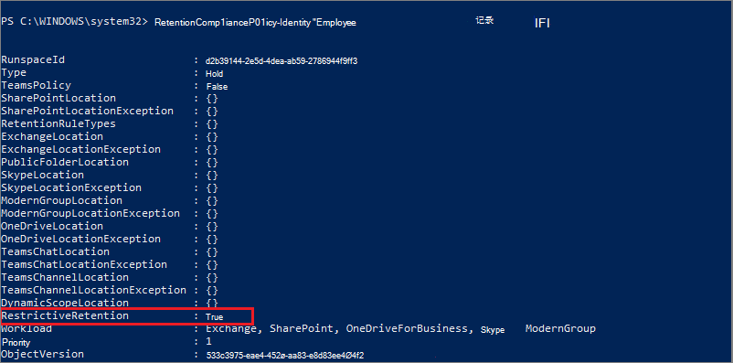

# <a name="use-preservation-lock-to-restrict-changes-to-retention-policies-and-retention-label-policies"></a>使用保留锁定来限制对保留策略和保留标签策略的更改

>*[Microsoft 365 安全性与合规性许可指南](/office365/servicedescriptions/microsoft-365-service-descriptions/microsoft-365-tenantlevel-services-licensing-guidance/microsoft-365-security-compliance-licensing-guidance)。*

> [!IMPORTANT]
> 目前，[辅助策略作用域](retention.md#adaptive-or-static-policy-scopes-for-retention)不支持保留锁定。

保存锁可锁定保留策略或保留标签策略，因此任何人 - 包括全局管理员 - 都无法关闭该策略、删除该策略或降低其限制性。 这种配置可能是监管要求所需要的，并且有助于防范恶意管理员。

锁定某个保留策略后：

- 任何人都不能禁用或删除该策略
- 可以添加位置，但不能删除位置
- 可以延长保留期，但不能缩短保留期

锁定某个保留标签策略后：

- 任何人都不能禁用或删除该策略
- 可以添加位置，但不能删除位置
- 可以添加标签，但不能删除标签

总之，锁定的策略可以增加或延长，但不能减少或关闭。

> [!IMPORTANT]
> 在锁定保留策略或保留标签策略之前，请了解其影响并确认其是否是你的组织所需要的。 例如，可能需要满足监管要求。 当应用了保留锁后，管理员将无法禁用或删除这些策略。

当你创建了一个[保留策略](create-retention-policies.md)，或是[发布](create-apply-retention-labels.md)或[自动应用](apply-retention-labels-automatically.md)的保留标签策略后，将配置保留锁。

> [!NOTE]
> 锁定标签策略不会阻止管理员缩短锁定策略中包含的标签的保留期。 如果配置标签以将项目标记为[合规性记录](records-management.md#records)，则可满足该要求以及其他限制。

## <a name="how-to-lock-a-retention-policy-or-retention-label-policy"></a>如何锁定保留策略或保留标签策略

如果需要使用保存锁，则必须使用 PowerShell。 由于管理员在应用此锁后，无法禁用或删除保留策略，因此在 UI 中无法启用此功能，以防止意外配置。

所有保留策略及任何配置都支持保留锁。

1. [连接到安全与合规中心 PowerShell](/powershell/exchange/connect-to-scc-powershell)。

2. 通过运行 [Get-RetentionCompliancePolicy](/powershell/module/exchange/get-retentioncompliancepolicy)，找到所需锁定的策略名称。例如：
    
   

3. 若要在策略上放置保存锁，请运行 [Set-RetentionCompliancePolicy](/powershell/module/exchange/set-retentioncompliancepolicy) cmdlet，并将策略的名称和 *RestrictiveRetention* 参数设置为 true：
    
    ```powershell
    Set-RetentionCompliancePolicy -Identity "<Name of Policy>" -RestrictiveRetention $true
    ```
    
    例如：
    
    
    
     出现提示时，请阅读并通过输入 **Y** 确认这个配置随附的限制：
    
   

现在策略上已经有了保留锁定。 若要确认，请再次运行 `Get-RetentionCompliancePolicy`，但需指定保留策略名称并显示策略参数：

```powershell
Get-RetentionCompliancePolicy -Identity "<Name of Policy>" |Fl
```

应会看到 **RestrictiveRetention** 设置为 **True**。例如：



## <a name="see-also"></a>另请参阅

[有助于你满足信息治理和记录管理监管要求的资源](retention-regulatory-requirements.md)