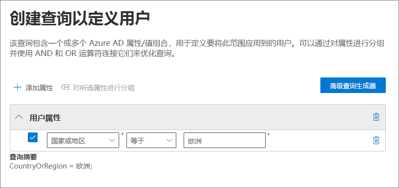
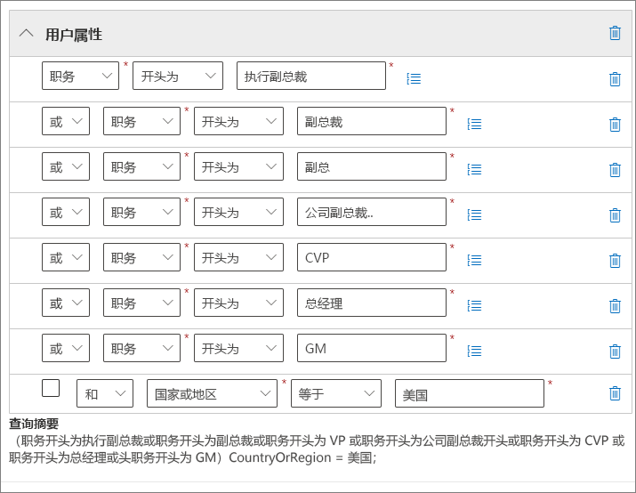
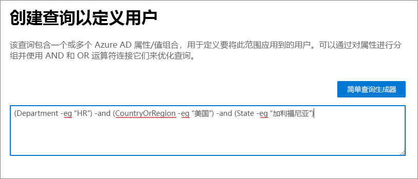
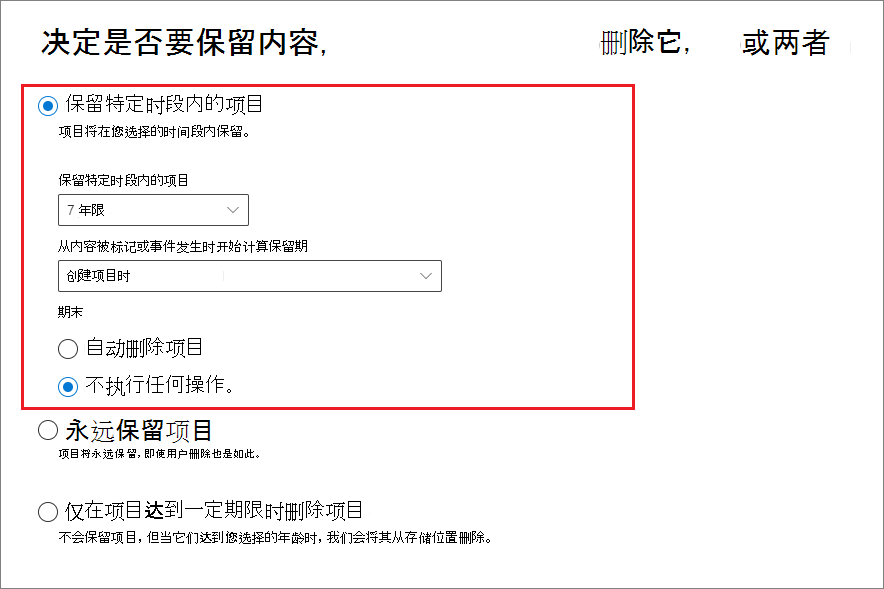

# <a name="common-settings-for-retention-policies-and-retention-label-policies"></a>保留策略和保留标签策略的通用设置

>*[Microsoft 365 安全性与合规性许可指南](https://aka.ms/ComplianceSD)。*

许多保留设置同时对保留策略和保留标签策略通用。 使用以下信息可帮助配置这些设置，从而主动保留内容、删除内容，或同时执行这两项操作—保留然后删除内容。

有关支持这些保留策略的方案，请参阅:

- [创建和配置保留策略](create-retention-policies.md)。
- [创建保留标签并在应用中应用它们](create-apply-retention-labels.md)
- [自动向内容应用保留标签](apply-retention-labels-automatically.md)

特定于每个方案的设置在各自文档中进行了说明。

有关保留策略以及保留在 Microsoft 365 中的工作原理的概述信息，请参阅 [了解保留策略和保留标签](retention.md)。

## <a name="scopes---adaptive-and-static"></a>作用域 - 自适应和静态

如果你不熟悉自适应作用域和静态作用域，且为了帮助你在配置保留策略时选择要使用的作用域，请参阅 [保留的自适应或静态策略作用域](retention.md#adaptive-or-static-policy-scopes-for-retention)。 

当确定是使用自适应作用域还是静态作用域时，使用以下信息可帮助进行配置:
- [自适应作用域的配置信息](#configuration-information-for-adaptive-scopes)
- [静态作用域的配置信息](#configuration-information-for-static-scopes)

> [!TIP]
> 如果有使用静态作用域的策略，且想要将其转换为自适应作用域，请在新建策略(使用具有相同保留设置的自适应作用域)时保留现有策略。 在禁用或删除具有静态作用域的旧策略之前，验证这些新策略是否面向正确的用户、网站和组。

### <a name="configuration-information-for-adaptive-scopes"></a>自适应作用域的配置信息

> [!NOTE]
> 作为新功能的自适应作用域目前处于预览状态，可能会发生更改。 可选选项为静态作用域，其在引入自适应作用域之前提供相同行为，如果自适应作用域不符合商业需求，则可以使用该选项。

当选择使用自适应作用域时，会提示选择想要的自适应作用域类型。 有三种不同类型的自适应作用域，且每个作用域都支持不同的特性或属性:

| 自适应作用域类型 | 支持的属性包括 |
|:-----|:-----|
|**用户** - 适用于:  <br/> - Exchange 电子邮件 <br/> - OneDrive 帐户 <br/> - Teams 聊天 <br/> - Teams 专用频道消息 <br/> - Yammer 用户消息| 名字 <br/> 姓 <br/>显示名称 <br/> 职务 <br/> 部门 <br/> 办公室 <br/>街道地址 <br/> 市/县 <br/>省/市/自治区 <br/>邮政编码 <br/> 国家或地区 <br/> 电子邮件地址 <br/> 别名 <br/> Exchange 自定义特性: CustomAttribute1 - CustomAttribute15|
|**SharePoint 网站** - 适用于:  <br/> - SharePoint 网站 <br/> - OneDrive 帐户 |网站 URL <br/>网站名称 <br/> SharePoint 自定义属性: RefinableString00 - RefinableString99 |
|**Microsoft 365 组** - 适用于:  <br/> - Microsoft 365 组 <br/> - Teams 频道消息 <br/> - Yammer 社区消息 |名称 <br/> 显示名称 <br/> 说明 <br/> 电子邮件地址 <br/> 别名 <br/> Exchange 自定义特性: CustomAttribute1 - CustomAttribute15 |

网站的属性名称基于 SharePoint 网站托管的属性，用户和组的特性名称基于映射到 Azure AD 特性的 [可筛选的收件人属性](/powershell/exchange/recipientfilter-properties#filterable-recipient-properties)。 例如：

- **别名** 映射到 LDAP 名称 **mailNickname**，在 Azure AD 管理中心内显示为 **电子邮件**。
- **电子邮件地址** 映射到 LDAP 名称 **proxyAddresses**，在 Azure AD 管理中心内显示为 **代理地址**。

配置自适应作用域时，可以通过使用简单查询生成器轻松指定表中列出的属性。 高级查询生成器将支持其他属性，如下一节所述。

> [!TIP]
> 有关使用高级查询生成器的其他信息，请参阅以下网络研讨会：[使用自适应策略作用域为用户和组生成高级查询](https://mipc.eventbuilder.com/event/52683/occurrence/49452/recording?rauth=853.3181650.1f2b6e8b4a05b4441f19b890dfeadcec24c4325e90ac492b7a58eb3045c546ea)

保留的单个策略可以具有一个或多个自适应作用域。

#### <a name="to-configure-an-adaptive-scope"></a>要配置自适应作用域

在配置自适应作用域之前，根据上节确定要创建的作用域类型以及将使用的特性和值。 可能需要与其他管理员共同合作以确认此信息，对于 SharePoint 网站，请确认属性已编制索引。

1. 在 [Microsoft 365 合规中心](https://compliance.microsoft.com/)，导航到以下位置之一：
    
    - 如果你正在使用记录管理：
        - **解决方案** > **记录管理** > **自适应作用域** 选项卡 > + **创建作用域**
        
    - 如果你没有使用记录管理：
       - **解决方案** > **信息治理** > **自适应作用域** 选项卡 > + **创建作用域**
    
    没有立即在导航窗格中看到解决方案? 首先选择“**全部显示**”。 

2. 按照配置中的提示先选择作用域类型，然后选择要用于生成动态成员资格的特性或属性，并键入特性或属性值。
    
    例如，要配置将用于识别欧洲用户的自适应作用域，请先将 **用户** 选为作用域类型，然后选择 **国家或地区** 特性并键入 **欧洲**:
    
    
    
    一天一次: 此查询将针对 Azure AD 运行，并识别所有已在帐户中为 **国家或地区** 特性指定值 **欧洲** 的用户。
    
    > [!IMPORTANT]
    > 由于查询不会立即运行，因此无法验证键入的值是否正确。
    
    选择 **添加特性** (对于用户和组)或 **添加属性** (对于网站)，从而使用其作用域类型受支持的特性或属性的任意组合以及逻辑运算符以生成查询。 受支持的运算符为 **等于**、**不等于**、**以** 开头以及 **不以** 开头，可以对选定特性或属性进行分组。 例如：
    
    
    
    或者，可以选择 **高级查询生成器** 以指定自己的查询:
    
    - 对于 **用户** 和 **Microsoft 365 组** 作用域，请使用 [OPATH 筛选语法](/powershell/exchange/recipient-filters)。 例如，要创建按部门、国家/地区和州定义其成员资格的用户作用域:
    
        
    
    - 对于 **SharePoint 网站** 作用域，请使用关键字查询语言(KQL)。 你可能已经熟悉使用已编制索引的网站属性通过 KQL 通过搜索 SharePoint。 为了帮助你指定这些 KQL 查询，请参阅 [关键字查询语言(KQL)语法参考](/sharepoint/dev/general-development/keyword-query-language-kql-syntax-reference)。
    
    使用高级查询生成器的其中一个优势是查询运算符的选择范围更广:
    - **和**
    - **或**
    - **非**
    - **eq** (等于)
    - **ne** (不等于)
    - **lt** (小于)
    - **gt** (大于)
    - **like** (字符串比较
    - **notlike** (字符串比较
    
    可以独立于作用域配置 [验证这些高级查询](#validating-advanced-queries)。
    
    > [!TIP]
    > 如果要排除非活动邮箱，则必须使用高级查询生成器。 或者相反，可以仅面向非活动邮箱。 对于此配置，请使用 OPATH 属性 *IsInactiveMailbox*：
    > 
    > - 若要排除非活动邮箱，请确保查询包括： `(IsInactiveMailbox -eq "False")`
    > - 若要仅面向非活动邮箱，请指定： `(IsInactiveMailbox -eq "True")`

3. 根据需要创建尽可能多的自适应作用域。 当创建保留策略时，可以选择一个或多个自适应作用域。

> [!NOTE]
> 查询可能需要长达五天的时间才可完全填充，且不会立即进行更改。 在将新建的作用域添加到保留策略之前，请先等待几天，将这种延迟考虑在内。

要确认自适应作用域的当前成员资格和成员资格更改:

1. 双击(或选择并按 Enter) **自适应作用域** 页面上的作用域

2. 从 **详细信息** 飞出窗格中，选择 **作用域详细信息**。 
    
    查看识别当前作用域内的所有用户、网站或组(如果其已自动添加或删除)的信息以及该成员资格更改的日期和时间。

> [!TIP]
> 使用 [策略查找](retention.md#policy-lookup) 选项可帮助识别当前分配到特定用户、网站和 Microsoft 365 组的策略。

#### <a name="validating-advanced-queries"></a>正在验证高级查询

可以使用 PowerShell 和 SharePoint 搜索手动验证高级查询:
- 将 PowerShell 用于 **用户** 和 **Microsoft 365 组** 作用域类型
- 将 SharePoint 搜索用于 **SharePoint 网站** 作用域类型

要使用 PowerShell 运行查询:

1. 使用全局管理员帐户，[连接到 Exchange Online PowerShell](/powershell/exchange/connect-to-exchange-online-powershell)。

2. 使用具有 *-Filter* 参数的 [Get-Recipient](/powershell/module/exchange/get-recipient) 或 [Get-Mailbox](/powershell/module/exchange/get-mailbox)，然后使用自适应作用域的 OPATH 查询(用双引号括起来)，从而指定 [OPATH 查询](/powershell/exchange/filter-properties)。 如果特性值包含空格，则使用单引号将这些值括起来。
    
    例如：
    
    ````PowerShell
    Get-Recipient -Filter "Department -eq 'Sales and Marketing'" -ResultSize unlimited
    ````

3. 验证输出是否与自适应作用域的预期用户或组匹配。 如果不匹配，请与 Azure AD 或 Exchange 的相关管理员共同检查查询和值。
 
要使用 SharePoint 搜索运行查询:

1. 使用全局管理员帐户或具有 SharePoint 管理员角色的帐户，转到 `https://<your_tenant>.sharepoint.com/search`。

2. 使用搜索栏指定 KQL 查询。

3. 验证搜索结果是否与自适应作用域的预期网站 URL 匹配。 如果不匹配，请与 SharePoint 的相关管理员共同检查查询和 URL。

### <a name="configuration-information-for-static-scopes"></a>静态作用域的配置信息

当选择使用静态作用域时，必须确定是将策略应用于选定位置(整个位置)的所有实例，还是包含或排除特定实例(特定包含或排除)。

#### <a name="a-policy-that-applies-to-entire-locations"></a>应用于位置整体的策略

除 Skype for Business 外，默认情况下，选定位置的所有实例会自动包含在策略中，无需将其指定为已包含。

例如，**Exchange 电子邮件** 位置的 **所有收件人**。 通过此默认设置，所有现有的用户邮箱都将包含在策略中，任何在应用策略后创建的新邮箱都将自动继承策略。

#### <a name="a-policy-with-specific-inclusions-or-exclusions"></a>包含或排除特定位置、用户或组的策略

注意，当使用可选配置将保留设置搜索范围缩小到特定用户、特定 Microsoft 365 组或特定网站时，才需要注意每个策略的限制。如需了解更多信息，请参阅[保留策略和保留标签策略的限制](retention-limits.md)。 

若要使用可选配置限定保留设置的范围，请确保该位置的“**状态**”为“**开启**”，然后使用链接来包含或排除特定用户、Microsoft 365 组或者网站。

> [!WARNING]
> 如果将实例配置为包含然后删除最后一个实例，则位置的配置会还原为 **所有**。  保存策略之前，请确保这是你期望的配置。
>
> 例如，如果你指定了一个 要在根据配置删除数据的保留策略中包含的 SharePoint 网站，然后删除了这个网站，那么默认情况下，所有 SharePoint 网站都将受到永久删除数据的保留策略的约束。 这同样适用于 Exchange 收件人、OneDrive 帐户以及Teams 聊天用户等。
>
> 在这种情况下，如果不希望“**所有**”这一位置设置受制于保留策略，请关闭位置。 或者，指定要从策略中豁免的排除实例。

## <a name="locations"></a>位置

保留策略中的位置会识别支持保留设置的特定Microsoft 365 服务，例如 Exchange 电子邮件和 SharePoint 网站。 对于具有配置详细信息的位置和在为策略选择配置时需要注意的可能的异常，请使用以下部分。

### <a name="configuration-information-for-exchange-email-and-exchange-public-folders"></a>Exchange 电子邮件和 Exchange 公用文件夹的配置信息

通过在邮箱级别应用保留设置，**Exchange 电子邮件** 位置支持用户的电子邮件、日历和其他邮箱项的保留。还支持共享的邮箱。

不支持 Exchange 电子邮件的资源邮箱、联系人和Microsoft 365 组邮箱。 对于 Microsoft 365 群组邮箱，请选择 **Microsoft 365 群组** 位置。

根据策略配置， 可能包含或不包含[非活动邮箱](create-and-manage-inactive-mailboxes.md)：

- 使用默认 **所有收件人** 配置但不支持 [特定包含或排除](#a-policy-with-specific-inclusions-or-exclusions) 时，静态策略作用域将包含非活动邮箱。 但是，如果在应用策略时包含或排除具有活动邮箱的收件人，并且该邮箱随后变为非活动状态，则将继续应用或排除保留设置。

- 默认情况下，自适应策略作用域包括非活动邮箱。 可以使用高级查询生成器和 OPATH 属性 *IsInactiveMailbox* 控制此行为：
    
    ```console
    (IsInactiveMailbox -eq "False")
    ```

如果使用静态策略作用域并选择要包含或排除的收件人，可以选择通讯组和启用电子邮件的安全组作为选择多个收件人的一种有效方法，而不用逐个选择。 当使用此选项时，在后台，这些组会在配置时自动展开，以选择组中用户的邮箱。 如果这些组的成员身份稍后更改，则现有保留策略不会自动更新，这与自适应策略作用域不同。

有关在为 Exchange 配置保留设置时包括和排除哪些邮箱项目的详细信息，请参阅[保留和删除哪些内容](retention-policies-exchange.md#whats-included-for-retention-and-deletion)。

**Exchange 公用文件夹** 位置将保留设置应用于所有公共文件夹，并且不能在文件夹或邮箱级别应用。

#### <a name="exceptions-for-auto-apply-policies-configured-for-sensitive-information-types"></a>为敏感信息类型配置的自动应用策略的异常

当配置使用敏感信息类型的自动应用策略并选择 **Exchange 电子邮件** 位置时:

- 包含 Microsoft 365 组邮箱。

- 即使配置自适应作用域以识别特定邮箱，也会自动包含所有邮箱。 如果已选择静态策略作用域，则将无法指定要包含或排除的收件人。

### <a name="configuration-information-for-sharepoint-sites-and-onedrive-accounts"></a>SharePoint 网站的配置信息和 OneDrive 帐户

当选择 **SharePoint 网站** 位置时，保留策略可以保留和删除 SharePoint 通信网站、未由 Microsoft 365 组连接的团队网站以及经典网站中的文档。 除非使用的是 [自适应策略作用域](#exceptions-for-adaptive-policy-scopes)，否则通过 Microsoft 365 组连接的团队网站不支持此选项，而是使用适用于组邮箱、网站和文件中内容的 **Microsoft 365 组** 位置。

有关在配置 SharePoint 和 OneDrive 的保留设置时应包含和排除哪些内容的详细信息，请参阅[保留和删除哪些内容](retention-policies-sharepoint.md#whats-included-for-retention-and-deletion)。 

当为 SharePoint 网站或 OneDrive 帐户指定位置时，无需访问这些网站的权限。 对于静态作用域，在 **编辑位置** 页面上指定 URL 时不会进行任何验证。 但是，会检查指定的 SharePoint 网站是否存在于配置的最后一页上。 如果此检查失败，你会看到一条消息，指出输入的 URL 验证失败，且在验证检查通过之前无法创建保留策略。 如果看到此消息，请返回配置流程以更改 URL 或从保留策略中删除网站。

要指定单个 OneDrive 帐户，请参阅 [获取组织中所有用户 OneDrive URL 的列表](/onedrive/list-onedrive-urls)。

> [!NOTE]
> 指定单个 OneDrive 帐户时，请注意，除非 oneDrive 帐户 [预配](/onedrive/pre-provision-accounts)，否则在用户首次访问其 OneDrive 之前不会创建 URL。
> 
> 此外，如果用户的 UPN 发生更改，OneDrive URL 将 [自动更改](/onedrive/upn-changes) 。 例如，更改姓名事件，如结婚。 或域名更改以支持组织的重命名或业务重组。 如果 UPN 发生更改，则需要更新为保留设置指定的 OneDrive URL。
> 
> 由于为单个用户可靠地指定 URL 以针对静态作用域进行包含或排除存在挑战，因此具有 **用户** 作用域类型的 [自适应作用域](retention.md#adaptive-or-static-policy-scopes-for-retention) 更适合实现此目的。

#### <a name="exceptions-for-adaptive-policy-scopes"></a>自适应策略作用域的异常

配置使用自适应策略作用域的保留策略并选择以下 **SharePoint 网站** 位置时：

- 除 SharePoint 通信网站、并非通过 Microsoft 365 组连接的团队网站和经典网站外，还包括 OneDrive 网站和通过 Microsoft 365 组连接的网站。

### <a name="configuration-information-for-microsoft-365-groups"></a>Microsoft 365 组的配置信息

若要保留或删除 Microsoft 365 组（以前称为 Office 365 组）的内容，请使用 **Microsoft 365 组** 位置。 此位置包含组邮箱和 SharePoint 团队网站。

> [!NOTE]
> 即使 Microsoft 365 组有 Exchange 邮箱，**Exchange 电子邮件** 位置的保留策略也不会包含Microsoft 365 组邮箱中的内容。 

如果使用静态作用域: 虽然静态作用域的 **Exchange 电子邮件** 位置最初允许指定要包含或排除的组邮箱，但当尝试保存保留策略时，将看到错误消息，指出 "RemoteGroupMailbox" 不是 Exchange 位置的有效选择。

默认情况下，应用于 Microsoft 365 组的保留策略包含组邮箱和 SharePoint 团队网站。 存储在 SharePoint 团队网站中的文件与此位置有关，但 Teams 聊天或 Teams 频道与此位置无关，它们拥有自己的保留策略位置。

因为你希望保留策略仅应用于 Microsoft 365 邮箱或已连接的 SharePoint 团队网站，若要更改默认设置，请使用带有值为以下之一的参数 *应用程序* 的 [Set-RetentionCompliancePolicy](/powershell/module/exchange/set-retentioncompliancepolicy) PowerShell cmdlet：

- `Group:Exchange` 仅适用于已连接到组的 Microsoft 365 邮箱。
- `Group:SharePoint` 仅适用于已连接到组的 SharePoint 网站。

若要返回到所选 Microsoft 365 组的邮箱和 SharePoint 网站的默认值，请指定 `Group:Exchange,SharePoint`。

#### <a name="exceptions-for-auto-apply-policies-configured-for-sensitive-information-types"></a>为敏感信息类型配置的自动应用策略的异常

当配置使用敏感信息类型的自动应用策略并选择 **Microsoft 365 组** 位置时:

- 不包含 Microsoft 365 组邮箱。 要将这些邮箱包含在策略中，请改为选择 **Exchange 电子邮件** 位置。

#### <a name="what-happens-if-a-microsoft-365-group-is-deleted-after-a-policy-is-applied"></a>如果在应用策略后删除 Microsoft 365 组，会发生什么情况

如果将保留策略应用于 Microsoft 365 组，并且该组随后从Azure Active Directory 中删除：

- 通过组连接的 SharePoint 网站将会保留，并继续由相应 **Microsoft 365 组** 位置的保留策略管理。 在删除该组之前有权访问相应网站的用户仍然可以访问这些网站，但所有新权限现在都必须通过 SharePoint 管理。
    
    此时，你无法从 Microsoft 365 组位置排除相应网站，因为你无法指定已删除的组。 如果需要从此网站发布保留策略，请联系 Microsoft 支持部门。 例如，在 [Microsoft 365 管理中心中开立一个服务请求](https://admin.microsoft.com/Adminportal/Home#/support)。

- 已删除组的邮箱将变为非活动状态，但会像 SharePoint 网站一样仍受保留设置限制。 有关详细信息，请参阅 [Exchange Online 中的非活动邮箱](inactive-mailboxes-in-office-365.md)。

### <a name="configuration-information-for-skype-for-business"></a>Skype for Business 的配置信息

与 Exchange 电子邮件不同，将 Skype 位置的状态切换为“开”并不能添加所有用户，但启用相应位置后，就必须手动选择要保留哪些用户的对话：


选择此 **编辑** 选项后，在 **Skype for Business** 窗格中，您可以通过选择 **名称** 列前的隐藏框快速包含所有用户。 但是，请务必了解每个用户在策略中都被算作一个特定的包含内容。 因此，如果通过选中此框包括 1，000 个用户，这与手动选择要包括的 1，000 个用户相同，这是 Skype for Business 支持的最大数量。

请注意，**对话历史记录** (Outlook 中的文件夹)是与 Skype 存档无关的功能。最终用户可以禁用 **对话历史记录**，但完成 Skype 存档的方法是将 Skype 对话副本存储在用户无法访问但可用于电子数据展示的隐藏文件夹中。

## <a name="settings-for-retaining-and-deleting-content"></a>保留和删除内容的设置

通过选择用于保留和删除内容的设置，保留策略将在指定的时间段内具有以下其中一项配置:

- 仅保留

    对于此配置，请选择“**将项目保留至特定时间段**”和“**保留期结束：不执行任何操作**”。 或者，选择“**永久保留项目**”。

- 保留后删除

    对于此配置，请选择“**将项目保留至特定时间段**”和“**保留期结束：自动删除项目**”。

- 仅删除

    对于此配置，请选择“**仅在达到特定年龄时删除项目”**。

### <a name="retaining-content-for-a-specific-period-of-time"></a>将内容保留一段特定时间

在将保留标签或策略配置为保留内容时，可以选择将项目保留特定天数、月数或年数。 或者，永久保留项目。 保持期不是从分配策略的时间开始计算，而是根据指定的保留期开始时间计算得出。

对于保留期的开始时间，可以选择内容创建的时间，或者上次修改内容的时间（仅支持文件和 SharePoint、OneDrive 和 Microsoft 365 组）。 对于保留标签，可以从内容标记和事件发生时开始保留期。

示例：

- SharePoint：如果希望将某个网站集中的项目自上次修改以来保留七年，并且该网站集中的某个文档在六年内未进行修改，则该文档在不修改的情况下将仅再保留一 年。如果再次对该文档进行编辑，则会根据最新修改日期计算文档期限，并将再保留七年。

- Exchange：如果想将邮箱中的项目保留七年，而有封邮件是六年前发送的，则该邮件将只再保留一年。对于 Exchange 项目，期限基于传入电子邮件的接收日期或传出电子邮件的发送日期。根据最后一次修改的时间来保留项目这一方式只适用于 OneDrive 和 SharePoint 中的网站内容。

保留期结束后，选择是否要永久删除内容：



### <a name="deleting-content-thats-older-than-a-specific-age"></a>删除超过特定年限的内容

保留策略可以保留然后删除项，或删除并不保留旧项。

在这两种情况下，如果策略删除了项目，请务必了解，指定的时间段不是从分配策略的时间开始计算，而是根据指定的保留期开始时间计算得出。 例如，从创建、修改或标记项的时间开始。

因此，请先考虑现有内容的期限以及策略对该内容的影响。在分配新策略之前，可能还想要将其传达给用户，以便用户有时间评估可能产生的影响。

### <a name="a-policy-that-applies-to-entire-locations"></a>应用于位置整体的策略

选择位置时（Skype for Business 除外），当位置的状态是“**开启**”时，默认设置是“**全部**”。

如果将保留策略应用于整个位置的任意组合，则不会限制该策略可以包含的收件人、网站、帐户和组等数量。

例如，如果对所有的 Exchange 电子邮件和所有的 SharePoint 网站应用策略，则无论网站和收件人的数量有多少，都会对其应用策略。并且对于 Exchange，在应用策略后创建的任何新邮箱都将自动继承该策略。

### <a name="a-policy-with-specific-inclusions-or-exclusions"></a>包含或排除特定位置、用户或组的策略

注意，当使用可选配置将保留设置搜索范围缩小到特定用户、特定 Microsoft 365 组或特定网站时，才需要注意每个策略的限制。如需了解更多信息，请参阅[保留策略和保留标签策略的限制](retention-limits.md)。 

若要使用可选配置限定保留设置的范围，请确保该位置的“**状态**”为“**开启**”，然后使用链接来包含或排除特定用户、Microsoft 365 组或者网站。

> [!WARNING]
> 如果你配置了包含项，然后删除了最后一项，则配置会将位置的设置还原为“**所有**”。  保存策略之前，请确保这是你期望的配置。
>
> 例如，如果你指定了一个 要在根据配置删除数据的保留策略中包含的 SharePoint 网站，然后删除了这个网站，那么默认情况下，所有 SharePoint 网站都将受到永久删除数据的保留策略的约束。 这同样适用于针对 Exchange 收件人、OneDrive 帐户和 Teams 聊天用户等进行包含设置。
>
> 在这种情况下，如果不希望“**所有**”这一位置设置受制于保留策略，请关闭位置。 或者，指定将不受该策略约束的排除项。

## <a name="updating-policies-for-retention"></a>正在更新保留策略

创建并保存保留策略后，一些设置无法更改，其中包含:
- 策略名称和保留设置(保留期除外)以及保留期的开始时间。

如果你编辑保留策略，并且项目已遵循保留策略中的原始设置，则除了新识别的项目之外，更新后的设置将自动应用于此项目。

此更新通常非常快，但可能需要数天。 完成跨 Microsoft 365 位置的策略复制后，你将看到 Microsoft 365 合规中心中的保留策略状态从“**打开（挂起）**”变为“**打开（成功）**”。

## <a name="locking-the-policy-to-prevent-changes"></a>锁定策略以防止更改

如果需要确保任何人都无法关闭策略、删除策略或降低其限制性，请参阅[使用保留锁定来限制对保留策略和保留标签策略的更改](retention-preservation-lock.md)。
