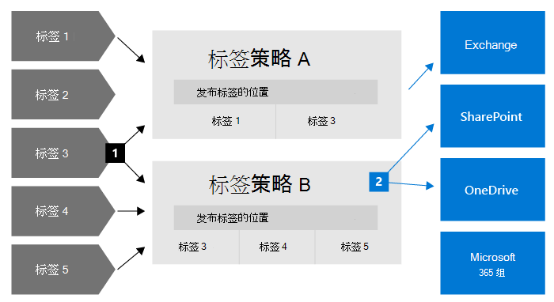
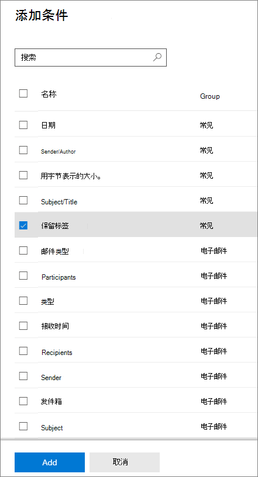
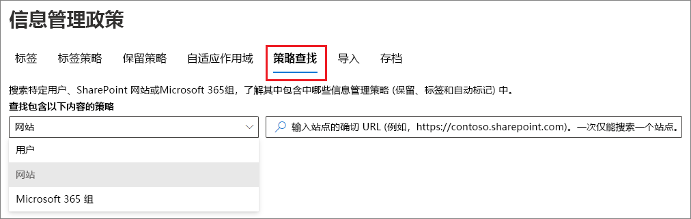
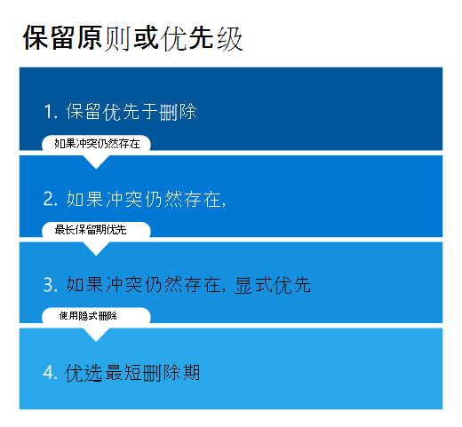

# 了解保留策略和保留标签

>*[Microsoft 365 安全性与合规性许可指南](/office365/servicedescriptions/microsoft-365-service-descriptions/microsoft-365-tenantlevel-services-licensing-guidance/microsoft-365-security-compliance-licensing-guidance)。*

> [!NOTE]
> 如果在 Teams 中看到保留策略相关消息或对应用中的保留标签存疑，请联系 IT 部门，了解有关如何配置保留策略和保留标签的信息。同时，以下文章可能有帮助：
> -  [有关保留策略的 Teams 消息](https://support.microsoft.com/office/teams-messages-about-retention-policies-c151fa2f-1558-4cf9-8e51-854e925b483b)
> - [对 SharePoint 或 OneDrive 中的文件应用保留标签](https://support.microsoft.com/office/apply-retention-labels-to-files-in-sharepoint-or-onedrive-11a6835b-ec9f-40db-8aca-6f5ef18132df)
>
> 本页上的信息适用于出于合规性原因可创建保留策略和保留标签的 IT 管理员。

对于大多数组织，数据量和数据复杂性每天都在增加 — 包括电子邮件、文档、即时消息等。有效管理或管理此类信息非常重要，因为要：

- **主动遵守规定至少必须在一段时间内保留内容的行业法规和内部策略**：例如，《萨班斯-奥克斯利法案》规定，必须保留特定类型的内容七年。

- **降低发生诉讼或出现安全漏洞的风险**：通过永久删除不再需要保留的旧内容。

- **帮助组织有效共享知识并提高敏捷性**：通过确保用户仅处理与自己相关的最新内容。

你配置的保留设置可以帮助你实现这些目标。 管理内容通常需要执行两项操作：

| 操作| 用途 |
|:-----|:-----|
|保留内容 | 防止永久删除并保持可用于电子数据展示 |
|删除内容 | 从组织中永久删除内容|

通过这两项保留操作，可以配置保留设置来实现以下结果：

- 仅保留：永久或在指定的时间段内保留内容。
- 仅删除：在指定的时间段后永久删除内容。
- 保留后删除：在指定的时间段内保留内容后永久删除内容。

这些保留设置应用于在适当位置上的内容，如果你出于合规性原因需要保留内容，它们可以为你节省创建和配置附加存储的额外开销。 另外，无需实现自定义流程来复制和同步此数据。

使用以下各节了解有关保留策略和保留标签如何工作、何时使用以及它们如何相互补充的更多信息。 但是，如果你已准备好开始为一些常见情况部署保留设置，请参阅[信息管理入门](get-started-with-information-governance.md)。

## 保留设置如何应用于在适当位置上的内容

当内容分配有保留设置时，该内容将保留在其原始位置。大多数情况下，人们继续处理其文档或邮件，就像没有更改任何内容一样。但是，如果他们编辑或删除保留策略中包含的内容，则会自动保留内容的副本。
  
- 对于 SharePoint 和 OneDrive 网站：副本保留在 **保留** 库中。

- 对于 Exchange 邮箱：副本保留在“可恢复项”文件夹中。 

- 对于 Teams 和 Yammer 消息：副本保留在 Exchange“**可恢复项**”文件夹内名为“**SubstrateHolds**”的隐藏文件夹中。

> [!NOTE]
> 因为网站的存储配额中包括保留库，在对 SharePoint 和 Microsoft 365 组使用保留设置时，你可能需要增加存储空间。
> 
这些安全位置和保留的内容对大部分用户不可见。 在大多数情况下，用户甚至不需要知道他们的内容遵循保留设置。

若要详细了解保留设置如何用于不同的工作负载，请参阅以下文章：

- [了解用于 SharePoint 和 OneDrive 的保留](retention-policies-sharepoint.md)
- [了解用于 Microsoft Teams 的保留](retention-policies-teams.md)
- [了解用于 Yammer 的保留](retention-policies-yammer.md)
- [了解用于 Exchange 的保留](retention-policies-exchange.md)

## 保留策略和保留标签

若要将保留设置分配到内容，请使用 **保留策略** 和 **带有标签策略的保留标签**。 可以使用其中一种方法，也可以组合使用。

使用保留策略可以在网站或邮箱级别为内容分配相同的保留设置，使用保留标签可以在项（文件夹、文档、电子邮件）级别分配保留设置。

例如，如果某 SharePoint 网站中的所有文档都应保留 5 年，那么使用保留策略比将相同的保留标签应用于此网站中的所有文档更高效。 不过，如果此网站中的一些文档应保留 5 年，另一些文档应保留 10 年，那么保留策略就无法实现这一点。 如果需要在项级别指定保留设置，请使用保留标签。 

与保留策略不同，如果内容移动到 Microsoft 365 租户内的不同位置，保留标签的保留设置会随着内容移动而移动。 另外，保留标签具有保留策略不支持的以下功能： 
 
- 除了根据内容年限或上次修改时间计算保留期之外，还可以从内容被标记时或根据事件开始计算保留期。

- 使用[可训练的分类器](classifier-learn-about.md)来标识要标记的内容。

- 为 SharePoint 文档应用默认标签。

- 支持[处置评审](./disposition.md) ，以在永久删除内容前评审内容。

- 将内容标记为[记录](records-management.md#records)作为标签设置的一部分，并对在保留期结束时删除的内容始终都有 [处置证明](disposition.md#disposition-of-records) 。

### 保留策略

可以将保留策略应用于以下位置：
- Exchange 电子邮件
- SharePoint 网站
- OneDrive 账户
- Microsoft 365 组
- Skype for Business
- Exchange 公用文件夹
- Teams 通道消息
- Teams 聊天
- Teams 专用频道消息
- yammer 社区消息
- Yammer 用户消息

可以非常高效地将一个策略应用于多个位置，也可以应用于特定的位置或用户。

对于保留期的开始，你可以选择内容创建的时间，或者上次修改内容的时间（仅支持文件和 SharePoint、OneDrive 和 Microsoft 365 组位置）。

项目从保留策略所指定的容器中继承保留设置。 如果当策略配置为保留内容之后将它们移动到该容器之外，则该项目的副本将保留在工作负载的安全位置。 然而，保留设置不会随着内容在新的位置而一起移动。 如果需要，请使用保留标签而不是保留策略。

### 保留标签

对于需要不同保留设置的不同类型的内容，可以使用保留标签。例如：
  
- 至少必须保留一段时间的税务表单。 
    
- 达到特定年限后必须永久删除的新闻材料。 
    
- 必须在保留一段时间后永久删除的竞争性研究。 
    
- 必须标记为记录以免被编辑或删除的工作签证。 
    
在所有这些情况下，可以使用保留标签在项（文档或电子邮件）级别应用保留设置来实现管理控制。
  
使用保留标签，你可以：
  
- **允许组织中的人员将保留标签手动应用于** Outlook 和 Outlook 网页版、OneDrive、SharePoint​​ 和 Microsoft 365 组中的内容。用户通常最了解自己处理的内容的类型，因此他们可以对内容进行分类，并应用适当的保留设置。 
    
- 如果它符合特定条件，则 **自动将保留标签应用到内容**。这些特定条件包括在电子邮件或 Teams 中共享的云附件，或者在内容包含以下项时： 
    - 特定类型敏感信息。
    - 与所创建的查询匹配的特定关键字。
    - 可训练分类器的模式匹配。

- **从 SharePoint 网站和 OneDrive 帐户中的文档以及电子邮件项目中的内容标记为** 开始保留期。

- **从事件发生时开始计算保留期**，如员工离开组织或合同到期。

- **将默认保留标签应用于 SharePoint 中的文档库、文件夹或文档集**，以让存储在该位置的所有文档都继承默认保留标签。

- **将项目标记为记录** 作为 [记录管理](records-management.md) 策略的一部分。 当这些标签内容仍保留在 Microsoft 365 中时，则标签会对内容进行进一步的限制，这可能是监管原因所致。 有关详细信息，请参阅[比较对允许或阻止的操作的限制](records-management.md#compare-restrictions-for-what-actions-are-allowed-or-blocked)。

如果内容被移动到 Microsoft 365 之外，则保留标签将不会继续存在，这一点与[敏感度标签](sensitivity-labels.md)是不同的。

#### 对内容分类但不执行任何操作

虽然保留标签的主要用途是保留或删除内容，但也可以在使用保留标签时不启用任何保留或其他操作。 在这种情况下，可以简单地将保留标签用作文本标签，而不强制执行任何操作。
  
例如，可以创建并应用名为“稍后评审”且不含任何操作的保留标签，稍后使用此标签来查找相应内容。
  

#### 将保留标签用作 DLP 策略中的条件

对于 SharePoint 中的文档，可以将保留标签指定为数据丢失防护 (DLP) 策略中的条件。 例如，配置一个 DLP 策略，以防在组织外部共享应用了指定保留标签的文档。

有关详细信息，请参阅[将保留标签用作 DLP 策略中的条件](data-loss-prevention-policies.md#using-a-retention-label-as-a-condition-in-a-dlp-policy)。

#### 保留标签和应用它们的策略

在你发布保留标签后，它们将包含在 **保留标签策略** 中，以便管理员和用户将其应用至内容。如以下图表所示：

1. 一个保留标签可包含在多个保留标签策略中。

2. 保留标签策略指定了保留标签的发布位置。 同一位置可包含在多个保留标签策略中。

你还可以创建一个或多个 **自动应用保留标签策略**，其中每个策略都有一个保留标签。 如果使用此策略，当满足你在策略中指定的条件时，保留标签就会自动应用。

#### 保留标签策略和位置

可将保留标签发布到不同位置，具体视保留标签用途而定。
  
| 如果保留标签是… | 可以将标签策略应用于… |
|:-----|:-----|
|发布给管理员和最终用户  |Exchange、SharePoint、OneDrive、Microsoft 365 组  |
|根据敏感信息类型或可训练的分类器自动应用  |Exchange、SharePoint、OneDrive  |
|根据关键字或查询自动应用  |Exchange、SharePoint、OneDrive、Microsoft 365 组  |
|自动应用于云附件  |SharePoint、OneDrive、Microsoft 365 组  |

Exchange 公用文件夹、Skype、Teams 和 Yammer 消息不支持保留标签。 若要保留并从这些位置中删除内容，请改用保留策略。

#### 一次只能分配一个保留标签

电子邮件或文档一次只能应用有一个保留标签。 保留标签可以由最终用户或管理员[手动](create-apply-retention-labels.md#manually-apply-retention-labels)应用，也可以使用以下任一方法自动应用：

- [自动应用标签策略](apply-retention-labels-automatically.md)
- [Microsoft SharePoint Syntex 中的文档理解模型](../contentunderstanding/apply-a-retention-label-to-a-model.md)
- [SharePoint](create-apply-retention-labels.md#applying-a-default-retention-label-to-all-content-in-a-sharepoint-library-folder-or-document-set) 或 [Outlook 的默认标签](create-apply-retention-labels.md#applying-a-default-retention-label-to-an-outlook-folder)
- [Outlook 规则](create-apply-retention-labels.md#automatically-applying-a-retention-label-to-email-by-using-rules)

对于标准保留标签（它们不会将项目标记为[记录或监管记录](records-management.md#records)）：

- 管理员和最终用户可以手动更改或删除应用于内容的现有保留标签。 

- 当内容已应用保留标签时，现有标签不会自动删除或替换为另一个保留标签，但有一个可能的例外：现有标签已作为默认标签应用。 使用默认标签时，有一些情况可以将其替换为另一个默认标签或自动删除。 
    
    有关使用默认标签应用标签行为的详细信息，请执行以下操作：
    - SharePoint 的默认标签：[对 SharePoint 使用默认标签时的标签行为](create-apply-retention-labels.md#label-behavior-when-you-use-a-default-label-for-sharepoint)
    - Outlook 的默认标签：[将默认保留标签应用于 Outlook 文件夹](create-apply-retention-labels.md#applying-a-default-retention-label-to-an-outlook-folder)

- 如果有多个自动应用标签策略可以应用保留标签，并且内容满足多个策略的条件，则应用最旧的自动应用标签策略（按创建日期）的保留标签。

当保留标签将项目标记为记录或管理记录时，这些标签不会自动更改。 只有容器的管理员才能手动更改或删除将项目标记为记录而不是管理记录的保留标签。 有关详细信息，请参阅[比较对允许或阻止的操作的限制](records-management.md#compare-restrictions-for-what-actions-are-allowed-or-blocked)。

#### 监视保留标签

从 Microsoft 365 合规中心选择“**数据分类**”和“**概述**”页面来监视保留标签在租户中的使用方式，并确定已标记项目的位置。如需了解更多信息，包括重要的先决条件，请参阅 [详细了解数据分类](data-classification-overview.md)。

然后，你可以通过使用[内容资源管理器](data-classification-content-explorer.md)和[活动资源管理器](data-classification-activity-explorer.md)来深入了解详细信息。

> [!TIP]
>请考虑使用其他的一些数据分类见解（如可训练分类器和敏感信息类型），帮助你识别可能需要保留或删除的内容，或者作为记录进行管理的内容。

#### 使用“内容搜索”来查找所有带有特定保留标签的内容

在将保留标签应用到内容后（无论是由用户应用还是自动应用），你都可以通过内容搜索来查找已经应用特定保留标签的所有项目。

创建内容搜索时，请选择“**保留标签**”条件，再输入完整或部分保留标签名称，并使用通配符。有关详细信息，请参阅 [适用于内容搜索的关键字查询和搜索条件](keyword-queries-and-search-conditions.md)。
  

## 比较保留策略和保留标签的功能

请使用下表来帮助你根据功能确定是使用保留策略还是保留标签。

|功能|保留策略 |保留标签|
|:-----|:-----|:-----|:-----|
|保留设置可以是“保留后删除”、“仅保留”或“仅删除” |是 |是 |
|支持的工作负载：  - Exchange  - SharePoint  - OneDrive  - Microsoft 365 组  - Skype for Business  - Teams - Yammer|  是   是   是   是   是   是   是 |   是，但公用文件夹除外   是   是   是   否   否   否 |
|自动应用保留 | 是 | 是 |
|基于条件应用保留   - 敏感信息类型、KQL 查询和关键字、可训练的分类器、云附件| 否 | 是 |
|手动应用保留 | 否 | 是 |
|最终用户交互 | 否 | 是 |
|在内容移动时仍继续应用在内容上 | 否 | 是，在您的 Microsoft 365 租户中 |
|将项声明为记录| 否 | 是 |
|从内容被标记或事件发生时开始计算保留期 | 否 | 是 |
|处置评审 | 否| 是 |
|最长 7 年的处置证明 | 否 |是，使用处置评审或项目被标记为记录时|
|审核管理员活动| 是 | 是|
|审核保留操作| 不支持 | 是的 \* |
|识别遵循保留设置的项：   - 内容搜索   - 数据分类页、内容资源管理器、活动资源管理器 |   否   否 |   是   是|

**脚注：**

\* 对于不将内容标记为记录或法规记录的保留标签，审核事件仅限于 SharePoint 中的项或OneDrive 应用、更改或删除标签时。如需了解有保留标签的审计详细信息，请参阅此页面上的[审计保留操作](#auditing-retention-actions)部分。

### 组合保留策略和保留标签

无需选择仅使用保留策略还是仅使用保留标签。 这两种方法可以一起使用，实际上可以相互补充，以获得更全面的解决方案。 例如：

1. 你创建并配置一个保留策略，以便在自最后一次修改内容起 5 年后自动删除内容，同时你将此策略应用于所有 OneDrive 帐户。

2. 你创建并配置一个保留标签来永久保留内容，同时你将此标签添加到发布到所有 OneDrive 帐户的标签策略中。 你向用户解释如何将此标签手动应用于特定文档，这些文档应排除在 5 年未修改后自动删除范围之外。

若要详细了解保留策略和保留标签是如何协同工作的，以及如何确定它们的合并结果，请参阅下一部分，其中介绍了保留原则和优先级。

## 应用保留设置需要多长时间

提交工作负荷的保留策略和标签策略以自动应用保留标签时，最多允许 7 天来将保留设置应用于内容：

- [保留策略需要多长时间才能生效](create-retention-policies.md#how-long-it-takes-for-retention-policies-to-take-effect)
- [保留标签需要多长时间才能生效](apply-retention-labels-automatically.md#how-long-it-takes-for-retention-labels-to-take-effect)

同样，发布标签后，最多允许保留标签在应用中可见 7 天：

- [当保留标签可应用时](create-apply-retention-labels.md#when-retention-labels-become-available-to-apply)

通常不到 7 天这些策略就会生效，标签就会可见。 但是，由于许多潜在变量可能会影响此过程，最好计划最长的 7 天。

## 用于保留的自适应或静态策略范围

> [!NOTE]
> 作为新功能的自适应策略作用域目前处于预览状态，可能会发生更改。 替代选项是静态作用域，它在引入自适应作用域之前提供相同的行为，如果自适应作用域不符合业务要求，则可以使用该作用域。

创建保留策略或保留标签策略时，必须在自适应和静态之间进行选择，以定义策略的范围。

- **辅助作用域** 使用指定的查询，因此成员身份不是静态的，而是动态的，每天针对为所选位置指定的属性或属性运行。 可以将多个自适应作用域与单个策略配合使用。
    
    示例：高级管理人员的电子邮件和 OneDrive 文档需要比标准用户更长的保留期。 创建具有自适应作用域的保留策略，该范围使用 " 的Azure AD属性职务执行"，然后选择策略的 Exchange 电子邮件和 OneDrive 帐户位置。 无需为这些用户指定电子邮件地址或 OneDrive URL，因为自适应作用域会自动检索这些值。 对于新管理人员，无需重新配置保留策略，因为会自动选取这些新用户及其电子邮件和 OneDrive 的相应值。

- **静态作用域** 不使用查询，并且在配置中受到限制，因为它可以应用于指定位置的所有实例，或者对该位置的特定实例使用包含和排除。 这三个选项有时分别称为"组织范围"、"包括"和"排除"。
    
    示例：高级管理人员的电子邮件和 OneDrive 文档需要比标准用户更长的保留期。 创建具有静态作用域的保留策略，该范围为策略选择 Exchange 电子邮件和 OneDrive 帐户位置。 对于 Exchange 电子邮件位置，可以识别仅包含高级管理人员的组，因此可以为保留策略指定此组，并在创建策略时检索具有相应电子邮件地址的组成员身份。 对于 OneDrive 帐户位置，必须为每个主管标识并指定单个 OneDrive URL。 对于新管理人员，必须重新配置保留策略，以添加新的电子邮件地址和 OneDrive URL。 你还必须在管理人员的 UPN 发生更改时更新 OneDrive URL。
    
    OneDrive URL 很难可靠地指定，因为默认情况下，在用户首次访问 OneDrive 之前，不会创建这些 URL。 如果用户的 UPN 发生更改（你可能不知道这一点），则其 OneDrive URL 会自动更改。

使用自适应作用域的优点：

- [每个策略的项目数目没有限制](retention-limits.md#maximum-number-of-items-per-policy)。 尽管自适应策略仍受[每个租户的策略的最大数量](retention-limits.md#maximum-number-of-policies-per-tenant)限制，但更灵活的配置可能会导致策略少得多。

- 针对保留要求的功能更强大。 例如，可以使用现有Azure AD属性根据用户的地理位置为用户分配不同的保留设置，而无需为此目的创建和维护组的管理开销。

- 基于查询的成员身份可针对业务更改提供复原能力，这些更改可能无法可靠地反映在依赖于跨部门通信的组成员身份或外部进程中。

- 单个保留策略可以包括 Microsoft Teams 和 Yammer 的位置，而当你使用静态作用域时，这些位置需要自己的保留策略。
    
- 可以将特定保留设置应用于仅非活动邮箱。 静态作用域无法进行此配置，因为在分配策略时，静态作用域不支持特定包含具有非活动邮箱的收件人。

使用静态作用域的优点：

- 如果希望为工作负荷自动选择所有实例，则配置更简单。
    
    对于"includes"和"excludes"，如果必须指定的实例数较少且不更改，则此选择最初可以是更简单的配置。 但是，当这些实例数开始增加，并且组织中经常发生要求你重新配置策略的更改时，自适应范围可能更易于配置，并且更易于维护。

- **Skype for Business** 和 **Exchange 公用文件夹** 位置不支持自适应作用域。 对于这些位置，必须使用静态作用域。 

有关配置信息，请参阅[配置自适应作用域](retention-settings.md#configuration-information-for-adaptive-scopes)。

若要观看录制的网络研讨会（需要注册），请访问[深入了解自适应作用域](https://mipc.eventbuilder.com/event/45703)。

> [!IMPORTANT]
> 目前，自适应作用域不支持[保留锁定以限制对保留策略和保留标签策略的更改](#use-preservation-lock-to-restrict-changes-to-policies)。

## 策略查找

> [!NOTE]
> 策略查找目前为预览版，可能会发生更改。

可以为Microsoft 365位置配置多个保留策略，以及发布或自动应用的多个保留标签策略。 若要查找分配给特定用户、网站和Microsoft 365组的保留策略，请使用Microsoft 365 合规中心中的 **信息管理** 解决方案中的 **Policy lookup**：

必须为用户指定确切的电子邮件地址、网站的确切 URL 或Microsoft 365组的确切电子邮件地址。

网站选项包括 OneDrive 帐户。 有关如何为用户的 OneDrive 帐户指定 URL 的信息，请参阅[获取组织中所有用户 OneDrive URL 的列表](/onedrive/list-onedrive-urls)。

## 保留原则或优先级

与保留标签不同，您可以对同一内容应用多个保留策略。 每个保留策略都可以导致保留操作和删除操作。 此外，该商品还可能受到保留标签上的这些措施的约束。

在这种情况下，当项目可以经受可能彼此冲突的多个保留设置时，确定结果的优先顺序是什么？

结果不是赢得单个保留策略或单个保留标签的结果，而是保留项目多长时间（如果适用）以及删除项目的时间（如果适用）。 这两个操作是根据应用于项目的所有保留设置彼此独立计算的。

例如，一个项目可能要受一个已配置为仅删除操作的保留策略的约束，而另一个则要配置为保留然后删除的保留策略。 因此，此项只有一个保留操作和两个删除操作。 保留和删除操作可能彼此冲突，并且这两个删除操作的日期可能冲突。 保留原则说明了该结果。

概括来说，可以确定的是，保留始终优先于永久性删除，然后是最长保留期胜出。 这两个简单的规则总是决定一个项目将保留多长时间。

还有其他一些因素决定何时永久性删除项目，其中包括保留标签中的删除操作始终优先于保留策略中的删除操作。

使用以下流程了解单个项目的保留和删除结果，其中每个级别从上到下都充当冲突平局。 如果结果由第一个级别决定，由于没有进一步冲突，则不需要再前进到下一个级别，等等。

> [!IMPORTANT]
> 如果使用保留标签：在应用此原则确定同一项目上多个保留设置的结果之前，请确保你了解 [应用了哪个保留标签](#only-one-retention-label-at-a-time)。

在更详细地解释每个原则之前，请务必了解项目保留期与保留策略或保留标签中指定的保留期之间的差异。 这是因为虽然默认配置是在创建项目时开始保留期，以便项目的保留期结束时间是固定的，但文件也支持配置从上次修改文件时开始保留期。 使用此备用配置时，每次修改文件，都会重置保留期的开始时间，这会延长项目的保留期结束时间。 保留标签还支持在标记时和事件开始时开始保留期。

要将原则应用于一系列“是”和“否”问题，还可以使用 [保留流程图](retention-flowchart.md)。

有关四种不同原则的说明：
  
1. **保留优先于删除。** 当内容也具有保留设置以保留它时，它不会被永久删除。 尽管此原则可确保出于合规性原因保留内容，但删除过程仍可启动 (用户启动或系统启动) 因此可能会从用户的主视图中删除内容。 但是，已挂起永久删除。 关于内容如何保存以及保存在哪里的更多信息，请使用以下每个工作负载的链接：
    
    - [用于 SharePoint 和 OneDrive 的保留的工作原理](retention-policies-sharepoint.md#how-retention-works-for-sharepoint-and-onedrive)
    - [用于 Microsoft Teams 的保留工作原理](retention-policies-teams.md#how-retention-works-with-microsoft-teams)
    - [用于 Yammer 的保留的工作原理](retention-policies-yammer.md#how-retention-works-with-yammer)
    - [用于 Exchange 的保留的工作原理](retention-policies-exchange.md#how-retention-works-for-exchange)
    
    **第一个原则的示例**：电子邮件受 Exchange 保留策略约束，该策略配置为在创建项目三年后删除项目，并且它还应用了一个保留标签，该标签配置为在创建项目五年后保留项目。
    
    电子邮件将保留五年，因为此保留操作优先于删除操作。 由于保留操作生效时暂停的删除操作，电子邮件在五年到期时被永久删除。

2. **最长的保留期限胜出。** 如果内容遵循多个在不同时间段内保留内容的保留设置，内容将一直保留到该项最长保留期结束。
    
    > [!NOTE]
    > 保留策略或标签中 5 年的保留期可能会超过保留策略或标签中 7 年的保留期，因为 5 年期限配置为从上次修改文件时开始，而 7 年期限配置为从创建文件时开始。
    
    **第二个原则的示例**：Marketing SharePoint 网站中的文档受两个保留策略约束。 为所有 SharePoint 网站配置第一个保留策略，以便在创建项目后将其保留五年。 为特定的 SharePoint 网站配置第二个保留策略，以便在创建项目后将其保留十年。
    
    该 Marketing SharePoint 网站中的文档将保留十年，因为这是该项目的最长保留期。

3. **显式删除优先于隐式删除。** 现在保留冲突已经解决，只有删除冲突仍然存在： 
    
    1. 与保留策略相比，保留标签（无论如何应用）都提供了显式保留，因为保留设置将应用于单个项目，而不是从容器隐式分配。 这意味着从保留标签删除操作始终优先于从任何保留策略删除操作。
        
        **第三个原则（标签）的示例：** 一个文档受两个保留策略的约束，这两个保留策略分别具有五年和十年的删除操作，还有一个保留标签的删除操作为七年。
        
        七年后将永久性删除该文件，因为保留标签中的删除操作具有优先权。
    
    2. 仅限保留策略时：如果某个位置的保留策略使用自适应作用域或包含特定实例（例如 Exchange 电子邮件的特定用户）的静态作用域，则保留策略优先于为同一位置的所有实例配置的静态作用域。
        
        为某个位置的所有实例配置的静态作用域有时称为"组织范围的策略">>。 例如，**Exchange email** 和默认设置 **所有收件人**。 或者，**SharePoint网站** 和 **“所有网站”** 的默认设置。 如果保留策略不是组织范围的，但配置了自适应作用域或包含特定实例的静态作用域，则它们在此级别具有相同的优先级。
        
        **第三个原则（策略）的示例 1**：电子邮件受两个保留策略的约束。 第一个保留策略不受范围限制，并在十年后删除项目。 第二个保留策略适用于特定邮箱，并在五年后删除项目。
        
        电子邮件在五年后被永久删除，因为范围保留策略中的删除操作优先于组织范围的保留策略。
        
        **第三个原则（策略）的示例 2**：用户 OneDrive 帐户中的文档受两个保留策略的约束。 第一个保留策略的范围包括该用户的OneDrive帐户，并在10年后执行删除操作。 第二个保留策略的范围包括该用户的OneDrive帐户，并且七年后将执行删除操作。
        
        无法在此级别确定此文档的永久删除时间，因为这两个保留策略的范围都限于包含特定实例。

4. **最短的保留期限胜出。** 适用于确定何时从保留策略中删除项目以及从上一级别无法解决结果：在该项最短保留期结束时永久性删除内容。
    
    > [!NOTE]
    > 保留期为 7 年的保留策略可能超过 5 年的保留策略，因为第一个策略配置为从创建文件时开始保留期，第二个保留策略从上次修改文件时开始。
    
    **第四个原则的示例**：用户 OneDrive 帐户中的文档受两个保留策略的约束。 第一个保留策略的范围包括该用户的 OneDrive 帐户，并将在创建文件 10 年后执行删除操作。 第二个保留策略的范围包括该用户的 OneDrive 帐户，并将在创建文件七年后执行删除操作。
    
    七年后将永久性删除此文档，因为这是这两个范围的保留策略的最短保留期。

受到电子数据展示保留的项目也属于保留的第一原则；任何保留策略或保留标签都不能永久性删除它们。 解除保留后，保留原则将继续适用于它们。 例如，它们然后可能会受到未期满的保留期限或删除操作。

### 结合保留和删除操作的保留原则示例

下面的示例更复杂，阐述在结合使用不同的保留和删除操作时的保留原则。 为了使示例更易于理解，所有保留策略和标签都使用从创建项目时开始保留期的默认设置，以便项目的保留期结束时间相同。

1. 一个项目已应用以下保留设置：
    
    - 五年后只能删除的保留政策
    - 保留政策，保留三年然后删除
    - 仅保留七年的保留标签
    
    **结果**：该项目将保留七年，因为保留优先于删除，并且七年是其最长的保留期。 在此保留期结束时，由于保留政策的删除操作，该项目将永久性删除。
    
    尽管两种保留策略的删除操作日期不同，但是最早可以永久性删除的项目是最长保留期（比两个删除日期长）的结束。 

2.  一个项目已应用以下保留设置：
    
    - 仅在 10 年后删除的组织范围保留策略
    - 一个保留策略，其作用域为特定实例，保留五年，然后删除
    - 保留标签，保留三年，然后删除
    
    **结果**：该项目将保留五年，因为这是其最长的保留期。 在该保留期结束时，由于保留标签三年的删除操作，该项目将永久性删除。 从保留标签中删除优先于从所有保留策略中删除。 在此示例中，所有冲突都由第三个级别解决。

## 使用保存锁来限制对策略的更改

某些组织可能需要遵从由监管机构定义的规则，如美国证券交易委员会 (SEC) 规则 17a-4，该规则要求在启用保留策略之后，不得关闭该策略或降低其限制。 

保存锁可确保组织符合此类监管要求，因为它可以锁定保留策略或保留标签策略，因此任何人（包括管理员）都无法关闭该策略、删除该策略或降低其限制性。
  
在创建保留策略或保留标签策略后应用保存锁。 有关更多信息和说明，请参阅 [使用保存锁来限制对保留策略和保留标签策略的更改](retention-preservation-lock.md)。

## 发布保留策略

提供保留策略时没有保留锁定，你可以随时删除策略，这会有效地关闭保留策略的保留设置，并且保留标签无法再从保留标签策略中应用。 任何以前应用的保留标签都保留在其配置的保留设置中，对于这些标签，仍可根据标记项的时间更新保留期。

还可以保留策略，但将位置状态更改为关闭，或禁用策略。 另一种选择是重新配置策略，使其不再包含特定用户、网站、组等。 

特定位置的其他信息：

- **SharePoint 网站和 OneDrive 账户：**
    
    为 SharePoint 网站和 OneDrive 帐户发布保留策略时，任何受策略保留限制的内容将继续保留 30 天，以防止意外丢失数据。 在此 30 天宽限期内，将仍然保留已删除的文件（文件继续添加到保留库），但定期清理保留库的计时器作业将为这些作业暂停，以便必要时可还原这些文件。
    
    此 30 天宽限期的例外情况是当更新策略以排除 SharePoint 的一个或多个网站或 OneDrive 帐户时；在这种情况下，计时器作业会删除保留库中这些位置的文件，而不会延迟 30 天。
    
    有关保留库详细信息，请参阅 [如何为 SharePoint 和 OneDrive 应用设置](retention-policies-sharepoint.md#how-retention-works-for-sharepoint-and-onedrive)。
    
    由于宽限期内的行为，如果在30天内重新启用该策略或将位置状态更改为开启，策略将在这段时间内恢复，而不会有任何永久性数据丢失。

- **Exchange 电子邮件和Microsoft 365 组**
    
    为发布策略时 [非活动](inactive-mailboxes-in-office-365.md) 的邮箱发布保留策略时：
    
    - 如果保留策略显式应用于邮箱，则保留设置将不再适用。 在未应用保留设置后，非活动邮箱将按通常方式符合自动删除条件。
        
        显式保留策略需要自适应策略作用域或包含配置的静态策略作用域，该配置在应用策略时指定活动邮箱，稍后变为非活动状态
    
    - 如果保留策略隐式应用于邮箱，并且配置的保留操作是保留，则保留策略将继续应用，并且非活动邮箱永远不会有资格自动删除。 当保留操作因保留期过期而不再适用时，Exchange管理员现在可以[手动删除非活动邮箱](delete-an-inactive-mailbox.md)
        
        隐式保留策略需要具有 **所有收件人** （对于 Exchange 电子邮件）或 **所有组** （对于Microsoft 365 组）配置的静态策略范围。
    
    有关应用了保留策略的非活动邮箱的详细信息，请参阅[非活动邮箱和 Microsoft 365 保留](inactive-mailboxes-in-office-365.md#inactive-mailboxes-and-microsoft-365-retention)。

## 审核保留配置和操作

[启用审核](turn-audit-log-search-on-or-off.md)时，管理配置（保留策略和保留标签）和保留操作（仅限保留标签）均支持保留审核事件。

### 审核保留配置

创建、重新配置或删除保留策略或标签时，保留策略和保留标签的管理员配置将记录为审核事件。

如需审核时间的完整列表，请参阅[保留策略和保留标签活动](search-the-audit-log-in-security-and-compliance.md#retention-policy-and-retention-label-activities)。

### 审核保留操作

记录为审核事件的保留操作仅适用于保留标签，不适用于保留策略：

- 在 SharePoint 或 OneDrive 的项中应用、更改或删除保留标签时：
    - 从 **文件和页面活动**，选择 **已更改文件保留标签**。 

- 当 SharePoint 中标记的项标记为记录，并且用户将其解锁或锁定时：
    - 从 **文件和页面活动**，选择 **已更改记录状态为解锁** 和 **更改记录状态为锁定**。

- 将内容标记为记录或法规记录的保留标签应用于 Exchange 中的项时：
    - 从 **Exchange 邮箱活动中**，选择 **已标记消息为记录**

- 当 SharePoint，OneDrive 或 Exchange 中标记的项标记为记录或法规记录，并将其永久删除时：
    - 从 **文件和页面活动**，选择 **已删除标记为记录的文件**

- 当处置审阅者对已达到其保留期结束的项执行操作时：
    -  从 **处置评审活动**，选择 **已批准处置**，**扩展保留期**，**已标记项目** 或 **添加审阅者**

## 用于保留策略和保留标签的 PowerShell cmdlet

若要使用保留 cmdlet，必须先[连接到 Office 365 安全与合规中心 PowerShell](/powershell/exchange/connect-to-scc-powershell)。然后使用以下任意 cmdlets：

- [Get-ComplianceTag](/powershell/module/exchange/get-compliancetag)

- [New-ComplianceTag](/powershell/module/exchange/new-compliancetag)

- [Remove-ComplianceTag](/powershell/module/exchange/remove-compliancetag)

- [Set-ComplianceTag](/powershell/module/exchange/set-compliancetag)

- [Enable-ComplianceTagStorage](/powershell/module/exchange/enable-compliancetagstorage)

- [Get-ComplianceTagStorage](/powershell/module/exchange/get-compliancetagstorage)

- [Get-RecordReviewNotificationTemplateConfig](/powershell/module/exchange/get-recordreviewnotificationtemplateconfig)

- [Get-RetentionCompliancePolicy](/powershell/module/exchange/get-retentioncompliancepolicy)

- [New-RetentionCompliancePolicy](/powershell/module/exchange/new-retentioncompliancepolicy)

- [Remove-RetentionCompliancePolicy](/powershell/module/exchange/remove-retentioncompliancepolicy)

- [Set-RecordReviewNotificationTemplateConfig](/powershell/module/exchange/set-recordreviewnotificationtemplateconfig)

- [Set-RetentionCompliancePolicy](/powershell/module/exchange/set-retentioncompliancepolicy)

- [Get-RetentionComplianceRule](/powershell/module/exchange/get-retentioncompliancerule)

- [New-RetentionComplianceRule](/powershell/module/exchange/new-retentioncompliancerule)

- [Remove-RetentionComplianceRule](/powershell/module/exchange/remove-retentioncompliancerule)

- [Set-RetentionComplianceRule](/powershell/module/exchange/set-retentioncompliancerule)

## 何时使用保留策略和保留标签或电子数据展示保留

虽然保留设置和[电子文件展示案列创建的保留](create-ediscovery-holds.md)都可以防止数据被永久删除，它们是针对不同情况设计的。 为了帮助你了解差异并决定使用哪个，请使用以下指南：

- 在保留策略和保留标签中指定的保留设置旨在用于长期信息管理策略，以保留或删除符合法规要求的数据。 通常范围很广，主要重点是位置和内容，而不是单个用户。 保留期的开始和结束是可配置的，可以选择自动删除内容，无需其他管理员干预。

- 电子数据展示保留（核心电子数据展示或高级电子数据展示案例）的设计期限有限，可以保存数据以进行法律调查。 范围是特定的，重点是已识别用户拥有的内容。 保留期的开始和结束是不可配置的，但取决于单个管理员的操作，如果保留被释放，则无法选择自动删除内容。

比较保留与电子数据展示保留的摘要：

|注意事项|保留 |电子数据展示保留|
|:-----|:-----|:-----|:-----|
|业务需求： |合规性 |法律 |
|时间范围： |长期 |短期 |
|焦点： |广泛、基于内容 |特定、基于用户 |
|开始和结束日期可配置： |是 |否 |
|内容删除： |是（可选） |否 |
|管理开销： |低 |高 |

如果内容遵循保留设置和电子数据展示保留，则保存电子数据展示保留的内容始终具有优先权。 这样，[保留原则](#the-principles-of-retention-or-what-takes-precedence)扩展到电子数据展示保留，因为它们保留数据，直到管理员手动释放保留为止。 但是，尽管有此优先顺序，但不要将电子数据展示保留用于长期信息治理。 如果担心自动删除数据，则可以将保留设置配置为永久保留项目，或将[处置审查](disposition.md#disposition-reviews)与保留标签一起使用。

如果你使用的是旧的电子数据展示工具来保留数据，请参阅以下资源：

- Exchange: 
    - [就地保留和诉讼保留](/exchange/security-and-compliance/in-place-and-litigation-holds)
    - [如何识别为 Exchange Online 邮箱设置的保留类型](./identify-a-hold-on-an-exchange-online-mailbox.md)

- SharePoint 和 OneDrive： 
    - [在电子数据展示中心将内容添加到事例并将源就地保留](/SharePoint/governance/add-content-to-a-case-and-place-sources-on-hold-in-the-ediscovery-center)

- [旧版电子数据展示工具的停用](legacy-ediscovery-retirement.md)

## 使用保留策略和保留标签，而不是旧功能

如果需要在 Microsoft 365 中主动保留或删除内容来实现信息管理，建议使用保留策略和保留标签，而不是以下旧功能。

如果当前使用这些旧功能，它们将继续与 Microsoft 365 保留策略和保留标签一起工作。 但是，我们建议以后继续使用 Microsoft 365 保留策略和保留标签，以从单一解决方案中获益，从而在 Microsoft 365 中跨多个工作负载管理内容的保留和删除。

**Exchange Online 中的早期功能：**

- [保留标记和保留策略](/exchange/security-and-compliance/messaging-records-management/retention-tags-and-policies)，亦称为[邮件传递记录管理 (MRM)](/exchange/security-and-compliance/messaging-records-management/messaging-records-management)（仅限删除）
    
    但是，如果使用以下 MRM 功能，请注意，Microsoft 365 保留策略目前不支持这些功能：
    
    - [存档邮箱](enable-archive-mailboxes.md) 的存档策略，可在指定的时间段后自动将电子邮件从用户的主邮箱移动到其存档邮箱。 存档策略（包含任何设置）可与适用于用户主邮箱和存档邮箱的 Microsoft 365 保留策略结合使用。
    
    - 管理员对邮箱中特定文件夹应用的保留策略。 Microsoft 365 保留策略适用于邮箱中的所有文件夹。 但是，管理员可以通过使用保留标签来配置不同的保留设置，用户可以将这些标签作为 [默认保留标签](create-apply-retention-labels.md#applying-a-default-retention-label-to-an-outlook-folder) 应用于 Outlook 中的文件夹。

- [诉讼保留](create-a-litigation-hold.md) (仅保留)
    
   尽管仍支持诉讼保留，但我们建议使用 Microsoft 365 保留或电子数据展示保留（[如果适用](#when-to-use-retention-policies-and-retention-labels-or-ediscovery-holds)）。 

**SharePoint 和 OneDrive 中的早期功能：**

- [文档删除策略](https://support.office.com/article/Create-a-document-deletion-policy-in-SharePoint-Server-2016-4fe26e19-4849-4eb9-a044-840ab47458ff)（仅删除）
    
- [配置就地记录管理](https://support.office.com/article/7707a878-780c-4be6-9cb0-9718ecde050a)（仅限保留） 
    
- [使用网站关闭和删除策略](https://support.microsoft.com/en-us/office/use-policies-for-site-closure-and-deletion-a8280d82-27fd-48c5-9adf-8a5431208ba5)（仅限删除）
    
- [信息管理策略](intro-to-info-mgmt-policies.md)（仅限删除）
     
如果已将 SharePoint 网站配置为应用保留列表或库的内容的内容类型策略或信息管理策略，则这些策略会在保留策略生效时被忽略。 

## 相关信息

- [SharePoint Online 限制](/office365/servicedescriptions/sharepoint-online-service-description/sharepoint-online-limits)
- [Microsoft Teams 的限制和规范](/microsoftteams/limits-specifications-teams) 
- [有助于你满足信息治理和记录管理监管要求的资源](retention-regulatory-requirements.md)

## 配置指南

请参阅[信息治理入门](get-started-with-information-governance.md)。 本文提供了有关订阅、权限的信息，以及保留方案的端到端配置指南链接。
