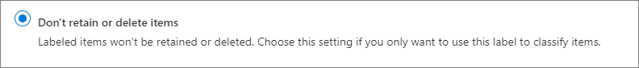

# 了解保留策略和保留标签

>*[Microsoft 365 安全性与合规性许可指南](https://aka.ms/ComplianceSD)。*

对于大多数组织，数据量和数据复杂性每天都在增加 — 包括电子邮件、文档、即时消息等。有效管理或管理此类信息非常重要，因为要：
  
- **主动遵守规定至少必须在一段时间内保留内容的行业法规和内部策略**：例如，《萨班斯-奥克斯利法案》规定，必须保留特定类型的内容七年。 
- **降低发生诉讼或出现安全漏洞的风险**：通过永久删除不再需要保留的旧内容。 
    
- **帮助组织有效共享知识并提高敏捷性**：通过确保用户仅处理与自己相关的最新内容。 
    
你配置的保留设置可有助于实现所有这些目标。 管理内容通常需要执行两项操作：
  
- **保留**内容，这样除非保留期到期，否则无法永久删除内容。 
    
- 在保留期到期时永久**删除**内容。 
    

通过这两项保留操作，可以配置保留设置来实现以下结果：

- 仅保留：永久或在指定的时间段内保留内容。
- 仅删除：在指定的时间段后删除内容。
- 保留后删除：在指定的时间段内保留内容后删除内容。

这些保留设置应用于在适当位置上的内容，如果你出于合规性原因需要保留内容，它们可以为你节省创建和配置附加存储的额外开销。 另外，无需实现自定义流程来复制和同步此数据。

## 保留设置如何应用于在适当位置上的内容

分配有保留设置的内容保留在它的原始位置上。 用户可以继续处理自己的文档或邮件，就像什么都没有改变一样。 不过，如果用户编辑或删除包含在保留策略中的内容，则会自动保留内容的副本，与在应用保留设置时存在的内容一样。
  
- 对于 SharePoint 和 OneDrive 网站：副本保留在**保留**库中。

- 对于 Exchange 邮箱：副本保留在“可恢复项”**** 文件夹中。 

- 对于 Teams 频道和聊天消息：副本保留在 Exchange“可恢复项”**** 文件夹内的隐藏文件夹中。

> [!NOTE]
> 保留库占用的存储计入网站的存储配额。 在对 SharePoint 和 Microsoft 365 组使用保留设置时，可能需要增加存储空间。
> 
这些安全位置和保留的内容对大部分用户不可见。 在大多数情况下，用户甚至不需要知道他们的内容遵循保留设置。

若要详细了解保留设置如何用于不同的工作负载，请参阅以下文章：

- [了解用于 SharePoint 和 OneDrive 的保留](retention-policies-sharepoint.md)
- [了解用于 Microsoft Teams 的保留](retention-policies-teams.md)
- [了解用于 Exchange 的保留](retention-policies-exchange.md)

## 保留策略和保留标签

可以同时使用保留策略和保留标签来向内容分配保留设置。 

使用保留策略可以在网站或邮箱级别为内容分配相同的保留设置，使用保留标签可以在项（文件夹、文档、电子邮件）级别分配保留设置。

例如，如果某 SharePoint 网站中的所有文档都应保留 5 年，那么使用保留策略比将相同的保留标签应用于此网站中的所有文档更高效。 不过，如果此网站中的一些文档应保留 5 年，另一些文档应保留 10 年，那么保留策略就无法实现这一点。 如果需要在项级别指定保留设置，请使用保留标签。 

与保留策略不同，如果内容被复制或移动到不同的 Microsoft 365 位置，保留标签的保留设置仍继续应用在内容上。 另外，保留标签具有保留策略不支持的以下功能： 
 
- 除了根据内容年限或上次修改时间计算保留期之外，还可以从内容被标记时或根据事件开始计算保留期。

- 使用[可训练的分类器](classifier-getting-started-with.md)来标识要标记的内容。

- 为 SharePoint 文档应用默认标签。

- 支持[处置评审](disposition-reviews.md) ，以在永久删除内容前评审内容。

- 将内容标记为[记录](records.md)作为标签设置的一部分，并对在保留期结束时删除的内容始终都有 [处置证明](disposition.md#disposition-of-records) 。

### 保留策略

可以将保留策略应用于以下位置：
- Exchange 电子邮件
- SharePoint 网站
- OneDrive 帐户
- Microsoft 365 组
- Skype for Business
- Exchange 公用文件夹
- Teams 通道消息
- Teams 聊天

可以非常高效地将一个策略应用于多个位置，也可以应用于特定的位置或用户。
    
还可以将策略应用于所有内容，或应用于满足特定条件（如包含关键字或[敏感信息类型](sensitive-information-type-entity-definitions.md)）的内容。

#### 使用保留锁定遵从合规性要求

某些组织可能需要遵从由监管机构定义的规则，如美国证券交易委员会 (SEC) 规则 17a-4，这要求在某个保留策略启用后，不得关闭该策略或减少其限制。 

保留锁定可确保组织符合此类法规要求，因为它可以锁定保留策略，这样包括管理员在内的任何人都无法禁用策略、删除策略或减少对策略的限制。
  
锁定某个保留策略后：

- 任何人都不能将其关闭
- 可以添加位置，但不能删除位置
- 无法在保留期内修改或删除受策略制约的内容
- 可以延长保留期，但不能缩短保留期

总而言之，锁定的保留策略可以增加或扩展锁定的策略，但不能减少或关闭策略。
  
> [!IMPORTANT]
> 在锁定保留策略之前，请务必了解这样做的影响，并确认组织是否需要这样做来遵守法规要求。 在应用保留锁定后，管理员便无法禁用或删除保留策略。

#### 解除保留策略

若保留策略没有保留锁定，则可随时关闭或删除它。 

当你这样做时，任何被保留在保留库中的 SharePoint 或 OneDrive 内容都不会立即遭永久删除。 相反，为了防止意外的数据丢失，我们设置了 30 天的宽限期。在此期间，相应策略的内容不会在保留库中到期，所以你可以根据需要从其中还原任何内容。 此外，在宽限期内无法手动删除此内容。

可在宽限期内重新启用保留策略，相应策略的任何内容都不会遭删除。

SharePoint 和 OneDrive 中的此 30 天宽限期对应于 Exchange 中的 30 天延迟保留。 有关详细信息，请参阅[管理延迟保留的邮箱](identify-a-hold-on-an-exchange-online-mailbox.md#managing-mailboxes-on-delay-hold)。

### 保留标签

对于需要不同保留设置的不同类型的内容，可以使用保留标签。 例如：
  
- 至少必须保留一段时间的税务表单。 
    
- 达到特定年限后必须永久删除的新闻材料。 
    
- 必须在保留一段时间后永久删除的竞争性研究。 
    
- 必须标记为记录以免被编辑或删除的工作签证。 
    
在所有这些情况下，可以使用保留标签在项（文档或电子邮件）级别应用保留设置来实现管理控制。
  
使用保留标签，你可以：
  
- **允许组织中的人员将保留标签手动应用于** Outlook 和 Outlook 网页版、OneDrive、SharePoint​​ 和 Microsoft 365 组中的内容。 用户通常最了解自己处理的内容的类型，因此他们可以对内容进行分类，并应用适当的保留设置。 
    
- **将保留标签自动应用于**符合特定条件的内容，如内容包含： 
    - 特定类型敏感信息。
    - 与所创建的查询匹配的特定关键字。
    - 可训练分类器的模式匹配。

- **从内容被标记时开始计算保留期**，适用于 SharePoint 网站和 OneDrive 帐户中的文档，以及除日历项外的电子邮件项。 如果你将具有此配置的保留标签应用于日历项，保留期从日历项发送时开始计算。

- **从事件发生时开始计算保留期**，如员工离开组织或合同到期。

- **将默认保留标签应用于 SharePoint 中的文档库、文件夹或文档集**，以让存储在该位置的所有文档都继承默认保留标签。

此外，保留标签支持跨 Microsoft 365 应用和服务对电子邮件和文档实施[记录管理](records-management.md)。 你可以使用保留标签将内容分类为记录。 如果发生这种情况，并且内容仍保留在 Microsoft 365 中，则无法更改或删除标签，也不能编辑或删除内容。 

如果内容被移动到 Microsoft 365 之外，则保留标签将不会继续存在，这一点与[敏感度标签](sensitivity-labels.md)是不同的。

租户支持的保留标签数没有限制。 但是，租户支持的最大策略数为 10,000，其中包括应用标签的策略（保留标签策略和自动应用保留策略）以及保留策略。

#### 对内容分类但不执行任何操作

虽然保留标签的主要用途是保留或删除内容，但也可以在使用保留标签时不启用任何保留或其他操作。 在这种情况下，可以简单地将保留标签用作文本标签，而不强制执行任何操作。
  
例如，可以创建并应用名为“稍后评审”且不含任何操作的保留标签，稍后使用此标签来查找相应内容。
  

#### 将保留标签用作 DLP 策略中的条件

对于 SharePoint 中的文档，可以将保留标签指定为数据丢失防护 (DLP) 策略中的条件。 例如，配置一个 DLP 策略，以防在组织外部共享应用了指定保留标签的文档。

有关详细信息，请参阅[将保留标签用作 DLP 策略中的条件](data-loss-prevention-policies.md#using-a-retention-label-as-a-condition-in-a-dlp-policy)。

#### 保留标签和应用它们的策略

保留标签是独立的可重用的构建基块。 保留标签策略的主要目的是对一组保留标签进行分组，并指定要显示标签的位置。 然后，管理员和用户可以将这些标签应用于这些位置中的内容。
  

  
在你发布保留标签后，它们包含在保留标签策略中，以供管理员和用户选择：

- 一个保留标签可以包含在多个保留标签策略中。

- 保留标签策略指定了保留标签的发布位置。

- 一个位置也可以包含在多个保留标签策略中。

除了保留标签策略之外，还可以创建一个或多个自动应用策略，每个策略都有一个保留标签。 如果使用此策略，当满足你在策略中指定的条件时，保留标签就会自动应用。 

#### 保留标签策略和位置

不同类型的保留标签可发布到不同位置，具体视保留标签用途而定。
  
| 如果保留标签是… | 可以将标签策略应用于… |
|:-----|:-----|
|发布给管理员和最终用户    |Exchange、SharePoint、OneDrive、Microsoft 365 组    |
|根据敏感信息类型或可训练的分类器自动应用    |Exchange（仅全部邮箱）、SharePoint 和 OneDrive    |
|根据查询自动应用    |Exchange、SharePoint、OneDrive、Microsoft 365 组    |
   
在 Exchange 中，自动应用保留标签只会应用于新发送的邮件（传输中的数据），而不是应用于邮箱中当前的所有项（静态数据）。 此外，用于敏感信息类型和可训练的分类器的自动应用保留标签应用于所有邮箱；你无法选择特定的邮箱。
  
Exchange 公用文件夹、Skype 和 Teams 频道消息和聊天不支持保留标签。 若要保留并从这些位置中删除内容，请改用保留策略。

#### 一次只能分配一个保留标签

电子邮件或文档一次只能分配有一个保留标签：
  
- 对于管理员或最终用户手动分配的保留标签，用户可删除或更改所分配的保留标签。
    
- 如果内容已分配有自动应用标签，可以将此标签替换为发布的保留标签。
    
- 如果内容已分配有发布的保留标签，无法将此标签替换为自动应用标签。
    
- 若有多个规则要分配自动应用标签，且内容满足多个规则的条件，那么分配的是年限最长规则的保留标签。
    
若要了解如何以及为何应用一个保留标签（而非另一个），则了解显式分配标签和隐式分配标签之间的差异非常有用：

- 通过标签策略应用的保留标签是显式分配的
- 通过自动应用策略自动应用的保留标签是隐式分配的

显式分配的保留标签优先于隐式分配的保留标签。 有关详细信息，请参阅本页上的[保留原则或优先性是什么？](retention.md#the-principles-of-retention-or-what-takes-precedence)部分。

#### 使用内容搜索来查找所有已应用有特定保留标签的内容

在保留标签分配到内容后（无论是用户分配还是自动应用），你都可通过内容搜索来查找所有已使用特定保留标签进行分类的内容。
  
创建内容搜索时，选择“**合规性标签**”条件，然后输入完整的保留标签名称或标签名称的一部分，并使用通配符。 有关详细信息，请参阅[适用于内容搜索的关键字查询和搜索条件](keyword-queries-and-search-conditions.md)。
  

## 比较保留策略和保留标签的功能

请使用下表来帮助你根据功能确定是使用保留策略还是保留标签。

|功能|保留策略 |保留标签|
|:-----|:-----|:-----|:-----|
|保留设置可以是“保留后删除”、“仅保留”或“仅删除” |是 |是 |
|支持的工作负载：  - Exchange  - SharePoint  - OneDrive  - Microsoft 365 组  - Skype for Business  - Teams|  是   是   是   是   是   是 |   是，但公用文件夹除外   是   是   是   否   否  |
|自动应用保留 | 是 | 是 |
|手动应用保留 | 否 | 是 |
|对最终用户显示 UI | 否 | 是 |
|在内容移动时仍继续应用在内容上 | 否 | 是，在 Microsoft 365 中 |
|将项声明为记录| 否 | 是 |
|从内容被标记或事件发生时开始计算保留期 | 否 | 是 |
|处置评审 | 否| 是 |
|最长 7 年的处置证明 | 否 |是，当项被声明为记录时|
|识别遵循保留设置的项：   - 内容搜索   - 数据分类页、内容资源管理器、活动资源管理器 |   否   否 |   是   是|

请注意，可以同时将保留策略和保留标签用作互补的保留方法。 例如：

1. 你创建并配置一个保留策略，以便在自最后一次修改内容起 5 年后自动删除内容，同时你将此策略应用于所有 OneDrive 帐户。

2. 你创建并配置一个保留标签来永久保留内容，同时你将此标签添加到发布到所有 OneDrive 帐户的标签策略中。 你向用户解释如何将此标签手动应用于特定文档，这些文档应排除在 5 年未修改后自动删除范围之外。

若要详细了解保留策略和保留标签是如何协同工作的，以及如何确定它们的合并结果，请参阅下一部分，其中介绍了保留原则和优先级。

## 保留原则或优先级

内容可能（甚至可能性很高）应用有多个保留策略和保留标签，每个策略和标签都有不同的操作（保留、删除或保留后删除）和保留期。 优先级 

概括来说，可以确定的是，保留始终优先于删除，然后是最长保留期胜出。 

不过，此复杂问题还需要考虑其他几个因素，所以请使用以下流来理解优先级顺序自上而下的结果：如果结果由第一个级别决定，则无需进入下一级别，依此类推。 只有当结果无法由当前级别的规则确定时，流才会向下移动到下一个级别，以确定保留设置的优先级结果。

  
有关四种不同级别的说明：
  
1. **保留优先于删除。** 如果某保留策略配置为在 3 年后删除 Exchange 电子邮件，但另一保留策略配置为将 Exchange 电子邮件保留 5 年后再删除。 达到 3 年的内容将被删除并隐藏，但仍保留在“可恢复项目”文件夹中，然后在达到 5 年后被永久删除。 
2. **优选最长的保留期。** 如果内容遵循多个在不同时间段内保留内容的保留设置，内容会一直保留到最长保留期结束。
    
3. **显式包含优先于隐式包含。** 这意味着： 
    
    1. 如果具有保留设置的保留标签是由用户手动分配给项（如 Exchange 电子邮件或 OneDrive 文档），此保留标签优先于在站点或邮箱级别分配的保留策略，同时也优先于向文档库分配的默认保留标签。 例如，如果显式保留标签配置为将内容保留 10 年，但分配给此站点的保留策略配置为只将内容保留 5 年，则保留标签优先。 自动应用保留标签被视为隐式标签，而不是显式标签，因为它们由 Microsoft 365 自动应用。
    
    2. 如果保留策略包含特定位置（如特定用户的邮箱或 OneDrive 帐户），此保留策略优先于应用于所有用户邮箱或 OneDrive 帐户（而不是包含具体用户邮箱）的其他保留策略。
    
4. **最短删除期优先。** 同样，如果内容遵循多个删除内容而无保留期的保留设置，内容会在最短保留期结束时删除。 

最后，保留策略或保留标签无法永久删除任何保留用于电子数据展示的内容。 当保留解除时，此内容重新符合工作负载的安全位置中的清除过程的条件。

## 用于保留策略和保留标签的 PowerShell cmdlet

若要使用保留 cmdlet，必须先[连接到 Office 365 安全与合规中心 PowerShell](https://docs.microsoft.com/powershell/exchange/office-365-scc/connect-to-scc-powershell/connect-to-scc-powershell)。 然后，使用以下任何 cmdlet：

- [Get-ComplianceTag](https://docs.microsoft.com/powershell/module/exchange/get-compliancetag)

- [New-ComplianceTag](https://docs.microsoft.com/powershell/module/exchange/new-compliancetag)

- [Remove-ComplianceTag](https://docs.microsoft.com/powershell/module/exchange/remove-compliancetag)

- [Set-ComplianceTag](https://docs.microsoft.com/powershell/module/exchange/set-compliancetag)

- [Enable-ComplianceTagStorage](https://docs.microsoft.com/powershell/module/exchange/enable-compliancetagstorage)

- [Get-ComplianceTagStorage](https://docs.microsoft.com/powershell/module/exchange/get-compliancetagstorage)

- [Get-RetentionCompliancePolicy](https://docs.microsoft.com/powershell/module/exchange/get-retentioncompliancepolicy)

- [New-RetentionCompliancePolicy](https://docs.microsoft.com/powershell/module/exchange/new-retentioncompliancepolicy)

- [Remove-RetentionCompliancePolicy](https://docs.microsoft.com/powershell/module/exchange/remove-retentioncompliancepolicy)

- [Set-RetentionCompliancePolicy](https://docs.microsoft.com/powershell/module/exchange/set-retentioncompliancepolicy)

- [Get-RetentionComplianceRule](https://docs.microsoft.com/powershell/module/exchange/get-retentioncompliancerule)

- [New-RetentionComplianceRule](https://docs.microsoft.com/powershell/module/exchange/new-retentioncompliancerule)

- [Remove-RetentionComplianceRule](https://docs.microsoft.com/powershell/module/exchange/remove-retentioncompliancerule)

- [Set-RetentionComplianceRule](https://docs.microsoft.com/powershell/module/exchange/set-retentioncompliancerule)

## 使用保留策略和保留标签，而不是旧功能

如果需要在 Microsoft 365 中主动保留或删除内容来实现信息管理，建议使用保留策略和保留标签，而不是以下旧功能。 
  
如果当前使用这些旧功能，可以继续将它们与保留策略和保留标签并行使用。 但我们建议今后使用保留策略和保留标签。 它们为你提供了在 Microsoft 365 中集中管理内容保留和删除的单一机制。

**Exchange Online 中的早期功能：**

- [就地保留和诉讼保留](https://go.microsoft.com/fwlink/?linkid=846124)（电子数据展示保留） 

- [如何识别为 Exchange Online 邮箱设置的保留类型](identify-a-hold-on-an-exchange-online-mailbox.md)
    
- [保留标记和保留策略](https://go.microsoft.com/fwlink/?linkid=846125)，亦称为[邮件传递记录管理 (MRM)](https://go.microsoft.com/fwlink/?linkid=846126)（仅限删除）
    
另请参阅[旧版电子数据展示工具的停用](legacy-ediscovery-retirement.md)。

**SharePoint 和 OneDrive 中的早期功能：**

- [在电子数据展示中心内将内容添加到案件集并保留源](https://docs.microsoft.com/SharePoint/governance/add-content-to-a-case-and-place-sources-on-hold-in-the-ediscovery-center)（电子数据展示保留） 
    
- [文档删除策略](https://support.office.com/article/Create-a-document-deletion-policy-in-SharePoint-Server-2016-4fe26e19-4849-4eb9-a044-840ab47458ff)（仅删除）
    
- [配置就地记录管理](https://support.office.com/article/7707a878-780c-4be6-9cb0-9718ecde050a)（仅限保留） 
    
- [使用网站关闭和删除策略](https://support.microsoft.com/zh-CN/office/use-policies-for-site-closure-and-deletion-a8280d82-27fd-48c5-9adf-8a5431208ba5)（仅限删除） 
    
- [信息管理策略](intro-to-info-mgmt-policies.md)（仅限删除）
     
如果之前使用了任何电子数据展示保留进行信息管理，为实现主动合规，请改为使用保留策略。 仅对保留策略使用电子数据展示。
  
### 保留策略和 SharePoint 内容类型策略或信息管理策略

如果已将 SharePoint 网站配置为应用保留列表或库的内容的内容类型策略或信息管理策略，则这些策略会在保留策略生效时被忽略。 

## 相关信息

- [SharePoint Online 限制](https://docs.microsoft.com/office365/servicedescriptions/sharepoint-online-service-description/sharepoint-online-limits)
- [Microsoft Teams 的限制和规范](https://docs.microsoft.com/microsoftteams/limits-specifications-teams) 
- [符合 SEC 规则 17a-4](use-exchange-online-to-comply-with-sec-rule-17a-4.md)

## 后续步骤

如果已准备好创建保留策略，请参阅[创建和配置保留策略](create-retention-policies.md)。

若要创建和应用保留标签，请执行以下操作：
- [创建保留标签并在应用中应用它们](create-apply-retention-labels.md)
- [自动向内容应用保留标签](apply-retention-labels-automatically.md)

