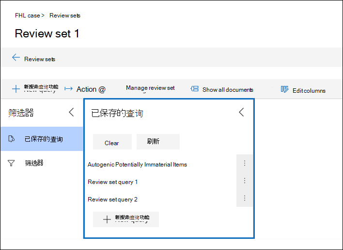

# 查询审阅集中的数据Query the data in a review set

在大多数情况下，能够深入了解审阅集内的数据并组织该数据以促进更高效的审阅将非常有用。In most cases, it will be useful to be able to dig deeper into the data in a review set and organize that data to facilitate a more efficient review. 在审阅集中使用查询可帮助您重点关注满足审阅条件的文档的子集。Using Queries in a review set helps you focus on a subset of documents that meet the criteria of your review.

## 在审阅集内创建和运行查询Creating and running a query in a review set

若要创建并运行对审阅集内文档的查询，请选择审阅 **集** 内的新查询。To create and run a query on the documents in a review set, select **New query** in the review set. 命名查询并定义条件后，选择" **保存** "保存并运行查询。After you name your query and define the conditions, select **Save** to save and run the query. 若要运行以前保存的查询，请选择已保存的查询。To run a query that has been previously saved, select a saved query.

## 生成审阅集查询Building a review set query

您可以使用关键字、属性和条件组合在"关键字"条件中生成查询。You can build a query by using a combination of keywords, properties, and conditions in the Keywords condition. 还可以将条件分组为一个 (一个称为条件) 构建更复杂的查询的块。You can also group conditions as a block (called a *condition group*) to build a more complex query. 有关可以搜索的元数据属性的列表和说明，请参阅 [高级电子数据展示中的文档元数据字段](document-metadata-fields-in-Advanced-eDiscovery.md)。For a list and description of metadata properties that you can search, see [Document metadata fields in Advanced eDiscovery](document-metadata-fields-in-Advanced-eDiscovery.md).

### 条件Conditions

审阅集内每个可搜索字段都有一个可用于生成查询的相应条件。Every searchable field in a review set has a corresponding condition that you can use to build your query.

存在多种类型的条件：There are multiple types of conditions:

- Freetext：自由文本条件用于文本字段，如主题。Freetext: A freetext condition is used for text fields such as subject. 可以通过用逗号分隔出多个搜索词来列出这些搜索词。You can list multiple search terms by separating them out with a comma.

- Date：日期条件用于日期字段，如上次修改日期。Date: A date condition is used for date fields such as last modified date.

- 搜索选项：搜索选项条件将提供审阅集内特定字段的可能值列表。Search options: A search options condition will provide a list of possible values for the particular field in your review set. 这用于审阅集可能值有限数量的字段（如发件人）。This is used for fields, such as sender, where there is a finite number of possible values in your review set.

- 关键字：关键字条件是可用于搜索词或使用 KQL 类似查询语言的 freetext 条件的特定实例。Keyword: A keyword condition is a specific instance of freetext condition that you can use to search for terms, or use KQL-like query language in. 有关详细信息，请参阅下文。See below for more detail.

### 查询语言Query language

除了条件之外，您还可以在"关键字"条件中使用类似 KQL 的查询语言来构建查询。In addition to conditions, you can use a KQL-like query language in the Keywords condition to build your query. 审阅集查询的查询语言支持标准布尔运算符，如AND、OR、NOT和 **NEAR**。The query language for review set queries supports standard Boolean operators, such as **AND**, **OR**, **NOT**, and **NEAR**. 它还支持单字符通配符 (？) 和多字符通配符 (\*) 。It also supports a single-character wildcard (?) and a multi-character wildcard (\*).

## 筛选器Filters

除了可以保存的查询之外，您还可以使用审阅集筛选器将其他条件快速应用于审阅集查询。In addition to queries that you can save, you can use review set filters to quickly apply additional conditions to a review set query. 使用筛选器可帮助您进一步优化审阅集查询显示的结果。Using filters help you further refine the results displayed by a review set query.

筛选器与查询有两种显著区别：Filters differ from queries in two significant ways:

- 筛选器是暂时性的。Filters are transient. 它们不会延续到现有会话之外。They don't persist beyond the existing session. 换句话说，无法保存筛选器。In other words, you can't save a filter. 查询将保存到审阅集，并且只要打开审阅集，就会访问查询。Queries are saved to the review set, and access them whenever you open the review set.

- 筛选器始终是累加的。Filters are always additive. 除当前审阅集查询外，还应用筛选器。Filters are applied in addition to the current review set query. 应用其他查询将替换当前查询返回的结果。Applying a different query will replace the results returned by the current query.
