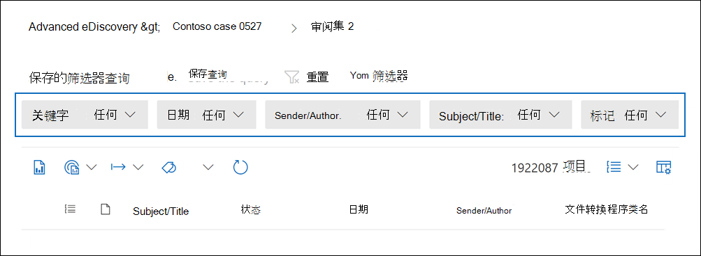
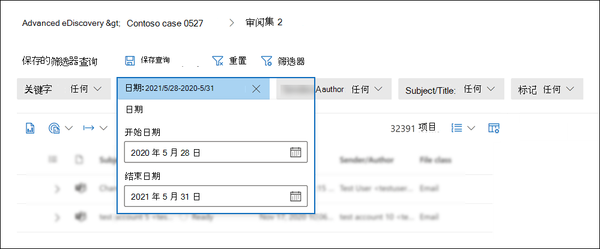
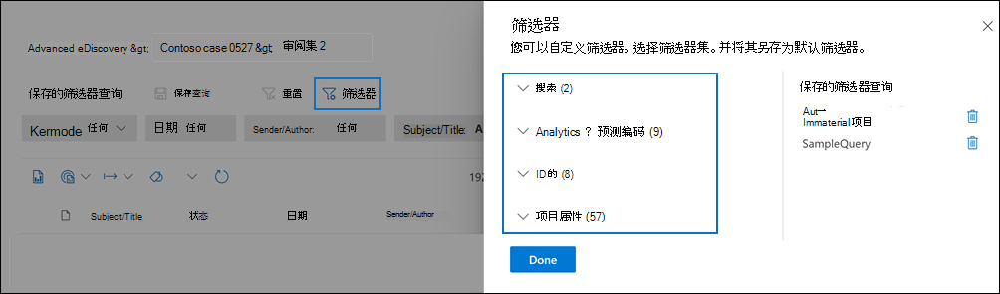
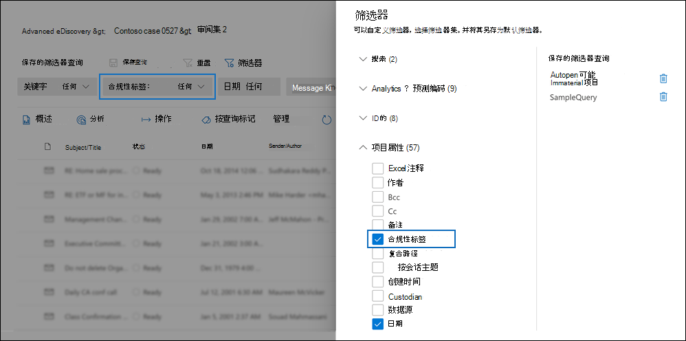
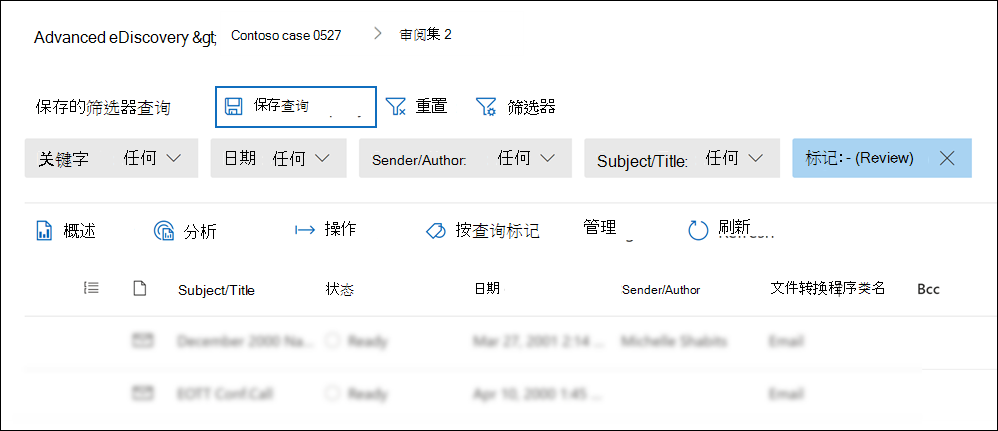
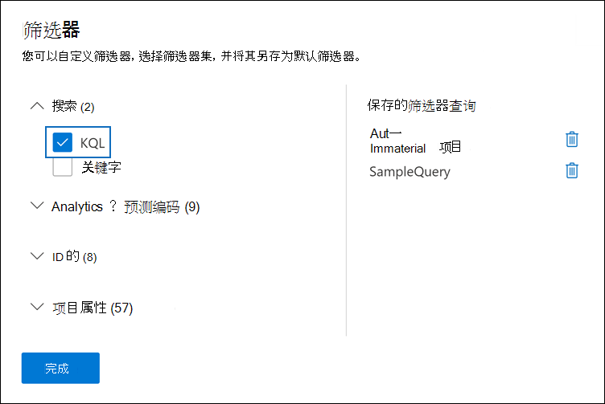

# 查询和筛选审阅集中的内容

在大多数情况下，深入探究审阅集内的内容并组织该内容以促进更高效的审阅将非常有用。 在审阅集中使用筛选器和查询可帮助您重点关注满足审阅条件的文档的子集。

## 默认筛选器

在审阅集内，有五个默认筛选器预加载到审阅集：

- 关键字
- Date
- 发件人/作者
- 主题/标题
- 标记

单击每个筛选器以展开它并分配一个值。 单击筛选器外部以自动将筛选器应用于审阅集。 以下屏幕截图显示了配置为显示日期范围内的文档的日期筛选器。

## 添加或删除筛选器

若要添加或删除为审阅集显示的筛选器，请选择"筛选器"以打开显示在飞出页上的筛选器面板。 

可用筛选器分为四个部分：

- **搜索**：提供不同搜索功能的筛选器。

- **分析&** 编码：运行文档分析作业或使用预测编码模型时生成& **添加到** 文档的属性筛选器。

- **ID：** 筛选文档的所有 ID 属性。

- **项目属性**：文档属性筛选器。 

展开每个部分，选择或取消选择筛选器以在筛选器集中添加或删除它们。 添加筛选器时，筛选器集会显示该筛选器。 

> [!NOTE]
> 展开筛选器面板中的节时，您将注意到已选择默认筛选器类型。 您可以保持选中状态或取消选择它们，然后从筛选器集中删除它们。 

## 筛选器类型

审阅集内每个可搜索字段都有一个对应的筛选器，可用于基于特定字段筛选项目。

筛选器有多种类型：

- **Freetext**：将自由文本筛选器应用于文本字段，如"Subject"。 可以通过用逗号分隔多个搜索词来列出这些搜索词。

- **Date**：日期筛选器用于"上次修改日期"等日期字段。

- **搜索选项**：搜索选项筛选器提供一个可能值列表 (其中每个值都显示一个复选框，你可以为审阅中的特定字段) 复选框。 此筛选器用于审阅集可能值有限数量的字段，例如"发件人"。

- **关键字**：关键字条件是可用于搜索词的 freetext 条件的特定实例。 您还可以在此类型的筛选器中使用类似 KQL 的查询语言。 有关详细信息，请参阅本文中的查询语言和高级查询生成器部分。

## 包含和排除筛选器关系

您可以更改特定筛选器的 include 和 exclude 关系。 例如，在"标记"筛选器中，可以通过在下拉列表筛选器中选择"等于 **无** "来排除用特定标记标记的项目。 

## 将筛选器另存为查询

对筛选器感到满意后，可以将筛选器组合另存为筛选器查询。 这样，你可以在将来的审阅会话中应用筛选器。

若要保存筛选器，请选择 **"保存查询并** 命名它"。 您或其他审阅者可以通过选择"保存的筛选器查询"下拉列表并选择要应用于审阅集文档的筛选器查询来运行以前保存的筛选器查询。 

若要删除筛选器查询，请打开筛选面板并选择查询旁边的回收站图标。

## 查询语言

除了使用筛选器之外，您还可以使用关键字筛选器中的 KQL 类似查询语言来构建审阅集搜索查询。 审阅集查询的查询语言支持标准布尔运算符，如 **AND**、 **OR**、 **NOT** 和 **NEAR**。 它还支持单字符通配符 (？) 和多字符通配符 (*) 。

## 高级查询生成器

您还可以生成更高级的查询来搜索审阅集内的文档。

1. 打开筛选面板，选择" **筛选器"**，然后展开" **搜索"** 部分。

  

2. 选择 **KQL 筛选器** ，然后单击" **打开查询生成器"**。

   在此面板中，您可以使用查询生成器创建复杂的 KQL 查询。 可以添加条件或添加条件组，这些条件组由 AND 或 **OR** 关系在逻辑上 **连接的多个条件** 组成。

   

## 筛选部分索引项

如果在将草稿集合提交到审阅集时选择了从其他数据源添加部分索引项的选项。 您可能需要标识和查看这些项目，以确定某个项目是否可能与调查相关，以及您是否需要修正导致项目部分编制索引的错误。

目前，审阅集没有用于显示部分索引项的筛选选项。 但我们正在努力处理它。 在此之前，您可以通过以下方法筛选和显示已添加到审阅集的部分索引项。

1. 创建集合，并提交到新的审阅集 *，而无需* 添加其他数据源中的部分索引项。

2. 通过复制步骤 1 中的集合来创建新集合。

3. 将新集合提交到同一审阅集。 但这次，请添加其他数据源中的部分索引项。 由于已在步骤 1 中创建的集合中的项目已添加到审阅集，因此仅将第二个集合中的部分索引项添加到审阅集。

4. 将两个集合添加到审阅集后，转到审阅集，然后选择 **"管理** > **加载集"**。

5. 复制或记下第二个集合的 **Load Id** (步骤 2 中创建的集合) 。 集合名称在"源信息" **列中标识** 。

6. 返回到审阅集，单击" **筛选器**"，展开 **"ID"** 部分，然后选中" **加载 ID"** 复选框。

7. 展开" **Load Id** "筛选器，然后选中对应于第二个集合的加载 ID 对应的复选框以显示部分索引项。
