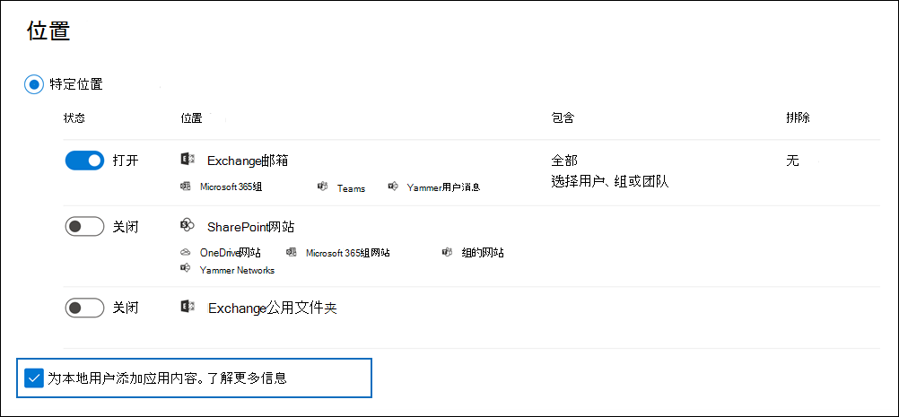

# <a name="search-for-teams-chat-data-for-on-premises-users"></a>搜索 Teams 中本地用户的聊天数据

如果你的组织具有 Exchange 混合部署（或者贵组织已将本地 Exchange 组织与 Office 365 同步），并且已启用 Microsoft Teams，则本地用户可以使用 Teams 聊天应用程序进行即时消息传递。 对于基于云的用户，Teams 聊天数据（也称为 *1x1 或 1xN 聊天*）将保存到其基于云的主邮箱中。 如果本地用户使用团队聊天应用程序，其聊天消息将无法存储在本地主邮箱中。 为了绕开此限制，Microsoft 发布了一项新功能，在其中创建了基于云的存储区域，以便使用电子数据展示工具搜索和导出本地用户的 Teams 聊天数据。
  
以下是针对本地用户启用基于云的存储的要求和限制：
  
- 本地目录服务（如 Active Directory）中的用户帐户必须与 Azure Active Directory（Microsoft 365 中的目录服务）同步。 这意味着将在 Microsoft 365 中创建一个邮件用户帐户，并将该帐户与其主邮箱位于本地组织中的用户相关联。

- 必须为其主邮箱位于本地组织中的用户分配 Microsoft Teams 许可证和 Exchange Online 计划 1 许可证（最低要求）。

- 如果您的组织没有 Exchange 混合部署，则必须将本地 Exchange 架构同步到 Azure Active Directory。 如果不这样做，虽然用户在本地 Exchange 组织中已有邮箱，你仍可能要冒险为其在 Exchange Online 中创建重复的基于云的邮箱。

- 只有与本地用户关联的 Teams 聊天数据存储在基于云的存储区域中。 本地用户不能以任何方式访问此存储区域。

> [!NOTE]
> Teams 频道对话始终存储在与 Teams 关联的基于云的邮箱中，这意味着可以搜索频道对话。 有关搜索 Teams 频道对话的详细信息，请参阅[搜索 Microsoft Teams 和 Microsoft 365 组](content-search-reference.md#searching-microsoft-teams-and-microsoft-365-groups)。
  
## <a name="how-it-works"></a>运作方式

如果启用 Microsoft Teams 的用户拥有本地邮箱，并且其用户帐户/标识已同步到云端，Microsoft 将创建基于云的存储，以便关联本地用户的1xN Teams 聊天数据。 本地用户的团队聊天数据已编入索引，可用于搜索。 这让你能够使用“内容搜索”（以及与核心电子数据展示和高级电子数据展示事例关联的搜索）来搜索、预览和导出本地用户的 Teams 聊天数据。 你还可以使用安全与合规中心 PowerShell 中的 **\*ComplianceSearch** cmdlet 来搜索本地用户的 Teams 聊天数据。
  
下图显示了搜索、预览和导出本地用户的 Teams 聊天数据的工作流。
  

  
除了此功能之外，你还可以使用电子数据展示工具在基于云的 SharePoint 网站和与每个 Microsoft Team 关联的 Exchange 邮箱中搜索、预览和导出 Teams 内容，以及在基于云的用户的 Exchange Online 邮箱中搜索、预览和导出 1xN Teams 聊天数据。

### <a name="how-this-feature-is-supported-in-content-search-and-core-ediscovery-search-tools"></a>“内容搜索”和核心电子数据展示搜索工具如何支持此功能

Microsoft 365 合规中心中的“内容搜索”以及与核心电子数据展示事例关联的搜索工具中的以下 UI 元素：
  
- “**为本地用户添加应用内容**”复选框显示在内容搜索工具的“**位置**”向导页上，并默认选中。 选中此复选框可在内容搜索中包括本地用户的基于云的存储。

    
  
- 当选择搜索特定用户时，可以搜索本地用户。

## <a name="searching-for-teams-chat-content-for-on-premises-users"></a>搜索本地用户的 Teams 聊天内容

下面介绍了如何使用 Microsoft 365 合规中心中的“内容搜索”来搜索本地用户的 Teams 聊天数据。
  
1. 在 Microsoft 365 合规中心中，转到“**内容搜索**”。

2. 在“**搜索**”选项卡上，单击“**新建搜索**”，然后命名新搜索。

3. 在“**位置**”页面上，为 Exchange 邮箱将切换设置为“**打开**”。 请注意，“**为本地用户添加应用内容**”复选框已显示，并默认选中。

4. 若要搜索特定用户的 Teams 内容，请选择“**选择用户、组或团队**”，并选择特定用户包含在搜索中。 否则，单击“**下一步**”搜索所有用户（包括本地用户）的 Teams 内容

5. 在“**定义搜索条件**”页面上，创建关键字查询，并在必要时将条件添加到搜索查询。 若要仅搜索 Teams 聊天数据，可在“**关键字**”框中添加以下查询：

    ```text
    kind:im AND kind:microsoftteams
    ```

6. 提交并运行搜索。 可像预览任何其他搜索结果一样预览本地用户的任何搜索结果。 你还可以将搜索结果（包括任何 Teams 聊天数据）导出到 PST 文件。 有关详细信息，请参阅：

    - [创建搜索](content-search.md)

    - [预览搜索结果](preview-ediscovery-search-results.md)

    - [导出搜索结果](export-search-results.md)

## <a name="using-powershell-to-search-for-teams-chat-data-for-on-premises-users"></a>使用 PowerShell 搜索本地用户的 Teams 聊天数据

你可以使用安全与合规中心 PowerShell 中的 **New-ComplianceSearch** 和 **Set-ComplianceSearch** cmdlet 来搜索本地用户的 Teams 聊天数据。 如前文所述，无需提交支持请求即可使用 PowerShell 来搜索本地用户的 Teams 聊天数据。
  
1. [连接到安全与合规中心 PowerShell](/powershell/exchange/connect-to-scc-powershell)。

2. 运行以下 PowerShell 命令以创建用于搜索本地用户 Teams 聊天数据的内容搜索。

    ```powershell
    New-ComplianceSearch <name of new search> -ContentMatchQuery <search query> -ExchangeLocation <on-premises user> -IncludeUserAppContent $true -AllowNotFoundExchangeLocationsEnabled $true  
    ```

    *IncludeUserAppContent* 参数用于为由 *ExchangeLocation* 参数指定的一个或多个用户指定基于云的存储。 *AllowNotFoundExchangeLocationsEnabled* 允许你搜索本地用户基于云的存储。 使用此参数的 `$true` 值时，搜索不会在运行之前尝试验证邮箱是否存在。 这是搜索本地用户的基于云的存储所必需的，因为此基于云的存储未作为常规的基于云的邮箱进行解析。

    以下示例在 Sara Davis 基于云的存储中搜索包含关键字“redstone”的 Teams 聊天，Sara Davis 是 Contoso 组织内的本地用户。
  
    ```powershell
    New-ComplianceSearch "Redstone_Search" -ContentMatchQuery "redstone AND (kind:im AND kind:microsoftteams)" -ExchangeLocation sarad@contoso.com -IncludeUserAppContent $true -AllowNotFoundExchangeLocationsEnabled $true  
    ```

   创建搜索后，请务必使用 **Start-ComplianceSearch** cmdlet 运行搜索。
  
有关使用这些 cmdlet 的详细信息，请参阅：
  
- [New-ComplianceSearch](/powershell/module/exchange/new-compliancesearch)

- [Set-ComplianceSearch](/powershell/module/exchange/set-compliancesearch)

- [Start-ComplianceSearch](/powershell/module/exchange/start-compliancesearch)

## <a name="known-issues"></a>已知问题

- 目前，你可以搜索、预览和导出本地用户的 Teams 聊天数据。 你还可以将本地用户的 Teams 聊天数据置于与核心和高级电子数据展示事例关联的保留中，并应用本地用户的 Teams 聊天或频道消息的保留策略。 但是，目前无法应用本地用户其他内容位置（如 Exchange 邮箱和 SharePoint 网站）的保留策略。

## <a name="frequently-asked-questions"></a>常见问题解答

**是否必须提交支持请求才能搜索本地用户的聊天消息？**

否。 将默认为所有组织启用此功能。 你曾经不得不联系 Microsoft 支持部门，但这种情况不再发生。
  
 **在为所有组织默认启用此功能之前，电子数据展示工具能否查找本地用户的较早 Teams 聊天数据？**
  
Microsoft 从 2018 年 1 月 31 日开始存储本地用户的 Teams 聊天数据。因此，如果自此日期以来在本地 Active Directory 和 Microsoft 365 中的 Azure Active Directory 之间同步了本地 Teams 用户的标识，则他们的 Teams 聊天数据存储在云中，并且可使用电子数据展示工具进行搜索。

 **本地用户是否需要许可证才能将他们的 Teams 聊天数据存储在云中？**
  
是的。若要将本地用户的 Teams 聊天数据存储在基于云的存储中，必须在 Office 365（或 Microsoft 365）中为该用户分配 Microsoft Teams 许可证和 Exchange Online 计划许可证。

**本地用户基于云的邮箱位于何处？**
  
Teams 聊天数据存储在本地用户的“首选数据位置”（PDL）中。 PDL 同时在单一地理和多地理环境中都授予支持。 有关详细信息，请参阅 [Microsoft 365 多地理位置](../enterprise/microsoft-365-multi-geo.md)。

**如果将用户的本地邮箱迁移到云，是否有丢失 Teams 聊天数据的风险？**
  
没有。将本地用户的主邮箱迁移到云后，该用户的 Teams 聊天数据将迁移到其基于云的新主邮箱中。
  
 **是否可以为本地用户应用电子数据展示保留或保留策略？**
  
是。 你可以应用本地用户的 Team 聊天和频道消息的电子数据展示保留或保留策略。 但是，若要保留本地用户的 Teams 内容，必须为本地用户分配 Exchange Online 计划 2 许可证。
