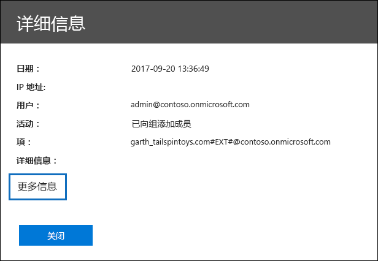
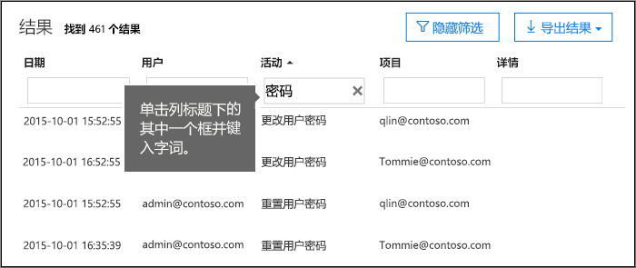
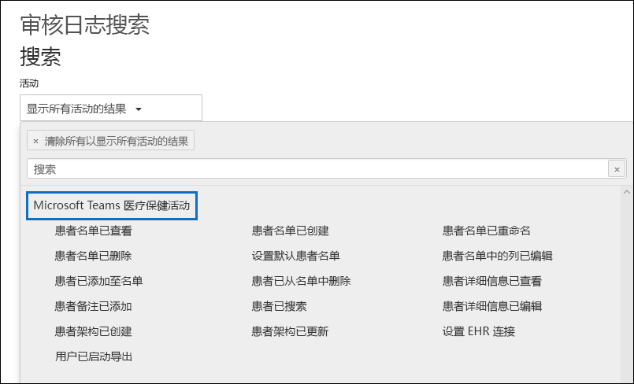
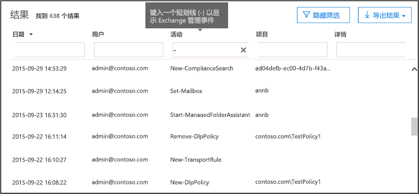

# <a name="search-the-audit-log-in-the-security--compliance-center"></a><span data-ttu-id="056c6-103">在安全与合规中心搜索审核日志</span><span class="sxs-lookup"><span data-stu-id="056c6-103">Search the audit log in the Security & Compliance Center</span></span>

## <a name="introduction"></a><span data-ttu-id="056c6-104">简介</span><span class="sxs-lookup"><span data-stu-id="056c6-104">Introduction</span></span>

<span data-ttu-id="056c6-105">需要了解用户是否查看了特定文档或从其邮箱中清除了某项？</span><span class="sxs-lookup"><span data-stu-id="056c6-105">Need to find if a user viewed a specific document or purged an item from their mailbox?</span></span> <span data-ttu-id="056c6-106">如果是，可以使用 Office 365 安全与合规中心搜索统一的审核日志，以查看 Office 365 组织中的用户和管理员活动。</span><span class="sxs-lookup"><span data-stu-id="056c6-106">If so, you can use the Office 365 Security & Compliance Center to search the unified audit log to view user and administrator activity in your Office 365 organization.</span></span> <span data-ttu-id="056c6-107">为什么是统一的审核日志？</span><span class="sxs-lookup"><span data-stu-id="056c6-107">Why a unified audit log?</span></span> <span data-ttu-id="056c6-108">因为你可以在 Office 365 中搜索以下类型的用户和管理员活动：</span><span class="sxs-lookup"><span data-stu-id="056c6-108">Because you can search for the following types of user and admin activity in Office 365:</span></span>

- <span data-ttu-id="056c6-109">SharePoint Online 和 OneDrive for Business 中的用户活动</span><span class="sxs-lookup"><span data-stu-id="056c6-109">User activity in SharePoint Online and OneDrive for Business</span></span>

- <span data-ttu-id="056c6-110">Exchange Online 中的用户活动（Exchange 邮箱审核日志记录）</span><span class="sxs-lookup"><span data-stu-id="056c6-110">User activity in Exchange Online (Exchange mailbox audit logging)</span></span>

- <span data-ttu-id="056c6-111">SharePoint Online 中的管理员活动</span><span class="sxs-lookup"><span data-stu-id="056c6-111">Admin activity in SharePoint Online</span></span>

- <span data-ttu-id="056c6-112">Azure Active Directory 中的管理员活动（Office 365 的目录服务）</span><span class="sxs-lookup"><span data-stu-id="056c6-112">Admin activity in Azure Active Directory (the directory service for Office 365)</span></span>

- <span data-ttu-id="056c6-113">Exchange Online 中的管理员活动（Exchange 管理员审核日志记录）</span><span class="sxs-lookup"><span data-stu-id="056c6-113">Admin activity in Exchange Online (Exchange admin audit logging)</span></span>

- <span data-ttu-id="056c6-114">Sway 中的用户和管理员活动</span><span class="sxs-lookup"><span data-stu-id="056c6-114">User and admin activity in Sway</span></span>

- <span data-ttu-id="056c6-115">安全与合规中心中的电子数据展示活动</span><span class="sxs-lookup"><span data-stu-id="056c6-115">eDiscovery activities in the security and compliance center</span></span>

- <span data-ttu-id="056c6-116">Power BI 中的用户和管理员活动</span><span class="sxs-lookup"><span data-stu-id="056c6-116">User and admin activity in Power BI</span></span>

- <span data-ttu-id="056c6-117">Microsoft Teams 中的用户和管理员活动</span><span class="sxs-lookup"><span data-stu-id="056c6-117">User and admin activity in Microsoft Teams</span></span>

- <span data-ttu-id="056c6-118">Dynamics 365 中的用户和管理员活动</span><span class="sxs-lookup"><span data-stu-id="056c6-118">User and admin activity in Dynamics 365</span></span>

- <span data-ttu-id="056c6-119">Yammer 中的用户和管理员活动</span><span class="sxs-lookup"><span data-stu-id="056c6-119">User and admin activity in Yammer</span></span>

- <span data-ttu-id="056c6-120">Microsoft Flow 中的用户和管理员活动</span><span class="sxs-lookup"><span data-stu-id="056c6-120">User and admin activity in Microsoft Flow</span></span>

- <span data-ttu-id="056c6-121">Microsoft Stream 中的用户和管理员活动</span><span class="sxs-lookup"><span data-stu-id="056c6-121">User and admin activity in Microsoft Stream</span></span>

- <span data-ttu-id="056c6-122">Microsoft 工作区分析中的分析员和管理员活动</span><span class="sxs-lookup"><span data-stu-id="056c6-122">Analyst and admin activity in Microsoft Workplace Analytics</span></span>

- <span data-ttu-id="056c6-123">Microsoft PowerApps 中的用户和管理员活动</span><span class="sxs-lookup"><span data-stu-id="056c6-123">User and admin activity in Microsoft PowerApps</span></span>

- <span data-ttu-id="056c6-124">Microsoft Forms 中的用户和管理员活动</span><span class="sxs-lookup"><span data-stu-id="056c6-124">User and admin activity in Microsoft Forms</span></span>

## <a name="before-you-begin"></a><span data-ttu-id="056c6-125">开始之前</span><span class="sxs-lookup"><span data-stu-id="056c6-125">Before you begin</span></span>

<span data-ttu-id="056c6-126">在开始搜索 Office 365 审核日志之前，请务必阅读以下各项。</span><span class="sxs-lookup"><span data-stu-id="056c6-126">Be sure to read the following items before you start searching the Office 365 audit log.</span></span>

- <span data-ttu-id="056c6-127">你（或其他管理员）必须首先开启审核日志记录，然后才能开始搜索 Office 365 审核日志。</span><span class="sxs-lookup"><span data-stu-id="056c6-127">You (or another admin) must first turn on audit logging before you can start searching the Office 365 audit log.</span></span> <span data-ttu-id="056c6-128">若要将其打开，请单击安全与合规中心中**审核日志搜索**页面上的**打开审核**。</span><span class="sxs-lookup"><span data-stu-id="056c6-128">To turn it on, click **Start recording user and admin activity** on the **Audit log search** page in the Security & Compliance Center.</span></span> <span data-ttu-id="056c6-129">（如果未看到此链接，则已为你的组织开启审核。）打开后，将显示一条消息，称正在准备审核日志，你可以在准备完成后数小时内运行搜索。</span><span class="sxs-lookup"><span data-stu-id="056c6-129">(If you don't see this link, auditing has already been turned on for your organization.) After you turn it on, a message is displayed that says the audit log is being prepared and that you can run a search in a couple of hours after the preparation is complete.</span></span> <span data-ttu-id="056c6-130">只需执行一次此操作。</span><span class="sxs-lookup"><span data-stu-id="056c6-130">You only have to do this once.</span></span> <span data-ttu-id="056c6-131">有关详细信息，请参阅[打开或关闭审核日志搜索](turn-audit-log-search-on-or-off.md)。</span><span class="sxs-lookup"><span data-stu-id="056c6-131">For instructions, see [Turn Office 365 audit log search on or off](turn-audit-log-search-on-or-off.md).</span></span>

  > [!NOTE]
  > <span data-ttu-id="056c6-132">默认正在启用审核。</span><span class="sxs-lookup"><span data-stu-id="056c6-132">We're in the process of turning on auditing by default.</span></span> <span data-ttu-id="056c6-133">在这之前，可以按上文所述启用审核。</span><span class="sxs-lookup"><span data-stu-id="056c6-133">Until then, you can turn it on as previously described.</span></span>

- <span data-ttu-id="056c6-134">必须分配有 Exchange Online 中的“仅供查看审核日志”或“审核日志”角色才能搜索 Office 365 审核日志。</span><span class="sxs-lookup"><span data-stu-id="056c6-134">You have to be assigned the View-Only Audit Logs or Audit Logs role in Exchange Online to search the Office 365 audit log.</span></span> <span data-ttu-id="056c6-135">默认情况下，在 Exchange 管理中心中的“**权限**”页上将这些角色分配给“合规性管理”和“组织管理”角色组。</span><span class="sxs-lookup"><span data-stu-id="056c6-135">By default, these roles are assigned to the Compliance Management and Organization Management role groups on the **Permissions** page in the Exchange admin center.</span></span> <span data-ttu-id="056c6-136">请注意，Office 365 和 Microsoft 365 中的全局管理员将自动添加为 Exchange Online 的组织管理角色组成员。</span><span class="sxs-lookup"><span data-stu-id="056c6-136">Note Global administrators in Office 365 and Microsoft 365 are automatically added as members of the Organization Management role group in Exchange Online.</span></span> <span data-ttu-id="056c6-137">若要让用户能够使用最低权限级别搜索 Office 365 审核日志，可以在 Exchange Online 中创建自定义角色组，添加“仅供查看审核日志”或“审核日志”角色，然后将用户添加为新角色组的成员。</span><span class="sxs-lookup"><span data-stu-id="056c6-137">To give a user the ability to search the Office 365 audit log with the minimum level of privileges, you can create a custom role group in Exchange Online, add the View-Only Audit Logs or Audit Logs role, and then add the user as a member of the new role group.</span></span> <span data-ttu-id="056c6-138">有关详细信息，请参阅[在 Exchange Online 中管理角色组](https://go.microsoft.com/fwlink/p/?LinkID=730688)。</span><span class="sxs-lookup"><span data-stu-id="056c6-138">For more information, see [Manage role groups in Exchange Online](https://go.microsoft.com/fwlink/p/?LinkID=730688).</span></span>

  > [!IMPORTANT]
  > <span data-ttu-id="056c6-139">如果在安全与合规中心中的“**权限**”页上向用户分配“仅供查看审核日志”或“审核日志”角色，则他们将无法搜索 Office 365 审核日志。</span><span class="sxs-lookup"><span data-stu-id="056c6-139">If you assign a user the View-Only Audit Logs or Audit Logs role on the **Permissions** page in the Security & Compliance Center, they won't be able to search the Office 365 audit log.</span></span> <span data-ttu-id="056c6-140">必须在 Exchange Online 中分配权限。</span><span class="sxs-lookup"><span data-stu-id="056c6-140">You have to assign the permissions in Exchange Online.</span></span> <span data-ttu-id="056c6-141">这是因为用于搜索审核日志的基础 cmdlet 是 Exchange Online cmdlet。</span><span class="sxs-lookup"><span data-stu-id="056c6-141">This is because the underlying cmdlet used to search the audit log is an Exchange Online cmdlet.</span></span>

- <span data-ttu-id="056c6-142">当用户或管理员执行审核活动时，将生成审核记录并将其存储在组织的 Office 365 审核日志中。</span><span class="sxs-lookup"><span data-stu-id="056c6-142">When an audited activity is performed by a user or admin, an audit record is generated and stored in the Office 365 audit log for your organization.</span></span> <span data-ttu-id="056c6-143">保留审核记录（并且可在审核日志中搜索）的时间长度取决于你的 Office 365 订阅，具体而言是分配给特定用户的许可证类型。</span><span class="sxs-lookup"><span data-stu-id="056c6-143">The length of time that an audit record is retained (and searchable in the audit log) depends on your Office 365 subscription, and specifically the type of the license that is assigned to a specific user.</span></span>

  - <span data-ttu-id="056c6-144">**Office 365 E3：** 审核记录可保留 90 天。</span><span class="sxs-lookup"><span data-stu-id="056c6-144">**Office 365 E3:** Audit records are retained for 90 days.</span></span> <span data-ttu-id="056c6-145">这意味着可以在审核日志中搜索过去 90 天内执行的活动。</span><span class="sxs-lookup"><span data-stu-id="056c6-145">That means you can search the audit log for activities that were performed within the last 90 days.</span></span>

    > [!NOTE]
    > <span data-ttu-id="056c6-146">即使启用了默认启用的邮箱审核，也可能会发现无法在安全与合规中心的审核日志搜索中找到某些用户的邮箱审核事件，也无法通过 Office 365 管理活动 API 找到这些事件。</span><span class="sxs-lookup"><span data-stu-id="056c6-146">Even when mailbox auditing on by default is turned on, you might notice that mailbox audit events for some users aren't found in audit log searches in the Security & Compliance Center or via the Office 365 Management Activity API.</span></span> <span data-ttu-id="056c6-147">有关详细信息，请参阅[有关邮箱审核日志记录的详细信息](enable-mailbox-auditing.md#more-information)。</span><span class="sxs-lookup"><span data-stu-id="056c6-147">For more information, see [More information about mailbox audit logging](enable-mailbox-auditing.md#more-information).</span></span>

  - <span data-ttu-id="056c6-148">**Office 365 E5：** 审核记录也保留 90 天。</span><span class="sxs-lookup"><span data-stu-id="056c6-148">**Office 365 E5:** Audit records are also retained for 90 days.</span></span> <span data-ttu-id="056c6-149">对于 E5 用户以及具有 E3 许可证和 Office 365 高级合规版附加许可证的用户，最终可将审核记录保留一年。</span><span class="sxs-lookup"><span data-stu-id="056c6-149">Retaining audit records for one year may eventually be available for E5 users and users with an E3 license and an Office 365 Advanced Compliance add-on license.</span></span>

    > [!NOTE]
    > <span data-ttu-id="056c6-150">对于 E5 组织（或对于具有高级合规版附加许可证的 E3 组织内的用户），针对审核记录的一年保留期的个人预览版计划已对新注册关闭。</span><span class="sxs-lookup"><span data-stu-id="056c6-150">The private preview program for the one-year retention period for audit records for E5 organizations (or for users in E3 organizations that have Advanced Compliance add-on licenses) is closed to new enrollment.</span></span> <span data-ttu-id="056c6-151">当公共预览版提供一年保留期或正式发布时，本文将更新。</span><span class="sxs-lookup"><span data-stu-id="056c6-151">This article will be updated when the one-year retention period is available in public preview or released for general availability.</span></span>

- <span data-ttu-id="056c6-152">如果希望为组织关闭 Office 365 中的审核日志搜索，可以在连接到 Exchange Online 组织的远程 PowerShell 中运行以下命令：</span><span class="sxs-lookup"><span data-stu-id="056c6-152">If you want to turn off audit log search in Office 365 for your organization, you can run the following command in remote PowerShell connected to your Exchange Online organization:</span></span>

  ```powershell
  Set-AdminAuditLogConfig -UnifiedAuditLogIngestionEnabled $false
  ```

    <span data-ttu-id="056c6-153">若要再次打开审核搜索，可在 Exchange Online PowerShell 中运行以下命令：</span><span class="sxs-lookup"><span data-stu-id="056c6-153">To turn on audit search again, you can run the following command in Exchange Online PowerShell:</span></span>

  ```powershell
  Set-AdminAuditLogConfig -UnifiedAuditLogIngestionEnabled $true
  ```

  <span data-ttu-id="056c6-154">有关详细信息，请参阅[关闭 Office 365 中的审核日志搜索](turn-audit-log-search-on-or-off.md)。</span><span class="sxs-lookup"><span data-stu-id="056c6-154">For more information, see [Turn off audit log search in Office 365](turn-audit-log-search-on-or-off.md).</span></span>

- <span data-ttu-id="056c6-155">如前所述，用于搜索审核日志的基础 cmdlet 是 Exchange Online cmdlet，即 **Search-UnifiedAuditLog**。</span><span class="sxs-lookup"><span data-stu-id="056c6-155">As previously stated, the underlying cmdlet used to search the audit log is an Exchange Online cmdlet, which is **Search-UnifiedAuditLog**.</span></span> <span data-ttu-id="056c6-156">这意味着可使用此 cmdlet 搜索 Office 365 审核日志，而不是使用安全与合规中心中的“**审核日志搜索**”页面。</span><span class="sxs-lookup"><span data-stu-id="056c6-156">That means you can use this cmdlet to search the Office 365 audit log instead of using the **Audit log search** page in the Security & Compliance Center.</span></span> <span data-ttu-id="056c6-157">必须在连接到 Exchange Online 组织的远程 PowerShell 中运行此 cmdlet。</span><span class="sxs-lookup"><span data-stu-id="056c6-157">You have to run this cmdlet in remote PowerShell connected to your Exchange Online organization.</span></span> <span data-ttu-id="056c6-158">有关详细信息，请参阅 [Search-UnifiedAuditLog](https://go.microsoft.com/fwlink/p/?linkid=834776)。</span><span class="sxs-lookup"><span data-stu-id="056c6-158">For more information, see [Search-UnifiedAuditLog](https://go.microsoft.com/fwlink/p/?linkid=834776).</span></span>

  <span data-ttu-id="056c6-159">有关将 **Search-UnifiedAuditLog** cmdlet 所返回的搜索结果导出到 CSV 文件的信息，请参阅[导出、配置和查看审核日志记录](export-view-audit-log-records.md#tips-for-exporting-and-viewing-the-audit-log)中的“有关导出和查看审核日志的提示”部分。</span><span class="sxs-lookup"><span data-stu-id="056c6-159">For information about exporting the search results returned by the **Search-UnifiedAuditLog** cmdlet to a CSV file, see the "Tips for exporting and viewing the audit log" section in [Export, configure, and view audit log records](export-view-audit-log-records.md#tips-for-exporting-and-viewing-the-audit-log).</span></span>

- <span data-ttu-id="056c6-160">若想以编程方式从 Office 365 审核日志下载数据，建议使用 Office 365 管理活动 API，而不是使用 PowerShell 脚本。</span><span class="sxs-lookup"><span data-stu-id="056c6-160">If you want to programmatically download data from the Office 365 audit log, we recommend that you use the Office 365 Management Activity API instead of using a PowerShell script.</span></span> <span data-ttu-id="056c6-161">Office 365 管理活动 API 是一项 REST Web 服务，可用于为组织制定操作、安全和合规性监视解决方案。</span><span class="sxs-lookup"><span data-stu-id="056c6-161">The Office 365 Management Activity API is a REST web service that you can use to develop operations, security, and compliance monitoring solutions for your organization.</span></span> <span data-ttu-id="056c6-162">有关详细信息，请参阅 [Office 365 管理活动 API 参考](https://docs.microsoft.com/office/office-365-management-api/office-365-management-activity-api-reference)。</span><span class="sxs-lookup"><span data-stu-id="056c6-162">For more information, see [Office 365 Management Activity API reference](https://docs.microsoft.com/office/office-365-management-api/office-365-management-activity-api-reference).</span></span>

- <span data-ttu-id="056c6-163">发生事件后，最多需要 30 分钟到 24 小时就可搜索结果中显示相应的审核日志条目。</span><span class="sxs-lookup"><span data-stu-id="056c6-163">It can take up to 30 minutes or up to 24 hours after an event occurs for the corresponding audit log entry to be displayed in the search results.</span></span> <span data-ttu-id="056c6-164">下表显示了 Office 365 中不同服务所花费的时间。</span><span class="sxs-lookup"><span data-stu-id="056c6-164">The following table shows the time it takes for the different services in Office 365.</span></span>

  |<span data-ttu-id="056c6-165">**Office 365 服务**</span><span class="sxs-lookup"><span data-stu-id="056c6-165">**Office 365 service**</span></span>|<span data-ttu-id="056c6-166">**30 分钟**</span><span class="sxs-lookup"><span data-stu-id="056c6-166">**30 minutes**</span></span>|<span data-ttu-id="056c6-167">**24 小时**</span><span class="sxs-lookup"><span data-stu-id="056c6-167">**24 hours**</span></span>|
  |:-----|:-----:|:-----:|
  |<span data-ttu-id="056c6-168">高级威胁防护和威胁智能</span><span class="sxs-lookup"><span data-stu-id="056c6-168">Advanced Threat Protection and Threat Intelligence</span></span>|||
  |<span data-ttu-id="056c6-170">Azure Active Directory（用户登录事件）</span><span class="sxs-lookup"><span data-stu-id="056c6-170">Azure Active Directory (user login events)</span></span>|||
  |<span data-ttu-id="056c6-172">Azure Active Directory（管理员事件）</span><span class="sxs-lookup"><span data-stu-id="056c6-172">Azure Active Directory (admin events)</span></span>|||
  |<span data-ttu-id="056c6-174">数据丢失防护</span><span class="sxs-lookup"><span data-stu-id="056c6-174">Data Loss Prevention</span></span>|||
  |<span data-ttu-id="056c6-176">Dynamics 365 CRM</span><span class="sxs-lookup"><span data-stu-id="056c6-176">Dynamics 365 CRM</span></span>|||
  |<span data-ttu-id="056c6-178">电子数据展示</span><span class="sxs-lookup"><span data-stu-id="056c6-178">eDiscovery</span></span>|||
  |<span data-ttu-id="056c6-180">Exchange Online</span><span class="sxs-lookup"><span data-stu-id="056c6-180">Exchange Online</span></span>|||
  |<span data-ttu-id="056c6-182">Microsoft Flow</span><span class="sxs-lookup"><span data-stu-id="056c6-182">Microsoft Flow</span></span>|||
  |<span data-ttu-id="056c6-184">Microsoft Project</span><span class="sxs-lookup"><span data-stu-id="056c6-184">Microsoft Project</span></span>|||
  |<span data-ttu-id="056c6-186">Microsoft Stream</span><span class="sxs-lookup"><span data-stu-id="056c6-186">Microsoft Stream</span></span>|||
  |<span data-ttu-id="056c6-188">Microsoft Teams</span><span class="sxs-lookup"><span data-stu-id="056c6-188">Microsoft Teams</span></span>|||
  |<span data-ttu-id="056c6-190">Power BI</span><span class="sxs-lookup"><span data-stu-id="056c6-190">Power BI</span></span>|||
  |<span data-ttu-id="056c6-192">安全与合规中心</span><span class="sxs-lookup"><span data-stu-id="056c6-192">Security & Compliance Center</span></span>|||
  |<span data-ttu-id="056c6-194">SharePoint Online 和 OneDrive for Business</span><span class="sxs-lookup"><span data-stu-id="056c6-194">SharePoint Online and OneDrive for Business</span></span>|||
  |<span data-ttu-id="056c6-196">Sway</span><span class="sxs-lookup"><span data-stu-id="056c6-196">Sway</span></span>|||
  |<span data-ttu-id="056c6-198">工作区分析</span><span class="sxs-lookup"><span data-stu-id="056c6-198">Workplace Analytics</span></span>|||
  |<span data-ttu-id="056c6-200">Yammer</span><span class="sxs-lookup"><span data-stu-id="056c6-200">Yammer</span></span>||||
  |<span data-ttu-id="056c6-202">Microsoft Forms</span><span class="sxs-lookup"><span data-stu-id="056c6-202">Microsoft Forms</span></span>||
  ||||

- <span data-ttu-id="056c6-204">Azure Active Directory (Azure AD) 是 Office 365 的目录服务。</span><span class="sxs-lookup"><span data-stu-id="056c6-204">Azure Active Directory (Azure AD) is the directory service for Office 365.</span></span> <span data-ttu-id="056c6-205">统一审核日志包含用户、组、应用程序、域以及在 Microsoft 365 管理中心或 Azure 管理门户中执行的目录活动。</span><span class="sxs-lookup"><span data-stu-id="056c6-205">The unified audit log contains user, group, application, domain, and directory activities performed in the Microsoft 365 admin center or in the Azure management portal.</span></span> <span data-ttu-id="056c6-206">有关 Azure AD 事件的完整列表，请参阅 [Azure Active Directory 审核报告事件](https://go.microsoft.com/fwlink/p/?LinkID=616549)。</span><span class="sxs-lookup"><span data-stu-id="056c6-206">For a complete list of Azure AD events, see [Azure Active Directory Audit Report Events](https://go.microsoft.com/fwlink/p/?LinkID=616549).</span></span>

- <span data-ttu-id="056c6-207">默认情况下，Power BI 的审核日志记录未启用。</span><span class="sxs-lookup"><span data-stu-id="056c6-207">Audit logging for Power BI isn't enabled by default.</span></span> <span data-ttu-id="056c6-208">若要在 Office 365 审核日志中搜索 Power BI 活动，必须在 Power BI 管理门户中启用审核。</span><span class="sxs-lookup"><span data-stu-id="056c6-208">To search for Power BI activities in the Office 365 audit log, you have to enable auditing in the Power BI admin portal.</span></span> <span data-ttu-id="056c6-209">有关说明，请参阅 [Power BI 管理门户](https://docs.microsoft.com/power-bi/service-admin-portal#audit-logs)中的“审核日志”部分。</span><span class="sxs-lookup"><span data-stu-id="056c6-209">For instructions, see the "Audit logs" section in [Power BI admin portal](https://docs.microsoft.com/power-bi/service-admin-portal#audit-logs).</span></span>

## <a name="search-the-audit-log"></a><span data-ttu-id="056c6-210">搜索审核日志</span><span class="sxs-lookup"><span data-stu-id="056c6-210">Search the audit log</span></span>

<span data-ttu-id="056c6-211">下面介绍在 Office 365 中搜索审核日志的流程。</span><span class="sxs-lookup"><span data-stu-id="056c6-211">Here's the process for searching the audit log in Office 365.</span></span>

[<span data-ttu-id="056c6-212">步骤 1：运行审核日志搜索</span><span class="sxs-lookup"><span data-stu-id="056c6-212">Step 1: Run an audit log search</span></span>](#step-1-run-an-audit-log-search)

[<span data-ttu-id="056c6-213">步骤 2：查看搜索结果</span><span class="sxs-lookup"><span data-stu-id="056c6-213">Step 2: View the search results</span></span>](#step-2-view-the-search-results)

[<span data-ttu-id="056c6-214">步骤 3：筛选搜索结果</span><span class="sxs-lookup"><span data-stu-id="056c6-214">Step 3: Filter the search results</span></span>](#step-3-filter-the-search-results)

[<span data-ttu-id="056c6-215">步骤 4：将搜索结果导出到文件</span><span class="sxs-lookup"><span data-stu-id="056c6-215">Step 4: Export the search results to a file</span></span>](#step-4-export-the-search-results-to-a-file)

### <a name="step-1-run-an-audit-log-search"></a><span data-ttu-id="056c6-216">步骤 1：运行审核日志搜索</span><span class="sxs-lookup"><span data-stu-id="056c6-216">Step 1: Run an audit log search</span></span>

1. <span data-ttu-id="056c6-217">转到 [https://protection.office.com](https://protection.office.com)。</span><span class="sxs-lookup"><span data-stu-id="056c6-217">Go to [https://protection.office.com](https://protection.office.com).</span></span>

    > [!TIP]
    > <span data-ttu-id="056c6-218">使用专用浏览会话（而不是常规会话）来访问安全与合规中心，因为它会阻止你使用当前登录时使用的凭据。</span><span class="sxs-lookup"><span data-stu-id="056c6-218">Use a private browsing session (not a regular session) to access the Security & Compliance Center because this will prevent the credential that you are currently logged on with from being used.</span></span> <span data-ttu-id="056c6-219">若要在 Internet Explorer 或 Microsoft Edge 中打开 InPrivate 浏览会话，只需按 CTRL+SHIFT+P。</span><span class="sxs-lookup"><span data-stu-id="056c6-219">To open an InPrivate Browsing session in Internet Explorer or Microsoft Edge, just press CTRL+SHIFT+P.</span></span> <span data-ttu-id="056c6-220">若要在 Google Chrome（称为隐身窗口）中打开专用浏览会话，请按 CTRL+SHIFT+N。</span><span class="sxs-lookup"><span data-stu-id="056c6-220">To open a private browsing session in Google Chrome (called an incognito window), press CTRL+SHIFT+N.</span></span>

2. <span data-ttu-id="056c6-221">使用工作或学校帐户登录到 Office 365。</span><span class="sxs-lookup"><span data-stu-id="056c6-221">Sign in to Office 365 using your work or school account.</span></span>

3. <span data-ttu-id="056c6-222">在安全与合规中心的左侧窗格中，单击“**搜索**”，然后单击“**审核日志搜索**”。</span><span class="sxs-lookup"><span data-stu-id="056c6-222">In the left pane of the Security & Compliance Center, click **Search**, and then click **Audit log search**.</span></span>

    <span data-ttu-id="056c6-223">此时将显示“**审核日志搜索**”页面。</span><span class="sxs-lookup"><span data-stu-id="056c6-223">The **Audit log search** page is displayed.</span></span>

    

    > [!NOTE]
    > <span data-ttu-id="056c6-225">必须首先打开审核日志记录，然后才能运行审核日志搜索。</span><span class="sxs-lookup"><span data-stu-id="056c6-225">You have to first turn on audit logging before you can run an audit log search.</span></span> <span data-ttu-id="056c6-226">如果显示“**开始记录用户和管理员活动**”链接，请单击该链接以打开审核。</span><span class="sxs-lookup"><span data-stu-id="056c6-226">If the **Start recording user and admin activity** link is displayed, click it to turn on auditing.</span></span> <span data-ttu-id="056c6-227">如果未看到此链接，则已为你的组织开启审核。</span><span class="sxs-lookup"><span data-stu-id="056c6-227">If you don't see this link, auditing has already been turned on for your organization.</span></span>

4. <span data-ttu-id="056c6-228">配置以下搜索条件：</span><span class="sxs-lookup"><span data-stu-id="056c6-228">Configure the following search criteria:</span></span>

    <span data-ttu-id="056c6-229">a.</span><span class="sxs-lookup"><span data-stu-id="056c6-229">a.</span></span> <span data-ttu-id="056c6-230">“**活动**”：单击下拉列表以显示你可以搜索的活动。</span><span class="sxs-lookup"><span data-stu-id="056c6-230">**Activities**: Click the drop-down list to display the activities that you can search for.</span></span> <span data-ttu-id="056c6-231">已将用户和管理员活动整理到相关活动组中。</span><span class="sxs-lookup"><span data-stu-id="056c6-231">User and admin activities are organized in to groups of related activities.</span></span> <span data-ttu-id="056c6-232">你可以选择特定活动，或单击活动组名称以选择该组中的所有活动。</span><span class="sxs-lookup"><span data-stu-id="056c6-232">You can select specific activities or you can click the activity group name to select all activities in the group.</span></span> <span data-ttu-id="056c6-233">你也可以单击已选活动以取消选择。</span><span class="sxs-lookup"><span data-stu-id="056c6-233">You can also click a selected activity to clear the selection.</span></span> <span data-ttu-id="056c6-234">运行搜索后，仅将显示所选活动的审核日志项目。</span><span class="sxs-lookup"><span data-stu-id="056c6-234">After you run the search, only the audit log entries for the selected activities are displayed.</span></span> <span data-ttu-id="056c6-235">选择“**显示所有活动的结果**”将显示由所选用户或用户组执行的所有活动的结果。</span><span class="sxs-lookup"><span data-stu-id="056c6-235">Selecting **Show results for all activities** displays results for all activities performed by the selected user or group of users.</span></span>

    <span data-ttu-id="056c6-236">Office 365 审核日志中记录了超过 100 个用户和管理员活动。</span><span class="sxs-lookup"><span data-stu-id="056c6-236">Over 100 user and admin activities are logged in the Office 365 audit log.</span></span> <span data-ttu-id="056c6-237">单击本文主题处的“**已审核的活动**”选项卡可查看每个不同 Office 365 服务中每个活动的描述。</span><span class="sxs-lookup"><span data-stu-id="056c6-237">Click the **Audited activities** tab at the topic of this article to see the descriptions of every activity in each of the different Office 365 services.</span></span>

    <span data-ttu-id="056c6-238">b.</span><span class="sxs-lookup"><span data-stu-id="056c6-238">b.</span></span> <span data-ttu-id="056c6-239">“**开始日期**”和“**结束日期**”：默认选择了过去七天。</span><span class="sxs-lookup"><span data-stu-id="056c6-239">**Start date** and **End date**: The last seven days are selected by default.</span></span> <span data-ttu-id="056c6-240">选择日期和时间范围，以显示在这段时间内发生的事件。</span><span class="sxs-lookup"><span data-stu-id="056c6-240">Select a date and time range to display the events that occurred within that period.</span></span> <span data-ttu-id="056c6-241">日期和时间将以协调世界时 (UTC) 格式显示。</span><span class="sxs-lookup"><span data-stu-id="056c6-241">The date and time are presented in Coordinated Universal Time (UTC) format.</span></span> <span data-ttu-id="056c6-242">可指定的最大日期范围为 90 天。</span><span class="sxs-lookup"><span data-stu-id="056c6-242">The maximum date range that you can specify is 90 days.</span></span> <span data-ttu-id="056c6-243">如果所选日期范围超过 90 天，将显示错误。</span><span class="sxs-lookup"><span data-stu-id="056c6-243">An error is displayed if the selected date range is greater than 90 days.</span></span>

    > [!TIP]
    > <span data-ttu-id="056c6-244">如果要使用为期 90 天的最大日期范围，请选择当前时间作为“**开始日期**”。</span><span class="sxs-lookup"><span data-stu-id="056c6-244">If you're using the maximum date range of 90 days, select the current time for the **Start date**.</span></span> <span data-ttu-id="056c6-245">否则，你将收到说明开始日期早于结束日期的错误消息。</span><span class="sxs-lookup"><span data-stu-id="056c6-245">Otherwise, you'll receive an error saying that the start date is earlier than the end date.</span></span> <span data-ttu-id="056c6-246">如果你在过去 90 天内打开了审核，则最大日期范围不能从打开审核的日期之前开始。</span><span class="sxs-lookup"><span data-stu-id="056c6-246">If you've turned on auditing within the last 90 days, the maximum date range can't start before the date that auditing was turned on.</span></span>

    <span data-ttu-id="056c6-247">c.</span><span class="sxs-lookup"><span data-stu-id="056c6-247">c.</span></span> <span data-ttu-id="056c6-248">“**用户**”：单击此框，然后选择要为其显示搜索结果的一名或多名用户。</span><span class="sxs-lookup"><span data-stu-id="056c6-248">**Users**: Click in this box and then select one or more users to display search results for.</span></span> <span data-ttu-id="056c6-249">由你在此框中所选用户执行的所选活动的审核日志项目将显示在结果列表中。</span><span class="sxs-lookup"><span data-stu-id="056c6-249">The audit log entries for the selected activity performed by the users you select in this box are displayed in the list of results.</span></span> <span data-ttu-id="056c6-250">将此框留空以返回组织中所有用户（和服务帐户）的条目。</span><span class="sxs-lookup"><span data-stu-id="056c6-250">Leave this box blank to return entries for all users (and service accounts) in your organization.</span></span>

    <span data-ttu-id="056c6-251">d.</span><span class="sxs-lookup"><span data-stu-id="056c6-251">d.</span></span> <span data-ttu-id="056c6-252">“**文件、文件夹或网站**”：键入部分或完整的文件或文件夹名称，搜索与包含指定关键字的文件夹文件相关的活动。</span><span class="sxs-lookup"><span data-stu-id="056c6-252">**File, folder, or site**: Type some or all of a file or folder name to search for activity related to the file of folder that contains the specified keyword.</span></span> <span data-ttu-id="056c6-253">你还可以指定文件或文件夹的 URL。</span><span class="sxs-lookup"><span data-stu-id="056c6-253">You can also specify a URL of a file or folder.</span></span> <span data-ttu-id="056c6-254">如果使用 URL，请确保输入完整的 URL 路径，或者如果输入部分 URL，则请勿包含任何特殊字符或空格。</span><span class="sxs-lookup"><span data-stu-id="056c6-254">If you use a URL, be sure the type the full URL path or if you type a portion of the URL, don't include any special characters or spaces.</span></span>

    <span data-ttu-id="056c6-255">将此框留空以返回组织中所有文件和文件夹的条目。</span><span class="sxs-lookup"><span data-stu-id="056c6-255">Leave this box blank to return entries for all files and folders in your organization.</span></span>

   <span data-ttu-id="056c6-256">**提示**</span><span class="sxs-lookup"><span data-stu-id="056c6-256">**TIPS**</span></span>

   - <span data-ttu-id="056c6-257">如果要查找与**网站**相关的所有活动，请在 URL 后面添加通配符 (\*) 以返回该网站的所有条目，例如，**"https://contoso-my.sharepoint.com/personal/\*"**。</span><span class="sxs-lookup"><span data-stu-id="056c6-257">If you're looking for all activities related to a **site**, add the wildcard symbol (\*) after the URL to return all entries for that site; for example, **"https://contoso-my.sharepoint.com/personal/\*"**.</span></span>

   - <span data-ttu-id="056c6-258">如果要查找与**文件**相关的所有活动，请在文件名后面添加通配符 (\*) 以返回该文件的所有条目，例如，**"\*Customer_Profitability_Sample.csv"**。</span><span class="sxs-lookup"><span data-stu-id="056c6-258">If you're looking for all activities related to a **file**, add the wildcard symbol (\*) before the file name to return all entries for that file; for example, **"\*Customer_Profitability_Sample.csv"**.</span></span>

5. <span data-ttu-id="056c6-259">单击“**搜索**”以使用搜索条件运行搜索。</span><span class="sxs-lookup"><span data-stu-id="056c6-259">Click **Search** to run the search using your search criteria.</span></span>

   <span data-ttu-id="056c6-260">此时将加载搜索结果，片刻后将显示在“**结果**”下。</span><span class="sxs-lookup"><span data-stu-id="056c6-260">The search results are loaded, and after a few moments they are displayed under **Results**.</span></span> <span data-ttu-id="056c6-261">完成搜索后会显示找到的结果数。</span><span class="sxs-lookup"><span data-stu-id="056c6-261">When the search is finished, the number of results found is displayed.</span></span> <span data-ttu-id="056c6-262">“**结果**”窗格中最多可显示 5,000 个事件（每次加载 150 个）。</span><span class="sxs-lookup"><span data-stu-id="056c6-262">A maximum of 5,000 events will be displayed in the **Results** pane in increments of 150 events.</span></span> <span data-ttu-id="056c6-263">如果超过 5,000 个事件满足搜索条件，则将显示最近的 5,000 个事件。</span><span class="sxs-lookup"><span data-stu-id="056c6-263">If more than 5,000 events meet the search criteria, the most recent 5,000 events are displayed.</span></span>

   

#### <a name="tips-for-searching-the-audit-log"></a><span data-ttu-id="056c6-265">有关搜索审核日志的提示</span><span class="sxs-lookup"><span data-stu-id="056c6-265">Tips for searching the audit log</span></span>

- <span data-ttu-id="056c6-266">可以通过单击活动名称选择要搜索的特定活动。</span><span class="sxs-lookup"><span data-stu-id="056c6-266">You can select specific activities to search for by clicking the activity name.</span></span> <span data-ttu-id="056c6-267">或者可以通过单击组名搜索该组中的所有活动（例如“**文件和文件夹活动**”）。</span><span class="sxs-lookup"><span data-stu-id="056c6-267">Or you can search for all activities in a group (such as **File and folder activities**) by clicking the group name.</span></span> <span data-ttu-id="056c6-268">如果选择了活动，可以单击该活动以取消选择。</span><span class="sxs-lookup"><span data-stu-id="056c6-268">If an activity is selected, you can click it to cancel the selection.</span></span> <span data-ttu-id="056c6-269">还可以使用搜索框显示包含所键入关键字的活动。</span><span class="sxs-lookup"><span data-stu-id="056c6-269">You can also use the search box to display the activities that contain the keyword that you type.</span></span>

  

- <span data-ttu-id="056c6-271">必须选择“**活动**”列表中的“**显示所有活动的结果**”才能显示 Exchange 管理员审核日志中的条目。</span><span class="sxs-lookup"><span data-stu-id="056c6-271">You have to select **Show results for all activities** in the **Activities** list to display events from the Exchange admin audit log.</span></span> <span data-ttu-id="056c6-272">此审核日志中的事件将在结果的“**活动**”列中显示 cmdlet 名称（例如 **Set-Mailbox**）。</span><span class="sxs-lookup"><span data-stu-id="056c6-272">Events from this audit log display a cmdlet name (for example, **Set-Mailbox**) in the **Activity** column in the results.</span></span> <span data-ttu-id="056c6-273">有关详细信息，请单击本主题中的“**已审核的活动**”选项卡，然后单击“**Exchange 管理员活动**”。</span><span class="sxs-lookup"><span data-stu-id="056c6-273">For more information, click the **Audited activities** tab in this topic and then click **Exchange admin activities**.</span></span>

  <span data-ttu-id="056c6-274">同样，某些审核活动在“**活动**”列表中没有相应项目。</span><span class="sxs-lookup"><span data-stu-id="056c6-274">Similarly, there are some auditing activities that don't have a corresponding item in the **Activities** list.</span></span> <span data-ttu-id="056c6-275">如果已知这些活动的操作名称，可搜索所有活动，然后通过在“**活动**”列对应的框中键入操作名称来筛选结果。</span><span class="sxs-lookup"><span data-stu-id="056c6-275">If you know the name of the operation for these activities, you can search for all activities, then filter the results by typing the name of the operation in the box for the **Activity** column.</span></span> <span data-ttu-id="056c6-276">有关筛选结果的详细信息，请参阅[步骤 3：筛选搜索结果](#step-3-filter-the-search-results)。</span><span class="sxs-lookup"><span data-stu-id="056c6-276">See [Step 3: Filter the search results](#step-3-filter-the-search-results) for more information about filtering the results.</span></span>

- <span data-ttu-id="056c6-277">单击“**清除**”以清除当前搜索条件。</span><span class="sxs-lookup"><span data-stu-id="056c6-277">Click **Clear** to clear the current search criteria.</span></span> <span data-ttu-id="056c6-278">日期范围返回到默认值（过去七天）。</span><span class="sxs-lookup"><span data-stu-id="056c6-278">The date range returns to the default of the last seven days.</span></span> <span data-ttu-id="056c6-279">还可以单击“**全部清除以显示所有活动的结果**”以取消所有选定活动。</span><span class="sxs-lookup"><span data-stu-id="056c6-279">You can also click **Clear all to show results for all activities** to cancel all selected activities.</span></span>

- <span data-ttu-id="056c6-280">如果找到了 5,000 条结果，则可以假定可能存在超过 5,000 个符合搜索条件的事件。</span><span class="sxs-lookup"><span data-stu-id="056c6-280">If 5,000 results are found, you can probably assume that there are more than 5,000 events that met the search criteria.</span></span> <span data-ttu-id="056c6-281">你可以优化搜索条件并重新运行搜索以返回较少结果，也可以通过选择“**导出结果**”\>“**下载所有结果**”导出所有搜索结果。</span><span class="sxs-lookup"><span data-stu-id="056c6-281">You can either refine the search criteria and rerun the search to return fewer results, or you can export all of the search results by selecting **Export results** \> **Download all results**.</span></span>

### <a name="step-2-view-the-search-results"></a><span data-ttu-id="056c6-282">步骤 2：查看搜索结果</span><span class="sxs-lookup"><span data-stu-id="056c6-282">Step 2: View the search results</span></span>

<span data-ttu-id="056c6-283">审核日志搜索结果会显示在“**审核日志搜索**”页中的“**结果**”下。</span><span class="sxs-lookup"><span data-stu-id="056c6-283">The results of an audit log search are displayed under **Results** on the **Audit log search** page.</span></span> <span data-ttu-id="056c6-284">如上文所述，最多显示 5,000 个最新事件（每次加载 150 个）。</span><span class="sxs-lookup"><span data-stu-id="056c6-284">As previously stated a maximum of 5,000 (newest) events are displayed in increments of 150 events.</span></span> <span data-ttu-id="056c6-285">若要显示更多事件，可以使用“**结果**”窗格中的滚动条，或按 **Shift+End** 显示随后的 150 个事件。</span><span class="sxs-lookup"><span data-stu-id="056c6-285">To display more events you can use the scroll bar in the **Results** pane or you can press **Shift + End** to display the next 150 events.</span></span>

<span data-ttu-id="056c6-286">结果包含有关搜索返回的每个事件的以下信息：</span><span class="sxs-lookup"><span data-stu-id="056c6-286">The results contain the following information about each event returned by the search:</span></span>

- <span data-ttu-id="056c6-287">“**日期**”：事件发生的日期和时间（采用 UTC 格式）。</span><span class="sxs-lookup"><span data-stu-id="056c6-287">**Date**: The date and time (in UTC format) when the event occurred.</span></span>

- <span data-ttu-id="056c6-288">“**IP 地址**”：记录活动时所用设备的 IP 地址。</span><span class="sxs-lookup"><span data-stu-id="056c6-288">**IP address**: The IP address of the device that was used when the activity was logged.</span></span> <span data-ttu-id="056c6-289">IP 地址显示为 IPv4 或 IPv6 地址格式。</span><span class="sxs-lookup"><span data-stu-id="056c6-289">The IP address is displayed in either an IPv4 or IPv6 address format.</span></span>

   > [!NOTE]
  > <span data-ttu-id="056c6-290">对于某些服务，此字段中显示的值可能是代表用户调用服务的受信任应用程序（例如，Web 应用上的 Office）的 IP 地址，而不是执行活动的人员所使用设备的 IP 地址。</span><span class="sxs-lookup"><span data-stu-id="056c6-290">For some services, the value displayed in this field might be the IP address for a trusted application (for example, Office on the web apps) calling into the service on behalf of a user and not the IP address of the device used by person who performed the activity.</span></span> <span data-ttu-id="056c6-291">此外，对于针对 Azure Active Directory 相关事件的管理员活动（或由系统帐户执行的活动），未记录 IP 地址，此字段中显示的值为 `null`。</span><span class="sxs-lookup"><span data-stu-id="056c6-291">Also, for admin activity (or activity performed by a system account) for Azure Active Directory-related events, the IP address isn't logged and the value displayed in this field is `null`.</span></span>

- <span data-ttu-id="056c6-292">**用户**：执行触发事件的操作的用户（或服务帐户）。</span><span class="sxs-lookup"><span data-stu-id="056c6-292">**User**: The user (or service account) who performed the action that triggered the event.</span></span>

- <span data-ttu-id="056c6-293">“**活动**”：用户执行的活动。</span><span class="sxs-lookup"><span data-stu-id="056c6-293">**Activity**: The activity performed by the user.</span></span> <span data-ttu-id="056c6-294">此值对应于你在“**活动**”下拉列表中选定的活动。</span><span class="sxs-lookup"><span data-stu-id="056c6-294">This value corresponds to the activities that you selected in the **Activities** drop down list.</span></span> <span data-ttu-id="056c6-295">对于来自 Exchange 管理员审核日志的事件，此列中的值为 Exchange cmdlet。</span><span class="sxs-lookup"><span data-stu-id="056c6-295">For an event from the Exchange admin audit log, the value in this column is an Exchange cmdlet.</span></span>

- <span data-ttu-id="056c6-296">“**项目**”：由于相应活动而创建或修改的对象。</span><span class="sxs-lookup"><span data-stu-id="056c6-296">**Item**: The object that was created or modified as a result of the corresponding activity.</span></span> <span data-ttu-id="056c6-297">例如已查看或修改的文件或已更新的用户帐户。</span><span class="sxs-lookup"><span data-stu-id="056c6-297">For example, the file that was viewed or modified or the user account that was updated.</span></span> <span data-ttu-id="056c6-298">并非所有活动在此列中都具有值。</span><span class="sxs-lookup"><span data-stu-id="056c6-298">Not all activities have a value in this column.</span></span>

- <span data-ttu-id="056c6-299">“**详细信息**”：有关活动的其他详细信息。</span><span class="sxs-lookup"><span data-stu-id="056c6-299">**Detail**: Additional information about an activity.</span></span> <span data-ttu-id="056c6-300">同样，并非所有活动均具有值。</span><span class="sxs-lookup"><span data-stu-id="056c6-300">Again, not all activities have a value.</span></span>

> [!TIP]
> <span data-ttu-id="056c6-301">单击“**结果**”下的列标题对结果进行排序。</span><span class="sxs-lookup"><span data-stu-id="056c6-301">Click a column header under **Results** to sort the results.</span></span> <span data-ttu-id="056c6-302">你可以将结果按从 A 到 Z 或从 Z 到 A 的顺序排序。单击“**日期**”标题以将结果按从旧到新或从新到旧的顺序排序。</span><span class="sxs-lookup"><span data-stu-id="056c6-302">You can sort the results from A to Z or Z to A. Click the **Date** header to sort the results from oldest to newest or newest to oldest.</span></span>

#### <a name="view-the-details-for-a-specific-event"></a><span data-ttu-id="056c6-303">查看特定事件的详细信息</span><span class="sxs-lookup"><span data-stu-id="056c6-303">View the details for a specific event</span></span>

<span data-ttu-id="056c6-304">可以通过单击搜索结果列表中的事件记录查看有关事件的更多详细信息。</span><span class="sxs-lookup"><span data-stu-id="056c6-304">You can view more details about an event by clicking the event record in the list of search results.</span></span> <span data-ttu-id="056c6-305">此时将显示包含事件记录的详细属性的“**详细信息**”页。</span><span class="sxs-lookup"><span data-stu-id="056c6-305">A **Details** page is displayed that contains the detailed properties from the event record.</span></span> <span data-ttu-id="056c6-306">显示的属性取决于事件发生于的 Office 365 服务。</span><span class="sxs-lookup"><span data-stu-id="056c6-306">The properties that are displayed depend on the Office 365 service in which the event occurs.</span></span> <span data-ttu-id="056c6-307">若要显示这些详细信息，请单击“**更多信息**”。</span><span class="sxs-lookup"><span data-stu-id="056c6-307">To display these details, click **More information**.</span></span> <span data-ttu-id="056c6-308">有关说明，请参阅 [Office 365 审核日志中的属性详细信息](detailed-properties-in-the-office-365-audit-log.md)。</span><span class="sxs-lookup"><span data-stu-id="056c6-308">For descriptions, see [Detailed properties in the Office 365 audit log](detailed-properties-in-the-office-365-audit-log.md).</span></span>



### <a name="step-3-filter-the-search-results"></a><span data-ttu-id="056c6-310">步骤 3：筛选搜索结果</span><span class="sxs-lookup"><span data-stu-id="056c6-310">Step 3: Filter the search results</span></span>

<span data-ttu-id="056c6-311">除排序外，你还可以筛选审核日志搜索的结果。</span><span class="sxs-lookup"><span data-stu-id="056c6-311">In addition to sorting, you can also filter the results of an audit log search.</span></span> <span data-ttu-id="056c6-312">这是一项可帮助你快速筛选特定用户或活动的结果的强大功能。</span><span class="sxs-lookup"><span data-stu-id="056c6-312">This is a great feature that can help you quickly filter the results for a specific user or activity.</span></span> <span data-ttu-id="056c6-313">你可以首先创建一个广泛的搜索范围，然后快速筛选结果以查看特定事件。</span><span class="sxs-lookup"><span data-stu-id="056c6-313">You can initially create a wide search and then quickly filter the results to see specific events.</span></span> <span data-ttu-id="056c6-314">然后可以缩小搜索条件范围并重新运行搜索以返回更小、更简洁的结果集。</span><span class="sxs-lookup"><span data-stu-id="056c6-314">Then you can narrow the search criteria and rerun the search to return a smaller, more concise set of results.</span></span>

<span data-ttu-id="056c6-315">若要筛选结果，请执行以下操作：</span><span class="sxs-lookup"><span data-stu-id="056c6-315">To filter the results:</span></span>

1. <span data-ttu-id="056c6-316">运行审核日志搜索。</span><span class="sxs-lookup"><span data-stu-id="056c6-316">Run an audit log search.</span></span>

2. <span data-ttu-id="056c6-317">结果显示后，单击“**筛选结果**”。</span><span class="sxs-lookup"><span data-stu-id="056c6-317">When the results are displayed, click **Filter results**.</span></span>

   <span data-ttu-id="056c6-318">每个列标题下将显示关键字框。</span><span class="sxs-lookup"><span data-stu-id="056c6-318">Keyword boxes are displayed under each column header.</span></span>

3. <span data-ttu-id="056c6-319">根据要筛选的列，单击列标题下的其中一个框并键入字词。</span><span class="sxs-lookup"><span data-stu-id="056c6-319">Click one of the boxes under a column header and type a word or phrase, depending on the column you're filtering on.</span></span> <span data-ttu-id="056c6-320">结果将动态重新调整以显示符合筛选条件的事件。</span><span class="sxs-lookup"><span data-stu-id="056c6-320">The results will dynamically readjust to display the events that match your filter.</span></span>

   

4. <span data-ttu-id="056c6-322">若要清除筛选器，请单击筛选器框中的“**X**”，或单击“**隐藏筛选**”。</span><span class="sxs-lookup"><span data-stu-id="056c6-322">To clear a filter, click the **X** in the filter box or click **Hide filtering**.</span></span>

> [!TIP]
> <span data-ttu-id="056c6-323">若要显示 Exchange 管理员审核日志中的事件，请在“**活动**”筛选器框中键入 **-**（破折号）。</span><span class="sxs-lookup"><span data-stu-id="056c6-323">To display events from the Exchange admin audit log, type a **-** (dash) in the **Activity** filter box.</span></span> <span data-ttu-id="056c6-324">这将在 Exchange 管理员事件的“**活动**”列中显示 cmdlet 名称。</span><span class="sxs-lookup"><span data-stu-id="056c6-324">This will display cmdlet names, which are displayed in the **Activity** column for Exchange admin events.</span></span> <span data-ttu-id="056c6-325">然后你便可按字母顺序对 cmdlet 名称进行排序。</span><span class="sxs-lookup"><span data-stu-id="056c6-325">Then you can sort the cmdlet names in alphabetical order.</span></span>

### <a name="step-4-export-the-search-results-to-a-file"></a><span data-ttu-id="056c6-326">步骤 4：将搜索结果导出到文件</span><span class="sxs-lookup"><span data-stu-id="056c6-326">Step 4: Export the search results to a file</span></span>

<span data-ttu-id="056c6-327">可以将审核日志搜索的结果导出到本地计算机上的逗号分隔值 (CSV) 文件。</span><span class="sxs-lookup"><span data-stu-id="056c6-327">You can export the results of an audit log search to a comma-separated value (CSV) file on your local computer.</span></span> <span data-ttu-id="056c6-328">可以在 Microsoft Excel 中打开此文件，然后使用搜索、排序、筛选和将（包含多个属性的）单列拆分为多列等功能。</span><span class="sxs-lookup"><span data-stu-id="056c6-328">You can open this file in Microsoft Excel and use features such as search, sorting, filtering, and splitting a single column (that contains multiple properties) into multiple columns.</span></span>

1. <span data-ttu-id="056c6-329">运行审核日志搜索，然后修订搜索条件直到获得所需结果。</span><span class="sxs-lookup"><span data-stu-id="056c6-329">Run an audit log search, and then revise the search criteria until you have the desired results.</span></span>

2. <span data-ttu-id="056c6-330">单击“**导出结果**”，然后选择下列选项之一：</span><span class="sxs-lookup"><span data-stu-id="056c6-330">Click **Export results** and select one of the following options:</span></span>

   - <span data-ttu-id="056c6-331">“**保存加载的结果**”：选择此选项可仅导出“**审核日志搜索**”页上“**结果**”之下显示的条目。</span><span class="sxs-lookup"><span data-stu-id="056c6-331">**Save loaded results**: Choose this option to export only the entries that are displayed under **Results** on the **Audit log search** page.</span></span> <span data-ttu-id="056c6-332">下载的 CSV 文件包含（“日期”、“用户”、“活动”、“项目”和“详细信息”）页面上显示的相同列（和数据）。</span><span class="sxs-lookup"><span data-stu-id="056c6-332">The CSV file that is downloaded contains the same columns (and data) displayed on the page (Date, User, Activity, Item, and Details).</span></span> <span data-ttu-id="056c6-333">包含审核日志项目中更多信息的 CSV 文件包括一额外列（名为“**更多**”）。</span><span class="sxs-lookup"><span data-stu-id="056c6-333">An extra column (named **More**) is included in the CSV file that contains more information from the audit log entry.</span></span> <span data-ttu-id="056c6-334">由于你将导出“**审核日志搜索**”页上已加载（且可查看）的相同结果，因此最多可导出 5,000 个条目。</span><span class="sxs-lookup"><span data-stu-id="056c6-334">Because you're exporting the same results that are loaded (and viewable) on the **Audit log search** page, a maximum of 5,000 entries are exported.</span></span>

   - <span data-ttu-id="056c6-335">“**下载所有结果**”：选择此选项以导出符合搜索条件的 Office 365 审核日志中的所有条目。</span><span class="sxs-lookup"><span data-stu-id="056c6-335">**Download all results**: Choose this option to export all entries from the Office 365 audit log that meet the search criteria.</span></span> <span data-ttu-id="056c6-336">对于较大的搜索结果集，选择此选项可下载审核日志的所有条目以及可在“**审核日志搜索**”页上显示的 5,000 条审核记录。</span><span class="sxs-lookup"><span data-stu-id="056c6-336">For a large set of search results, choose this option to download all entries from the audit log in addition to the 5,000 audit records that can be displayed on the **Audit log search** page.</span></span> <span data-ttu-id="056c6-337">此选项会将原始数据从审核日志下载到 CSV 文件，并在名为“**AuditData**”的列中包含审核日志项目中的其他信息。</span><span class="sxs-lookup"><span data-stu-id="056c6-337">This option downloads the raw data from the audit log to a CSV file, and contains additional information from the audit log entry in a column named **AuditData**.</span></span> <span data-ttu-id="056c6-338">如果选择此导出选项，下载该文件可能需要更长时间，因为文件可能比选择其他选项下载的文件大得多。</span><span class="sxs-lookup"><span data-stu-id="056c6-338">It may take longer to download the file if you choose this export option because the file may be much larger than the one that's downloaded if you choose the other option.</span></span>

     > [!IMPORTANT]
     > <span data-ttu-id="056c6-339">你可以将最多 50,000 个条目从单个审核日志搜索中下载到 CSV 文件。</span><span class="sxs-lookup"><span data-stu-id="056c6-339">You can download a maximum of 50,000 entries to a CSV file from a single audit log search.</span></span> <span data-ttu-id="056c6-340">如果下载了 50,000 个条目到 CSV 文件，则可以假定可能存在超过 50,000 个符合搜索条件的事件。</span><span class="sxs-lookup"><span data-stu-id="056c6-340">If 50,000 entries are downloaded to the CSV file, you can probably assume there are more than 50,000 events that met the search criteria.</span></span> <span data-ttu-id="056c6-341">若要导出的条目超出此限制，请尝试使用日期范围以减少审核日志项目。</span><span class="sxs-lookup"><span data-stu-id="056c6-341">To export more than this limit, try using a date range to reduce the number of audit log entries.</span></span> <span data-ttu-id="056c6-342">你可能需要使用更小日期范围运行多个搜索来导出超过 50,000 个条目。</span><span class="sxs-lookup"><span data-stu-id="056c6-342">You might have to run multiple searches with smaller date ranges to export more than 50,000 entries.</span></span>

3. <span data-ttu-id="056c6-343">选择导出选项后，窗口底部将显示一条消息，提示你打开 CSV 文件并将其保存到“下载”文件夹或特定文件夹。</span><span class="sxs-lookup"><span data-stu-id="056c6-343">After you select an export option, a message is displayed at the bottom of the window that prompts you to open the CSV file, save it to the Downloads folder, or save it to a specific folder.</span></span>

#### <a name="more-information-about-exporting-and-viewing-audit-log-search-results"></a><span data-ttu-id="056c6-344">有关导出和查看审核日志搜索结果的详细信息</span><span class="sxs-lookup"><span data-stu-id="056c6-344">More information about exporting and viewing audit log search results</span></span>

- <span data-ttu-id="056c6-345">如果下载所有搜索结果，则 CSV 文件将包含一个名为“**AuditData**”的列，其中包含每个事件的其他信息。</span><span class="sxs-lookup"><span data-stu-id="056c6-345">If you download all search results, the CSV file contains a column named **AuditData**, which contains additional information about each event.</span></span> <span data-ttu-id="056c6-346">此列中的数据由一个 JSON 对象组成，其中包含审核日志记录中的多个属性。</span><span class="sxs-lookup"><span data-stu-id="056c6-346">The data in this column consists of a JSON object that contains multiple properties from the audit log record.</span></span> <span data-ttu-id="056c6-347">JSON 对象中的每个 *property:value* 对均由逗号分隔。</span><span class="sxs-lookup"><span data-stu-id="056c6-347">Each *property:value* pair in the JSON object is separated by a comma.</span></span> <span data-ttu-id="056c6-348">你可以使用 Excel 中的 Power Query 编辑器的 JSON 转换工具将“**AuditData**”列拆分为多个列，以使 JSON 对象中的每个属性具有自己的列。</span><span class="sxs-lookup"><span data-stu-id="056c6-348">You can use the JSON transform tool in the Power Query Editor in Excel to split **AuditData** column into multiple columns so that each property in the JSON object has its own column.</span></span> <span data-ttu-id="056c6-349">这让你能够对一个或多个属性进行排序和筛选。</span><span class="sxs-lookup"><span data-stu-id="056c6-349">This lets you sort and filter on one or more of these properties.</span></span> <span data-ttu-id="056c6-350">有关使用 Power Query 编辑器转换 JSON 对象的分步说明，请参阅[导出、配置和查看审核日志记录](export-view-audit-log-records.md)。</span><span class="sxs-lookup"><span data-stu-id="056c6-350">For step-by-step instructions using the Power Query Editor to transform the JSON object, see [Export, configure, and view audit log records](export-view-audit-log-records.md).</span></span>

  <span data-ttu-id="056c6-351">拆分“**AuditData**”列后，你可以对“**操作**”列进行筛选以显示特定类型活动的详细属性。</span><span class="sxs-lookup"><span data-stu-id="056c6-351">After you split the **AuditData** column, you can filter on the **Operations** column to display the detailed properties for a specific type of activity.</span></span>

- <span data-ttu-id="056c6-352">“**下载所有结果**”选项可将原始数据从 Office 365 审核日志下载到 CSV 文件。</span><span class="sxs-lookup"><span data-stu-id="056c6-352">The **Download all results** option downloads the raw data from the Office 365 audit log to a CSV file.</span></span> <span data-ttu-id="056c6-353">此文件包含的列名（“CreationDate”、“UserIds”、“操作”、“AuditData”）与选择“**保存已加载结果**”选项时下载的文件列名不同。</span><span class="sxs-lookup"><span data-stu-id="056c6-353">This file contains different column names (CreationDate, UserIds, Operation, AuditData) than the file that's downloaded if you select the **Save loaded results** option.</span></span> <span data-ttu-id="056c6-354">对于同一活动，两个不同 CSV 文件中的值可能也有所不同。</span><span class="sxs-lookup"><span data-stu-id="056c6-354">The values in the two different CSV files for the same activity may also be different.</span></span> <span data-ttu-id="056c6-355">例如，CSV 文件的“**操作**”列中的活动值可能与显示在“**审核日志搜索**”页上的“**活动**”列中的“用户友好”名称不同。</span><span class="sxs-lookup"><span data-stu-id="056c6-355">For example, the activity in the **Action** column in the CSV file and may have a different value than the "user-friendly" name that's displayed in the **Activity** column on the **Audit log search** page.</span></span> <span data-ttu-id="056c6-356">例如，分别为“MailboxLogin”与“用户已登录到邮箱”。</span><span class="sxs-lookup"><span data-stu-id="056c6-356">For example, MailboxLogin vs. User signed in to mailbox.</span></span>

- <span data-ttu-id="056c6-357">下载（包含来自不同 Office 365 服务的事件的）搜索查询的所有结果时，CSV 文件中的“**AuditData**”列将含有不同属性，具体取决于在哪种服务中执行操作。</span><span class="sxs-lookup"><span data-stu-id="056c6-357">When you download all results from a search query that contains events from different Office 365 services, the **AuditData** column in the CSV file contains different properties depending on which service the action was performed in.</span></span> <span data-ttu-id="056c6-358">例如，来自 Exchange 和 Azure AD 审核日志的条目包含一个名为 **ResultStatus** 的属性，它指示操作是否成功。</span><span class="sxs-lookup"><span data-stu-id="056c6-358">For example, entries from Exchange and Azure AD audit logs include a property named **ResultStatus** that indicates if the action was successful or not.</span></span> <span data-ttu-id="056c6-359">来自 SharePoint 的事件不包含此属性。</span><span class="sxs-lookup"><span data-stu-id="056c6-359">This property isn't included for events in SharePoint.</span></span> <span data-ttu-id="056c6-360">类似地，SharePoint 事件具有用于标识文件和文件夹相关活动的网站 URL 的属性。</span><span class="sxs-lookup"><span data-stu-id="056c6-360">Similarly, SharePoint events have a property that identifies the site URL for file and folder-related activities.</span></span> <span data-ttu-id="056c6-361">若要缓和此行为，建议使用多个搜索导出单个服务中活动的结果。</span><span class="sxs-lookup"><span data-stu-id="056c6-361">To mitigate this behavior, consider using different searches to export the results for activities from a single service.</span></span>

  <span data-ttu-id="056c6-362">有关下载所有结果时 CSV 文件的“**AuditData**”列中所列各个属性的说明以及每个属性适用的服务，请参阅 [Office 365 审核日志中的属性详细信息](detailed-properties-in-the-office-365-audit-log.md)。</span><span class="sxs-lookup"><span data-stu-id="056c6-362">For a description of many of the properties that are listed in the **AuditData** column in the CSV file when you download all results, and the service each one applies to, see [Detailed properties in the Office 365 audit log](detailed-properties-in-the-office-365-audit-log.md).</span></span>

## <a name="audited-activities"></a><span data-ttu-id="056c6-363">已审核的活动</span><span class="sxs-lookup"><span data-stu-id="056c6-363">Audited activities</span></span>

<span data-ttu-id="056c6-364">本节中的表介绍了 Office 365 中经审核的活动。</span><span class="sxs-lookup"><span data-stu-id="056c6-364">The tables in this section describe the activities that are audited in Office 365.</span></span> <span data-ttu-id="056c6-365">你可以通过在安全与合规中心中搜索审核日志来搜索这些事件。</span><span class="sxs-lookup"><span data-stu-id="056c6-365">You can search for these events by searching the audit log in the security and compliance center.</span></span>

<span data-ttu-id="056c6-366">这些表对相关活动或特定 Office 365 服务中的活动进行分组。</span><span class="sxs-lookup"><span data-stu-id="056c6-366">These tables group related activities or the activities from a specific Office 365 service.</span></span> <span data-ttu-id="056c6-367">表中包含显示在“**活动**”下拉列表中的友好名称以及导出搜索结果时显示在审核记录详细信息和 CSV 文件中的相应操作的名称。</span><span class="sxs-lookup"><span data-stu-id="056c6-367">The tables include the friendly name that's displayed in the **Activities** drop-down list and the name of the corresponding operation that appears in the detailed information of an audit record and in the CSV file when you export the search results.</span></span> <span data-ttu-id="056c6-368">有关详细信息的说明，请参阅 [Office 365 审核日志中的属性详细信息](detailed-properties-in-the-office-365-audit-log.md)。</span><span class="sxs-lookup"><span data-stu-id="056c6-368">For descriptions of the detailed information, see [Detailed properties in the Office 365 audit log](detailed-properties-in-the-office-365-audit-log.md).</span></span>

<span data-ttu-id="056c6-369">单击以下任一链接转到特定表格。</span><span class="sxs-lookup"><span data-stu-id="056c6-369">Click one of the following links to go to a specific table.</span></span>

||||
|:-----|:-----|:-----|
|[<span data-ttu-id="056c6-370">文件和页面活动</span><span class="sxs-lookup"><span data-stu-id="056c6-370">File and page activities</span></span>](#file-and-page-activities)|[<span data-ttu-id="056c6-371">文件夹活动</span><span class="sxs-lookup"><span data-stu-id="056c6-371">Folder activities</span></span>](#folder-activities)|[<span data-ttu-id="056c6-372">SharePoint 列表活动</span><span class="sxs-lookup"><span data-stu-id="056c6-372">SharePoint list activities</span></span>](#sharepoint-list-activities)|
|[<span data-ttu-id="056c6-373">共享和访问请求活动</span><span class="sxs-lookup"><span data-stu-id="056c6-373">Sharing and access request activities</span></span>](#sharing-and-access-request-activities)|[<span data-ttu-id="056c6-374">同步活动</span><span class="sxs-lookup"><span data-stu-id="056c6-374">Synchronization activities</span></span>](#synchronization-activities)|[<span data-ttu-id="056c6-375">网站权限活动</span><span class="sxs-lookup"><span data-stu-id="056c6-375">Site permissions activities</span></span>](#site-permissions-activities)|
|[<span data-ttu-id="056c6-376">网站管理活动</span><span class="sxs-lookup"><span data-stu-id="056c6-376">Site administration activities</span></span>](#site-administration-activities)|[<span data-ttu-id="056c6-377">Exchange 邮箱活动</span><span class="sxs-lookup"><span data-stu-id="056c6-377">Exchange mailbox activities</span></span>](#exchange-mailbox-activities)|[<span data-ttu-id="056c6-378">Sway 活动</span><span class="sxs-lookup"><span data-stu-id="056c6-378">Sway activities</span></span>](#sway-activities)|
|[<span data-ttu-id="056c6-379">用户管理活动</span><span class="sxs-lookup"><span data-stu-id="056c6-379">User administration activities</span></span>](#user-administration-activities)|[<span data-ttu-id="056c6-380">Azure AD 组管理活动</span><span class="sxs-lookup"><span data-stu-id="056c6-380">Azure AD group administration activities</span></span>](#azure-ad-group-administration-activities)|[<span data-ttu-id="056c6-381">应用程序管理活动</span><span class="sxs-lookup"><span data-stu-id="056c6-381">Application administration activities</span></span>](#application-administration-activities)|
|[<span data-ttu-id="056c6-382">角色管理活动</span><span class="sxs-lookup"><span data-stu-id="056c6-382">Role administration activities</span></span>](#role-administration-activities)|[<span data-ttu-id="056c6-383">目录管理活动</span><span class="sxs-lookup"><span data-stu-id="056c6-383">Directory administration activities</span></span>](#directory-administration-activities)|[<span data-ttu-id="056c6-384">电子数据展示活动</span><span class="sxs-lookup"><span data-stu-id="056c6-384">eDiscovery activities</span></span>](#ediscovery-activities)|
|[<span data-ttu-id="056c6-385">高级电子数据展示活动</span><span class="sxs-lookup"><span data-stu-id="056c6-385">Advanced eDiscovery activities</span></span>](#advanced-ediscovery-activities)|[<span data-ttu-id="056c6-386">Power BI 活动</span><span class="sxs-lookup"><span data-stu-id="056c6-386">Power BI activities</span></span>](#power-bi-activities)|[<span data-ttu-id="056c6-387">Microsoft 工作区分析</span><span class="sxs-lookup"><span data-stu-id="056c6-387">Microsoft Workplace Analytics</span></span>](#microsoft-workplace-analytics-activities)|
|[<span data-ttu-id="056c6-388">Microsoft Teams 活动</span><span class="sxs-lookup"><span data-stu-id="056c6-388">Microsoft Teams activities</span></span>](#microsoft-teams-activities)|[<span data-ttu-id="056c6-389">Microsoft Teams 医疗保健活动</span><span class="sxs-lookup"><span data-stu-id="056c6-389">Microsoft Teams Healthcare activities</span></span>](#microsoft-teams-healthcare-activities)|[<span data-ttu-id="056c6-390">Yammer 活动</span><span class="sxs-lookup"><span data-stu-id="056c6-390">Yammer activities</span></span>](#yammer-activities)|
|[<span data-ttu-id="056c6-391">Microsoft Flow 活动</span><span class="sxs-lookup"><span data-stu-id="056c6-391">Microsoft Flow activities</span></span>](#microsoft-flow-activities)|[<span data-ttu-id="056c6-392">Microsoft PowerApps 活动</span><span class="sxs-lookup"><span data-stu-id="056c6-392">Microsoft PowerApps activities</span></span>](#microsoft-powerapps)|[<span data-ttu-id="056c6-393">Microsoft Stream 活动</span><span class="sxs-lookup"><span data-stu-id="056c6-393">Microsoft Stream activities</span></span>](#microsoft-stream-activities)|
|[<span data-ttu-id="056c6-394">Microsoft Forms 活动</span><span class="sxs-lookup"><span data-stu-id="056c6-394">Microsoft Forms activities</span></span>](#microsoft-forms-activities)|[<span data-ttu-id="056c6-395">Exchange 管理员活动</span><span class="sxs-lookup"><span data-stu-id="056c6-395">Exchange admin activities</span></span>](#exchange-admin-audit-log)|||
||||

### <a name="file-and-page-activities"></a><span data-ttu-id="056c6-396">文件和页面活动</span><span class="sxs-lookup"><span data-stu-id="056c6-396">File and page activities</span></span>

<span data-ttu-id="056c6-397">下表介绍了 SharePoint Online 和 OneDrive for Business 中的文件和页面活动。</span><span class="sxs-lookup"><span data-stu-id="056c6-397">The following table describes the file and page activities in SharePoint Online and OneDrive for Business.</span></span>

|<span data-ttu-id="056c6-398">**友好名称**</span><span class="sxs-lookup"><span data-stu-id="056c6-398">**Friendly name**</span></span>|<span data-ttu-id="056c6-399">**操作**</span><span class="sxs-lookup"><span data-stu-id="056c6-399">**Operation**</span></span>|<span data-ttu-id="056c6-400">**说明**</span><span class="sxs-lookup"><span data-stu-id="056c6-400">**Description**</span></span>|
|:-----|:-----|:-----|
|<span data-ttu-id="056c6-401">已访问文件</span><span class="sxs-lookup"><span data-stu-id="056c6-401">Accessed file</span></span>|<span data-ttu-id="056c6-402">FileAccessed</span><span class="sxs-lookup"><span data-stu-id="056c6-402">FileAccessed</span></span>|<span data-ttu-id="056c6-403">用户或系统帐户访问文件。</span><span class="sxs-lookup"><span data-stu-id="056c6-403">User or system account accesses a file.</span></span>|
|<span data-ttu-id="056c6-404">(无)</span><span class="sxs-lookup"><span data-stu-id="056c6-404">(none)</span></span>|<span data-ttu-id="056c6-405">FileAccessedExtended</span><span class="sxs-lookup"><span data-stu-id="056c6-405">FileAccessedExtended</span></span>|<span data-ttu-id="056c6-406">这与“已访问文件”(FileAccessed) 活动有关。</span><span class="sxs-lookup"><span data-stu-id="056c6-406">This is related to the "Accessed file" (FileAccessed) activity.</span></span> <span data-ttu-id="056c6-407">如果一个用户长时间（至 3 小时）持续访问某一文件，则会记录下 FileAccessedExtended 事件。</span><span class="sxs-lookup"><span data-stu-id="056c6-407">A FileAccessedExtended event is logged when the same person continually accesses a file for an extended period (up to 3 hours).</span></span> <br/><br/> <span data-ttu-id="056c6-408">记录 FileAccessedExtended 事件是为了减少持续访问文件时所记录的 FileAccessed 事件数。</span><span class="sxs-lookup"><span data-stu-id="056c6-408">The purpose of logging FileAccessedExtended events is to reduce the number of FileAccessed events that are logged when a file is continually accessed.</span></span> <span data-ttu-id="056c6-409">这有助于减小（实际上是）同一用户活动的多个 FileAccessed 记录的干扰，从而专注于初始（和更重要的）FileAccessed 事件。</span><span class="sxs-lookup"><span data-stu-id="056c6-409">This helps reduce the noise of multiple FileAccessed records for what is essentially the same user activity, and lets you focus on the initial (and more important) FileAccessed event.</span></span>|
|<span data-ttu-id="056c6-410">已更改合规性策略标签</span><span class="sxs-lookup"><span data-stu-id="056c6-410">Changed compliance policy label</span></span>|<span data-ttu-id="056c6-411">ComplianceSettingChanged</span><span class="sxs-lookup"><span data-stu-id="056c6-411">ComplianceSettingChanged</span></span>|<span data-ttu-id="056c6-412">保留标签已应用于文档或已从文档中删除。</span><span class="sxs-lookup"><span data-stu-id="056c6-412">A retention label was applied to or removed from a document.</span></span> <span data-ttu-id="056c6-413">手动或自动将保留标签应用于消息时触发此事件。</span><span class="sxs-lookup"><span data-stu-id="056c6-413">This event is triggered when a retention label is manually or automatically applied to a message.</span></span>|
|<span data-ttu-id="056c6-414">已将记录状态更改为“已锁定”</span><span class="sxs-lookup"><span data-stu-id="056c6-414">Changed record status to locked</span></span>|<span data-ttu-id="056c6-415">LockRecord</span><span class="sxs-lookup"><span data-stu-id="056c6-415">LockRecord</span></span>|<span data-ttu-id="056c6-416">将文档分类为记录的保留标签的记录状态为“已锁定”。</span><span class="sxs-lookup"><span data-stu-id="056c6-416">The record status of a retention label that classifies a document as a record was locked.</span></span> <span data-ttu-id="056c6-417">这意味着无法修改或删除文档。</span><span class="sxs-lookup"><span data-stu-id="056c6-417">This means the document can't be modified or deleted.</span></span> <span data-ttu-id="056c6-418">仅至少分配有网站参与者权限的用户才能更改文档的记录状态。</span><span class="sxs-lookup"><span data-stu-id="056c6-418">Only users assigned at least the contributor permission for a site can change the record status of a document.</span></span>|
|<span data-ttu-id="056c6-419">已将记录状态更改为“未锁定”</span><span class="sxs-lookup"><span data-stu-id="056c6-419">Changed record status to unlocked</span></span>|<span data-ttu-id="056c6-420">UnlockRecord</span><span class="sxs-lookup"><span data-stu-id="056c6-420">UnlockRecord</span></span>|<span data-ttu-id="056c6-421">将文档分类为记录的保留标签的记录状态为“未锁定”。</span><span class="sxs-lookup"><span data-stu-id="056c6-421">The record status of a retention label that classifies a document as a record was unlocked.</span></span> <span data-ttu-id="056c6-422">这意味着可以修改或删除文档。</span><span class="sxs-lookup"><span data-stu-id="056c6-422">This means that the document can be modified or deleted.</span></span> <span data-ttu-id="056c6-423">仅至少分配有网站参与者权限的用户才能更改文档的记录状态。</span><span class="sxs-lookup"><span data-stu-id="056c6-423">Only users assigned at least the contributor permission for a site can change the record status of a document.</span></span>|
|<span data-ttu-id="056c6-424">已签入文件</span><span class="sxs-lookup"><span data-stu-id="056c6-424">Checked in file</span></span>|<span data-ttu-id="056c6-425">FileCheckedIn</span><span class="sxs-lookup"><span data-stu-id="056c6-425">FileCheckedIn</span></span>|<span data-ttu-id="056c6-426">用户签入其从文档库中签出的文档。</span><span class="sxs-lookup"><span data-stu-id="056c6-426">User checks in a document that they checked out from a document library.</span></span>|
|<span data-ttu-id="056c6-427">已签出文件</span><span class="sxs-lookup"><span data-stu-id="056c6-427">Checked out file</span></span>|<span data-ttu-id="056c6-428">FileCheckedOut</span><span class="sxs-lookup"><span data-stu-id="056c6-428">FileCheckedOut</span></span>|<span data-ttu-id="056c6-429">用户签出位于文档库中的文档。</span><span class="sxs-lookup"><span data-stu-id="056c6-429">User checks out a document located in a document library.</span></span> <span data-ttu-id="056c6-430">用户可以对与其共享的文档执行签出和更改操作。</span><span class="sxs-lookup"><span data-stu-id="056c6-430">Users can check out and make changes to documents that have been shared with them.</span></span>|
|<span data-ttu-id="056c6-431">已复制文件</span><span class="sxs-lookup"><span data-stu-id="056c6-431">Copied file</span></span>|<span data-ttu-id="056c6-432">FileCopied</span><span class="sxs-lookup"><span data-stu-id="056c6-432">FileCopied</span></span>|<span data-ttu-id="056c6-433">用户从网站复制文档。</span><span class="sxs-lookup"><span data-stu-id="056c6-433">User copies a document from a site.</span></span> <span data-ttu-id="056c6-434">可以将复制的文件保存到网站上的另一个文件夹。</span><span class="sxs-lookup"><span data-stu-id="056c6-434">The copied file can be saved to another folder on the site.</span></span>|
|<span data-ttu-id="056c6-435">已删除文件</span><span class="sxs-lookup"><span data-stu-id="056c6-435">Deleted file</span></span>|<span data-ttu-id="056c6-436">FileDeleted</span><span class="sxs-lookup"><span data-stu-id="056c6-436">FileDeleted</span></span>|<span data-ttu-id="056c6-437">用户从网站删除文档。</span><span class="sxs-lookup"><span data-stu-id="056c6-437">User deletes a document from a site.</span></span>|
|<span data-ttu-id="056c6-438">从回收站删除文件</span><span class="sxs-lookup"><span data-stu-id="056c6-438">Deleted file from recycle bin</span></span>|<span data-ttu-id="056c6-439">FileDeletedFirstStageRecycleBin</span><span class="sxs-lookup"><span data-stu-id="056c6-439">FileDeletedFirstStageRecycleBin</span></span>|<span data-ttu-id="056c6-440">用户从网站的回收站中删除文件。</span><span class="sxs-lookup"><span data-stu-id="056c6-440">User deletes a file from the recycle bin of a site.</span></span>|
|<span data-ttu-id="056c6-441">从第二阶段回收站删除文件</span><span class="sxs-lookup"><span data-stu-id="056c6-441">Deleted file from second-stage recycle bin</span></span>|<span data-ttu-id="056c6-442">FileDeletedSecondStageRecycleBin</span><span class="sxs-lookup"><span data-stu-id="056c6-442">FileDeletedSecondStageRecycleBin</span></span>|<span data-ttu-id="056c6-443">用户从网站的第二阶段回收站中删除文件。</span><span class="sxs-lookup"><span data-stu-id="056c6-443">User deletes a file from the second-stage recycle bin of a site.</span></span>|
|<span data-ttu-id="056c6-444">已删除记录合规性策略标签</span><span class="sxs-lookup"><span data-stu-id="056c6-444">Deleted record compliance policy label</span></span>|<span data-ttu-id="056c6-445">ComplianceRecordDelete</span><span class="sxs-lookup"><span data-stu-id="056c6-445">ComplianceRecordDelete</span></span>|<span data-ttu-id="056c6-446">已删除归类为记录的文档。</span><span class="sxs-lookup"><span data-stu-id="056c6-446">A document that was classified as a record was deleted.</span></span> <span data-ttu-id="056c6-447">当将内容分类为记录的保留标签应用于文档时，该文档被视为记录。</span><span class="sxs-lookup"><span data-stu-id="056c6-447">A document is considered a record when a retention label that classifies content as a record is applied to the document.</span></span>|
|<span data-ttu-id="056c6-448">检测到文档敏感度不匹配</span><span class="sxs-lookup"><span data-stu-id="056c6-448">Detected document sensitivity mismatch</span></span>|<span data-ttu-id="056c6-449">DocumentSensitivityMismatchDetected</span><span class="sxs-lookup"><span data-stu-id="056c6-449">DocumentSensitivityMismatchDetected</span></span>|<span data-ttu-id="056c6-450">用户上传使用敏感度标签分类的文档，该标签的优先级高于将文档上传到的网站所应用的敏感度标签。</span><span class="sxs-lookup"><span data-stu-id="056c6-450">User uploads a document classified with a sensitivity label that has a higher priority than the sensitivity label that's applied to the site the document is uploaded to.</span></span> <br/><br/> <span data-ttu-id="056c6-451">如果应用于网站的敏感度标签优先级高于上传到网站的文档所应用的敏感度标签，则不会触发此事件。</span><span class="sxs-lookup"><span data-stu-id="056c6-451">This event isn't triggered if the sensitivity label applied to a site has a higher priority than the sensitivity label applied to a document that's uploaded to the site.</span></span> <span data-ttu-id="056c6-452">有关敏感度标签优先级的详细信息，请参阅[敏感度标签概述](sensitivity-labels.md#label-priority-order-matters)中的“标签优先级”部分。</span><span class="sxs-lookup"><span data-stu-id="056c6-452">For more information about sensitivity label priority, see the "Label priority" section in [Overview of sensitivity labels](sensitivity-labels.md#label-priority-order-matters).</span></span>|
|<span data-ttu-id="056c6-453">在文件中检测到恶意软件</span><span class="sxs-lookup"><span data-stu-id="056c6-453">Detected malware in file</span></span>|<span data-ttu-id="056c6-454">FileMalwareDetected</span><span class="sxs-lookup"><span data-stu-id="056c6-454">FileMalwareDetected</span></span>|<span data-ttu-id="056c6-455">SharePoint 防病毒引擎在文件中检测到恶意软件。</span><span class="sxs-lookup"><span data-stu-id="056c6-455">SharePoint anti-virus engine detects malware in a file.</span></span>|
|<span data-ttu-id="056c6-456">已放弃文件签出</span><span class="sxs-lookup"><span data-stu-id="056c6-456">Discarded file checkout</span></span>|<span data-ttu-id="056c6-457">FileCheckOutDiscarded</span><span class="sxs-lookup"><span data-stu-id="056c6-457">FileCheckOutDiscarded</span></span>|<span data-ttu-id="056c6-p159">用户放弃（或撤消）签出的文件。这意味着将放弃签出文件时对其所做的更改，而不将其保存到文档库中的文档版本。</span><span class="sxs-lookup"><span data-stu-id="056c6-p159">User discards (or undos) a checked out file. That means any changes they made to the file when it was checked out are discarded, and not saved to the version of the document in the document library.</span></span>|
|<span data-ttu-id="056c6-460">已下载的文件</span><span class="sxs-lookup"><span data-stu-id="056c6-460">Downloaded file</span></span>|<span data-ttu-id="056c6-461">FileDownloaded</span><span class="sxs-lookup"><span data-stu-id="056c6-461">FileDownloaded</span></span>|<span data-ttu-id="056c6-462">用户从网站下载文档。</span><span class="sxs-lookup"><span data-stu-id="056c6-462">User downloads a document from a site.</span></span>|
|<span data-ttu-id="056c6-463">已修改文件</span><span class="sxs-lookup"><span data-stu-id="056c6-463">Modified file</span></span>|<span data-ttu-id="056c6-464">FileModified</span><span class="sxs-lookup"><span data-stu-id="056c6-464">FileModified</span></span>|<span data-ttu-id="056c6-465">用户或系统帐户修改网站上文档的内容或属性。</span><span class="sxs-lookup"><span data-stu-id="056c6-465">User or system account modifies the content or the properties of a document on a site.</span></span>|
|<span data-ttu-id="056c6-466">(无)</span><span class="sxs-lookup"><span data-stu-id="056c6-466">(none)</span></span>|<span data-ttu-id="056c6-467">FileModifiedExtended</span><span class="sxs-lookup"><span data-stu-id="056c6-467">FileModifiedExtended</span></span>|<span data-ttu-id="056c6-468">这与“已修改文件”(FileModified) 活动相关。</span><span class="sxs-lookup"><span data-stu-id="056c6-468">This is related to the "Modified file" (FileModified) activity.</span></span> <span data-ttu-id="056c6-469">如果一个用户长时间（至 3 小时）持续修改某一文件，则会记录下 FileModifiedExtended 事件。</span><span class="sxs-lookup"><span data-stu-id="056c6-469">A FileModifiedExtended event is logged when the same person continually modifies a file for an extended period (up to 3 hours).</span></span> <br/><br/> <span data-ttu-id="056c6-470">记录 FileModifiedExtended 事件是为了减少持续修改文件时所记录的 FileModified 事件数。</span><span class="sxs-lookup"><span data-stu-id="056c6-470">The purpose of logging FileModifiedExtended events is to reduce the number of FileModified events that are logged when a file is continually modified.</span></span> <span data-ttu-id="056c6-471">这有助于减小（实际上是）同一用户活动的多个 FileModified 记录的干扰，从而专注于初始（和更重要的）FileModified 事件。</span><span class="sxs-lookup"><span data-stu-id="056c6-471">This helps reduce the noise of multiple FileModified records for what is essentially the same user activity, and lets you focus on the initial (and more important) FileModified event.</span></span>|
|<span data-ttu-id="056c6-472">已移动文件</span><span class="sxs-lookup"><span data-stu-id="056c6-472">Moved file</span></span>|<span data-ttu-id="056c6-473">FileMoved</span><span class="sxs-lookup"><span data-stu-id="056c6-473">FileMoved</span></span>|<span data-ttu-id="056c6-474">用户将文档从网站上的当前位置移动到新位置。</span><span class="sxs-lookup"><span data-stu-id="056c6-474">User moves a document from its current location on a site to a new location.</span></span>|
|<span data-ttu-id="056c6-475">(无)</span><span class="sxs-lookup"><span data-stu-id="056c6-475">(none)</span></span>|<span data-ttu-id="056c6-476">FilePreviewed</span><span class="sxs-lookup"><span data-stu-id="056c6-476">FilePreviewed</span></span>|<span data-ttu-id="056c6-477">用户在 SharePoint 或 OneDrive for Business 网站上预览文件。</span><span class="sxs-lookup"><span data-stu-id="056c6-477">User previews files on a SharePoint or OneDrive for Business site.</span></span> <span data-ttu-id="056c6-478">这些事件通常发生在基于单个活动的高容量情形中，例如查看图库。</span><span class="sxs-lookup"><span data-stu-id="056c6-478">These events typically occur in high volumes based on a single activity, such as viewing an image gallery.</span></span>|
|<span data-ttu-id="056c6-479">已执行的搜索查询</span><span class="sxs-lookup"><span data-stu-id="056c6-479">Performed search query</span></span>|<span data-ttu-id="056c6-480">SearchQueryPerformed</span><span class="sxs-lookup"><span data-stu-id="056c6-480">SearchQueryPerformed</span></span>|<span data-ttu-id="056c6-481">用户或系统帐户在 SharePoint 或 OneDrive for Business 中执行搜索。</span><span class="sxs-lookup"><span data-stu-id="056c6-481">User or system account accesses a file on a SharePoint or OneDrive for Business site.</span></span> <span data-ttu-id="056c6-482">部分服务帐户执行搜索查询的常见情形包括将电子数据展示挂起或保留策略应用到网站或 OneDrive 帐户，以及将保留或敏感度标签自动应用到网站内容。</span><span class="sxs-lookup"><span data-stu-id="056c6-482">Some common scenarios where a service account performs a search query include applying an eDiscovery hold or retention policy to sites and OneDrive accounts, and when retention or sensitivity labels are auto-applied to site content.</span></span> <span data-ttu-id="056c6-483">在许多情况下，在审核记录的“用户”字段中登录的服务帐户名称为 **app@sharepoint**。</span><span class="sxs-lookup"><span data-stu-id="056c6-483">In many of these cases, the name of the service account that's logged in the User field of the audit record is **app@sharepoint**.</span></span> </br></br> <span data-ttu-id="056c6-484">**提示：** 已执行搜索查询活动的审核记录中的 ApplicationDisplayName 和 EventData 字段可以帮助你识别触发此事件的应用场景或服务。</span><span class="sxs-lookup"><span data-stu-id="056c6-484">**Tip:** The ApplicationDisplayName and EventData fields in the audit record for the Performed search query activity may help you identify the scenario or service that triggered this event.</span></span>|
|<span data-ttu-id="056c6-485">已回收文件的次要版本</span><span class="sxs-lookup"><span data-stu-id="056c6-485">Recycled all minor versions of file</span></span>|<span data-ttu-id="056c6-486">FileVersionsAllMinorsRecycled</span><span class="sxs-lookup"><span data-stu-id="056c6-486">FileVersionsAllMinorsRecycled</span></span>|<span data-ttu-id="056c6-487">用户从文件版本历史记录中删除所有次要版本。</span><span class="sxs-lookup"><span data-stu-id="056c6-487">User deletes all minor versions from the version history of a file.</span></span> <span data-ttu-id="056c6-488">已删除的版本移动到网站的回收站。</span><span class="sxs-lookup"><span data-stu-id="056c6-488">The deleted versions are moved to the site's recycle bin.</span></span>|
|<span data-ttu-id="056c6-489">已回收所有版本的文件</span><span class="sxs-lookup"><span data-stu-id="056c6-489">Recycled all versions of file</span></span>|<span data-ttu-id="056c6-490">FileVersionsAllRecycled</span><span class="sxs-lookup"><span data-stu-id="056c6-490">FileVersionsAllRecycled</span></span>|<span data-ttu-id="056c6-491">用户从文件版本历史记录中删除所有版本。</span><span class="sxs-lookup"><span data-stu-id="056c6-491">User deletes all versions from the version history of a file.</span></span> <span data-ttu-id="056c6-492">已删除的版本移动到网站的回收站。</span><span class="sxs-lookup"><span data-stu-id="056c6-492">The deleted versions are moved to the site's recycle bin.</span></span>|
|<span data-ttu-id="056c6-493">已回收文件版本</span><span class="sxs-lookup"><span data-stu-id="056c6-493">Recycled version of file</span></span>|<span data-ttu-id="056c6-494">FileVersionRecycled</span><span class="sxs-lookup"><span data-stu-id="056c6-494">FileVersionRecycled</span></span>|<span data-ttu-id="056c6-495">用户从文件版本历史记录中删除某个版本。</span><span class="sxs-lookup"><span data-stu-id="056c6-495">User deletes a version from the version history of a file.</span></span> <span data-ttu-id="056c6-496">已删除的版本移动到网站的回收站。</span><span class="sxs-lookup"><span data-stu-id="056c6-496">The deleted version is moved to the site's recycle bin.</span></span>|
|<span data-ttu-id="056c6-497">已重命名文件</span><span class="sxs-lookup"><span data-stu-id="056c6-497">Renamed file</span></span>|<span data-ttu-id="056c6-498">FileRenamed</span><span class="sxs-lookup"><span data-stu-id="056c6-498">FileRenamed</span></span>|<span data-ttu-id="056c6-499">用户重命名网站上的文档。</span><span class="sxs-lookup"><span data-stu-id="056c6-499">User renames a document on a site.</span></span>|
|<span data-ttu-id="056c6-500">已还原文件</span><span class="sxs-lookup"><span data-stu-id="056c6-500">Restored file</span></span>|<span data-ttu-id="056c6-501">FileRestored</span><span class="sxs-lookup"><span data-stu-id="056c6-501">FileRestored</span></span>|<span data-ttu-id="056c6-502">用户从网站回收站还原文档。 </span><span class="sxs-lookup"><span data-stu-id="056c6-502">User restores a document from the recycle bin of a site.</span></span>|
|<span data-ttu-id="056c6-503">已上传文件</span><span class="sxs-lookup"><span data-stu-id="056c6-503">Uploaded file</span></span>|<span data-ttu-id="056c6-504">FileUploaded</span><span class="sxs-lookup"><span data-stu-id="056c6-504">FileUploaded</span></span>|<span data-ttu-id="056c6-505">用户将文档上传到网站上的文件夹。 </span><span class="sxs-lookup"><span data-stu-id="056c6-505">User uploads a document to a folder on a site.</span></span>|
|<span data-ttu-id="056c6-506">已查看页面</span><span class="sxs-lookup"><span data-stu-id="056c6-506">Viewed page</span></span>|<span data-ttu-id="056c6-507">PageViewed</span><span class="sxs-lookup"><span data-stu-id="056c6-507">PageViewed</span></span>|<span data-ttu-id="056c6-508">用户在网站上查看页面。</span><span class="sxs-lookup"><span data-stu-id="056c6-508">User views a page on a site.</span></span> <span data-ttu-id="056c6-509">这不包括使用 Web 浏览器查看位于文档库中的文件。</span><span class="sxs-lookup"><span data-stu-id="056c6-509">This doesn't include using a Web browser to view files located in a document library.</span></span>|
|<span data-ttu-id="056c6-510">(无)</span><span class="sxs-lookup"><span data-stu-id="056c6-510">(none)</span></span>|<span data-ttu-id="056c6-511">PageViewedExtended</span><span class="sxs-lookup"><span data-stu-id="056c6-511">PageViewedExtended</span></span>|<span data-ttu-id="056c6-512">这与“已查看页面”(PageViewed) 活动相关。</span><span class="sxs-lookup"><span data-stu-id="056c6-512">This is related to the "Viewed page" (PageViewed) activity.</span></span> <span data-ttu-id="056c6-513">如果一个用户长时间（至 3 小时）持续查看某一网页，则会记录下 PageViewedExtended 事件。</span><span class="sxs-lookup"><span data-stu-id="056c6-513">A PageViewedExtended event is logged when the same person continually views a web page for an extended period (up to 3 hours).</span></span> <br/><br/> <span data-ttu-id="056c6-514">记录 PageViewedExtended 事件是为了减少持续查看页面时所记录的 PageViewed 事件数。</span><span class="sxs-lookup"><span data-stu-id="056c6-514">The purpose of logging PageViewedExtended events is to reduce the number of PageViewed events that are logged when a page is continually viewed.</span></span> <span data-ttu-id="056c6-515">这有助于减小（实际上是）同一用户活动的多个 PageViewed 记录的干扰，从而专注于初始（和更重要的）PageViewed 事件。</span><span class="sxs-lookup"><span data-stu-id="056c6-515">This helps reduce the noise of multiple PageViewed records for what is essentially the same user activity, and lets you focus on the initial (and more important) PageViewed event.</span></span>|
|<span data-ttu-id="056c6-516">按客户端查看信号</span><span class="sxs-lookup"><span data-stu-id="056c6-516">View signaled by client</span></span>|<span data-ttu-id="056c6-517">ClientViewSignaled</span><span class="sxs-lookup"><span data-stu-id="056c6-517">ClientViewSignaled</span></span>|<span data-ttu-id="056c6-518">用户的客户端（例如网站或移动应用）已发出信号，表明用户已查看指示的页面。</span><span class="sxs-lookup"><span data-stu-id="056c6-518">A user’s client (such as website or mobile app) has signaled that the indicated page has been viewed by the user.</span></span> <span data-ttu-id="056c6-519">此活动通常在页面的 PagePrefetched 事件后记录。</span><span class="sxs-lookup"><span data-stu-id="056c6-519">This activity is often logged following a PagePrefetched event for a page.</span></span> <br/><br/><span data-ttu-id="056c6-520">**注意**：由于 ClientViewSignaled 事件由客户端而非服务器发出信号，因此服务器可能不会记录该事件，从而导致该事件可能未显示在审核日志中。</span><span class="sxs-lookup"><span data-stu-id="056c6-520">**NOTE**: Because ClientViewSignaled events are signaled by the client, rather than the server, it's possible the event may not be logged by the server and therefore may not appear in the audit log.</span></span> <span data-ttu-id="056c6-521">审核记录中的信息也可能不可信。</span><span class="sxs-lookup"><span data-stu-id="056c6-521">It's also possible that information in the audit record may not be trustworthy.</span></span> <span data-ttu-id="056c6-522">但是，由于用户身份由用于创建信号的令牌验证，因此相应审核记录中列出的用户身份是准确的。</span><span class="sxs-lookup"><span data-stu-id="056c6-522">However, because the user’s identity is validated by the token used to create the signal, the user’s identity listed in the corresponding audit record is accurate.</span></span> |
|<span data-ttu-id="056c6-523">(无)</span><span class="sxs-lookup"><span data-stu-id="056c6-523">(none)</span></span>|<span data-ttu-id="056c6-524">PagePrefetched</span><span class="sxs-lookup"><span data-stu-id="056c6-524">PagePrefetched</span></span>|<span data-ttu-id="056c6-525">用户的客户端（例如网站或移动应用）已请求指示的页面，以帮助提高用户浏览时的性能。</span><span class="sxs-lookup"><span data-stu-id="056c6-525">A user’s client (such as website or mobile app) has requested the indicated page to help improve performance if the user browses to it.</span></span> <span data-ttu-id="056c6-526">记录此事件以指示页面内容已服务于用户的客户端。</span><span class="sxs-lookup"><span data-stu-id="056c6-526">This event is logged to indicate that the page content has been served to the user’s client.</span></span> <span data-ttu-id="056c6-527">此事件未明确指示用户导航到页面。</span><span class="sxs-lookup"><span data-stu-id="056c6-527">This event isn't a definitive indication that the user navigated to the page.</span></span> <br/><br/> <span data-ttu-id="056c6-528">当客户端（根据用户请求）呈现页面内容时，应生成 ClientViewSignaled 事件。</span><span class="sxs-lookup"><span data-stu-id="056c6-528">When the page content is rendered by the client (as per the user’s request) a ClientViewSignaled event should be generated.</span></span> <span data-ttu-id="056c6-529">并非所有客户端都支持指示预提取，因此一些预提取的活动可能会被记录为 PageViewed 事件。</span><span class="sxs-lookup"><span data-stu-id="056c6-529">Not all clients support indicating a pre-fetch, and therefore some pre-fetched activities might instead be logged as PageViewed events.</span></span>|
||||

### <a name="folder-activities"></a><span data-ttu-id="056c6-530">文件夹活动</span><span class="sxs-lookup"><span data-stu-id="056c6-530">Folder activities</span></span>

<span data-ttu-id="056c6-531">下表介绍了 SharePoint Online 和 OneDrive for Business 中的文件夹活动。</span><span class="sxs-lookup"><span data-stu-id="056c6-531">The following table describes the folder activities in SharePoint Online and OneDrive for Business.</span></span>

|<span data-ttu-id="056c6-532">**友好名称**</span><span class="sxs-lookup"><span data-stu-id="056c6-532">**Friendly name**</span></span>|<span data-ttu-id="056c6-533">**操作**</span><span class="sxs-lookup"><span data-stu-id="056c6-533">**Operation**</span></span>|<span data-ttu-id="056c6-534">**说明**</span><span class="sxs-lookup"><span data-stu-id="056c6-534">**Description**</span></span>|
|:-----|:-----|:-----|
|<span data-ttu-id="056c6-535">已复制文件夹</span><span class="sxs-lookup"><span data-stu-id="056c6-535">Copied folder</span></span>|<span data-ttu-id="056c6-536">FolderCopied</span><span class="sxs-lookup"><span data-stu-id="056c6-536">FolderCopied</span></span>|<span data-ttu-id="056c6-537">用户将文件夹从网站复制到 SharePoint 或 OneDrive for Business 的其他位置。</span><span class="sxs-lookup"><span data-stu-id="056c6-537">User copies a folder from a site to another location in SharePoint or OneDrive for Business.</span></span>|
|<span data-ttu-id="056c6-538">已创建文件夹</span><span class="sxs-lookup"><span data-stu-id="056c6-538">Created folder</span></span>|<span data-ttu-id="056c6-539">FolderCreated</span><span class="sxs-lookup"><span data-stu-id="056c6-539">FolderCreated</span></span>|<span data-ttu-id="056c6-540">用户在网站上创建一个文件夹。</span><span class="sxs-lookup"><span data-stu-id="056c6-540">User creates a folder on a site.</span></span>|
|<span data-ttu-id="056c6-541">已删除文件夹</span><span class="sxs-lookup"><span data-stu-id="056c6-541">Deleted folder</span></span>|<span data-ttu-id="056c6-542">FolderDeleted</span><span class="sxs-lookup"><span data-stu-id="056c6-542">FolderDeleted</span></span>|<span data-ttu-id="056c6-543">用户从网站中删除一个文件夹。</span><span class="sxs-lookup"><span data-stu-id="056c6-543">User deletes a folder from a site.</span></span>|
|<span data-ttu-id="056c6-544">从回收站删除文件夹</span><span class="sxs-lookup"><span data-stu-id="056c6-544">Deleted folder from recycle bin</span></span>|<span data-ttu-id="056c6-545">FolderDeletedFirstStageRecycleBin</span><span class="sxs-lookup"><span data-stu-id="056c6-545">FolderDeletedFirstStageRecycleBin</span></span>|<span data-ttu-id="056c6-546">用户从网站上的回收站中删除文件夹。</span><span class="sxs-lookup"><span data-stu-id="056c6-546">User deletes a folder from the recycle bin on a site.</span></span>|
|<span data-ttu-id="056c6-547">从第二阶段回收站删除文件夹</span><span class="sxs-lookup"><span data-stu-id="056c6-547">Deleted folder from second-stage recycle bin</span></span>|<span data-ttu-id="056c6-548">FolderDeletedSecondStageRecycleBin</span><span class="sxs-lookup"><span data-stu-id="056c6-548">FolderDeletedSecondStageRecycleBin</span></span>|<span data-ttu-id="056c6-549">用户从网站上的第二阶段回收站中删除文件夹。</span><span class="sxs-lookup"><span data-stu-id="056c6-549">User deletes a folder from the second-stage recycle bin on a site.</span></span>|
|<span data-ttu-id="056c6-550">已修改文件夹</span><span class="sxs-lookup"><span data-stu-id="056c6-550">Modified folder</span></span>|<span data-ttu-id="056c6-551">FolderModified</span><span class="sxs-lookup"><span data-stu-id="056c6-551">FolderModified</span></span>|<span data-ttu-id="056c6-552">用户在网站上修改文件夹。</span><span class="sxs-lookup"><span data-stu-id="056c6-552">User modifies a folder on a site.</span></span> <span data-ttu-id="056c6-553">这包括更改文件夹元数据，例如更改标签和属性。</span><span class="sxs-lookup"><span data-stu-id="056c6-553">This includes changing the folder metadata, such as changing tags and properties.</span></span>|
|<span data-ttu-id="056c6-554">已移动文件夹</span><span class="sxs-lookup"><span data-stu-id="056c6-554">Moved folder</span></span>|<span data-ttu-id="056c6-555">FolderMoved</span><span class="sxs-lookup"><span data-stu-id="056c6-555">FolderMoved</span></span>|<span data-ttu-id="056c6-556">用户将文件夹移动到网站上的其他位置。</span><span class="sxs-lookup"><span data-stu-id="056c6-556">User moves a folder to a different location on a site.</span></span>|
|<span data-ttu-id="056c6-557">已重命名文件夹</span><span class="sxs-lookup"><span data-stu-id="056c6-557">Renamed folder</span></span>|<span data-ttu-id="056c6-558">FolderRenamed</span><span class="sxs-lookup"><span data-stu-id="056c6-558">FolderRenamed</span></span>|<span data-ttu-id="056c6-559">用户在网站上重命名文件夹。</span><span class="sxs-lookup"><span data-stu-id="056c6-559">User renames a folder on a site.</span></span>|
|<span data-ttu-id="056c6-560">已还原文件夹</span><span class="sxs-lookup"><span data-stu-id="056c6-560">Restored folder</span></span>|<span data-ttu-id="056c6-561">FolderRestored</span><span class="sxs-lookup"><span data-stu-id="056c6-561">FolderRestored</span></span>|<span data-ttu-id="056c6-562">用户从网站上的回收站中还原文件夹。</span><span class="sxs-lookup"><span data-stu-id="056c6-562">User restores a deleted folder from the recycle bin on a site.</span></span>|
||||

### <a name="sharepoint-list-activities"></a><span data-ttu-id="056c6-563">SharePoint 列表活动</span><span class="sxs-lookup"><span data-stu-id="056c6-563">SharePoint list activities</span></span>

<span data-ttu-id="056c6-564">下表介绍了当用户与 SharePoint Online 中的列表和列表项进行交互时执行的相关活动。</span><span class="sxs-lookup"><span data-stu-id="056c6-564">The following table describes activities related to when users interact with lists and list items in SharePoint Online.</span></span>

|<span data-ttu-id="056c6-565">**友好名称**</span><span class="sxs-lookup"><span data-stu-id="056c6-565">**Friendly name**</span></span>|<span data-ttu-id="056c6-566">**操作**</span><span class="sxs-lookup"><span data-stu-id="056c6-566">**Operation**</span></span>|<span data-ttu-id="056c6-567">**说明**</span><span class="sxs-lookup"><span data-stu-id="056c6-567">**Description**</span></span>|
|:-----|:-----|:-----|
|<span data-ttu-id="056c6-568">已创建列表</span><span class="sxs-lookup"><span data-stu-id="056c6-568">Created list</span></span>|<span data-ttu-id="056c6-569">ListCreated</span><span class="sxs-lookup"><span data-stu-id="056c6-569">ListCreated</span></span>|<span data-ttu-id="056c6-570">用户已创建 SharePoint 列表。</span><span class="sxs-lookup"><span data-stu-id="056c6-570">A user created a SharePoint list.</span></span>|
|<span data-ttu-id="056c6-571">已创建列表列</span><span class="sxs-lookup"><span data-stu-id="056c6-571">Created list column</span></span>|<span data-ttu-id="056c6-572">ListColumnCreated</span><span class="sxs-lookup"><span data-stu-id="056c6-572">ListColumnCreated</span></span>|<span data-ttu-id="056c6-573">用户已创建 SharePoint 列表列。</span><span class="sxs-lookup"><span data-stu-id="056c6-573">A user created a SharePoint list column.</span></span> <span data-ttu-id="056c6-574">列表列是指附加到一个或多个 SharePoint 列表的列。</span><span class="sxs-lookup"><span data-stu-id="056c6-574">A list column is a column that's attached to one or more SharePoint lists.</span></span>|
|<span data-ttu-id="056c6-575">已创建列表内容类型</span><span class="sxs-lookup"><span data-stu-id="056c6-575">Created list content type</span></span>|<span data-ttu-id="056c6-576">ListContentTypeCreated</span><span class="sxs-lookup"><span data-stu-id="056c6-576">ListContentTypeCreated</span></span>|<span data-ttu-id="056c6-577">用户已创建列表内容类型。</span><span class="sxs-lookup"><span data-stu-id="056c6-577">A user created a list content type.</span></span> <span data-ttu-id="056c6-578">列表内容类型是指附加到一个或多个 SharePoint 列表的内容类型。</span><span class="sxs-lookup"><span data-stu-id="056c6-578">A list content type is a content type that's attached to one or more SharePoint lists.</span></span>|
|<span data-ttu-id="056c6-579">已创建列表项</span><span class="sxs-lookup"><span data-stu-id="056c6-579">Created list item</span></span>|<span data-ttu-id="056c6-580">ListItemCreated</span><span class="sxs-lookup"><span data-stu-id="056c6-580">ListItemCreated</span></span>|<span data-ttu-id="056c6-581">用户已在现有的 SharePoint 列表中创建项目。</span><span class="sxs-lookup"><span data-stu-id="056c6-581">A user created an item in an existing SharePoint list.</span></span>|
|<span data-ttu-id="056c6-582">已创建网站列</span><span class="sxs-lookup"><span data-stu-id="056c6-582">Created site column</span></span>|<span data-ttu-id="056c6-583">SiteColumnCreated</span><span class="sxs-lookup"><span data-stu-id="056c6-583">SiteColumnCreated</span></span>|<span data-ttu-id="056c6-584">用户已创建 SharePoint 网站列。</span><span class="sxs-lookup"><span data-stu-id="056c6-584">A user created a SharePoint site column.</span></span> <span data-ttu-id="056c6-585">网站列是指未附加到列表的列。</span><span class="sxs-lookup"><span data-stu-id="056c6-585">A site column is a column that isn't attached to a list.</span></span> <span data-ttu-id="056c6-586">网站列还是一种可供给定 Web 中的任何列表使用的元数据结构。</span><span class="sxs-lookup"><span data-stu-id="056c6-586">A site column is also a metadata structure that can be used by any list in a given web.</span></span>|
|<span data-ttu-id="056c6-587">已创建网站内容类型</span><span class="sxs-lookup"><span data-stu-id="056c6-587">Created site content type</span></span>|<span data-ttu-id="056c6-588">Site ContentType Created</span><span class="sxs-lookup"><span data-stu-id="056c6-588">Site ContentType Created</span></span>|<span data-ttu-id="056c6-589">用户已创建网站内容类型。</span><span class="sxs-lookup"><span data-stu-id="056c6-589">A user created a site content type.</span></span> <span data-ttu-id="056c6-590">网站内容类型是指附加到父网站的内容类型。</span><span class="sxs-lookup"><span data-stu-id="056c6-590">A site content type is a content type that's attached to the parent site.</span></span>|
|<span data-ttu-id="056c6-591">已删除列表</span><span class="sxs-lookup"><span data-stu-id="056c6-591">Deleted list</span></span>|<span data-ttu-id="056c6-592">ListDeleted</span><span class="sxs-lookup"><span data-stu-id="056c6-592">ListDeleted</span></span>|<span data-ttu-id="056c6-593">用户已删除 SharePoint 列表。</span><span class="sxs-lookup"><span data-stu-id="056c6-593">A user deleted a SharePoint list.</span></span>|
|<span data-ttu-id="056c6-594">已删除列表列</span><span class="sxs-lookup"><span data-stu-id="056c6-594">Deleted list column</span></span>|<span data-ttu-id="056c6-595">List Column Deleted</span><span class="sxs-lookup"><span data-stu-id="056c6-595">List Column Deleted</span></span>|<span data-ttu-id="056c6-596">用户已删除 SharePoint 列表列。</span><span class="sxs-lookup"><span data-stu-id="056c6-596">A user deleted a SharePoint list column.</span></span>|
|<span data-ttu-id="056c6-597">已删除列表内容类型</span><span class="sxs-lookup"><span data-stu-id="056c6-597">Deleted list content type</span></span>|<span data-ttu-id="056c6-598">ListContentTypeDeleted</span><span class="sxs-lookup"><span data-stu-id="056c6-598">ListContentTypeDeleted</span></span>|<span data-ttu-id="056c6-599">用户已删除列表内容类型。</span><span class="sxs-lookup"><span data-stu-id="056c6-599">A user deleted a list content type.</span></span>|
|<span data-ttu-id="056c6-600">已删除列表项</span><span class="sxs-lookup"><span data-stu-id="056c6-600">Deleted list item</span></span>|<span data-ttu-id="056c6-601">List Item Deleted</span><span class="sxs-lookup"><span data-stu-id="056c6-601">List Item Deleted</span></span>|<span data-ttu-id="056c6-602">用户已删除 SharePoint 列表项。</span><span class="sxs-lookup"><span data-stu-id="056c6-602">A user deleted a SharePoint list item.</span></span>|
|<span data-ttu-id="056c6-603">已删除网站列</span><span class="sxs-lookup"><span data-stu-id="056c6-603">Deleted site column</span></span>|<span data-ttu-id="056c6-604">SiteColumnDeleted</span><span class="sxs-lookup"><span data-stu-id="056c6-604">SiteColumnDeleted</span></span>|<span data-ttu-id="056c6-605">用户已删除 SharePoint 网站列。</span><span class="sxs-lookup"><span data-stu-id="056c6-605">A user deleted a SharePoint site column.</span></span>|
|<span data-ttu-id="056c6-606">已删除网站内容类型</span><span class="sxs-lookup"><span data-stu-id="056c6-606">Deleted site content type</span></span>|<span data-ttu-id="056c6-607">SiteContentTypeDeleted</span><span class="sxs-lookup"><span data-stu-id="056c6-607">SiteContentTypeDeleted</span></span>|<span data-ttu-id="056c6-608">用户已删除网站内容类型。</span><span class="sxs-lookup"><span data-stu-id="056c6-608">A user deleted a site content type.</span></span>|
|<span data-ttu-id="056c6-609">已回收列表项</span><span class="sxs-lookup"><span data-stu-id="056c6-609">Recycled list item</span></span>|<span data-ttu-id="056c6-610">ListItemRecycled</span><span class="sxs-lookup"><span data-stu-id="056c6-610">ListItemRecycled</span></span>|<span data-ttu-id="056c6-611">用户已将 SharePoint 列表项移到回收站。</span><span class="sxs-lookup"><span data-stu-id="056c6-611">A user moved a SharePoint list item to the Recycle Bin.</span></span>|
|<span data-ttu-id="056c6-612">已还原列表</span><span class="sxs-lookup"><span data-stu-id="056c6-612">Restored list</span></span>|<span data-ttu-id="056c6-613">ListRestored</span><span class="sxs-lookup"><span data-stu-id="056c6-613">ListRestored</span></span>|<span data-ttu-id="056c6-614">用户已从回收站还原 SharePoint 列表。</span><span class="sxs-lookup"><span data-stu-id="056c6-614">A user restored a SharePoint list from the Recycle Bin.</span></span>|
|<span data-ttu-id="056c6-615">已还原列表项</span><span class="sxs-lookup"><span data-stu-id="056c6-615">Restored list item</span></span>|<span data-ttu-id="056c6-616">ListItemRestored</span><span class="sxs-lookup"><span data-stu-id="056c6-616">ListItemRestored</span></span>|<span data-ttu-id="056c6-617">用户已从回收站还原 SharePoint 列表项。</span><span class="sxs-lookup"><span data-stu-id="056c6-617">A user restored a SharePoint list item from the Recycle Bin.</span></span>|
|<span data-ttu-id="056c6-618">已更新列表</span><span class="sxs-lookup"><span data-stu-id="056c6-618">Updated list</span></span>|<span data-ttu-id="056c6-619">ListUpdated</span><span class="sxs-lookup"><span data-stu-id="056c6-619">ListUpdated</span></span>|<span data-ttu-id="056c6-620">用户通过修改一个或多个属性更新了 SharePoint 列表。</span><span class="sxs-lookup"><span data-stu-id="056c6-620">A user updated a SharePoint list by modifying one or more properties.</span></span>|
|<span data-ttu-id="056c6-621">已更新列表列</span><span class="sxs-lookup"><span data-stu-id="056c6-621">Updated list column</span></span>|<span data-ttu-id="056c6-622">ListColumnUpdated</span><span class="sxs-lookup"><span data-stu-id="056c6-622">ListColumnUpdated</span></span>|<span data-ttu-id="056c6-623">用户通过修改一个或多个属性更新了 SharePoint 列表列。</span><span class="sxs-lookup"><span data-stu-id="056c6-623">A user updated a SharePoint list column by modifying one or more properties.</span></span>|
|<span data-ttu-id="056c6-624">已更新列表内容类型</span><span class="sxs-lookup"><span data-stu-id="056c6-624">Updated list content type</span></span>|<span data-ttu-id="056c6-625">ListContentTypeUpdated</span><span class="sxs-lookup"><span data-stu-id="056c6-625">ListContentTypeUpdated</span></span>|<span data-ttu-id="056c6-626">用户通过修改一个或多个属性更新了列表内容类型。</span><span class="sxs-lookup"><span data-stu-id="056c6-626">A user updated a list content type by modifying one or more properties.</span></span>|
|<span data-ttu-id="056c6-627">已更新列表项</span><span class="sxs-lookup"><span data-stu-id="056c6-627">Updated list item</span></span>|<span data-ttu-id="056c6-628">ListItemUpdated</span><span class="sxs-lookup"><span data-stu-id="056c6-628">ListItemUpdated</span></span>|<span data-ttu-id="056c6-629">用户通过修改一个或多个属性更新了 SharePoint 列表项。</span><span class="sxs-lookup"><span data-stu-id="056c6-629">A user updated a SharePoint list item by modifying one or more properties.</span></span>|
|<span data-ttu-id="056c6-630">已更新网站列</span><span class="sxs-lookup"><span data-stu-id="056c6-630">Updated site column</span></span>|<span data-ttu-id="056c6-631">SiteColumnUpdated</span><span class="sxs-lookup"><span data-stu-id="056c6-631">SiteColumnUpdated</span></span>|<span data-ttu-id="056c6-632">用户通过修改一个或多个属性更新了 SharePoint 网站列。</span><span class="sxs-lookup"><span data-stu-id="056c6-632">A user updated a SharePoint site column by modifying one or more properties.</span></span>|
|<span data-ttu-id="056c6-633">已更新网站内容类型</span><span class="sxs-lookup"><span data-stu-id="056c6-633">Updated site content type</span></span>|<span data-ttu-id="056c6-634">SiteContentTypeUpdated</span><span class="sxs-lookup"><span data-stu-id="056c6-634">SiteContentTypeUpdated</span></span>|<span data-ttu-id="056c6-635">用户通过修改一个或多个属性更新了网站内容类型。</span><span class="sxs-lookup"><span data-stu-id="056c6-635">A user updated a site content type by modifying one or more properties.</span></span>|
||||

### <a name="sharing-and-access-request-activities"></a><span data-ttu-id="056c6-636">共享和访问请求活动</span><span class="sxs-lookup"><span data-stu-id="056c6-636">Sharing and access request activities</span></span>

<span data-ttu-id="056c6-637">下表介绍了 SharePoint Online 和 OneDrive for Business 中的用户共享和访问请求活动。</span><span class="sxs-lookup"><span data-stu-id="056c6-637">The following table describes the user sharing and access request activities in SharePoint Online and OneDrive for Business.</span></span> <span data-ttu-id="056c6-638">对于共享事件，“**结果**”下的“**详细信息**”列标识了与之共享项目的用户名或组名以及该用户或组是否为组织中的成员或来宾。</span><span class="sxs-lookup"><span data-stu-id="056c6-638">For sharing events, the **Detail** column under **Results** identifies the name of the user or group the item was shared with and whether that user or group is a member or guest in your organization.</span></span> <span data-ttu-id="056c6-639">有关详细信息，请参阅[在 Office 365 审核日志中使用共享审核](use-sharing-auditing.md)。</span><span class="sxs-lookup"><span data-stu-id="056c6-639">For more information, see [Use sharing auditing in the Office 365 audit log](use-sharing-auditing.md).</span></span>

> [!NOTE]
> <span data-ttu-id="056c6-640">根据用户对象的 UserType 属性，用户可以是*成员*或*来宾*。</span><span class="sxs-lookup"><span data-stu-id="056c6-640">Users can be either  *members*  or  *guests*  based on the UserType property of the user object.</span></span> <span data-ttu-id="056c6-641">通常，成员为员工，来宾则为组织外部的合作者。</span><span class="sxs-lookup"><span data-stu-id="056c6-641">A member is usually an employee, and a guest is usually a collaborator outside of your organization.</span></span> <span data-ttu-id="056c6-642">用户接受共享邀请（而尚未成为你组织的一员）时，将在组织的目录中为其创建来宾帐户。</span><span class="sxs-lookup"><span data-stu-id="056c6-642">When a user accepts a sharing invitation (and isn't already part of your organization), a guest account is created for them in your organization's directory.</span></span> <span data-ttu-id="056c6-643">来宾用户在你的目录中拥有帐户后，即可与其直接共享资源（无需邀请）。</span><span class="sxs-lookup"><span data-stu-id="056c6-643">Once the guest user has an account in your directory, resources may be shared directly with them (without requiring an invitation).</span></span>

|<span data-ttu-id="056c6-644">**友好名称**</span><span class="sxs-lookup"><span data-stu-id="056c6-644">**Friendly name**</span></span>|<span data-ttu-id="056c6-645">**操作**</span><span class="sxs-lookup"><span data-stu-id="056c6-645">**Operation**</span></span>|<span data-ttu-id="056c6-646">**说明**</span><span class="sxs-lookup"><span data-stu-id="056c6-646">**Description**</span></span>|
|:-----|:-----|:-----|
|<span data-ttu-id="056c6-647">已向网站集添加权限级别</span><span class="sxs-lookup"><span data-stu-id="056c6-647">Added permission level to site collection</span></span>|<span data-ttu-id="056c6-648">PermissionLevelAdded</span><span class="sxs-lookup"><span data-stu-id="056c6-648">PermissionLevelAdded</span></span>|<span data-ttu-id="056c6-649">已向网站集添加权限级别。</span><span class="sxs-lookup"><span data-stu-id="056c6-649">A permission level was added to a site collection.</span></span>|
|<span data-ttu-id="056c6-650">已接受访问请求</span><span class="sxs-lookup"><span data-stu-id="056c6-650">Accepted access request</span></span>|<span data-ttu-id="056c6-651">AccessRequestAccepted</span><span class="sxs-lookup"><span data-stu-id="056c6-651">AccessRequestAccepted</span></span>|<span data-ttu-id="056c6-652">已接受对网站、文件夹或文档的访问请求，并已授予请求用户访问权限。</span><span class="sxs-lookup"><span data-stu-id="056c6-652">An access request to a site, folder, or document was accepted and the requesting user has been granted access.</span></span>|
|<span data-ttu-id="056c6-653">已接受共享邀请</span><span class="sxs-lookup"><span data-stu-id="056c6-653">Accepted sharing invitation</span></span>|<span data-ttu-id="056c6-654">SharingInvitationAccepted</span><span class="sxs-lookup"><span data-stu-id="056c6-654">SharingInvitationAccepted</span></span>|<span data-ttu-id="056c6-655">用户（成员或来宾）接受共享邀请并被授予对资源的访问权限。</span><span class="sxs-lookup"><span data-stu-id="056c6-655">User (member or guest) accepted a sharing invitation and was granted access to a resource.</span></span> <span data-ttu-id="056c6-656">此事件包含受邀用户的信息以及用于接受邀请的电子邮件地址（可能有所不同）。</span><span class="sxs-lookup"><span data-stu-id="056c6-656">This event includes information about the user who was invited and the email address that was used to accept the invitation (they could be different).</span></span> <span data-ttu-id="056c6-657">此活动通常伴有第二事件，描述向用户授予资源访问权限的方式，例如将用户添加到可以访问资源的组。</span><span class="sxs-lookup"><span data-stu-id="056c6-657">This activity is often accompanied by a second event that describes how the user was granted access to the resource, for example, adding the user to a group that has access to the resource.</span></span>|
|<span data-ttu-id="056c6-658">已阻止共享邀请</span><span class="sxs-lookup"><span data-stu-id="056c6-658">Blocked sharing invitation</span></span>|<span data-ttu-id="056c6-659">SharingInvitationBlocked</span><span class="sxs-lookup"><span data-stu-id="056c6-659">SharingInvitationBlocked</span></span>|<span data-ttu-id="056c6-660">由于基于目标用户的域允许或拒绝外部共享的外部共享策略，已阻止组织中的用户发送的共享邀请。</span><span class="sxs-lookup"><span data-stu-id="056c6-660">A sharing invitation sent by a user in your organization is blocked because of an external sharing policy that either allows or denies external sharing based on the domain of the target user.</span></span> <span data-ttu-id="056c6-661">在这种情况下，阻止共享邀请的原因如下：</span><span class="sxs-lookup"><span data-stu-id="056c6-661">In this case, the sharing invitation was blocked because:</span></span> <br/> <span data-ttu-id="056c6-662">允许的域列表中不包含目标用户的域。</span><span class="sxs-lookup"><span data-stu-id="056c6-662">The target user's domain isn't included in the list of allowed domains.</span></span> <br/> <span data-ttu-id="056c6-663">或</span><span class="sxs-lookup"><span data-stu-id="056c6-663">Or</span></span> <br/> <span data-ttu-id="056c6-664">目标用户的域包含在阻止的域列表中。</span><span class="sxs-lookup"><span data-stu-id="056c6-664">The target user's domain is included in the list of blocked domains.</span></span> <br/> <span data-ttu-id="056c6-665">有关基于域允许或阻止外部共享的详细信息，请参阅 [SharePoint Online 和 OneDrive for Business 中的受限域共享](https://support.office.com/article/5d7589cd-0997-4a00-a2ba-2320ec49c4e9)。</span><span class="sxs-lookup"><span data-stu-id="056c6-665">For more information about allowing or blocking external sharing based on domains, see [Restricted domains sharing in SharePoint Online and OneDrive for Business](https://support.office.com/article/5d7589cd-0997-4a00-a2ba-2320ec49c4e9).</span></span>|
|<span data-ttu-id="056c6-666">已创建访问请求</span><span class="sxs-lookup"><span data-stu-id="056c6-666">Created access request</span></span>|<span data-ttu-id="056c6-667">AccessRequestCreated</span><span class="sxs-lookup"><span data-stu-id="056c6-667">AccessRequestCreated</span></span>|<span data-ttu-id="056c6-668">用户请求访问其无权访问的网站、文件夹或文档。</span><span class="sxs-lookup"><span data-stu-id="056c6-668">User requests access to a site, folder, or document they don't have permissions to access.</span></span>|
|<span data-ttu-id="056c6-669">已创建公司可共享链接 </span><span class="sxs-lookup"><span data-stu-id="056c6-669">Created a company shareable link</span></span>|<span data-ttu-id="056c6-670">CompanyLinkCreated</span><span class="sxs-lookup"><span data-stu-id="056c6-670">CompanyLinkCreated</span></span>|<span data-ttu-id="056c6-671">用户已创建指向某资源的公司范围链接。</span><span class="sxs-lookup"><span data-stu-id="056c6-671">User created a company-wide link to a resource.</span></span> <span data-ttu-id="056c6-672">公司范围链接仅供组织内的成员使用。</span><span class="sxs-lookup"><span data-stu-id="056c6-672">company-wide links can only be used by members in your organization.</span></span> <span data-ttu-id="056c6-673">来宾无法使用。</span><span class="sxs-lookup"><span data-stu-id="056c6-673">They can't be used by guests.</span></span>|
|<span data-ttu-id="056c6-674">已创建匿名链接</span><span class="sxs-lookup"><span data-stu-id="056c6-674">Created an anonymous link</span></span>|<span data-ttu-id="056c6-675">AnonymousLinkCreated</span><span class="sxs-lookup"><span data-stu-id="056c6-675">AnonymousLinkCreated</span></span>|<span data-ttu-id="056c6-676">用户创建了指向某资源的匿名链接。</span><span class="sxs-lookup"><span data-stu-id="056c6-676">User created an anonymous link to a resource.</span></span> <span data-ttu-id="056c6-677">拥有此链接的任何人均可访问资源，无需通过身份验证。</span><span class="sxs-lookup"><span data-stu-id="056c6-677">Anyone with this link can access the resource without having to be authenticated.</span></span>|
|<span data-ttu-id="056c6-678">已创建安全链接</span><span class="sxs-lookup"><span data-stu-id="056c6-678">Created secure link</span></span>|<span data-ttu-id="056c6-679">SecureLinkCreated</span><span class="sxs-lookup"><span data-stu-id="056c6-679">SecureLinkCreated</span></span>|<span data-ttu-id="056c6-680">已为此项目创建安全共享链接。</span><span class="sxs-lookup"><span data-stu-id="056c6-680">A secure sharing link was created to this item.</span></span>|
|<span data-ttu-id="056c6-681">已创建共享邀请</span><span class="sxs-lookup"><span data-stu-id="056c6-681">Created sharing invitation</span></span>|<span data-ttu-id="056c6-682">SharingInvitationCreated</span><span class="sxs-lookup"><span data-stu-id="056c6-682">SharingInvitationCreated</span></span>|<span data-ttu-id="056c6-683">用户与不在组织目录中的用户共享了 SharePoint Online 或 OneDrive for Business 中的资源。</span><span class="sxs-lookup"><span data-stu-id="056c6-683">User shared a resource in SharePoint Online or OneDrive for Business with a user who isn't in your organization's directory.</span></span>|
|<span data-ttu-id="056c6-684">已删除安全链接</span><span class="sxs-lookup"><span data-stu-id="056c6-684">Deleted secure link</span></span>|<span data-ttu-id="056c6-685">SecureLinkDeleted</span><span class="sxs-lookup"><span data-stu-id="056c6-685">SecureLinkDeleted</span></span>|<span data-ttu-id="056c6-686">已删除安全共享链接。</span><span class="sxs-lookup"><span data-stu-id="056c6-686">A secure sharing link was deleted.</span></span>|
|<span data-ttu-id="056c6-687">已拒绝访问请求 </span><span class="sxs-lookup"><span data-stu-id="056c6-687">Denied access request</span></span>|<span data-ttu-id="056c6-688">AccessRequestDenied</span><span class="sxs-lookup"><span data-stu-id="056c6-688">AccessRequestDenied</span></span>|<span data-ttu-id="056c6-689">对网站、文件夹或文档的访问请求被拒绝。</span><span class="sxs-lookup"><span data-stu-id="056c6-689">An access request to a site, folder, or document was denied.</span></span>|
|<span data-ttu-id="056c6-690">已删除公司可共享链接</span><span class="sxs-lookup"><span data-stu-id="056c6-690">Removed a company shareable link</span></span>|<span data-ttu-id="056c6-691">CompanyLinkRemoved</span><span class="sxs-lookup"><span data-stu-id="056c6-691">CompanyLinkRemoved</span></span>|<span data-ttu-id="056c6-692">用户删除了指向某资源的公司范围链接。</span><span class="sxs-lookup"><span data-stu-id="056c6-692">User removed a company-wide link to a resource.</span></span> <span data-ttu-id="056c6-693">无法再使用该链接访问资源。</span><span class="sxs-lookup"><span data-stu-id="056c6-693">The link can no longer be used to access the resource.</span></span>|
|<span data-ttu-id="056c6-694">已删除匿名链接</span><span class="sxs-lookup"><span data-stu-id="056c6-694">Removed an anonymous link</span></span>|<span data-ttu-id="056c6-695">AnonymousLinkRemoved</span><span class="sxs-lookup"><span data-stu-id="056c6-695">AnonymousLinkRemoved</span></span>|<span data-ttu-id="056c6-696">用户删除了指向某资源的匿名链接。</span><span class="sxs-lookup"><span data-stu-id="056c6-696">User removed an anonymous link to a resource.</span></span> <span data-ttu-id="056c6-697">无法再使用该链接访问资源。</span><span class="sxs-lookup"><span data-stu-id="056c6-697">The link can no longer be used to access the resource.</span></span>|
|<span data-ttu-id="056c6-698">已共享文件、文件夹或网站</span><span class="sxs-lookup"><span data-stu-id="056c6-698">Shared file, folder, or site</span></span>|<span data-ttu-id="056c6-699">SharingSet</span><span class="sxs-lookup"><span data-stu-id="056c6-699">SharingSet</span></span>|<span data-ttu-id="056c6-700">用户（成员或来宾）与组织目录中的用户共享了 SharePoint 或 OneDrive for Business 中的文件、文件夹或网站。</span><span class="sxs-lookup"><span data-stu-id="056c6-700">User (member or guest) shared a file, folder, or site in SharePoint or OneDrive for Business with a user in your organization's directory.</span></span> <span data-ttu-id="056c6-701">此活动的“**详细信息**”列中的值标识了与之共享资源的用户的名称以及该用户是成员还是来宾。</span><span class="sxs-lookup"><span data-stu-id="056c6-701">The value in the **Detail** column for this activity identifies the name of the user the resource was shared with and whether this user is a member or a guest.</span></span> <br/><br/> <span data-ttu-id="056c6-702">此活动通常伴有第二事件，描述向用户授予资源访问权限的方式。</span><span class="sxs-lookup"><span data-stu-id="056c6-702">This activity is often accompanied by a second event that describes how the user was granted access to the resource.</span></span> <span data-ttu-id="056c6-703">例如将用户添加到可以访问资源的组。</span><span class="sxs-lookup"><span data-stu-id="056c6-703">For example, adding the user to a group that has access to the resource.</span></span>|
|<span data-ttu-id="056c6-704">已更新访问请求</span><span class="sxs-lookup"><span data-stu-id="056c6-704">Updated access request</span></span>|<span data-ttu-id="056c6-705">AccessRequestUpdated</span><span class="sxs-lookup"><span data-stu-id="056c6-705">AccessRequestUpdated</span></span>|<span data-ttu-id="056c6-706">已更新项目的访问请求。</span><span class="sxs-lookup"><span data-stu-id="056c6-706">An access request to an item was updated.</span></span>|
|<span data-ttu-id="056c6-707">已更新匿名链接</span><span class="sxs-lookup"><span data-stu-id="056c6-707">Updated an anonymous link</span></span>|<span data-ttu-id="056c6-708">AnonymousLinkUpdated</span><span class="sxs-lookup"><span data-stu-id="056c6-708">AnonymousLinkUpdated</span></span>|<span data-ttu-id="056c6-709">用户更新了指向某资源的匿名链接。</span><span class="sxs-lookup"><span data-stu-id="056c6-709">User updated an anonymous link to a resource.</span></span> <span data-ttu-id="056c6-710">导出搜索结果时，EventData 属性中包括更新后的字段。</span><span class="sxs-lookup"><span data-stu-id="056c6-710">The updated field is included in the EventData property when you export the search results.</span></span>|
|<span data-ttu-id="056c6-711">已更新共享邀请</span><span class="sxs-lookup"><span data-stu-id="056c6-711">Updated sharing invitation</span></span>|<span data-ttu-id="056c6-712">SharingInvitationUpdated</span><span class="sxs-lookup"><span data-stu-id="056c6-712">SharingInvitationUpdated</span></span>|<span data-ttu-id="056c6-713">已更新外部共享邀请。</span><span class="sxs-lookup"><span data-stu-id="056c6-713">An external sharing invitation was updated.</span></span>|
|<span data-ttu-id="056c6-714">已使用匿名链接</span><span class="sxs-lookup"><span data-stu-id="056c6-714">Used an anonymous link</span></span>|<span data-ttu-id="056c6-715">AnonymousLinkUsed</span><span class="sxs-lookup"><span data-stu-id="056c6-715">AnonymousLinkUsed</span></span>|<span data-ttu-id="056c6-716">匿名用户使用匿名链接访问了资源。</span><span class="sxs-lookup"><span data-stu-id="056c6-716">An anonymous user accessed a resource by using an anonymous link.</span></span> <span data-ttu-id="056c6-717">用户身份可能未知，但你可以获得其他详细信息，例如用户的 IP 地址。</span><span class="sxs-lookup"><span data-stu-id="056c6-717">The user's identity might be unknown, but you can get other details such as the user's IP address.</span></span>|
|<span data-ttu-id="056c6-718">已取消共享文件、文件夹或网站</span><span class="sxs-lookup"><span data-stu-id="056c6-718">Unshared file, folder, or site</span></span>|<span data-ttu-id="056c6-719">SharingRevoked</span><span class="sxs-lookup"><span data-stu-id="056c6-719">SharingRevoked</span></span>|<span data-ttu-id="056c6-720">用户（成员或来宾）取消共享以前与其他用户共享的文件、文件夹或网站。</span><span class="sxs-lookup"><span data-stu-id="056c6-720">User (member or guest) unshared a file, folder, or site that was previously shared with another user.</span></span>|
|<span data-ttu-id="056c6-721">已使用公司可共享链接</span><span class="sxs-lookup"><span data-stu-id="056c6-721">Used a company shareable link</span></span>|<span data-ttu-id="056c6-722">CompanyLinkUsed</span><span class="sxs-lookup"><span data-stu-id="056c6-722">CompanyLinkUsed</span></span>|<span data-ttu-id="056c6-723">用户使用公司范围链接访问了资源。</span><span class="sxs-lookup"><span data-stu-id="056c6-723">User accessed a resource by using a company-wide link.</span></span>|
|<span data-ttu-id="056c6-724">已使用安全链接</span><span class="sxs-lookup"><span data-stu-id="056c6-724">Used secure link</span></span>|<span data-ttu-id="056c6-725">SecureLinkUsed</span><span class="sxs-lookup"><span data-stu-id="056c6-725">SecureLinkUsed</span></span>|<span data-ttu-id="056c6-726">用户已使用安全链接。</span><span class="sxs-lookup"><span data-stu-id="056c6-726">A user used a secure link.</span></span>|
|<span data-ttu-id="056c6-727">已将用户添加到安全链接</span><span class="sxs-lookup"><span data-stu-id="056c6-727">User added to secure link</span></span>|<span data-ttu-id="056c6-728">AddedToSecureLink</span><span class="sxs-lookup"><span data-stu-id="056c6-728">AddedToSecureLink</span></span>|<span data-ttu-id="056c6-729">已将用户添加到可使用安全共享链接的实体列表中。</span><span class="sxs-lookup"><span data-stu-id="056c6-729">A user was added to the list of entities who can use a secure sharing link.</span></span>|
|<span data-ttu-id="056c6-730">已从安全链接中删除用户</span><span class="sxs-lookup"><span data-stu-id="056c6-730">User removed from secure link</span></span>|<span data-ttu-id="056c6-731">RemovedFromSecureLink</span><span class="sxs-lookup"><span data-stu-id="056c6-731">RemovedFromSecureLink</span></span>|<span data-ttu-id="056c6-732">已从可使用安全共享链接的实体列表中删除用户。</span><span class="sxs-lookup"><span data-stu-id="056c6-732">A user was removed from the list of entities who can use a secure sharing link.</span></span>|
|<span data-ttu-id="056c6-733">已撤消共享邀请</span><span class="sxs-lookup"><span data-stu-id="056c6-733">Withdrew sharing invitation</span></span>|<span data-ttu-id="056c6-734">SharingInvitationRevoked</span><span class="sxs-lookup"><span data-stu-id="056c6-734">SharingInvitationRevoked</span></span>|<span data-ttu-id="056c6-735">用户撤消了针对某资源的共享邀请。</span><span class="sxs-lookup"><span data-stu-id="056c6-735">User withdrew a sharing invitation to a resource.</span></span>|
||||

### <a name="synchronization-activities"></a><span data-ttu-id="056c6-736">同步活动</span><span class="sxs-lookup"><span data-stu-id="056c6-736">Synchronization activities</span></span>

<span data-ttu-id="056c6-737">下表列出了 SharePoint Online 和 OneDrive for Business 中的文件同步活动。</span><span class="sxs-lookup"><span data-stu-id="056c6-737">The following table lists file synchronization activities in SharePoint Online and OneDrive for Business.</span></span>

|<span data-ttu-id="056c6-738">**友好名称**</span><span class="sxs-lookup"><span data-stu-id="056c6-738">**Friendly name**</span></span>|<span data-ttu-id="056c6-739">**操作**</span><span class="sxs-lookup"><span data-stu-id="056c6-739">**Operation**</span></span>|<span data-ttu-id="056c6-740">**说明**</span><span class="sxs-lookup"><span data-stu-id="056c6-740">**Description**</span></span>|
|:-----|:-----|:-----|
|<span data-ttu-id="056c6-741">已允许计算机同步文件</span><span class="sxs-lookup"><span data-stu-id="056c6-741">Allowed computer to sync files</span></span>|<span data-ttu-id="056c6-742">ManagedSyncClientAllowed</span><span class="sxs-lookup"><span data-stu-id="056c6-742">ManagedSyncClientAllowed</span></span>|<span data-ttu-id="056c6-743">用户成功建立与网站的同步关系。</span><span class="sxs-lookup"><span data-stu-id="056c6-743">User successfully establishes a sync relationship with a site.</span></span> <span data-ttu-id="056c6-744">同步关系之所以成功，是因为用户计算机是添加到域列表（称为*安全收件人列表*）的域成员，可以访问组织中的文档库。</span><span class="sxs-lookup"><span data-stu-id="056c6-744">The sync relationship is successful because the user's computer is a member of a domain that's been added to the list of domains (called the *safe recipients list*) that can access document libraries in your organization.</span></span> <br/><br/> <span data-ttu-id="056c6-745">有关此功能的详细信息，请参阅[使用 Windows PowerShell cmdlet 为安全收件人列表中的域启用 OneDrive 同步](https://go.microsoft.com/fwlink/p/?LinkID=534609)。</span><span class="sxs-lookup"><span data-stu-id="056c6-745">For more information about this feature, see [Use Windows PowerShell cmdlets to enable OneDrive sync for domains that are on the safe recipients list](https://go.microsoft.com/fwlink/p/?LinkID=534609).</span></span>|
|<span data-ttu-id="056c6-746">已阻止计算机同步文件</span><span class="sxs-lookup"><span data-stu-id="056c6-746">Blocked computer from syncing files</span></span>|<span data-ttu-id="056c6-747">UnmanagedSyncClientBlocked</span><span class="sxs-lookup"><span data-stu-id="056c6-747">UnmanagedSyncClientBlocked</span></span>|<span data-ttu-id="056c6-748">用户尝试从某计算机与网站建立同步关系，该计算机不是组织域的成员，或是尚未添加到可访问组织文档库的域列表（称为*安全收件人列表*）的域的成员。</span><span class="sxs-lookup"><span data-stu-id="056c6-748">User tries to establish a sync relationship with a site from a computer that isn't a member of your organization's domain or is a member of a domain that hasn't been added to the list of domains (called the  *safe recipients list)*  that can access document libraries in your organization.</span></span> <span data-ttu-id="056c6-749">不允许同步关系，并阻止用户计算机在文档库上同步、下载或上传文件。</span><span class="sxs-lookup"><span data-stu-id="056c6-749">The sync relationship is not allowed, and the user's computer is blocked from syncing, downloading, or uploading files on a document library.</span></span> <br/><br/> <span data-ttu-id="056c6-750">有关此功能的信息，请参阅[使用 Windows PowerShell cmdlet 为安全收件人列表中的域启用 OneDrive 同步](https://go.microsoft.com/fwlink/p/?LinkID=534609)。</span><span class="sxs-lookup"><span data-stu-id="056c6-750">For information about this feature, see [Use Windows PowerShell cmdlets to enable OneDrive sync for domains that are on the safe recipients list](https://go.microsoft.com/fwlink/p/?LinkID=534609).</span></span>|
|<span data-ttu-id="056c6-751">已将文件下载到计算机</span><span class="sxs-lookup"><span data-stu-id="056c6-751">Downloaded files to computer</span></span>|<span data-ttu-id="056c6-752">FileSyncDownloadedFull</span><span class="sxs-lookup"><span data-stu-id="056c6-752">FileSyncDownloadedFull</span></span>|<span data-ttu-id="056c6-753">用户建立同步关系，并首次成功将文件从文档库下载到计算机。</span><span class="sxs-lookup"><span data-stu-id="056c6-753">User establishes a sync relationship and successfully downloads files for the first time to their computer from a document library.</span></span>|
|<span data-ttu-id="056c6-754">已将文件更改下载到计算机</span><span class="sxs-lookup"><span data-stu-id="056c6-754">Downloaded file changes to computer</span></span>|<span data-ttu-id="056c6-755">FileSyncDownloadedPartial</span><span class="sxs-lookup"><span data-stu-id="056c6-755">FileSyncDownloadedPartial</span></span>|<span data-ttu-id="056c6-756">用户从文档库成功下载对文件所做的任何更改。</span><span class="sxs-lookup"><span data-stu-id="056c6-756">User successfully downloads any changes to files from a document library.</span></span> <span data-ttu-id="056c6-757">此活动表明对文档库中的文件所做的任何更改均已被下载到用户计算机中。</span><span class="sxs-lookup"><span data-stu-id="056c6-757">This activity indicates that any changes that were made to files in the document library were downloaded to the user's computer.</span></span> <span data-ttu-id="056c6-758">仅下载了更改，因为用户以前下载过文档库（如**已将文件下载到计算机**活动所示）。</span><span class="sxs-lookup"><span data-stu-id="056c6-758">Only changes were downloaded because the document library was previously downloaded by the user (as indicated by the **Downloaded files to computer** activity).</span></span>|
|<span data-ttu-id="056c6-759">已将文件上传到文档库</span><span class="sxs-lookup"><span data-stu-id="056c6-759">Uploaded files to document library</span></span>|<span data-ttu-id="056c6-760">FileSyncUploadedFull</span><span class="sxs-lookup"><span data-stu-id="056c6-760">FileSyncUploadedFull</span></span>|<span data-ttu-id="056c6-761">用户建立同步关系，并首次成功将文件从计算机上传到文档库。</span><span class="sxs-lookup"><span data-stu-id="056c6-761">User establishes a sync relationship and successfully uploads files for the first time from their computer to a document library.</span></span>|
|<span data-ttu-id="056c6-762">已将文件更改上传到文档库</span><span class="sxs-lookup"><span data-stu-id="056c6-762">Uploaded file changes to document library</span></span>|<span data-ttu-id="056c6-763">FileSyncUploadedPartial</span><span class="sxs-lookup"><span data-stu-id="056c6-763">FileSyncUploadedPartial</span></span>|<span data-ttu-id="056c6-764">用户成功上传对文档库中的文件所做的更改。</span><span class="sxs-lookup"><span data-stu-id="056c6-764">User successfully uploads changes to files on a document library.</span></span> <span data-ttu-id="056c6-765">此事件表明对文档库文件的本地版本所做的任何更改都已成功上传到文档库。</span><span class="sxs-lookup"><span data-stu-id="056c6-765">This event indicates that any changes made to the local version of a file from a document library are successfully uploaded to the document library.</span></span> <span data-ttu-id="056c6-766">仅已上传更改内容，因为用户以前上传过这些文件（如**已将文件上传到文档库**活动所示）。</span><span class="sxs-lookup"><span data-stu-id="056c6-766">Only changes are uploaded because those files were previously uploaded by the user (as indicated by the **Uploaded files to document library** activity).</span></span>|
||||

### <a name="site-permissions-activities"></a><span data-ttu-id="056c6-767">网站权限活动</span><span class="sxs-lookup"><span data-stu-id="056c6-767">Site permissions activities</span></span>

<span data-ttu-id="056c6-768">下表列出了与在 SharePoint 中分配权限以及使用组授予（和撤销）网站访问权限相关的事件。</span><span class="sxs-lookup"><span data-stu-id="056c6-768">The following table lists events related to assigning permissions in SharePoint and using groups to give (and revoke) access to sites.</span></span>

|<span data-ttu-id="056c6-769">**友好名称**</span><span class="sxs-lookup"><span data-stu-id="056c6-769">**Friendly name**</span></span>|<span data-ttu-id="056c6-770">**操作**</span><span class="sxs-lookup"><span data-stu-id="056c6-770">**Operation**</span></span>|<span data-ttu-id="056c6-771">**说明**</span><span class="sxs-lookup"><span data-stu-id="056c6-771">**Description**</span></span>|
|:-----|:-----|:-----|
|<span data-ttu-id="056c6-772">已添加网站集管理员</span><span class="sxs-lookup"><span data-stu-id="056c6-772">Added site collection admin</span></span>|<span data-ttu-id="056c6-773">SiteCollectionAdminAdded</span><span class="sxs-lookup"><span data-stu-id="056c6-773">SiteCollectionAdminAdded</span></span>|<span data-ttu-id="056c6-774">网站集管理员或所有者为网站添加了作为网站集管理员的人员。</span><span class="sxs-lookup"><span data-stu-id="056c6-774">Site collection administrator or owner adds a person as a site collection administrator for a site.</span></span> <span data-ttu-id="056c6-775">网站集管理员具有网站集和所有子网站的完全控制权限。</span><span class="sxs-lookup"><span data-stu-id="056c6-775">Site collection administrators have full control permissions for the site collection and all subsites.</span></span> <span data-ttu-id="056c6-776">当管理员（通过编辑 SharePoint 管理中心的用户配置文件或[使用 Microsoft 365 管理中心](https://docs.microsoft.com/office365/admin/add-users/get-access-to-and-back-up-a-former-user-s-data)）向自己授予对用户 OneDrive 帐户的访问权限时，也将记录此活动。</span><span class="sxs-lookup"><span data-stu-id="056c6-776">This activity is also logged when an admin gives themselves access to a user's OneDrive account (by editing the user profile in the SharePoint admin center or by [using the Microsoft 365 admin center](https://docs.microsoft.com/office365/admin/add-users/get-access-to-and-back-up-a-former-user-s-data)).</span></span>|
|<span data-ttu-id="056c6-777">已向 SharePoint 组添加用户或组</span><span class="sxs-lookup"><span data-stu-id="056c6-777">Added user or group to SharePoint group</span></span>|<span data-ttu-id="056c6-778">AddedToGroup</span><span class="sxs-lookup"><span data-stu-id="056c6-778">AddedToGroup</span></span>|<span data-ttu-id="056c6-779">用户向 SharePoint 组添加了成员或来宾。</span><span class="sxs-lookup"><span data-stu-id="056c6-779">User added a member or guest to a SharePoint group.</span></span> <span data-ttu-id="056c6-780">这可能是目的性操作，也可能是其他活动（例如共享事件）的结果。</span><span class="sxs-lookup"><span data-stu-id="056c6-780">This might have been an intentional action or the result of another activity, such as a sharing event.</span></span>|
|<span data-ttu-id="056c6-781">中断权限级别继承</span><span class="sxs-lookup"><span data-stu-id="056c6-781">Broke permission level inheritance</span></span>|<span data-ttu-id="056c6-782">PermissionLevelsInheritanceBroken</span><span class="sxs-lookup"><span data-stu-id="056c6-782">PermissionLevelsInheritanceBroken</span></span>|<span data-ttu-id="056c6-783">已更改项目，使其不再从父级继承权限级别。</span><span class="sxs-lookup"><span data-stu-id="056c6-783">An item was changed so that it no longer inherits permission levels from its parent.</span></span>|
|<span data-ttu-id="056c6-784">中断共享继承</span><span class="sxs-lookup"><span data-stu-id="056c6-784">Broke sharing inheritance</span></span>|<span data-ttu-id="056c6-785">SharingInheritanceBroken</span><span class="sxs-lookup"><span data-stu-id="056c6-785">SharingInheritanceBroken</span></span>|<span data-ttu-id="056c6-786">已更改项目，使其不再从父级继承共享权限。</span><span class="sxs-lookup"><span data-stu-id="056c6-786">An item was changed so that it no longer inherits sharing permissions from its parent.</span></span>|
|<span data-ttu-id="056c6-787">已创建组</span><span class="sxs-lookup"><span data-stu-id="056c6-787">Created group</span></span>|<span data-ttu-id="056c6-788">GroupAdded</span><span class="sxs-lookup"><span data-stu-id="056c6-788">GroupAdded</span></span>|<span data-ttu-id="056c6-789">网站管理员或所有者为网站创建组，或执行将导致创建组的任务。</span><span class="sxs-lookup"><span data-stu-id="056c6-789">Site administrator or owner creates a group for a site, or performs a task that results in a group being created.</span></span> <span data-ttu-id="056c6-790">例如，当用户首次创建共享文件的链接时，系统组会被添加到用户的 OneDrive for Business 网站中。</span><span class="sxs-lookup"><span data-stu-id="056c6-790">For example, the first time a user creates a link to share a file, a system group is added to the user's OneDrive for Business site.</span></span> <span data-ttu-id="056c6-791">此事件也可以是用户使用编辑权限创建共享文件链接的结果。</span><span class="sxs-lookup"><span data-stu-id="056c6-791">This event can also be a result of a user creating a link with edit permissions to a shared file.</span></span>|
|<span data-ttu-id="056c6-792">已删除组</span><span class="sxs-lookup"><span data-stu-id="056c6-792">Deleted group</span></span>|<span data-ttu-id="056c6-793">GroupRemoved</span><span class="sxs-lookup"><span data-stu-id="056c6-793">GroupRemoved</span></span>|<span data-ttu-id="056c6-794">用户从网站删除组。</span><span class="sxs-lookup"><span data-stu-id="056c6-794">User deletes a group from a site.</span></span>|
|<span data-ttu-id="056c6-795">已修改访问请求设置</span><span class="sxs-lookup"><span data-stu-id="056c6-795">Modified access request setting</span></span>|<span data-ttu-id="056c6-796">WebRequestAccessModified</span><span class="sxs-lookup"><span data-stu-id="056c6-796">WebRequestAccessModified</span></span>|<span data-ttu-id="056c6-797">已修改网站上的访问请求设置。</span><span class="sxs-lookup"><span data-stu-id="056c6-797">The access request settings were modified on a site.</span></span>|
|<span data-ttu-id="056c6-798">已修改“成员可共享”设置</span><span class="sxs-lookup"><span data-stu-id="056c6-798">Modified 'Members Can Share' setting</span></span>|<span data-ttu-id="056c6-799">WebMembersCanShareModified</span><span class="sxs-lookup"><span data-stu-id="056c6-799">WebMembersCanShareModified</span></span>|<span data-ttu-id="056c6-800">已修改网站上的“**成员可共享**”设置。</span><span class="sxs-lookup"><span data-stu-id="056c6-800">The **Members Can Share** setting was modified on a site.</span></span>|
|<span data-ttu-id="056c6-801">已修改网站集的权限级别</span><span class="sxs-lookup"><span data-stu-id="056c6-801">Modified permission level on site collection</span></span>|<span data-ttu-id="056c6-802">PermissionLevelModified</span><span class="sxs-lookup"><span data-stu-id="056c6-802">PermissionLevelModified</span></span>|<span data-ttu-id="056c6-803">已更改网站集的权限级别。</span><span class="sxs-lookup"><span data-stu-id="056c6-803">A permission level was changed on a site collection.</span></span>|
|<span data-ttu-id="056c6-804">已修改网站权限</span><span class="sxs-lookup"><span data-stu-id="056c6-804">Modified site permissions</span></span>|<span data-ttu-id="056c6-805">SitePermissionsModified</span><span class="sxs-lookup"><span data-stu-id="056c6-805">SitePermissionsModified</span></span>|<span data-ttu-id="056c6-806">网站管理员或所有者（或系统帐户）更改分配给网站上的组的权限级别。</span><span class="sxs-lookup"><span data-stu-id="056c6-806">Site administrator or owner (or system account) changes the permission level that is assigned to a group on a site.</span></span> <span data-ttu-id="056c6-807">如果从组中删除所有权限，也将记录此活动。</span><span class="sxs-lookup"><span data-stu-id="056c6-807">This activity is also logged if all permissions are removed from a group.</span></span> <br/><br/> <span data-ttu-id="056c6-808">**注意**：SharePoint Online 中已弃用此操作。</span><span class="sxs-lookup"><span data-stu-id="056c6-808">**NOTE**: This operation has been deprecated in SharePoint Online.</span></span> <span data-ttu-id="056c6-809">若要查找相关事件，可搜索其他权限相关的活动，例如**已添加网站集管理员**、**已向 SharePoint 组添加用户或组**、**已允许用户创建组**、**已创建组**和**已删除组**。</span><span class="sxs-lookup"><span data-stu-id="056c6-809">To find related events, you can search for other permission-related activities such as **Added site collection admin**, **Added user or group to SharePoint group**, **Allowed user to create groups**, **Created group**, and **Deleted group.**</span></span>|
|<span data-ttu-id="056c6-810">已删除网站集的权限级别</span><span class="sxs-lookup"><span data-stu-id="056c6-810">Removed permission level from site collection</span></span>|<span data-ttu-id="056c6-811">PermissionLevelRemoved</span><span class="sxs-lookup"><span data-stu-id="056c6-811">PermissionLevelRemoved</span></span>|<span data-ttu-id="056c6-812">已删除网站集的权限级别。</span><span class="sxs-lookup"><span data-stu-id="056c6-812">A permission level was removed from a site collection.</span></span>|
|<span data-ttu-id="056c6-813">已删除网站集管理员</span><span class="sxs-lookup"><span data-stu-id="056c6-813">Removed site collection admin</span></span>|<span data-ttu-id="056c6-814">SiteCollectionAdminRemoved</span><span class="sxs-lookup"><span data-stu-id="056c6-814">SiteCollectionAdminRemoved</span></span>|<span data-ttu-id="056c6-815">网站集管理员或所有者为网站删除了作为网站集管理员的人员。</span><span class="sxs-lookup"><span data-stu-id="056c6-815">Site collection administrator or owner removes a person as a site collection administrator for a site.</span></span> <span data-ttu-id="056c6-816">当管理员（通过在 SharePoint 管理中心编辑用户配置文件）从用户 OneDrive 帐户的网站集管理员列表中删除自己时，也会记录此活动。</span><span class="sxs-lookup"><span data-stu-id="056c6-816">This activity is also logged when an admin removes themselves from the list of site collection administrators for a user's OneDrive account (by editing the user profile in the SharePoint admin center).</span></span>  <span data-ttu-id="056c6-817">若要在审核日志搜索结果中返回此活动，必须搜索所有活动。</span><span class="sxs-lookup"><span data-stu-id="056c6-817">To return this activity in the audit log search results, you have to search for all activities.</span></span>|
|<span data-ttu-id="056c6-818">已从 SharePoint 组中删除用户或组</span><span class="sxs-lookup"><span data-stu-id="056c6-818">Removed user or group from SharePoint group</span></span>|<span data-ttu-id="056c6-819">RemovedFromGroup</span><span class="sxs-lookup"><span data-stu-id="056c6-819">RemovedFromGroup</span></span>|<span data-ttu-id="056c6-820">用户已从 SharePoint 组中删除成员或来宾。</span><span class="sxs-lookup"><span data-stu-id="056c6-820">User removed a member or guest from a SharePoint group.</span></span> <span data-ttu-id="056c6-821">这可能是一项目的性操作，也可能是其他活动（例如取消共享事件）的结果。</span><span class="sxs-lookup"><span data-stu-id="056c6-821">This might have been an intentional action or the result of another activity, such as an unsharing event.</span></span>|
|<span data-ttu-id="056c6-822">已请求网站管理员权限</span><span class="sxs-lookup"><span data-stu-id="056c6-822">Requested site admin permissions</span></span>|<span data-ttu-id="056c6-823">SiteAdminChangeRequest</span><span class="sxs-lookup"><span data-stu-id="056c6-823">SiteAdminChangeRequest</span></span>|<span data-ttu-id="056c6-824">用户请求将自己添加为网站集的网站集管理员。</span><span class="sxs-lookup"><span data-stu-id="056c6-824">User requests to be added as a site collection administrator for a site collection.</span></span> <span data-ttu-id="056c6-825">网站集管理员具有网站集和所有子网站的完全控制权限。</span><span class="sxs-lookup"><span data-stu-id="056c6-825">Site collection administrators have full control permissions for the site collection and all subsites.</span></span>|
|<span data-ttu-id="056c6-826">已还原共享继承</span><span class="sxs-lookup"><span data-stu-id="056c6-826">Restored sharing inheritance</span></span>|<span data-ttu-id="056c6-827">SharingInheritanceReset</span><span class="sxs-lookup"><span data-stu-id="056c6-827">SharingInheritanceReset</span></span>|<span data-ttu-id="056c6-828">已进行更改，使项目能够从父级继承共享权限。</span><span class="sxs-lookup"><span data-stu-id="056c6-828">A change was made so that an item inherits sharing permissions from its parent.</span></span>|
|<span data-ttu-id="056c6-829">已更新组</span><span class="sxs-lookup"><span data-stu-id="056c6-829">Updated group</span></span>|<span data-ttu-id="056c6-830">GroupUpdated</span><span class="sxs-lookup"><span data-stu-id="056c6-830">GroupUpdated</span></span>|<span data-ttu-id="056c6-831">网站管理员或所有者为网站更改组设置。</span><span class="sxs-lookup"><span data-stu-id="056c6-831">Site administrator or owner changes the settings of a group for a site.</span></span> <span data-ttu-id="056c6-832">这可能包括更改组名、可以查看或编辑组成员身份的人员，以及成员身份请求的处理方式。</span><span class="sxs-lookup"><span data-stu-id="056c6-832">This can include changing the group's name, who can view or edit the group membership, and how membership requests are handled.</span></span>|
||||

### <a name="site-administration-activities"></a><span data-ttu-id="056c6-833">网站管理活动</span><span class="sxs-lookup"><span data-stu-id="056c6-833">Site administration activities</span></span>

<span data-ttu-id="056c6-834">下表列出了 SharePoint Online 中的网站管理任务所产生的事件。</span><span class="sxs-lookup"><span data-stu-id="056c6-834">The following table lists events that result from site administration tasks in SharePoint Online.</span></span>

|<span data-ttu-id="056c6-835">**友好名称**</span><span class="sxs-lookup"><span data-stu-id="056c6-835">**Friendly name**</span></span>|<span data-ttu-id="056c6-836">**操作**</span><span class="sxs-lookup"><span data-stu-id="056c6-836">**Operation**</span></span>|<span data-ttu-id="056c6-837">**说明**</span><span class="sxs-lookup"><span data-stu-id="056c6-837">**Description**</span></span>|
|:-----|:-----|:-----|
|<span data-ttu-id="056c6-838">已添加允许的数据位置</span><span class="sxs-lookup"><span data-stu-id="056c6-838">Added allowed data location</span></span>|<span data-ttu-id="056c6-839">AllowedDataLocationAdded</span><span class="sxs-lookup"><span data-stu-id="056c6-839">AllowedDataLocationAdded</span></span>|<span data-ttu-id="056c6-840">SharePoint 或全局管理员在多地理环境中添加了允许的数据位置。</span><span class="sxs-lookup"><span data-stu-id="056c6-840">A SharePoint or global administrator added an allowed data location in a multi-geo environment.</span></span>|
|<span data-ttu-id="056c6-841">已添加豁免用户代理</span><span class="sxs-lookup"><span data-stu-id="056c6-841">Added exempt user agent</span></span>|<span data-ttu-id="056c6-842">ExemptUserAgentSet</span><span class="sxs-lookup"><span data-stu-id="056c6-842">ExemptUserAgentSet</span></span>|<span data-ttu-id="056c6-843">SharePoint 或全局管理员向 SharePoint 管理中心的豁免用户代理列表添加了用户代理。</span><span class="sxs-lookup"><span data-stu-id="056c6-843">A SharePoint or global administrator added a user agent to the list of exempt user agents in the SharePoint admin center.</span></span>|
|<span data-ttu-id="056c6-844">已添加地理位置管理员</span><span class="sxs-lookup"><span data-stu-id="056c6-844">Added geo location admin</span></span>|<span data-ttu-id="056c6-845">GeoAdminAdded</span><span class="sxs-lookup"><span data-stu-id="056c6-845">GeoAdminAdded</span></span>|<span data-ttu-id="056c6-846">SharePoint 或全局管理员已将用户添加为地理位置管理员。</span><span class="sxs-lookup"><span data-stu-id="056c6-846">A SharePoint or global administrator added a user as a geo admin of a location.</span></span>|
|<span data-ttu-id="056c6-847">已允许用户创建组</span><span class="sxs-lookup"><span data-stu-id="056c6-847">Allowed user to create groups</span></span>|<span data-ttu-id="056c6-848">AllowGroupCreationSet</span><span class="sxs-lookup"><span data-stu-id="056c6-848">AllowGroupCreationSet</span></span>|<span data-ttu-id="056c6-849">网站管理员或所有者向网站添加权限级别，允许分配了该权限的用户为网站创建组。 </span><span class="sxs-lookup"><span data-stu-id="056c6-849">Site administrator or owner adds a permission level to a site that allows a user assigned that permission to create a group for that site.</span></span>|
|<span data-ttu-id="056c6-850">已取消网站地域移动</span><span class="sxs-lookup"><span data-stu-id="056c6-850">Cancelled site geo move</span></span>|<span data-ttu-id="056c6-851">SiteGeoMoveCancelled</span><span class="sxs-lookup"><span data-stu-id="056c6-851">SiteGeoMoveCancelled</span></span>|<span data-ttu-id="056c6-852">SharePoint 或全局管理员成功取消 SharePoint 或 OneDrive 网站地域移动。</span><span class="sxs-lookup"><span data-stu-id="056c6-852">A SharePoint or global administrator successfully cancels a SharePoint or OneDrive site geo move.</span></span> <span data-ttu-id="056c6-853">多地理位置功能可让一个 Office 365 组织跨越多个 Office 365 数据中心地理位置（称之为地理位置）。</span><span class="sxs-lookup"><span data-stu-id="056c6-853">The Multi-Geo capability lets an Office 365 organization span multiple Office 365 datacenter geographies, which are called geos.</span></span> <span data-ttu-id="056c6-854">有关详细信息，请参阅 [Office 365 中 OneDrive 和 SharePoint Online 的多地理位置功能](https://go.microsoft.com/fwlink/?linkid=860840)。</span><span class="sxs-lookup"><span data-stu-id="056c6-854">For more information, see [Multi-Geo Capabilities in OneDrive and SharePoint Online in Office 365](https://go.microsoft.com/fwlink/?linkid=860840).</span></span>|
|<span data-ttu-id="056c6-855">已更改共享策略</span><span class="sxs-lookup"><span data-stu-id="056c6-855">Changed a sharing policy</span></span>|<span data-ttu-id="056c6-856">SharingPolicyChanged</span><span class="sxs-lookup"><span data-stu-id="056c6-856">SharingPolicyChanged</span></span>|<span data-ttu-id="056c6-857">SharePoint 或全局管理员使用 Office 365 管理门户、SharePoint 管理门户或 SharePoint Online 命令行管理程序更改了 SharePoint 共享策略。</span><span class="sxs-lookup"><span data-stu-id="056c6-857">A SharePoint or global administrator changed a SharePoint sharing policy by using the Office 365 admin portal, SharePoint admin portal, or SharePoint Online Management Shell.</span></span> <span data-ttu-id="056c6-858">将记录对组织中的共享策略设置所做的任何更改。</span><span class="sxs-lookup"><span data-stu-id="056c6-858">Any change to the settings in the sharing policy in your organization will be logged.</span></span> <span data-ttu-id="056c6-859">已更改的策略在事件记录详细属性的 **ModifiedProperties** 字段中标识。</span><span class="sxs-lookup"><span data-stu-id="056c6-859">The policy that was changed is identified in the **ModifiedProperties** field in the detailed properties of the event record.</span></span>|
|<span data-ttu-id="056c6-860">已更改设备访问策略</span><span class="sxs-lookup"><span data-stu-id="056c6-860">Changed device access policy</span></span>|<span data-ttu-id="056c6-861">DeviceAccessPolicyChanged</span><span class="sxs-lookup"><span data-stu-id="056c6-861">DeviceAccessPolicyChanged</span></span>|<span data-ttu-id="056c6-862">SharePoint 或全局管理员已更改组织的非托管设备策略。</span><span class="sxs-lookup"><span data-stu-id="056c6-862">A SharePoint or global administrator changed the unmanaged devices policy for your organization.</span></span> <span data-ttu-id="056c6-863">此策略控制未加入组织的设备对 SharePoint、OneDrive 和 Office 365 的访问权限。</span><span class="sxs-lookup"><span data-stu-id="056c6-863">This policy controls access to SharePoint, OneDrive, and Office 365 from devices that aren't joined to your organization.</span></span> <span data-ttu-id="056c6-864">配置此策略需要企业移动性 + 安全性订阅。</span><span class="sxs-lookup"><span data-stu-id="056c6-864">Configuring this policy requires an Enterprise Mobility + Security subscription.</span></span> <span data-ttu-id="056c6-865">有关详细信息，请参阅[控制非托管设备的访问](https://support.office.com/article/5ae550c4-bd20-4257-847b-5c20fb053622)。</span><span class="sxs-lookup"><span data-stu-id="056c6-865">For more information, see [Control access from unmanaged devices](https://support.office.com/article/5ae550c4-bd20-4257-847b-5c20fb053622).</span></span>|
|<span data-ttu-id="056c6-866">已更改豁免用户代理</span><span class="sxs-lookup"><span data-stu-id="056c6-866">Changed exempt user agents</span></span>|<span data-ttu-id="056c6-867">CustomizeExemptUsers</span><span class="sxs-lookup"><span data-stu-id="056c6-867">CustomizeExemptUsers</span></span>|<span data-ttu-id="056c6-868">SharePoint 或全局管理员自定义 SharePoint 管理中心的豁免用户代理列表。</span><span class="sxs-lookup"><span data-stu-id="056c6-868">A SharePoint or global administrator customized the list of exempt user agents in the SharePoint admin center.</span></span> <span data-ttu-id="056c6-869">你可以指定免于接收要索引的整个网页的用户代理。</span><span class="sxs-lookup"><span data-stu-id="056c6-869">You can specify which user agents to exempt from receiving an entire web page to index.</span></span> <span data-ttu-id="056c6-870">这意味着，当指定为豁免的用户代理遇到 InfoPath 表单时，表单将作为 XML 文件而不是整个网页返回。</span><span class="sxs-lookup"><span data-stu-id="056c6-870">This means when a user agent you've specified as exempt encounters an InfoPath form, the form will be returned as an XML file, instead of an entire web page.</span></span> <span data-ttu-id="056c6-871">这可以加速对 InfoPath 表单编制索引。</span><span class="sxs-lookup"><span data-stu-id="056c6-871">This makes indexing InfoPath forms faster.</span></span>|
|<span data-ttu-id="056c6-872">已更改网络访问策略</span><span class="sxs-lookup"><span data-stu-id="056c6-872">Changed network access policy</span></span>|<span data-ttu-id="056c6-873">NetworkAccessPolicyChanged</span><span class="sxs-lookup"><span data-stu-id="056c6-873">NetworkAccessPolicyChanged</span></span>|<span data-ttu-id="056c6-874">SharePoint 或全局管理员已通过 SharePoint 管理中心或 SharePoint Online PowerShell 更改基于位置的访问策略（也称为“受信任的网络边界”）。</span><span class="sxs-lookup"><span data-stu-id="056c6-874">A SharePoint or global administrator changed the location-based access policy (also called a trusted network boundary) in the SharePoint admin center or by using SharePoint Online PowerShell.</span></span> <span data-ttu-id="056c6-875">这类策略基于指定的授权 IP 地址范围控制组织中的用户对 SharePoint 和 OneDrive 资源的访问权限。</span><span class="sxs-lookup"><span data-stu-id="056c6-875">This type of policy controls who can access SharePoint and OneDrive resources in your organization based on authorized IP address ranges that you specify.</span></span> <span data-ttu-id="056c6-876">有关详细信息，请参阅[基于网络位置控制对 SharePoint Online 和 OneDrive 数据的访问权限](https://support.office.com/article/b5a5f1f1-1174-4c6b-91d0-9273a6b6971f)。</span><span class="sxs-lookup"><span data-stu-id="056c6-876">For more information, see [Control access to SharePoint Online and OneDrive data based on network location](https://support.office.com/article/b5a5f1f1-1174-4c6b-91d0-9273a6b6971f).</span></span>|
|<span data-ttu-id="056c6-877">已完成网站地域移动</span><span class="sxs-lookup"><span data-stu-id="056c6-877">Completed site geo move</span></span>|<span data-ttu-id="056c6-878">SiteGeoMoveCompleted</span><span class="sxs-lookup"><span data-stu-id="056c6-878">SiteGeoMoveCompleted</span></span>|<span data-ttu-id="056c6-879">组织中的全局管理员计划的网站地域移动已成功完成。</span><span class="sxs-lookup"><span data-stu-id="056c6-879">A site geo move that was scheduled by a global administrator in your organization was successfully completed.</span></span> <span data-ttu-id="056c6-880">多地理位置功能可让一个 Office 365 组织跨越多个 Office 365 数据中心地理位置（称之为地理位置）。</span><span class="sxs-lookup"><span data-stu-id="056c6-880">The Multi-Geo capability lets an Office 365 organization span multiple Office 365 datacenter geographies, which are called geos.</span></span> <span data-ttu-id="056c6-881">有关详细信息，请参阅 [Office 365 中 OneDrive 和 SharePoint Online 的多地理位置功能](https://go.microsoft.com/fwlink/?linkid=860840)。</span><span class="sxs-lookup"><span data-stu-id="056c6-881">For more information, see [Multi-Geo Capabilities in OneDrive and SharePoint Online in Office 365](https://go.microsoft.com/fwlink/?linkid=860840).</span></span>|
|<span data-ttu-id="056c6-882">已创建“收件人​​”连接</span><span class="sxs-lookup"><span data-stu-id="056c6-882">Created Sent To connection</span></span>|<span data-ttu-id="056c6-883">SendToConnectionAdded</span><span class="sxs-lookup"><span data-stu-id="056c6-883">SendToConnectionAdded</span></span>|<span data-ttu-id="056c6-884">SharePoint 或全局管理员在 SharePoint 管理中心中的“记录管理”页上创建新“发送至”连接。</span><span class="sxs-lookup"><span data-stu-id="056c6-884">A SharePoint or global administrator creates a new Send To connection on the Records management page in the SharePoint admin center.</span></span> <span data-ttu-id="056c6-885">“发送至”连接指定文档存储库或记录中心设置。</span><span class="sxs-lookup"><span data-stu-id="056c6-885">A Send To connection specifies settings for a document repository or a records center.</span></span> <span data-ttu-id="056c6-886">创建“收件人”连接时，内容管理器可以将文档提交到指定位置。</span><span class="sxs-lookup"><span data-stu-id="056c6-886">When you create a Send To connection, a Content Organizer can submit documents to the specified location.</span></span>|
|<span data-ttu-id="056c6-887">已创建网站集</span><span class="sxs-lookup"><span data-stu-id="056c6-887">Created site collection</span></span>|<span data-ttu-id="056c6-888">SiteCollectionCreated</span><span class="sxs-lookup"><span data-stu-id="056c6-888">SiteCollectionCreated</span></span>|<span data-ttu-id="056c6-889">SharePoint 或全局管理员在 SharePoint Online 组织中创建网站集，或者用户设置其 OneDrive for Business 网站。</span><span class="sxs-lookup"><span data-stu-id="056c6-889">A SharePoint or global administrator creates a site collection in your SharePoint Online organization or a user provisions their OneDrive for Business site.</span></span>|
|<span data-ttu-id="056c6-890">已删除孤立中心网站</span><span class="sxs-lookup"><span data-stu-id="056c6-890">Deleted orphaned hub site</span></span>|<span data-ttu-id="056c6-891">HubSiteOrphanHubDeleted</span><span class="sxs-lookup"><span data-stu-id="056c6-891">HubSiteOrphanHubDeleted</span></span>|<span data-ttu-id="056c6-892">SharePoint 或全局管理员已删除孤立中心网站，它是没有任何关联网站的中心网站。</span><span class="sxs-lookup"><span data-stu-id="056c6-892">A SharePoint or global administrator deleted an orphan hub site, which is a hub site that doesn't have any sites associated with it.</span></span> <span data-ttu-id="056c6-893">孤立中心可能是由删除原始中心网站引起的。</span><span class="sxs-lookup"><span data-stu-id="056c6-893">An orphaned hub is likely caused by the deletion of the original hub site.</span></span>|
|<span data-ttu-id="056c6-894">已删除“收件人”连接</span><span class="sxs-lookup"><span data-stu-id="056c6-894">Deleted Sent To connection</span></span>|<span data-ttu-id="056c6-895">SendToConnectionRemoved</span><span class="sxs-lookup"><span data-stu-id="056c6-895">SendToConnectionRemoved</span></span>|<span data-ttu-id="056c6-896">SharePoint 或全局管理员在 SharePoint 管理中心的“记录管理”页上删除“发送至”连接。</span><span class="sxs-lookup"><span data-stu-id="056c6-896">A SharePoint or global administrator deletes a Send To connection on the Records management page in the SharePoint admin center.</span></span>|
|<span data-ttu-id="056c6-897">已删除网站</span><span class="sxs-lookup"><span data-stu-id="056c6-897">Deleted site</span></span>|<span data-ttu-id="056c6-898">SiteDeleted</span><span class="sxs-lookup"><span data-stu-id="056c6-898">SiteDeleted</span></span>|<span data-ttu-id="056c6-899">网站管理员删除网站。</span><span class="sxs-lookup"><span data-stu-id="056c6-899">Site administrator deletes a site.</span></span>|
|<span data-ttu-id="056c6-900">已启用文档预览</span><span class="sxs-lookup"><span data-stu-id="056c6-900">Enabled document preview</span></span>|<span data-ttu-id="056c6-901">PreviewModeEnabledSet</span><span class="sxs-lookup"><span data-stu-id="056c6-901">PreviewModeEnabledSet</span></span>|<span data-ttu-id="056c6-902">网站管理员为网站启用文档预览。</span><span class="sxs-lookup"><span data-stu-id="056c6-902">Site administrator enables document preview for a site.</span></span>|
|<span data-ttu-id="056c6-903">已启用传统工作流</span><span class="sxs-lookup"><span data-stu-id="056c6-903">Enabled legacy workflow</span></span>|<span data-ttu-id="056c6-904">LegacyWorkflowEnabledSet</span><span class="sxs-lookup"><span data-stu-id="056c6-904">LegacyWorkflowEnabledSet</span></span>|<span data-ttu-id="056c6-905">网站管理员或所有者向网站添加 SharePoint 2013 Workflow Task 内容类型。</span><span class="sxs-lookup"><span data-stu-id="056c6-905">Site administrator or owner adds the SharePoint 2013 Workflow Task content type to the site.</span></span> <span data-ttu-id="056c6-906">全局管理员还可以在 SharePoint 管理中心中对整个组织启用工作流。</span><span class="sxs-lookup"><span data-stu-id="056c6-906">Global administrators can also enable work flows for the entire organization in the SharePoint admin center.</span></span>|
|<span data-ttu-id="056c6-907">已启用 Office on Demand</span><span class="sxs-lookup"><span data-stu-id="056c6-907">Enabled Office on Demand</span></span>|<span data-ttu-id="056c6-908">OfficeOnDemandSet</span><span class="sxs-lookup"><span data-stu-id="056c6-908">OfficeOnDemandSet</span></span>|<span data-ttu-id="056c6-909">网站管理员启用 Office on Demand，允许用户访问最新版本的 Office 桌面应用程序。</span><span class="sxs-lookup"><span data-stu-id="056c6-909">Site administrator enables Office on Demand, which lets users access the latest version of Office desktop applications.</span></span> <span data-ttu-id="056c6-910">SharePoint 管理中心启用了 Office on Demand，并需要包括全套已安装的 Office 应用程序的 Office 365 订阅。</span><span class="sxs-lookup"><span data-stu-id="056c6-910">Office on Demand is enabled in the SharePoint admin center and requires an Office 365 subscription that includes full, installed Office applications.</span></span>|
|<span data-ttu-id="056c6-911">已启用人员搜索的结果来源</span><span class="sxs-lookup"><span data-stu-id="056c6-911">Enabled result source for People Searches</span></span>|<span data-ttu-id="056c6-912">PeopleResultsScopeSet</span><span class="sxs-lookup"><span data-stu-id="056c6-912">PeopleResultsScopeSet</span></span>|<span data-ttu-id="056c6-913">网站管理员为网站创建人员搜索的结果来源。</span><span class="sxs-lookup"><span data-stu-id="056c6-913">Site administrator creates the result source for People Searches for a site.</span></span>|
|<span data-ttu-id="056c6-914">已启用 RSS 源</span><span class="sxs-lookup"><span data-stu-id="056c6-914">Enabled RSS feeds</span></span>|<span data-ttu-id="056c6-915">NewsFeedEnabledSet</span><span class="sxs-lookup"><span data-stu-id="056c6-915">NewsFeedEnabledSet</span></span>|<span data-ttu-id="056c6-916">网站管理员或所有者为网站启用 RSS 源。</span><span class="sxs-lookup"><span data-stu-id="056c6-916">Site administrator or owner enables RSS feeds for a site.</span></span> <span data-ttu-id="056c6-917">全局管理员可以在 SharePoint 管理中心中对整个组织启用 RSS 源。</span><span class="sxs-lookup"><span data-stu-id="056c6-917">Global administrators can enable RSS feeds for the entire organization in the SharePoint admin center.</span></span>|
|<span data-ttu-id="056c6-918">已将网站加入到中心网站</span><span class="sxs-lookup"><span data-stu-id="056c6-918">Joined site to hub site</span></span>|<span data-ttu-id="056c6-919">HubSiteJoined</span><span class="sxs-lookup"><span data-stu-id="056c6-919">HubSiteJoined</span></span>|<span data-ttu-id="056c6-920">网站所有者将其网站与中心网站相关联。</span><span class="sxs-lookup"><span data-stu-id="056c6-920">A site owner associates their site with a hub site.</span></span>|
|<span data-ttu-id="056c6-921">注册中心网站</span><span class="sxs-lookup"><span data-stu-id="056c6-921">Registered hub site</span></span>|<span data-ttu-id="056c6-922">HubSiteRegistered</span><span class="sxs-lookup"><span data-stu-id="056c6-922">HubSiteRegistered</span></span>|<span data-ttu-id="056c6-923">SharePoint 或全局管理员创建中心网站。</span><span class="sxs-lookup"><span data-stu-id="056c6-923">A SharePoint or global administrator creates a hub site.</span></span> <span data-ttu-id="056c6-924">结果是该网站已注册为中心网站。</span><span class="sxs-lookup"><span data-stu-id="056c6-924">The results are that the site is registered to be a hub site.</span></span>|
|<span data-ttu-id="056c6-925">已删除允许的数据位置</span><span class="sxs-lookup"><span data-stu-id="056c6-925">Removed allowed data location</span></span>|<span data-ttu-id="056c6-926">AllowedDataLocationDeleted</span><span class="sxs-lookup"><span data-stu-id="056c6-926">AllowedDataLocationDeleted</span></span>|<span data-ttu-id="056c6-927">SharePoint 或全局管理员在多地理环境中删除了允许的数据位置。</span><span class="sxs-lookup"><span data-stu-id="056c6-927">A SharePoint or global administrator removed an allowed data location in a multi-geo environment.</span></span>|
|<span data-ttu-id="056c6-928">已删除地理位置管理员</span><span class="sxs-lookup"><span data-stu-id="056c6-928">Removed geo location admin</span></span>|<span data-ttu-id="056c6-929">GeoAdminDeleted</span><span class="sxs-lookup"><span data-stu-id="056c6-929">GeoAdminDeleted</span></span>|<span data-ttu-id="056c6-930">SharePoint 或全局管理员已删除作为地理位置管理员的用户。</span><span class="sxs-lookup"><span data-stu-id="056c6-930">A SharePoint or global administrator removed a user as a geo admin of a location.</span></span>|
|<span data-ttu-id="056c6-931">已重命名网站</span><span class="sxs-lookup"><span data-stu-id="056c6-931">Renamed site</span></span>|<span data-ttu-id="056c6-932">SiteRenamed</span><span class="sxs-lookup"><span data-stu-id="056c6-932">SiteRenamed</span></span>|<span data-ttu-id="056c6-933">网站管理员或所有者重命名网站</span><span class="sxs-lookup"><span data-stu-id="056c6-933">Site administrator or owner renames a site</span></span>|
|<span data-ttu-id="056c6-934">已计划网站地域移动</span><span class="sxs-lookup"><span data-stu-id="056c6-934">Scheduled site geo move</span></span>|<span data-ttu-id="056c6-935">SiteGeoMoveScheduled</span><span class="sxs-lookup"><span data-stu-id="056c6-935">SiteGeoMoveScheduled</span></span>|<span data-ttu-id="056c6-936">SharePoint 或全局管理员成功计划 SharePoint 或 OneDrive 网站地域移动。</span><span class="sxs-lookup"><span data-stu-id="056c6-936">A SharePoint or global administrator successfully schedules a SharePoint or OneDrive site geo move.</span></span> <span data-ttu-id="056c6-937">多地理位置功能可让一个 Office 365 组织跨越多个 Office 365 数据中心地理位置（称之为地理位置）。</span><span class="sxs-lookup"><span data-stu-id="056c6-937">The Multi-Geo capability lets an Office 365 organization span multiple Office 365 datacenter geographies, which are called geos.</span></span> <span data-ttu-id="056c6-938">有关详细信息，请参阅 [Office 365 中 OneDrive 和 SharePoint Online 的多地理位置功能](https://go.microsoft.com/fwlink/?linkid=860840)。</span><span class="sxs-lookup"><span data-stu-id="056c6-938">For more information, see [Multi-Geo Capabilities in OneDrive and SharePoint Online in Office 365](https://go.microsoft.com/fwlink/?linkid=860840).</span></span>|
|<span data-ttu-id="056c6-939">已设置主机网站</span><span class="sxs-lookup"><span data-stu-id="056c6-939">Set host site</span></span>|<span data-ttu-id="056c6-940">HostSiteSet</span><span class="sxs-lookup"><span data-stu-id="056c6-940">HostSiteSet</span></span>|<span data-ttu-id="056c6-941">SharePoint 或全局管理员更改了用于托管个人或 OneDrive for Business 网站的指定网站。</span><span class="sxs-lookup"><span data-stu-id="056c6-941">A SharePoint or global administrator changes the designated site to host personal or OneDrive for Business sites.</span></span>|
|<span data-ttu-id="056c6-942">已为地理位置设置存储配额</span><span class="sxs-lookup"><span data-stu-id="056c6-942">Set storage quota for geo location</span></span>|<span data-ttu-id="056c6-943">GeoQuotaAllocated</span><span class="sxs-lookup"><span data-stu-id="056c6-943">GeoQuotaAllocated</span></span>|<span data-ttu-id="056c6-944">SharePoint 或全局管理员为多地理环境中的地理位置配置了存储配额。</span><span class="sxs-lookup"><span data-stu-id="056c6-944">A SharePoint or global administrator configured the storage quota for a geo location in a multi-geo environment.</span></span>|
|<span data-ttu-id="056c6-945">已从中心网站脱离网站</span><span class="sxs-lookup"><span data-stu-id="056c6-945">Unjoined site from hub site</span></span>|<span data-ttu-id="056c6-946">HubSiteUnjoined</span><span class="sxs-lookup"><span data-stu-id="056c6-946">HubSiteUnjoined</span></span>|<span data-ttu-id="056c6-947">网站所有者解除其网站与中心网站的关联。</span><span class="sxs-lookup"><span data-stu-id="056c6-947">A site owner disassociates their site from a hub site.</span></span>|
|<span data-ttu-id="056c6-948">已注销中心网站</span><span class="sxs-lookup"><span data-stu-id="056c6-948">Unregistered hub site</span></span>|<span data-ttu-id="056c6-949">HubSiteUnregistered</span><span class="sxs-lookup"><span data-stu-id="056c6-949">HubSiteUnregistered</span></span>|<span data-ttu-id="056c6-950">SharePoint 或全局管理员注销作为中心网站的网站。</span><span class="sxs-lookup"><span data-stu-id="056c6-950">A SharePoint or global administrator unregisters a site as a hub site.</span></span> <span data-ttu-id="056c6-951">如果已注销中心网站，则它将不再用作中心网站。</span><span class="sxs-lookup"><span data-stu-id="056c6-951">When a hub site is unregistered, it no longer functions as a hub site.</span></span>|
||||

### <a name="exchange-mailbox-activities"></a><span data-ttu-id="056c6-952">Exchange 邮箱活动</span><span class="sxs-lookup"><span data-stu-id="056c6-952">Exchange mailbox activities</span></span>

<span data-ttu-id="056c6-953">下表列出了可以由邮箱审核日志记录的活动。</span><span class="sxs-lookup"><span data-stu-id="056c6-953">The following table lists the activities that can be logged by mailbox audit logging.</span></span> <span data-ttu-id="056c6-954">在 Office 365 审核日志中自动将由邮箱所有者、委派用户或管理员执行的邮箱活动记录长达 90 天。</span><span class="sxs-lookup"><span data-stu-id="056c6-954">Mailbox activities performed by the mailbox owner, a delegated user, or an administrator are automatically logged in the Office 365 audit log for up to 90 days.</span></span> <span data-ttu-id="056c6-955">管理员可以为组织中的所有用户关闭邮箱审核日志记录。</span><span class="sxs-lookup"><span data-stu-id="056c6-955">It's possible for an admin to turn off mailbox audit logging for all users in your organization.</span></span> <span data-ttu-id="056c6-956">在这种情况下, ，不会记录任何用户的邮箱操作。</span><span class="sxs-lookup"><span data-stu-id="056c6-956">In this case, no mailbox actions for any user are logged.</span></span> <span data-ttu-id="056c6-957">有关详细信息，请参阅[管理邮箱审核](enable-mailbox-auditing.md)。</span><span class="sxs-lookup"><span data-stu-id="056c6-957">For more information, see [Manage mailbox auditing](enable-mailbox-auditing.md).</span></span>

 <span data-ttu-id="056c6-958">你还可以使用 Exchange Online PowerShell 中的 [Search-MailboxAuditLog](https://docs.microsoft.com/powershell/module/exchange/policy-and-compliance-audit/search-mailboxauditlog) cmdlet 来搜索邮箱活动。</span><span class="sxs-lookup"><span data-stu-id="056c6-958">You can also search for mailbox activities by using the [Search-MailboxAuditLog](https://docs.microsoft.com/powershell/module/exchange/policy-and-compliance-audit/search-mailboxauditlog) cmdlet in Exchange Online PowerShell.</span></span>

|<span data-ttu-id="056c6-959">**友好名称**</span><span class="sxs-lookup"><span data-stu-id="056c6-959">**Friendly name**</span></span>|<span data-ttu-id="056c6-960">**操作**</span><span class="sxs-lookup"><span data-stu-id="056c6-960">**Operation**</span></span>|<span data-ttu-id="056c6-961">**说明**</span><span class="sxs-lookup"><span data-stu-id="056c6-961">**Description**</span></span>|
|:-----|:-----|:-----|
|<span data-ttu-id="056c6-962">已添加代理邮箱权限</span><span class="sxs-lookup"><span data-stu-id="056c6-962">Added delegate mailbox permissions</span></span>|<span data-ttu-id="056c6-963">AddMailboxPermissions</span><span class="sxs-lookup"><span data-stu-id="056c6-963">AddMailboxPermissions</span></span>|<span data-ttu-id="056c6-964">管理员已将一位用户（称为“代理”）的 FullAccess 邮箱权限分配给另一用户邮箱。</span><span class="sxs-lookup"><span data-stu-id="056c6-964">An administrator assigned the FullAccess mailbox permission to a user (known as a delegate) to another person's mailbox.</span></span> <span data-ttu-id="056c6-965">FullAccess 权限允许代理打开他人的邮箱，查看和管理邮箱内容。</span><span class="sxs-lookup"><span data-stu-id="056c6-965">The FullAccess permission allows the delegate to open the other person's mailbox, and read and manage the contents of the mailbox.</span></span>|
|<span data-ttu-id="056c6-966">已添加或删除具有日历文件夹代理访问权限的用户</span><span class="sxs-lookup"><span data-stu-id="056c6-966">Added or removed user with delegate access to calendar folder</span></span>|<span data-ttu-id="056c6-967">UpdateCalendarDelegation</span><span class="sxs-lookup"><span data-stu-id="056c6-967">UpdateCalendarDelegation</span></span>|<span data-ttu-id="056c6-968">已在其他用户邮箱的日历中添加或删除具有代理身份的用户。</span><span class="sxs-lookup"><span data-stu-id="056c6-968">A user was added or removed as a delegate to the calendar of another user's mailbox.</span></span> <span data-ttu-id="056c6-969">日历代理为同一组织内的其他人授予管理邮箱所有者日历的权限。</span><span class="sxs-lookup"><span data-stu-id="056c6-969">Calendar delegation gives someone else in the same organization permissions to manage the mailbox owner's calendar.</span></span>|
|<span data-ttu-id="056c6-970">已向文件夹添加权限</span><span class="sxs-lookup"><span data-stu-id="056c6-970">Added permissions to folder</span></span>|<span data-ttu-id="056c6-971">AddFolderPermissions</span><span class="sxs-lookup"><span data-stu-id="056c6-971">AddFolderPermissions</span></span>|<span data-ttu-id="056c6-972">已添加文件夹权限。</span><span class="sxs-lookup"><span data-stu-id="056c6-972">A folder permission was added.</span></span> <span data-ttu-id="056c6-973">文件夹权限用于控制组织中的哪些用户可以访问邮箱中的文件夹以及位于这些文件夹中的邮件。</span><span class="sxs-lookup"><span data-stu-id="056c6-973">Folder permissions control which users in your organization can access folders in a mailbox and the messages located in those folders.</span></span>|
|<span data-ttu-id="056c6-974">已将邮件复制到其他文件夹</span><span class="sxs-lookup"><span data-stu-id="056c6-974">Copied messages to another folder</span></span>|<span data-ttu-id="056c6-975">复制</span><span class="sxs-lookup"><span data-stu-id="056c6-975">Copy</span></span>|<span data-ttu-id="056c6-976">已将邮件复制到其他文件夹。</span><span class="sxs-lookup"><span data-stu-id="056c6-976">A message was copied to another folder.</span></span>|
|<span data-ttu-id="056c6-977">已创建邮箱项目</span><span class="sxs-lookup"><span data-stu-id="056c6-977">Created mailbox item</span></span>|<span data-ttu-id="056c6-978">创建</span><span class="sxs-lookup"><span data-stu-id="056c6-978">Create</span></span>|<span data-ttu-id="056c6-979">在邮箱的日历、联系人、备注或任务文件夹中创建项目。</span><span class="sxs-lookup"><span data-stu-id="056c6-979">An item is created in the Calendar, Contacts, Notes, or Tasks folder in the mailbox.</span></span> <span data-ttu-id="056c6-980">例如，创建新的会议请求。</span><span class="sxs-lookup"><span data-stu-id="056c6-980">For example, a new meeting request is created.</span></span> <span data-ttu-id="056c6-981">不会审核邮件的创建、发送或接收。</span><span class="sxs-lookup"><span data-stu-id="056c6-981">Creating, sending, or receiving a message isn't audited.</span></span> <span data-ttu-id="056c6-982">也不会审核邮箱文件夹的创建。</span><span class="sxs-lookup"><span data-stu-id="056c6-982">Also, creating a mailbox folder is not audited.</span></span>|
|<span data-ttu-id="056c6-983">已在 Outlook Web App 中创建新的收件箱规则</span><span class="sxs-lookup"><span data-stu-id="056c6-983">Created new inbox rule in Outlook web app</span></span>|<span data-ttu-id="056c6-984">New-InboxRule</span><span class="sxs-lookup"><span data-stu-id="056c6-984">New-InboxRule</span></span>|<span data-ttu-id="056c6-985">有权访问邮箱的邮箱所有者或其他用户在 Outlook Web App 中创建了收件箱规则。</span><span class="sxs-lookup"><span data-stu-id="056c6-985">A mailbox owner or other user with access to the mailbox created an inbox rule in the Outlook web app.</span></span>|
|<span data-ttu-id="056c6-986">已从“已删除邮件”文件夹中删除邮件</span><span class="sxs-lookup"><span data-stu-id="056c6-986">Deleted messages from Deleted Items folder</span></span>|<span data-ttu-id="056c6-987">SoftDelete</span><span class="sxs-lookup"><span data-stu-id="056c6-987">SoftDelete</span></span>|<span data-ttu-id="056c6-988">已永久删除或已从“已删除邮件”文件夹中删除邮件。</span><span class="sxs-lookup"><span data-stu-id="056c6-988">A message was permanently deleted or deleted from the Deleted Items folder.</span></span> <span data-ttu-id="056c6-989">系统会将这些项目移动到“可恢复邮件”文件夹。</span><span class="sxs-lookup"><span data-stu-id="056c6-989">These items are moved to the Recoverable Items folder.</span></span> <span data-ttu-id="056c6-990">用户选择邮件并按 **Shift+Delete** 时，会将该邮件移动到“可恢复邮件”文件夹。</span><span class="sxs-lookup"><span data-stu-id="056c6-990">Messages are also moved to the Recoverable Items folder when a user selects it and presses **Shift+Delete**.</span></span>|
|<span data-ttu-id="056c6-991">已将邮件标记为记录</span><span class="sxs-lookup"><span data-stu-id="056c6-991">Labeled message as a record</span></span>|<span data-ttu-id="056c6-992">ApplyRecordLabel</span><span class="sxs-lookup"><span data-stu-id="056c6-992">ApplyRecordLabel</span></span>|<span data-ttu-id="056c6-993">已将邮件分类为记录。</span><span class="sxs-lookup"><span data-stu-id="056c6-993">A message was classified as a record.</span></span> <span data-ttu-id="056c6-994">为邮件手动或自动应用将内容分类为记录的保留标签时，会发生此事件。</span><span class="sxs-lookup"><span data-stu-id="056c6-994">This occurs when a retention label that classifies content as a record is manually or automatically applied to a message.</span></span>|
|<span data-ttu-id="056c6-995">已将邮件移动到其他文件夹</span><span class="sxs-lookup"><span data-stu-id="056c6-995">Moved messages to another folder</span></span>|<span data-ttu-id="056c6-996">移动</span><span class="sxs-lookup"><span data-stu-id="056c6-996">Move</span></span>|<span data-ttu-id="056c6-997">已将邮件移动到其他文件夹。</span><span class="sxs-lookup"><span data-stu-id="056c6-997">A message was moved to another folder.</span></span>|
|<span data-ttu-id="056c6-998">已将邮件移动到“已删除邮件”文件夹</span><span class="sxs-lookup"><span data-stu-id="056c6-998">Moved messages to Deleted Items folder</span></span>|<span data-ttu-id="056c6-999">MoveToDeletedItems</span><span class="sxs-lookup"><span data-stu-id="056c6-999">MoveToDeletedItems</span></span>|<span data-ttu-id="056c6-1000">已删除邮件，并已将其移动到“已删除邮件”文件夹。</span><span class="sxs-lookup"><span data-stu-id="056c6-1000">A message was deleted and moved to the Deleted Items folder.</span></span>|
|<span data-ttu-id="056c6-1001">已修改文件夹权限</span><span class="sxs-lookup"><span data-stu-id="056c6-1001">Modified folder permission</span></span>|<span data-ttu-id="056c6-1002">UpdateFolderPermissions</span><span class="sxs-lookup"><span data-stu-id="056c6-1002">UpdateFolderPermissions</span></span>|<span data-ttu-id="056c6-1003">文件夹权限已更改。</span><span class="sxs-lookup"><span data-stu-id="056c6-1003">A folder permission was changed.</span></span> <span data-ttu-id="056c6-1004">文件夹权限用于控制组织中哪些用户可以访问邮箱文件夹以及文件夹中的邮件。</span><span class="sxs-lookup"><span data-stu-id="056c6-1004">Folder permissions control which users in your organization can access mailbox folders and the messages in the folder.</span></span>|
|<span data-ttu-id="056c6-1005">已在 Outlook Web App 中修改收件箱规则</span><span class="sxs-lookup"><span data-stu-id="056c6-1005">Modified inbox rule from Outlook web app</span></span>|<span data-ttu-id="056c6-1006">Set-InboxRule</span><span class="sxs-lookup"><span data-stu-id="056c6-1006">Set-InboxRule</span></span>|<span data-ttu-id="056c6-1007">有权访问邮箱的邮箱所有者或其他用户在 Outlook Web App 中修改了收件箱规则。</span><span class="sxs-lookup"><span data-stu-id="056c6-1007">A mailbox owner or other user with access to the mailbox modified an inbox rule using the Outlook web app.</span></span>|
|<span data-ttu-id="056c6-1008">已从邮箱清除邮件</span><span class="sxs-lookup"><span data-stu-id="056c6-1008">Purged messages from the mailbox</span></span>|<span data-ttu-id="056c6-1009">HardDelete</span><span class="sxs-lookup"><span data-stu-id="056c6-1009">HardDelete</span></span>|<span data-ttu-id="056c6-1010">已从“可恢复邮件”文件夹中清除邮件（已从邮箱中永久删除）。</span><span class="sxs-lookup"><span data-stu-id="056c6-1010">A message was purged from the Recoverable Items folder (permanently deleted from the mailbox).</span></span>|
|<span data-ttu-id="056c6-1011">已删除代理邮箱权限</span><span class="sxs-lookup"><span data-stu-id="056c6-1011">Removed delegate mailbox permissions</span></span>|<span data-ttu-id="056c6-1012">Remove-MailboxPermission</span><span class="sxs-lookup"><span data-stu-id="056c6-1012">Remove-MailboxPermission</span></span>|<span data-ttu-id="056c6-1013">管理员已从用户邮箱删除分配给代理的 FullAccess 权限。</span><span class="sxs-lookup"><span data-stu-id="056c6-1013">An administrator removed the FullAccess permission (that was assigned to a delegate) from a person's mailbox.</span></span> <span data-ttu-id="056c6-1014">删除 FullAccess 权限后，代理无法打开他人邮箱，也无法访问该邮箱中的任何内容。</span><span class="sxs-lookup"><span data-stu-id="056c6-1014">After the FullAccess permission is removed, the delegate can't open the other person's mailbox or access any content in it.</span></span>|
|<span data-ttu-id="056c6-1015">已从文件夹中删除权限</span><span class="sxs-lookup"><span data-stu-id="056c6-1015">Removed permissions from folder</span></span>|<span data-ttu-id="056c6-1016">RemoveFolderPermissions</span><span class="sxs-lookup"><span data-stu-id="056c6-1016">RemoveFolderPermissions</span></span>|<span data-ttu-id="056c6-1017">已删除文件夹权限。</span><span class="sxs-lookup"><span data-stu-id="056c6-1017">A folder permission was removed.</span></span> <span data-ttu-id="056c6-1018">文件夹权限用于控制组织中的哪些用户可以访问邮箱中的文件夹以及位于这些文件夹中的邮件。</span><span class="sxs-lookup"><span data-stu-id="056c6-1018">Folder permissions control which users in your organization can access folders in a mailbox and the messages located in those folders.</span></span>|
|<span data-ttu-id="056c6-1019">已使用“发送方式”权限发送邮件</span><span class="sxs-lookup"><span data-stu-id="056c6-1019">Sent message using Send As permissions</span></span>|<span data-ttu-id="056c6-1020">SendAs</span><span class="sxs-lookup"><span data-stu-id="056c6-1020">SendAs</span></span>|<span data-ttu-id="056c6-1021">已使用“发送方式”权限发送邮件。</span><span class="sxs-lookup"><span data-stu-id="056c6-1021">A message was sent using the SendAs permission.</span></span> <span data-ttu-id="056c6-1022">这表示另一个用户发送了邮件，而该邮件就好像来自于邮箱所有者。</span><span class="sxs-lookup"><span data-stu-id="056c6-1022">This means that another user sent the message as though it came from the mailbox owner.</span></span>|
|<span data-ttu-id="056c6-1023">已使用“代表发送”权限发送邮件</span><span class="sxs-lookup"><span data-stu-id="056c6-1023">Sent message using Send On Behalf permissions</span></span>|<span data-ttu-id="056c6-1024">SendOnBehalf</span><span class="sxs-lookup"><span data-stu-id="056c6-1024">SendOnBehalf</span></span>|<span data-ttu-id="056c6-1025">已使用“代表发送”权限发送邮件。</span><span class="sxs-lookup"><span data-stu-id="056c6-1025">A message was sent using the SendOnBehalf permission.</span></span> <span data-ttu-id="056c6-1026">这表示另一个用户代表邮箱所有者发送了邮件。</span><span class="sxs-lookup"><span data-stu-id="056c6-1026">This means that another user sent the message on behalf of the mailbox owner.</span></span> <span data-ttu-id="056c6-1027">邮件将向收件人说明发送此邮件时使用的身份及实际发送者。</span><span class="sxs-lookup"><span data-stu-id="056c6-1027">The message indicates to the recipient who the message was sent on behalf of and who actually sent the message.</span></span>|
|<span data-ttu-id="056c6-1028">已从 Outlook 客户端更新收件箱规则</span><span class="sxs-lookup"><span data-stu-id="056c6-1028">Updated inbox rules from Outlook client</span></span>|<span data-ttu-id="056c6-1029">UpdateInboxRules</span><span class="sxs-lookup"><span data-stu-id="056c6-1029">UpdateInboxRules</span></span>|<span data-ttu-id="056c6-1030">有权访问邮箱的邮箱所有者或其他用户在 Outlook 客户端中修改了收件箱规则。</span><span class="sxs-lookup"><span data-stu-id="056c6-1030">A mailbox owner or other user with access to the mailbox modified an inbox rule in the Outlook client.</span></span>|
|<span data-ttu-id="056c6-1031">已更新邮件</span><span class="sxs-lookup"><span data-stu-id="056c6-1031">Updated message</span></span>|<span data-ttu-id="056c6-1032">更新</span><span class="sxs-lookup"><span data-stu-id="056c6-1032">Update</span></span>|<span data-ttu-id="056c6-1033">已更改邮件或其属性。</span><span class="sxs-lookup"><span data-stu-id="056c6-1033">A message or its properties was changed.</span></span>|
|<span data-ttu-id="056c6-1034">用户已登录到邮箱</span><span class="sxs-lookup"><span data-stu-id="056c6-1034">User signed in to mailbox</span></span>|<span data-ttu-id="056c6-1035">MailboxLogin</span><span class="sxs-lookup"><span data-stu-id="056c6-1035">MailboxLogin</span></span>|<span data-ttu-id="056c6-1036">用户登录其邮箱。</span><span class="sxs-lookup"><span data-stu-id="056c6-1036">The user signed in to their mailbox.</span></span>|
||||

### <a name="sway-activities"></a><span data-ttu-id="056c6-1037">Sway 活动</span><span class="sxs-lookup"><span data-stu-id="056c6-1037">Sway activities</span></span>

<span data-ttu-id="056c6-1038">下表列出了 Sway 中的用户和管理员活动。</span><span class="sxs-lookup"><span data-stu-id="056c6-1038">The following table lists user and admin activities in Sway.</span></span> <span data-ttu-id="056c6-1039">Sway 是一款 Office 365 应用，可帮助用户在基于 Web 的交互式画布上收集、格式化和共享意见、故事和演示文稿。</span><span class="sxs-lookup"><span data-stu-id="056c6-1039">Sway is an Office 365 app that helps users gather, format, and share ideas, stories, and presentations on an interactive, web-based canvas.</span></span> <span data-ttu-id="056c6-1040">有关详细信息，请参阅 [Sway 常见问题 - 管理员帮助](https://support.office.com/article/446380fa-25bf-47b2-996c-e12cb2f9d075)。</span><span class="sxs-lookup"><span data-stu-id="056c6-1040">For more information, see [Frequently asked questions about Sway - Admin Help](https://support.office.com/article/446380fa-25bf-47b2-996c-e12cb2f9d075).</span></span>

|<span data-ttu-id="056c6-1041">**友好名称**</span><span class="sxs-lookup"><span data-stu-id="056c6-1041">**Friendly name**</span></span>|<span data-ttu-id="056c6-1042">**操作**</span><span class="sxs-lookup"><span data-stu-id="056c6-1042">**Operation**</span></span>|<span data-ttu-id="056c6-1043">**说明**</span><span class="sxs-lookup"><span data-stu-id="056c6-1043">**Description**</span></span>|
|:-----|:-----|:-----|
|<span data-ttu-id="056c6-1044">已更改 Sway 共享级别</span><span class="sxs-lookup"><span data-stu-id="056c6-1044">Changed Sway share level</span></span>|<span data-ttu-id="056c6-1045">SwayChangeShareLevel</span><span class="sxs-lookup"><span data-stu-id="056c6-1045">SwayChangeShareLevel</span></span>|<span data-ttu-id="056c6-1046">用户更改 Sway 的共享级别。</span><span class="sxs-lookup"><span data-stu-id="056c6-1046">User changes the share level of a Sway.</span></span> <span data-ttu-id="056c6-1047">此事件捕获用户更改与 Sway 相关的共享范围；例如公共与组织内。</span><span class="sxs-lookup"><span data-stu-id="056c6-1047">This event captures the user changing the scope of sharing associated with a Sway; for example, public versus inside the organization.</span></span>|
|<span data-ttu-id="056c6-1048">已创建 Sway</span><span class="sxs-lookup"><span data-stu-id="056c6-1048">Created Sway</span></span>|<span data-ttu-id="056c6-1049">SwayCreate</span><span class="sxs-lookup"><span data-stu-id="056c6-1049">SwayCreate</span></span>|<span data-ttu-id="056c6-1050">用户创建 Sway。</span><span class="sxs-lookup"><span data-stu-id="056c6-1050">User creates a Sway.</span></span>|
|<span data-ttu-id="056c6-1051">已删除 Sway</span><span class="sxs-lookup"><span data-stu-id="056c6-1051">Deleted Sway</span></span>|<span data-ttu-id="056c6-1052">SwayDelete</span><span class="sxs-lookup"><span data-stu-id="056c6-1052">SwayDelete</span></span>|<span data-ttu-id="056c6-1053">用户删除 Sway。</span><span class="sxs-lookup"><span data-stu-id="056c6-1053">User deletes a Sway.</span></span>|
|<span data-ttu-id="056c6-1054">已禁用 Sway 复制</span><span class="sxs-lookup"><span data-stu-id="056c6-1054">Disabled Sway duplication</span></span>|<span data-ttu-id="056c6-1055">SwayDisableDuplication</span><span class="sxs-lookup"><span data-stu-id="056c6-1055">SwayDisableDuplication</span></span>|<span data-ttu-id="056c6-1056">用户禁用 Sway 的复制。</span><span class="sxs-lookup"><span data-stu-id="056c6-1056">User disables duplication of a Sway.</span></span>|
|<span data-ttu-id="056c6-1057">已复制 Sway</span><span class="sxs-lookup"><span data-stu-id="056c6-1057">Duplicated Sway</span></span>|<span data-ttu-id="056c6-1058">SwayDuplicate</span><span class="sxs-lookup"><span data-stu-id="056c6-1058">SwayDuplicate</span></span>|<span data-ttu-id="056c6-1059">用户复制 Sway。</span><span class="sxs-lookup"><span data-stu-id="056c6-1059">User duplicates a Sway.</span></span>|
|<span data-ttu-id="056c6-1060">已编辑 Sway</span><span class="sxs-lookup"><span data-stu-id="056c6-1060">Edited Sway</span></span>|<span data-ttu-id="056c6-1061">SwayEdit</span><span class="sxs-lookup"><span data-stu-id="056c6-1061">SwayEdit</span></span>|<span data-ttu-id="056c6-1062">用户编辑 Sway。</span><span class="sxs-lookup"><span data-stu-id="056c6-1062">User edits a Sway.</span></span>|
|<span data-ttu-id="056c6-1063">已启用 Sway 复制</span><span class="sxs-lookup"><span data-stu-id="056c6-1063">Enabled Sway duplication</span></span>|<span data-ttu-id="056c6-1064">EnableDuplication</span><span class="sxs-lookup"><span data-stu-id="056c6-1064">EnableDuplication</span></span>|<span data-ttu-id="056c6-1065">用户启用 Sway 的复制。</span><span class="sxs-lookup"><span data-stu-id="056c6-1065">User enables duplication of a Sway.</span></span> <span data-ttu-id="056c6-1066">默认允许用户启用 Sway 的复制。</span><span class="sxs-lookup"><span data-stu-id="056c6-1066">The ability for a user to enable duplication of a Sway is enabled by default.</span></span>|
|<span data-ttu-id="056c6-1067">已撤销 Sway 共享</span><span class="sxs-lookup"><span data-stu-id="056c6-1067">Revoked Sway sharing</span></span>|<span data-ttu-id="056c6-1068">SwayRevokeShare</span><span class="sxs-lookup"><span data-stu-id="056c6-1068">SwayRevokeShare</span></span>|<span data-ttu-id="056c6-1069">用户通过撤销对 Sway 的访问权限来停止共享它。</span><span class="sxs-lookup"><span data-stu-id="056c6-1069">User stops sharing a Sway by revoking access to it.</span></span> <span data-ttu-id="056c6-1070">撤销访问更改与 Sway 关联的链接。</span><span class="sxs-lookup"><span data-stu-id="056c6-1070">Revoking access changes the links associated with a Sway.</span></span>|
|<span data-ttu-id="056c6-1071">已共享 Sway</span><span class="sxs-lookup"><span data-stu-id="056c6-1071">Shared Sway</span></span>|<span data-ttu-id="056c6-1072">SwayShare</span><span class="sxs-lookup"><span data-stu-id="056c6-1072">SwayShare</span></span>|<span data-ttu-id="056c6-1073">用户尝试共享 Sway。</span><span class="sxs-lookup"><span data-stu-id="056c6-1073">User intends to share a Sway.</span></span> <span data-ttu-id="056c6-1074">此事件捕获单击 Sway 共享菜单内特定共享目标的用户操作。</span><span class="sxs-lookup"><span data-stu-id="056c6-1074">This event captures the user action of clicking a specific share destination within the Sway share menu.</span></span> <span data-ttu-id="056c6-1075">此事件不指示用户是否已完成共享操作。</span><span class="sxs-lookup"><span data-stu-id="056c6-1075">The event doesn't indicate whether the user completed the share action.</span></span>|
|<span data-ttu-id="056c6-1076">已关闭 Sway 的外部共享</span><span class="sxs-lookup"><span data-stu-id="056c6-1076">Turned off external sharing of Sway</span></span>|<span data-ttu-id="056c6-1077">SwayExternalSharingOff</span><span class="sxs-lookup"><span data-stu-id="056c6-1077">SwayExternalSharingOff</span></span>|<span data-ttu-id="056c6-1078">管理员通过使用 Microsoft 365 管理中心为整个组织禁用外部 Sway 共享。</span><span class="sxs-lookup"><span data-stu-id="056c6-1078">Administrator disables external Sway sharing for the entire organization by using the Microsoft 365 admin center.</span></span>|
|<span data-ttu-id="056c6-1079">已打开 Sway 的外部共享</span><span class="sxs-lookup"><span data-stu-id="056c6-1079">Turned on external sharing of Sway</span></span>|<span data-ttu-id="056c6-1080">SwayExternalSharingOn</span><span class="sxs-lookup"><span data-stu-id="056c6-1080">SwayExternalSharingOn</span></span>|<span data-ttu-id="056c6-1081">管理员通过使用 Microsoft 365 管理中心为整个组织启用外部 Sway 共享。</span><span class="sxs-lookup"><span data-stu-id="056c6-1081">Administrator enables external Sway sharing for the entire organization by using the Microsoft 365 admin center.</span></span>|
|<span data-ttu-id="056c6-1082">已关闭 Sway 服务</span><span class="sxs-lookup"><span data-stu-id="056c6-1082">Turned off Sway service</span></span>|<span data-ttu-id="056c6-1083">SwayServiceOff</span><span class="sxs-lookup"><span data-stu-id="056c6-1083">SwayServiceOff</span></span>|<span data-ttu-id="056c6-1084">管理员通过使用 Microsoft 365 管理中心为整个组织禁用 Sway。</span><span class="sxs-lookup"><span data-stu-id="056c6-1084">Administrator disables Sway for the entire organization by using the Microsoft 365 admin center.</span></span>|
|<span data-ttu-id="056c6-1085">已打开 Sway 服务</span><span class="sxs-lookup"><span data-stu-id="056c6-1085">Turned on Sway service</span></span>|<span data-ttu-id="056c6-1086">SwayServiceOn</span><span class="sxs-lookup"><span data-stu-id="056c6-1086">SwayServiceOn</span></span>|<span data-ttu-id="056c6-1087">管理员通过使用 Microsoft 365 管理中心对整个组织启用 Sway（默认启用 Sway 服务）。</span><span class="sxs-lookup"><span data-stu-id="056c6-1087">Administrator enables Sway for the entire organization by using the Microsoft 365 admin center (Sway service is enabled by default).</span></span>|
|<span data-ttu-id="056c6-1088">已查看 Sway</span><span class="sxs-lookup"><span data-stu-id="056c6-1088">Viewed Sway</span></span>|<span data-ttu-id="056c6-1089">SwayView</span><span class="sxs-lookup"><span data-stu-id="056c6-1089">SwayView</span></span>|<span data-ttu-id="056c6-1090">用户查看 Sway。</span><span class="sxs-lookup"><span data-stu-id="056c6-1090">User views a Sway.</span></span>|
||||

### <a name="user-administration-activities"></a><span data-ttu-id="056c6-1091">用户管理活动</span><span class="sxs-lookup"><span data-stu-id="056c6-1091">User administration activities</span></span>

<span data-ttu-id="056c6-1092">下表列出了管理员使用 Microsoft 365 管理中心或 Azure 管理门户添加或更改用户帐户时记录的用户管理活动。</span><span class="sxs-lookup"><span data-stu-id="056c6-1092">The following table lists user administration activities that are logged when an admin adds or changes a user account by using the Microsoft 365 admin center or the Azure management portal.</span></span>

|<span data-ttu-id="056c6-1093">**活动**</span><span class="sxs-lookup"><span data-stu-id="056c6-1093">**Activity**</span></span>|<span data-ttu-id="056c6-1094">**操作**</span><span class="sxs-lookup"><span data-stu-id="056c6-1094">**Operation**</span></span>|<span data-ttu-id="056c6-1095">**说明**</span><span class="sxs-lookup"><span data-stu-id="056c6-1095">**Description**</span></span>|
|:-----|:-----|:-----|
|<span data-ttu-id="056c6-1096">已添加用户</span><span class="sxs-lookup"><span data-stu-id="056c6-1096">Added user</span></span>|<span data-ttu-id="056c6-1097">添加用户</span><span class="sxs-lookup"><span data-stu-id="056c6-1097">Add user</span></span>|<span data-ttu-id="056c6-1098">已创建 Office 365 用户帐户。</span><span class="sxs-lookup"><span data-stu-id="056c6-1098">An Office 365 user account was created.</span></span>|
|<span data-ttu-id="056c6-1099">已更改用户许可证</span><span class="sxs-lookup"><span data-stu-id="056c6-1099">Changed user license</span></span>|<span data-ttu-id="056c6-1100">更改用户许可证</span><span class="sxs-lookup"><span data-stu-id="056c6-1100">Change user license</span></span>|<span data-ttu-id="056c6-1101">分配给用户的许可证有所更改。</span><span class="sxs-lookup"><span data-stu-id="056c6-1101">The license assigned to a user what changed.</span></span> <span data-ttu-id="056c6-1102">若要查看已更改的许可证，请参阅相应的“**已更新用户**”活动。</span><span class="sxs-lookup"><span data-stu-id="056c6-1102">To see what licenses were changes, see the corresponding **Updated user** activity.</span></span>|
|<span data-ttu-id="056c6-1103">已更改用户密码</span><span class="sxs-lookup"><span data-stu-id="056c6-1103">Changed user password</span></span>|<span data-ttu-id="056c6-1104">更改用户密码</span><span class="sxs-lookup"><span data-stu-id="056c6-1104">Change user password</span></span>|<span data-ttu-id="056c6-1105">管理员更改了用户的密码。</span><span class="sxs-lookup"><span data-stu-id="056c6-1105">Administrator changed the password for a user.</span></span>|
|<span data-ttu-id="056c6-1106">已删除用户</span><span class="sxs-lookup"><span data-stu-id="056c6-1106">Deleted user</span></span>|<span data-ttu-id="056c6-1107">删除用户</span><span class="sxs-lookup"><span data-stu-id="056c6-1107">Delete user</span></span>|<span data-ttu-id="056c6-1108">已删除 Office 365 用户帐户。</span><span class="sxs-lookup"><span data-stu-id="056c6-1108">An Office 365 user account was deleted.</span></span>|
|<span data-ttu-id="056c6-1109">重置用户密码</span><span class="sxs-lookup"><span data-stu-id="056c6-1109">Reset user password</span></span>|<span data-ttu-id="056c6-1110">重置用户密码</span><span class="sxs-lookup"><span data-stu-id="056c6-1110">Reset user password</span></span>|<span data-ttu-id="056c6-1111">管理员重置了用户的密码。</span><span class="sxs-lookup"><span data-stu-id="056c6-1111">Administrator reset the password for a user.</span></span>|
|<span data-ttu-id="056c6-1112">已设置强制用户更改密码的属性</span><span class="sxs-lookup"><span data-stu-id="056c6-1112">Set property that forces user to change password</span></span>|<span data-ttu-id="056c6-1113">设置强制更改用户密码</span><span class="sxs-lookup"><span data-stu-id="056c6-1113">Set force change user password</span></span>|<span data-ttu-id="056c6-1114">管理员设置了强制用户在下次登录到 Office 365 时更改密码的属性。</span><span class="sxs-lookup"><span data-stu-id="056c6-1114">Administrator set the property that forces a user to change their password the next time the user sign in to Office 365.</span></span>|
|<span data-ttu-id="056c6-1115">设置许可证属性</span><span class="sxs-lookup"><span data-stu-id="056c6-1115">Set license properties</span></span>|<span data-ttu-id="056c6-1116">设置许可证属性</span><span class="sxs-lookup"><span data-stu-id="056c6-1116">Set license properties</span></span>|<span data-ttu-id="056c6-1117">管理员修改分配给用户的许可证属性。</span><span class="sxs-lookup"><span data-stu-id="056c6-1117">Administrator modifies the properties of a licensed assigned to a user.</span></span>|
|<span data-ttu-id="056c6-1118">已更新用户</span><span class="sxs-lookup"><span data-stu-id="056c6-1118">Updated user</span></span>|<span data-ttu-id="056c6-1119">更新用户</span><span class="sxs-lookup"><span data-stu-id="056c6-1119">Update user</span></span>|<span data-ttu-id="056c6-1120">管理员更改用户帐户的一个或多个属性。</span><span class="sxs-lookup"><span data-stu-id="056c6-1120">Administrator changes one or more properties of a user account.</span></span> <span data-ttu-id="056c6-1121">有关可更新用户属性的列表，请参阅 [Azure Active Directory 审核报告事件](https://go.microsoft.com/fwlink/p/?LinkID=616549)中的“更新用户属性”部分。</span><span class="sxs-lookup"><span data-stu-id="056c6-1121">For a list of the user properties that can be updated, see the "Update user attributes" section in [Azure Active Directory Audit Report Events](https://go.microsoft.com/fwlink/p/?LinkID=616549).</span></span>|
||||

### <a name="azure-ad-group-administration-activities"></a><span data-ttu-id="056c6-1122">Azure AD 组管理活动</span><span class="sxs-lookup"><span data-stu-id="056c6-1122">Azure AD group administration activities</span></span>

<span data-ttu-id="056c6-1123">下表列出了管理员或用户创建或更改 Office 365 组或管理员使用 Microsoft 365 管理中心或 Azure 管理门户创建安全组时记录的组管理活动。</span><span class="sxs-lookup"><span data-stu-id="056c6-1123">The following table lists group administration activities that are logged when an admin or a user creates or changes an Office 365 group or when an admin creates a security group by using the Microsoft 365 admin center or the Azure management portal.</span></span> <span data-ttu-id="056c6-1124">有关 Office 365 中组的详细信息，请参阅[在 Office 365 管理中心查看、创建和删除组](https://support.office.com/article/a6360120-2fc4-46af-b105-6a04dc5461c7)。</span><span class="sxs-lookup"><span data-stu-id="056c6-1124">For more information about groups in Office 365, see [View, create, and delete Groups in the Microsoft 365 admin center](https://support.office.com/article/a6360120-2fc4-46af-b105-6a04dc5461c7).</span></span>

|<span data-ttu-id="056c6-1125">**友好名称**</span><span class="sxs-lookup"><span data-stu-id="056c6-1125">**Friendly name**</span></span>|<span data-ttu-id="056c6-1126">**操作**</span><span class="sxs-lookup"><span data-stu-id="056c6-1126">**Operation**</span></span>|<span data-ttu-id="056c6-1127">**说明**</span><span class="sxs-lookup"><span data-stu-id="056c6-1127">**Description**</span></span>|
|:-----|:-----|:-----|
|<span data-ttu-id="056c6-1128">已添加组</span><span class="sxs-lookup"><span data-stu-id="056c6-1128">Added group</span></span>|<span data-ttu-id="056c6-1129">添加组</span><span class="sxs-lookup"><span data-stu-id="056c6-1129">Add group</span></span>|<span data-ttu-id="056c6-1130">已创建组。</span><span class="sxs-lookup"><span data-stu-id="056c6-1130">A group was created.</span></span>|
|<span data-ttu-id="056c6-1131">已向组添加成员</span><span class="sxs-lookup"><span data-stu-id="056c6-1131">Added member to group</span></span>|<span data-ttu-id="056c6-1132">向组添加成员</span><span class="sxs-lookup"><span data-stu-id="056c6-1132">Add member to group</span></span>|<span data-ttu-id="056c6-1133">已将成员添加到组。</span><span class="sxs-lookup"><span data-stu-id="056c6-1133">A member was added to a group.</span></span>|
|<span data-ttu-id="056c6-1134">已删除组</span><span class="sxs-lookup"><span data-stu-id="056c6-1134">Deleted group</span></span>|<span data-ttu-id="056c6-1135">删除组</span><span class="sxs-lookup"><span data-stu-id="056c6-1135">Delete group</span></span>|<span data-ttu-id="056c6-1136">已删除组。</span><span class="sxs-lookup"><span data-stu-id="056c6-1136">A group was deleted.</span></span>|
|<span data-ttu-id="056c6-1137">已删除组中成员</span><span class="sxs-lookup"><span data-stu-id="056c6-1137">Removed member from group</span></span>|<span data-ttu-id="056c6-1138">删除组中成员</span><span class="sxs-lookup"><span data-stu-id="056c6-1138">Remove member from group</span></span>|<span data-ttu-id="056c6-1139">已删除组中成员。</span><span class="sxs-lookup"><span data-stu-id="056c6-1139">A member was removed from a group.</span></span>|
|<span data-ttu-id="056c6-1140">已更新组</span><span class="sxs-lookup"><span data-stu-id="056c6-1140">Updated group</span></span>|<span data-ttu-id="056c6-1141">更新组</span><span class="sxs-lookup"><span data-stu-id="056c6-1141">Update group</span></span>|<span data-ttu-id="056c6-1142">已更改组的属性。</span><span class="sxs-lookup"><span data-stu-id="056c6-1142">A property of a group was changed.</span></span>|
||||

### <a name="application-administration-activities"></a><span data-ttu-id="056c6-1143">应用程序管理活动</span><span class="sxs-lookup"><span data-stu-id="056c6-1143">Application administration activities</span></span>

<span data-ttu-id="056c6-1144">下表列出了管理员添加或更改已在 Azure AD 中注册的应用程序时记录的应用程序管理活动。</span><span class="sxs-lookup"><span data-stu-id="056c6-1144">The following table lists application admin activities that are logged when an admin adds or changes an application that's registered in Azure AD.</span></span> <span data-ttu-id="056c6-1145">利用 Azure AD 进行身份验证的任何应用程序必须在本目录中注册。</span><span class="sxs-lookup"><span data-stu-id="056c6-1145">Any application that relies on Azure AD for authentication must be registered in the directory.</span></span>

|<span data-ttu-id="056c6-1146">**友好名称**</span><span class="sxs-lookup"><span data-stu-id="056c6-1146">**Friendly name**</span></span>|<span data-ttu-id="056c6-1147">**操作**</span><span class="sxs-lookup"><span data-stu-id="056c6-1147">**Operation**</span></span>|<span data-ttu-id="056c6-1148">**说明**</span><span class="sxs-lookup"><span data-stu-id="056c6-1148">**Description**</span></span>|
|:-----|:-----|:-----|
|<span data-ttu-id="056c6-1149">已添加委派条目</span><span class="sxs-lookup"><span data-stu-id="056c6-1149">Added delegation entry</span></span>|<span data-ttu-id="056c6-1150">添加委派条目</span><span class="sxs-lookup"><span data-stu-id="056c6-1150">Add delegation entry</span></span>|<span data-ttu-id="056c6-1151">已对 Azure AD 中的应用程序创建/授予身份验证权限。</span><span class="sxs-lookup"><span data-stu-id="056c6-1151">An authentication permission was created/granted to an application in Azure AD.</span></span>|
|<span data-ttu-id="056c6-1152">已添加服务主体</span><span class="sxs-lookup"><span data-stu-id="056c6-1152">Added service principal</span></span>|<span data-ttu-id="056c6-1153">添加服务主体</span><span class="sxs-lookup"><span data-stu-id="056c6-1153">Add service principal</span></span>|<span data-ttu-id="056c6-1154">已在 Azure AD 中注册应用程序。</span><span class="sxs-lookup"><span data-stu-id="056c6-1154">An application was registered in Azure AD.</span></span> <span data-ttu-id="056c6-1155">在目录中，应用程序由服务主体表示。</span><span class="sxs-lookup"><span data-stu-id="056c6-1155">An application is represented by a service principal in the directory.</span></span>|
|<span data-ttu-id="056c6-1156">已向服务主体添加凭据</span><span class="sxs-lookup"><span data-stu-id="056c6-1156">Added credentials to a service principal</span></span>|<span data-ttu-id="056c6-1157">添加服务主体凭据</span><span class="sxs-lookup"><span data-stu-id="056c6-1157">Add service principal credentials</span></span>|<span data-ttu-id="056c6-1158">已向 Azure AD 中的服务主体添加凭据。</span><span class="sxs-lookup"><span data-stu-id="056c6-1158">Credentials were added to a service principal in Azure AD.</span></span> <span data-ttu-id="056c6-1159">在目录中，服务主体代表应用程序。</span><span class="sxs-lookup"><span data-stu-id="056c6-1159">A service principle represents an application in the directory.</span></span>|
|<span data-ttu-id="056c6-1160">已删除委派条目</span><span class="sxs-lookup"><span data-stu-id="056c6-1160">Removed delegation entry</span></span>|<span data-ttu-id="056c6-1161">删除委派条目</span><span class="sxs-lookup"><span data-stu-id="056c6-1161">Remove delegation entry</span></span>|<span data-ttu-id="056c6-1162">已删除 Azure AD 中应用程序的身份验证权限。</span><span class="sxs-lookup"><span data-stu-id="056c6-1162">An authentication permission was removed from an application in Azure AD.</span></span>|
|<span data-ttu-id="056c6-1163">已从目录删除服务主体</span><span class="sxs-lookup"><span data-stu-id="056c6-1163">Removed a service principal from the directory</span></span>|<span data-ttu-id="056c6-1164">删除服务主体</span><span class="sxs-lookup"><span data-stu-id="056c6-1164">Remove service principal</span></span>|<span data-ttu-id="056c6-1165">已删除/注销 Azure AD 中的应用程序。</span><span class="sxs-lookup"><span data-stu-id="056c6-1165">An application was deleted/unregistered from Azure AD.</span></span> <span data-ttu-id="056c6-1166">在目录中，应用程序由服务主体表示。</span><span class="sxs-lookup"><span data-stu-id="056c6-1166">An application is represented by a service principal in the directory.</span></span>|
|<span data-ttu-id="056c6-1167">已从服务主体删除凭据</span><span class="sxs-lookup"><span data-stu-id="056c6-1167">Removed credentials from a service principal</span></span>|<span data-ttu-id="056c6-1168">删除服务主体凭据</span><span class="sxs-lookup"><span data-stu-id="056c6-1168">Remove service principal credentials</span></span>|<span data-ttu-id="056c6-1169">已从 Azure AD 中的服务主体删除凭据。</span><span class="sxs-lookup"><span data-stu-id="056c6-1169">Credentials were removed from a service principal in Azure AD.</span></span> <span data-ttu-id="056c6-1170">在目录中，服务主体代表应用程序。</span><span class="sxs-lookup"><span data-stu-id="056c6-1170">A service principle represents an application in the directory.</span></span>|
|<span data-ttu-id="056c6-1171">已设置委派条目</span><span class="sxs-lookup"><span data-stu-id="056c6-1171">Set delegation entry</span></span>|<span data-ttu-id="056c6-1172">设置委派条目</span><span class="sxs-lookup"><span data-stu-id="056c6-1172">Set delegation entry</span></span>|<span data-ttu-id="056c6-1173">已更新 Azure AD 中应用程序的身份验证权限。</span><span class="sxs-lookup"><span data-stu-id="056c6-1173">An authentication permission was updated for an application in Azure AD.</span></span>|
||||

### <a name="role-administration-activities"></a><span data-ttu-id="056c6-1174">角色管理活动</span><span class="sxs-lookup"><span data-stu-id="056c6-1174">Role administration activities</span></span>

<span data-ttu-id="056c6-1175">下表列出了管理员在 Microsoft 365 管理中心或 Azure 管理门户中管理管理员角色时记录的 Azure AD 角色管理活动。</span><span class="sxs-lookup"><span data-stu-id="056c6-1175">The following table lists Azure AD role administration activities that are logged when an admin manages admin roles in the Microsoft 365 admin center or in the Azure management portal.</span></span>

|<span data-ttu-id="056c6-1176">**友好名称**</span><span class="sxs-lookup"><span data-stu-id="056c6-1176">**Friendly name**</span></span>|<span data-ttu-id="056c6-1177">**操作**</span><span class="sxs-lookup"><span data-stu-id="056c6-1177">**Operation**</span></span>|<span data-ttu-id="056c6-1178">**说明**</span><span class="sxs-lookup"><span data-stu-id="056c6-1178">**Description**</span></span>|
|:-----|:-----|:-----|
|<span data-ttu-id="056c6-1179">向角色添加成员</span><span class="sxs-lookup"><span data-stu-id="056c6-1179">Add member to Role</span></span>|<span data-ttu-id="056c6-1180">向角色添加角色成员</span><span class="sxs-lookup"><span data-stu-id="056c6-1180">Add role member to role</span></span>|<span data-ttu-id="056c6-1181">已向 Office 365 中的管理员角色添加用户。</span><span class="sxs-lookup"><span data-stu-id="056c6-1181">Added a user to an admin role in Office 365.</span></span>|
|<span data-ttu-id="056c6-1182">已从目录角色删除用户</span><span class="sxs-lookup"><span data-stu-id="056c6-1182">Removed a user from a directory role</span></span>|<span data-ttu-id="056c6-1183">删除角色中的角色成员</span><span class="sxs-lookup"><span data-stu-id="056c6-1183">Remove role member from role</span></span>|<span data-ttu-id="056c6-1184">已从 Office 365 中的管理员角色删除用户。</span><span class="sxs-lookup"><span data-stu-id="056c6-1184">Removed a user to from an admin role in Office 365.</span></span>|
|<span data-ttu-id="056c6-1185">设置公司联系人信息</span><span class="sxs-lookup"><span data-stu-id="056c6-1185">Set company contact information</span></span>|<span data-ttu-id="056c6-1186">设置公司联系人信息</span><span class="sxs-lookup"><span data-stu-id="056c6-1186">Set company contact information</span></span>|<span data-ttu-id="056c6-1187">已为你的 Office 365 组织更新公司级别联系人首选项。</span><span class="sxs-lookup"><span data-stu-id="056c6-1187">Updated the company-level contact preferences for your Office 365 organization.</span></span> <span data-ttu-id="056c6-1188">这包括由 Office 365 发送的订阅相关电子邮件的电子邮件地址，以及有关 Office 365 服务的技术通知。</span><span class="sxs-lookup"><span data-stu-id="056c6-1188">This includes email addresses for subscription-related email sent by Office 365, and technical notifications about Office 365 services.</span></span>|
||||

### <a name="directory-administration-activities"></a><span data-ttu-id="056c6-1189">目录管理活动</span><span class="sxs-lookup"><span data-stu-id="056c6-1189">Directory administration activities</span></span>

<span data-ttu-id="056c6-1190">下表列出了管理员在 Microsoft 365 管理中心或 Azure 管理门户中管理其 Office 365 组织时记录的与 Azure AD 目录和域相关的活动。</span><span class="sxs-lookup"><span data-stu-id="056c6-1190">The following table lists Azure AD directory and domain-related activities that are logged when an administrator manages their Office 365 organization in the Microsoft 365 admin center or in the Azure management portal.</span></span>

|<span data-ttu-id="056c6-1191">**友好名称**</span><span class="sxs-lookup"><span data-stu-id="056c6-1191">**Friendly name**</span></span>|<span data-ttu-id="056c6-1192">**操作**</span><span class="sxs-lookup"><span data-stu-id="056c6-1192">**Operation**</span></span>|<span data-ttu-id="056c6-1193">**说明**</span><span class="sxs-lookup"><span data-stu-id="056c6-1193">**Description**</span></span>|
|:-----|:-----|:-----|
|<span data-ttu-id="056c6-1194">已向公司添加域</span><span class="sxs-lookup"><span data-stu-id="056c6-1194">Added domain to company</span></span>|<span data-ttu-id="056c6-1195">向公司添加域</span><span class="sxs-lookup"><span data-stu-id="056c6-1195">Add domain to company</span></span>|<span data-ttu-id="056c6-1196">已将域添加到 Office 365 组织。</span><span class="sxs-lookup"><span data-stu-id="056c6-1196">Added a domain to your Office 365 organization.</span></span>|
|<span data-ttu-id="056c6-1197">已向目录添加合作伙伴</span><span class="sxs-lookup"><span data-stu-id="056c6-1197">Added a partner to the directory</span></span>|<span data-ttu-id="056c6-1198">向公司添加合作伙伴</span><span class="sxs-lookup"><span data-stu-id="056c6-1198">Add partner to company</span></span>|<span data-ttu-id="056c6-1199">已向你的 Office 365 组织添加合作伙伴（委派管理员）。</span><span class="sxs-lookup"><span data-stu-id="056c6-1199">Added a partner (delegated administrator) to your Office 365 organization.</span></span>|
|<span data-ttu-id="056c6-1200">已从公司删除域</span><span class="sxs-lookup"><span data-stu-id="056c6-1200">Removed domain from company</span></span>|<span data-ttu-id="056c6-1201">从公司删除域</span><span class="sxs-lookup"><span data-stu-id="056c6-1201">Remove domain from company</span></span>|<span data-ttu-id="056c6-1202">已从你的 Office 365 组织删除域。</span><span class="sxs-lookup"><span data-stu-id="056c6-1202">Removed a domain from your Office 365 organization.</span></span>|
|<span data-ttu-id="056c6-1203">已从目录删除合作伙伴</span><span class="sxs-lookup"><span data-stu-id="056c6-1203">Removed a partner from the directory</span></span>|<span data-ttu-id="056c6-1204">从公司删除合作伙伴</span><span class="sxs-lookup"><span data-stu-id="056c6-1204">Remove partner from company</span></span>|<span data-ttu-id="056c6-1205">已从你的 Office 365 组织删除合作伙伴（委派管理员）。</span><span class="sxs-lookup"><span data-stu-id="056c6-1205">Removed a partner (delegated administrator) from your Office 365 organization.</span></span>|
|<span data-ttu-id="056c6-1206">设置公司信息</span><span class="sxs-lookup"><span data-stu-id="056c6-1206">Set company information</span></span>|<span data-ttu-id="056c6-1207">设置公司信息</span><span class="sxs-lookup"><span data-stu-id="056c6-1207">Set company information</span></span>|<span data-ttu-id="056c6-1208">已更新 Office 365 组织的公司信息。</span><span class="sxs-lookup"><span data-stu-id="056c6-1208">Updated the company information for your Office 365 organization.</span></span> <span data-ttu-id="056c6-1209">这包括由 Office 365 发送的订阅相关电子邮件的电子邮件地址，以及有关 Office 365 服务的技术通知。</span><span class="sxs-lookup"><span data-stu-id="056c6-1209">This includes email addresses for subscription-related email sent by Office 365, and technical notifications about Office 365 services.</span></span>|
|<span data-ttu-id="056c6-1210">设置域身份验证</span><span class="sxs-lookup"><span data-stu-id="056c6-1210">Set domain authentication</span></span>|<span data-ttu-id="056c6-1211">设置域身份验证</span><span class="sxs-lookup"><span data-stu-id="056c6-1211">Set domain authentication</span></span>|<span data-ttu-id="056c6-1212">已更改 Office 365 组织的域身份验证设置。</span><span class="sxs-lookup"><span data-stu-id="056c6-1212">Changed the domain authentication setting for your Office 365 organization.</span></span>|
|<span data-ttu-id="056c6-1213">已更新域的联盟设置</span><span class="sxs-lookup"><span data-stu-id="056c6-1213">Updated the federation settings for a domain</span></span>|<span data-ttu-id="056c6-1214">设置域的联盟设置</span><span class="sxs-lookup"><span data-stu-id="056c6-1214">Set federation settings on domain</span></span>|<span data-ttu-id="056c6-1215">已更改 Office 365 组织的联盟（外部共享）设置。</span><span class="sxs-lookup"><span data-stu-id="056c6-1215">Changed the federation (external sharing) settings for your Office 365 organization.</span></span>|
|<span data-ttu-id="056c6-1216">设置密码策略</span><span class="sxs-lookup"><span data-stu-id="056c6-1216">Set password policy</span></span>|<span data-ttu-id="056c6-1217">设置密码策略</span><span class="sxs-lookup"><span data-stu-id="056c6-1217">Set password policy</span></span>|<span data-ttu-id="056c6-1218">已更改 Office 365 组织中用户密码的长度和字符约束。</span><span class="sxs-lookup"><span data-stu-id="056c6-1218">Changed the length and character constraints for user passwords in your Office 365 organization.</span></span>|
|<span data-ttu-id="056c6-1219">已打开 Azure AD 同步</span><span class="sxs-lookup"><span data-stu-id="056c6-1219">Turned on Azure AD sync</span></span>|<span data-ttu-id="056c6-1220">已对公司设置 DirSyncEnabled 标志</span><span class="sxs-lookup"><span data-stu-id="056c6-1220">Set DirSyncEnabled flag on company</span></span>|<span data-ttu-id="056c6-1221">设置启用 Azure AD Sync 同步的目录的属性。</span><span class="sxs-lookup"><span data-stu-id="056c6-1221">Set the property that enables a directory for Azure AD Sync.</span></span>|
|<span data-ttu-id="056c6-1222">已更新域</span><span class="sxs-lookup"><span data-stu-id="056c6-1222">Updated domain</span></span>|<span data-ttu-id="056c6-1223">更新域</span><span class="sxs-lookup"><span data-stu-id="056c6-1223">Update domain</span></span>|<span data-ttu-id="056c6-1224">已更新 Office 365 组织中的域设置。</span><span class="sxs-lookup"><span data-stu-id="056c6-1224">Updated the settings of a domain in your Office 365 organization.</span></span>|
|<span data-ttu-id="056c6-1225">已验证域</span><span class="sxs-lookup"><span data-stu-id="056c6-1225">Verified domain</span></span>|<span data-ttu-id="056c6-1226">验证域</span><span class="sxs-lookup"><span data-stu-id="056c6-1226">Verify domain</span></span>|<span data-ttu-id="056c6-1227">已验证你的组织是否为域所有者。</span><span class="sxs-lookup"><span data-stu-id="056c6-1227">Verified that your organization is the owner of a domain.</span></span>|
|<span data-ttu-id="056c6-1228">已验证通过电子邮件验证的域</span><span class="sxs-lookup"><span data-stu-id="056c6-1228">Verified email verified domain</span></span>|<span data-ttu-id="056c6-1229">验证通过电子邮件验证的域</span><span class="sxs-lookup"><span data-stu-id="056c6-1229">Verify email verified domain</span></span>|<span data-ttu-id="056c6-1230">已使用电子邮件验证来验证你的组织是否为域所有者。</span><span class="sxs-lookup"><span data-stu-id="056c6-1230">Used email verification to verify that your organization is the owner of a domain.</span></span>|
||||

### <a name="ediscovery-activities"></a><span data-ttu-id="056c6-1231">电子数据展示活动</span><span class="sxs-lookup"><span data-stu-id="056c6-1231">eDiscovery activities</span></span>

<span data-ttu-id="056c6-1232">在安全与合规中心中执行或通过运行相应 PowerShell cmdlet 执行的内容搜索和电子数据展示相关活动将记录在审核日志中。</span><span class="sxs-lookup"><span data-stu-id="056c6-1232">Content Search and eDiscovery-related activities that are performed in the security and compliance center or by running the corresponding PowerShell cmdlets are logged in the audit log.</span></span> <span data-ttu-id="056c6-1233">这包括下列活动：</span><span class="sxs-lookup"><span data-stu-id="056c6-1233">This includes the following activities:</span></span>

- <span data-ttu-id="056c6-1234">创建和管理电子数据展示事例</span><span class="sxs-lookup"><span data-stu-id="056c6-1234">Creating and managing eDiscovery cases</span></span>

- <span data-ttu-id="056c6-1235">创建、启动和编辑“内容搜索”</span><span class="sxs-lookup"><span data-stu-id="056c6-1235">Creating, starting, and editing Content Searches</span></span>

- <span data-ttu-id="056c6-1236">执行“内容搜索”操作，如预览、导出和删除搜索结果</span><span class="sxs-lookup"><span data-stu-id="056c6-1236">Performing Content Search actions, such as previewing, exporting, and deleting search results</span></span>

- <span data-ttu-id="056c6-1237">为“内容搜索”配置权限筛选</span><span class="sxs-lookup"><span data-stu-id="056c6-1237">Configuring permissions filtering for Content Search</span></span>

- <span data-ttu-id="056c6-1238">管理电子数据展示管理员角色</span><span class="sxs-lookup"><span data-stu-id="056c6-1238">Managing the eDiscovery Administrator role</span></span>

<span data-ttu-id="056c6-1239">有关记录的电子数据展示活动的列表和详细说明，请参阅[搜索 Office 365 审核日志中的电子数据展示活动](search-for-ediscovery-activities-in-the-audit-log.md)。</span><span class="sxs-lookup"><span data-stu-id="056c6-1239">For a list and detailed description of the eDiscovery activities that are logged, see [Search for eDiscovery activities in the Office 365 audit log](search-for-ediscovery-activities-in-the-audit-log.md).</span></span>

> [!NOTE]
> <span data-ttu-id="056c6-1240">“**活动**”下拉列表中“**电子数据展示活动**”下列出的活动结果需要最多 30 分钟即可显示在搜索结果中。</span><span class="sxs-lookup"><span data-stu-id="056c6-1240">It takes up to 30 minutes for events that result from the activities listed under **eDiscovery activities** in the **Activities** drop-down list to be displayed in the search results.</span></span> <span data-ttu-id="056c6-1241">相反，电子数据展示 cmdlet 活动的相应事件需要长达 24 小时才可显示在搜索结果中。</span><span class="sxs-lookup"><span data-stu-id="056c6-1241">Conversely, it takes up to 24 hours for the corresponding events from eDiscovery cmdlet activities to appear in the search results.</span></span>

### <a name="advanced-ediscovery-activities"></a><span data-ttu-id="056c6-1242">高级电子数据展示活动</span><span class="sxs-lookup"><span data-stu-id="056c6-1242">Advanced eDiscovery activities</span></span>

<span data-ttu-id="056c6-1243">下表列出了 IT 和法律专业人员在 Microsoft 365 高级电子数据展示中执行任务所产生的活动。</span><span class="sxs-lookup"><span data-stu-id="056c6-1243">The following table lists activities that result from IT and legal professionals performing tasks in Advanced eDiscovery in Microsoft 365.</span></span> <span data-ttu-id="056c6-1244">有关详细信息，请参阅 [Microsoft 365 中的高级电子数据展示解决方案概述](overview-ediscovery-20.md)。</span><span class="sxs-lookup"><span data-stu-id="056c6-1244">For more information, see [Overview of the Advanced eDiscovery solution in Microsoft 365](overview-ediscovery-20.md).</span></span>

|<span data-ttu-id="056c6-1245">**友好名称**</span><span class="sxs-lookup"><span data-stu-id="056c6-1245">**Friendly name**</span></span>|<span data-ttu-id="056c6-1246">**操作**</span><span class="sxs-lookup"><span data-stu-id="056c6-1246">**Operation**</span></span>|<span data-ttu-id="056c6-1247">**说明**</span><span class="sxs-lookup"><span data-stu-id="056c6-1247">**Description**</span></span>|
|:-----|:-----|:-----|
|<span data-ttu-id="056c6-1248">已将数据添加到另一审阅集</span><span class="sxs-lookup"><span data-stu-id="056c6-1248">Added data to another review set</span></span>|<span data-ttu-id="056c6-1249">AddWorkingSetQueryToWorkingSet</span><span class="sxs-lookup"><span data-stu-id="056c6-1249">AddWorkingSetQueryToWorkingSet</span></span>|<span data-ttu-id="056c6-1250">用户已将文档从一个审阅集添加到另一审阅集。</span><span class="sxs-lookup"><span data-stu-id="056c6-1250">User added documents from one review set to a different review set.</span></span>|
|<span data-ttu-id="056c6-1251">已将数据添加到审阅集</span><span class="sxs-lookup"><span data-stu-id="056c6-1251">Added data to review set</span></span>|<span data-ttu-id="056c6-1252">AddQueryToWorkingSet</span><span class="sxs-lookup"><span data-stu-id="056c6-1252">AddQueryToWorkingSet</span></span>|<span data-ttu-id="056c6-1253">用户已将与高级电子数据展示案例相关联的内容搜索的搜索结果添加到审阅集。</span><span class="sxs-lookup"><span data-stu-id="056c6-1253">User added the search results from a content search associated with an Advanced eDiscovery case to a review set.</span></span>|
|<span data-ttu-id="056c6-1254">已将非 Office 365 数据添加到审阅集</span><span class="sxs-lookup"><span data-stu-id="056c6-1254">Added non-Office 365 data to review set</span></span>|<span data-ttu-id="056c6-1255">AddNonOffice365DataToWorkingSet</span><span class="sxs-lookup"><span data-stu-id="056c6-1255">AddNonOffice365DataToWorkingSet</span></span>|<span data-ttu-id="056c6-1256">用户已将非 Office 365 数据添加到审阅集。</span><span class="sxs-lookup"><span data-stu-id="056c6-1256">User added non-Office 365 data to a review set.</span></span>|
|<span data-ttu-id="056c6-1257">已将修正的文档添加到审阅集</span><span class="sxs-lookup"><span data-stu-id="056c6-1257">Added remediated documents to review set</span></span>|<span data-ttu-id="056c6-1258">AddRemediatedData</span><span class="sxs-lookup"><span data-stu-id="056c6-1258">AddRemediatedData</span></span>|<span data-ttu-id="056c6-1259">用户上传了文档，这些文档具有已在审阅集中修复的索引错误。</span><span class="sxs-lookup"><span data-stu-id="056c6-1259">User uploads documents that had indexing errors that were fixed to a review set.</span></span>|
|<span data-ttu-id="056c6-1260">已分析审阅集中的数据</span><span class="sxs-lookup"><span data-stu-id="056c6-1260">Analyzed data in review set</span></span>|<span data-ttu-id="056c6-1261">RunAlgo</span><span class="sxs-lookup"><span data-stu-id="056c6-1261">RunAlgo</span></span>|<span data-ttu-id="056c6-1262">用户已对审阅集中的文档运行分析。</span><span class="sxs-lookup"><span data-stu-id="056c6-1262">User ran  analytics on the  documents in a review set.</span></span>|
|<span data-ttu-id="056c6-1263">已批注审阅集中的文档</span><span class="sxs-lookup"><span data-stu-id="056c6-1263">Annotated document in review set</span></span>|<span data-ttu-id="056c6-1264">AnnotateDocument</span><span class="sxs-lookup"><span data-stu-id="056c6-1264">AnnotateDocument</span></span>|<span data-ttu-id="056c6-1265">用户已批注审阅集中的文档。</span><span class="sxs-lookup"><span data-stu-id="056c6-1265">User annotated a document in a review set.</span></span> <span data-ttu-id="056c6-1266">批注包含文档中的编修内容。</span><span class="sxs-lookup"><span data-stu-id="056c6-1266">Annotation includes redacting content in a document.</span></span>|
|<span data-ttu-id="056c6-1267">已比较加载集</span><span class="sxs-lookup"><span data-stu-id="056c6-1267">Compared load sets</span></span>|<span data-ttu-id="056c6-1268">LoadComparisonJob</span><span class="sxs-lookup"><span data-stu-id="056c6-1268">LoadComparisonJob</span></span>|<span data-ttu-id="056c6-1269">用户已对审阅集中的两个不同加载集进行比较。</span><span class="sxs-lookup"><span data-stu-id="056c6-1269">User compared two different load sets in a review set.</span></span> <span data-ttu-id="056c6-1270">将与案例关联的内容搜索中的数据添加到审阅集时需要使用加载集。</span><span class="sxs-lookup"><span data-stu-id="056c6-1270">A load set is when data from a content search that associated with the case is added to a review set.</span></span>|
|<span data-ttu-id="056c6-1271">已将编修文档转换为 PDF</span><span class="sxs-lookup"><span data-stu-id="056c6-1271">Converted redacted documents to PDF</span></span>|<span data-ttu-id="056c6-1272">BurnJob</span><span class="sxs-lookup"><span data-stu-id="056c6-1272">BurnJob</span></span>|<span data-ttu-id="056c6-1273">用户已将审阅集中的所有编修文档转换为 PDF 文件。</span><span class="sxs-lookup"><span data-stu-id="056c6-1273">User converted all the redacted documents in a review set to PDF files.</span></span>|
|<span data-ttu-id="056c6-1274">已创建审阅集</span><span class="sxs-lookup"><span data-stu-id="056c6-1274">Created review set</span></span>|<span data-ttu-id="056c6-1275">CreateWorkingSet</span><span class="sxs-lookup"><span data-stu-id="056c6-1275">CreateWorkingSet</span></span>|<span data-ttu-id="056c6-1276">用户已创建审阅集。</span><span class="sxs-lookup"><span data-stu-id="056c6-1276">User created a review set.</span></span>|
|<span data-ttu-id="056c6-1277">已创建审阅集搜索</span><span class="sxs-lookup"><span data-stu-id="056c6-1277">Created review set search</span></span>|<span data-ttu-id="056c6-1278">CreateWorkingSetSearch</span><span class="sxs-lookup"><span data-stu-id="056c6-1278">CreateWorkingSetSearch</span></span>|<span data-ttu-id="056c6-1279">用户已创建用于在审阅集中搜索文档的搜索查询。</span><span class="sxs-lookup"><span data-stu-id="056c6-1279">User created a search query that searches the documents in a review set.</span></span>|
|<span data-ttu-id="056c6-1280">已创建标记</span><span class="sxs-lookup"><span data-stu-id="056c6-1280">Created tag</span></span>|<span data-ttu-id="056c6-1281">CreateTag</span><span class="sxs-lookup"><span data-stu-id="056c6-1281">CreateTag</span></span>|<span data-ttu-id="056c6-1282">用户已在审阅集中创建标记组。</span><span class="sxs-lookup"><span data-stu-id="056c6-1282">User created a tag group in a review set.</span></span> <span data-ttu-id="056c6-1283">标记组可以包含一个或多个子标记。</span><span class="sxs-lookup"><span data-stu-id="056c6-1283">A tag group can contain one or more child tags.</span></span> <span data-ttu-id="056c6-1284">这些标记随后用于标记审阅集中的文档。</span><span class="sxs-lookup"><span data-stu-id="056c6-1284">These tags are then used to tag documents in the review set.</span></span>|
|<span data-ttu-id="056c6-1285">已删除审阅集搜索</span><span class="sxs-lookup"><span data-stu-id="056c6-1285">Deleted review set search</span></span>|<span data-ttu-id="056c6-1286">DeleteWorkingSetSearch</span><span class="sxs-lookup"><span data-stu-id="056c6-1286">DeleteWorkingSetSearch</span></span>|<span data-ttu-id="056c6-1287">用户已删除审阅集中的搜索查询。</span><span class="sxs-lookup"><span data-stu-id="056c6-1287">User deleted a search query in a review set.</span></span>|
|<span data-ttu-id="056c6-1288">已删除标记</span><span class="sxs-lookup"><span data-stu-id="056c6-1288">Deleted tag</span></span>|<span data-ttu-id="056c6-1289">DeleteTag</span><span class="sxs-lookup"><span data-stu-id="056c6-1289">DeleteTag</span></span>|<span data-ttu-id="056c6-1290">用户已删除审阅集中的标记或标记组。</span><span class="sxs-lookup"><span data-stu-id="056c6-1290">User deleted a tag or a tag group in a review set.</span></span>|
|<span data-ttu-id="056c6-1291">已下载文档</span><span class="sxs-lookup"><span data-stu-id="056c6-1291">Downloaded document</span></span>|<span data-ttu-id="056c6-1292">DownloadDocument</span><span class="sxs-lookup"><span data-stu-id="056c6-1292">DownloadDocument</span></span>|<span data-ttu-id="056c6-1293">用户从审阅集下载了文档。</span><span class="sxs-lookup"><span data-stu-id="056c6-1293">User downloaded a document from a review set.</span></span>|
|<span data-ttu-id="056c6-1294">已编辑标记</span><span class="sxs-lookup"><span data-stu-id="056c6-1294">Edited tag</span></span>|<span data-ttu-id="056c6-1295">DownloadDocument</span><span class="sxs-lookup"><span data-stu-id="056c6-1295">DownloadDocument</span></span>|<span data-ttu-id="056c6-1296">用户已更改审阅集中的标记。</span><span class="sxs-lookup"><span data-stu-id="056c6-1296">User changed a tag in a review set.</span></span>|
|<span data-ttu-id="056c6-1297">已从审阅集导出文档</span><span class="sxs-lookup"><span data-stu-id="056c6-1297">Exported documents from review set</span></span>|<span data-ttu-id="056c6-1298">ExportJob</span><span class="sxs-lookup"><span data-stu-id="056c6-1298">ExportJob</span></span>|<span data-ttu-id="056c6-1299">用户已从审阅集导出文档。</span><span class="sxs-lookup"><span data-stu-id="056c6-1299">User exported documents from a review set.</span></span>|
|<span data-ttu-id="056c6-1300">已修改案例设置</span><span class="sxs-lookup"><span data-stu-id="056c6-1300">Modified case setting</span></span>|<span data-ttu-id="056c6-1301">UpdateCaseSettings</span><span class="sxs-lookup"><span data-stu-id="056c6-1301">UpdateCaseSettings</span></span>|<span data-ttu-id="056c6-1302">用户已修改案例设置。</span><span class="sxs-lookup"><span data-stu-id="056c6-1302">User modified the settings for a case.</span></span> <span data-ttu-id="056c6-1303">案例设置包括控制搜索和分析行为的案例信息、访问权限和设置。</span><span class="sxs-lookup"><span data-stu-id="056c6-1303">Case settings include case information, access permissions, and settings that control search and analytics behavior.</span></span>|
|<span data-ttu-id="056c6-1304">已修改审阅集搜索</span><span class="sxs-lookup"><span data-stu-id="056c6-1304">Modified review set search</span></span>|<span data-ttu-id="056c6-1305">UpdateWorkingSetSearch</span><span class="sxs-lookup"><span data-stu-id="056c6-1305">UpdateWorkingSetSearch</span></span>|<span data-ttu-id="056c6-1306">用户已编辑审阅集中的搜索查询。</span><span class="sxs-lookup"><span data-stu-id="056c6-1306">User edited a search query in a review set.</span></span>|
|<span data-ttu-id="056c6-1307">已预览审阅集搜索</span><span class="sxs-lookup"><span data-stu-id="056c6-1307">Previewed review set search</span></span>|<span data-ttu-id="056c6-1308">PreviewWorkingSetSearch</span><span class="sxs-lookup"><span data-stu-id="056c6-1308">PreviewWorkingSetSearch</span></span>|<span data-ttu-id="056c6-1309">用户已预览审阅集中的搜索查询结果。</span><span class="sxs-lookup"><span data-stu-id="056c6-1309">User previewed the results of a search query in a review set.</span></span>|
|<span data-ttu-id="056c6-1310">已修正错误文档</span><span class="sxs-lookup"><span data-stu-id="056c6-1310">Remediated error documents</span></span>|<span data-ttu-id="056c6-1311">ErrorRemediationJob</span><span class="sxs-lookup"><span data-stu-id="056c6-1311">ErrorRemediationJob</span></span>|<span data-ttu-id="056c6-1312">用户修复了包含索引错误的文件。</span><span class="sxs-lookup"><span data-stu-id="056c6-1312">User fixes files that contained indexing errors.</span></span>|
|<span data-ttu-id="056c6-1313">已标记文档</span><span class="sxs-lookup"><span data-stu-id="056c6-1313">Tagged document</span></span>|<span data-ttu-id="056c6-1314">TagFiles</span><span class="sxs-lookup"><span data-stu-id="056c6-1314">TagFiles</span></span>|<span data-ttu-id="056c6-1315">用户标记审阅集中的文档。</span><span class="sxs-lookup"><span data-stu-id="056c6-1315">User tags a document in a review set.</span></span>|
|<span data-ttu-id="056c6-1316">已标记查询结果</span><span class="sxs-lookup"><span data-stu-id="056c6-1316">Tagged results of a query</span></span>|<span data-ttu-id="056c6-1317">TagJob</span><span class="sxs-lookup"><span data-stu-id="056c6-1317">TagJob</span></span>|<span data-ttu-id="056c6-1318">用户标记与审阅集中的搜索查询条件相匹配的所有文档。</span><span class="sxs-lookup"><span data-stu-id="056c6-1318">User tags all of the documents that match the criteria of search query in a review set.</span></span>|
|<span data-ttu-id="056c6-1319">已查看审阅集中的文档</span><span class="sxs-lookup"><span data-stu-id="056c6-1319">Viewed document in review set</span></span>|<span data-ttu-id="056c6-1320">ViewDocument</span><span class="sxs-lookup"><span data-stu-id="056c6-1320">ViewDocument</span></span>|<span data-ttu-id="056c6-1321">用户已查看审阅集中的文档。</span><span class="sxs-lookup"><span data-stu-id="056c6-1321">User viewed a document in a review set.</span></span>|
|||

### <a name="power-bi-activities"></a><span data-ttu-id="056c6-1322">Power BI 活动</span><span class="sxs-lookup"><span data-stu-id="056c6-1322">Power BI activities</span></span>

<span data-ttu-id="056c6-1323">可以在审核日志中搜索 Power BI 内的活动。</span><span class="sxs-lookup"><span data-stu-id="056c6-1323">You can search the audit log for activities in Power BI.</span></span> <span data-ttu-id="056c6-1324">有关 Power BI 活动的信息，请参阅[在组织内部使用审核](https://docs.microsoft.com/power-bi/service-admin-auditing#activities-audited-by-power-bi)中的“Power BI 审核的活动”部分。</span><span class="sxs-lookup"><span data-stu-id="056c6-1324">For information about Power BI activities, see the "Activities audited by Power BI" section in [Using auditing within your organization](https://docs.microsoft.com/power-bi/service-admin-auditing#activities-audited-by-power-bi).</span></span>

<span data-ttu-id="056c6-1325">默认情况下，Power BI 的审核日志记录未启用。</span><span class="sxs-lookup"><span data-stu-id="056c6-1325">Audit logging for Power BI isn't enabled by default.</span></span> <span data-ttu-id="056c6-1326">若要在 Office 365 审核日志中搜索 Power BI 活动，必须在 Power BI 管理门户中启用审核。</span><span class="sxs-lookup"><span data-stu-id="056c6-1326">To search for Power BI activities in the Office 365 audit log, you have to enable auditing in the Power BI admin portal.</span></span> <span data-ttu-id="056c6-1327">有关说明，请参阅 [Power BI 管理门户](https://docs.microsoft.com/power-bi/service-admin-portal#audit-logs)中的“审核日志”部分。</span><span class="sxs-lookup"><span data-stu-id="056c6-1327">For instructions, see the "Audit logs" section in [Power BI admin portal](https://docs.microsoft.com/power-bi/service-admin-portal#audit-logs).</span></span>

### <a name="microsoft-workplace-analytics-activities"></a><span data-ttu-id="056c6-1328">Microsoft 工作区分析活动</span><span class="sxs-lookup"><span data-stu-id="056c6-1328">Microsoft Workplace Analytics activities</span></span>

<span data-ttu-id="056c6-1329">工作区分析可让你深入了解整个 Office 365 组织内的组协作方式。</span><span class="sxs-lookup"><span data-stu-id="056c6-1329">Workplace Analytics provides insight into how groups collaborate across your Office 365 organization.</span></span> <span data-ttu-id="056c6-1330">下表列出了由在工作区分析中分配有管理员角色或分析员角色的用户执行的活动。</span><span class="sxs-lookup"><span data-stu-id="056c6-1330">The following table lists activities performed by users that are assigned the Administrator role or the Analyst roles in Workplace Analytics.</span></span> <span data-ttu-id="056c6-1331">分配有分析员角色的用户拥有对所有服务功能的完全访问权限，并且可使用产品进行分析。</span><span class="sxs-lookup"><span data-stu-id="056c6-1331">Users assigned the Analyst role have full access to all service features and use the product to do analysis.</span></span> <span data-ttu-id="056c6-1332">分配有管理员角色的用户可以配置隐私设置和系统默认设置，并且可以在工作区分析中准备、上传和验证组织数据。</span><span class="sxs-lookup"><span data-stu-id="056c6-1332">Users assigned the Administrator role can configure privacy settings and system defaults, and can prepare, upload, and verify organizational data in Workplace Analytics.</span></span> <span data-ttu-id="056c6-1333">有关详细信息，请参阅[工作区分析](https://docs.microsoft.com/workplace-analytics/index-orig)。</span><span class="sxs-lookup"><span data-stu-id="056c6-1333">For more information, see [Workplace Analytics](https://docs.microsoft.com/workplace-analytics/index-orig).</span></span>

|<span data-ttu-id="056c6-1334">**友好名称**</span><span class="sxs-lookup"><span data-stu-id="056c6-1334">**Friendly name**</span></span>|<span data-ttu-id="056c6-1335">**操作**</span><span class="sxs-lookup"><span data-stu-id="056c6-1335">**Operation**</span></span>|<span data-ttu-id="056c6-1336">**说明**</span><span class="sxs-lookup"><span data-stu-id="056c6-1336">**Description**</span></span>|
|:-----|:-----|:-----|
|<span data-ttu-id="056c6-1337">已访问 OData 链接</span><span class="sxs-lookup"><span data-stu-id="056c6-1337">Accessed OData link</span></span>|<span data-ttu-id="056c6-1338">AccessedOdataLink</span><span class="sxs-lookup"><span data-stu-id="056c6-1338">AccessedOdataLink</span></span>|<span data-ttu-id="056c6-1339">分析员已访问查询的 OData 链接。</span><span class="sxs-lookup"><span data-stu-id="056c6-1339">Analyst accessed the OData link for a query.</span></span>|
|<span data-ttu-id="056c6-1340">已取消查询</span><span class="sxs-lookup"><span data-stu-id="056c6-1340">Canceled query</span></span>|<span data-ttu-id="056c6-1341">CanceledQuery</span><span class="sxs-lookup"><span data-stu-id="056c6-1341">CanceledQuery</span></span>|<span data-ttu-id="056c6-1342">分析员已取消正在运行的查询。</span><span class="sxs-lookup"><span data-stu-id="056c6-1342">Analyst canceled a running query.</span></span>|
|<span data-ttu-id="056c6-1343">已创建会议排除</span><span class="sxs-lookup"><span data-stu-id="056c6-1343">Created meeting exclusion</span></span>|<span data-ttu-id="056c6-1344">MeetingExclusionCreated</span><span class="sxs-lookup"><span data-stu-id="056c6-1344">MeetingExclusionCreated</span></span>|<span data-ttu-id="056c6-1345">分析员已创建会议排除规则。</span><span class="sxs-lookup"><span data-stu-id="056c6-1345">Analyst created a meeting exclusion rule.</span></span>|
|<span data-ttu-id="056c6-1346">已删除结果</span><span class="sxs-lookup"><span data-stu-id="056c6-1346">Deleted result</span></span>|<span data-ttu-id="056c6-1347">DeletedResult</span><span class="sxs-lookup"><span data-stu-id="056c6-1347">DeletedResult</span></span>|<span data-ttu-id="056c6-1348">分析员已删除查询结果。</span><span class="sxs-lookup"><span data-stu-id="056c6-1348">Analyst deleted a query result.</span></span>|
|<span data-ttu-id="056c6-1349">已下载报告</span><span class="sxs-lookup"><span data-stu-id="056c6-1349">Downloaded report</span></span>|<span data-ttu-id="056c6-1350">DownloadedReport</span><span class="sxs-lookup"><span data-stu-id="056c6-1350">DownloadedReport</span></span>|<span data-ttu-id="056c6-1351">分析员已下载查询结果文件。</span><span class="sxs-lookup"><span data-stu-id="056c6-1351">Analyst downloaded a query result file.</span></span>|
|<span data-ttu-id="056c6-1352">已执行查询</span><span class="sxs-lookup"><span data-stu-id="056c6-1352">Executed query</span></span>|<span data-ttu-id="056c6-1353">ExecutedQuery</span><span class="sxs-lookup"><span data-stu-id="056c6-1353">ExecutedQuery</span></span>|<span data-ttu-id="056c6-1354">分析员已运行查询。</span><span class="sxs-lookup"><span data-stu-id="056c6-1354">Analyst ran a query.</span></span>|
|<span data-ttu-id="056c6-1355">已更新数据访问设置</span><span class="sxs-lookup"><span data-stu-id="056c6-1355">Updated data access setting</span></span>|<span data-ttu-id="056c6-1356">UpdatedDataAccessSetting</span><span class="sxs-lookup"><span data-stu-id="056c6-1356">UpdatedDataAccessSetting</span></span>|<span data-ttu-id="056c6-1357">管理员已更新数据访问设置。</span><span class="sxs-lookup"><span data-stu-id="056c6-1357">Admin updated data access settings.</span></span>|
|<span data-ttu-id="056c6-1358">已更新隐私设置</span><span class="sxs-lookup"><span data-stu-id="056c6-1358">Updated privacy setting</span></span>|<span data-ttu-id="056c6-1359">UpdatedPrivacySetting</span><span class="sxs-lookup"><span data-stu-id="056c6-1359">UpdatedPrivacySetting</span></span>|<span data-ttu-id="056c6-1360">管理员已更新隐私设置；例如，最小组大小。</span><span class="sxs-lookup"><span data-stu-id="056c6-1360">Admin updated privacy settings; for example,  minimum group size.</span></span>|
|<span data-ttu-id="056c6-1361">已上传组织数据</span><span class="sxs-lookup"><span data-stu-id="056c6-1361">Uploaded organization data</span></span>|<span data-ttu-id="056c6-1362">UploadedOrgData</span><span class="sxs-lookup"><span data-stu-id="056c6-1362">UploadedOrgData</span></span>|<span data-ttu-id="056c6-1363">管理员已上传组织数据文件。</span><span class="sxs-lookup"><span data-stu-id="056c6-1363">Admin uploaded organizational data file.</span></span>|
|<span data-ttu-id="056c6-1364">已查看“探索”页</span><span class="sxs-lookup"><span data-stu-id="056c6-1364">Viewed Explore</span></span>|<span data-ttu-id="056c6-1365">ViewedExplore</span><span class="sxs-lookup"><span data-stu-id="056c6-1365">ViewedExplore</span></span>|<span data-ttu-id="056c6-1366">分析员在一个或多个“探索”页选项卡中查看了可视化。</span><span class="sxs-lookup"><span data-stu-id="056c6-1366">Analyst viewed visualizations in one or more Explore page tabs.</span></span>|
||||

### <a name="microsoft-teams-activities"></a><span data-ttu-id="056c6-1367">Microsoft Teams 活动</span><span class="sxs-lookup"><span data-stu-id="056c6-1367">Microsoft Teams activities</span></span>

<span data-ttu-id="056c6-1368">下表列出了 Microsoft Teams 中记录在 Office 365 审核日志中的用户和管理员活动。</span><span class="sxs-lookup"><span data-stu-id="056c6-1368">The following table lists the user and admin activities in Microsoft Teams that are logged in the Office 365 audit log.</span></span> <span data-ttu-id="056c6-1369">Microsoft Teams 是 Office 365 中以聊天为中心的工作区。</span><span class="sxs-lookup"><span data-stu-id="056c6-1369">Microsoft Teams is a chat-centered workspace in Office 365.</span></span> <span data-ttu-id="056c6-1370">它将团队的对话、会议、文件和笔记集中到一个位置。</span><span class="sxs-lookup"><span data-stu-id="056c6-1370">It brings a team's conversations, meetings, files, and notes together into a single place.</span></span> <span data-ttu-id="056c6-1371">有关帮助主题的详细信息和链接，请参阅：</span><span class="sxs-lookup"><span data-stu-id="056c6-1371">For more information and links to help topics, see:</span></span>

- [<span data-ttu-id="056c6-1372">有关 Microsoft Teams 的常见问题 - 管理员帮助</span><span class="sxs-lookup"><span data-stu-id="056c6-1372">Frequently asked questions about Microsoft Teams - Admin Help</span></span>](https://support.office.com/article/05cbe533-2181-4e95-a4b0-52cd7695fafc)

- [<span data-ttu-id="056c6-1373">Microsoft Teams 帮助</span><span class="sxs-lookup"><span data-stu-id="056c6-1373">Microsoft Teams help</span></span>](https://support.office.com/article/23156c0c-2c6e-49dd-8b7b-7c564b76508c)

|<span data-ttu-id="056c6-1374">**友好名称**</span><span class="sxs-lookup"><span data-stu-id="056c6-1374">**Friendly name**</span></span>|<span data-ttu-id="056c6-1375">**操作**</span><span class="sxs-lookup"><span data-stu-id="056c6-1375">**Operation**</span></span>|<span data-ttu-id="056c6-1376">**说明**</span><span class="sxs-lookup"><span data-stu-id="056c6-1376">**Description**</span></span>|
|:-----|:-----|:-----|
|<span data-ttu-id="056c6-1377">已向团队添加自动程序</span><span class="sxs-lookup"><span data-stu-id="056c6-1377">Added bot to team</span></span>|<span data-ttu-id="056c6-1378">BotAddedToTeam</span><span class="sxs-lookup"><span data-stu-id="056c6-1378">BotAddedToTeam</span></span>|<span data-ttu-id="056c6-1379">用户将自动程序添加到团队。</span><span class="sxs-lookup"><span data-stu-id="056c6-1379">A user adds a bot to a team.</span></span>|
|<span data-ttu-id="056c6-1380">已添加频道</span><span class="sxs-lookup"><span data-stu-id="056c6-1380">Added channel</span></span>|<span data-ttu-id="056c6-1381">ChannelAdded</span><span class="sxs-lookup"><span data-stu-id="056c6-1381">ChannelAdded</span></span>|<span data-ttu-id="056c6-1382">用户将频道添加到团队。</span><span class="sxs-lookup"><span data-stu-id="056c6-1382">A user adds a channel to a team.</span></span>|
|<span data-ttu-id="056c6-1383">已添加连接器</span><span class="sxs-lookup"><span data-stu-id="056c6-1383">Added connector</span></span>|<span data-ttu-id="056c6-1384">ConnectorAdded</span><span class="sxs-lookup"><span data-stu-id="056c6-1384">ConnectorAdded</span></span>|<span data-ttu-id="056c6-1385">用户将连接器添加到频道。</span><span class="sxs-lookup"><span data-stu-id="056c6-1385">A user adds a connector to a channel.</span></span>|
|<span data-ttu-id="056c6-1386">已向团队添加成员</span><span class="sxs-lookup"><span data-stu-id="056c6-1386">Added members to team</span></span>|<span data-ttu-id="056c6-1387">MemberAdded</span><span class="sxs-lookup"><span data-stu-id="056c6-1387">MemberAdded</span></span>|<span data-ttu-id="056c6-1388">团队所有者将成员添加到团队。</span><span class="sxs-lookup"><span data-stu-id="056c6-1388">A team owner adds members to a team.</span></span>|
|<span data-ttu-id="056c6-1389">已添加选项卡</span><span class="sxs-lookup"><span data-stu-id="056c6-1389">Added tab</span></span>|<span data-ttu-id="056c6-1390">TabAdded</span><span class="sxs-lookup"><span data-stu-id="056c6-1390">TabAdded</span></span>|<span data-ttu-id="056c6-1391">用户将选项卡添加到频道。</span><span class="sxs-lookup"><span data-stu-id="056c6-1391">A user adds a tab to a channel.</span></span>|
|<span data-ttu-id="056c6-1392">已更改的频道设置</span><span class="sxs-lookup"><span data-stu-id="056c6-1392">Changed channel setting</span></span>|<span data-ttu-id="056c6-1393">ChannelSettingChanged</span><span class="sxs-lookup"><span data-stu-id="056c6-1393">ChannelSettingChanged</span></span>|<span data-ttu-id="056c6-1394">团队成员执行以下活动时将记录 ChannelSettingChanged 操作。</span><span class="sxs-lookup"><span data-stu-id="056c6-1394">The ChannelSettingChanged operation is logged when the following activities are performed by a team member.</span></span> <span data-ttu-id="056c6-1395">对于每个活动，审核日志搜索结果中的“**项目**”列将显示已更改设置的说明（显示在下方括号中）。</span><span class="sxs-lookup"><span data-stu-id="056c6-1395">For each of these activities, a description of the setting that was changed (shown in parentheses below) is displayed in the **Item** column in the audit log search results.</span></span> <br/><br/><span data-ttu-id="056c6-1396">• 更改团队频道的名称（“**频道名称**”）。</span><span class="sxs-lookup"><span data-stu-id="056c6-1396">• Changes the name of a team channel (**Channel name**).</span></span> <br/><br/><span data-ttu-id="056c6-1397">• 更改团队频道的说明（“**频道说明**”）。</span><span class="sxs-lookup"><span data-stu-id="056c6-1397">• Changes the description of a team channel (**Channel description**).</span></span>|
|<span data-ttu-id="056c6-1398">已更改组织设置</span><span class="sxs-lookup"><span data-stu-id="056c6-1398">Changed organization setting</span></span>|<span data-ttu-id="056c6-1399">TeamsTenantSettingChanged</span><span class="sxs-lookup"><span data-stu-id="056c6-1399">TeamsTenantSettingChanged</span></span>|<span data-ttu-id="056c6-1400">当全局管理员（使用 Microsoft 365 管理中心）执行以下活动时，将记录 TeamsTenantSettingChanged 操作；请注意，这些活动会影响整个组织的 Microsoft Teams 设置。</span><span class="sxs-lookup"><span data-stu-id="056c6-1400">The TeamsTenantSettingChanged operation is logged when the following activities are performed by a global admin (using the Microsoft 365 admin center); note that these activities affect organization-wide Microsoft Teams settings.</span></span> <span data-ttu-id="056c6-1401">有关详细信息，请参阅 [Microsoft Teams 的管理员设置](https://support.office.com/article/3966a3f5-7e0f-4ea9-a402-41888f455ba2)。</span><span class="sxs-lookup"><span data-stu-id="056c6-1401">For more information, see [Administrator settings for Microsoft Teams](https://support.office.com/article/3966a3f5-7e0f-4ea9-a402-41888f455ba2).</span></span> <br/> <span data-ttu-id="056c6-1402">对于每个活动，审核日志搜索结果中的“**项目**”列将显示已更改设置的说明（显示在下方括号中）。</span><span class="sxs-lookup"><span data-stu-id="056c6-1402">For each of these activities, a description of the setting that was changed (shown in parentheses below) is displayed in the **Item** column in the audit log search results.</span></span> <br/><br/><span data-ttu-id="056c6-1403">• 为组织启用或禁用 Microsoft Teams（“**Microsoft Teams**”）。</span><span class="sxs-lookup"><span data-stu-id="056c6-1403">• Enables or disables Microsoft Teams for the organization (**Microsoft Teams**).</span></span> <br/><br/><span data-ttu-id="056c6-1404">• 为组织启用或禁用 Microsoft Teams 和 Skype for Business 之间的互操作性（“**Skype for Business 互操作性**”）。</span><span class="sxs-lookup"><span data-stu-id="056c6-1404">• Enables or disables interoperability between Microsoft Teams and Skype for Business for the organization (**Skype for Business interoperability**).</span></span> <br/><br/><span data-ttu-id="056c6-1405">• 在 Microsoft Teams 客户端中启用或禁用组织结构图视图（“组织结构图视图 **”）。<br/><br/>• 允许或禁止团队成员安排私人会议（“** 私人会议安排 **”）。<br/><br/>• 允许或禁止团队成员安排频道会议（“频道会议安排**”）。</span><span class="sxs-lookup"><span data-stu-id="056c6-1405">• Enables or disables the organizational chart view in Microsoft Teams clients (Org chart view **). <br/><br/>• Enables or disables the ability for team members to schedule private meetings (** Private meeting scheduling **). <br/><br/>• Enables or disables the ability for team members to schedule channel meetings (Channel meeting scheduling**).</span></span> <br/><br/><span data-ttu-id="056c6-1406">• 启用或禁用 Teams 会议中的视频呼叫（“**Skype 会议视频通话”）。<br/><br/>• 为组织启用或禁用 Microsoft Teams 聚会中的屏幕共享（“** Skype 会议屏幕共享 **”）。<br/><br/>• 允许或禁止将动画图像（称为 Giphys）添加到 Teams 对话（“动画图像**”）。</span><span class="sxs-lookup"><span data-stu-id="056c6-1406">• Enables or disables video calling in Teams meetings (Video for Skype meetings **). <br/><br/>• Enables or disables screen sharing in Microsoft Teams meetups for the organization (** Screen sharing for Skype meetings **). <br/><br/>• Enables or disables that ability to add animated images (called Giphys) to Teams conversations (Animated images**).</span></span> <br/><br/><span data-ttu-id="056c6-1407">• 更改组织的内容评级设置（“**内容评级**”）。</span><span class="sxs-lookup"><span data-stu-id="056c6-1407">• Changes the content rating setting for the organization (**Content rating**).</span></span> <span data-ttu-id="056c6-1408">内容评级限制了可在对话中显示的动画图像的类型。</span><span class="sxs-lookup"><span data-stu-id="056c6-1408">The content rating restricts the type of animated image that can be displayed in conversations.</span></span> <br/><br/><span data-ttu-id="056c6-1409">• 允许或禁止团队成员将来自 Internet 的可自定义图像（称为自定义 Meme）添加到团队对话（“来自 Internet 的可自定义图像 **”）。<br/><br/>• 允许或禁止团队成员将可编辑图像（称为贴纸）添加到团队对话（“** 可编辑图像 **”）。<br/><br/>• 允许或禁止团队成员在 Microsoft Teams 聊天和频道中使用机器人（“组织范围内的机器人**”）。</span><span class="sxs-lookup"><span data-stu-id="056c6-1409">• Enables or disables the ability for team members to add customizable images (called custom memes) from the Internet to team conversations (Customizable images from the Internet **). <br/><br/>• Enables or disables the ability for team members to add editable images (called stickers) to team conversations (** Editable images **).<br/><br/>• Enables or disables that ability for team members to use bots in Microsoft Teams chats and channels (Org-wide bots**).</span></span> <br/><br/><span data-ttu-id="056c6-1410">• 为 Microsoft Teams 启用特定的机器人。</span><span class="sxs-lookup"><span data-stu-id="056c6-1410">• Enables specific bots for Microsoft Teams.</span></span> <span data-ttu-id="056c6-1411">这不包括 T-Bot，即组织启用机器人时可用的 Teams 帮助机器人（“**单个机器人**”）。</span><span class="sxs-lookup"><span data-stu-id="056c6-1411">This doesn't include the T-Bot, which is Teams help bot that's available when bots are enabled for the organization (**Individual bots**).</span></span> <br/><br/><span data-ttu-id="056c6-1412">• 允许或禁止团队成员添加扩展或选项卡（“**扩展或选项卡**”）。</span><span class="sxs-lookup"><span data-stu-id="056c6-1412">• Enables or disables the ability for team members to add extensions or tabs (**Extensions or tabs**).</span></span> <br/><br/><span data-ttu-id="056c6-1413">• 启用或禁用 Microsoft Teams 专有自动程序旁加载（“**自动程序旁加载**”）。</span><span class="sxs-lookup"><span data-stu-id="056c6-1413">• Enables or disables the side-loading of proprietary Bots for Microsoft Teams (**Side loading of Bots**).</span></span> <br/><br/><span data-ttu-id="056c6-1414">• 允许或禁止用户向 Microsoft Teams 频道发送电子邮件（“**频道电子邮件**”）。</span><span class="sxs-lookup"><span data-stu-id="056c6-1414">• Enables or disables the ability for users to send email messages to a Microsoft Teams channel (**Channel email**).</span></span>|
|<span data-ttu-id="056c6-1415">已更改团队成员的角色</span><span class="sxs-lookup"><span data-stu-id="056c6-1415">Changed role of members in team</span></span>|<span data-ttu-id="056c6-1416">MemberRoleChanged</span><span class="sxs-lookup"><span data-stu-id="056c6-1416">MemberRoleChanged</span></span>|<span data-ttu-id="056c6-1417">团队所有者更改团队中成员的角色。</span><span class="sxs-lookup"><span data-stu-id="056c6-1417">A team owner changes the role of members in a team.</span></span> <span data-ttu-id="056c6-1418">以下值表示分配给用户的角色类型。</span><span class="sxs-lookup"><span data-stu-id="056c6-1418">The following values indicate the Role type assigned to the user.</span></span> <br/><br/> <span data-ttu-id="056c6-1419">**1** - 表示“所有者”角色。</span><span class="sxs-lookup"><span data-stu-id="056c6-1419">**1** - Indicates the Owner role.</span></span><br/><span data-ttu-id="056c6-1420">**2** - 表示“成员”角色。</span><span class="sxs-lookup"><span data-stu-id="056c6-1420">**2** - Indicates the Member role.</span></span> <br/><span data-ttu-id="056c6-1421">**3** - 表示“来宾”角色。</span><span class="sxs-lookup"><span data-stu-id="056c6-1421">**3** - Indicates the Guest role.</span></span> <br/><br/> <span data-ttu-id="056c6-1422">成员属性还包括组织的名称和成员的电子邮件地址。</span><span class="sxs-lookup"><span data-stu-id="056c6-1422">The Members property also includes the name of your organization, and the member's email address.</span></span>|
|<span data-ttu-id="056c6-1423">已更改的团队设置</span><span class="sxs-lookup"><span data-stu-id="056c6-1423">Changed team setting</span></span>|<span data-ttu-id="056c6-1424">TeamSettingChanged</span><span class="sxs-lookup"><span data-stu-id="056c6-1424">TeamSettingChanged</span></span>|<span data-ttu-id="056c6-1425">团队所有者执行以下活动时将记录 TeamSettingChanged 操作。</span><span class="sxs-lookup"><span data-stu-id="056c6-1425">The TeamSettingChanged operation is logged when the following activities are performed by a team owner.</span></span> <span data-ttu-id="056c6-1426">对于每个活动，审核日志搜索结果中的“**项目**”列将显示已更改设置的说明（显示在下方括号中）。</span><span class="sxs-lookup"><span data-stu-id="056c6-1426">For each of these activities, a description of the setting that was changed (shown in parentheses below) is displayed in the **Item** column in the audit log search results.</span></span> <br/><br/><span data-ttu-id="056c6-1427">• 更改团队的访问权限类型。</span><span class="sxs-lookup"><span data-stu-id="056c6-1427">• Changes the access type for a team.</span></span> <span data-ttu-id="056c6-1428">可将团队设置为“专用​​”或“公用”（“**团队访问权限类型**”）。</span><span class="sxs-lookup"><span data-stu-id="056c6-1428">Teams can be set as Private or Public (**Team access type**).</span></span> <span data-ttu-id="056c6-1429">当团队为专用（默认设置）时，用户只能通过邀请访问该团队。</span><span class="sxs-lookup"><span data-stu-id="056c6-1429">When a team is private (the default setting), users can access the team only by invitation.</span></span> <span data-ttu-id="056c6-1430">当团队为公用时，任何人都可以发现它。</span><span class="sxs-lookup"><span data-stu-id="056c6-1430">When a team is public, it's discoverable by anyone.</span></span> <br/><br/><span data-ttu-id="056c6-1431">• 更改团队的信息分类（“**团队分类**”）。</span><span class="sxs-lookup"><span data-stu-id="056c6-1431">• Changes the information classification of a team (**Team classification**).</span></span> <br/> <span data-ttu-id="056c6-1432">例如，可将团队数据分类为高业务影响、中等业务影响或低业务影响。</span><span class="sxs-lookup"><span data-stu-id="056c6-1432">For example, team data can be classified as high business impact, medium business impact, or low business impact.</span></span><br/><br/><span data-ttu-id="056c6-1433">• 更改团队的名称（“**团队名称**”）。</span><span class="sxs-lookup"><span data-stu-id="056c6-1433">• Changes the name of a team (**Team name**).</span></span> <br/><br/><span data-ttu-id="056c6-1434">• 更改团队说明（“团队说明”\*\*）。</span><span class="sxs-lookup"><span data-stu-id="056c6-1434">• Changes the team description (Team description\*\*).</span></span> <br/><br/><span data-ttu-id="056c6-1435">• 更改任何团队设置。</span><span class="sxs-lookup"><span data-stu-id="056c6-1435">• Changes made to any of the team settings.</span></span> <span data-ttu-id="056c6-1436">团队所有者可通过右键单击某个团队，单击“**管理团队**”，然后单击“**设置**”选项卡在 Teams 客户端中访问这些设置。对于这些活动，审核日志搜索结果中的“**项目**”列将显示已更改设置的名称。</span><span class="sxs-lookup"><span data-stu-id="056c6-1436">A team owner can access these settings in a Teams client by right-clicking a team, clicking **Manage team**, and then clicking the **Settings** tab. For these activities, the name of the setting that was changed is displayed in the **Item** column in the audit log search results.</span></span>|
|<span data-ttu-id="056c6-1437">已创建团队</span><span class="sxs-lookup"><span data-stu-id="056c6-1437">Created team</span></span>|<span data-ttu-id="056c6-1438">TeamCreated</span><span class="sxs-lookup"><span data-stu-id="056c6-1438">TeamCreated</span></span>|<span data-ttu-id="056c6-1439">用户创建团队。</span><span class="sxs-lookup"><span data-stu-id="056c6-1439">A user creates a team.</span></span>|
|<span data-ttu-id="056c6-1440">已删除频道</span><span class="sxs-lookup"><span data-stu-id="056c6-1440">Deleted channel</span></span>|<span data-ttu-id="056c6-1441">ChannelDeleted</span><span class="sxs-lookup"><span data-stu-id="056c6-1441">ChannelDeleted</span></span>|<span data-ttu-id="056c6-1442">用户从团队中删除频道。</span><span class="sxs-lookup"><span data-stu-id="056c6-1442">A user deletes a channel from a team.</span></span>|
|<span data-ttu-id="056c6-1443">已删除团队</span><span class="sxs-lookup"><span data-stu-id="056c6-1443">Deleted team</span></span>|<span data-ttu-id="056c6-1444">TeamDeleted</span><span class="sxs-lookup"><span data-stu-id="056c6-1444">TeamDeleted</span></span>|<span data-ttu-id="056c6-1445">团队所有者删除了团队。</span><span class="sxs-lookup"><span data-stu-id="056c6-1445">A team owner deletes a team.</span></span>|
|<span data-ttu-id="056c6-1446">已从团队中删除自动程序</span><span class="sxs-lookup"><span data-stu-id="056c6-1446">Removed bot from team</span></span>|<span data-ttu-id="056c6-1447">BotRemovedFromTeam</span><span class="sxs-lookup"><span data-stu-id="056c6-1447">BotRemovedFromTeam</span></span>|<span data-ttu-id="056c6-1448">用户从团队中删除自动程序。</span><span class="sxs-lookup"><span data-stu-id="056c6-1448">A user removes a bot from a team.</span></span>|
|<span data-ttu-id="056c6-1449">已删除连接器</span><span class="sxs-lookup"><span data-stu-id="056c6-1449">Removed connector</span></span>|<span data-ttu-id="056c6-1450">ConnectorRemoved</span><span class="sxs-lookup"><span data-stu-id="056c6-1450">ConnectorRemoved</span></span>|<span data-ttu-id="056c6-1451">用户从频道删除连接器。</span><span class="sxs-lookup"><span data-stu-id="056c6-1451">A user removes connector from a channel.</span></span>|
|<span data-ttu-id="056c6-1452">已从团队删除成员</span><span class="sxs-lookup"><span data-stu-id="056c6-1452">Removed members from team</span></span>|<span data-ttu-id="056c6-1453">MemberRemoved</span><span class="sxs-lookup"><span data-stu-id="056c6-1453">MemberRemoved</span></span>|<span data-ttu-id="056c6-1454">团队所有者从团队删除成员。</span><span class="sxs-lookup"><span data-stu-id="056c6-1454">A team owner removes members from a team.</span></span>|
|<span data-ttu-id="056c6-1455">已删除选项卡</span><span class="sxs-lookup"><span data-stu-id="056c6-1455">Removed tab</span></span>|<span data-ttu-id="056c6-1456">TabRemoved</span><span class="sxs-lookup"><span data-stu-id="056c6-1456">TabRemoved</span></span>|<span data-ttu-id="056c6-1457">用户从频道中删除选项卡。</span><span class="sxs-lookup"><span data-stu-id="056c6-1457">A user removes a tab from a channel.</span></span>|
|<span data-ttu-id="056c6-1458">已更新连接器</span><span class="sxs-lookup"><span data-stu-id="056c6-1458">Updated connector</span></span>|<span data-ttu-id="056c6-1459">ConnectorUpdated</span><span class="sxs-lookup"><span data-stu-id="056c6-1459">ConnectorUpdated</span></span>|<span data-ttu-id="056c6-1460">用户修改了频道中的连接器。</span><span class="sxs-lookup"><span data-stu-id="056c6-1460">A user modified a connector in a channel.</span></span>|
|<span data-ttu-id="056c6-1461">已更新选项卡</span><span class="sxs-lookup"><span data-stu-id="056c6-1461">Updated tab</span></span>|<span data-ttu-id="056c6-1462">TabUpdated</span><span class="sxs-lookup"><span data-stu-id="056c6-1462">TabUpdated</span></span>|<span data-ttu-id="056c6-1463">用户修改了频道中的选项卡。</span><span class="sxs-lookup"><span data-stu-id="056c6-1463">A user modified a tab in a channel.</span></span>|
|<span data-ttu-id="056c6-1464">用户已登录到 Teams</span><span class="sxs-lookup"><span data-stu-id="056c6-1464">User signed in to Teams</span></span>|<span data-ttu-id="056c6-1465">TeamsSessionStarted</span><span class="sxs-lookup"><span data-stu-id="056c6-1465">TeamsSessionStarted</span></span>|<span data-ttu-id="056c6-1466">用户登录到 Microsoft Teams 客户端。</span><span class="sxs-lookup"><span data-stu-id="056c6-1466">A user signs in to a Microsoft Teams client.</span></span> <span data-ttu-id="056c6-1467">此事件不会捕获令牌刷新活动。</span><span class="sxs-lookup"><span data-stu-id="056c6-1467">This event doesn't capture token refresh activities.</span></span>|
||||

### <a name="microsoft-teams-healthcare-activities"></a><span data-ttu-id="056c6-1468">Microsoft Teams 医疗保健活动</span><span class="sxs-lookup"><span data-stu-id="056c6-1468">Microsoft Teams Healthcare activities</span></span>

<span data-ttu-id="056c6-1469">如果你的组织正在使用 Microsoft Teams 中的[患者应用程序](https://docs.microsoft.com/MicrosoftTeams/expand-teams-across-your-org/healthcare/patients-app-overview)，你可以在审核日志中搜索与使用患者应用相关的活动。</span><span class="sxs-lookup"><span data-stu-id="056c6-1469">If your organization is using the [Patients application](https://docs.microsoft.com/MicrosoftTeams/expand-teams-across-your-org/healthcare/patients-app-overview) in Microsoft Teams, you can search the audit log for activities related to the using the Patients app.</span></span> <span data-ttu-id="056c6-1470">如果你的环境配置为支持患者应用，则可在“活动”\*\*\*\* 选择器列表中找到这些活动的附加活动组。</span><span class="sxs-lookup"><span data-stu-id="056c6-1470">If your environment is configured to support Patients app, an additional activity group for these activities is available in the **Activities** picker list.</span></span>



<span data-ttu-id="056c6-1472">有关患者应用活动的说明，请参阅[患者应用的审核日志](https://docs.microsoft.com/MicrosoftTeams/expand-teams-across-your-org/healthcare/patients-audit)。</span><span class="sxs-lookup"><span data-stu-id="056c6-1472">For a description of the Patients app activities, see [Audit logs for Patients app](https://docs.microsoft.com/MicrosoftTeams/expand-teams-across-your-org/healthcare/patients-audit).</span></span>

### <a name="yammer-activities"></a><span data-ttu-id="056c6-1473">Yammer 活动</span><span class="sxs-lookup"><span data-stu-id="056c6-1473">Yammer activities</span></span>

<span data-ttu-id="056c6-1474">下表列出了 Yammer 中记录在 Office 365 审核日志中的用户和管理员活动。</span><span class="sxs-lookup"><span data-stu-id="056c6-1474">The following table lists the user and admin activities in Yammer that are logged in the Office 365 audit log.</span></span> <span data-ttu-id="056c6-1475">若要从 Office 365 审核日志返回到与 Yammer 相关的活动，必须选择“**活动**”列表中的“**显示所有活动的结果**”。</span><span class="sxs-lookup"><span data-stu-id="056c6-1475">To return Yammer-related activities from the Office 365 audit log, you have to select **Show results for all activities** in the **Activities** list.</span></span> <span data-ttu-id="056c6-1476">使用日期范围框和“**用户**”列表，缩小搜索结果的范围。</span><span class="sxs-lookup"><span data-stu-id="056c6-1476">Use the date range boxes and the **Users** list to narrow the search results.</span></span>

|<span data-ttu-id="056c6-1477">**友好名称**</span><span class="sxs-lookup"><span data-stu-id="056c6-1477">**Friendly name**</span></span>|<span data-ttu-id="056c6-1478">**操作**</span><span class="sxs-lookup"><span data-stu-id="056c6-1478">**Operation**</span></span>|<span data-ttu-id="056c6-1479">**说明**</span><span class="sxs-lookup"><span data-stu-id="056c6-1479">**Description**</span></span>|
|:-----|:-----|:-----|
|<span data-ttu-id="056c6-1480">已更改数据保留策略</span><span class="sxs-lookup"><span data-stu-id="056c6-1480">Changed data retention policy</span></span>|<span data-ttu-id="056c6-1481">SoftDeleteSettingsUpdated</span><span class="sxs-lookup"><span data-stu-id="056c6-1481">SoftDeleteSettingsUpdated</span></span>|<span data-ttu-id="056c6-1482">验证管理员将网络数据保留策略的设置更新为了硬删除或软删除。</span><span class="sxs-lookup"><span data-stu-id="056c6-1482">Verified admin updates the setting for the network data retention policy to either Hard Delete or Soft Delete.</span></span> <span data-ttu-id="056c6-1483">仅验证管理员可以执行此操作。</span><span class="sxs-lookup"><span data-stu-id="056c6-1483">Only verified admins can perform this operation.</span></span>|
|<span data-ttu-id="056c6-1484">已更改网络配置</span><span class="sxs-lookup"><span data-stu-id="056c6-1484">Changed network configuration</span></span>|<span data-ttu-id="056c6-1485">NetworkConfigurationUpdated</span><span class="sxs-lookup"><span data-stu-id="056c6-1485">NetworkConfigurationUpdated</span></span>|<span data-ttu-id="056c6-1486">网络管理员或验证管理员更改了 Yammer 网络的配置。</span><span class="sxs-lookup"><span data-stu-id="056c6-1486">Network or verified admin changes the Yammer network's configuration.</span></span> <span data-ttu-id="056c6-1487">其中包括设置了导出数据和启用聊天室的时间间隔。</span><span class="sxs-lookup"><span data-stu-id="056c6-1487">This includes setting the interval for exporting data and enabling chat.</span></span>|
|<span data-ttu-id="056c6-1488">已更改网络配置文件设置</span><span class="sxs-lookup"><span data-stu-id="056c6-1488">Changed network profile settings</span></span>|<span data-ttu-id="056c6-1489">ProcessProfileFields</span><span class="sxs-lookup"><span data-stu-id="056c6-1489">ProcessProfileFields</span></span>|<span data-ttu-id="056c6-1490">网络或验证管理员更改了网络用户网络的成员配置文件上显示的信息。</span><span class="sxs-lookup"><span data-stu-id="056c6-1490">Network or verified admin changes the information that appears on member profiles for network users network.</span></span>|
|<span data-ttu-id="056c6-1491">已更改私密内容模式</span><span class="sxs-lookup"><span data-stu-id="056c6-1491">Changed private content mode</span></span>|<span data-ttu-id="056c6-1492">SupervisorAdminToggled</span><span class="sxs-lookup"><span data-stu-id="056c6-1492">SupervisorAdminToggled</span></span>|<span data-ttu-id="056c6-1493">验证管理员启用或禁用了“*私密内容模式*”。</span><span class="sxs-lookup"><span data-stu-id="056c6-1493">Verified admin turns  *Private Content Mode*  on or off.</span></span> <span data-ttu-id="056c6-1494">此模式使管理员能够在专用组中查看公告并可在个人用户（或用户组）之间查看私人消息。</span><span class="sxs-lookup"><span data-stu-id="056c6-1494">This mode lets an admin view the posts in private groups and view private messages between individual users (or groups of users).</span></span> <span data-ttu-id="056c6-1495">只有验证管理员可执行此操作。</span><span class="sxs-lookup"><span data-stu-id="056c6-1495">Only verified admins only can perform this operation.</span></span>|
|<span data-ttu-id="056c6-1496">已更改安全配置</span><span class="sxs-lookup"><span data-stu-id="056c6-1496">Changed security configuration</span></span>|<span data-ttu-id="056c6-1497">NetworkSecurityConfigurationUpdated</span><span class="sxs-lookup"><span data-stu-id="056c6-1497">NetworkSecurityConfigurationUpdated</span></span>|<span data-ttu-id="056c6-1498">验证管理员更新了 Yammer 网络的安全配置。</span><span class="sxs-lookup"><span data-stu-id="056c6-1498">Verified admin updates the Yammer network's security configuration.</span></span> <span data-ttu-id="056c6-1499">其中包括设置了密码过期策略和 IP 地址限制。</span><span class="sxs-lookup"><span data-stu-id="056c6-1499">This includes setting password expiration policies and restrictions on IP addresses.</span></span> <span data-ttu-id="056c6-1500">仅验证管理员可以执行此操作。</span><span class="sxs-lookup"><span data-stu-id="056c6-1500">Only verified admins can perform this operation.</span></span>|
|<span data-ttu-id="056c6-1501">已创建文件</span><span class="sxs-lookup"><span data-stu-id="056c6-1501">Created file</span></span>|<span data-ttu-id="056c6-1502">FileCreated</span><span class="sxs-lookup"><span data-stu-id="056c6-1502">FileCreated</span></span>|<span data-ttu-id="056c6-1503">用户上传了文件。</span><span class="sxs-lookup"><span data-stu-id="056c6-1503">User uploads a file.</span></span>|
|<span data-ttu-id="056c6-1504">已创建组</span><span class="sxs-lookup"><span data-stu-id="056c6-1504">Created group</span></span>|<span data-ttu-id="056c6-1505">GroupCreation</span><span class="sxs-lookup"><span data-stu-id="056c6-1505">GroupCreation</span></span>|<span data-ttu-id="056c6-1506">用户创建组。</span><span class="sxs-lookup"><span data-stu-id="056c6-1506">User creates a group.</span></span>|
|<span data-ttu-id="056c6-1507">已删除组</span><span class="sxs-lookup"><span data-stu-id="056c6-1507">Deleted group</span></span>|<span data-ttu-id="056c6-1508">GroupDeletion</span><span class="sxs-lookup"><span data-stu-id="056c6-1508">GroupDeletion</span></span>|<span data-ttu-id="056c6-1509">从 Yammer 中删除了组。</span><span class="sxs-lookup"><span data-stu-id="056c6-1509">A group is deleted from Yammer.</span></span>|
|<span data-ttu-id="056c6-1510">已删除消息</span><span class="sxs-lookup"><span data-stu-id="056c6-1510">Deleted message</span></span>|<span data-ttu-id="056c6-1511">MessageDeleted</span><span class="sxs-lookup"><span data-stu-id="056c6-1511">MessageDeleted</span></span>|<span data-ttu-id="056c6-1512">用户删除了消息。</span><span class="sxs-lookup"><span data-stu-id="056c6-1512">User deletes a message.</span></span>|
|<span data-ttu-id="056c6-1513">已下载的文件</span><span class="sxs-lookup"><span data-stu-id="056c6-1513">Downloaded file</span></span>|<span data-ttu-id="056c6-1514">FileDownloaded</span><span class="sxs-lookup"><span data-stu-id="056c6-1514">FileDownloaded</span></span>|<span data-ttu-id="056c6-1515">用户下载了文件。</span><span class="sxs-lookup"><span data-stu-id="056c6-1515">User downloads a file.</span></span>|
|<span data-ttu-id="056c6-1516">已导出数据</span><span class="sxs-lookup"><span data-stu-id="056c6-1516">Exported data</span></span>|<span data-ttu-id="056c6-1517">DataExport</span><span class="sxs-lookup"><span data-stu-id="056c6-1517">DataExport</span></span>|<span data-ttu-id="056c6-1518">验证管理员导出了 Yammer 网络数据。</span><span class="sxs-lookup"><span data-stu-id="056c6-1518">Verified admin exports Yammer network data.</span></span> <span data-ttu-id="056c6-1519">仅验证管理员可以执行此操作。</span><span class="sxs-lookup"><span data-stu-id="056c6-1519">Only verified admins can perform this operation.</span></span>|
|<span data-ttu-id="056c6-1520">已共享文件</span><span class="sxs-lookup"><span data-stu-id="056c6-1520">Shared file</span></span>|<span data-ttu-id="056c6-1521">FileShared</span><span class="sxs-lookup"><span data-stu-id="056c6-1521">FileShared</span></span>|<span data-ttu-id="056c6-1522">用户与其他用户共享了文件。</span><span class="sxs-lookup"><span data-stu-id="056c6-1522">User shares a file with another user.</span></span>|
|<span data-ttu-id="056c6-1523">已挂起网络用户</span><span class="sxs-lookup"><span data-stu-id="056c6-1523">Suspended network user</span></span>|<span data-ttu-id="056c6-1524">NetworkUserSuspended</span><span class="sxs-lookup"><span data-stu-id="056c6-1524">NetworkUserSuspended</span></span>|<span data-ttu-id="056c6-1525">网络管理员或验证管理员从 Yammer 中挂起（停用）了用户。</span><span class="sxs-lookup"><span data-stu-id="056c6-1525">Network or verified admin suspends (deactivates) a user from Yammer.</span></span>|
|<span data-ttu-id="056c6-1526">已挂起用户</span><span class="sxs-lookup"><span data-stu-id="056c6-1526">Suspended user</span></span>|<span data-ttu-id="056c6-1527">UserSuspension</span><span class="sxs-lookup"><span data-stu-id="056c6-1527">UserSuspension</span></span>|<span data-ttu-id="056c6-1528">挂起（停用）了用户帐户。</span><span class="sxs-lookup"><span data-stu-id="056c6-1528">User account is suspended (deactivated).</span></span>|
|<span data-ttu-id="056c6-1529">已更新文件说明</span><span class="sxs-lookup"><span data-stu-id="056c6-1529">Updated file description</span></span>|<span data-ttu-id="056c6-1530">FileUpdateDescription</span><span class="sxs-lookup"><span data-stu-id="056c6-1530">FileUpdateDescription</span></span>|<span data-ttu-id="056c6-1531">用户更改了文件说明。</span><span class="sxs-lookup"><span data-stu-id="056c6-1531">User changes the description of a file.</span></span>|
|<span data-ttu-id="056c6-1532">已更新文件名</span><span class="sxs-lookup"><span data-stu-id="056c6-1532">Updated file name</span></span>|<span data-ttu-id="056c6-1533">FileUpdateName</span><span class="sxs-lookup"><span data-stu-id="056c6-1533">FileUpdateName</span></span>|<span data-ttu-id="056c6-1534">用户更改了文件名。</span><span class="sxs-lookup"><span data-stu-id="056c6-1534">User changes the name of a file.</span></span>|
|<span data-ttu-id="056c6-1535">已查看文件</span><span class="sxs-lookup"><span data-stu-id="056c6-1535">Viewed file</span></span>|<span data-ttu-id="056c6-1536">FileVisited</span><span class="sxs-lookup"><span data-stu-id="056c6-1536">FileVisited</span></span>|<span data-ttu-id="056c6-1537">用户查看了文件。</span><span class="sxs-lookup"><span data-stu-id="056c6-1537">User views a file.</span></span>|
||||

### <a name="microsoft-flow-activities"></a><span data-ttu-id="056c6-1538">Microsoft Flow 活动</span><span class="sxs-lookup"><span data-stu-id="056c6-1538">Microsoft Flow activities</span></span>

<span data-ttu-id="056c6-1539">可以在审核日志中搜索 Microsoft Flow 内的活动。</span><span class="sxs-lookup"><span data-stu-id="056c6-1539">You can search the audit log for activities in Microsoft Flow.</span></span> <span data-ttu-id="056c6-1540">这些活动包括创建、编辑和删除流以及更改流权限。</span><span class="sxs-lookup"><span data-stu-id="056c6-1540">These activities include creating, editing and deleting flows, and changing flow permissions.</span></span> <span data-ttu-id="056c6-1541">有关 Flow 活动审核的信息，请参阅博客[现已在安全与合规中心提供 Microsoft Flow 审核事件](https://flow.microsoft.com/blog/security-and-compliance-center)。</span><span class="sxs-lookup"><span data-stu-id="056c6-1541">For information about auditing for Flow activities, see the blog  [Microsoft Flow audit events now available in Security & Compliance Center](https://flow.microsoft.com/blog/security-and-compliance-center).</span></span>

### <a name="microsoft-powerapps"></a><span data-ttu-id="056c6-1542">Microsoft PowerApps</span><span class="sxs-lookup"><span data-stu-id="056c6-1542">Microsoft PowerApps</span></span>

<span data-ttu-id="056c6-1543">可以在审核日志中搜索 PowerApps 中与应用相关的活动。</span><span class="sxs-lookup"><span data-stu-id="056c6-1543">You can search the audit log for app-related activities in PowerApps.</span></span> <span data-ttu-id="056c6-1544">这些活动包括创建、启动和发布应用。</span><span class="sxs-lookup"><span data-stu-id="056c6-1544">These activities include creating, launching, and publishing an app.</span></span> <span data-ttu-id="056c6-1545">还会审核为应用分配权限。</span><span class="sxs-lookup"><span data-stu-id="056c6-1545">Assigning permissions to apps is also audited.</span></span> <span data-ttu-id="056c6-1546">有关所有PowerApps活动的说明，请参阅 [PowerApps 的活动日志记录](https://docs.microsoft.com/power-platform/admin/logging-powerapps#what-events-are-audited)。</span><span class="sxs-lookup"><span data-stu-id="056c6-1546">For a description of all PowerApps activities, see [Activity logging for PowerApps](https://docs.microsoft.com/power-platform/admin/logging-powerapps#what-events-are-audited).</span></span>

### <a name="microsoft-stream-activities"></a><span data-ttu-id="056c6-1547">Microsoft Stream 活动</span><span class="sxs-lookup"><span data-stu-id="056c6-1547">Microsoft Stream activities</span></span>

<span data-ttu-id="056c6-1548">可以在审核日志中搜索 Microsoft Stream 内的活动。</span><span class="sxs-lookup"><span data-stu-id="056c6-1548">You can search the audit log for activities in Microsoft Stream.</span></span> <span data-ttu-id="056c6-1549">这些活动包括用户执行的视频活动、组频道活动和管理员活动，例如管理用户、管理组织设置和导出报告。</span><span class="sxs-lookup"><span data-stu-id="056c6-1549">These activities include video activities performed by users, group channel activities, and admin activities such as managing users, managing organization settings, and exporting reports.</span></span> <span data-ttu-id="056c6-1550">有关这些活动的说明，请参阅 [Microsoft Stream 中的审核日志](https://docs.microsoft.com/stream/audit-logs)的“Microsoft Stream 中记录的活动”部分。</span><span class="sxs-lookup"><span data-stu-id="056c6-1550">For a description of these activities, see the "Activities logged in Microsoft Stream" section in [Audit Logs in Microsoft Stream](https://docs.microsoft.com/stream/audit-logs).</span></span>

### <a name="microsoft-forms-activities"></a><span data-ttu-id="056c6-1551">Microsoft Forms 活动</span><span class="sxs-lookup"><span data-stu-id="056c6-1551">Microsoft Forms activities</span></span>

<span data-ttu-id="056c6-1552">下表列出了 Microsoft Forms 中记录在 Office 365 审核日志中的用户和管理员活动。</span><span class="sxs-lookup"><span data-stu-id="056c6-1552">The following table lists the user and admin activities in Microsoft Forms that are logged in the Office 365 audit log.</span></span> <span data-ttu-id="056c6-1553">Microsoft Forms 是用于收集分析数据的表单/测验/调查工具。</span><span class="sxs-lookup"><span data-stu-id="056c6-1553">Microsoft Forms is a forms/quiz/survey tool used to collect data for anlaysis.</span></span> 

<span data-ttu-id="056c6-1554">在下面的说明中可以看到，一些操作包含其他活动参数。</span><span class="sxs-lookup"><span data-stu-id="056c6-1554">Where noted below in the descriptions, some operations contain additional activity parameters.</span></span>

|<span data-ttu-id="056c6-1555">**友好名称**</span><span class="sxs-lookup"><span data-stu-id="056c6-1555">**Friendly name**</span></span>|<span data-ttu-id="056c6-1556">**操作**</span><span class="sxs-lookup"><span data-stu-id="056c6-1556">**Operation**</span></span>|<span data-ttu-id="056c6-1557">**说明**</span><span class="sxs-lookup"><span data-stu-id="056c6-1557">**Description**</span></span>|
|:-----|:-----|:-----|
|<span data-ttu-id="056c6-1558">已创建批注</span><span class="sxs-lookup"><span data-stu-id="056c6-1558">Created comment</span></span>|<span data-ttu-id="056c6-1559">CreateComment</span><span class="sxs-lookup"><span data-stu-id="056c6-1559">CreateComment</span></span>|<span data-ttu-id="056c6-1560">表单所有者向测验添加批注或分数。</span><span class="sxs-lookup"><span data-stu-id="056c6-1560">Form owner adds comment or score to a quiz.</span></span>|
|<span data-ttu-id="056c6-1561">已创建表单</span><span class="sxs-lookup"><span data-stu-id="056c6-1561">Created form</span></span>|<span data-ttu-id="056c6-1562">CreateForm</span><span class="sxs-lookup"><span data-stu-id="056c6-1562">CreateForm</span></span>|<span data-ttu-id="056c6-1563">表单所有者创建一个新表单。</span><span class="sxs-lookup"><span data-stu-id="056c6-1563">Form owner creates a new form.</span></span>|
|<span data-ttu-id="056c6-1564">已编辑表单</span><span class="sxs-lookup"><span data-stu-id="056c6-1564">Edited form</span></span>|<span data-ttu-id="056c6-1565">EditForm</span><span class="sxs-lookup"><span data-stu-id="056c6-1565">EditForm</span></span>|<span data-ttu-id="056c6-1566">表单所有者编辑表单，如创建、删除或编辑问题。</span><span class="sxs-lookup"><span data-stu-id="056c6-1566">Form owner edits a form such, as creating, removing, or editing a question.</span></span> <br><br><span data-ttu-id="056c6-1567">属性 EditOperation:string 表示编辑操作名称。</span><span class="sxs-lookup"><span data-stu-id="056c6-1567">Property EditOperation:string indicates the edit operation name.</span></span> <span data-ttu-id="056c6-1568">可能的操作有：CreateQuestion、CreateQuestionChoice、DeleteQuestion、DeleteQuestionChoice、DeleteFormImage、DeleteQuestionImage、UpdateQuestion、UpdateQuestionChoice、UploadFormImage/Bing/Onedrive、UploadQuestionImage 和 ChangeTheme。</span><span class="sxs-lookup"><span data-stu-id="056c6-1568">Possible operations are: CreateQuestion, CreateQuestionChoice, DeleteQuestion, DeleteQuestionChoice, DeleteFormImage, DeleteQuestionImage, UpdateQuestion, UpdateQuestionChoice, UploadFormImage/Bing/Onedrive, UploadQuestionImage, and ChangeTheme.</span></span>  <br><br><span data-ttu-id="056c6-1569">大多数操作名称都一目了然。</span><span class="sxs-lookup"><span data-stu-id="056c6-1569">Most operation names are self-explanatory.</span></span> <br><br><span data-ttu-id="056c6-1570">FormImage 包含表单中用户可上传图像的任何位置，例如在查询中或作为背景主题。</span><span class="sxs-lookup"><span data-stu-id="056c6-1570">FormImage includes any place within Forms that user can upload an image, such as in a query or as a background theme.</span></span>|
|<span data-ttu-id="056c6-1571">已移动表单</span><span class="sxs-lookup"><span data-stu-id="056c6-1571">Moved form</span></span>|<span data-ttu-id="056c6-1572">MoveForm</span><span class="sxs-lookup"><span data-stu-id="056c6-1572">MoveForm</span></span>|<span data-ttu-id="056c6-1573">表单所有者移动表单。</span><span class="sxs-lookup"><span data-stu-id="056c6-1573">Form owner moves a form.</span></span> <br><br><span data-ttu-id="056c6-1574">属性 DestinationUserId:string 表示移动表单的人员的用户 ID。</span><span class="sxs-lookup"><span data-stu-id="056c6-1574">Property DestinationUserId:string indicates the user ID of the person who moved the form.</span></span> <span data-ttu-id="056c6-1575">属性 NewFormId:string 是新复制的表单的新 ID。</span><span class="sxs-lookup"><span data-stu-id="056c6-1575">Property NewFormId:string is the new ID for the newly copied form.</span></span>|
|<span data-ttu-id="056c6-1576">已删除表单</span><span class="sxs-lookup"><span data-stu-id="056c6-1576">Deleted form</span></span>|<span data-ttu-id="056c6-1577">DeleteForm</span><span class="sxs-lookup"><span data-stu-id="056c6-1577">DeleteForm</span></span>|<span data-ttu-id="056c6-1578">表单所有者删除表单。</span><span class="sxs-lookup"><span data-stu-id="056c6-1578">Form owner deletes a form.</span></span> <span data-ttu-id="056c6-1579">这包括 SoftDelete（使用删除选项并将表单移动到回收站）和 HardDelete（清空回收站）。</span><span class="sxs-lookup"><span data-stu-id="056c6-1579">This includes SoftDelete (delete option used and form moved to recycle bin) and HardDelete (Recycle bin is emptied).</span></span>|
|<span data-ttu-id="056c6-1580">已查看表单（设计时）</span><span class="sxs-lookup"><span data-stu-id="056c6-1580">Viewed form (design time)</span></span>|<span data-ttu-id="056c6-1581">ViewForm</span><span class="sxs-lookup"><span data-stu-id="056c6-1581">ViewForm</span></span>|<span data-ttu-id="056c6-1582">表单所有者打开现有表单进行编辑。</span><span class="sxs-lookup"><span data-stu-id="056c6-1582">Form owner opens an existing form for editing.</span></span>|
|<span data-ttu-id="056c6-1583">已预览表单</span><span class="sxs-lookup"><span data-stu-id="056c6-1583">Previewed form</span></span>|<span data-ttu-id="056c6-1584">PreviewForm</span><span class="sxs-lookup"><span data-stu-id="056c6-1584">PreviewForm</span></span>|<span data-ttu-id="056c6-1585">表单所有者使用“预览”功能预览表单。</span><span class="sxs-lookup"><span data-stu-id="056c6-1585">Form owner previews a form using the Preview function.</span></span>|
|<span data-ttu-id="056c6-1586">已导出表单</span><span class="sxs-lookup"><span data-stu-id="056c6-1586">Exported form</span></span>|<span data-ttu-id="056c6-1587">ExportForm</span><span class="sxs-lookup"><span data-stu-id="056c6-1587">ExportForm</span></span>|<span data-ttu-id="056c6-1588">表单所有者将结果导出到 Excel。</span><span class="sxs-lookup"><span data-stu-id="056c6-1588">Form owner exports results to Excel.</span></span> <br><br><span data-ttu-id="056c6-1589">属性 ExportFormat:string 表示 Excel 文件是下载还是在线文件。</span><span class="sxs-lookup"><span data-stu-id="056c6-1589">Property ExportFormat:string incidates if the Excel file is Download or Online.</span></span>|
|<span data-ttu-id="056c6-1590">已允许共享表单以进行复制</span><span class="sxs-lookup"><span data-stu-id="056c6-1590">Allowed share form for copy</span></span>|<span data-ttu-id="056c6-1591">AllowShareFormForCopy</span><span class="sxs-lookup"><span data-stu-id="056c6-1591">AllowShareFormForCopy</span></span>|<span data-ttu-id="056c6-1592">表单所有者创建模板链接以便与其他用户共享表单。</span><span class="sxs-lookup"><span data-stu-id="056c6-1592">Form owner creates a template link to share the form with other users.</span></span> <span data-ttu-id="056c6-1593">当表单所有者通过单击生成模板 URL 时，将记录此事件。</span><span class="sxs-lookup"><span data-stu-id="056c6-1593">This event is logged when the form owner clicks to generate template URL.</span></span>|
|<span data-ttu-id="056c6-1594">不允许共享表单以进行复制</span><span class="sxs-lookup"><span data-stu-id="056c6-1594">Disallowed share form for copy</span></span>|<span data-ttu-id="056c6-1595">DisallowShareFormForCopy</span><span class="sxs-lookup"><span data-stu-id="056c6-1595">DisallowShareFormForCopy</span></span>|<span data-ttu-id="056c6-1596">表单所有者删除模板链接。</span><span class="sxs-lookup"><span data-stu-id="056c6-1596">Form owner deletes template link.</span></span>|
|<span data-ttu-id="056c6-1597">已添加表单共同创作</span><span class="sxs-lookup"><span data-stu-id="056c6-1597">Added form co-author</span></span>|<span data-ttu-id="056c6-1598">AddFormCoauthor</span><span class="sxs-lookup"><span data-stu-id="056c6-1598">AddFormCoauthor</span></span>|<span data-ttu-id="056c6-1599">用户使用协作链接来帮助设计/查看响应。</span><span class="sxs-lookup"><span data-stu-id="056c6-1599">A user uses a collaboration link to help design for/view responses.</span></span> <span data-ttu-id="056c6-1600">当用户使用协作 URL 时（而不是首次生成协作 URL 时），将记录此事件。</span><span class="sxs-lookup"><span data-stu-id="056c6-1600">This event is logged when a user uses a collab URL (not when collab URL is first generated).</span></span>|
|<span data-ttu-id="056c6-1601">已删除表单共同创作</span><span class="sxs-lookup"><span data-stu-id="056c6-1601">Removed form co-author</span></span>|<span data-ttu-id="056c6-1602">RemoveFormCoauthor</span><span class="sxs-lookup"><span data-stu-id="056c6-1602">RemoveFormCoauthor</span></span>|<span data-ttu-id="056c6-1603">表单所有者删除协作链接。</span><span class="sxs-lookup"><span data-stu-id="056c6-1603">Form owner deletes a collaboration link.</span></span>|
|<span data-ttu-id="056c6-1604">已查看响应页面</span><span class="sxs-lookup"><span data-stu-id="056c6-1604">Viewed response page</span></span>|<span data-ttu-id="056c6-1605">ViewRuntimeForm</span><span class="sxs-lookup"><span data-stu-id="056c6-1605">ViewRuntimeForm</span></span>|<span data-ttu-id="056c6-1606">用户已打开响应页面以进行查看。</span><span class="sxs-lookup"><span data-stu-id="056c6-1606">User has opened a response page to view.</span></span> <span data-ttu-id="056c6-1607">无论用户是否提交响应，都将记录此事件。</span><span class="sxs-lookup"><span data-stu-id="056c6-1607">This event is logged regardless of whether the user submits a response or not.</span></span>|
|<span data-ttu-id="056c6-1608">已创建响应</span><span class="sxs-lookup"><span data-stu-id="056c6-1608">Created response</span></span>|<span data-ttu-id="056c6-1609">CreateResponse</span><span class="sxs-lookup"><span data-stu-id="056c6-1609">CreateResponse</span></span>|<span data-ttu-id="056c6-1610">类似于接收新响应。</span><span class="sxs-lookup"><span data-stu-id="056c6-1610">Similar to recieviing a new response.</span></span>  <span data-ttu-id="056c6-1611">用户提交了对表单的响应。</span><span class="sxs-lookup"><span data-stu-id="056c6-1611">A user has submitted a response to a form.</span></span> <br><br><span data-ttu-id="056c6-1612">属性 ResponseId:string 和属性 ResponderId:string 表示正在查看的结果。</span><span class="sxs-lookup"><span data-stu-id="056c6-1612">Property ResponseId:string and Property ResponderId:string incidate which result is being viewed.</span></span> <br><br><span data-ttu-id="056c6-1613">对于匿名响应者，ResponderId 属性将为 NULL。</span><span class="sxs-lookup"><span data-stu-id="056c6-1613">For an anonymous responder, the ResponderId property will be null.</span></span>|
|<span data-ttu-id="056c6-1614">已更新响应</span><span class="sxs-lookup"><span data-stu-id="056c6-1614">Updated response</span></span>|<span data-ttu-id="056c6-1615">UpdateResponse</span><span class="sxs-lookup"><span data-stu-id="056c6-1615">UpdateResponse</span></span>|<span data-ttu-id="056c6-1616">表单所有者更新了测验的批注或分数。</span><span class="sxs-lookup"><span data-stu-id="056c6-1616">Form owner has updated a comment or score on a quiz.</span></span> <br><br><span data-ttu-id="056c6-1617">属性 ResponseId:string 和属性 ResponderId:string 表示正在查看的结果。</span><span class="sxs-lookup"><span data-stu-id="056c6-1617">Property ResponseId:string and Property ResponderId:string incidate which result is being viewed.</span></span> <br><br><span data-ttu-id="056c6-1618">对于匿名响应者，ResponderId 属性将为 NULL。</span><span class="sxs-lookup"><span data-stu-id="056c6-1618">For an anonymous responder, the ResponderId property will be null.</span></span>|
|<span data-ttu-id="056c6-1619">已删除所有响应</span><span class="sxs-lookup"><span data-stu-id="056c6-1619">Deleted all responses</span></span>|<span data-ttu-id="056c6-1620">DeleteAllResponses</span><span class="sxs-lookup"><span data-stu-id="056c6-1620">DeleteAllResponses</span></span>|<span data-ttu-id="056c6-1621">表单所有者删除所有响应数据。</span><span class="sxs-lookup"><span data-stu-id="056c6-1621">Form owner deletes all response data.</span></span>|
|<span data-ttu-id="056c6-1622">已删除响应</span><span class="sxs-lookup"><span data-stu-id="056c6-1622">Deleted Response</span></span>|<span data-ttu-id="056c6-1623">DeleteResponse</span><span class="sxs-lookup"><span data-stu-id="056c6-1623">DeleteResponse</span></span>|<span data-ttu-id="056c6-1624">表单所有者删除一个响应。</span><span class="sxs-lookup"><span data-stu-id="056c6-1624">Form owner deletes one response.</span></span> <br><br><span data-ttu-id="056c6-1625">属性 ResponseId:string 表示正在删除的响应。</span><span class="sxs-lookup"><span data-stu-id="056c6-1625">Property ResponseId:string incidates the response being deleted.</span></span>|
|<span data-ttu-id="056c6-1626">已查看多个响应</span><span class="sxs-lookup"><span data-stu-id="056c6-1626">Viewed responses</span></span>|<span data-ttu-id="056c6-1627">ViewResponses</span><span class="sxs-lookup"><span data-stu-id="056c6-1627">ViewResponses</span></span>|<span data-ttu-id="056c6-1628">表单所有者查看聚合的响应列表。</span><span class="sxs-lookup"><span data-stu-id="056c6-1628">Form owner views the aggregated list of responses.</span></span> <br><br><span data-ttu-id="056c6-1629">属性 ViewType:string 表示表单所有者是在查看详细还是聚合数据</span><span class="sxs-lookup"><span data-stu-id="056c6-1629">Property ViewType:string indicates whether form owner is viewing Detail or Aggregate</span></span>|
|<span data-ttu-id="056c6-1630">已查看单个响应</span><span class="sxs-lookup"><span data-stu-id="056c6-1630">Viewed response</span></span>|<span data-ttu-id="056c6-1631">ViewResponse</span><span class="sxs-lookup"><span data-stu-id="056c6-1631">ViewResponse</span></span>|<span data-ttu-id="056c6-1632">表单所有者查看特定响应。</span><span class="sxs-lookup"><span data-stu-id="056c6-1632">Form owner views a particular response.</span></span> <br><br><span data-ttu-id="056c6-1633">属性 ResponseId:string 和属性 ResponderId:string 表示正在查看的结果。</span><span class="sxs-lookup"><span data-stu-id="056c6-1633">Property ResponseId:string and Property ResponderId:string incidate which result is being viewed.</span></span> <br><br><span data-ttu-id="056c6-1634">对于匿名响应者，ResponderId 属性将为 NULL。</span><span class="sxs-lookup"><span data-stu-id="056c6-1634">For an anonymous responder, the ResponderId property will be null.</span></span>|
|<span data-ttu-id="056c6-1635">已创建摘要链接</span><span class="sxs-lookup"><span data-stu-id="056c6-1635">Created summary link</span></span>|<span data-ttu-id="056c6-1636">GetSummaryLink</span><span class="sxs-lookup"><span data-stu-id="056c6-1636">GetSummaryLink</span></span>|<span data-ttu-id="056c6-1637">表单所有者创建摘要结果链接以共享结果。</span><span class="sxs-lookup"><span data-stu-id="056c6-1637">Form owner creates summary results link to share results.</span></span>|
|<span data-ttu-id="056c6-1638">已删除摘要链接</span><span class="sxs-lookup"><span data-stu-id="056c6-1638">Deleted summary link</span></span>|<span data-ttu-id="056c6-1639">DeleteSummaryLink</span><span class="sxs-lookup"><span data-stu-id="056c6-1639">DeleteSummaryLink</span></span>|<span data-ttu-id="056c6-1640">表单所有者删除摘要结果链接。</span><span class="sxs-lookup"><span data-stu-id="056c6-1640">Form owner deletes summary results link.</span></span>|
|<span data-ttu-id="056c6-1641">已更新表单钓鱼状态</span><span class="sxs-lookup"><span data-stu-id="056c6-1641">Updated form phishing status</span></span>|<span data-ttu-id="056c6-1642">UpdatePhishingStatus</span><span class="sxs-lookup"><span data-stu-id="056c6-1642">UpdatePhishingStatus</span></span>|<span data-ttu-id="056c6-1643">无论是否更改了最终安全状态（例如，表单现为“已关闭”或“已打开”状态），只要内部安全状态的详细信息值发生更改，就会记录此事件。</span><span class="sxs-lookup"><span data-stu-id="056c6-1643">This event is logged whenever the internal security status detailed value has changed, regardless of whether this changed the final Security State (for example, form is now Closed or Opened).</span></span> <span data-ttu-id="056c6-1644">这意味着可能会在最终安全状态未更改的情况下看到重复的事件。</span><span class="sxs-lookup"><span data-stu-id="056c6-1644">This means you may see duplicate events without a final Security State change.</span></span>|
|<span data-ttu-id="056c6-1645">已发送 Forms Pro 邀请</span><span class="sxs-lookup"><span data-stu-id="056c6-1645">Sent Forms Pro invitation</span></span>|<span data-ttu-id="056c6-1646">ProInvitation</span><span class="sxs-lookup"><span data-stu-id="056c6-1646">ProInvitation</span></span>|<span data-ttu-id="056c6-1647">用户通过单击激活 Pro 试用版。</span><span class="sxs-lookup"><span data-stu-id="056c6-1647">User clicks to activate a Pro trial.</span></span>|
|<span data-ttu-id="056c6-1648">已更新表单设置</span><span class="sxs-lookup"><span data-stu-id="056c6-1648">Updated form setting</span></span>|<span data-ttu-id="056c6-1649">UpdateFormSetting</span><span class="sxs-lookup"><span data-stu-id="056c6-1649">UpdateFormSetting</span></span>|<span data-ttu-id="056c6-1650">表单所有者更新表单设置。</span><span class="sxs-lookup"><span data-stu-id="056c6-1650">Form owner updates a form setting.</span></span> <br><br><span data-ttu-id="056c6-1651">属性 FormSettingName:string 表示设置的名称和新值。</span><span class="sxs-lookup"><span data-stu-id="056c6-1651">Property FormSettingName:string indicates the setting's name and new value.</span></span>|
|<span data-ttu-id="056c6-1652">已更新用户设置</span><span class="sxs-lookup"><span data-stu-id="056c6-1652">Updated user setting</span></span>|<span data-ttu-id="056c6-1653">UpdateUserSetting</span><span class="sxs-lookup"><span data-stu-id="056c6-1653">UpdateUserSetting</span></span>|<span data-ttu-id="056c6-1654">表单所有者更新用户设置。</span><span class="sxs-lookup"><span data-stu-id="056c6-1654">Form owner updates a user setting.</span></span> <br><br><span data-ttu-id="056c6-1655">属性 UserSettingName:string 表示设置的名称和新值</span><span class="sxs-lookup"><span data-stu-id="056c6-1655">Property UserSettingName:string indicates the setting's name and new value</span></span>|
|<span data-ttu-id="056c6-1656">已列出表单</span><span class="sxs-lookup"><span data-stu-id="056c6-1656">Listed forms</span></span>|<span data-ttu-id="056c6-1657">ListForms</span><span class="sxs-lookup"><span data-stu-id="056c6-1657">ListForms</span></span>|<span data-ttu-id="056c6-1658">表单所有者正在查看表单列表。</span><span class="sxs-lookup"><span data-stu-id="056c6-1658">Form owner is viewing a list of forms.</span></span> <br><br><span data-ttu-id="056c6-1659">属性 ViewType:string 表示表单所有者正在使用的查看视图：“所有表单”、“与我共享”或“组表单”</span><span class="sxs-lookup"><span data-stu-id="056c6-1659">Property ViewType:string incidates which view the form owner is looking at: All Forms, Shared with Me, or Group Forms</span></span>|
|<span data-ttu-id="056c6-1660">已提交响应</span><span class="sxs-lookup"><span data-stu-id="056c6-1660">Submitted response</span></span>|<span data-ttu-id="056c6-1661">SubmitResponse</span><span class="sxs-lookup"><span data-stu-id="056c6-1661">SubmitResponse</span></span>|<span data-ttu-id="056c6-1662">用户提交对表单的响应。</span><span class="sxs-lookup"><span data-stu-id="056c6-1662">A user submits a response to a form.</span></span> <br><br><span data-ttu-id="056c6-1663">属性 IsInternalForm:boolean 表示响应者是否与表单所有者位于同一组织中。</span><span class="sxs-lookup"><span data-stu-id="056c6-1663">Property IsInternalForm:boolean incidates if the responder is within the same organization as the form owner.</span></span>|
||||

### <a name="exchange-admin-audit-log"></a><span data-ttu-id="056c6-1664">Exchange 管理员审核日志</span><span class="sxs-lookup"><span data-stu-id="056c6-1664">Exchange admin audit log</span></span>

<span data-ttu-id="056c6-1665">管理员（或已分配到管理权限的用户）在 Exchange Online 组织中做出更改时，Exchange 管理员审核日志记录（Office 365 中默认启用此功能）将在 Office 365 审核日志中记录事件。</span><span class="sxs-lookup"><span data-stu-id="056c6-1665">Exchange administrator audit logging (which is enabled by default in Office 365) logs an event in the Office 365 audit log when an administrator (or a user who has been assigned administrative permissions) makes a change in your Exchange Online organization.</span></span> <span data-ttu-id="056c6-1666">通过使用 Exchange 管理中心所做的更改或通过运行 Exchange Online PowerShell 中的某个 cmdlet 所做的更改会记录在 Exchange 管理员审核日志中。</span><span class="sxs-lookup"><span data-stu-id="056c6-1666">Changes made by using the Exchange admin center or by running a cmdlet in Exchange Online PowerShell are logged in the Exchange admin audit log.</span></span> <span data-ttu-id="056c6-1667">以动词 **Get-**、**Search-** 或 **Test-** 开头的 Cmdlet 未记录在 Office 365 审核日志中。</span><span class="sxs-lookup"><span data-stu-id="056c6-1667">Cmdlets that begin with the verbs **Get-**, **Search-**, or **Test-** are not logged in the Office 365 audit log.</span></span> <span data-ttu-id="056c6-1668">有关 Exchange 中管理员审核日志记录的更多详细信息，请参阅[管理员审核日志记录](https://go.microsoft.com/fwlink/p/?LinkID=619225)。</span><span class="sxs-lookup"><span data-stu-id="056c6-1668">For more detailed information about admin audit logging in Exchange, see [Administrator audit logging](https://go.microsoft.com/fwlink/p/?LinkID=619225).</span></span>

> [!IMPORTANT]
> <span data-ttu-id="056c6-1669">某些 Exchange Online cmdlet 未记录在 Exchange 管理员审核日志中（或 Office 365 审核日志中）。</span><span class="sxs-lookup"><span data-stu-id="056c6-1669">Some Exchange Online cmdlets that aren't logged in the Exchange admin audit log (or in the Office 365 audit log).</span></span> <span data-ttu-id="056c6-1670">其中许多 cmdlet 都与维护 Exchange Online 服务有关，并由 Microsoft 数据中心人员或服务帐户运行。</span><span class="sxs-lookup"><span data-stu-id="056c6-1670">Many of these cmdlets are related to maintaining the Exchange Online service and are run by Microsoft datacenter personnel or service accounts.</span></span> <span data-ttu-id="056c6-1671">未记录这些 cmdlet，因为它们会导致大量“嘈杂”的审核事件。</span><span class="sxs-lookup"><span data-stu-id="056c6-1671">These cmdlets aren't logged because they would result in a large number of "noisy" auditing events.</span></span> <span data-ttu-id="056c6-1672">如果存在未经审核的 Exchange Online cmdlet，请向 [Office 365 安全与合规用户之声论坛](https://office365.uservoice.com/forums/289138-office-365-security-compliance)提交建议，并请求进行审核。</span><span class="sxs-lookup"><span data-stu-id="056c6-1672">If there's an Exchange Online cmdlet that isn't being audited, please submit a suggestion to the [Office 365 Security & Compliance User Voice forum](https://office365.uservoice.com/forums/289138-office-365-security-compliance) and request that it is enabled for auditing.</span></span> <span data-ttu-id="056c6-1673">你还可以向 Microsoft 支持部门提交设计更改请求 (DCR)。</span><span class="sxs-lookup"><span data-stu-id="056c6-1673">You can also submit a design change request (DCR) to Microsoft Support.</span></span>

<span data-ttu-id="056c6-1674">以下是在搜索 Office 365 审核日志时搜索 Exchange 管理员活动的一些提示：</span><span class="sxs-lookup"><span data-stu-id="056c6-1674">Here are some tips for searching for Exchange admin activities when searching the Office 365 audit log:</span></span>

- <span data-ttu-id="056c6-1675">若要返回 Exchange 管理员审核日志中的条目，必须选择“**活动**”列表中的“**显示所有活动的结果**”。</span><span class="sxs-lookup"><span data-stu-id="056c6-1675">To return entries from the Exchange admin audit log, you have to select **Show results for all activities** in the **Activities** list.</span></span> <span data-ttu-id="056c6-1676">使用日期范围框和“**用户**”列表缩小由特定 Exchange 管理员在特定日期范围内运行的 cmdlet 的搜索结果范围。</span><span class="sxs-lookup"><span data-stu-id="056c6-1676">Use the date range boxes and the **Users** list to narrow the search results for cmdlets run by a specific Exchange administrator within a specific date range.</span></span>

- <span data-ttu-id="056c6-1677">若要显示 Exchange 管理员审核日志中的事件，请筛选搜索结果并在“**活动**”筛选器框中键入 **-**（破折号）。</span><span class="sxs-lookup"><span data-stu-id="056c6-1677">To display events from the Exchange admin audit log, filter the search results and type a **-** (dash) in the **Activity** filter box.</span></span> <span data-ttu-id="056c6-1678">这将在 Exchange 管理员事件的“**活动**”列中显示 cmdlet 名称。</span><span class="sxs-lookup"><span data-stu-id="056c6-1678">This displays cmdlet names, which are displayed in the **Activity** column for Exchange admin events.</span></span> <span data-ttu-id="056c6-1679">然后你便可按字母顺序对 cmdlet 名称进行排序。</span><span class="sxs-lookup"><span data-stu-id="056c6-1679">Then you can sort the cmdlet names in alphabetical order.</span></span>

  

- <span data-ttu-id="056c6-1681">若要获取有关已运行的 cmdlet、已使用的参数和参数值以及受影响对象的信息，可以导出搜索结果并选择“**下载所有结果**”选项。</span><span class="sxs-lookup"><span data-stu-id="056c6-1681">To get information about what cmdlet was run, which parameters and parameter values were used, and what objects were affected, you can export the search results by selecting the **Download all results** option.</span></span> <span data-ttu-id="056c6-1682">有关详细信息，请参阅[导出、配置和查看审核日志记录](export-view-audit-log-records.md)。</span><span class="sxs-lookup"><span data-stu-id="056c6-1682">For more information, see [Export, configure, and view audit log records](export-view-audit-log-records.md).</span></span>

- <span data-ttu-id="056c6-1683">你还可以使用 Exchange Online PowerShell 中的 `Search-UnifiedAuditLog -RecordType ExchangeAdmin` 命令仅从 Exchange 管理员审核日志中返回审核记录。</span><span class="sxs-lookup"><span data-stu-id="056c6-1683">You can also use the `Search-UnifiedAuditLog -RecordType ExchangeAdmin` command in Exchange Online PowerShell to return only audit records from the Exchange admin audit log.</span></span> <span data-ttu-id="056c6-1684">运行 Exchange cmdlet 后，可能需要长达 30 分钟的时间在搜索结果中返回相应的审核日志条目。</span><span class="sxs-lookup"><span data-stu-id="056c6-1684">It may take up to 30 minutes after a Exchange cmdlet is run for the corresponding audit log entry to be returned in the search results.</span></span> <span data-ttu-id="056c6-1685">有关详细信息，请参阅 [Search-UnifiedAuditLog](https://docs.microsoft.com/powershell/module/exchange/policy-and-compliance-audit/search-unifiedauditlog)。</span><span class="sxs-lookup"><span data-stu-id="056c6-1685">For more information, see [Search-UnifiedAuditLog](https://docs.microsoft.com/powershell/module/exchange/policy-and-compliance-audit/search-unifiedauditlog).</span></span> <span data-ttu-id="056c6-1686">有关将 **Search-UnifiedAuditLog** cmdlet 所返回的搜索结果导出到 CSV 文件的信息，请参阅[导出、配置和查看审核日志记录](export-view-audit-log-records.md#tips-for-exporting-and-viewing-the-audit-log)中的“有关导出和查看审核日志的提示”部分。</span><span class="sxs-lookup"><span data-stu-id="056c6-1686">For information about exporting the search results returned by the **Search-UnifiedAuditLog** cmdlet to a CSV file, see the "Tips for exporting and viewing the audit log" section in [Export, configure, and view audit log records](export-view-audit-log-records.md#tips-for-exporting-and-viewing-the-audit-log).</span></span>

- <span data-ttu-id="056c6-1687">你还可以使用 Exchange 管理中心或在 Exchange Online PowerShell 中运行 **Search-AdminAuditLog** 来查看 Exchange 管理员审核日志中的事件。</span><span class="sxs-lookup"><span data-stu-id="056c6-1687">You can also view events in the Exchange admin audit log by using the Exchange admin center or running the **Search-AdminAuditLog** in Exchange Online PowerShell.</span></span> <span data-ttu-id="056c6-1688">这是一种具体搜索由 Exchange Online 管理员执行的活动的好方法。</span><span class="sxs-lookup"><span data-stu-id="056c6-1688">This is a good way to specifically search for activity performed by Exchange Online administrators.</span></span> <span data-ttu-id="056c6-1689">有关说明，请参阅以下内容：</span><span class="sxs-lookup"><span data-stu-id="056c6-1689">For instructions, see:</span></span>

  - [<span data-ttu-id="056c6-1690">查看管理员审核日志</span><span class="sxs-lookup"><span data-stu-id="056c6-1690">View the administrator audit log</span></span>](https://technet.microsoft.com/library/dn342832%28v=exchg.150%29.aspx)

  - [<span data-ttu-id="056c6-1691">Search-AdminAuditLog</span><span class="sxs-lookup"><span data-stu-id="056c6-1691">Search-AdminAuditLog</span></span>](https://docs.microsoft.com/powershell/module/exchange/policy-and-compliance-audit/search-adminauditlog)

   <span data-ttu-id="056c6-1692">请记住，Exchange 管理员审核日志和 Office 365 审核日志中记录了相同的 Exchange 管理员活动。</span><span class="sxs-lookup"><span data-stu-id="056c6-1692">Keep in mind that the same Exchange admin activities are logged in both the Exchange admin audit log and and Office 365 audit log.</span></span>

## <a name="frequently-asked-questions"></a><span data-ttu-id="056c6-1693">常见问题解答</span><span class="sxs-lookup"><span data-stu-id="056c6-1693">Frequently asked questions</span></span>

<span data-ttu-id="056c6-1694">**从哪里可以了解 Office 365 中的审核服务提供的功能？**</span><span class="sxs-lookup"><span data-stu-id="056c6-1694">**Where can I find about the features offered by the auditing service in Office 365?**</span></span>

<span data-ttu-id="056c6-1695">有关 Office 365 中提供的审核和报告功能的详细信息，请参阅 [Office 365 中的审核和报告](https://docs.microsoft.com/Office365/Enterprise/office-365-auditing-and-reporting-overview)。</span><span class="sxs-lookup"><span data-stu-id="056c6-1695">For more information about the auditing and reporting features available in Office 365, see [Auditing and Reporting in Office 365](https://docs.microsoft.com/Office365/Enterprise/office-365-auditing-and-reporting-overview).</span></span>

<span data-ttu-id="056c6-1696">**目前审核的各种 Office 365 服务有哪些？**</span><span class="sxs-lookup"><span data-stu-id="056c6-1696">**What are different Office 365 services that are currently audited?**</span></span>

<span data-ttu-id="056c6-1697">已审核最常用的 Office 365 服务，例如 Exchange Online、SharePoint Online、OneDrive for Business、Azure Active Directory、Microsoft Teams、Dynamics 365、高级威胁防护和 Power BI。</span><span class="sxs-lookup"><span data-stu-id="056c6-1697">The most used Office 365 services like Exchange Online, SharePoint Online, OneDrive for Business, Azure Active Directory, Microsoft Teams, Dynamics 365, Advanced Threat Protection, and Power BI are audited.</span></span> <span data-ttu-id="056c6-1698">有关已审核的服务列表，请参阅[本文开头部分](search-the-audit-log-in-security-and-compliance.md)。</span><span class="sxs-lookup"><span data-stu-id="056c6-1698">See the [beginning of this article](search-the-audit-log-in-security-and-compliance.md) for a list of services that are audited.</span></span>

<span data-ttu-id="056c6-1699">**哪些活动由 Office 365 中的审核服务进行审核？**</span><span class="sxs-lookup"><span data-stu-id="056c6-1699">**What activities are audited by auditing service in Office 365?**</span></span>

<span data-ttu-id="056c6-1700">有关在 Office 365 中审核的活动列表和说明，请参阅本文[已审核的活动](#audited-activities)部分。</span><span class="sxs-lookup"><span data-stu-id="056c6-1700">See the [Audited activities](#audited-activities) section in this article for a list and description of the activities that are audited in Office 365.</span></span>

<span data-ttu-id="056c6-1701">**审核记录在事件发生后的多长时间内可用？**</span><span class="sxs-lookup"><span data-stu-id="056c6-1701">**How long does it take for an auditing record to be available after an event has occurred?**</span></span>

<span data-ttu-id="056c6-1702">发生事件后，大部分审核数据在 30 分钟内可用，但最长可能需要 24 小时才能在搜索结果中显示相应的审核日志条目。</span><span class="sxs-lookup"><span data-stu-id="056c6-1702">Most auditing data is available within 30 minutes but it may take up to 24 hours after an event occurs for the corresponding audit log entry to be displayed in the search results.</span></span> <span data-ttu-id="056c6-1703">请参阅本文[开始之前](#before-you-begin)部分中的表格，其中显示了各种 Office 365 服务提供事件审核记录所需的时间。</span><span class="sxs-lookup"><span data-stu-id="056c6-1703">See the table in the [Before you begin](#before-you-begin) section of this article that shows the time it takes for events in the different Office 365 services to be available.</span></span>

<span data-ttu-id="056c6-1704">**审核记录将保留多长时间？**</span><span class="sxs-lookup"><span data-stu-id="056c6-1704">**How long are the audit records retained for?**</span></span>

<span data-ttu-id="056c6-1705">如前文所述，审核记录的保留期取决于组织的 Office 365 订阅。</span><span class="sxs-lookup"><span data-stu-id="056c6-1705">As previously explained, the retention period for audit records depends on your organization's Office 365 subscription.</span></span>

- <span data-ttu-id="056c6-1706">**Office 365 E3：** 审核记录可保留 90 天。</span><span class="sxs-lookup"><span data-stu-id="056c6-1706">**Office 365 E3:** Audit records are retained for 90 days.</span></span>

- <span data-ttu-id="056c6-1707">**Office 365 E5：** 审核记录也可保留 90 天。</span><span class="sxs-lookup"><span data-stu-id="056c6-1707">**Office 365 E5:** Audit records are also retained for 90 days.</span></span> <span data-ttu-id="056c6-1708">对于 E5 用户以及具有 E3 许可证和 Office 365 高级合规版附加许可证的用户，最终可将审核记录保留一年。</span><span class="sxs-lookup"><span data-stu-id="056c6-1708">Retaining audit records for one year may eventually be available for E5 users and users with an E3 license and an Office 365 Advanced Compliance add-on license.</span></span>

  > [!NOTE]
  > <span data-ttu-id="056c6-1709">如上文所述，对于 E5 组织（或具有高级合规版附加许可证的 E3 组织），针对审核记录的一年保留期的个人预览版计划已对新注册关闭。</span><span class="sxs-lookup"><span data-stu-id="056c6-1709">As previously explained, the private preview program for the one-year retention period for audit records for E5 organizations (or E3 organizations that have Advanced Compliance add-on licenses) is closed to new enrollment.</span></span> <span data-ttu-id="056c6-1710">当公共预览版提供一年保留期或正式发布时，本文将更新。</span><span class="sxs-lookup"><span data-stu-id="056c6-1710">This article will be updated when the one-year retention period is available in public preview or released for general availability.</span></span>

<span data-ttu-id="056c6-1711">另请注意，审核记录的保留期限基于每位用户许可。</span><span class="sxs-lookup"><span data-stu-id="056c6-1711">Also note that the duration of the retention period for audit records is based on per-user licensing.</span></span> <span data-ttu-id="056c6-1712">例如，如果为组织内的用户分配了 Office 365 E3 或 E5 许可证，则该用户执行的活动的审核记录将保留 90 天。</span><span class="sxs-lookup"><span data-stu-id="056c6-1712">For example, if a user in your organization is assigned an Office 365 E3 or E5 license, then the audit records for activities performed by that user are retained for 90 days.</span></span>

<span data-ttu-id="056c6-1713">**我是否可以通过编程方式访问审核数据？**</span><span class="sxs-lookup"><span data-stu-id="056c6-1713">**Can I access the auditing data programmatically?**</span></span>

<span data-ttu-id="056c6-1714">是。</span><span class="sxs-lookup"><span data-stu-id="056c6-1714">Yes.</span></span> <span data-ttu-id="056c6-1715">Office 365 管理活动 API 用于以编程方式获取审核日志。</span><span class="sxs-lookup"><span data-stu-id="056c6-1715">The Office 365 Management Activity API is used to fetch the audit logs programmatically.</span></span>  <span data-ttu-id="056c6-1716">若要开始使用，请参阅 [Office 365 管理 API 入门](https://docs.microsoft.com/office/office-365-management-api/get-started-with-office-365-management-apis)。</span><span class="sxs-lookup"><span data-stu-id="056c6-1716">To get started, see [Get started with Office 365 Management APIs](https://docs.microsoft.com/office/office-365-management-api/get-started-with-office-365-management-apis).</span></span>

<span data-ttu-id="056c6-1717">**除了使用安全与合规中心或 Office 365 管理活动 API 之外，是否还有其他方法可以获取审核日志？**</span><span class="sxs-lookup"><span data-stu-id="056c6-1717">**Are there other ways to get auditing logs other than using the security and compliance center or the Office 365 Management Activity API?**</span></span>

<span data-ttu-id="056c6-1718">否。</span><span class="sxs-lookup"><span data-stu-id="056c6-1718">No.</span></span> <span data-ttu-id="056c6-1719">以下是从 Office 365 审核服务获取数据的两种方法。</span><span class="sxs-lookup"><span data-stu-id="056c6-1719">These are the only two ways to get data from the Office 365 auditing service.</span></span>

<span data-ttu-id="056c6-1720">**是否需要在每个要捕获审核日志的服务中单独启用审核？**</span><span class="sxs-lookup"><span data-stu-id="056c6-1720">**Do I need to individually enable auditing in each service that I want to capture audit logs for?**</span></span>

<span data-ttu-id="056c6-1721">在大多数 Office 365 服务中，在首次为 Office 365 组织启用审核后将默认启用审核功能（如本文[开始之前](#before-you-begin)部分所述）。</span><span class="sxs-lookup"><span data-stu-id="056c6-1721">In most Office 365 services, auditing is enabled by default after you initially turn on auditing for your Office 365 organization (as described in the [Before you begin](#before-you-begin) section in this article).</span></span>

<span data-ttu-id="056c6-1722">**Office 365 审核服务是否支持记录的重复数据删除？**</span><span class="sxs-lookup"><span data-stu-id="056c6-1722">**Does the Office 365 auditing service support de-duplication of records?**</span></span>

<span data-ttu-id="056c6-1723">否。</span><span class="sxs-lookup"><span data-stu-id="056c6-1723">No.</span></span> <span data-ttu-id="056c6-1724">审核服务管道几乎是实时的，因此不能支持重复数据删除。</span><span class="sxs-lookup"><span data-stu-id="056c6-1724">The auditing service pipeline is near real time, and therefore can't support de-duplication.</span></span>

<span data-ttu-id="056c6-1725">**Office 365 审核数据是否跨地域流动？**</span><span class="sxs-lookup"><span data-stu-id="056c6-1725">**Does Office 365 auditing data flow across geographies?**</span></span>

<span data-ttu-id="056c6-1726">否。</span><span class="sxs-lookup"><span data-stu-id="056c6-1726">No.</span></span> <span data-ttu-id="056c6-1727">我们目前在 NA（北美）、EMEA（欧洲、中东和非洲）和 APAC（亚太地区）进行了审核管道部署。</span><span class="sxs-lookup"><span data-stu-id="056c6-1727">We currently have auditing pipeline deployments in the NA (North America), EMEA (Europe, Middle East, and Africa) and APAC (Asia Pacific) regions.</span></span> <span data-ttu-id="056c6-1728">但是，我们可能会使数据跨这些区域流动以实现负载平衡，并且仅在现场出现问题时才会这样做。</span><span class="sxs-lookup"><span data-stu-id="056c6-1728">However, we may flow the data across these regions for load-balancing and only during live-site issues.</span></span> <span data-ttu-id="056c6-1729">当我们执行这些活动时，传输中的数据会被加密。</span><span class="sxs-lookup"><span data-stu-id="056c6-1729">When we do perform these activities, the data in transit is encrypted.</span></span>

<span data-ttu-id="056c6-1730">**审核数据是否已加密？**</span><span class="sxs-lookup"><span data-stu-id="056c6-1730">**Is auditing data encrypted?**</span></span>

<span data-ttu-id="056c6-1731">审核数据存储在部署审核管道的同一区域内的 Exchange 邮箱中（静态数据）。</span><span class="sxs-lookup"><span data-stu-id="056c6-1731">Auditing data is stored in Exchange mailboxes (data at rest) in the same region where the auditing pipeline is deployed.</span></span> <span data-ttu-id="056c6-1732">此数据未加密。</span><span class="sxs-lookup"><span data-stu-id="056c6-1732">This data is not encrypted.</span></span> <span data-ttu-id="056c6-1733">但是，传输中的数据始终是加密的。</span><span class="sxs-lookup"><span data-stu-id="056c6-1733">However, data in transit is always encrypted.</span></span>
