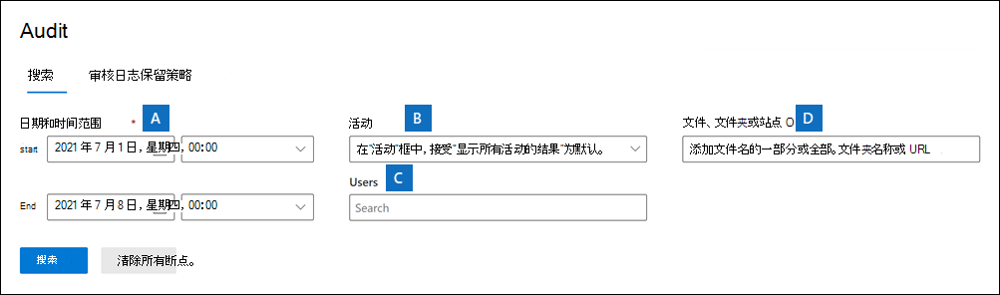
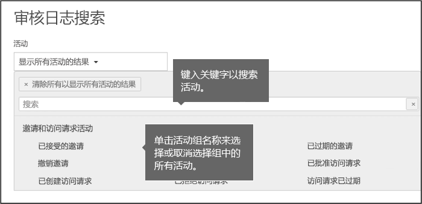
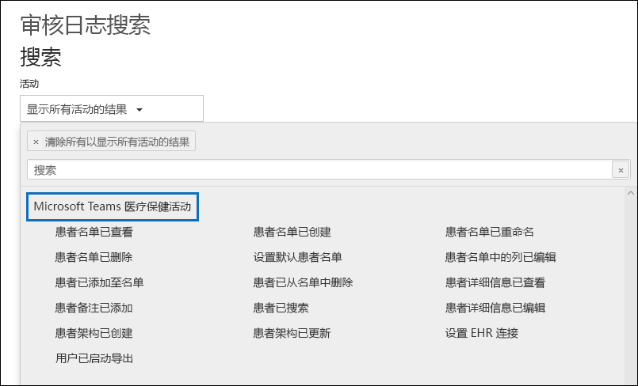

# <a name="search-the-audit-log-in-the-compliance-center"></a>在合规中心搜索审核日志

需要了解用户是否查看了特定文档或从其邮箱中清除了某项？ 如果是，可以使用 Microsoft 365 合规中心中的审核日志搜索工具来搜索同统一的审核日志，以查看组织中的用户和管理员活动。 数千名 Microsoft 365 服务和解决方案中执行的用户和管理员操作被捕获、记录并保留在组织的统一审核日志中。 组织中的用户可以使用审核日志搜索工具来搜索、查看和导出（到 CSV 文件）这些操作的审核记录。

## <a name="microsoft-365-services-that-support-auditing"></a>支持审核的 Microsoft 365 服务

为什么是统一的审核日志？ 因为可以在审核日志中搜索在不同 Microsoft 365 服务中执行的活动。 下表列出了统一审核日志支持的 Microsoft 365 服务和功能（按字母顺序排列）。

| Microsoft 365 服务或功能 | 记录类型|
|:---------|:---------|
| Azure Active Directory|AzureActiveDirectory、AzureActiveDirectoryAccountLogon、AzureActiveDirectoryStsLogon |
| Azure 信息保护|AipDiscover、AipSensitivityLabelAction、AipProtectionAction、AipFileDeleted、AipHeartBeat |
| 通信合规性|ComplianceSuperVisionExchange|
| 内容资源管理器|LabelContentExplorer|
| 数据丢失防护 (DLP)|ComplianceDLPSharePoint, ComplianceDLPExchange, DLPEndpoint|
| Dynamics 365|CRM|
| 电子数据展示|发现、AeD|
| 精确数据匹配|MipExactDataMatch|
| Exchange Online|ExchangeAdmin、ExchangeItem、ExchangeItemAggregated |
| Forms|MicrosoftForms|
| 信息屏障|InformationBarrierPolicyApplication|
| Microsoft 365 Defender|AirInvestigation, AirManualInvestigation, AirAdminActionInvestigation, MS365DCustomDetection|
| Microsoft Teams|MicrosoftTeams|
| MyAnalytics|MyAnalyticsSettings|
| OneDrive for Business|OneDrive|
| Power Apps|PowerAppsApp、PowerAppsPlan|
| Power Automate|MicrosoftFlow|
| Power BI|PowerBIAudit|
| Quarantine|Quarantine|
| 保留策略和保留标签|MIPLabel、MipAutoLabelExchangeItem、MipAutoLabelSharePointItem、MipAutoLabelSharePointPolicyLocation|
| 敏感信息类型|DlpSensitiveInformationType|
| 敏感度标签|MIPLabel、SensitivityLabelAction、SensitivityLabeledFileAction、SensitivityLabelPolicyMatch|
| SharePoint Online|SharePoint、SharePointFileOperation、SharePointSharingOperation、SharePointListOperation、SharePointCommentOperation |
| Stream|MicrosoftStream|
| 威胁智能|ThreatIntelligence、ThreatIntelligenceUrl、ThreatFinder、ThreatIntelligenceAtpContent|
| 工作区分析|WorkplaceAnalytics|
| Yammer|Yammer|
|||

有关在上表中列出的每个服务中审核的操作的详细信息，请参阅本文中的 [已审核的活动](#audited-activities) 部分。

上表还标识了用于在审核日志中搜索相应服务中活动的记录类型值，方法是使用 Exchange Online PowerShell 中的 **Search-UnifiedAuditLog** cmdlet，或通过使用 PowerShell 脚本来实现。 对于同一服务中不同类型的活动，某些服务具有多个记录类型。 有关审核记录类型的更完整列表，请参阅 [Office 365 管理活动 API 架构](/office/office-365-management-api/office-365-management-activity-api-schema#auditlogrecordtype)。

 有关使用 PowerShell 搜索审核日志的详细信息，请参阅：

- [Search-UnifiedAuditLog](/powershell/module/exchange/search-unifiedauditlog)

- [使用 PowerShell 脚本搜索审核日志](audit-log-search-script.md)

## <a name="before-you-search-the-audit-log"></a>在搜索审核日志之前

在开始搜索审核日志之前，请务必阅读以下各项。

- 默认情况下，Microsoft 365 和 Office 365 企业版组织开启审核日志搜索。 若要验证审核日志搜索是否打开，可以在 Exchange Online PowerShell 中运行以下命令：

  ```powershell
  Get-AdminAuditLogConfig | FL UnifiedAuditLogIngestionEnabled
  ```

  *UnifiedAuditLogestionEnabled* 属性的 `True` 值表明已打开审核日志搜索。 有关详细信息，请参阅 [打开或关闭审核日志搜索](turn-audit-log-search-on-or-off.md)。

- 必须分配有 Exchange Online 中的“仅供查看审核日志”或“审核日志”角色才能搜索审核日志。 默认情况下，在 Exchange 管理中心中的“**权限**”页上将这些角色分配给“合规性管理”和“组织管理”角色组。 Office 365 和 Microsoft 365 中的全局管理员将自动添加为 Exchange Online 的组织管理角色组成员。 若要让用户能够使用最低权限级别搜索审核日志，可以在 Exchange Online 中创建自定义角色组，添加“仅供查看审核日志”或“审核日志”角色，然后将用户添加为新角色组的成员。 有关详细信息，请参阅[在 Exchange Online 中管理角色组](/Exchange/permissions-exo/role-groups)。

  > [!IMPORTANT]
  > 如果在 Microsoft 365 合规中心中的 **“权限”** 页上向用户分配“仅供查看审核日志”或“审核日志”角色，则他们将无法搜索审核日志。 必须在 Exchange Online 中分配权限。 这是因为用于搜索审核日志的基础 cmdlet 是 Exchange Online cmdlet。

- 当用户或管理员执行审核活动时，将生成审核记录并将其存储在组织的审核日志中。 保留审核记录（并且可在审核日志中搜索）的时间长度取决于你的 Office 365 或 Microsoft 365 企业版订阅，具体而言是分配给特定用户的许可证类型。

  - 对于分配了 Office 365 E5 或 Microsoft 365 E5 许可证的用户（或拥有 Microsoft 365 E5 合规版或 Microsoft 365 E5 电子数据展示和审核附加许可证的用户），Azure Active Directory、Exchange 和 SharePoint 活动的审核记录默认保留一年。 此外，组织还可以创建审核日志保留策略，以便将其他服务中的活动的审核记录保留最长一年时间。 有关详细信息，请参阅[管理审核日志保留策略](audit-log-retention-policies.md)。

    > [!NOTE]
    > 如果组织参与了审计记录保留一年的个人预览版计划，则在正式发布日期之前产生的审核记录的保留期限不会被重置。

  - 对于分配有任何其他（非E5）Office 365 或 Microsoft 365 许可证的用户，审核记录将保留90天。 有关支持统一审核日志记录的 Office 365 和 Microsoft 365 订阅的列表，请参阅[安全与合规中心服务说明](/office365/servicedescriptions/office-365-platform-service-description/office-365-securitycompliance-center)。

    > [!NOTE]
    > 即使默认情况下启用了邮箱审核，也可能会注意到某些用户的邮箱审核事件在Microsoft 365 合规中心或通过 Office 365 管理活动 API 的审核日志搜索中找不到。有关详细信息，请参阅 [有关邮箱审核日志记录](enable-mailbox-auditing.md#more-information)的详细信息。

- 如果希望为组织关闭审核日志搜索，可以在连接到 Exchange Online 组织的远程 PowerShell 中运行以下命令：

  ```powershell
  Set-AdminAuditLogConfig -UnifiedAuditLogIngestionEnabled $false
  ```

    若要再次打开审核搜索，可在 Exchange Online PowerShell 中运行以下命令：

  ```powershell
  Set-AdminAuditLogConfig -UnifiedAuditLogIngestionEnabled $true
  ```

  有关详细信息，请参阅[关闭审核日志搜索](turn-audit-log-search-on-or-off.md)。

- 如前所述，用于搜索审核日志的基础 cmdlet 是 Exchange Online cmdlet，即 **Search-UnifiedAuditLog**。 这意味着可使用此 cmdlet 搜索审核日志，而不是使用 Microsoft 365 合规中心中 **审核** 页面上的搜索工具。 必须在 Exchange Online PowerShell 中运行此 cmdlet。 有关详细信息，请参阅 [Search-UnifiedAuditLog](/powershell/module/exchange/search-unifiedauditlog)。

  有关将 **Search-UnifiedAuditLog** cmdlet 所返回的搜索结果导出到 CSV 文件的信息，请参阅 [导出、配置和查看审核日志记录](export-view-audit-log-records.md#tips-for-exporting-and-viewing-the-audit-log)中的“有关导出和查看审核日志的提示”部分。

- 若想以编程方式从审核日志下载数据，建议使用 Office 365 管理活动 API，而不是使用 PowerShell 脚本。 Office 365 管理活动 API 是一项 REST Web 服务，可用于为组织制定操作、安全和合规性监视解决方案。 有关详细信息，请参阅 [Office 365 管理活动 API 参考](/office/office-365-management-api/office-365-management-activity-api-reference)。

- Azure Active Directory (Azure AD) 是 Microsoft 365 的目录服务。 统一审核日志包含用户、组、应用程序、域以及在 <a href="https://go.microsoft.com/fwlink/p/?linkid=2024339" target="_blank">Microsoft 365 管理中心</a> 或 Azure 管理门户中执行的目录活动。 有关 Azure AD 事件的完整列表，请参阅 [Azure Active Directory 审核报告事件](/azure/active-directory/reports-monitoring/concept-audit-logs)。

- 发生事件后，最多需要 30 分钟到 24 小时即可在审核日志搜索的结果中返回相应的审核日志记录。下表显示了 Office 365 中不同服务所花费的时间。

  |Microsoft 365 服务或功能|30 分钟|24 小时|
  |---|:---:|:---:|
  |Defender for Microsoft 365 和威胁智能|||
  |Azure Active Directory（用户登录事件）|||
  |Azure Active Directory（管理员事件）|||
  |数据丢失防护|||
  |Dynamics 365 CRM|||
  |电子数据展示|||
  |Exchange Online|||
  |Microsoft Power Automate|||
  |Microsoft Stream|||
  |Microsoft Teams|||
  |Power Apps|||
  |Power BI|||
  |Microsoft 365 合规中心|||
  |敏感度标签|||
  |SharePoint Online 和 OneDrive for Business|||
  |工作区分析|||
  |Yammer|||
  |Microsoft Forms|||
  ||||

- 默认情况下，Power BI 的审核日志记录未启用。 若要在审核日志中搜索 Power BI 活动，则必须在 Power BI 管理门户中启用审核。 有关说明，请参阅 [Power BI 管理门户](/power-bi/service-admin-portal#audit-logs)中的“审核日志”部分。

## <a name="search-the-audit-log"></a>搜索审核日志

下面介绍在 Microsoft 365 中搜索审核日志的流程。

[步骤 1：运行审核日志搜索](#step-1-run-an-audit-log-search)

[步骤 2：查看搜索结果](#step-2-view-the-search-results)

[步骤 3：将搜索结果导出到文件](#step-3-export-the-search-results-to-a-file)

### <a name="step-1-run-an-audit-log-search"></a>步骤 1：运行审核日志搜索

1. 转到 <https://compliance.microsoft.com> 并登录。

    > [!TIP]
    > 使用专用浏览会话（而不是常规会话）来访问 Microsoft 365 合规中心，因为它会阻止你使用当前登录时使用的凭据。 若要在 Microsoft Edge 中打开 InPrivate 浏览会话，或在 Google Chrome（称为隐身窗口）中打开专用浏览会话，请按住 **CTRL+SHIFT+N**。

2. 在 Microsoft 365 合规中心的左窗格中，单击“**审核**”。

    将显示“**审核**”页。

    

    > [!NOTE]
    > 如果显示“**开始记录用户和管理员活动**”链接，请单击该链接以打开审核。 如果未看到此链接，则已为你的组织开启审核。

3. 在“**搜索**”选项卡中，配置以下搜索条件：

   1. “**开始日期**”和“**结束日期**”：默认选择了过去七天。 选择日期和时间范围，以显示在这段时间内发生的事件。 日期和时间以本地时间显示。 可指定的最大日期范围为 90 天。 如果所选日期范围超过 90 天，将显示错误。

    > [!TIP]
    > 如果要使用为期 90 天的最大日期范围，请选择当前时间作为“**开始日期**”。 否则，你将收到说明开始日期早于结束日期的错误消息。 如果你在过去 90 天内打开了审核，则最大日期范围不能从打开审核的日期之前开始。

   2. “**活动**”：单击下拉列表以显示你可以搜索的活动。 已将用户和管理员活动整理到相关活动组中。 你可以选择特定活动，或单击活动组名称以选择该组中的所有活动。 你也可以单击已选活动以取消选择。 运行搜索后，仅将显示所选活动的审核日志项目。 选择“**显示所有活动的结果**”将显示由所选用户或用户组执行的所有活动的结果。<br/><br/>审核日志中记录了超过 100 个用户和管理员活动。 单击本文主题处的“已审核的活动”选项卡可查看每个不同服务中每个活动的描述。

   3. “**用户**”：单击此框，然后选择要为其显示搜索结果的一名或多名用户。 由你在此框中所选用户执行的所选活动的审核日志项目将显示在结果列表中。 将此框留空以返回组织中所有用户（和服务帐户）的条目。

   4. “**文件、文件夹或网站**”：键入部分或完整的文件或文件夹名称，搜索与包含指定关键字的文件夹文件相关的活动。 你还可以指定文件或文件夹的 URL。 如果使用 URL，请确保键入完整 URL 路径或键入 URL 的一部分，请不要包含任何特殊字符或空格 (但是，使用通配符 (\*) 受) 支持。<br/><br/>将此框留空以返回组织中所有文件和文件夹的条目。

    > [!TIP]
    >
    > - 如果要查找与 **网站** 相关的所有活动，请在 URL 后面添加通配符(\*)，以返回该网站的所有条目；例如，`"https://contoso-my.sharepoint.com/personal*"`。
    >
    > - 如果要查找与 **文件** 相关的所有活动，请在文件名前添加通配符 (\*) ，以返回该文件的所有条目；例如，`"*Customer_Profitability_Sample.csv"`。

4. 单击“**搜索**”以使用搜索条件运行搜索。

   此时将加载搜索结果，片刻后将显示在新页面上。 完成搜索后会显示找到的结果数。 最多可显示 5,000 个事件（每次加载 150 个）。 如果超过 50,000 个事件符合搜索条件，则仅显示返回的 50,000 个未排序事件。

   

#### <a name="tips-for-searching-the-audit-log"></a>有关搜索审核日志的提示

- 可以通过单击活动名称选择要搜索的特定活动。 或者可以通过单击组名搜索该组中的所有活动（例如“**文件和文件夹活动**”）。 如果选择了活动，可以单击该活动以取消选择。 还可以使用搜索框显示包含所键入关键字的活动。

  

- 必须选择“**活动**”列表中的“**显示所有活动的结果**”才能显示 Exchange 管理员审核日志中的条目。 此审核日志中的事件将在结果的“**活动**”列中显示 cmdlet 名称（例如 **Set-Mailbox**）。 有关详细信息，请单击本主题中的“**已审核的活动**”选项卡，然后单击“**Exchange 管理员活动**”。

  同样，某些审核活动在“**活动**”列表中没有相应项目。 如果知道这些活动的操作名称，则可以搜索所有活动，然后在将搜索结果导出到 CSV 文件后筛选操作。

- 单击“**清除**”以清除当前搜索条件。 日期范围返回到默认值（过去七天）。 还可以单击“**全部清除以显示所有活动的结果**”以取消所有选定活动。

- 如果找到了 5,000 条结果，则可以假定可能存在超过 5,000 个符合搜索条件的事件。 你可以优化搜索条件并重新运行搜索以返回较少结果，也可以通过选择“**导出结果**”\>“**下载所有结果**”导出所有搜索结果。

### <a name="step-2-view-the-search-results"></a>步骤 2：查看搜索结果

审核日志搜索结果会显示在“**审核日志搜索**”页中的“**结果**”下。 如上文所述，最多显示 5,000 个最新事件（每次加载 150 个）。 使用滚动条或按 **Shift + End** 显示接下来的 150 个事件。

结果包含有关搜索返回的每个事件的以下信息：

- **日期**: 事件发生的日期和时间 (本地时间)。

- “**IP 地址**”：记录活动时所用设备的 IP 地址。 IP 地址显示为 IPv4 或 IPv6 地址格式。

   > [!NOTE]
  > 对于某些服务，此字段中显示的值可能是代表用户调用服务的受信任应用程序（例如，Web 应用上的 Office）的 IP 地址，而不是执行活动的人员所使用设备的 IP 地址。 此外，对于针对 Azure Active Directory 相关事件的管理员活动（或由系统帐户执行的活动），未记录 IP 地址，此字段中显示的值为 `null`。

- **用户**：执行触发事件的操作的用户（或服务帐户）。

- “**活动**”：用户执行的活动。 此值对应于你在“**活动**”下拉列表中选定的活动。 对于来自 Exchange 管理员审核日志的事件，此列中的值为 Exchange cmdlet。

- “**项目**”：由于相应活动而创建或修改的对象。 例如已查看或修改的文件或已更新的用户帐户。 并非所有活动在此列中都具有值。

- “**详细信息**”：有关活动的其他详细信息。 同样，并非所有活动均具有值。

> [!TIP]
> 单击“**结果**”下的列标题对结果进行排序。你可以将结果按从 A 到 Z 或从 Z 到 A 的顺序排序。单击“**日期**”标题以将结果按从旧到新或从新到旧的顺序排序。

#### <a name="view-the-details-for-a-specific-event"></a>查看特定事件的详细信息

可以通过单击搜索结果列表中的事件记录查看有关事件的更多详细信息。 此时将显示包含事件记录的详细属性的“浮出”页。 显示的属性取决于其中发生事件的服务。 

### <a name="step-3-export-the-search-results-to-a-file"></a>步骤 3：将搜索结果导出到文件

可以将审核日志搜索的结果导出到本地计算机上的逗号分隔值 (CSV) 文件。 可以在 Microsoft Excel 中打开此文件，然后使用搜索、排序、筛选和将（包含多个属性的）单列拆分为多列等功能。

1. 运行审核日志搜索，然后修订搜索条件直到获得所需结果。

2. 在搜索结果页上，单击 **导出** > **下载所有结果**。

   审核日志中满足已导出到 CSV 文件的搜索条件的所有条目。 审核日志中的原始数据保存到 CSV 文件。 审核日志条目中的其他信息包含在 CSV 中名为 **AuditData** 的列中。

     > [!IMPORTANT]
     > 你可以将最多 50,000 个条目从单个审核日志搜索中下载到 CSV 文件。 如果下载了 50,000 个条目到 CSV 文件，则可以假定可能存在超过 50,000 个符合搜索条件的事件。 若要导出的条目超出此限制，请尝试使用日期范围以减少审核日志项目。 你可能需要使用更小日期范围运行多个搜索来导出超过 50,000 个条目。

3. 导出过程完成后，窗口顶部会显示一条消息，提示你打开 CSV 文件并将其保存到本地计算机。还可以访问"下载"文件夹中的 CSV 文件。

#### <a name="more-information-about-exporting-and-viewing-audit-log-search-results"></a>有关导出和查看审核日志搜索结果的详细信息

- 下载所有搜索结果时，CSV 文件包含列 **CreationDate**、**UserIds**、**Operations**、**AuditData**。 **AuditData** 列包含有关每个事件的其他信息（类似于在合规中心查看搜索结果时浮出控件页面上显示的详细信息）。 此列中的数据由一个 JSON 对象组成，其中包含审核日志记录中的多个属性。 JSON 对象中的每个 *property:value* 对均由逗号分隔。 你可以使用 Excel 中的 Power Query 编辑器的 JSON 转换工具将“**AuditData**”列拆分为多个列，以使 JSON 对象中的每个属性具有自己的列。 这让你能够对一个或多个属性进行排序和筛选。 有关使用 Power Query 编辑器转换 JSON 对象的分步说明，请参阅[导出、配置和查看审核日志记录](export-view-audit-log-records.md)。

  拆分“**AuditData**”列后，你可以对“**操作**”列进行筛选以显示特定类型活动的详细属性。

- 下载（包含来自不同服务的事件的）搜索查询的所有结果时，CSV 文件中的“AuditData”列将含有不同属性，具体取决于在哪种服务中执行操作。 例如，来自 Exchange 和 Azure AD 审核日志的条目包含一个名为 **ResultStatus** 的属性，它指示操作是否成功。 来自 SharePoint 的事件不包含此属性。 类似地，SharePoint 事件具有用于标识文件和文件夹相关活动的网站 URL 的属性。 若要缓和此行为，建议使用多个搜索导出单个服务中活动的结果。

  有关下载所有结果时 CSV 文件的“**AuditData**”列中所列各个属性的说明以及每个属性适用的服务，请参阅 [审核日志中的属性详细信息](detailed-properties-in-the-office-365-audit-log.md)。

## <a name="audited-activities"></a>已审核的活动

本节内容中的表描述了在 Microsoft 365 中审核的活动。 你可以通过在安全与合规中心中搜索审核日志来搜索这些事件。

这些表对相关活动或特定服务中的活动进行分组。 表中包含显示在“**活动**”下拉列表中的友好名称以及导出搜索结果时显示在审核记录详细信息和 CSV 文件中的相应操作的名称。 有关详细信息的说明，请参阅[审核日志中的属性详细信息](detailed-properties-in-the-office-365-audit-log.md)。

单击以下任一链接转到特定表格。

:::row:::
    :::column:::
        [文件和页面活动](#file-and-page-activities)
    :::column-end:::
    :::column:::
        [文件夹活动](#folder-activities)
    :::column-end:::
    :::column:::
        [SharePoint 列表活动](#sharepoint-list-activities)
    :::column-end:::
:::row-end:::

:::row:::
    :::column:::
        [共享和访问请求活动](#sharing-and-access-request-activities)
    :::column-end:::
    :::column:::
        [同步活动](#synchronization-activities)
    :::column-end:::
    :::column:::
        [网站权限活动](#site-permissions-activities)
    :::column-end:::
:::row-end:::

:::row:::
    :::column:::
        [网站管理活动](#site-administration-activities)
    :::column-end:::
    :::column:::
        [Exchange 邮箱活动](#exchange-mailbox-activities)
    :::column-end:::
    :::column:::
        [用户管理活动](#user-administration-activities)
    :::column-end:::
:::row-end:::

:::row:::
    :::column:::
        [Azure AD 组管理活动](#azure-ad-group-administration-activities)
    :::column-end:::
    :::column:::
        [应用程序管理活动](#application-administration-activities)
    :::column-end:::
    :::column:::
        [角色管理活动](#role-administration-activities)
    :::column-end:::
:::row-end:::

:::row:::
    :::column:::
        [目录管理活动](#directory-administration-activities)
    :::column-end:::
    :::column:::
        [电子数据展示活动](#ediscovery-activities)
    :::column-end:::
    :::column:::
        [高级电子数据展示活动](#advanced-ediscovery-activities)
    :::column-end:::
:::row-end:::

:::row:::
    :::column:::
        [Power BI 活动](#power-bi-activities)
    :::column-end:::
    :::column:::
        [Microsoft 工作区分析](#workplace-analytics-activities)
    :::column-end:::
    :::column:::
        [Microsoft Teams 活动](#microsoft-teams-activities)
    :::column-end:::
:::row-end:::

:::row:::
    :::column:::
        [Microsoft Teams 医疗保健活动](#microsoft-teams-healthcare-activities)
    :::column-end:::
    :::column:::
        [Microsoft Teams 班次活动](#microsoft-teams-shifts-activities)
    :::column-end:::
    :::column:::
        [Yammer 活动](#yammer-activities)
    :::column-end:::
:::row-end:::

:::row:::
    :::column:::
        [Microsoft Power Automate 活动](#microsoft-power-automate-activities)
    :::column-end:::
    :::column:::
        [Microsoft Power Apps 活动](#microsoft-power-apps-activities)
    :::column-end:::
    :::column:::
        [Microsoft Stream 活动](#microsoft-stream-activities)
    :::column-end:::
:::row-end:::

:::row:::
    :::column:::
        [内容浏览器活动](#content-explorer-activities)
    :::column-end:::
    :::column:::
        [隔离活动](#quarantine-activities)
    :::column-end:::
    :::column:::
        [Microsoft Forms 活动](#microsoft-forms-activities)
    :::column-end:::
:::row-end:::

:::row:::
    :::column:::
        [敏感度标签活动](#sensitivity-label-activities)
    :::column-end:::
    :::column:::
        [保留策略和保留标签活动](#retention-policy-and-retention-label-activities)
    :::column-end:::
    :::column:::
        [简介电子邮件活动](#briefing-email-activities)
    :::column-end:::
:::row-end:::

:::row:::
    :::column:::
        [MyAnalytics 活动](#myanalytics-activities)
    :::column-end:::
    :::column:::
        [信息障碍活动](#information-barriers-activities)
    :::column-end:::
    :::column:::
        [处置评审活动](#disposition-review-activities)
    :::column-end:::
:::row-end:::

:::row:::
    :::column:::
        [通信合规性活动](#communication-compliance-activities)
    :::column-end:::
    :::column:::
        [报告活动](#report-activities)
    :::column-end:::
    :::column:::
        [Exchange 管理员活动](#exchange-admin-audit-log)
    :::column-end:::
:::row-end:::

### <a name="file-and-page-activities"></a>文件和页面活动

下表介绍了 SharePoint Online 和 OneDrive for Business 中的文件和页面活动。

|友好名称|操作|说明|
|:-----|:-----|:-----|
|已访问文件|FileAccessed|用户或系统账户可以访问文件。用户访问文件后，在接下来的五分钟内，同一用户不会再次记录同一个文件的 FileAccessed 事件。|
|(无)|FileAccessedExtended|这与“已访问文件”(FileAccessed) 活动有关。如果一个用户长时间（至 3 小时）持续访问某一文件，则会记录下 FileAccessedExtended 事件。 <br/><br/> 记录 FileAccessedExtended 事件是为了减少持续访问文件时所记录的 FileAccessed 事件数。 这有助于减小（实际上是）同一用户活动的多个 FileAccessed 记录的干扰，从而专注于初始（和更重要的）FileAccessed 事件。|
|已更改文件的保留标签|ComplianceSettingChanged|保留标签已应用于文档或已从文档中删除。 手动或自动将保留标签应用于消息时触发此事件。|
|已将记录状态更改为“已锁定”|LockRecord|将文档分类为记录的保留标签的记录状态为“已锁定”。 这意味着无法修改或删除文档。 仅至少分配有网站参与者权限的用户才能更改文档的记录状态。|
|已将记录状态更改为“未锁定”|UnlockRecord|将文档分类为记录的保留标签的记录状态为“未锁定”。 这意味着可以修改或删除文档。 仅至少分配有网站参与者权限的用户才能更改文档的记录状态。|
|已签入文件|FileCheckedIn|用户签入其从文档库中签出的文档。|
|已签出文件|FileCheckedOut|用户签出位于文档库中的文档。用户可以签出与之共享的文档并对其进行更改。|
|已复制文件|FileCopied|用户从网站复制文档。可以将复制的文件保存到网站上的其他文件夹中。|
|已删除文件|FileDeleted|用户从网站删除文档。|
|从回收站删除文件|FileDeletedFirstStageRecycleBin|用户从网站的回收站中删除文件。|
|从第二阶段回收站删除文件|FileDeletedSecondStageRecycleBin|用户从网站的第二阶段回收站中删除文件。|
|标记为记录的已删除文件|RecordDelete|已删除标记为记录的文档或电子邮件。 当在内容上贴上将项目标记为记录的保留标签时，将将该项目视为已记录。|
|检测到文档敏感度不匹配|DocumentSensitivityMismatchDetected|用户将文档上传到受敏感度标签保护的网站上，该文档的敏感度标签的优先级比该网站应用的敏感度标签高。 例如，标有“机密”的文档上传到标有“常规”的网站上。 <br/><br/> 如果文档的敏感度标签的优先级低于网站应用的敏感度标签，则不触发此事件。 例如，标有“常规”的文档上传到标有“机密”的网站上。 有关敏感度标签优先级的详细信息，请参阅[标签优先级（顺序）](sensitivity-labels.md#label-priority-order-matters)。|
|在文件中检测到恶意软件|FileMalwareDetected|SharePoint 防病毒引擎在文件中检测到恶意软件。|
|已放弃文件签出|FileCheckOutDiscarded|用户放弃（或撤消）签出的文件。这意味着将放弃签出文件时对其所做的所有更改，而不将其保存到文档库中的文档版本。|
|已下载的文件|FileDownloaded|用户从网站下载文档。|
|已修改文件|FileModified|用户或系统帐户修改网站上文档的内容或属性。 当同一用户修改同一文档的内容或属性时，系统将等待 5 分钟，然后再记录另一个 FileModified 事件。|
|(无)|FileModifiedExtended|这与“已修改文件”(FileModified) 活动相关。如果一个用户长时间（至 3 小时）持续修改某一文件，则会记录下 FileModifiedExtended 事件。 <br/><br/> 记录 FileModifiedExtended 事件是为了减少持续修改文件时所记录的 FileModified 事件数。 这有助于减小（实际上是）同一用户活动的多个 FileModified 记录的干扰，从而专注于初始（和更重要的）FileModified 事件。|
|已移动文件|FileMoved|用户将文档从网站上的当前位置移动到新位置。|
|(无)|FilePreviewed|用户在 SharePoint 或 OneDrive for Business 网站上预览文件。 这些事件通常发生在基于单个活动的高容量情形中，例如查看图库。|
|已执行的搜索查询|SearchQueryPerformed|用户或系统帐户在 SharePoint 或 OneDrive for Business 中执行搜索。 部分服务帐户执行搜索查询的常见情形包括将电子数据展示挂起和保留策略应用到网站或 OneDrive 帐户，以及将保留或敏感度标签自动应用到网站内容。|
|已回收文件 | FileRecycled | 用户将文件移入 SharePoint 回收站。 |
|已回收文件夹 | FolderRecycled | 用户将文件夹移入 SharePoint 回收站。 |
|已回收文件的次要版本|FileVersionsAllMinorsRecycled|用户从文件版本历史记录中删除所有次要版本。 已删除的版本移动到网站的回收站。|
|已回收所有版本的文件|FileVersionsAllRecycled|用户从文件版本历史记录中删除所有版本。 已删除的版本移动到网站的回收站。|
|已回收文件版本|FileVersionRecycled|用户从文件版本历史记录中删除某个版本。 已删除的版本移动到网站的回收站。|
|已重命名文件|FileRenamed|用户重命名网站上的文档。|
|已还原文件|FileRestored|用户从网站回收站还原文档。 |
|已上传文件|FileUploaded|用户将文档上传到网站上的文件夹。 |
|已查看页面|PageViewed|用户在网站上查看页面。 这不包括使用 Web 浏览器查看位于文档库中的文件。 用户查看页面后，在接下来的五分钟内不会为同一用户再次记录同一页的 PageViewed 事件。|
|(无)|PageViewedExtended|这与“已查看页面”(PageViewed) 活动相关。如果一个用户长时间（至 3 小时）持续查看某一网页，则会记录下 PageViewedExtended 事件。 <br/><br/> 记录 PageViewedExtended 事件是为了减少持续查看页面时所记录的 PageViewed 事件数。 这有助于减小（实际上是）同一用户活动的多个 PageViewed 记录的干扰，从而专注于初始（和更重要的）PageViewed 事件。|
|按客户端查看信号|ClientViewSignaled|用户的客户端（例如网站或移动应用）已发出信号，表明用户已查看指示的页面。 此活动通常在页面的 PagePrefetched 事件后记录。 <br/><br/>**注意**：由于 ClientViewSignaled 事件由客户端而非服务器发出信号，因此服务器可能不会记录该事件，从而导致该事件可能未显示在审核日志中。 审核记录中的信息也可能不可信。 但是，由于用户身份由用于创建信号的令牌验证，因此相应审核记录中列出的用户身份是准确的。 当同一用户的客户端发出用户再次查看页面的信号时，系统将等待 5 分钟，然后再记录同一事件。|
|(无)|PagePrefetched|用户的客户端（例如网站或移动应用）已请求指示的页面，以帮助提高用户浏览时的性能。 记录此事件以指示页面内容已服务于用户的客户端。 此事件未明确指示用户导航到页面。 <br/><br/> 当客户端（根据用户请求）呈现页面内容时，应生成 ClientViewSignaled 事件。 并非所有客户端都支持指示预提取，因此一些预提取的活动可能会被记录为 PageViewed 事件。|
||||

#### <a name="frequently-asked-questions-about-fileaccessed-and-filepreviewed-events"></a>有关 FileAccessed 和 FilePreviewed 事件的常见问题

**任何非用户活动都可以触发包含 "OneDriveMpc-Transform_Thumbnail" 等之类用户代理的 FilePreviewed 审核记录吗？**

我们不了解非用户操作生成类似事件的情况。比如打开用户配置文件卡片（通过在 Outlook 网页版中的邮件中单击其名称或电子邮件地址）生成类似事件的用户操作。

**对 OneDriveMpc Transform_Thumbnail 的调用是否始终由用户有意触发？**

否。但是类似的事件可以作为浏览器预取的结果被记录下来。

**如果看到来自 Microsoft 注册的 IP 地址的 FilePreviewed 事件，是否表示预览显示在用户设备的屏幕上？**

否。该事件可能已经作为浏览器预取的结果被记录下来。

**是否存在用户预览文档时生成文件访问事件的场景？**

FilePreviewed 和 FileAccessed 事件都表明用户的调用导致了对文件的读取（或对文件的缩略图呈现的读取）。 虽然这些事件旨在与访问意向保持一致，但事件的区别并不能保证用户的意图。

#### <a name="the-appsharepoint-user-in-audit-records"></a>审核记录中的 app\@sharepoint 用户

在某些文件活动（和其他 SharePoint 相关活动）的审核记录中，你可能会注意到执行该活动的用户（在“用户”和“用户 ID”字段中识别）是 app@sharepoint。 这表示执行活动的“用户”是一个应用程序。 在这种情况下，该应用程序被授予 SharePoint 中代表用户、管理员或服务执行组织范围内操作（例如，搜索 SharePoint 网站或 OneDrive 帐户）的权限。 授予应用程序权限的过程被称为“*仅限 SharePoint 应用*”访问权限。 这表明提供给 SharePoint 执行操作的身份验证是由应用程序而不是用户做出的。 这就是为什么在某些审核记录中标识 app@sharepoint 用户的原因。 有关详细信息，请参阅[通过仅限 SharePoint 应用授予访问权限](/sharepoint/dev/solution-guidance/security-apponly-azureacs)。

例如，app@sharepoint 通常被标识为“已执行搜索查询”和“已访问文件”事件的用户。 这是因为在将保留策略应用到网站和 OneDrive 帐户时，组织中具有仅限 SharePoint 应用访问权限的应用程序会执行搜索查询和访问文件。

以下是一些其他情形，其中审核记录中的 app@sharepoint 可能被标识为执行活动的用户：

- Microsoft 365 组。 用户或管理员创建新组时，会生成审核记录，用于创建网站集、更新列表以及将成员添加到 SharePoint 组。 应用程序将代表创建组的用户执行这些任务。

- Microsoft Teams。与 Microsoft 365 组类似，也会生成审核记录，用于创建网站集、更新列表以及在创建团队时将成员添加到 SharePoint 组。

- 合规性功能。理员实现合规性功能（如保留策略、电子数据展示保留和自动应用敏感度标签）时。

在这些和其他情形下，你还会注意到，以 app@sharepoint 作为指定用户的多个审核记录是在较短的时间范围内创建的，通常每条记录只需几秒钟。 这也表明它们可能由同一个用户启动的任务触发。 而且，审核记录中的 ApplicationDisplayName 和 EventData 字段可以帮助你识别触发此事件的应用场景或应用程序。

### <a name="folder-activities"></a>文件夹活动

下表介绍了 SharePoint Online 和 OneDrive for Business 中的文件夹活动。 如前所述，某些 SharePoint 活动的审核记录将表明 app@sharepoint 用户代表启动操作的用户或管理员执行了该活动。 有关详细信息，请参阅[审核记录中的 app\@sharepoint 用户](#the-appsharepoint-user-in-audit-records)。

|友好名称|操作|说明|
|:-----|:-----|:-----|
|已复制文件夹|FolderCopied|用户将文件夹从网站复制到 SharePoint 或 OneDrive for Business 的其他位置。|
|已创建文件夹|FolderCreated|用户在网站上创建一个文件夹。|
|已删除文件夹|FolderDeleted|用户从网站中删除一个文件夹。|
|从回收站删除文件夹|FolderDeletedFirstStageRecycleBin|用户从网站上的回收站中删除文件夹。|
|从第二阶段回收站删除文件夹|FolderDeletedSecondStageRecycleBin|用户从网站上的第二阶段回收站中删除文件夹。|
|已修改文件夹|FolderModified|用户在网站上修改文件夹。 这包括更改文件夹元数据，例如更改标签和属性。|
|已移动文件夹|FolderMoved|用户将文件夹移动到网站上的其他位置。|
|已重命名文件夹|FolderRenamed|用户在网站上重命名文件夹。|
|已还原文件夹|FolderRestored|用户从网站上的回收站中还原文件夹。|
||||

### <a name="sharepoint-list-activities"></a>SharePoint 列表活动

下表介绍了当用户与 SharePoint Online 中的列表和列表项进行交互时执行的相关活动。 如前所述，某些 SharePoint 活动的审核记录将表明 app@sharepoint 用户代表启动操作的用户或管理员执行了该活动。 有关详细信息，请参阅[审核记录中的 app\@sharepoint 用户](#the-appsharepoint-user-in-audit-records)。

|友好名称|操作|说明|
|:-----|:-----|:-----|
|已创建列表|ListCreated|用户已创建 SharePoint 列表。|
|已创建列表列|ListColumnCreated|用户已创建 SharePoint 列表列。 列表列是指附加到一个或多个 SharePoint 列表的列。|
|已创建列表内容类型|ListContentTypeCreated|用户已创建列表内容类型。列表内容类型是指附加到一个或多个 SharePoint 列表的内容类型。|
|已创建列表项|ListItemCreated|用户已在现有的 SharePoint 列表中创建项目。|
|已创建网站列|SiteColumnCreated|用户已创建 SharePoint 网站列。 网站列是指未附加到列表的列。 网站列还是一种可供给定 Web 中的任何列表使用的元数据结构。|
|已创建网站内容类型|Site ContentType Created|用户已创建网站内容类型。 网站内容类型是指附加到父网站的内容类型。|
|已删除列表|ListDeleted|用户已删除 SharePoint 列表。|
|已删除列表列|List Column Deleted|用户已删除 SharePoint 列表列。|
|已删除列表内容类型|ListContentTypeDeleted|用户已删除列表内容类型。|
|已删除列表项|List Item Deleted|用户已删除 SharePoint 列表项。|
|已删除网站列|SiteColumnDeleted|用户已删除 SharePoint 网站列。|
|已删除网站内容类型|SiteContentTypeDeleted|用户已删除网站内容类型。|
|已回收列表项|ListItemRecycled|用户已将 SharePoint 列表项移到回收站。|
|已还原列表|ListRestored|用户已从回收站还原 SharePoint 列表。|
|已还原列表项|ListItemRestored|用户已从回收站还原 SharePoint 列表项。|
|已更新列表|ListUpdated|用户通过修改一个或多个属性更新了 SharePoint 列表。|
|已更新列表列|ListColumnUpdated|用户通过修改一个或多个属性更新了 SharePoint 列表列。|
|已更新列表内容类型|ListContentTypeUpdated|用户通过修改一个或多个属性更新了列表内容类型。|
|已更新列表项|ListItemUpdated|用户通过修改一个或多个属性更新了 SharePoint 列表项。|
|已更新网站列|SiteColumnUpdated|用户通过修改一个或多个属性更新了 SharePoint 网站列。|
|已更新网站内容类型|SiteContentTypeUpdated|用户通过修改一个或多个属性更新了网站内容类型。|
|已查看列表项|ListItemViewed|用户查看了某个 SharePoint 列表项。用户查看列表项后，在接下来的五分钟内，不会为同一用户对同一列表项再次记录 ListItemViewed 事件。|
||||

### <a name="sharing-and-access-request-activities"></a>共享和访问请求活动

下表介绍了 SharePoint Online 和 OneDrive for Business 中的用户共享和访问请求活动。 对于共享事件，“**结果**”下的“**详细信息**”列标识了与之共享项目的用户名或组名以及该用户或组是否为组织中的成员或来宾。 有关详细信息，请参阅[在审核日志中使用共享审核](use-sharing-auditing.md)。

> [!NOTE]
> 根据用户对象的 UserType 属性，用户可以是 *成员* 或 *来宾*。 通常，成员为员工，来宾则为组织外部的合作者。 用户接受共享邀请（而尚未成为你组织的一员）时，将在组织的目录中为其创建来宾帐户。 来宾用户在你的目录中拥有帐户后，即可与其直接共享资源（无需邀请）。

|友好名称|操作|说明|
|:-----|:-----|:-----|
|已向网站集添加权限级别|PermissionLevelAdded|已向网站集添加权限级别。|
|已接受访问请求|AccessRequestAccepted|已接受对网站、文件夹或文档的访问请求，并已授予请求用户访问权限。|
|已接受共享邀请|SharingInvitationAccepted|用户（成员或来宾）接受共享邀请并被授予对资源的访问权限。 此事件包含受邀用户的信息以及用于接受邀请的电子邮件地址（可能有所不同）。 此活动通常伴有第二事件，描述向用户授予资源访问权限的方式，例如将用户添加到可以访问资源的组。|
|已阻止共享邀请|SharingInvitationBlocked|由于基于目标用户的域允许或拒绝外部共享的外部共享策略，由你组织中的用户发送的共享邀请已被阻止。在这种情况下，共享邀请被阻止的原因如下： <br/> 允许的域列表中不包含目标用户的域。 <br/> 或 <br/> 目标用户的域包含在阻止的域列表中。 <br/> 有关基于域允许或阻止外部共享的详细信息，请参阅 [SharePoint Online 和 OneDrive for Business 中的受限域共享](/sharepoint/restricted-domains-sharing)。|
|已创建访问请求|AccessRequestCreated|用户请求访问其无权访问的网站、文件夹或文档。|
|已创建公司可共享链接 |CompanyLinkCreated|用户已创建指向某资源的公司范围链接。 公司范围链接仅供组织内的成员使用。 来宾无法使用。|
|已创建匿名链接|AnonymousLinkCreated|用户创建了指向某资源的匿名链接。 拥有此链接的任何人均可访问资源，无需通过身份验证。|
|已创建安全链接|SecureLinkCreated|已为此项目创建安全共享链接。|
|已创建共享邀请|SharingInvitationCreated|用户与不在组织目录中的用户共享了 SharePoint Online 或 OneDrive for Business 中的资源。|
|已删除安全链接|SecureLinkDeleted|已删除安全共享链接。|
|已拒绝访问请求 |AccessRequestDenied|对网站、文件夹或文档的访问请求被拒绝。|
|已删除公司可共享链接|CompanyLinkRemoved|用户删除了指向某资源的公司范围链接。 无法再使用该链接访问资源。|
|已删除匿名链接|AnonymousLinkRemoved|用户删除了指向某资源的匿名链接。 无法再使用该链接访问资源。|
|已共享文件、文件夹或网站|SharingSet|用户（成员或来宾）与组织目录中的用户共享了 SharePoint 或 OneDrive for Business 中的文件、文件夹或网站。 此活动的“**详细信息**”列中的值标识了与之共享资源的用户的名称以及该用户是成员还是来宾。 <br/><br/> 此活动通常伴有第二事件，描述向用户授予资源访问权限的方式，例如将用户添加到可以访问资源的组。|
|已更新访问请求|AccessRequestUpdated|已更新项目的访问请求。|
|已更新匿名链接|AnonymousLinkUpdated|用户更新了指向某资源的匿名链接。 导出搜索结果时，EventData 属性中包括更新后的字段。|
|已更新共享邀请|SharingInvitationUpdated|已更新外部共享邀请。|
|已使用匿名链接|AnonymousLinkUsed|匿名用户使用匿名链接访问了资源。 用户身份可能未知，但你可以获得其他详细信息，例如用户的 IP 地址。|
|已取消共享文件、文件夹或网站|SharingRevoked|用户（成员或来宾）取消共享以前与其他用户共享的文件、文件夹或网站。|
|已使用公司可共享链接|CompanyLinkUsed|用户使用公司范围链接访问了资源。|
|已使用安全链接|SecureLinkUsed|用户已使用安全链接。|
|已将用户添加到安全链接|AddedToSecureLink|已将用户添加到可使用安全共享链接的实体列表中。|
|已从安全链接中删除用户|RemovedFromSecureLink|已从可使用安全共享链接的实体列表中删除用户。|
|已撤消共享邀请|SharingInvitationRevoked|用户撤消了针对某资源的共享邀请。|
||||

### <a name="synchronization-activities"></a>同步活动

下表列出了 SharePoint Online 和 OneDrive for Business 中的文件同步活动。

|友好名称|操作|说明|
|:-----|:-----|:-----|
|已允许计算机同步文件|ManagedSyncClientAllowed|用户成功建立与网站的同步关系。同步关系建立成功是因为用户的计算机是已添加到可访问组织文档库的域列表（称为 *安全收件人列表*）的域的成员。 <br/><br/> 有关此功能的详细信息，请参阅[使用 Windows PowerShell cmdlet 为安全收件人列表中的域启用 OneDrive 同步](/powershell/module/sharepoint-online/)。|
|已阻止计算机同步文件|UnmanagedSyncClientBlocked|用户尝试从某计算机与网站建立同步关系，该计算机不是组织域的成员，或是尚未添加到可访问组织文档库的域列表（称为 *安全收件人列表*）的域的成员。不允许同步关系，并阻止用户的计算机同步、下载或上传文档库中的文件。<br/><br/> 有关此功能的信息，请参阅[使用 Windows PowerShell cmdlet 为安全收件人列表中的域启用 OneDrive 同步](/powershell/module/sharepoint-online/)。|
|已将文件下载到计算机|FileSyncDownloadedFull|用户使用 OneDrive 同步应用 (OneDrive.exe) 从 SharePoint 文档库或 OneDrive for Business 将文件下载到计算机。|
|已将文件更改下载到计算机|FileSyncDownloadedPartial|此事件已与旧的 OneDrive for Business 同步应用 (Groove.exe) 一起弃用。|
|已将文件上传到文档库|FileSyncUploadedFull|用户使用 OneDrive 同步应用 (OneDrive.exe) 上传新文件或将更改上传到 SharePoint 文档库或 OneDrive for Business 中的文件。|
|已将文件更改上传到文档库|FileSyncUploadedPartial|此事件已与旧的 OneDrive for Business 同步应用 (Groove.exe) 一起弃用。|
||||

### <a name="site-permissions-activities"></a>网站权限活动

下表列出了与在 SharePoint 中分配权限以及使用组授予（和撤销）网站访问权限相关的事件。 如前所述，某些 SharePoint 活动的审核记录将表明 app@sharepoint 用户代表启动操作的用户或管理员执行了该活动。 有关详细信息，请参阅[审核记录中的 app\@sharepoint 用户](#the-appsharepoint-user-in-audit-records)。

|友好名称|操作|说明|
|:-----|:-----|:-----|
|已添加网站集管理员|SiteCollectionAdminAdded|网站集管理员或所有者为网站添加了作为网站集管理员的人员。 网站集管理员具有网站集和所有子网站的完全控制权限。 当管理员（通过编辑 SharePoint 管理中心的用户配置文件或[使用 Microsoft 365 管理中心](/office365/admin/add-users/get-access-to-and-back-up-a-former-user-s-data)）向自己授予对用户 OneDrive 帐户的访问权限时，也将记录此活动。|
|已向 SharePoint 组添加用户或组|AddedToGroup|用户向 SharePoint 组添加了成员或来宾。 这可能是目的性操作，也可能是其他活动（例如共享事件）的结果。|
|中断权限级别继承|PermissionLevelsInheritanceBroken|已更改项目，使其不再从父级继承权限级别。|
|中断共享继承|SharingInheritanceBroken|已更改项目，使其不再从父级继承共享权限。|
|已创建组|GroupAdded|网站管理员或所有者为网站创建组，或执行将导致创建组的任务。例如，当用户首次创建共享文件的链接时，系统组会被添加到用户的 OneDrive for Business 网站中。此事件也可以是用户使用编辑权限创建共享文件链接的结果。|
|已删除组|GroupRemoved|用户从网站删除组。|
|已修改访问请求设置|WebRequestAccessModified|已修改网站上的访问请求设置。|
|已修改“成员可共享”设置|WebMembersCanShareModified|已修改网站上的“**成员可共享**”设置。|
|已修改网站集的权限级别|PermissionLevelModified|已更改网站集的权限级别。|
|已修改网站权限|SitePermissionsModified|站点管理员或所有者（或系统帐户）更改分配给站点上组的权限级别。如果从组中删除所有权限，也会记录此活动。 <br/><br/> **注意**：SharePoint Online 中已弃用此操作。若要查找相关事件，可搜索其他权限相关的活动，例如 **已添加网站集管理员**、**已向 SharePoint 组添加用户或组**、**已允许用户创建组**、**已创建组** 和 **已删除组**。|
|已删除网站集的权限级别|PermissionLevelRemoved|已删除网站集的权限级别。|
|已删除网站集管理员|SiteCollectionAdminRemoved|网站集管理员或所有者为网站删除了作为网站集管理员的人员。 当管理员（通过在 SharePoint 管理中心编辑用户配置文件）从用户 OneDrive 帐户的网站集管理员列表中删除自己时，也会记录此活动。  若要在审核日志搜索结果中返回此活动，必须搜索所有活动。|
|已从 SharePoint 组中删除用户或组|RemovedFromGroup|用户已从 SharePoint 组中删除成员或来宾。 这可能是一项目的性操作，也可能是其他活动（例如取消共享事件）的结果。|
|已请求网站管理员权限|SiteAdminChangeRequest|用户请求将自己添加为网站集的网站集管理员。网站集管理员具有对网站集和所有子网站的完全控制权限。|
|已还原共享继承|SharingInheritanceReset|已进行更改，使项目能够从父级继承共享权限。|
|已更新组|GroupUpdated|网站管理员或所有者为网站更改组设置。这可能包括更改组名、可查看或编辑组成员身份的人员，以及成员身份请求的处理方式。|
||||

### <a name="site-administration-activities"></a>网站管理活动

下表列出了 SharePoint Online 中的网站管理任务所产生的事件。 如前所述，某些 SharePoint 活动的审核记录将表明 app@sharepoint 用户代表启动操作的用户或管理员执行了该活动。 有关详细信息，请参阅[审核记录中的 app\@sharepoint 用户](#the-appsharepoint-user-in-audit-records)。

|友好名称|操作|说明|
|:-----|:-----|:-----|
|已添加允许的数据位置|AllowedDataLocationAdded|SharePoint 或全局管理员在多地理环境中添加了允许的数据位置。|
|已添加豁免用户代理|ExemptUserAgentSet|SharePoint 或全局管理员向 SharePoint 管理中心的豁免用户代理列表添加了用户代理。|
|已添加地理位置管理员|GeoAdminAdded|SharePoint 或全局管理员已将用户添加为地理位置管理员。|
|已允许用户创建组|AllowGroupCreationSet|网站管理员或所有者向网站添加权限级别，允许分配了该权限的用户为网站创建组。 |
|已取消网站地域移动|SiteGeoMoveCancelled|SharePoint 或全局管理员成功取消 SharePoint 或 OneDrive 网站地域移动。 Multi-Geo 功能可让一个组织跨越多个 Microsoft 数据中心地理位置（称之为“地理位置”）。 有关详细信息，请参阅 [OneDrive 和 SharePoint Online 的 Multi-Geo 功能](../enterprise/multi-geo-capabilities-in-onedrive-and-sharepoint-online-in-microsoft-365.md)。|
|已更改共享策略|SharingPolicyChanged|SharePoint 或全局管理员通过使用 Microsoft 365 管理中心、SharePoint 管理中心或 SharePoint Online 命令行管理程序更改了 SharePoint 共享策略。 将记录对组织中的共享策略设置所做的任何更改。 已更改的策略在事件记录详细属性的 **ModifiedProperties** 字段中标识。|
|已更改设备访问策略|DeviceAccessPolicyChanged|SharePoint 或全局管理员已更改组织的非托管设备策略。 此策略控制未加入组织的设备对 SharePoint、OneDrive 和 Microsoft 365 的访问权限。 配置此策略需要企业移动性 + 安全性订阅。 有关详细信息，请参阅[控制非托管设备的访问](/sharepoint/control-access-from-unmanaged-devices)。|
|已更改豁免用户代理|CustomizeExemptUsers|SharePoint 或全局管理员自定义 SharePoint 管理中心的豁免用户代理列表。可以指定免于接收要索引的整个网页的用户代理。这意味着指定的豁免用户代理遇到 InfoPath 表单时，该表单将作为 XML 文件而非整个网页返回。这可加速索引 InfoPath 表单。|
|已更改网络访问策略|NetworkAccessPolicyChanged|SharePoint 或全局管理员已通过 SharePoint 管理中心或 SharePoint Online PowerShell 更改基于位置的访问策略（也称为“受信任的网络边界”）。 这类策略基于指定的授权 IP 地址范围控制组织中的用户对 SharePoint 和 OneDrive 资源的访问权限。 有关详细信息，请参阅[基于网络位置控制对 SharePoint Online 和 OneDrive 数据的访问权限](/sharepoint/control-access-based-on-network-location)。|
|已完成网站地域移动|SiteGeoMoveCompleted|组织中的全局管理员计划的网站地域移动已成功完成。 Multi-Geo 功能可让一个组织跨越多个 Microsoft 数据中心地理位置（称之为“地理位置”）。 有关详细信息，请参阅 [OneDrive 和 SharePoint Online 的 Multi-Geo 功能](../enterprise/multi-geo-capabilities-in-onedrive-and-sharepoint-online-in-microsoft-365.md)。|
|已创建“收件人​​”连接|SendToConnectionAdded|SharePoint 或全局管理员在 SharePoint 管理中心的“记录管理”页上创建新的“收件人”连接。“收件人”连接指定文档存储库或记录中心的设置。创建“收件人”连接时，内容管理器可以将文档提交到指定位置。|
|已创建网站集|SiteCollectionCreated|SharePoint 或全局管理员在 SharePoint Online 组织中创建网站集，或者用户设置其 OneDrive for Business 网站。|
|已删除孤立中心网站|HubSiteOrphanHubDeleted|SharePoint 或全局管理员已删除孤立中心网站，它是没有任何关联网站的中心网站。 孤立中心可能是由删除原始中心网站引起的。|
|已删除“收件人”连接|SendToConnectionRemoved|SharePoint 或全局管理员在 SharePoint 管理中心的“记录管理”页上删除“发送至”连接。|
|已删除网站|SiteDeleted|网站管理员删除网站。|
|已启用文档预览|PreviewModeEnabledSet|网站管理员为网站启用文档预览。|
|已启用传统工作流|LegacyWorkflowEnabledSet|网站管理员或所有者将 SharePoint 2013 工作流任务内容类型添加到网站。全局管理员还可以在 SharePoint 管理中心中启用整个组织的工作流。|
|已启用 Office on Demand|OfficeOnDemandSet|网站管理员启用 Office on Demand，允许用户访问最新版本的 Office 桌面应用程序。SharePoint 管理中心启用了 Office on Demand，并需要包括全套已安装的 Office 应用程序的 Microsoft 365 订阅。|
|已启用人员搜索的结果来源|PeopleResultsScopeSet|网站管理员为网站创建人员搜索的结果来源。|
|已启用 RSS 源|NewsFeedEnabledSet|网站管理员或所有者为网站启用 RSS 源。全局管理员还可以在 SharePoint 管理中心为整个组织启用 RSS 源。|
|已将网站加入到中心网站|HubSiteJoined|网站所有者将其网站与中心网站相关联。|
|修改的网站集配额|SiteCollectionQuotaModified|网站管理员修改网站集的配额。|
|注册中心网站|HubSiteRegistered|SharePoint 或全局管理员创建中心网站。 结果是该网站已注册为中心网站。|
|已删除允许的数据位置|AllowedDataLocationDeleted|SharePoint 或全局管理员在多地理环境中删除了允许的数据位置。|
|已删除地理位置管理员|GeoAdminDeleted|SharePoint 或全局管理员已删除作为地理位置管理员的用户。|
|已重命名网站|SiteRenamed|网站管理员或所有者重命名网站|
|已计划网站地域移动|SiteGeoMoveScheduled|SharePoint 或全局管理员成功计划 SharePoint 或 OneDrive 网站地域移动。 Multi-Geo 功能可让一个组织跨越多个 Microsoft 数据中心地理位置（称之为“地理位置”）。 有关详细信息，请参阅 [OneDrive 和 SharePoint Online 的 Multi-Geo 功能](../enterprise/multi-geo-capabilities-in-onedrive-and-sharepoint-online-in-microsoft-365.md)。|
|已设置主机网站|HostSiteSet|SharePoint 或全局管理员更改了用于托管个人或 OneDrive for Business 网站的指定网站。|
|已为地理位置设置存储配额|GeoQuotaAllocated|SharePoint 或全局管理员为多地理环境中的地理位置配置了存储配额。|
|已从中心网站脱离网站|HubSiteUnjoined|网站所有者解除其网站与中心网站的关联。|
|已注销中心网站|HubSiteUnregistered|SharePoint 或全局管理员注销作为中心网站的网站。 如果已注销中心网站，则它将不再用作中心网站。|
||||

### <a name="exchange-mailbox-activities"></a>Exchange 邮箱活动

下表列出了可以由邮箱审核日志记录的活动。 在审核日志中自动将由邮箱所有者、委派用户或管理员执行的邮箱活动记录长达 90 天。 管理员可以为组织中的所有用户关闭邮箱审核日志记录。 在这种情况下, ，不会记录任何用户的邮箱操作。 有关详细信息，请参阅[管理邮箱审核](enable-mailbox-auditing.md)。

 你还可以使用 Exchange Online PowerShell 中的 [Search-MailboxAuditLog](/powershell/module/exchange/search-mailboxauditlog) cmdlet 来搜索邮箱活动。

|友好名称|操作|说明|
|:-----|:-----|:-----|
|访问的邮箱项目|MailItemsAccessed|已在邮箱中读取或访问邮件。 此活动的审核记录通过下面两种方式之一触发：当邮箱客户端（如 Outlook）对邮件执行绑定操作时，或者当邮箱客户端（如 Exchange ActiveSync 或 IMAP）同步邮箱文件夹中的项目时。 仅对具有 Office 365 或 Microsoft 365 E5 许可证的用户记录此活动。 调查被盗用的电子邮件帐户时，分析此活动的审核记录非常有用。 有关详细信息，请参阅 [高级审核](advanced-audit.md#advanced-audit-events)中的"高级审核事件"部分。 |
|已添加代理邮箱权限|Add-MailboxPermission|管理员已将一位用户（称为“代理”）的 FullAccess 邮箱权限分配给另一用户邮箱。 FullAccess 权限允许代理打开他人的邮箱，查看和管理邮箱内容。 当 Microsoft 365 服务中的系统帐户定期代表组织执行维护任务时，也会生成此活动的审核记录。 系统帐户执行的常见任务是更新系统邮箱的权限。 有关详细信息，请参阅 [Exchange 邮箱审核记录中的系统帐户](#system-accounts-in-exchange-mailbox-audit-records)。|
|已添加或删除具有日历文件夹代理访问权限的用户|UpdateCalendarDelegation|已在其他用户邮箱的日历中添加或删除具有代理身份的用户。 日历代理为同一组织内的其他人授予管理邮箱所有者日历的权限。|
|已向文件夹添加权限|AddFolderPermissions|文件夹权限已添加。文件夹权限用于控制组织中的哪些用户可以访问邮箱中的文件夹以及位于这些文件夹中的邮件。|
|已将邮件复制到其他文件夹|复制|已将邮件复制到其他文件夹。|
|已创建邮箱项目|创建|在邮箱的日历、联系人、备注或任务文件夹中创建项目。 例如，创建新的会议请求。 不会审核邮件的创建、发送或接收。 也不会审核邮箱文件夹的创建。|
|已在 Outlook Web App 中创建新的收件箱规则|New-InboxRule|有权访问邮箱的邮箱所有者或其他用户在 Outlook Web App 中创建了收件箱规则。|
|已从“已删除邮件”文件夹中删除邮件|SoftDelete|已永久删除或已从“已删除邮件”文件夹中删除邮件。 系统会将这些项目移动到“可恢复邮件”文件夹。 用户选择邮件并按 **Shift+Delete** 时，会将该邮件移动到“可恢复邮件”文件夹。|
|已将邮件标记为记录|ApplyRecordLabel|已将邮件分类为记录。为邮件手动或自动应用将内容分类为记录的保留标签时，会发生此事件。|
|已将邮件移动到其他文件夹|移动|已将邮件移动到其他文件夹。|
|已将邮件移动到“已删除邮件”文件夹|MoveToDeletedItems|已删除邮件，并已将其移动到“已删除邮件”文件夹。|
|已修改文件夹权限|UpdateFolderPermissions|文件夹权限已更改。文件夹权限用于控制组织中哪些用户可以访问邮箱文件夹以及文件夹中的邮件。|
|已在 Outlook Web App 中修改收件箱规则|Set-InboxRule|有权访问邮箱的邮箱所有者或其他用户在 Outlook Web App 中修改了收件箱规则。|
|已从邮箱清除邮件|HardDelete|已从“可恢复邮件”文件夹中清除邮件（已从邮箱中永久删除）。|
|已删除代理邮箱权限|Remove-MailboxPermission|管理员已从用户邮箱删除分配给代理的 FullAccess 权限。 删除 FullAccess 权限后，代理无法打开他人邮箱，也无法访问该邮箱中的任何内容。|
|已从文件夹中删除权限|RemoveFolderPermissions|文件夹权限已删除。文件夹权限用于控制组织中的哪些用户可以访问邮箱中的文件夹以及位于这些文件夹中的邮件。|
|已发送邮件|发送|邮件已发送、答复或转发。 仅对具有 Office 365 或 Microsoft 365 E5 许可证的用户记录此活动。 有关详细信息，请参阅 [高级审核](advanced-audit.md#advanced-audit-events)中的"高级审核事件"部分。|
|已使用“发送方式”权限发送邮件|SendAs|已使用 SendAs 权限发送某个邮件。这表示另一个用户发送了邮件，而该邮件就好像来自于邮箱所有者。|
|已使用“代表发送”权限发送邮件|SendOnBehalf|已使用 SendOnBehalf 权限发送消息。这意味着另一个用户代表邮箱所有者发送邮件。该邮件指示代表其发送邮件的收件人以及实际发送邮件的收件人。|
|已从 Outlook 客户端更新收件箱规则|UpdateInboxRules|具有邮箱访问权限的邮箱所有者或其他用户通过使用 Outlook 客户端创建、修改或删除了收件箱规则。|
|已更新邮件|更新|已更改邮件或其属性。|
|用户已登录到邮箱|MailboxLogin|用户登录其邮箱。|
|将邮件标记为记录||用户已将保留标签应用于电子邮件，并且该标签被配置为将项目标记为记录。 |
||||

#### <a name="system-accounts-in-exchange-mailbox-audit-records"></a>Exchange 邮箱审核记录中的系统帐户

在某些邮箱活动的审核记录中 (尤其是 **Add-MailboxPermissions**)，你可能会注意到执行活动的用户 (在 User 和 UserId 字段中标识) 为 NT AUTHORITY\SYSTEM 或 NT AUTHORITY\SYSTEM(Microsoft.Exchange.Servicehost)。 这表明进行该活动的“用户”是 Microsoft 云中 Exchange 服务的一个系统账户。 此系统帐户通常代表你的组织执行计划的维护任务。 例如，由 NT AUTHORITY\SYSTEM(Microsoft.Exchange.ServiceHost) 账户执行的一个常见的审计活动是更新系统邮箱 DiscoverySearchMailbox 的权限。 此更新的目的是验证 FullAccess 权限 (默认) 是否分配给 DiscoverySearchMailbox 的发现管理角色组。 这可确保电子数据展示管理员可以在其组织中执行必要的任务。

另一个可能在 **Add-MailboxPermission** 的审计记录中得到确认的系统用户账户是 Administrator@apcprd03.prod.outlook.com。 该服务账户也包括在与验证和更新分配给 DiscoverySearchMailbox 系统邮箱的发现管理角色组的 FullAccess 权限相关的邮箱审计记录中。 具体而言，当 Microsoft 支持人员代表你的组织运行 RBAC 角色诊断工具时，通常会触发识别 Administrator@apcprd03.prod.outlook.com 账户的审计记录。

### <a name="user-administration-activities"></a>用户管理活动

下表列出了管理员使用通过使用 [Microsoft 365 管理中心](https://go.microsoft.com/fwlink/p/?linkid=2024339) 或 Azure 管理门户添加或更改用户帐户时记录的用户管理活动。

> [!NOTE]
> 下表中“**操作**” 中列出的操作名称包含一个周期 （ `.` ）。 如果在 PowerShell 命令中搜索审核日志、创建审核保留策略、创建警报策略或创建活动警报时，您必须在操作名称中包括该期限。 另请确保使用双引号 （`" "`） 来包含操作名称。

|活动|操作|说明|
|:-----|:-----|:-----|
|已添加用户|添加用户。|已创建用户帐户。|
|已更改用户许可证|更改用户许可证。|分配给用户的许可证有所更改。 若要查看已更改的许可证，请参阅相应的“**已更新用户**”活动。|
|已更改用户密码|更改用户密码。|用户更改了自己的密码。 必须为组织中的所有用户或选定的用户启用自助密码重置，以允许用户重置其密码。 还可以在 Azure Active Directory 中跟踪自助服务密码重置活动。 有关详细信息，请参阅 [Azure AD 密码管理报告选项](/azure/active-directory/authentication/howto-sspr-reporting)。
|已删除用户|删除用户。|已删除用户帐户。|
|重置用户密码|重置用户密码。|管理员重置了用户的密码。|
|已设置强制用户更改密码的属性|设置强制更改用户密码。|管理员设置了强制用户在下次登录到 Microsoft 365 时更改密码的属性。|
|设置许可证属性|设置许可证属性。|管理员修改分配给用户的许可证属性。|
|已更新用户|更新用户。|管理员更改了用户帐户的一个或多个属性。有关可更新的用户属性列表，请参阅 [Azure Active Directory Audit Report Events](/azure/active-directory/reports-monitoring/concept-audit-logs)（Azure Active Directory 审核报表事件）中的“‘Update user’ attributes”（“更新用户”属性）部分。|
||||

### <a name="azure-ad-group-administration-activities"></a>Azure AD 组管理活动

下表列出了在管理员或用户创建或更改 Microsoft 365 组或在管理员通过使用 [Microsoft 365 管理中心](https://go.microsoft.com/fwlink/p/?linkid=2024339) 或 Azure 管理门户创建安全组时记录的组管理活动。 有关 Microsoft 365 中的组的详细信息，请参阅[在 Microsoft 365 管理中心查看、创建和删除组](../admin/create-groups/create-groups.md)。

> [!NOTE]
> 下表中“**操作**” 中列出的操作名称包含一个周期 （ `.` ）。 如果在 PowerShell 命令中搜索审核日志、创建审核保留策略、创建警报策略或创建活动警报时，您必须在操作名称中包括该期限。 另请确保使用双引号 （`" "`） 来包含操作名称。

|友好名称|操作|说明|
|:-----|:-----|:-----|
|已添加组|添加组。|已创建组。|
|已向组添加成员|向组添加成员。|已将成员添加到组。|
|已删除组|删除组。|已删除组。|
|已删除组中成员|删除组中成员。|已删除组中成员。|
|已更新组|"更新"组。|已更改组的属性。|
||||

### <a name="application-administration-activities"></a>应用程序管理活动

下表列出了管理员添加或更改已在 Azure AD 中注册的应用程序时记录的应用程序管理活动。 利用 Azure AD 进行身份验证的任何应用程序必须在本目录中注册。

> [!NOTE]
> 下表中“**操作**” 中列出的操作名称包含一个周期 （ `.` ）。 如果在 PowerShell 命令中搜索审核日志、创建审核保留策略、创建警报策略或创建活动警报时，您必须在操作名称中包括该期限。 另请确保使用双引号 （`" "`） 来包含操作名称。

|友好名称|操作|说明|
|:-----|:-----|:-----|
|已添加委派条目|添加委派条目。|已对 Azure AD 中的应用程序创建/授予身份验证权限。|
|已添加服务主体|添加服务主体。|已在 Azure AD 中注册应用程序。 在目录中，应用程序由服务主体表示。|
|已向服务主体添加凭据|添加服务主体凭据。|已向 Azure AD 中的服务主体添加凭据。 在目录中，服务主体代表应用程序。|
|已删除委派条目|删除委派条目。|已删除 Azure AD 中应用程序的身份验证权限。|
|已从目录删除服务主体|删除服务主体。|已删除/注销 Azure AD 中的应用程序。 在目录中，应用程序由服务主体表示。|
|已从服务主体删除凭据|删除服务主体凭据。|已从 Azure AD 中的服务主体删除凭据。 在目录中，服务主体代表应用程序。|
|已设置委派条目|设置委派条目。|已更新 Azure AD 中应用程序的身份验证权限。|
||||

### <a name="role-administration-activities"></a>角色管理活动

下表列出了管理员在 [Microsoft 365 管理中心](https://go.microsoft.com/fwlink/p/?linkid=2024339) 或 Azure 管理门户中管理管理员角色时记录的 Azure AD 角色管理活动。

> [!NOTE]
> 下表中“**操作**” 中列出的操作名称包含一个周期 （ `.` ）。 如果在 PowerShell 命令中搜索审核日志、创建审核保留策略、创建警报策略或创建活动警报时，您必须在操作名称中包括该期限。 另请确保使用双引号 （`" "`） 来包含操作名称。

|友好名称|操作|说明|
|:-----|:-----|:-----|
|向角色添加成员|向角色添加成员。|已向 Microsoft 365 中的管理员角色添加用户。|
|已从目录角色删除用户|删除角色中的成员。|已从 Microsoft 365 中的管理员角色删除用户。|
|设置公司联系人信息|设置公司联系人信息。|已为你的组织更新公司级别联系人首选项。这包括由 Microsoft 365 发送的订阅相关电子邮件的电子邮件地址，以及有关服务的技术通知。|
||||

### <a name="directory-administration-activities"></a>目录管理活动

下表列出了管理员在 [Microsoft 365 管理中心](https://go.microsoft.com/fwlink/p/?linkid=2024339) 或 Azure 管理门户中管理其组织时记录的与 Azure AD 目录和域相关活动。

> [!NOTE]
> 下表中“**操作**” 中列出的操作名称包含一个周期 （ `.` ）。 如果在 PowerShell 命令中搜索审核日志、创建审核保留策略、创建警报策略或创建活动警报时，您必须在操作名称中包括该期限。 另请确保使用双引号 （`" "`） 来包含操作名称。

|友好名称|操作|说明|
|:-----|:-----|:-----|
|已向公司添加域|向公司添加域。|已向你的组织添加域。|
|已向目录添加合作伙伴|向公司添加合作伙伴。|已向你的组织添加合作伙伴（委派管理员）。|
|已从公司删除域|从公司删除域。|已从你的组织删除域。|
|已从目录删除合作伙伴|从公司删除合作伙伴。|已从你的组织删除合作伙伴（委派管理员）。|
|设置公司信息|设置公司信息。|已更新你的组织的公司信息。这包括由 Microsoft 365 发送的订阅相关电子邮件的电子邮件地址，以及有关 Microsoft 365 服务的技术通知。|
|设置域身份验证|设置域身份验证。|已更改你的组织的域身份验证设置。|
|已更新域的联盟设置|设置域的联盟设置。|已更改你的组织的联盟（外部共享）设置。|
|设置密码策略|设置密码策略。|已更改你的组织中用户密码的长度和字符约束。|
|已打开 Azure AD 同步|已设置 DirSyncEnabled 标志。|设置启用 Azure AD Sync 同步的目录的属性。|
|已更新域|更新域。|已更新你组织中的域设置。|
|已验证域|验证域。|已验证你的组织是否为域所有者。|
|已验证通过电子邮件验证的域|验证通过电子邮件验证的域。|已使用电子邮件验证来验证你的组织是否为域所有者。|
||||

### <a name="ediscovery-activities"></a>电子数据展示活动

在安全与合规中心中执行或通过运行相应 PowerShell cmdlet 执行的内容搜索和电子数据展示相关活动将记录在审核日志中。这包括下列活动：

- 创建和管理电子数据展示事例

- 创建、启动和编辑“内容搜索”

- 执行“内容搜索”操作，如预览、导出和删除搜索结果

- 为“内容搜索”配置权限筛选

- 管理电子数据展示管理员角色

有关记录的电子数据展示活动的列表和详细说明，请参阅[搜索审核日志中的电子数据展示活动](search-for-ediscovery-activities-in-the-audit-log.md)。

> [!NOTE]
> “**活动**”下拉列表中“**电子数据展示活动**”和“**高级电子数据展示活动**”下列出的活动结果需要最多 30 分钟即可显示在搜索结果中。 相反，电子数据展示 cmdlet 活动的相应事件需要长达 24 小时才可显示在搜索结果中。

### <a name="advanced-ediscovery-activities"></a>高级电子数据展示活动

你还可以在审核日志中搜索高级电子数据展示中的活动。 有关这些活动的说明，请参阅[在审核日志中搜索电子数据展示活动](search-for-ediscovery-activities-in-the-audit-log.md#advanced-ediscovery-activities)中的“高级电子数据展示活动”部分。

### <a name="power-bi-activities"></a>Power BI 活动

可以在审核日志中搜索 Power BI 内的活动。 有关 Power BI 活动的信息，请参阅[在组织内部使用审核](/power-bi/service-admin-auditing#activities-audited-by-power-bi)中的“Power BI 审核的活动”部分。

默认情况下，Power BI 的审核日志记录未启用。 若要在审核日志中搜索 Power BI 活动，则必须在 Power BI 管理门户中启用审核。 有关说明，请参阅 [Power BI 管理门户](/power-bi/service-admin-portal#audit-logs)中的“审核日志”部分。

### <a name="workplace-analytics-activities"></a>工作区分析活动

工作区分析可让你深入了解整个组织内的组协作方式。 下表列出了由在工作区分析中分配有管理员角色或分析员角色的用户执行的活动。 分配有分析员角色的用户拥有对所有服务功能的完全访问权限，并且可使用产品进行分析。 分配有管理员角色的用户可以配置隐私设置和系统默认设置，并且可以在工作区分析中准备、上传和验证组织数据。 有关详细信息，请参阅[工作区分析](/workplace-analytics/index-orig)。

|友好名称|操作|说明|
|:-----|:-----|:-----|
|已访问 OData 链接|AccessedOdataLink|分析员已访问查询的 OData 链接。|
|已取消查询|CanceledQuery|分析员已取消正在运行的查询。|
|已创建会议排除|MeetingExclusionCreated|分析员已创建会议排除规则。|
|已删除结果|DeletedResult|分析员已删除查询结果。|
|已下载报告|DownloadedReport|分析员已下载查询结果文件。|
|已执行查询|ExecutedQuery|分析员已运行查询。|
|已更新数据访问设置|UpdatedDataAccessSetting|管理员已更新数据访问设置。|
|已更新隐私设置|UpdatedPrivacySetting|管理员已更新隐私设置；例如，最小组大小。|
|已上传组织数据|UploadedOrgData|管理员已上传组织数据文件。|
|用户已登录<sup>*</sup>| UserLoggedIn |已登录到其 Microsoft 365 用户帐户的用户。|
|用户已注销<sup>*</sup>| UserLoggedOff |已注销其 Microsoft 365 用户帐户的用户。
|已查看“探索”页|ViewedExplore|分析员在一个或多个“探索”页选项卡中查看了可视化。|
||||

> [!NOTE]
> <sup>*</sup>这些是 Azure Active Directory 登录和注销活动。 即使未在组织中启用工作区分析，也记录这些活动。 有关用户登录活动的详细信息，请参阅 [Azure Active Directory 中的登录日志](/azure/active-directory/reports-monitoring/concept-sign-ins)。

### <a name="microsoft-teams-activities"></a>Microsoft Teams 活动

你可以在审核日志中搜索 Microsoft Teams 内的用户和管理员活动。 Teams 是 Microsoft 365 中以聊天为中心的工作区。 它将团队的对话、会议、文件和笔记集中到一个位置。 有关所审核的 Teams 活动的说明，请参阅[在审核日志中搜索 Microsoft Teams 中的活动](/microsoftteams/audit-log-events#teams-activities)。

### <a name="microsoft-teams-healthcare-activities"></a>Microsoft Teams 医疗保健活动

如果你的组织正在使用 Microsoft Teams 中的[患者应用程序](/MicrosoftTeams/expand-teams-across-your-org/healthcare/patients-app-overview)，你可以在审核日志中搜索与使用患者应用相关的活动。 如果你的环境配置为支持患者应用，则可在“活动”选择器列表中找到这些活动的附加活动组。



有关患者应用活动的说明，请参阅[患者应用的审核日志](/MicrosoftTeams/expand-teams-across-your-org/healthcare/patients-audit)。

### <a name="microsoft-teams-shifts-activities"></a>Microsoft Teams 班次活动

如果你的组织正在使用 Microsoft Teams 中的“班次”应用，你可以在审核日志中搜索与使用“班次”应用相关的活动。 如果你的环境配置为支持“班次”应用，则可在“**活动**”选择器列表中找到这些活动的附加活动组。

有关“班次”应用活动的说明，请参阅[在 Microsoft Teams 中搜索审核日志查找事件](/microsoftteams/audit-log-events#shifts-in-teams-activities)。

### <a name="yammer-activities"></a>Yammer 活动

下表列出了 Yammer 中记录在审核日志中的用户和管理员活动。 若要从审核日志返回到与 Yammer 相关的活动，必须选择“活动”列表中的“显示所有活动的结果”。 使用日期范围框和“**用户**”列表，缩小搜索结果的范围。

> [!NOTE]
> 某些 Yammer 审核活动仅在高级审核中可用。 这意味着在审核日志中记录这些活动之前，必须为用户分配适当的许可证。 有关高级审核功能的更多详细信息，请参阅 [ Microsoft 365 高级审核](advanced-audit.md#advanced-audit-events)。 有关高级审核许可要求，请参阅[ Microsoft 365 中的审核解决方案](auditing-solutions-overview.md#licensing-requirements)。 <br/><br/>在下表中，高级审核活动突出显示了星号 （*）。

|友好名称|操作|说明|
|:-----|:-----|:-----|
|已更改数据保留策略|SoftDeleteSettingsUpdated|验证管理员将网络数据保留策略的设置更新为了硬删除或软删除。仅验证管理员可以执行此操作。|
|已更改网络配置|NetworkConfigurationUpdated|网络管理员或验证管理员更改了 Yammer 网络的配置。 其中包括设置了导出数据和启用聊天室的时间间隔。|
|已更改网络配置文件设置|ProcessProfileFields|网络或验证管理员更改了网络用户网络的成员配置文件上显示的信息。|
|已更改私密内容模式|SupervisorAdminToggled|验证管理员启用或禁用了“*私密内容模式*”。 此模式使管理员能够在专用组中查看公告并可在个人用户（或用户组）之间查看私人消息。 只有验证管理员可执行此操作。|
|已更改安全配置|NetworkSecurityConfigurationUpdated|验证管理员更新了 Yammer 网络的安全配置。 其中包括设置了密码过期策略和 IP 地址限制。 仅验证管理员可以执行此操作。|
|已创建文件|FileCreated|用户上传了文件。|
|已创建组|GroupCreation|用户创建组。|
|已创建消息<sup>*</sup>|MessageCreated|用户创建消息。|
|已删除组|GroupDeletion|从 Yammer 中删除了组。|
|已删除消息|MessageDeleted|用户删除了消息。|
|已下载的文件|FileDownloaded|用户下载了文件。|
|已导出数据|DataExport|验证管理员导出了 Yammer 网络数据。 仅验证管理员可以执行此操作。|
|无法访问社区<sup>*</sup>|CommunityAccessFailure|用户无法访问社区。|
|无法访问文件<sup>*</sup>|FileAccessFailure|用户无法访问文件。|
|无法访问消息<sup>*</sup>|MessageAccessFailure|用户无法访问消息。|
|已共享文件|FileShared|用户与其他用户共享了文件。|
|已挂起网络用户|NetworkUserSuspended|网络管理员或验证管理员从 Yammer 中挂起（停用）了用户。|
|已挂起用户|UserSuspension|挂起（停用）了用户帐户。|
|已更新文件说明|FileUpdateDescription|用户更改了文件说明。|
|已更新文件名|FileUpdateName|用户更改了文件名。|
|已更新邮件<sup>*</sup>|MessageUpdated|用户更新了消息。|
|已查看文件|FileVisited|用户查看了文件。|
|已查看邮件<sup>*</sup>|MessageViewed|用户查看了消息。|
||||

### <a name="microsoft-power-automate-activities"></a>Microsoft Power Automate 活动

可以在审核日志中搜索 Power Automate（以前称为 Microsoft Flow）内的活动。 这些活动包括创建、编辑和删除流以及更改流权限。 有关 Power Automate 活动审核的信息，请参阅博客[现已在 Microsoft 365 合规中心提供 Power Automate 审核事件](https://flow.microsoft.com/blog/security-and-compliance-center)。

### <a name="microsoft-power-apps-activities"></a>Microsoft Power Apps 活动

可以在审核日志中搜索 Power Apps 中与应用相关的活动。 这些活动包括创建、启动和发布应用。 还会审核为应用分配权限。 有关所有Power Apps活动的说明，请参阅 [Power Apps 的活动日志记录](/power-platform/admin/logging-powerapps#what-events-are-audited)。

### <a name="microsoft-stream-activities"></a>Microsoft Stream 活动

可以在审核日志中搜索 Microsoft Stream 内的活动。 这些活动包括用户执行的视频活动、组频道活动和管理员活动，例如管理用户、管理组织设置和导出报告。 有关这些活动的说明，请参阅 [Microsoft Stream 中的审核日志](/stream/audit-logs#actions-logged-in-stream)的“Stream 中记录的活动”部分。

### <a name="content-explorer-activities"></a>内容浏览器活动

下表列出了审核日志中记录的内容浏览器活动。 内容浏览器，可以在 Microsoft 365 合规中心的数据分类工具上访问。 有关详细信息，请参阅[使用数据分类内容浏览器](data-classification-content-explorer.md)。

|友好名称|操作|说明|
|:-----|:-----|:-----|
|访问的项|LabelContentExplorerAccessedItem|管理员（或是作为内容浏览器内容查看器角色组成员的用户）使用内容浏览器来查看电子邮件或 SharePoint/OneDrive 文档。|
||||

### <a name="quarantine-activities"></a>隔离活动

下表列出了可在审核日志中搜索的隔离活动。 有关隔离的详细信息，请参阅[隔离电子邮件](../security/office-365-security/quarantine-email-messages.md)。

|友好名称|操作|说明|
|:-----|:-----|:-----|
|已删除隔离邮件|QuarantineDelete|用户删除了被视为有害的电子邮件。|
|已导出隔离邮件|QuarantineExport|用户导出了被视为有害的电子邮件。|
|已预览隔离邮件|QuarantinePreview|用户预览了被视为有害的电子邮件。|
|已发布隔离邮件|QuarantineRelease|用户发布了来自被视为有害的隔离区的电子邮件。|
|已查看隔离邮件的标题|QuarantineViewHeader|用户查看了被视为有害的电子邮件的标题。|
||||

### <a name="microsoft-forms-activities"></a>Microsoft Forms 活动

下表列出了 Microsoft Forms 中记录在审核日志中的用户和管理员活动。 Microsoft Forms 是用于收集分析数据的表单/测验/调查工具。 在下面的说明中可以看到，一些操作包含其他活动参数。

如果 Forms 活动由共同创作者或匿名响应者执行，则记录方式会稍有不同。 有关详细信息，请参阅[共同创作者和匿名响应者执行的 Forms 活动](#forms-activities-performed-by-coauthors-and-anonymous-responders)部分。

> [!NOTE]
> 某些窗体审核活动仅在高级审核中可用。 这意味着在审核日志中记录这些活动之前，必须为用户分配适当的许可证。 有关高级审核功能的更多详细信息，请参阅 [ Microsoft 365 高级审核](advanced-audit.md#advanced-audit-events)。 有关高级审核许可要求，请参阅[ Microsoft 365 中的审核解决方案](auditing-solutions-overview.md#licensing-requirements)。 <br/><br/>在下表中，高级审核活动突出显示了星号 （*）。

|友好名称|操作|说明|
|:-----|:-----|:-----|
|已创建批注|CreateComment|表单所有者向测验添加批注或分数。|
|已创建表单|CreateForm|表单所有者创建一个新表单。 <br><br>Property DataMode:string 指示如果属性值等于 DataSync，则当前表单设置为与新的或现有 Excel 工作簿同步。 属性 ExcelWorkbookLink:string 指示当前表单的关联 Excel 工作簿 ID。|
|已编辑表单|EditForm|表单所有者编辑表单，如创建、删除或编辑问题。 *EditOperation:string* 属性表示编辑操作名称。 可能的操作如下：<br/>- CreateQuestion<br/>- CreateQuestionChoice <br/>- DeleteQuestion <br/>- DeleteQuestionChoice <br/>- DeleteFormImage <br/>- DeleteQuestionImage <br/>- UpdateQuestion <br/>- UpdateQuestionChoice <br/>- UploadFormImage/Bing/Onedrive <br/>- UploadQuestionImage <br/>- ChangeTheme <br><br>FormImage 包含表单中用户可上传图像的任何位置，例如在查询中或作为背景主题。|
|已移动表单|MoveForm|表单所有者移动表单。 <br><br>属性 DestinationUserId:string 表示移动表单的人员的用户 ID。 属性 NewFormId:string 是新复制的表单的新 ID。 属性 IsDelegateAccess:boolean 指示当前表单移动操作是通过管理员代理页面执行的。|
|已删除表单|DeleteForm|表单所有者删除表单。这包括 SoftDelete（使用删除选项并将表单移动到回收站）和 HardDelete（清空回收站）。|
|已查看表单（设计时）|ViewForm|表单所有者打开现有表单进行编辑。 <br><br>属性 AccessDenied:boolean 指示由于权限检查，拒绝了当前表单的访问。 属性 FromSummaryLink:boolean 指示当前请求来自摘要链接页。|
|已预览表单|PreviewForm|表单所有者使用“预览”功能预览表单。|
|已导出表单|ExportForm|表单所有者将结果导出到 Excel。 <br><br>属性 ExportFormat:string 表示 Excel 文件是下载还是在线文件。|
|已允许共享表单以进行复制|AllowShareFormForCopy|表单所有者创建模板链接以便与其他用户共享表单。 当表单所有者通过单击生成模板 URL 时，将记录此事件。|
|不允许共享表单以进行复制|DisallowShareFormForCopy|表单所有者删除模板链接。|
|已添加表单合著者|AddFormCoauthor|用户使用协作链接来帮助设计/查看响应。 当用户使用协作 URL 时（而不是首次生成协作 URL 时），将记录此事件。|
|已删除表单合著者|RemoveFormCoauthor|表单所有者删除协作链接。|
|已查看响应页面|ViewRuntimeForm|用户已打开响应页面以进行查看。 无论用户是否提交响应，都将记录此事件。|
|已创建响应|CreateResponse|类似于接收新响应。  用户提交了对表单的响应。 <br><br>属性 ResponseId:string 和属性 ResponderId:string 表示正在查看的结果。 <br><br>对于匿名响应者，ResponderId 属性将为 NULL。|
|已更新响应|UpdateResponse|表单所有者更新了测验的批注或分数。 <br><br>属性 ResponseId:string 和属性 ResponderId:string 表示正在查看的结果。 <br><br>对于匿名响应者，ResponderId 属性将为 NULL。|
|已删除所有响应|DeleteAllResponses|表单所有者删除所有响应数据。|
|已删除响应|DeleteResponse|表单所有者删除一个响应。 <br><br>属性 ResponseId:string 表示正在删除的响应。|
|已查看多个响应|ViewResponses|表单所有者查看聚合的响应列表。 <br><br>属性 ViewType:string 表示表单所有者是在查看详细还是聚合数据|
|已查看单个响应|ViewResponse|表单所有者查看特定响应。 <br><br>属性 ResponseId:string 和属性 ResponderId:string 表示正在查看的结果。 <br><br>对于匿名响应者，ResponderId 属性将为 NULL。|
|已创建摘要链接|GetSummaryLink|表单所有者创建摘要结果链接以共享结果。|
|已删除摘要链接|DeleteSummaryLink|表单所有者删除摘要结果链接。|
|已更新表单钓鱼状态|UpdatePhishingStatus|无论是否更改了最终安全状态（例如，表单现为“已关闭”或“已打开”状态），只要内部安全状态的详细信息值发生更改，就会记录此事件。 这意味着可能会在最终安全状态未更改的情况下看到重复的事件。 此事件的可能状态值如下：<br/>- Take Down <br/>- Take Down by Admin <br/>- Admin Unblocked <br/>- Auto Blocked <br/>- Auto Unblocked <br/>- Customer Reported <br/>- Reset Customer Reported|
|已更新用户钓鱼状态|UpdateUserPhishingStatus|每当用户安全状态值更改时，都会记录此事件。 用户创建由 Microsoft Online 安全团队删除的网络钓鱼表单时，审核记录中的用户状态值为“**确认为钓鱼者**”。 如果管理员取消阻止该用户，则该用户状态的值将设置为“**重置为普通用户**”。|
|已发送 Forms Pro 邀请|ProInvitation|用户通过单击激活 Pro 试用版。|
|已更新表单设置<sup>*</sup> |UpdateFormSetting|表单所有者更新一个或多个表单设置。 <br><br>属性 FormSettingName:string 指示已更新敏感设置的名称。 属性 NewFormSettings:string 指示已更新设置的名称和新值。 属性 thankYouMessageContainsLink:boolean 指示更新的 thankyou 消息包含 URL 链接。|
|已更新用户设置|UpdateUserSetting|表单所有者更新用户设置。 <br><br>属性 UserSettingName:string 表示设置的名称和新值|
|已列出表单<sup>*</sup>|ListForms|表单所有者正在查看表单列表。 <br><br>属性 ViewType:string 表示表单所有者正在使用的查看视图：“所有表单”、“与我共享”或“组表单”|
|已提交响应|SubmitResponse|用户提交对表单的响应。 <br><br>属性 IsInternalForm:boolean 表示响应者是否与表单所有者位于同一组织中。|
|启用任何人都可以响应设置<sup>*</sup>|AllowAnonymousResponse|表单所有者启用允许任何一人响应表单的设置。|
|已禁用任何人都可响应设置<sup>*</sup>|DisallowAnonymousResponse|表单所有者关闭允许任何一人响应表单的设置。|
|已启用特定人员可响应设置<sup>*</sup>|EnableSpecificResponse|表单所有者启用该设置，仅允许当前组织中的特定人员或特定组响应表单。|
|已禁用特定人员可响应设置<sup>*</sup>|DisableSpecificResponse|表单所有者关闭仅允许当前组织中的特定人员或特定组响应表单的设置。|
|已添加特定响应者<sup>*</sup>|AddSpecificResponder|表单所有者将新用户或组添加到特定响应者列表。|
|已删除特定响应者<sup>*</sup>|RemoveSpecificResponder|表单所有者从特定响应者列表中删除用户或组。|
|已禁用协作<sup>*</sup>|DisableCollaboration|表单所有者关闭表单上的协作设置。|
|已启用 Office 365 工作或学校帐户协作<sup>*</sup>|EnableWorkOrSchoolCollaboration|表单所有者打开设置，允许拥有 Microsoft 365 工作或学校帐户的用户查看和编辑表单。|
|已启用组织中人员协作<sup>*</sup>|EnableSameOrgCollaboration|表单所有者打开设置，允许当前组织中的用户查看和编辑表单。|
|已启用特定人员协作<sup>*</sup>|EnableSpecificCollaboaration|表单所有者启用设置，仅允许当前组织中的特定人员或特定组查看和编辑表单。|
|已连接到 Excel 工作簿<sup>*</sup>|ConnectToExcelWorkbook|已将表单连接到 Excel 工作簿。 <br><br>属性 ExcelWorkbookLink:string 指示当前表单的关联 Excel 工作簿 ID。|
|已创建集合|CollectionCreated|表单所有者创建了一个集合。|
|已更新集合|CollectionUpdated|表单所有者更新了集合属性。|
|已从回收站中删除集合|CollectionHardDeleted|表单所有者硬删除了回收站中的集合。|
|已将集合移动到回收站|CollectionSoftDeleted|表单所有者将集合移到了回收站。|
|已重命名集合|CollectionRenamed|表单所有者更改了集合的名称。|
|已将表单移动到集合中|MovedFormIntoCollection|表单所有者将表单移入集合。|
|已将表单从集合中移出|MovedFormOutofCollection|表单所有者已将表单移出集合。|
||||

#### <a name="forms-activities-performed-by-coauthors-and-anonymous-responders"></a>合著者和匿名响应者执行的 Forms 活动

Forms 支持在设计表单时和分析响应时进行协作。 表单协作者被称为 *合著者*。 合著者可执行表单所有者可执行的所有操作，但删除或移动表单除外。 Forms 还允许你创建可以匿名响应的表单。 这意味着响应者无需登录到组织即可响应表单。

下表介绍了合著者和匿名响应者执行的活动的审核记录中的审核活动和信息。

|活动类型|内部或外部用户|记录的用户 ID|登录到的组织|Forms 用户类型|
|:-----|:-----|:-----|:-----|:-----|
|共同创作活动|内部|UPN|表单所有者的组织|合著者|
|共同创作活动|外部|UPN<br>|合著者的组织<br>|合著者|
|共同创作活动|外部|`urn:forms:coauthor#a0b1c2d3@forms.office.com`<br>（ID 的第二部分是哈希，不同用户的哈希有所不同）|表单所有者的组织<br>|合著者|
|响应活动|外部|UPN<br>|响应者的组织<br>|响应者|
|响应活动|外部|`urn:forms:external#a0b1c2d3@forms.office.com`<br>（用户 ID 的第二部分是哈希，不同用户的哈希有所不同）|表单所有者的组织|响应者|
|响应活动|匿名|`urn:forms:anonymous#a0b1c2d3@forms.office.com`<br>（用户 ID 的第二部分是哈希，不同用户的哈希有所不同）|表单所有者的组织|响应者|
||||

### <a name="sensitivity-label-activities"></a>敏感度标签活动

下表列出了使用[敏感度标签](sensitivity-labels.md)时产生的事件。

|友好名称|操作|说明|
|:-----|:-----|:-----|
|已向网站应用敏感度标签|SensitivityLabelApplied|已向 SharePoint 或 Teams 网站应用敏感度标签。|
|已从网站中删除敏感度标签|SensitivityLabelRemoved|已从 SharePoint 或 Teams 网站中删除敏感度标签。|
|已向文件应用敏感度标签|FileSensitivityLabelApplied|敏感度标签通过使用 Microsoft 365 应用 Office 网页版应用于文档。或自动标记策略。|
|已更改应用于文件的敏感度标签|FileSensitivityLabelChanged<br /><br>SensitivityLabelUpdated|已对文档应用不同的敏感度标签。 <br /><br>此活动的操作因标签的更改方式而异：<br /> - Office 网页版或自动标记策略 (FileSensitivityLabelChanged) <br /> - Microsoft 365应用版 (SensitivityLabelUpdated)|
|已在网站上更改敏感度标签|SensitivityLabelChanged|已对 SharePoint 或 Teams 网站应用不同的敏感度标签。|
|已从文件除敏感度标签|FileSensitivityLabelRemoved|已使用 Microsoft 365 应用版、Office 网页版、自动标记策略或 [Unlock-SPOSensitivityLabelEncryptedFile](/powershell/module/sharepoint-online/unlock-sposensitivitylabelencryptedFile) cmdlet 从文档中删除敏感度标签。|
||||

### <a name="retention-policy-and-retention-label-activities"></a>保留策略和保留标签活动

下表描述了在创建、重新配置或删除[保留策略和保留标签](retention.md)时的配置活动。

|友好名称|操作|说明|
|:-----|:-----|:-----|
| 已更改自适应作用域成员身份 |ApplicableAdaptiveScopeChange |用户、网站或组已添加到自适应范围或从自适应范围中删除。 这些更改是运行该作用域查询的结果。 由于更改是系统启动的，因此报告的用户显示为 GUID 而不是用户帐户。|
| 保留策略的配置设置 |NewRetentionComplianceRule |管理员已配置新保留策略的保留设置。 保留设置包括项目保留时长和保留期到期时对项目执行的操作（例如，删除项目、保留项目，或保留然后将其删除）。 此活动还对应于运行 [RetentionComplianceRule](/powershell/module/exchange/new-retentioncompliancerule) cmdlet。|
| 已创建自适应作用域 |NewAdaptiveScope |管理员创建了自适应作用域。|
| 已创建保留标签 |NewComplianceTag |管理员已创建新的保留标签。|
| 已创建保留策略 |NewRetentionCompliancePolicy|管理员已创建新的保留策略。|
| 已删除自适应作用域 | RemoveAdaptiveScope| 管理员删除了自适应作用域。|
| 已从保留策略中删除设置| RemoveRetentionComplianceRule<br/>| 管理员已删除保留策略的配置设置。 当管理员删除保留策略或运行 [RetentionComplianceRule](/powershell/module/exchange/Remove-RetentionComplianceRule) cmdlet 时，很可能会记录此活动。|
| 已删除保留标签 |RemoveComplianceTag | 管理员已删除保留标签。|
| 已删除保留策略 |RemoveRetentionCompliancePolicy<br/> |管理员已删除保留策略。 |
| 已启用保留标签的合规性记录选项<br/> |SetRestrictiveRetentionUI |管理员已运行 [RegulatoryComplianceUI](/powershell/module/exchange/set-regulatorycomplianceui) cmdlet，以便随后可以选择保留标签的 UI 配置选项，将内容标记为合规性记录。|
| 更新了自适应作用域 | SetAdaptiveScope | 管理员更改了现有自适应作用域的说明或查询。 |
| 已更新保留策略的设置 | SetRetentionComplianceRule | 管理员已更改现有保留策略的保留设置。 保留设置包括项目保留时长和保留期到期时对项目执行的操作（例如，删除项目、保留项目，或保留然后将其删除）。 此活动还对应于运行 [Set-RetentionComplianceRule](/powershell/module/exchange/set-retentioncompliancerule) cmdlet。 |
| 已更新保留标签 |SetComplianceTag  | 管理员已更新现有保留标签。|
| 已更新保留策略 |SetRetentionCompliancePolicy |管理员已更新现有保留策略。触发此事件的更新包括添加或排除应用该保留策略的内容位置。|
||||

### <a name="briefing-email-activities"></a>简介电子邮件活动

下表列出了在 Microsoft 365 审核日志中记录的简介电子邮件中的活动。有关简介电子邮件的详细信息，请参阅：

- [简介电子邮件概述](/Briefing/be-overview)

- [配置简介电子邮件](/Briefing/be-admin)

|**友好名称**|**操作**|**说明**|
|:----|:-----|:-----|
|已更新组织隐私设置|UpdatedOrganizationBriefingSettings|管理员更新 “简介电子邮件” 的组织隐私设置。 |
|已更新用户隐私设置|UpdatedUserBriefingSettings|管理员更新 “简介电子邮件” 的用户隐私设置。
||||

### <a name="myanalytics-activities"></a>MyAnalytics 活动

下表列出了在 Microsoft 365 审核日志中记录的 MyAnalytics 中的活动。 有关 MyAnalytics 的更多信息，请参阅 [管理员的 MyAnalytics](/workplace-analytics/myanalytics/overview/mya-for-admins)。

|**友好名称**|**操作**|**说明**|
|:-----|:-----|:-----|
|已更新组织 MyAnalytics 设置|UpdatedOrganizationMyAnalyticsSettings|管理员更新 MyAnalytics 的组织级别设置。 |
|已更新用户 MyAnalytics 设置|UpdatedUserMyAnalyticsSettings|管理员更新 MyAnalytics 的用户设置。|
||||

### <a name="information-barriers-activities"></a>信息障碍活动

下表列出了在 Microsoft 365 审计日志中记录的信息屏障中的活动。 有关信息障碍的更多信息，请参阅 [了解 Microsoft 365 中的信息障碍](information-barriers.md)。

|**友好名称**|**操作**|**说明**|
|:----------------|:------------|:--------------|
| 向站点添加段 | SegmentsAdded | SharePoint、全局管理员或站点所有者向站点添加一个或多个信息障碍段。 |
| 已更改站点的段 | SegmentsChanged | SharePoint 或全局管理员更改站点的一个或多个信息障碍段。 |
| 已从站点中删除段 | SegmentsRemoved | SharePoint 或全局管理员从站点中删除一个或多个信息障碍段。 |
||||

### <a name="disposition-review-activities"></a>处置评审活动

下表列出了，当项目达到其配置的保留期结束时，处置审阅者所执行的活动。有关详细信息，请参阅[查看和处置内容](disposition.md#viewing-and-disposing-of-content)。

|**友好名称**|**操作**|**说明**|
|:-----|:-----|:-----|
|已批准的处置|ApproveDisposal|处置审阅者已批准项目的处置，以将其移至下一个处置阶段。 如果项目处于处置评审的唯一或最后阶段，则处置审批会将该项目标记为符合永久删除的条件。|
|延长保留期|ExtendRetention|处置审阅者已延长项目的保留期。|
|重新标记的项目|RelabelItem|处置审阅者已重新标记保留标签。|
|已添加审阅者|AddReviewer|处置审阅者已将一个或多个其他用户添加到当前处置评审阶段。|
||||

### <a name="communication-compliance-activities"></a>通信合规性活动

下表列出 Microsoft 365 审核日志中记录的通信合规性活动。 有关详细信息，请参阅[了解 Microsoft 365 中的通信合规性](communication-compliance.md)。

|**友好名称**|**操作**|**说明**|
|:-----|:-----|:-----|
|策略更新|SupervisionPolicyCreated, SupervisionPolicyUpdated, SupervisionPolicyDeleted|通信合规性管理员已执行策略更新。|
|策略匹配|SupervisionRuleMatch|用户已发送匹配策略条件的邮件。|
|已应用于邮件的标记|SupervisoryReviewTag|标记已应用于邮件或已解析邮件。|
||||

### <a name="report-activities"></a>报告活动

下表列出了在 Microsoft 365 审核日志中记录的使用情况报告的活动。

|**友好名称**|**操作**|**说明**|
|:-----|:-----|:-----|
|已更新使用情况报告的隐私设置|UpdateUsageReportsPrivacySetting|管理员更新了使用情况报告的隐私设置。 |
||||

### <a name="exchange-admin-audit-log"></a>Exchange 管理员审核日志

当管理员（或已分配管理权限的用户）在 Exchange Online 组织中做出更改时，Exchange 管理员审核日志记录（已在 Microsoft 365 中默认启用）将在审核日志中记录事件。 通过使用 Exchange 管理中心所做的更改或通过运行 Exchange Online PowerShell 中的某个 cmdlet 所做的更改会记录在 Exchange 管理员审核日志中。 以动词 **Get-**、**Search-** 或 **Test-** 开头的 Cmdlet 未记录在审核日志中。 有关 Exchange 中管理员审核日志记录的更多详细信息，请参阅[管理员审核日志记录](/exchange/administrator-audit-logging-exchange-2013-help)。

> [!IMPORTANT]
> 某些 Exchange Online cmdlet 未记录在 Exchange 管理员审核日志中（或审核日志中）。 其中许多 cmdlet 都与维护 Exchange Online 服务有关，并由 Microsoft 数据中心人员或服务帐户运行。 未记录这些 cmdlet，因为它们会导致大量“嘈杂”的审核事件。 如果存在未审核的 Exchange Online cmdlet，请向 Microsoft 支持部门提交设计更改请求 (DCR)。

以下是在搜索审核日志时搜索 Exchange 管理员活动的一些提示：

- 若要返回 Exchange 管理员审核日志中的条目，必须选择“**活动**”列表中的“**显示所有活动的结果** ”。使用日期范围框和“**用户**”列表缩小由特定 Exchange 管理员在特定日期范围内运行的 cmdlet 的搜索结果范围。 

- 要显示 Exchange 管理员审核日志中的事件，请单击“**活动**”列，以按字母顺序对 cmdlet 名称进行排序。

- 若要获取有关已运行的 cmdlet、已使用的参数和参数值以及受影响对象的信息，可以导出搜索结果并选择“**下载所有结果**”选项。有关详细信息，请参阅 [导出、配置和查看审核日志记录](export-view-audit-log-records.md)。

- 你还可以使用 Exchange Online PowerShell 中的 `Search-UnifiedAuditLog -RecordType ExchangeAdmin` 命令仅从 Exchange 管理员审核日志中返回审核记录。 运行 Exchange cmdlet 后，可能需要长达 30 分钟的时间在搜索结果中返回相应的审核日志条目。 有关详细信息，请参阅 [Search-UnifiedAuditLog](/powershell/module/exchange/search-unifiedauditlog)。 有关将 **Search-UnifiedAuditLog** cmdlet 所返回的搜索结果导出到 CSV 文件的信息，请参阅 [导出、配置和查看审核日志记录](export-view-audit-log-records.md#tips-for-exporting-and-viewing-the-audit-log)中的“有关导出和查看审核日志的提示”部分。

- 你还可以使用 Exchange 管理中心或在 Exchange Online PowerShell 中运行 **Search-AdminAuditLog** 来查看 Exchange 管理员审核日志中的事件。 这是一种具体搜索由 Exchange Online 管理员执行的活动的好方法。 有关说明，请参阅以下内容：

  - [查看管理员审核日志](/exchange/security-and-compliance/exchange-auditing-reports/view-administrator-audit-log)

  - [Search-AdminAuditLog](/powershell/module/exchange/search-adminauditlog)

   请注意，Exchange 管理员审核日志以及审核日志中记录了相同的 Exchange 管理员活动。

## <a name="frequently-asked-questions"></a>常见问题解答

**目前审核的各种 Microsoft 365 服务有哪些？**

已审核最常用的服务，例如 Exchange Online、SharePoint Online、OneDrive for Business、Azure Active Directory、Microsoft Teams、Dynamics 365、Defender for Office 365 和 Power BI。 有关已审核的服务列表，请参阅[本文开头部分](search-the-audit-log-in-security-and-compliance.md)。

**Microsoft 365 中的审核服务审核哪些活动？**

有关审核的活动列表和说明，请参阅本文[已审核的活动](#audited-activities)部分。

**审核记录在事件发生后的多长时间内可用？**

发生事件后，大部分审核数据在 30 分钟内可用，但最长可能需要 24 小时才能在搜索结果中显示相应的审核日志条目。 请参阅本文[搜索审核日志之前](#before-you-search-the-audit-log)部分中的表，其中显示了各种服务提供事件审核记录所需的时间。

**审核记录将保留多长时间？**

正如前面所述，分配了 Office 365 E5 或 Microsoft E5 许可证的用户（或者拥有 Microsoft 365 E5 附加许可证的用户）所执行活动的审核记录将保留一年。 对于支持统一审核日志记录的所有其他订阅，审核记录将保留 90 天。

**我是否可以通过编程方式访问审核数据？**

是。 Office 365 管理活动 API 用于以编程方式获取审核日志。  若要开始使用，请参阅 [Office 365 管理 API 入门](/office/office-365-management-api/get-started-with-office-365-management-apis)。

**除了使用安全与合规中心或 Office 365 管理活动 API 之外，是否还有其他方法可以获取审核日志？**

否。以下是从审核服务获取数据的两种方法。

**是否需要在每个要捕获审核日志的服务中单独启用审核？**

在大多数服务中，在首次为组织启用审核后将默认启用审核功能（如本文[搜索审核日志之前](#before-you-search-the-audit-log)部分所述）。

**审核服务是否支持记录的重复数据删除？**

否。审核服务管道几乎是实时的，因此不能支持重复数据删除。

**审核数据储存在哪里?**

我们目前在 NA（北美）、EMEA（欧洲、中东和非洲）和 APAC（亚太地区）进行了审核管道部署。 驻流在这些地区的租户将将其审计数据存储在该地区域中。 对于多地理位置租户，从租户的所有区域收集的审核数据将仅存储在租户主区域中。 但是，我们可能会使数据跨这些区域流动以实现负载平衡，并且仅在现场出现问题时才会这样做。 当我们执行这些活动时，传输中的数据会被加密。 

**审核数据是否已加密？**

审核数据存储在部署统一审核管道的同一区域内的 Exchange 邮箱中（静态数据）。 Exchange 不会对邮箱静态数据加密。 但是，服务级加密将对所有邮箱数据进行加密，因为 Microsoft 数据中心内的 Exchange 服务器将通过 BitLocker 加密。 有关详细信息，请参阅 [适用于 Skype for Business 的 Microsoft 365 加密、OneDrive for Business、SharePoint Online 和 Exchange Online](/compliance/assurance/assurance-encryption-for-microsoft-365-services)。

传输中的数据始终是加密的。
