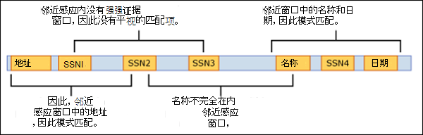

# <a name="learn-about-sensitive-information-types"></a>了解敏感信息类型

标识组织控制下的敏感项目并进行分类是信息保护规范 [的第一步](./information-protection.md)。  Microsoft 365提供了三种标识项目的方法，以便对这些项目进行分类：

- 用户手动执行
- 自动模式识别，如敏感信息类型
- [机器学习](classifier-learn-about.md)

SIT 分类 (类型) 基于模式的分类器。 它们检测敏感信息（如社会保险、信用卡或银行帐号）以标识敏感项目，请参阅敏感信息类型 [实体定义](sensitive-information-type-entity-definitions.md) ，了解所有 SIT 的完整列表。

Microsoft 提供大量预配置的 SI，或者你可以创建自己的 SI。

## <a name="sensitive-information-types-are-used-in"></a>敏感信息类型用于

- [数据丢失防护策略](dlp-learn-about-dlp.md)
- [敏感度标签](sensitivity-labels.md)
- [保留标签](retention.md)
- [内部风险管理](insider-risk-management.md)
- [通信合规性](communication-compliance.md)
- [内部风险管理](insider-risk-management-solution-overview.md)
- [自动标记策略](apply-sensitivity-label-automatically.md#how-to-configure-auto-labeling-for-office-apps)
- [Microsoft Priva](/privacy/priva)

## <a name="categories-of-sensitive-information-types"></a>敏感信息类型的类别

### <a name="built-in-sensitive-information-types"></a>内置敏感信息类型

默认情况下，Microsoft 创建的这些 SI 显示在合规性控制台中。 这些 SIT 无法编辑，但它们可以用作模板并复制以创建自定义敏感信息类型。

### <a name="named-entity-sensitive-information-types"></a>命名实体敏感信息类型

默认情况下，命名实体 SIT 还会显示在合规性控制台中。 检测人员姓名、物理地址以及医疗条款和条件。 无法编辑或复制它们。 有关详细信息， [请参阅了解 (实体) ](named-entities-learn.md#learn-about-named-entities-preview) 预览版。 命名实体 SIT 有两种类型：

**un-bundled**

这些命名实体 SIT 具有较窄的焦点，如单个国家/地区或单个类别术语。 当你需要检测范围更窄的 DLP 策略时，请使用它们。 请参阅命名 [实体 SIT 的示例](named-entities-learn.md#examples-of-named-entity-sits)。

**bundled**

捆绑命名实体 SIT 检测类中所有可能的匹配项，如所有物理地址。 将它们用作 DLP 策略中用于检测敏感项目的广泛标准。 请参阅命名 [实体 SIT 的示例](named-entities-learn.md#examples-of-named-entity-sits)。

### <a name="custom-sensitive-information-types"></a>自定义敏感信息类型

如果预配置的敏感信息类型不符合你的需求，你可以创建自己的完全定义的自定义敏感信息类型，也可以复制其中一个内置类型并进行修改。 有关详细信息 [，请参阅](create-a-custom-sensitive-information-type.md) 在合规中心创建自定义敏感信息类型。

### <a name="exact-data-match-sensitive-information-types"></a>准确数据匹配敏感信息类型

所有基于 EDM 的 SI 都是从头开始创建的。 您可以使用它们检测具有在敏感信息数据库中定义的准确值的项目。 有关详细信息 [，请参阅了解基于准确数据匹配的敏感信息](sit-learn-about-exact-data-match-based-sits.md#learn-about-exact-data-match-based-sensitive-information-types) 类型。

## <a name="fundamental-parts-of-a-sensitive-information-type"></a>敏感信息类型的基本部分

每个敏感信息类型实体由以下字段定义：

- name：敏感信息类型引用
- description：描述敏感信息类型正在查找的内容
- pattern：模式定义敏感信息类型检测到的信息。 它由以下组件组成。
    - Primary 元素 – 敏感信息类型要查找的主元素。 它可以是包含或 **不带** 校验和验证、关键字列表 **、关键字词典** 或函数的 **正则表达式**。
    - Supporting 元素 – 用作支持性证据的元素，有助于提高匹配可信度。 例如，与 SSN 号码接近的关键字"SSN"。 它可以是包含或不带校验和验证、关键字列表、关键字词典的正则表达式。
    - 可信度 - 高 (、中、低) 可信度反映与主要元素一起检测到的支持性证据量。 项目包含的支持性证据越充分，匹配项包含所查找敏感信息的置信度越高。
    - 邻近度 – 主要元素和支持元素之间的字符数。



在此视频中了解有关可信度级别更多信息


 > [!VIDEO https://www.microsoft.com/videoplayer/embed/RE4Hx60]  


### <a name="example-sensitive-information-type"></a>敏感信息类型示例


#### <a name="argentina-national-identity-dni-number"></a>阿根廷国家/ (DNI) 号码

### <a name="format"></a>格式

八个数字，用点分隔

### <a name="pattern"></a>模式

八个数字：
- 两个数字
- a period
- 三个数字
- a period
- 三个数字

### <a name="checksum"></a>校验和

否

### <a name="definition"></a>定义

DLP 策略在 300 个字符的邻近度内检测到这种类型的敏感信息，可信度中等：
- 正则表达式 Regex_argentina_national_id 找到与该模式匹配的内容。
- 找到 Keyword_argentina_national_id 中的一个关键字。

```xml
<!-- Argentina National Identity (DNI) Number -->
<Entity id="eefbb00e-8282-433c-8620-8f1da3bffdb2" recommendedConfidence="75" patternsProximity="300">
   <Pattern confidenceLevel="75">
      <IdMatch idRef="Regex_argentina_national_id"/>
      <Match idRef="Keyword_argentina_national_id"/>
  </Pattern>
</Entity>
```

### <a name="keywords"></a>关键字

#### <a name="keyword_argentina_national_id"></a>Keyword_argentina_national_id

- Argentina National Identity number 
- 标识 
- Identification National Identity Card 
- DNI 
- NIC National Registry of Persons 
- Documento Nacional de Identidad 
- Registro Nacional de las Personas 
- Identidad 
- Identificación 

### <a name="more-on-confidence-levels"></a>有关可信度的更多

在敏感信息类型实体定义中，可信度反映除了主要元素之外检测到的支持性证据的多少。 项目包含的支持性证据越充分，匹配项包含所查找敏感信息的置信度越高。 例如，高可信度的匹配将包含与主要元素接近的更多支持证据，而低可信度的匹配将几乎包含或不包含接近度的支持性证据。 

高可信度返回最小的误报，但可能会导致更多的误报。 低或中等可信度返回更多的误报，但漏报很少。

- **低** 可信度：匹配的项将包含最小的漏报，但包含最多的误报。 低可信度返回所有低、中和高可信度匹配。 低可信度的值为 65。
- **中等可信度**：匹配的项将包含误报和漏报的平均数量。 中置信度返回所有中高可信度匹配。 中等可信度的值为 75。
- **高** 可信度：匹配的项将包含最小的误报，但包含最多的漏报。 高可信度仅返回高可信度匹配，值为 85。  

你应该将高可信度模式与较低的计数（如 5 到 10）和低可信度模式（如 20 个或多个）一起用于较高的计数。

> [!NOTE]
> 如果你拥有现有的策略或自定义敏感信息类型 (SIT) 使用基于数字的可信度 (也知道其准确性) ，它们将自动映射到三个离散可信度;整个安全 @ 合规中心 UI 中的低可信度、中等可信度和高可信度。
> - 置信度在 76 和 100 之间的最低准确度或自定义 SIT 模式的所有策略都将映射到高可信度。 
> - 置信度在 66 和 75 之间的最低准确度或自定义 SIT 模式的所有策略都将映射到中等可信度。
> - 置信度低于或等于 65 的所有策略或自定义 SIT 模式都将映射到低可信度。 

## <a name="creating-custom-sensitive-information-types"></a>创建自定义敏感信息类型

您可以从多个选项中进行选择，以在合规中心创建自定义敏感信息类型。

- **使用 UI** - 可以使用合规性中心 UI 设置自定义敏感信息类型。 通过此方法，你可以使用正则表达式、关键字和关键字字典。 若要了解详细信息，请参阅[创建自定义敏感信息类型](create-a-custom-sensitive-information-type.md)。

- **使用 EDM** - 您可以使用精确数据匹配和基于 EDM 分类 (EDM) 敏感信息类型。 通过此方法，你可以使用可定期刷新的安全数据库创建动态敏感信息类型。 请参阅 [了解基于精确数据匹配的敏感信息类型](sit-learn-about-exact-data-match-based-sits.md#learn-about-exact-data-match-based-sensitive-information-types)。

- **使用 PowerShell** - 可以使用 PowerShell 设置自定义敏感信息类型。 尽管此方法比使用 UI 更复杂，但你可以拥有更多的配置选项。 请参阅[使用安全与合规中心 PowerShell 创建自定义敏感信息类型](create-a-custom-sensitive-information-type-in-scc-powershell.md)。

> [!NOTE]
> 改进的可信度可在 Microsoft 365 服务的数据丢失防护、Microsoft 信息保护 Microsoft 365 服务、通信合规性、信息管理和记录管理中立即使用。
> Microsoft 365信息保护现在支持双字节字符集语言：
> - 简体中文
> - 繁体中文
> - 韩语
> - 日语
> 
> 此支持适用于敏感信息类型。 有关详细信息 [，请参阅对双字节字符集发行说明](mip-dbcs-relnotes.md) 的信息保护支持。

> [!TIP]
> 若要检测含有中文/日文字符和单字节字符的模式，或检测含有中文/日文和英文的模式，则需要定义两个变体的关键词或词组。
> - 例如，若要检测像“机密的文件”这样的关键词，则要使用该关键词的两个变体; 一个是在日语和英语文本之间有空格，另一个是在日语和英语文本之间没有空格。 因此，在 SIT 中要添加的关键词应该是“机密的 文档”和“机密的文档”。 同样，若要检测短语 "東京オリンピック2020"，则应该使用两个变体;“東京オリンピック 2020”和“東京オリンピック2020”。
> 
> 除了中文/日语/双字节字符外，如果关键字/短语列表还包含非中文/日语单词 (如仅英语) ，则应该创建两个词典/关键字列表。 一个针对包含中文/日语/双字节字符的关键字，另一个针对仅含英语的关键字。 
> - 例如，如果要创建包含三个短语"Highly confidential"、"が高い"和"机密"的关键字词典/列表，应创建两个关键字列表。 
>     1. Highly confidential
>     2. “機密性が高い”、“机密的document”和“机密的 document”
> 
> 当使用双字节连字符或双字节句号创建 regex 时，请确保像在 regex 中转义连字符或句号一样转义这两个字符。以下是供参考的示例 regex：
>    - (?<!\d)([４][０-９]{3}[\-?\－\t]*[０-９]{4}
>
> 我们建议在关键字列表中使用字符串匹配而不是单词匹配。

## <a name="for-further-information"></a>有关详细信息
- [敏感信息类型属性定义](sensitive-information-type-entity-definitions.md)
- [创建自定义敏感信息类型](create-a-custom-sensitive-information-type.md)
- [在 PowerShell 中创建自定义敏感信息类型](create-a-custom-sensitive-information-type-in-scc-powershell.md)

若要了解如何使用敏感信息类型来遵守数据隐私法规，请参阅使用 Microsoft 365 (aka.ms/m365dataprivacy) 部署数据[隐私法规](../solutions/information-protection-deploy.md)的信息保护。

<!-- fwlink for this topic https://go.microsoft.com/fwlink/?linkid=2135644-->
