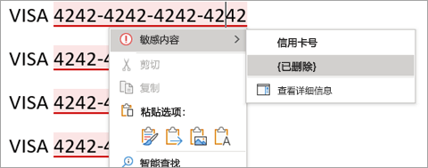

# 为什么选择 MIP 内置标记而非 Office 应用的 AIP 加载项

>*[Microsoft 365 安全性与合规性许可指南](/office365/servicedescriptions/microsoft-365-service-descriptions/microsoft-365-tenantlevel-services-licensing-guidance/microsoft-365-security-compliance-licensing-guidance)。*

当在 Windows 计算机上的 Microsoft 365 应用版中使用 [敏感度标签](sensitivity-labels.md) 时，可以选择使用内置于 Office 应用的标记，或 [Azure 信息保护(AIP)统一标记客户端](/azure/information-protection/rms-client/aip-clientv2) 中的加载项。 

由于内置标记技术跨平台(Windows、macOS、iOS、Android 和 Web)以及 Microsoft 应用和服务等进行扩展，因此此标记构成了 [Microsoft 信息保护(MIP)部署](information-protection-solution.md) 的基石。 内置标记还可用于其他 MIP 功能，例如数据分类和数据丢失防护(DLP)。

由于内置标签不使用 Office 加载项，因此它们受益于更高的稳定性和更好的性能。 它们还支持最新的 MIP 功能，例如高级分类器。

默认情况下，安装 AIP 客户端时，Office for Windows 应用中会禁用内置标记。 可以使用以下节中的说明更改此默认行为，[如何禁用 AIP 加载项以使用 Office 应用的内置标记](#how-to-disable-the-aip-add-in-to-use-built-in-labeling-for-office-apps)。

当在 Office 应用中保持 AIP 客户端安装但禁用时，AIP 客户端的其他功能仍然受到支持:

- 右击文件资源管理器中的选项，以便用户将标签应用于所有文件类型。

- 用于显示文本、图像或 PDF 文档的加密文件的查看器。

- PowerShell 模块发现本地文件中的敏感信息，然后应用或删除这些文件中的标签和加密

- 用于发现存储在本地数据存储中的敏感信息、然后根据需要标记该内容的扫描程序。

有关这些将标记扩展到 Office 应用之外的功能的详细信息，请参阅 AIP 文档中的 [Azure 信息保护统一标记客户端管理员指南](/azure/information-protection/rms-client/clientv2-admin-guide)。

可以独立于标记继续使用 [AIPService](/powershell/module/aipservice) PowerShell 模块，从而对加密服务进行租户级管理。 例如，需要删除数据恢复加密时配置超级用户访问，跟踪并撤销 AIP 客户端已打开的文档，并为脱机访问配置使用许可证有效期。 有关详细信息，请参阅 [使用 PowerShell 管理 Azure 信息保护的保护](/azure/information-protection/administer-powershell)。

## 确定是否使用 Office 应用的内置标记或 AIP 加载项

由于 AIP 客户端处于 [维护模式](https://techcommunity.microsoft.com/t5/security-compliance-and-identity/announcing-aip-unified-labeling-client-maintenance-mode-and/ba-p/3043613)，因此我们不建议使用 Office 应用的 AIP 加载项，原因如下:

- 不支持新的标记功能。
- 加载项不太稳定，因为它们可能会与其他加载项产生冲突，从而导致 Office 应用挂起、崩溃或自动禁用加载项。
- 作为加载项，它运行速度更慢，且用户可以禁用它来绕过标记要求。
- 任何 bug 修复都需要重新安装 Azure 信息保护客户端。
- 用户的标记体验与用户在其其他设备(macOS、iOS、Android)上以及使用 Office 网页版时具有的内置标签略有不同。 这种差异可能会增加培训和支持的成本。
- 已发布新的、[仅受内置标记支持](#features-supported-only-by-built-in-labeling-for-office-apps) 的 Office 标记功能，且会不断扩充该列表。

只有当已将 AIP 加载项部署到用户，且需要时间将其迁移到内置标记时，才使用 Windows Office 应用的 AIP 加载项。 或者，用户需要内置标记不支持的功能。 参考此页上的 [功能奇偶校验信息](#feature-parity-for-built-in-labeling-and-the-aip-add-in-for-office-apps) 以帮助识别这些功能。

## 仅受 Office 应用的内置标记支持的功能

> [!NOTE]
> 许多新的标记功能都在计划或开发中，因此预计本节中的列表会随时间的推移不断扩充。

一些功能仅受 Office 应用的内置标记支持，AIP 加载项将不支持。 具体包括：

- 对于自动和推荐的标记:
    - 访问智能分类服务，包括 [可训练分类器](classifier-learn-about.md)、[精确数据匹配(EDM)](sit-learn-about-exact-data-match-based-sits.md) 和 [命名实体](named-entities-learn.md)
    - 在用户键入时检测敏感信息
    - 在 Word 中，用户可以查看并删除识别到的的敏感内容
- 对于允许用户分配权限的标签，可以向用户或组授予不同的权限(读取或更改)
- 电子邮件的只加密
- 状态栏上标签的可见性
- 支持帐户切换
- 用户无法禁用标记

显示用户如何在 Word 中查看并选择性删除识别到的敏感内容的示例:

要在新标记功能可用于内置标记时了解最新情况，请参阅 [Microsoft 365 合规中心内的新增功能](whats-new.md) 和 **敏感度标签** 节。

## 如何禁用 AIP 加载项以使用 Office 应用的内置标记

当已安装 AIP 客户端以将标记扩展到 Office 应用之外，且想要阻止客户端的加载项在 Office 应用中加载时，请使用组策略设置 **托管加载项列表**，如 [因 Office 2013 和 Office 2016 程序的组策略设置未加载加载项](https://support.microsoft.com/help/2733070/no-add-ins-loaded-due-to-group-policy-settings-for-office-2013-and-off) 中所述。

对于支持内置标记的 Windows Office 应用，请使用 Microsoft Word 2016、Excel 2016、PowerPoint 2016 和 Outlook 2016 的配置，从而为 AIP 客户端指定以下编程标识符(ProgID)，并将选项设置为 **0: 始终禁用(阻止)加载项**

|应用程序  |编程标识符  |
|---------|---------|
|Word     |     `MSIP.WordAddin`    |
|Excel     |  `MSIP.ExcelAddin`       |
|PowerPoint     |   `MSIP.PowerPointAddin`      |
|Outlook | `MSIP.OutlookAddin` |
| | | 

通过使用组策略或 [Office 云策略服务](/DeployOffice/overview-office-cloud-policy-service)部署此设置。

> [!IMPORTANT]
> 如果使用组策略设置 **使用 Office 中的敏感度功能以应用并查看敏感度标签** 并将其设置为 **1**，则在一些情况下，AIP 加载项可能仍然会在 Office 应用中加载。阻止加载项在每个应用中加载可阻止这种情况发生。

或者，可以通过交互方式从 Word、Excel、PowerPoint 和 Outlook 禁用或删除“**Microsoft Azure 信息保护**”Office 加载项。 此方法适用于单台计算机和临时测试。 有关说明，请参阅 [Office 程序中查看、管理和安装加载项](https://support.office.com/article/16278816-1948-4028-91e5-76dca5380f8d)。

无论选择哪种方法，更改都将在 Office 应用重新启动时生效。

> [!NOTE]
> 内置标签需要 Office 应用的订阅版本。 如果你有 Office 的独立版本(有时称为“Office 永久版”)，则我们建议升级到 Microsoft 365 企业应用版，从而受益于 [最新的标记功能](sensitivity-labels-office-apps.md#support-for-sensitivity-label-capabilities-in-apps)。

请记住，当使用此方法禁用 AIP 加载项时，仍然可以使用 AIP 客户端将标记扩展到 Office 应用之外。

## Office 应用的内置标记和 AIP 加载项的功能奇偶校验

内置标记现在支持 AIP 加载项支持的多项标记功能。 有关功能、可能需要的最低版本和配置信息的更详细列表，请参阅 [管理 Office 应用中的敏感度标签](sensitivity-labels-office-apps.md)。

更多功能在计划和开发中。 如果你有感兴趣的特定功能，请查看 [Microsoft 365 路线图](https://aka.ms/MIPC/Roadmap) 并考虑加入 [Office 个人预览版中的 Microsoft 信息保护](https://aka.ms/MIP/PreviewRing)。

使用以下信息以帮助识别是否正在使用内置标记尚不支持的 AIP 加载项中的功能:

|AIP 加载项功能|内置标记 |
|:-------------------------------|:----------------:|
|**类别: 常规** ||
|中央报告和审核|  [了解详细信息](sensitivity-labels-office-apps.md#auditing-labeling-activities) |
|政府云||
|管理员可以禁用标记   - 所有应用|    [了解详细信息](sensitivity-labels-office-apps.md#office-built-in-labeling-client-and-other-labeling-solutions)|
|管理员可以禁用标记   - 每个应用|  计划或开发中|
|**类别: 用户体验** ||
|功能区上的标记按钮||
|对标签名称和工具提示的多语言支持|   [了解详细信息](create-sensitivity-labels.md#example-configuration-to-configure-a-sensitivity-label-for-different-languages) |
|标签颜色| 计划或开发中 |
|工具栏上标签的可见性| 计划或开发中 |
|**类别: 标记操作** ||
|手动标记 |    [了解详细信息](https://support.microsoft.com/office/apply-sensitivity-labels-to-your-files-and-email-in-office-2f96e7cd-d5a4-403b-8bd7-4cc636bae0f9) |
|强制标记 |   [了解详细信息](sensitivity-labels.md#what-label-policies-can-do)|
|默认标记   - 新项和现有项   - 电子邮件的单独设置|    [了解详细信息](sensitivity-labels.md#what-label-policies-can-do) |
|推荐或自动 |  [了解详细信息](apply-sensitivity-label-automatically.md#how-to-configure-auto-labeling-for-office-apps) |
|降级理由 |    [了解详细信息](sensitivity-labels.md#what-label-policies-can-do)|
| **类别: 视觉标记** | |
|页眉、页脚、水印|   [了解详细信息](sensitivity-labels.md#what-label-policies-can-do)|
|动态标记|   [了解详细信息](sensitivity-labels-office-apps.md#dynamic-markings-with-variables)|
|每个应用视觉标记|   [了解详细信息](sensitivity-labels-office-apps.md#setting-different-visual-markings-for-word-excel-powerpoint-and-outlook)|
| **类别: 加密** | |
|管理员定义的权限 |   [了解详细信息](encryption-sensitivity-labels.md#assign-permissions-now) |
|用户定义的权限   - 不转发 Outlook   - Word、Excel、PowerPoint 的用户和组自定义权限|   [了解详细信息](encryption-sensitivity-labels.md#let-users-assign-permissions)|
|用户定义的权限   - 指定 Word、Excel 和 PowerPoint 的域，从而实现组织范围内的自定义权限 | 计划或开发中 |
|共同创作和自动保存 |   [了解详细信息](sensitivity-labels-coauthoring.md) |
|双密钥加密 | 计划或开发中 |
|用户的文档吊销 | 审阅中 |
| | |

### 支持 PowerShell 高级设置

AIP 客户端使用 [PowerShell 高级设置](/azure/information-protection/rms-client/clientv2-admin-guide-customizations#configuring-advanced-settings-for-the-client-via-powershell) 以支持多种自定义效果。 内置标记住现在支持其中一些高级设置，如 [New-Label](/powershell/module/exchange/new-label) 或 [Set-Label](/powershell/module/exchange/set-label) 和 [New-LabelPolicy](/powershell/module/exchange/new-labelpolicy) 或 [Set-LabelPolicy](/powershell/module/exchange/set-labelpolicy) 中所述。

但是，你可能会发现无需使用 PowerShell 配置受支持的设置，因为它们包含在 Microsoft 365 合规中心的标准配置中。 例如，可以禁用 Outlook 的强制标记并设置其他默认标签。

内置标记尚不支持 AIP 加载项中的以下配置:

- [电子邮件附件的标签继承](/azure/information-protection/rms-client/clientv2-admin-guide-customizations#for-email-messages-with-attachments-apply-a-label-that-matches-the-highest-classification-of-those-attachments)
- [S/MIME for Outlook](/azure/information-protection/rms-client/clientv2-admin-guide-customizations#configure-a-label-to-apply-smime-protection-in-outlook)
- [Outlook 过度共享的弹出消息](/azure/information-protection/rms-client/clientv2-admin-guide-customizations#implement-pop-up-messages-in-outlook-that-warn-justify-or-block-emails-being-sent)
- [父标签的默认子标签](/azure/information-protection/rms-client/clientv2-admin-guide-customizations#specify-a-default-sublabel-for-a-parent-label)
- [删除外部内容标记](/azure/information-protection/rms-client/clientv2-admin-guide-customizations#remove-headers-and-footers-from-other-labeling-solution )

## Office 应用的内置标记未计划支持的功能

虽然会不断添加内置标记的新功能，但 AIP Office 加载项支持以下功能，这些功能未计划在未来版本中可用于内置标记:

- 将标签应用于 Microsoft Office 97-2003 格式，例如 .doc 文件
- 永久断开连接的计算机
- Office 的独立版本(有时称为“Office 永久版”)，而非基于订阅的版本

## 后续步骤

有关创建并配置这些标记功能的说明，请参阅 [创建并配置敏感度标签及其策略](create-sensitivity-labels.md)。

> [!TIP]
> 如果已在 Microsoft 365 合规中心内具有敏感度标签，则没有资格自动创建默认标签。 但是，你可能仍然会发现引用其配置: [默认敏感度标签](mip-easy-trials.md#default-sensitivity-labels) 非常有用。 
