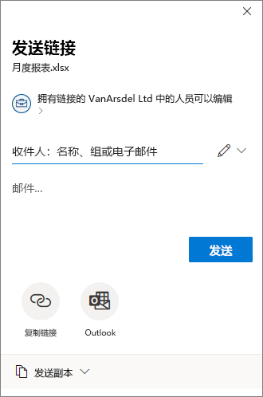

# <a name="use-sensitivity-labels-to-configure-the-default-sharing-link-type-for-sites-and-documents-in-sharepoint-and-onedrive"></a>使用敏感度标签以为 SharePoint 和 OneDrive 中的网站和文档配置默认共享链接类型

>*[Microsoft 365 安全性与合规性许可指南](/office365/servicedescriptions/microsoft-365-service-descriptions/microsoft-365-tenantlevel-services-licensing-guidance/microsoft-365-security-compliance-licensing-guidance)。*

作为 Microsoft 365 合规中心内显示的 [敏感度标签](sensitivity-labels.md) 设置的附加配置，可以使用这些标签以为 SharePoint 网站或 OneDrive 帐户以及单个文档配置默认共享链接类型的设置。 系统会自动选择这些设置，但当用户在其 Office 应用中选择“**共享**”按钮时，这些设置不对其高度可见。 例如：



默认共享链接类型会设置用户共享文件和文件夹时自动选择的范围(人员)和权限(查看或编辑)。 虽然用户始终可以在发送共享链接之前替换这些默认设置，但你选择的设置可提供安全基线。 通常，用户在共享之前不会更改设置。

在网站级别(SharePoint 网站或 OneDrive 帐户)上，敏感度标签提供了一种便捷的可选方法，用于设置可在 SharePoint 管理中心内为网站配置的默认共享链接类型。 有关详细信息，请参阅 SharePoint 文档中的 [更改网站的默认链接类型](/sharepoint/change-default-sharing-link)。

此网站级配置适用于具有相同敏感度级别的文档的 SharePoint 网站。 但是，如果网站包含一些敏感度级别更高、需要限制性更强的设置的文档，则可以为默认共享链接类型配置具有不同设置的敏感度标签，然后将此标签应用于文档。

在此场景中，网站具有默认共享链接类型设置，且该网站中的文档具有不同的默认链接类型设置。在用户选择文档的共享选项时，将应用限制性更强的范围设置。 例如：

- 网站的默认共享链接类型范围限于组织中的任何人员。 该网站中的文档标记为默认共享链接类型设置为特定人员。 当用户共享该文档时，选定的默认共享链接类型范围将限于特定人员。

- 网站的默认共享链接类型范围限于具有编辑权限的特定人员。 该网站中的文档标记为默认共享链接类型设置为组织中具有查看权限的任何人员。 当用户共享该文档时，选定的默认共享链接类型范围将限于具有编辑权限的特定人员。

在无网站级设置的情况下，配置文档的默认链接类型可能也适用。 例如，虽然 SharePoint 网站通常组织为托管相同类型的文档，但 OneDrive 帐户的情况并非如此。 用户通常将各种文件保存到 OneDrive，其中通常混合了个人文档和业务文档。 为用户的 OneDrive 帐户的所有文档设置默认链接类型可能不切实际，但单个文档仍然可以受益于这些设置。 例如：

- 标记为 **高度机密** 的文档的默认共享链接类型将共享限制为组织中的特定人员而非任何人员。
- 标记为 **常规** 的文档的默认共享链接类型将共享限制为组织中的人员。
- 标记为 **个人** 的文档的默认共享链接类型允许与具有链接的任何人员共享。

## <a name="prerequisites"></a>先决条件

要为网站应用默认共享链接类型，必须为容器启用敏感度标签。 如果尚未为租户启用此功能，请参阅 [如何为容器启用敏感度标签以及如何同步标签](sensitivity-labels-teams-groups-sites.md#how-to-enable-sensitivity-labels-for-containers-and-synchronize-labels)。

要为 SharePoint 和 OneDrive 中的文档应用默认共享链接类型，必须为这些服务启用敏感度标签。 如果尚未为租户启用此功能，请参阅 [如何为 SharePoint 和 OneDrive 启用敏感度标签(选择加入)](sensitivity-labels-sharepoint-onedrive-files.md#how-to-enable-sensitivity-labels-for-sharepoint-and-onedrive-opt-in)。

在 PowerShell 会话中，必须 [连接到 Office 365 安全与合规中心 PowerShell](/powershell/exchange/office-365-scc/connect-to-scc-powershell/connect-to-scc-powershell) 才可配置默认共享链接类型的设置。

> [!NOTE]
> 虽然非必需项，但最简单的方法是先 [在 Microsoft 365 合规中心内创建并配置敏感度标签](create-sensitivity-labels.md)，然后使用配置默认共享链接类型的设置修改这些标签。

## <a name="how-to-configure-settings-for-the-default-sharing-link-type"></a>如何配置默认共享链接类型的设置

默认共享链接类型的配置设置将 PowerShell *AdvancedSettings* 参数与 [安全与合规中心 PowerShell](/powershell/exchange/scc-powershell) 中的 [Set-Label](/powershell/module/exchange/set-label) 和 [New-Label](/powershell/module/exchange/new-labelpolicy) cmdlet 结合使用:

- **DefaultSharingScope**：可用值为：
    - **SpecificPeople**：将此网站的默认共享链接设置为“特定人员”链接
    - **Organization**：将此网站的默认共享链接设置为“组织”链接或公司的可共享链接
    - **Anyone**：将此网站的默认共享链接设置为“匿名访问”或“任何人”链接

- **DefaultShareLinkPermission**:  可用值为：
    - **View**：将网站的默认链接权限设置为“查看”权限。
    - **Edit**：将网站的默认链接权限设置为“编辑”权限

这两个设置和值等效于来自 [Set-SPOSite](/powershell/module/sharepoint-online/set-sposite) cmdlet 的 *DefaultSharingScope* 和 *DefaultShareLinkPermission* 参数。

PowerShell 示例，其中敏感度标签 GUID 为 **8faca7b8-8d20-48a3-8ea2-0f96310a848e**：

- 要将默认共享链接类型设置为 SpecificPeople:
    
    ````powershell
    Set-Label -Identity 8faca7b8-8d20-48a3-8ea2-0f96310a848e -AdvancedSettings @{DefaultSharingScope="SpecificPeople"}
    ````

- 要将默认共享链接类型权限设置为“编辑”:
    
    ````powershell
    Set-Label -Identity 8faca7b8-8d20-48a3-8ea2-0f96310a848e -AdvancedSettings @{DefaultShareLinkPermission="Edit"}
    ````

要配置网站的默认共享链接类型的设置，则当在 Microsoft 365 合规中心内创建敏感度标签时，[敏感度标签的范围](sensitivity-labels.md#label-scopes) 必须包含 **组和网站**。 创建后，你会在 **标签** 页面的 **范围** 列中看到此显示为 **网站、UnifiedGroup**，且 PowerShell *ContentType* 设置也会显示此相同值。 对于文档，范围必须包含 **文件和电子邮件** (显示为 **文件、电子邮件**)。 则：

- 当范围包含 **组和网站** 时，可以将标签应用于网站，从而设置该网站的默认共享链接类型。 有关如何将敏感度标签应用于网站的信息，请参阅 [如何将敏感度标签应用于容器](sensitivity-labels-teams-groups-sites.md#how-to-apply-sensitivity-labels-to-containers)。

- 当敏感度标签的范围包含 **文件和电子邮件** 时，可以将标签应用于文档，从而设置该文档的默认共享链接类型。 可以 [手动](https://support.microsoft.com/office/apply-sensitivity-labels-to-your-files-and-email-in-office-2f96e7cd-d5a4-403b-8bd7-4cc636bae0f9) 或 [自动](apply-sensitivity-label-automatically.md) 应用标签。

> [!TIP]
> 还可以将标签指定为要应用于新网站或新文档的默认敏感度标签，作为 [标签策略设置](sensitivity-labels.md#what-label-policies-can-do)。

### <a name="powershell-tips-for-specifying-the-advanced-settings"></a>指定高级设置的 PowerShell 提示

虽然可以按其名称指定敏感度标签，但我们建议使用标签 GUID 以避免在指定标签名称或显示名称时可能产生混淆。要查找 GUID 并确认标签的范围:

````powershell
Get-Label | Format-Table -Property DisplayName, Name, Guid, ContentType
````

要删除敏感度标签中的任意一项高级设置，请使用相同的 AdvancedSettings 参数语法，同时指定一个空字符串值。例如：

````powershell
Set-Label -Identity 8faca7b8-8d20-48a3-8ea2-0f96310a848e -AdvancedSettings @{DefaultSharingScope=""}
````

