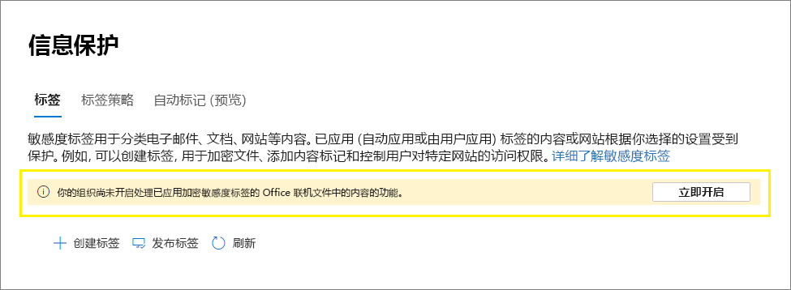

# <a name="enable-sensitivity-labels-for-office-files-in-sharepoint-and-onedrive"></a>启用 SharePoint 和 OneDrive 中 Office 文件的敏感度标签

>*[Microsoft 365 安全性与合规性许可指南](/office365/servicedescriptions/microsoft-365-service-descriptions/microsoft-365-tenantlevel-services-licensing-guidance/microsoft-365-security-compliance-licensing-guidance)。*

为 Office 和 SharePoint [](sensitivity-labels-office-apps.md#office-file-types-supported) OneDrive中受支持的敏感度文件启用内置标签，以便用户可以在 Office 网页版 中应用敏感度Office 网页版。 [](sensitivity-labels.md) 启用此功能后，用户将看到功能区上的"敏感度"按钮，以便他们可以应用标签，并查看状态栏上应用的任何标签名称。

启用此功能还SharePoint OneDrive处理已使用敏感度标签加密的 Office 文件的内容。 标签可应用于Office 网页版桌面Office，并上传或保存SharePoint OneDrive。 在启用此功能之前，这些服务无法处理加密文件，这意味着共同授权、电子数据展示、数据丢失防护、搜索和其他协作功能对这些文件不起作用。

为 SharePoint 和 OneDrive 中的 Office 文件启用敏感度标签后，对于敏感度标签为新的和已更改的文件（使用基于云的密钥 (应用加密，并且不使用双密钥加密) ： [](double-key-encryption.md)

- 对于 Word、Excel 和 PowerPoint 文件，SharePoint 和 OneDrive 可识别标签，现在可以处理加密文件的内容。

- 当用户从 SharePoint 或 OneDrive 下载或访问这些文件时，将强制执行敏感度标签和标签中任何加密设置，并保留该文件，无论文件存储在何处。 确保提供用户指南，以便仅使用标签来保护文档。 有关详细信息，请参阅信息 [权限管理 (IRM) 和敏感度标签](sensitivity-labels-office-apps.md#information-rights-management-irm-options-and-sensitivity-labels)。

- 当用户将已标记和加密的文件上传到SharePoint或OneDrive时，他们必须至少具有对这些文件的查看权限。 例如，他们可以打开文件外部SharePoint。 如果没有此最低使用权限，则上传成功，但服务无法识别标签，无法处理文件内容。

- 使用 Office 网页版 (、Excel、PowerPoint) ，打开和编辑Office敏感度标签应用加密的文件。 强制执行通过加密分配的权限。 还可以为 [这些文档使用自动](apply-sensitivity-label-automatically.md) 标记。

- 外部用户可以使用来宾帐户访问标记为加密的文档。 有关详细信息，请参阅 [支持外部用户和标记的内容](sensitivity-labels-office-apps.md#support-for-external-users-and-labeled-content)。

- Office 365电子数据展示支持对这些文件进行全文搜索，而数据丢失防护 (DLP) 支持这些文件中的内容。

> [!NOTE]
> 如果已对本地密钥 (密钥管理拓扑（通常称为"保留您自己的密钥"或 HYOK) ，或者通过使用 [双](double-key-encryption.md)密钥加密）应用加密，则用于处理文件内容的服务行为不会更改。 因此，对于这些文件，共同授权、电子数据展示、数据丢失防护、搜索和其他协作功能将不起作用。
>
> 对于SharePoint Azure OneDrive密钥进行加密标记的位置中的现有文件，OneDrive和加密行为不会更改。 若要在 SharePoint 和 OneDrive 中为 Office 文件启用敏感度标签后从新功能中获益，必须再次下载并上载这些文件，或对其进行编辑。

为 SharePoint 和 OneDrive 中的 Office 文件启用敏感度标签后，可以使用三个新的审核事件来[](search-the-audit-log-in-security-and-compliance.md#sensitivity-label-activities)监视应用于 SharePoint 和 OneDrive 中的文档的敏感度标签：

- **已向文件应用敏感度标签**
- **已更改应用于文件的敏感度标签**
- **已从文件除敏感度标签**

观看以下视频 (音频) 了解新功能的操作：

> [!VIDEO https://www.microsoft.com/videoplayer/embed//RE4ornZ]

你始终可以选择禁用 Office 中的SharePoint敏感度标签OneDrive ([选择](#how-to-disable-sensitivity-labels-for-sharepoint-and-onedrive-opt-out)) 选择退出。

如果您当前使用 SharePoint 信息权限管理 (IRM) 保护 SharePoint 中的文档，请务必选中此页上的 SharePoint 信息权限管理[ (IRM) ](#sharepoint-information-rights-management-irm-and-sensitivity-labels)和敏感度标签部分。

## <a name="requirements"></a>要求

这些新功能仅适用于 [敏感度](sensitivity-labels.md) 标签。 如果当前具有 Azure 信息保护标签，请首先将其迁移到敏感度标签，以便你可以为上传的新文件启用这些功能。 有关说明，请参阅 [Azure 信息保护标签迁移到统一敏感度标签](/azure/information-protection/configure-policy-migrate-labels)。

使用 Windows 上的 OneDrive 同步 应用版本 19.002.0121.0008 或更高版本，以及 Mac 上的版本 19.002.0107.0008 或更高版本。 这两个版本均于 2019 年 1 月 28 日发布，当前已发布至所有圈。 有关详细信息，请参阅OneDrive[发行说明](https://support.office.com/article/845dcf18-f921-435e-bf28-4e24b95e5fc0)。 为 Office 和 SharePoint OneDrive 中的文件启用敏感度标签后，将提示运行较旧版本的同步应用的用户进行更新。

## <a name="limitations"></a>限制

- SharePoint 和 OneDrive 无法处理从 Office 桌面应用标记和加密的某些文件，当这些文件包含 PowerQuery 数据、自定义外接程序存储的数据或自定义 XML 部件（如封面属性、内容类型架构、自定义文档信息面板和自定义 XSN）时。 此限制也适用于在上载时 [添加了文档 ID](https://support.microsoft.com/office/enable-and-configure-unique-document-ids-ea7fee86-bd6f-4cc8-9365-8086e794c984) 的文件。

    对于这些文件，应用标签而不加密，以便稍后可以在Office web 版中打开，或指示用户打开其桌面应用中的文件。 仅在安全文件中标记和加密Office web 版不受影响。

- SharePoint和OneDrive不会自动将敏感度标签应用于已使用 Azure 信息保护标签加密的现有文件。 相反，为了让这些功能在启用 Office 和 SharePoint OneDrive 敏感度标签后，请完成以下任务：

    1. 确保你已[将 Azure 信息](/azure/information-protection/configure-policy-migrate-labels)保护标签迁移到敏感度标签，并[发布](create-sensitivity-labels.md#publish-sensitivity-labels-by-creating-a-label-policy)它们Microsoft 365 合规中心。
    2. 下载带标签的文件，然后将它们上传到原始位置，SharePoint或OneDrive。

- SharePoint OneDrive应用加密的标签具有以下任何加密配置时，无法处理[加密文件](encryption-sensitivity-labels.md#configure-encryption-settings)：
  - **允许用户在应用标签权限** Word、PowerPoint 和 Excel **复选框时分配权限，提示用户** 权限。 此设置有时称为"用户定义权限"。
  - **将内容的访问权限设置为** 一个值，则对内容 **从不**。
  - **选择了双** 加密技术。

    对于具有这些加密配置中的任一配置的标签，这些标签不会向用户Office 网页版。 此外，新功能不能用于已具有这些加密设置的已标记文档。 例如，这些文档不会在搜索结果中返回，即使它们已更新。

- 出于性能原因，当您将文档上载或保存到 SharePoint且文件标签不应用加密时，文档库中的"敏感度"列可能需要一段时间才能显示标签名称。 如果你使用依赖于此列中的标签名称的脚本或自动化，则此延迟的因素。

- 如果在 SharePoint 中签出文档时已标记[](https://support.microsoft.com/office/check-out-check-in-or-discard-changes-to-files-in-a-library-7e2c12a9-a874-4393-9511-1378a700f6de)文档，则文档库中的"敏感度"列将不会显示标签名称，直到签入文档，然后下次在 SharePoint 中打开。

- 如果已标记和加密的文档由使用服务主体名称的应用或服务从 SharePoint 或 OneDrive 下载，然后使用应用不同加密设置的标签再次上载，则上载将失败。 示例方案是 Microsoft Defender 云应用将文件上的敏感度标签从 **"** 机密"更改为"高度机密"，或从 **"机密"** 更改为 **"常规"。**
    
    如果应用或服务首先运行 [Unlock-SPOSensitivityLabelEncryptedFile](/powershell/module/sharepoint-online/unlock-sposensitivitylabelencryptedFile) cmdlet，上传不会失败，如删除已标记文档的加密部分 [所述](#remove-encryption-for-a-labeled-document) 。 或者，在上载之前，将删除原始文件，或者更改文件名。

- 在下列"另存为"方案中，用户打开加密文档可能会遇到延迟：使用 Office 桌面版时，用户为具有应用加密的敏感度标签的文档选择"另存为"。 用户选择SharePoint或OneDrive位置，然后立即尝试在 Office 网页版 中打开该文档。 如果服务仍在处理加密，用户将看到一条消息，指出必须在其桌面应用中打开文档。 如果几分钟后重试，文档将在打开后Office 网页版。

- 对于加密文档，不支持在加密Office 网页版。

- 对于加密的文档Office 网页版，不会阻止复制到剪贴板和屏幕捕获。 有关详细信息，请参阅权限 [管理能否阻止屏幕捕获？](/azure/information-protection/faqs-rms#can-rights-management-prevent-screen-captures)

- 默认情况下，Office应用和移动应用不支持对标记为加密的文件进行共同创作。 这些应用将继续以独占编辑模式打开已标记和加密的文件。
    
    > [!NOTE]
    > 现在，Windows和 macOS 支持共同创作。 有关详细信息，请参阅为使用敏感度 [标签加密的文件启用共同创作](sensitivity-labels-coauthoring.md)。

- 如果管理员更改已应用于下载到用户同步客户端的文件的已发布标签的设置，用户可能无法将更改保存到其 OneDrive Sync 文件夹中。 此方案适用于使用加密标记的文件，以及标签从未对应用加密的标签应用加密的标签更改时。 用户看到一 [个红色圆圈，显示白色十字](https://support.office.com/article/what-do-the-onedrive-icons-mean-11143026-8000-44f8-aaa9-67c985aa49b3)形图标错误，并要求他们将新更改另存为单独的副本。 相反，他们可以关闭并重新打开该文件，或使用Office 网页版。

- 用户在脱机或进入睡眠模式后可能会遇到保存问题，而不是使用 Office 网页版，而是使用 Word、Excel 或 PowerPoint。 对于这些用户，当他们恢复Office 应用会话并尝试保存更改时，他们会看到上载失败消息，其中包括保存副本而不是保存原始文件的选项。

- 无法以下列方式加密的文档在Office 网页版：
  - 使用本地密钥的加密 ("保留自己的密钥"或 HYOK) 
  - 使用双密钥加密 [应用的加密](double-key-encryption.md)
  - 独立于标签应用的加密，例如，通过直接应用权限管理保护模板。

- 不支持为其他 [语言配置](create-sensitivity-labels.md#additional-label-settings-with-security--compliance-center-powershell) 的标签，并且仅显示原始语言。

- 如果删除已应用于 SharePoint 或 OneDrive 中的文档的标签，而不是从适用的标签策略中删除标签，则下载时的文档将不会进行标记或加密。 相比之下，如果标记的文档存储在文档SharePoint外部OneDrive，则删除标签后，文档将保持加密。 请注意，尽管你可能会在测试阶段删除标签，但很少在生产环境中删除标签。

## <a name="how-to-enable-sensitivity-labels-for-sharepoint-and-onedrive-opt-in"></a>如何为选择加入SharePoint OneDrive (启用敏感度) 

可以通过使用 Microsoft 365 合规中心 或 PowerShell 来启用新功能。 与更改和更改的所有租户SharePoint OneDrive，更改需要大约 15 分钟才能生效。

### <a name="use-the-compliance-center-to-enable-support-for-sensitivity-labels"></a>使用合规中心启用敏感度标签支持

此选项是启用 SharePoint 和 OneDrive 敏感度标签的最简单方法，但你必须以租户的全局管理员登录。

1. 以全局管理员 [Microsoft 365 合规中心](https://compliance.microsoft.com/)登录网站，并导航 **到"解决方案**""  >  **信息保护"**

    如果看不到此选项，请先选择“**全部显示**”。

2. 如果看到一条消息，提示你启用处理联机Office内容功能，请选择"**现在启用"：**

    

    命令会立即运行，下次刷新页面时，将不会再看到消息或按钮。

> [!NOTE]
> 如果已Microsoft 365地理位置，则必须使用 PowerShell 为所有地理位置启用这些功能。 有关详细信息，请参阅下一节。

### <a name="use-powershell-to-enable-support-for-sensitivity-labels"></a>使用 PowerShell 启用敏感度标签支持

除了使用合规中心外，您还可以使用来自 SharePoint PowerShell 的[Set-SPOTenant](/powershell/module/sharepoint-online/set-spotenant) cmdlet 启用对敏感度标签的支持。

如果已Microsoft 365地理位置，则必须使用 PowerShell 为所有地理位置启用此支持。

#### <a name="prepare-the-sharepoint-online-management-shell"></a>准备 SharePoint Online 命令行管理程序

在运行 PowerShell 命令为 SharePoint 和 OneDrive 中的 Office 文件启用敏感度标签之前，请确保运行的是 SharePoint Online 命令行管理程序版本 16.0.19418.12000 或更高版本。 如果已有最新版本，可以跳到下一过程 [以](#run-the-powershell-command-to-enable-support-for-sensitivity-labels) 运行 PowerShell 命令。

1. 如果已从 PowerShell 库安装早期版本的 SharePoint Online 命令行管理程序，可通过运行以下 cmdlet 来更新模块。

    ```PowerShell
    Update-Module -Name Microsoft.Online.SharePoint.PowerShell
    ```

2. 或者，如果从 Microsoft 下载中心安装了以前版本的 SharePoint Online 命令行管理程序，还可以转到添加或删除程序，并卸载SharePoint Online 命令行管理程序。

3. 在 Web 浏览器中，转到“下载中心”页面，[下载最新的 SharePoint Online 命令行管理程序](https://go.microsoft.com/fwlink/p/?LinkId=255251)。

4. 选择语言，然后单击“**下载**”。

5. 在 x64 和 x86.msi 文件之间进行选择。 如果运行 64 位版本的 Windows，请下载 x64 文件;如果运行 32 位版本，则下载 x86 文件。 如果你不知道，请参阅我Windows[哪个版本的操作系统？](https://support.microsoft.com/help/13443/windows-which-operating-system)

6. 下载文件后，运行该文件并按照安装向导中的步骤操作。

#### <a name="run-the-powershell-command-to-enable-support-for-sensitivity-labels"></a>运行 PowerShell 命令以支持敏感度标签

若要启用新功能，请使用带 *EnableAIPIntegration* 参数的 [Set-SPOTenant](/powershell/module/sharepoint-online/set-spotenant) cmdlet：

1. 使用工作或学校帐户（具有全局管理员或 SharePoint管理员权限Microsoft 365，连接到SharePoint。 若要了解具体操作步骤，请参阅 [SharePoint 在线管理壳入门](/powershell/sharepoint/sharepoint-online/connect-sharepoint-online)。

    > [!NOTE]
    > 如果已Microsoft 365地理位置，请对[连接-SPOService](/powershell/module/sharepoint-online/connect-sposervice)使用 -Url 参数，并指定其中一个地理位置的 SharePoint Online 管理中心网站 URL。

2. 运行以下命令并按 **Y** 确认：

    ```PowerShell
    Set-SPOTenant -EnableAIPIntegration $true
    ```
3. For Microsoft 365 Multi-Geo： Repeat steps 1 and 2 for each of your remaining geo-locations.

## <a name="publishing-and-changing-sensitivity-labels"></a>发布和更改敏感度标签

在将敏感度标签与 SharePoint 和 OneDrive 一同使用时，请记住，在发布新的敏感度标签或更新现有敏感度标签时，需要留出复制时间。 这对应用加密的新标签尤为重要。

例如：创建并发布应用加密的新敏感度标签，它很快就会显示在用户的桌面应用中。 用户将此标签应用于文档，然后将它上载到SharePoint或OneDrive。 如果尚未为服务完成标签复制，则上载时不会将新功能应用于该文档。 因此，不会在搜索或电子数据展示中返回文档，并且文档无法通过 Office 网页版。

以下更改在一小时内复制：新的和已删除的敏感度标签，以及包含策略中哪些标签的敏感度标签策略设置。

以下更改在 24 小时内复制：更改现有标签的敏感度标签设置。

由于新敏感度标签的复制延迟仅为 1 小时，因此您不太可能遇到示例中的方案。 但作为一项安全措施，我们建议首先向几个测试用户发布新标签，等待一小时，然后验证 SharePoint 和 OneDrive。 作为最后一步，通过向现有标签策略添加更多用户或将标签添加到标准用户的现有标签策略，使标签可供更多用户使用。 当标准用户看到标签时，它已同步到SharePoint OneDrive。

## <a name="sharepoint-information-rights-management-irm-and-sensitivity-labels"></a>SharePoint信息权限管理 (IRM) 和敏感度标签

[SharePoint信息](set-up-irm-in-sp-admin-center.md)权限管理 (IRM) 是一项较旧的技术，用于通过下载文件时应用加密和限制来保护列表和库级别的文件。 此较旧的保护技术旨在防止未经授权的用户在文件位于外部时打开SharePoint。

相比之下，除了加密外，敏感度标签 (页眉、页脚、水印) 保护设置。 加密设置支持完整的使用权限范围，[](/azure/information-protection/configure-usage-rights)以限制用户可以对内容执行哪些操作，并且许多方案都支持相同的[敏感度标签](get-started-with-sensitivity-labels.md#common-scenarios-for-sensitivity-labels)。 在工作负载和应用之间使用相同的保护方法以及一致的设置，可产生一致的保护策略。

但是，你可以同时使用这两种保护解决方案，其行为如下所示：

- 如果上传的文件带有应用加密的敏感度标签，SharePoint 将不能处理这些文件的内容，因此这些文件不支持共同授权、电子数据展示、DLP 和搜索。

- 如果使用密码对文件Office 网页版，将强制执行该标签的任何加密设置。 对于这些文件，支持共同授权、电子数据展示、DLP 和搜索。

- 如果下载使用 Office 网页版 标记的文件，将保留该标签，并强制执行标签中任何加密设置，而不是 IRM 限制设置。

- 如果您下载Office敏感度标签加密的 IRM 或 PDF 文件，则应用 IRM 设置。

- 如果启用了任何其他 IRM 库设置（包括阻止用户上载不支持 IRM 的文档），则强制执行这些设置。

通过此行为，你可以确保所有 Office 和 PDF 文件在下载时都受到保护，以防止其未经授权的访问，即使它们未标记。 但是，已上传的标记文件不会从新功能中获益。


## <a name="search-for-documents-by-sensitivity-label"></a>按敏感度标签搜索文档

使用托管属性 **InformationProtectionLabelId** 可查找SharePoint或OneDrive特定敏感度标签的所有文档。 使用以下语法： `InformationProtectionLabelId:<GUID>`

例如，若要搜索所有已标记为"机密"的文档，并且该标签的 GUID 为"8faca7b8-8d20-48a3-8ea2-0f96310a848e"，在搜索框中键入：

```
InformationProtectionLabelId:8faca7b8-8d20-48a3-8ea2-0f96310a848e
```

搜索不会在压缩文件中查找标记的文档，例如.zip文件。

若要获取敏感度标签的 GUID，请使用 [Get-Label](/powershell/module/exchange/get-label) cmdlet：

1. 首先，[连接到 Office 365 安全与合规中心 PowerShell](/powershell/exchange/office-365-scc/connect-to-scc-powershell/connect-to-scc-powershell)。

    例如，在以管理员身份运行的 PowerShell 会话中，使用全局管理员帐户登录。

2. 然后运行以下命令：

    ```powershell
    Get-Label |ft Name, Guid
    ```

有关使用托管属性的信息，请参阅管理托管[属性中的搜索SharePoint。](/sharepoint/manage-search-schema)

## <a name="remove-encryption-for-a-labeled-document"></a>删除已标记文档的加密

在极少数情况下，SharePoint管理员需要从文档存储的文档中删除加密SharePoint。 对于该文档，拥有"[](/azure/information-protection/configure-usage-rights#usage-rights-and-descriptions)导出"或"完全控制"权限的任何用户都可以从 Azure 信息保护中删除 Azure 权限管理服务应用的加密。 例如，具有上述任一使用权限的用户都可以将应用加密的标签替换为不加密的标签。 超级 [用户](/azure/information-protection/configure-super-users) 还可以在不加密的情况下下载文件并保存本地副本。

作为替代方法，全局管理员或SharePoint可以[](/sharepoint/sharepoint-admin-role)运行[Unlock-SPOSensitivityLabelEncryptedFile](/powershell/module/sharepoint-online/unlock-sposensitivitylabelencryptedFile) cmdlet，这将同时删除敏感度标签和加密。 即使管理员无权访问站点或文件，或者 Azure 权限管理服务不可用，此 cmdlet 也运行。

例如：

```powershell
Unlock-SPOSensitivityLabelEncryptedFile -FileUrl "https://contoso.com/sites/Marketing/Shared Documents/Doc1.docx" -JustificationText "Need to decrypt this file"
```

要求：

- SharePoint Online 命令行管理程序版本 16.0.20616.12000 或更高版本。

- 已使用管理员定义的加密设置的敏感度标签应用了加密 ("现在分配 [权限"标签](encryption-sensitivity-labels.md#assign-permissions-now) 设置) 。 [此](encryption-sensitivity-labels.md#double-key-encryption) cmdlet 不支持双密钥加密。

理由文本将添加到从文件中删除[](search-the-audit-log-in-security-and-compliance.md#sensitivity-label-activities)敏感度标签的审核事件，解密操作也会记录在 Azure 信息保护 的保护使用率[日志记录中](/azure/information-protection/log-analyze-usage)。

## <a name="how-to-disable-sensitivity-labels-for-sharepoint-and-onedrive-opt-out"></a>如何为用户禁用敏感度标签SharePoint OneDrive (选择退出) 

如果禁用这些新功能，在启用 SharePoint 和 OneDrive 敏感度标签后上传的文件将继续受标签保护，因为标签设置会继续强制执行。 当你在禁用这些新功能后将敏感度标签应用于新文件时，全文搜索、电子数据展示和共同授权将不再有效。

若要禁用这些新功能，必须使用 PowerShell。 使用 SharePoint命令行管理程序和 [Set-SPOTenant](/powershell/module/sharepoint-online/set-spotenant) cmdlet，指定相同的 *EnableAIPIntegration* 参数，如使用 [PowerShell](#use-powershell-to-enable-support-for-sensitivity-labels)启用敏感度标签支持部分中所述。 但这次，将参数值设置为 false，然后按 **Y** 确认：

```PowerShell
Set-SPOTenant -EnableAIPIntegration $false
```

如果已Microsoft 365地理位置，则必须针对每个地理位置运行此命令。

## <a name="next-steps"></a>后续步骤

为 Office 和 SharePoint OneDrive 中的文件启用敏感度标签后，请考虑使用自动标记策略自动标记这些文件。 有关详细信息，请参阅自动 [将敏感度标签应用于内容](apply-sensitivity-label-automatically.md)。

需要与组织外的人员共享你的标记和加密文档吗？  请参阅[与外部用户共享加密文档](sensitivity-labels-office-apps.md#sharing-encrypted-documents-with-external-users)。
