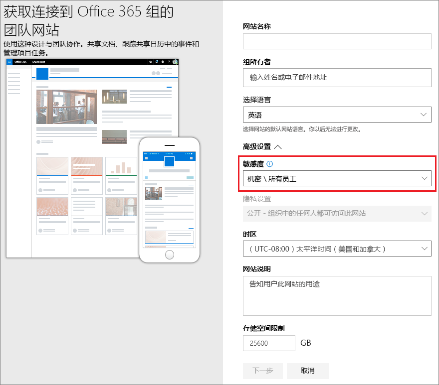
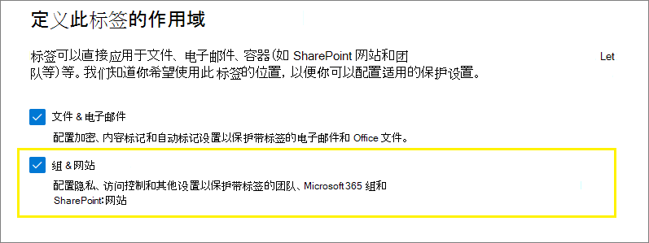
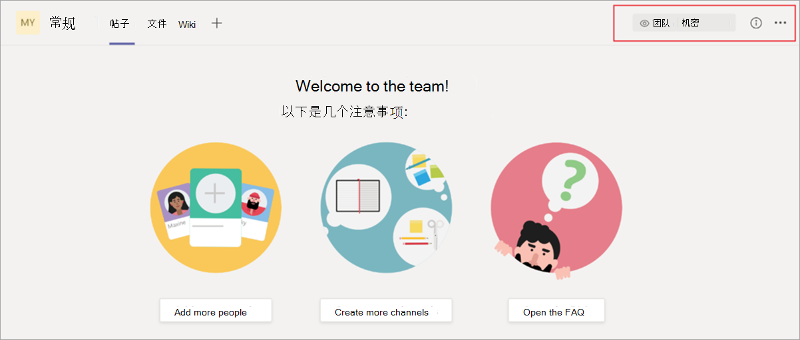
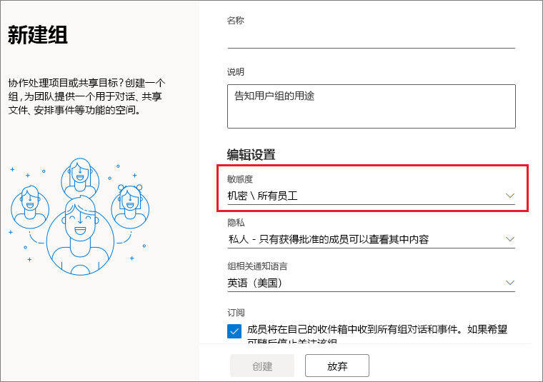
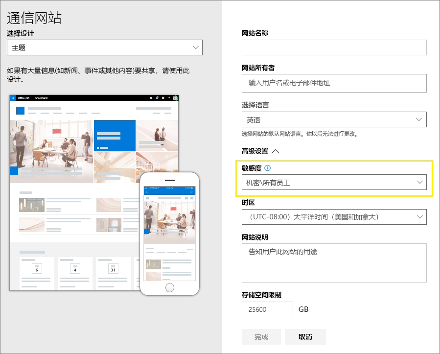

# <a name="use-sensitivity-labels-to-protect-content-in-microsoft-teams-microsoft-365-groups-and-sharepoint-sites"></a>使用敏感度标签保护 Microsoft Teams、Microsoft 365 组和 SharePoint 网站中的内容

>*[Microsoft 365 安全性与合规性许可指南](/office365/servicedescriptions/microsoft-365-service-descriptions/microsoft-365-tenantlevel-services-licensing-guidance/microsoft-365-security-compliance-licensing-guidance)。*

除了使用[敏感度标签](sensitivity-labels.md)来分类和保护文档和电子邮件之外，你还可以使用敏感度标签来保护以下容器中的内容：Microsoft Teams 网站、Microsoft 365 组（[以前称为 Office 365 组](https://techcommunity.microsoft.com/t5/microsoft-365-blog/office-365-groups-will-become-microsoft-365-groups/ba-p/1303601)）和 SharePoint 网站。 对于此容器级别分类和保护，请使用以下标签设置：

- 与 Microsoft 365 组连接的团队网站的隐私（公共或专用）
- 外部用户访问
- 从 SharePoint 网站进行外部共享
- 非托管设备的访问
- 身份验证内容（预览）
- SharePoint 网站的默认共享链接（仅限 PowerShell 的配置）

> [!IMPORTANT]
> 非托管设备和身份验证上下文的设置与 Azure Active Directory 条件访问结合使用。 如果要对这些设置使用敏感度标签，必须配置此依赖功能。 下面的说明中提供了其他信息。

如果你将此敏感度标签应用于受支持的容器，此标签会自动向网站或组应用分类和配置保护设置。

但是，这些容器中的内容不会继承用于文件和电子邮件分类或设置的标签，例如视觉标记和加密。 这样，用户可以标记 SharePoint 网站或团队网站中的文档，确保[为 SharePoint 和 OneDrive 中的 Office 文件启用敏感度标签](sensitivity-labels-sharepoint-onedrive-files.md)。

> [!NOTE]
> Office 365 内容交付网络 (CDN) 不支持容器的敏感度标签。

## <a name="using-sensitivity-labels-for-microsoft-teams-microsoft-365-groups-and-sharepoint-sites"></a>将敏感度标签用于 Microsoft Teams、Microsoft 365 组和 SharePoint 网站

在你为容器启用敏感度标签并为新设置配置敏感度标签之前，用户可在其应用中查看和应用敏感度标签。例如，从 Word 应用中：


为容器启用并配置敏感度标签后，用户还可查看敏感度标签并将其应用于 Microsoft 团队网站、Microsoft 365 组和 SharePoint 网站。 例如，在从 SharePoint 创建新的团队网站时：



## <a name="how-to-enable-sensitivity-labels-for-containers-and-synchronize-labels"></a>如何为容器启用敏感度标签和同步标签

如果尚未对容器启用敏感度标签，请执行以下一组步骤作为一次过程：

1. 由于此功能使用 Azure AD 功能，因此请按照以下 Azure AD 文档中的说明来启用敏感度标签支持：[在 Azure Active Directory 中向 Microsoft 365 组分配敏感度标签](/azure/active-directory/users-groups-roles/groups-assign-sensitivity-labels)。

2. 现在，你需要将敏感度标签同步到 Azure AD。 首先，[连接到安全与合规中心 PowerShell](/powershell/exchange/office-365-scc/connect-to-scc-powershell/connect-to-scc-powershell)。

   例如，在以管理员身份运行的 PowerShell 会话中，使用全局管理员帐户登录。

3. 然后运行以下命令，以确保可将敏感度标签与 Microsoft 365 组配合使用：

    ```powershell
    Execute-AzureAdLabelSync
    ```

## <a name="how-to-configure-groups-and-site-settings"></a>如何配置组和网站设置

按照前一章节的内容为容器启用敏感度标签后，你可以在敏感度标签配置中为组和网站配置保护设置。 设置在为容器启用敏感度标签之前为可见，但你无法对其进行配置。

1. 请遵循一般说明来 [创建或编辑敏感度标签](create-sensitivity-labels.md#create-and-configure-sensitivity-labels)，并确保为标签的作用域选择“**组和网站**”： 
    
    
    
    如果仅为标签选择此范围，则该标签将不会在支持敏感度标签的 Office 应用中显示，也无法应用于文件和电子邮件。 分隔标签对于用户和管理员都将有所帮助，但也会增加标签部署的复杂性。
    
    例如，你需要仔细检查[标签顺序](sensitivity-labels.md#label-priority-order-matters)，因为 SharePoint 会检测何时将标签文档上载到标签网站。 在这种情况下，当文档具有比网站标签更高的优先级敏感度标签时，会自动生成审核事件和电子邮件。 有关更多信息，请参阅本页上的[审核敏感度标签活动](#auditing-sensitivity-label-activities)部分。 

2. 然后，在 **定义组和网站的保护设置** 页面上，选择一个或两个可用选项：
    
    - “**隐私和外部用户访问设置**”用于配置“**隐私**”和“**外部用户访问**”设置。 
    - **外部共享和条件访问设置** 用于配置 **控制来自已标记的 SharePoint 网站的外部共享** 和 **使用 Azure AD 条件访问保护已标记的 SharePoint 网站** 设置。

3. 如果你选择了“**隐私和外部用户访问设置**”，现在请配置以下设置：
    
    - **隐私**：如果要使组织中的每个人都可访问应用此标签的团队网站或组，请保留“**公用**”的默认设置。
        
        如果要将访问权限限制为仅允许组织中的已批准成员，请选择“**专用**”。
        
        如果要使用敏感度标签保护容器中的内容，但仍允许用户自行配置隐私设置，请选择“**无**”。
        
        “**公用**”或“**专用**”的设置可在你将此标签应用到容器时设置和锁定隐私设置。 你选择的设置将替换之前可能已为团队或组配置的任何隐私设置，并锁定隐私值，因此只有先从容器中删除敏感度标签才能更改它。 删除敏感度标签后，标签中的隐私设置仍将保留，用户现在可以再次更改它。
    
    - **外部用户访问**：控制组所有者是否可以 [向组添加来宾](/office365/admin/create-groups/manage-guest-access-in-groups)。

4. 如果你选择了“**外部共享和条件访问设置**”，现在请配置以下设置：
    
    - **控制来自标记为 SharePoint 网站或网站** 的外部共享：选择此选项，然后选择对任何人、新来宾和现有来宾、现有来宾或仅对组织内部人员的外部共享。 有关此配置和设置的详细信息，请参阅 SharePoint 文档，[为网站开启或关闭外部共享](/sharepoint/change-external-sharing-site)。
    
    - **使用 Azure AD 条件访问保护已标记的 SharePoint 网站**：仅当你的组织已配置并且使用 [Azure Active Directory 条件访问](/azure/active-directory/conditional-access/overview) 时才选择此选项。然后选择以下设置之一：
    
        - **确定用户是否可以从非托管设备访问 SharePoint 网站**：此选项使用利用 Azure AD 条件访问来阻止或限制从非托管设备访问 SharePoint 和 OneDrive 内容的 SharePoint 功能。 有关详细信息，请参阅 SharePoint 文档中的[控制非托管设备的访问](/sharepoint/control-access-from-unmanaged-devices)。 为此标签设置指定的选项等效于运行针对网站的 PowerShell 命令，如 SharePoint 说明中的[阻止或限制对特定 SharePoint 网站或 OneDrive](/sharepoint/control-access-from-unmanaged-devices#block-or-limit-access-to-a-specific-sharepoint-site-or-onedrive) 部分的步骤 3-5 所述。
            
            有关其他配置信息，请参阅本部分末尾的[有关非托管设备选项依赖项的详细信息](#more-information-about-the-dependencies-for-the-unmanaged-devices-option)。
            
        - **选择现有的身份验证上下文**：当前处于预览状态，当用户访问已应用此标签的 SharePoint 网站时，此选项可让您强制执行更严格的访问条件。 当选择为组织的条件访问部署创建和发布的现有身份验证上下文时，将强制执行这些条件。 如果用户不满足配置的条件，或者使用不支持身份验证上下文的应用，则拒绝他们访问。
            
            有关其他配置信息，请参阅本部分末尾的[有关身份验证上下文选项依赖项的详细信息](#more-information-about-the-dependencies-for-the-authentication-context-option)。
            
            此标签配置的示例：
            
             - 选择一个身份验证上下文，该上下文配置为要求[多重身份验证 (MFA)](/azure/active-directory/conditional-access/untrusted-networks)。 此标签将应用于包含高度机密项目的 SharePoint 网站。 因此，当来自不受信网络的用户尝试访问此网站中的文档时，会看到 MFA 提示，要求其完成这些提示后才能访问该文档。
             
             - 选择为[使用条款 (ToU) 策略](/azure/active-directory/conditional-access/terms-of-use)配置的身份验证上下文。 此标签随后应用于包含出于法律或合规性原因需要接受使用条款的项目的 SharePoint 网站。 因此，当用户尝试访问此网站中的文档时，会看到在访问原始文档之前必须接受的使用条款文档。

> [!IMPORTANT]
> 将标签应用于团队、组或网站时，只有这些网站和组设置会生效。 如果[标签作用域](sensitivity-labels.md#label-scopes)包括文件和电子邮件，则其他标签设置（例如加密和内容标记）不适用于团队、组或网站中的内容。

如果尚未发布敏感度标签，现可通过[将其添加到敏感度标签策略](create-sensitivity-labels.md#publish-sensitivity-labels-by-creating-a-label-policy)进行发布。 分配的敏感度标签策略包含此标签的用户将能够为网站和组选择该标签。

##### <a name="more-information-about-the-dependencies-for-the-unmanaged-devices-option"></a>有关非托管设备选项依赖项的详细信息

如果未按照“[使用应用强制实施的限制](/sharepoint/app-enforced-restrictions)”中的文档配置 SharePoint 的相关条件访问策略，则此处指定的选项将无效。 此外，如果其限制性低于在租户级别配置的设置，则也不会起作用。 如果你已为非托管设备配置了组织范围的设置，请选择相同或更严格的标签设置

例如，如果你的租户被配置为“**允许仅限 Web 的受限访问**”，则允许完全访问权限的标签设置将不起作用，因为其限制性较弱。 对于此租户级设置，请选择可阻止访问的标签设置（限制性更强）或可实现受限访问的标签设置（与租户设置相同）。

由于可以独立于标签配置来配置该 SharePoint 设置，因此在敏感度标签配置中不会检查依赖项是否已就位。 这些依赖项可在创建和发布标签，甚至应用标签后配置。 但是，如果已应用标签，则标签设置要在用户下次进行身份验证后才会生效。

##### <a name="more-information-about-the-dependencies-for-the-authentication-context-option"></a>有关身份验证上下文选项依赖项的详细信息

若要在下拉列表中显示供选择，必须在 Azure Active Directory 条件访问配置中创建、配置和发布身份验证上下文。 有关详细信息和说明，请参阅 Azure AD 条件访问文档中[配置身份验证上下文](/azure/active-directory/conditional-access/concept-conditional-access-cloud-apps#configure-authentication-contexts)部分。

并非所有应用程序都支持身份验证上下文。如果应用程序不受支持的用户连接到为身份验证上下文配置的网站，则他们会看到访问被拒绝的消息，或者被提示进行身份验证但被拒绝。当前支持身份验证上下文的应用程序有:

- Web 的 Office，其中包括 Web 的 Outlook

- 适用于 Windows 和 macOS 的 Microsoft Teams（不包括 Teams Web 应用）

- Microsoft Planner

- 适用于 Word、Excel 和 PowerPoint 的 Microsoft 365 应用版；最低版本：
    - Windows：2103
    - macOS：16.45.1202
    - iOS：2.48.303
    - Android：16.0.13924.10000

- 适用于 Outlook 的 Microsoft 365 应用版；最低版本：
    - Windows：2103
    - macOS：16.45.1202
    - iOS：4.2109.0
    - Android：4.2025.1

- OneDrive 同步应用，最低版本：
    - Windows：21.002
    - macOS：21.002
    - iOS：12.30 版推出
    - Android：尚不支持

此预览的已知限制：

- 对于 OneDrive 同步应用，仅 OneDrive 支持，其他网站不支持。

- 以下功能和应用可能与身份验证上下文不兼容，因此建议你检查这些功能和应用在用户使用身份验证上下文成功访问网站后是否可继续工作：
    
    - 使用 Power Apps 或 Power Automate 的工作流
    - 第三方应用

### <a name="configure-settings-for-the-default-sharing-link-for-a-site-by-using-powershell-advanced-settings"></a>使用 PowerShell 高级设置为网站的默认共享链接配置设置

除了可从合规中心配置的站点和组的标签设置外，还可以配置网站的默认共享链接类型和共享链接权限。

若要详细了解这些设置的工作原理，请参阅[更改网站的默认链接类型](/sharepoint/change-default-sharing-link)。

共享链接的这些附加标签设置当前仅作为 PowerShell *AdvancedSettings* 参数和来自 [安全合规中心 PowerShell](/powershell/exchange/scc-powershell) 的 [set-Label](/powershell/module/exchange/set-label) 和 [New-Label](/powershell/module/exchange/new-labelpolicy) cmdlet：

- **DefaultSharingScope**：可用值为：
    - **SpecificPeople**：将此网站的默认共享链接设置为“特定人员”链接
    - **Organization**：将此网站的默认共享链接设置为“组织”链接或公司的可共享链接
    - **Anyone**：将此网站的默认共享链接设置为“匿名访问”或“任何人”链接

- **DefaultShareLinkPermission**:  可用值为：
    - **View**：将网站的默认链接权限设置为“查看”权限。
    - **Edit**：将网站的默认链接权限设置为“编辑”权限

这两个设置和值等效于来自 [Set-SPOSite](/powershell/module/sharepoint-online/set-sposite) cmdlet 的 *DefaultSharingScope* 和 *DefaultShareLinkPermission* 参数。

PowerShell 示例，其中敏感度标签 GUID 为 **8faca7b8-8d20-48a3-8ea2-0f96310a848e**：

- 若要将共享链接类型设置为 SpecificPeople，请执行以下操作：
    
    ````powershell
    Set-Label -Identity 8faca7b8-8d20-48a3-8ea2-0f96310a848e -AdvancedSettings @{DefaultSharingScope="SpecificPeople"}
    ````

- 若要将共享链接权限设置为“编辑”，请执行以下操作：
    
    ````powershell
    Set-Label -Identity 8faca7b8-8d20-48a3-8ea2-0f96310a848e -AdvancedSettings @{DefaultShareLinkPermission="Edit"}
    ````

#### <a name="powershell-tips-for-specifying-the-advanced-settings"></a>指定高级设置的 PowerShell 提示

虽然可以按其名称指定敏感度标签，但我们建议使用标签 GUID 以避免在指定标签名称或显示名称时可能产生的混淆。要查找 GUID，请：

````powershell
Get-Label | Format-Table -Property DisplayName, Name, Guid
````

要删除敏感度标签中的任意一项高级设置，请使用相同的 AdvancedSettings 参数语法，同时指定一个空字符串值。例如：

````powershell
Set-Label -Identity 8faca7b8-8d20-48a3-8ea2-0f96310a848e -AdvancedSettings @{DefaultSharingScope=""}
````

## <a name="sensitivity-label-management"></a>敏感度标签管理

在创建、修改或删除为网站和组配置的敏感度标签时，请使用以下指南。

### <a name="creating-and-publishing-labels-that-are-configured-for-sites-and-groups"></a>创建和发布为网站和组配置的标签

创建并发布新敏感度标签后，团队、组和网站中的用户可在 1 小时内能看到该标签。 但是，如果修改现有标签，最多需要 24 小时才能看到。 为网站和组设置配置标签后，请按照以下指南为你的用户发布标签：

1. 创建并配置敏感度标签后，将此标签添加到仅应用于少数测试用户的标签策略。

2. 等待更改复制：

   - 新标签：等待一小时。
   - 现有标签：等待 24 小时。

3. 在此等待期之后，使用测试用户帐户之一，创建具有在步骤 1 中创建的标签的团队、Microsoft 365 组或 SharePoint 网站。

4. 如果在此创建操作过程中没有错误，表示可以安全地为租户中的所有用户发布标签。

### <a name="modifying-published-labels-that-are-configured-for-sites-and-groups"></a>修改为网站和组配置的已发布标签

最佳做法是，在为团队、组或网站应用标签后，不要更改敏感度标签的网站和组设置。 如果这样做，请记住等待 24 小时，使更改复制到应用了标签的所有容器。

此外，如果所做的更改包括 **外部用户访问** 设置：

- 新设置仅适用于新用户，并不适用于现有用户。 例如，如果以前选择了此设置，并且来宾用户访问了网站，则在标签配置中清除此设置后，这些来宾用户仍可访问该网站。

- 组属性 hiddenMembership 和 roleEnabled 的隐私设置不会更新。

### <a name="deleting-published-labels-that-are-configured-for-sites-and-groups"></a>删除为网站和组配置的已发布标签

如果删除已启用网站和组设置的敏感度标签，且该标签包含在一个或多个标签策略中，则此操作可能会导致新团队、组和网站的创建失败。 若要避免这种情况，请使用以下指南：

1. 从包含敏感度标签的所有标签策略中删除该标签。

2. 等待一小时。

3. 在此等待期之后，尝试创建团队、组或网站，并确认标签不再可见。

4. 如果敏感度标签不可见，则现在可以安全地删除该标签。

## <a name="how-to-apply-sensitivity-labels-to-containers"></a>如何将敏感度标签应用于容器

现在可将一个或多个敏感度标签应用于以下容器：

- [Azure AD 中的 Microsoft 365 组](#apply-sensitivity-labels-to-microsoft-365-groups)
- [Microsoft Teams 团队网站](#apply-a-sensitivity-label-to-a-new-team)
- [Outlook 网页版中的 Microsoft 365 组](#apply-a-sensitivity-label-to-a-new-group-in-outlook-on-the-web)
- [SharePoint 网站](#apply-a-sensitivity-label-to-a-new-site)

如果需要[将敏感度标签应用于多个网站](#use-powershell-to-apply-a-sensitivity-label-to-multiple-sites)，则可以使用 PowerShell。

### <a name="apply-sensitivity-labels-to-microsoft-365-groups"></a>将敏感度标签应用于 Microsoft 365 组

现在可将一个或多个敏感度标签应用于 Microsoft 365 组。 请返回到 Azure AD 文档查看说明：

- [在 Azure 门户中为新组分配标签](/azure/active-directory/users-groups-roles/groups-assign-sensitivity-labels#assign-a-label-to-a-new-group-in-azure-portal)

- [为 Azure 门户中的现有组分配标签](/azure/active-directory/users-groups-roles/groups-assign-sensitivity-labels#assign-a-label-to-an-existing-group-in-azure-portal)

- [从 Azure 门户中的现有组中删除标签](/azure/active-directory/users-groups-roles/groups-assign-sensitivity-labels#remove-a-label-from-an-existing-group-in-azure-portal)。

### <a name="apply-a-sensitivity-label-to-a-new-team"></a>为新团队应用敏感度标签

在 Microsoft Teams 中创建新团队时，用户可以选择敏感度标签。 如果用户从“敏感度”下拉列表中选择标签，隐私设置可能会更改，以反映标签配置。 根据为标签选择的外部用户访问设置，用户可以或不能将组织外部人员添加到团队中。

[了解有关 Teams 的敏感度标签的详细信息](/microsoftteams/sensitivity-labels)


创建团队后，敏感度标签将显示在所有频道的右上角。



该服务会自动将相同的敏感度标签应用于 Microsoft 365 组和连接的 SharePoint 团队网站。

### <a name="apply-a-sensitivity-label-to-a-new-group-in-outlook-on-the-web"></a>应用敏感度标签至 Outlook 网页版的新组

在 Outlook 网页版中，创建新组时可选择或更改已发布的标签的“**敏感度**”选项：



### <a name="apply-a-sensitivity-label-to-a-new-site"></a>为新网站应用敏感度标签

管理员和最终用户可以在[创建新式团队网站和通信网站时](/sharepoint/create-site-collection)选择敏感度标签，并展开“高级设置”：



下拉列表框显示选择的标签名称，帮助图标显示所有标签名称及其工具提示，这可帮助用户确定要应用的正确标签。

在标签应用后，当用户浏览网站时，可以看到标签名称和所应用的策略。 例如，此网站标记为“机密”，且隐私设置设为“私有”：


### <a name="use-powershell-to-apply-a-sensitivity-label-to-multiple-sites"></a>使用 PowerShell 将敏感度标签应用于多个网站

你可以将 [Set-SPOSite](/powershell/module/sharepoint-online/set-sposite) 和 [Set-SPOTenant](/powershell/module/sharepoint-online/set-spotenant) cmdlet 与当前 [SharePoint Online 命令行管理程序](/powershell/sharepoint/sharepoint-online/connect-sharepoint-online)中的 *SensitivityLabel* 参数一起使用，以将敏感度标签应用于多个网站。 网站可以是任何 SharePoint 网站集或 OneDrive 网站。

请确保你拥有 SharePoint Online 命令行管理程序的 16.0.19418.12000 或更高版本。

1. 使用“**以管理员身份运行**”选项打开 PowerShell 会话。

2. 如果你不知道标签 GUID：[连接到安全与合规中心 PowerShell](/powershell/exchange/connect-to-scc-powershell)，获取敏感度标签及其 GUID 的列表。

   ```powershell
   Get-Label |ft Name, Guid
   ```

3. 现在，[连接到 SharePoint Online PowerShell](/powershell/sharepoint/sharepoint-online/connect-sharepoint-online) 并将标签 GUID 存储为变量。 例如：

   ```powershell
   $Id = [GUID]("e48058ea-98e8-4940-8db0-ba1310fd955e")
   ```

4. 创建一个新变量，用于标识在其 URL 中有共同标识字符串的多个网站。例如：

   ```powershell
   $sites = Get-SPOSite -IncludePersonalSite $true -Limit all -Filter "Url -like 'documents"
   ```

5. 运行以下命令以将标签应用于这些网站。 使用我们的示例：

   ```powershell
   $sites | ForEach-Object {Set-SPOTenant $_.url -SensitivityLabel $Id}
   ```

通过此系列命令，可使用相同的敏感度标签标记租户中的多个站点，因此可使用 Set-SPOTenant cmdlet，而不是针对每个网站配置的 Set-SPOSite cmdlet。 但是，当需要应用不同标签为特定网站重复以下命令时，请使用 Set-SPOSite cmdlet： `Set-SPOSite -Identity <URL> -SensitivityLabel "<labelguid>"`

## <a name="view-and-manage-sensitivity-labels-in-the-sharepoint-admin-center"></a>在 SharePoint 管理中心中查看和管理敏感度标签

若要查看、排序和搜索已应用的敏感度标签，请使用新 SharePoint 管理中心中的“**活动网站**”页面。 可能需要先添加“**敏感度**”列：


有关从“活动网站”页面管理网站（包括如何添加列）的详细信息，请参阅[管理新 SharePoint 管理中心中的网站](/sharepoint/manage-sites-in-new-admin-center)。

你也可以从此页面更改和应用标签：

1. 单击网站名称以打开“详细信息”窗格。

2. 选择“**策略**”选项卡，然后为“**敏感度**”设置选择“**编辑**”。

3. 从“**编辑敏感度设置**”窗格中，选择要应用于该网站的敏感度标签。 与可向特定用户分配敏感度标签的用户应用不同，管理中心显示租户的所有敏感度标签。 选择标签后，选择“**保存**”。

## <a name="support-for-sensitivity-labels"></a>对于敏感度标签的支持

使用支持敏感度标签的管理中心时，可看到租户的所有敏感度标签。 相比之下，根据发布策略筛选敏感度标签的用户应用和服务可以导致你看到这些标签的子集。

以下应用和服务支持为网站和组设置配置的敏感度标签：

- 管理中心：

  - SharePoint 管理中心
  - Teams 管理中心
  - Azure Active Directory 高级版
  - Microsoft 365 管理中心
  - Microsoft 365 合规中心

- 用户应用和服务：

  - SharePoint
  - Teams
  - Outlook 网页版以及 Windows、macOS、iOS 和 Android 版 Outlook
  - Forms
  - Stream
  - Planner 

以下应用和服务目前不支持为网站和组设置配置的敏感度标签：

- 管理中心：

  - Exchange 管理中心

- 用户应用和服务：

  - Dynamics 365
  - Yammer
  - Project
  - Power BI

## <a name="classic-azure-ad-group-classification"></a>经典 Azure AD 组分类

为容器启用敏感度标签后，Microsoft 365 不再支持来自 Azure AD 的组分类，并且不会显示在支持敏感度标签的站点上。但是，你可以将旧分类转换为敏感度标签。

有关如何使用 SharePoint 的旧组分类的示例，请参阅 [SharePoint “新式”网站分类](/sharepoint/dev/solution-guidance/modern-experience-site-classification)。

这些分类通过使用 Azure AD PowerShell 或 PnP Core 库以及定义 `ClassificationList` 设置值来进行配置。 如果租户定义了分类值，则在 [AzureADPreview PowerShell 模块](https://www.powershellgallery.com/packages/AzureADPreview)中运行以下命令时，将显示这些分类值：

```powershell
($setting["ClassificationList"])
```

若要将旧分类转换为敏感度标签，请执行下列操作之一：

- 使用现有标签：通过编辑已发布的现有敏感度标签，指定你希望网站和组使用的标签设置。

- 创建新标签：通过创建和发布与你的现有分类名称相同的新的敏感度标签，指定你希望网站和组使用的标签设置。

则：

1. 使用 PowerShell 将敏感度标签应用至使用名称映射的现有 Microsoft 365 组和 SharePoint 网站。 相关说明，请参见下一节。

2. 删除现有组和网站中的旧分类。

虽然无法阻止用户在尚不支持敏感度标签的应用和服务中创建新组，但可运行定期 PowerShell 标签来查看用户已使用旧分类创建的新组，并转换这些分类以使用敏感度标签。

为了帮助管理网站和组的敏感度标签与 Azure AD 分类的共存，请参阅[适用于 Microsoft 365 组的 Azure Active Directory 分类和敏感度标签](migrate-aad-classification-sensitivity-labels.md)。

### <a name="use-powershell-to-convert-classifications-for-microsoft-365-groups-to-sensitivity-labels"></a>使用 PowerShell 将 Microsoft 365 组的分类转换为敏感度标签

1. 首先，[连接到安全与合规中心 PowerShell](/powershell/exchange/office-365-scc/connect-to-scc-powershell/connect-to-scc-powershell)。

   例如，在以管理员身份运行的 PowerShell 会话中，使用全局管理员帐户登录：

2. 通过运行 [ Get-Label ](/powershell/module/exchange/get-label) cmdlet 获取敏感度标签及 GUID 列表：

   ```powershell
   Get-Label |ft Name, Guid
   ```

3. 记下你想要应用到 Microsoft 365 组的敏感度标签的 Guid。

4. 现在，在单独的 Windows PowerShell 窗口中[连接到 Exchange Online PowerShell](/powershell/exchange/connect-to-exchange-online-powershell)。

5. 以下列命令为例，获取当前具有“常规”分类的组列表：

   ```PowerShell
   $Groups= Get-UnifiedGroup | Where {$_.classification -eq "General"}
   ```

6. 对于每个组，添加新的敏感度标签 GUID。例如：

    ```PowerShell
    foreach ($g in $groups)
    {Set-UnifiedGroup -Identity $g.Identity -SensitivityLabelId "457fa763-7c59-461c-b402-ad1ac6b703cc"}
    ```

7. 对剩下的组分类重复步骤 5 和 6。

## <a name="auditing-sensitivity-label-activities"></a>审核敏感度标签活动

> [!IMPORTANT]
> 如果通过仅为保护容器的标签选择“**组和网站**”作用域来使用标签分离，则：由于本部分描述的 **检测到文档敏感度不匹配** 审核事件和电子邮件，请考虑在为标签设置“**文件和电子邮件**”作用域之前先 [对标签进行排序](sensitivity-labels.md#label-priority-order-matters)。 

如果有人将文档上传到受敏感度标签保护的网站上，且该文档的敏感度标签的[优先级](sensitivity-labels.md#label-priority-order-matters)比该网站应用的敏感度标签高，则不会阻止此操作。 例如，你向 SharePoint 网站应用了“**常规**”标签，并且有人向此网站上传了一个标记为“**机密**”的文档。 对于优先级更低的内容来说，具有更高优先级的敏感度标签会识别敏感度高于此内容的内容，因此该情况可能会带来安全隐患。

虽然未阻止该操作，但其已经过审核，并默认自动生成一封发往上传文档人员和网站管理员的电子邮件。 因此，可识别存在这种标签优先级不一致情况的用户和管理员，并在必要时采取措施。 例如，从网站中删除或移动已上传的文档。

如果文档的敏感度标签的优先级低于网站应用的敏感度标签，则不会出现安全问题。 例如，标有“**常规**”的文档上传到标有“**机密**”的网站上。 在这种情况中，不生成审核事件和电子邮件。

> [!NOTE]
> 正如要求用户提供将标签更改为较低分类的理由的策略选项一样，同一父标签的子标签都被视为具有相同的优先级。

要搜索此事件的审核日志，请从“**文件和页面活动**”类别中查找“**检测到文档敏感度不匹配**”。

自动生成的电子邮件具有主题“**检测到不兼容的敏感度标签**”，该电子邮件将说明标记不匹配，并提供指向已上传文档和网站的链接。 此外，它还包含说明用户可以如何更改敏感度标签的文档链接。 无法自定义这些自动电子邮件，但当你使用以下来自 [Set-SPOTenant](/powershell/module/sharepoint-online/set-spotenant) 的 PowerShell 命令时，可以阻止发送这些电子邮件：

```PowerShell
Set-SPOTenant -BlockSendLabelMismatchEmail $True
```

当有人向网站或组添加敏感度标签或从中删除敏感度标签时，也会审核这些活动，但不会自动生成电子邮件。

可在“[敏感度标签活动](search-the-audit-log-in-security-and-compliance.md#sensitivity-label-activities)”类别中找到这些审核事件。 有关搜索审核日志的说明，请参阅[在安全与合规中心中搜索审核日志](search-the-audit-log-in-security-and-compliance.md)。

## <a name="how-to-disable-sensitivity-labels-for-containers"></a>如何禁用容器的敏感度标签

你可按照[在 PowerShell 中启用敏感度标签支持](/azure/active-directory/users-groups-roles/groups-assign-sensitivity-labels#enable-sensitivity-label-support-in-powershell)中的相同说明，为 Microsoft Teams、Microsoft 365 组和 SharePoint 网站关闭敏感度标签。 但是，若要禁用此功能，请在步骤 5 中指定 `$setting["EnableMIPLabels"] = "False"`。

除了在创建或编辑敏感度标签时使所有设置对组和网站不可用以外，此操作还可恢复容器用于其配置的属性。 为 Microsoft Teams、Microsoft 365 组和 SharePoint 网站启用敏感度标签会将使用的属性从“**分类**”（用于 [Azure AD 组分类](#classic-azure-ad-group-classification)）切换为“**敏感度**”。 当禁用容器的敏感度标签时，容器将忽略敏感度属性并再次使用“分类”属性。

这意味着不会强制实施先前应用到容器的网站和组中的任何标签设置，并且容器不再显示标签。

如果这些容器应用了 Azure AD 分类值，则它们将再次恢复为使用分类。 请注意，在启用此功能后创建的任何新网站或组都不会显示标签或具有分类。 对于这些容器以及所有新容器，现在可以应用分类值。 有关详细信息，请参阅 [SharePoint“新式”网站分类](/sharepoint/dev/solution-guidance/modern-experience-site-classification)和[为组织中的 Office 组创建分类](../enterprise/manage-microsoft-365-groups-with-powershell.md)。

## <a name="additional-resources"></a>其他资源

如需有关[通过 Microsoft Teams、O365 组和 SharePoint Online 网站使用敏感度标签](https://techcommunity.microsoft.com/t5/security-privacy-and-compliance/using-sensitivity-labels-with-microsoft-teams-o365-groups-and/ba-p/1221885#M1380)的信息，请参阅网络研讨会的记录和回答的问题。

在录制此网络研讨会时该功能仍处于预览阶段，因此你可能会发现 UI 存在某些差异。 但是，此功能的信息仍准确无误，并且该页面记录了所有新功能。

有关管理 Teams 连接站点和频道网站的详细信息，请参阅 [管理 Teams 连接站点和频道网站](/SharePoint/teams-connected-sites)。
