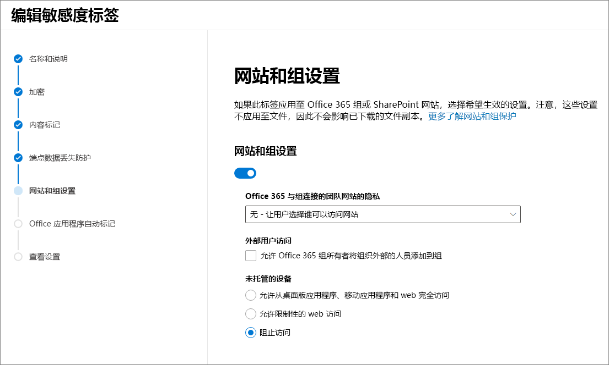

# <a name="use-sensitivity-labels-with-microsoft-teams-office-365-groups-and-sharepoint-sites-public-preview"></a><span data-ttu-id="327e9-103">将敏感度标签与 Microsoft Teams、Office 365 组和 SharePoint 网站（公共预览版）配合使用</span><span class="sxs-lookup"><span data-stu-id="327e9-103">Use sensitivity labels with Microsoft Teams, Office 365 groups, and SharePoint sites (public preview)</span></span>

<span data-ttu-id="327e9-104">在 [Microsoft 365 合规中心](https://protection.office.com/)创建敏感度标签时，现可将其应用于以下容器：Microsoft Teams、Office 365 组和 SharePoint 网站。</span><span class="sxs-lookup"><span data-stu-id="327e9-104">When you create sensitivity labels in the [Microsoft 365 compliance center](https://protection.office.com/), you can now apply them to the following containers: Microsoft Teams, Office 365 groups, and SharePoint sites.</span></span> <span data-ttu-id="327e9-105">使用标签设置来控制这些容器的以下选项：</span><span class="sxs-lookup"><span data-stu-id="327e9-105">Use label settings to control the following options for these containers:</span></span>

- <span data-ttu-id="327e9-106">与 Office 365 组连接的团队网站的隐私（公共或专用）</span><span class="sxs-lookup"><span data-stu-id="327e9-106">Privacy of Office 365 group-connected teams sites (public or private)</span></span>
- <span data-ttu-id="327e9-107">外部用户访问</span><span class="sxs-lookup"><span data-stu-id="327e9-107">External users access</span></span>
- <span data-ttu-id="327e9-108">非托管设备的访问</span><span class="sxs-lookup"><span data-stu-id="327e9-108">Access from unmanaged devices</span></span> 

<span data-ttu-id="327e9-109">将此标签应用于受支持的容器之一时，标签会自动向连接的 SharePoint 网站或团队网站应用所配置的选项。</span><span class="sxs-lookup"><span data-stu-id="327e9-109">When you apply this label to one of the supported containers, the label automatically applies the configured options to the connected SharePoint site or team site.</span></span> 

<span data-ttu-id="327e9-110">但是，这些容器中的内容不会为设置继承标签，例如标签名称、视觉标记或加密。</span><span class="sxs-lookup"><span data-stu-id="327e9-110">Content in those containers however, do not inherit the labels for settings such as the label name, visual markings, or encryption.</span></span> <span data-ttu-id="327e9-111">要在 SharePoint 网站或团队网站中标记文件，请参阅[启用 SharePoint 和 OneDrive 中 Office 文件的敏感度标签](sensitivity-labels-sharepoint-onedrive-files.md)。</span><span class="sxs-lookup"><span data-stu-id="327e9-111">To label files in SharePoint sites or team sites, [enable sensitivity labels for Office files in SharePoint and OneDrive](sensitivity-labels-sharepoint-onedrive-files.md).</span></span>

## <a name="about-the-public-preview-for-microsoft-teams-office-365-groups-and-sharepoint-sites"></a><span data-ttu-id="327e9-112">关于 Microsoft Teams、Office 365 组和 SharePoint 网站的公共预览版</span><span class="sxs-lookup"><span data-stu-id="327e9-112">About the public preview for Microsoft Teams, Office 365 groups, and SharePoint sites</span></span>

<span data-ttu-id="327e9-113">Microsoft Teams、Office 365 组和 SharePoint 网站的敏感度标签将逐步向租户推出，并且在最终发布之前可能会发生更改。</span><span class="sxs-lookup"><span data-stu-id="327e9-113">Sensitivity labels for Microsoft Teams, Office 365 groups, and SharePoint sites are gradually rolling out to tenants and might change before final release.</span></span> <span data-ttu-id="327e9-114">此公共预览版不适用于 Office 365 内容交付网络 (CDN)。</span><span class="sxs-lookup"><span data-stu-id="327e9-114">This public preview doesn't work with Office 365 Content Delivery Networks (CDNs).</span></span>

<span data-ttu-id="327e9-115">在你为新设置启用此预览版和配置敏感度标签之前，用户可在其应用中查看和应用敏感度标签。</span><span class="sxs-lookup"><span data-stu-id="327e9-115">Before you enable this preview and configure sensitivity labels for the new settings, users can see and apply sensitivity labels in their apps.</span></span> <span data-ttu-id="327e9-116">例如，在 Word 中：</span><span class="sxs-lookup"><span data-stu-id="327e9-116">For example, from Word:</span></span>


<span data-ttu-id="327e9-118">启用并配置此预览版后，用户还可查看敏感度标签并将其应用于 Microsoft Teams、Office 365 组和 SharePoint 网站。</span><span class="sxs-lookup"><span data-stu-id="327e9-118">After you enable and configure this preview, users can additionally see and apply sensitivity labels to Microsoft Teams, Office 365 groups, and SharePoint sites.</span></span> <span data-ttu-id="327e9-119">例如，在从 SharePoint 创建新的团队网站时：</span><span class="sxs-lookup"><span data-stu-id="327e9-119">For example, when you create a new team site from SharePoint:</span></span>


## <a name="enable-this-preview-and-synchronize-labels"></a><span data-ttu-id="327e9-121">启用此预览版并同步标签</span><span class="sxs-lookup"><span data-stu-id="327e9-121">Enable this preview and synchronize labels</span></span>

1. <span data-ttu-id="327e9-122">由于此功能使用 Azure AD 功能，因此请按照以下 Azure AD 文档中的说明来启用预览版：[在 Azure Active Directory 中向 Office 365 组分配敏感度标签（预览）](https://docs.microsoft.com/azure/active-directory/users-groups-roles/groups-assign-sensitivity-labels)。</span><span class="sxs-lookup"><span data-stu-id="327e9-122">Because this feature uses Azure AD functionality, follow the instructions in the Azure AD documentation to enable the preview: [Assign sensitivity labels to Office 365 groups in Azure Active Directory (preview)](https://docs.microsoft.com/azure/active-directory/users-groups-roles/groups-assign-sensitivity-labels).</span></span>

2. <span data-ttu-id="327e9-123">在 PowerShell 会话中，通过使用拥有全局管理员权限的工作或学校帐户，立即连接到安全与合规中心。</span><span class="sxs-lookup"><span data-stu-id="327e9-123">In a PowerShell session, connect to the Security & Compliance Center by using a work or school account that has global admin privileges.</span></span> <span data-ttu-id="327e9-124">有关说明，请参阅[连接到 Office 365 安全与合规中心 PowerShell](/powershell/exchange/office-365-scc/connect-to-scc-powershell/connect-to-scc-powershell)。</span><span class="sxs-lookup"><span data-stu-id="327e9-124">For instructions, see [Connect to Office 365 Security & Compliance Center PowerShell](/powershell/exchange/office-365-scc/connect-to-scc-powershell/connect-to-scc-powershell).</span></span>

3. <span data-ttu-id="327e9-125">运行以下命令将标签同步到 Azure AD，使其可与 Office 365 组一起使用：</span><span class="sxs-lookup"><span data-stu-id="327e9-125">Run the following commands to synchronize your labels to Azure AD, so that they can be used with Office 365 groups:</span></span>
    
    ```powershell
    Set-ExecutionPolicy RemoteSigned
    $UserCredential = Get-Credential
    $Session = New-PSSession -ConfigurationName Microsoft.Exchange -ConnectionUri https://ps.compliance.protection.outlook.com/powershell-liveid/ -Credential $UserCredential -Authentication Basic -AllowRedirection
    Import-PSSession $Session -DisableNameChecking
    Execute-AzureAdLabelSync
    ```

## <a name="how-to-configure-site-and-group-settings-when-you-create-or-edit-sensitivity-labels"></a><span data-ttu-id="327e9-126">如何创建或编辑敏感度标签时设置网站和组设置</span><span class="sxs-lookup"><span data-stu-id="327e9-126">How to configure site and group settings when you create or edit sensitivity labels</span></span>

<span data-ttu-id="327e9-127">你现已可创建或编辑要提供给网站和组使用敏感度标签。</span><span class="sxs-lookup"><span data-stu-id="327e9-127">You're now ready to create or edit sensitivity labels that you want to be available for sites and groups.</span></span> <span data-ttu-id="327e9-128">启用预览版后，敏感度标签向导中会显示一个新页面，即“**网站和组设置**”</span><span class="sxs-lookup"><span data-stu-id="327e9-128">Enabling the preview makes a new page visible in the sensitivity labeling wizards: **Site and group settings**</span></span>

<span data-ttu-id="327e9-129">如果在创建或编辑敏感度标签方面需要帮助，请查看[创建和配置敏感度标签](create-sensitivity-labels.md#create-and-configure-sensitivity-labels)中的说明。</span><span class="sxs-lookup"><span data-stu-id="327e9-129">If you need help with creating or editing a sensitivity label, see the instructions from [Create and configure sensitivity labels](create-sensitivity-labels.md#create-and-configure-sensitivity-labels).</span></span>

<span data-ttu-id="327e9-130">在这个新的“**网站和组设置**”页面中，配置以下设置：</span><span class="sxs-lookup"><span data-stu-id="327e9-130">On this new **Site and group settings** page, configure the settings:</span></span>

- <span data-ttu-id="327e9-131">**连接 Office 365 组的团队网站的隐私**：自动选择默认设置“**公共**”，它意味着你组织中的每个人都可访问应用了此标签的团队网站。</span><span class="sxs-lookup"><span data-stu-id="327e9-131">**Privacy of Office 365 group-connected teams sites**: The default setting of **Public** is automatically selected, which means anyone in your organization can access the team site where this label is applied.</span></span> <span data-ttu-id="327e9-132">如果仅希望组织中获得批准的成员访问组的团队网站，请选择“**专用**”。</span><span class="sxs-lookup"><span data-stu-id="327e9-132">Select **Private** when you want only approved members in your organization to access the group's team site.</span></span> 
    
    <span data-ttu-id="327e9-133">所选设置会替代之前可能已为组配置的隐私设置，并锁定隐私值，使其仅可通过先从团队网站或组中删除敏感度标签来进行更改。</span><span class="sxs-lookup"><span data-stu-id="327e9-133">The setting selected replaces a previous privacy setting that might be configured for the group, and locks the privacy value so it can be changed only by first removing the sensitivity label from the team site or group.</span></span> <span data-ttu-id="327e9-134">删除敏感度标签后，该标签中的隐私设置仍保留，且你现可在必要时更改它。</span><span class="sxs-lookup"><span data-stu-id="327e9-134">After you remove the sensitivity label, the privacy setting from the label remains and you can now change it if necessary.</span></span>

- <span data-ttu-id="327e9-135">**外部用户访问**：控制组所有者是否可[向组添加来宾](/office365/admin/create-groups/manage-guest-access-in-groups)。</span><span class="sxs-lookup"><span data-stu-id="327e9-135">**External users access**: Control whether the group owner can [add guests to the group](/office365/admin/create-groups/manage-guest-access-in-groups).</span></span>

- <span data-ttu-id="327e9-136">**非管理的设备**：对于[非管理的设备](/sharepoint/control-access-from-unmanaged-devices)，允许完全访问、仅限 Web 的访问或完全阻止访问</span><span class="sxs-lookup"><span data-stu-id="327e9-136">**Unmanaged devices**: For [unmanaged devices](/sharepoint/control-access-from-unmanaged-devices), allow full access, web only access, or block access completely.</span></span> 



> [!IMPORTANT]
> <span data-ttu-id="327e9-138">将标签应用于团队、组或网站时，只有这些网站和组设置会生效。</span><span class="sxs-lookup"><span data-stu-id="327e9-138">Only these site and group settings take effect when you apply a label to a team, group, or site.</span></span> <span data-ttu-id="327e9-139">其他标签设置（例如加密和内容标记）不适用于团队、组或网站中的内容。</span><span class="sxs-lookup"><span data-stu-id="327e9-139">Other label settings, such as encryption and content marking, aren't applied to the content within the team, group, or site.</span></span>
> 
> <span data-ttu-id="327e9-140">同样，如果你已创建标签并且未打开这些网站和组设置，则当用户创建团队、组和网站时，该标签仍可用，但将仅应用标签名称。</span><span class="sxs-lookup"><span data-stu-id="327e9-140">Similarly, if you create a label and don't turn on these site and group settings, the label will still be available when users create teams, groups, and sites, but only the label name will be applied.</span></span>

<span data-ttu-id="327e9-141">如果尚未发布标签，现可通过[将其添加到标签策略](create-sensitivity-labels.md#publish-sensitivity-labels-by-creating-a-label-policy)进行发布。</span><span class="sxs-lookup"><span data-stu-id="327e9-141">If your label isn't already published, now publish it by [adding it to a label policy](create-sensitivity-labels.md#publish-sensitivity-labels-by-creating-a-label-policy).</span></span>

## <a name="sensitivity-label-management"></a><span data-ttu-id="327e9-142">敏感度标签管理</span><span class="sxs-lookup"><span data-stu-id="327e9-142">Sensitivity label management</span></span>

> [!WARNING]
> <span data-ttu-id="327e9-143">创建、修改和删除用于 Microsoft Teams、Office 365 组和 SharePoint 网站的敏感度标签时，需要与向用户发布标签策略的操作进行仔细协调。</span><span class="sxs-lookup"><span data-stu-id="327e9-143">Creating, modifying, and deleting sensitivity labels that you use for Microsoft Teams, Office 365 groups, and SharePoint sites requires careful coordination with publishing label policies to users.</span></span> 

<span data-ttu-id="327e9-144">使用以下指南，避免可能影响所有用户的网站和组的创建错误。</span><span class="sxs-lookup"><span data-stu-id="327e9-144">Avoid creation errors for sites and groups that can affect all users by using the following guidance.</span></span>

<span data-ttu-id="327e9-145">**创建和发布标签：**</span><span class="sxs-lookup"><span data-stu-id="327e9-145">**Creating and publishing labels:**</span></span>

<span data-ttu-id="327e9-146">创建并发布敏感度标签后，团队、组和网站中的用户最长可能需要 24 小时才能看到该标签。</span><span class="sxs-lookup"><span data-stu-id="327e9-146">After a sensitivity label is created and published, it can take up to 24 hours for the label to become visible for users in teams, groups, and sites.</span></span> <span data-ttu-id="327e9-147">使用以下步骤为租户中的所有用户发布标签：</span><span class="sxs-lookup"><span data-stu-id="327e9-147">Use the following steps to publish a label for all users in the tenant:</span></span>

1. <span data-ttu-id="327e9-148">创建敏感度标签，并将其仅发布到租户中的几个用户帐户。</span><span class="sxs-lookup"><span data-stu-id="327e9-148">Create the sensitivity label and publish it for just a few user accounts in the tenant.</span></span>

2. <span data-ttu-id="327e9-149">等待 24 小时。</span><span class="sxs-lookup"><span data-stu-id="327e9-149">Wait for 24 hours.</span></span>

3. <span data-ttu-id="327e9-150">等待 24 小时后，使用在步骤 1 中指定的用户帐户之一，创建具有在步骤 1 中创建的标签的团队、Office 365 组或 SharePoint 网站。</span><span class="sxs-lookup"><span data-stu-id="327e9-150">After this 24 hours wait, use one of the user accounts you specified in step 1 to create a team, Office 365 group, or SharePoint site with the label that you created in step 1.</span></span>

4. <span data-ttu-id="327e9-151">如果在步骤 3 的创建操作过程中没有错误，请为租户中的所有用户发布标签。</span><span class="sxs-lookup"><span data-stu-id="327e9-151">If there are no errors during the creation operation for step 3, publish the label for all users in your tenant.</span></span> <span data-ttu-id="327e9-152">如果出现错误，请与 [Microsoft 支持部门](https://docs.microsoft.com/office365/admin/contact-support-for-business-products)联系。</span><span class="sxs-lookup"><span data-stu-id="327e9-152">If there are errors, contact [Microsoft Support](https://docs.microsoft.com/office365/admin/contact-support-for-business-products).</span></span>

<span data-ttu-id="327e9-153">**修改和删除已发布的标签：**</span><span class="sxs-lookup"><span data-stu-id="327e9-153">**Modifying and deleting published labels:**</span></span>

<span data-ttu-id="327e9-154">如果修改或删除一个或多个标签策略中包含的敏感度标签，则这些操作可能会导致所有团队、组和网站的创建失败。</span><span class="sxs-lookup"><span data-stu-id="327e9-154">If you modify or delete a sensitivity label that is included in one or more label policies, these actions can result in creation failures for all teams, groups, and sites.</span></span> <span data-ttu-id="327e9-155">若要避免这种情况，请使用以下指南：</span><span class="sxs-lookup"><span data-stu-id="327e9-155">To avoid this situation, use the following guidance:</span></span>

1. <span data-ttu-id="327e9-156">从包含敏感度标签的所有标签策略中删除该标签。</span><span class="sxs-lookup"><span data-stu-id="327e9-156">Remove the sensitivity label from all label policies that include the label.</span></span>

2. <span data-ttu-id="327e9-157">等待 48 小时。</span><span class="sxs-lookup"><span data-stu-id="327e9-157">Wait for 48 hours.</span></span>

3. <span data-ttu-id="327e9-158">等待 48 小时后，尝试创建团队、组或网站，并确认标签不再可见。</span><span class="sxs-lookup"><span data-stu-id="327e9-158">After the 48 hours wait, try creating a team, group, or site and confirm that the label is no longer visible.</span></span>

4. <span data-ttu-id="327e9-159">如果敏感度标签不可见，则现在可以安全地修改或删除该标签。</span><span class="sxs-lookup"><span data-stu-id="327e9-159">If the sensitivity label isn't visible, you can now safely modify or delete the label.</span></span> <span data-ttu-id="327e9-160">如果标签仍可见，请与 [Microsoft 支持部门](https://docs.microsoft.com/office365/admin/contact-support-for-business-products)联系。</span><span class="sxs-lookup"><span data-stu-id="327e9-160">If the label is still visible, contact [Microsoft Support](https://docs.microsoft.com/office365/admin/contact-support-for-business-products).</span></span>

## <a name="assign-sensitivity-labels-to-office-365-groups"></a><span data-ttu-id="327e9-161">分配敏感度标签至 Office 365 组</span><span class="sxs-lookup"><span data-stu-id="327e9-161">Assign sensitivity labels to Office 365 groups</span></span>

<span data-ttu-id="327e9-162">你现可将一个或多个敏感度标签应用于 Office 365 组。</span><span class="sxs-lookup"><span data-stu-id="327e9-162">You're now ready to apply the sensitivity label or labels to Office 365 groups.</span></span> <span data-ttu-id="327e9-163">请返回到 Azure AD 文档查看说明：</span><span class="sxs-lookup"><span data-stu-id="327e9-163">Return to the Azure AD documentation for instructions:</span></span>

- [<span data-ttu-id="327e9-164">在 Azure 门户中为新组分配标签</span><span class="sxs-lookup"><span data-stu-id="327e9-164">Assign a label to a new group in Azure portal</span></span>](https://docs.microsoft.com/azure/active-directory/users-groups-roles/groups-assign-sensitivity-labels#assign-a-label-to-a-new-group-in-azure-portal)

-  [<span data-ttu-id="327e9-165">为 Azure 门户中的现有组分配标签</span><span class="sxs-lookup"><span data-stu-id="327e9-165">Assign a label to an existing group in Azure portal</span></span>](https://docs.microsoft.com/azure/active-directory/users-groups-roles/groups-assign-sensitivity-labels#assign-a-label-to-an-existing-group-in-azure-portal)

-  <span data-ttu-id="327e9-166">[从 Azure 门户中的现有组中删除标签](https://docs.microsoft.com/azure/active-directory/users-groups-roles/groups-assign-sensitivity-labels#remove-a-label-from-an-existing-group-in-azure-portal)</span><span class="sxs-lookup"><span data-stu-id="327e9-166">[Remove a label from an existing group in Azure portal](https://docs.microsoft.com/azure/active-directory/users-groups-roles/groups-assign-sensitivity-labels#remove-a-label-from-an-existing-group-in-azure-portal).</span></span>

## <a name="apply-a-sensitivity-label-to-a-new-team"></a><span data-ttu-id="327e9-167">为新团队应用敏感度标签</span><span class="sxs-lookup"><span data-stu-id="327e9-167">Apply a sensitivity label to a new team</span></span>

<span data-ttu-id="327e9-168">在 Microsoft Teams 中创建新团队时，用户可以选择敏感度标签。</span><span class="sxs-lookup"><span data-stu-id="327e9-168">Users can select sensitivity labels when they create new teams in Microsoft Teams.</span></span> <span data-ttu-id="327e9-169">当他们选择敏感度级别时，隐私设置会根据需要进行更改。</span><span class="sxs-lookup"><span data-stu-id="327e9-169">When they select the sensitivity level, the privacy setting changes as necessary.</span></span> <span data-ttu-id="327e9-170">根据为标签选择的外部用户访问设置，用户可以或不能将组织外部人员添加到团队中。</span><span class="sxs-lookup"><span data-stu-id="327e9-170">Depending on the external users access setting you selected for the label, users can or can't add people outside the organization to the team.</span></span>

[<span data-ttu-id="327e9-171">了解有关 Teams 的敏感度标签的详细信息</span><span class="sxs-lookup"><span data-stu-id="327e9-171">Learn more about sensitivity labels for Teams</span></span>](https://docs.microsoft.com/microsoftteams/sensitivity-labels)


<span data-ttu-id="327e9-173">创建团队后，敏感度标签将显示在所有频道的右上角。</span><span class="sxs-lookup"><span data-stu-id="327e9-173">After you create the team, the sensitivity label appears in the upper-right corner of all channels.</span></span>


<span data-ttu-id="327e9-175">该服务会自动将相同的敏感度标签应用于 Office 365 组和连接的 SharePoint 团队网站。</span><span class="sxs-lookup"><span data-stu-id="327e9-175">The service automatically applies the same sensitivity label to the Office 365 group and the connected SharePoint team site.</span></span>

## <a name="apply-a-sensitivity-label-to-a-new-group-in-outlook-on-the-web"></a><span data-ttu-id="327e9-176">应用敏感度标签至 Outlook 网页版的新组</span><span class="sxs-lookup"><span data-stu-id="327e9-176">Apply a sensitivity label to a new group in Outlook on the web</span></span>

<span data-ttu-id="327e9-177">在 Outlook 网页版中，创建新组时可选择或更改已发布的标签的“**敏感度**”选项：</span><span class="sxs-lookup"><span data-stu-id="327e9-177">In Outlook on the web, when you create a new group, you can select or change the **Sensitivity** option for published labels:</span></span>


## <a name="apply-a-sensitivity-label-to-a-new-site"></a><span data-ttu-id="327e9-179">为新网站应用敏感度标签</span><span class="sxs-lookup"><span data-stu-id="327e9-179">Apply a sensitivity label to a new site</span></span>

<span data-ttu-id="327e9-180">管理员和最终用户可在[创建新式团队网站和通信网站时](/sharepoint/create-site-collection)选择敏感度标签。</span><span class="sxs-lookup"><span data-stu-id="327e9-180">Admins and end users can select sensitivity labels when they [create modern team sites and communication sites](/sharepoint/create-site-collection).</span></span>

<span data-ttu-id="327e9-181">当用户创建新式团队和通信网站时，默认情况下已选择敏感度标签。</span><span class="sxs-lookup"><span data-stu-id="327e9-181">When users create modern team and communication sites, a sensitivity label is already selected by default.</span></span> <span data-ttu-id="327e9-182">用户可以选择帮助图标，以了解有关标签的详细信息。</span><span class="sxs-lookup"><span data-stu-id="327e9-182">Users can select the help icon to learn more about the labels.</span></span>


<span data-ttu-id="327e9-184">当用户浏览网站时，可以查看标签的名称和应用的策略。</span><span class="sxs-lookup"><span data-stu-id="327e9-184">When users browse to the site, they can see the name of the label and applied policies.</span></span>


## <a name="view-sensitivity-labels-in-the-sharepoint-admin-center"></a><span data-ttu-id="327e9-186">在 SharePoint 管理中心中查看敏感度标签</span><span class="sxs-lookup"><span data-stu-id="327e9-186">View sensitivity labels in the SharePoint admin center</span></span>

<span data-ttu-id="327e9-187">若要查看应用的敏感度标签，请使用新 SharePoint 管理中心中的“**活动网站**”页面。</span><span class="sxs-lookup"><span data-stu-id="327e9-187">To view the applied sensitivity labels, use the **Active sites** page in the new SharePoint admin center.</span></span> <span data-ttu-id="327e9-188">可能需要先添加“**敏感度**”列：</span><span class="sxs-lookup"><span data-stu-id="327e9-188">You might need to first add the **Sensitivity** column:</span></span>


<span data-ttu-id="327e9-190">[了解有关在新 SharePoint 管理中心中管理网站的详细信息](/sharepoint/manage-sites-in-new-admin-center)。</span><span class="sxs-lookup"><span data-stu-id="327e9-190">[Learn more about managing sites in the new SharePoint admin center](/sharepoint/manage-sites-in-new-admin-center).</span></span>

## <a name="change-site-and-group-settings-for-a-label"></a><span data-ttu-id="327e9-191">更改标签的网站和组设置</span><span class="sxs-lookup"><span data-stu-id="327e9-191">Change site and group settings for a label</span></span>

<span data-ttu-id="327e9-192">每当您对标签的网站和组设置进行更改时，您必须运行以下 PowerShell 命令，以便团队、网站和组可以使用新设置。</span><span class="sxs-lookup"><span data-stu-id="327e9-192">Whenever you make a change to site and group settings for a label, you must run the following PowerShell commands so that your teams, sites, and groups can use the new settings.</span></span> <span data-ttu-id="327e9-193">最佳做法是，在为多个团队、组或网站应用标签后，不要更改标签的网站和组设置。</span><span class="sxs-lookup"><span data-stu-id="327e9-193">As a best practice, don't the change site and group settings for a label after you've applied the label to several teams, groups, or sites.</span></span>

1. <span data-ttu-id="327e9-194">运行以下命令，连接到 Office 365 安全与合规中心 PowerShell，获取灵敏度标签及其 GUID 的列表。</span><span class="sxs-lookup"><span data-stu-id="327e9-194">Run the following commands to connect to Office 365 Security & Compliance Center PowerShell and get the list of sensitivity labels and their GUIDs.</span></span>
    
    ```powershell
    Set-ExecutionPolicy RemoteSigned
    $UserCredential = Get-Credential
    $Session = New-PSSession -ConfigurationName Microsoft.Exchange -ConnectionUri https://ps.compliance.protection.outlook.com/powershell-liveid -Authentication Basic -AllowRedirection -Credential $UserCredential
    Import-PSSession $Session
    Get-Label |ft Name, Guid
    ```

2. <span data-ttu-id="327e9-195">记下该标签或已更改标签的 GUID。</span><span class="sxs-lookup"><span data-stu-id="327e9-195">Make a note of the GUID for the label or labels you have changed.</span></span>

3. <span data-ttu-id="327e9-196">立即连接到 Exchange Online PowerShell 并运行 Get-UnifiedGroup cmdlet，指定标签 GUID，替代 "e48058ea-98e8-4940-8db0-ba1310fd955e" 的示例 GUID：</span><span class="sxs-lookup"><span data-stu-id="327e9-196">Now connect to Exchange Online PowerShell and run the Get-UnifiedGroup cmdlet, specifying your label GUID in place of the example GUID of "e48058ea-98e8-4940-8db0-ba1310fd955e":</span></span> 
    
    ```powershell
    Set-ExecutionPolicy RemoteSigned
    $UserCredential = Get-Credential
    $Session = New-PSSession -ConfigurationName Microsoft.Exchange -ConnectionUri https://outlook.office365.com/powershell-liveid/ -Credential $UserCredential -Authentication Basic -AllowRedirection
    Import-PSSession $Session
    $Groups= Get-UnifiedGroup | Where {$_.SensitivityLabel  -eq "e48058ea-98e8-4940-8db0-ba1310fd955e"}
    ```

4. <span data-ttu-id="327e9-197">对于每个组，请重新应用灵敏度标签，指定标签 GUID 来替代 "e48058ea-98e8-4940-8db0-ba1310fd955e" 的 GUID 示例：</span><span class="sxs-lookup"><span data-stu-id="327e9-197">For each group, reapply the sensitivity label, specifying your label GUID in place of the example GUID of "e48058ea-98e8-4940-8db0-ba1310fd955e":</span></span>
    
    ```powershell
    foreach ($g in $groups)
    {Set-UnifiedGroup -Identity $g.Identity -SensitivityLabelId "e48058ea-98e8-4940-8db0-ba1310fd955e"}
    ```

## <a name="support-for-the-sensitivity-labels"></a><span data-ttu-id="327e9-198">敏感度标签支持</span><span class="sxs-lookup"><span data-stu-id="327e9-198">Support for the sensitivity labels</span></span>

<span data-ttu-id="327e9-199">可将为网站和组设置配置的敏感度标签用于以下应用和服务：</span><span class="sxs-lookup"><span data-stu-id="327e9-199">You can use the sensitivity labels that you've configured for site and group settings with the following apps and services:</span></span>

- <span data-ttu-id="327e9-200">SharePoint Online</span><span class="sxs-lookup"><span data-stu-id="327e9-200">SharePoint Online</span></span>
- <span data-ttu-id="327e9-201">Teams</span><span class="sxs-lookup"><span data-stu-id="327e9-201">Teams</span></span>
- <span data-ttu-id="327e9-202">Outlook 网页版</span><span class="sxs-lookup"><span data-stu-id="327e9-202">Outlook on the web</span></span>
- <span data-ttu-id="327e9-203">SharePoint 管理中心</span><span class="sxs-lookup"><span data-stu-id="327e9-203">SharePoint admin center</span></span>
- <span data-ttu-id="327e9-204">Azure AD 管理中心</span><span class="sxs-lookup"><span data-stu-id="327e9-204">Azure AD admin center</span></span>

<span data-ttu-id="327e9-205">其他当前不可使用你为网站和组设置配置的敏感度标签的应用和服务包括：</span><span class="sxs-lookup"><span data-stu-id="327e9-205">Other apps and services that you can't currently use the sensitivity labels that you've configured for site and group settings include:</span></span>

- <span data-ttu-id="327e9-206">Outlook for Mac</span><span class="sxs-lookup"><span data-stu-id="327e9-206">Outlook for the Mac</span></span>
- <span data-ttu-id="327e9-207">Outlook Mobile</span><span class="sxs-lookup"><span data-stu-id="327e9-207">Outlook mobile</span></span>
- <span data-ttu-id="327e9-208">适用于 Windows 的 Outlook 桌面版</span><span class="sxs-lookup"><span data-stu-id="327e9-208">Outlook desktop for Windows</span></span>
- <span data-ttu-id="327e9-209">Forms</span><span class="sxs-lookup"><span data-stu-id="327e9-209">Forms</span></span>
- <span data-ttu-id="327e9-210">Dynamics 365</span><span class="sxs-lookup"><span data-stu-id="327e9-210">Dynamics 365</span></span>
- <span data-ttu-id="327e9-211">Yammer</span><span class="sxs-lookup"><span data-stu-id="327e9-211">Yammer</span></span>
- <span data-ttu-id="327e9-212">Stream</span><span class="sxs-lookup"><span data-stu-id="327e9-212">Stream</span></span>
- <span data-ttu-id="327e9-213">Planner</span><span class="sxs-lookup"><span data-stu-id="327e9-213">Planner</span></span>
- <span data-ttu-id="327e9-214">Project</span><span class="sxs-lookup"><span data-stu-id="327e9-214">Project</span></span>
- <span data-ttu-id="327e9-215">PowerBI</span><span class="sxs-lookup"><span data-stu-id="327e9-215">PowerBI</span></span>
- <span data-ttu-id="327e9-216">Teams 管理中心</span><span class="sxs-lookup"><span data-stu-id="327e9-216">Teams admin center</span></span>
- <span data-ttu-id="327e9-217">Microsoft 365 管理中心</span><span class="sxs-lookup"><span data-stu-id="327e9-217">Microsoft 365 admin center</span></span>
- <span data-ttu-id="327e9-218">Exchange 管理中心</span><span class="sxs-lookup"><span data-stu-id="327e9-218">Exchange admin center</span></span>


## <a name="classic-azure-ad-site-classification"></a><span data-ttu-id="327e9-219">经典 Azure AD 网站分类</span><span class="sxs-lookup"><span data-stu-id="327e9-219">Classic Azure AD site classification</span></span>

<span data-ttu-id="327e9-220">启用此预览时，Office 365 不再支持新组和 SharePoint 网站的旧分类。</span><span class="sxs-lookup"><span data-stu-id="327e9-220">Office 365 no longer supports the old classifications for new groups and SharePoint sites when you enable this preview.</span></span> <span data-ttu-id="327e9-221">但是，除进行转换以使用敏感度标签外，否则现有组和网站仍会显示旧分类。</span><span class="sxs-lookup"><span data-stu-id="327e9-221">However, existing groups and sites still display the old classifications unless you convert them to use sensitivity labels.</span></span> <span data-ttu-id="327e9-222">旧分类包括可能通过 Azure AD PowerShell 或 PnP 核心库设置的“新式”网站分类，这些分类定义了 `ClassificationList` 设置的值。</span><span class="sxs-lookup"><span data-stu-id="327e9-222">Old classifications include the "modern" sites classification you set up, possibly through Azure AD PowerShell or the PnP Core library, that defined values for the `ClassificationList` setting.</span></span>

<span data-ttu-id="327e9-223">例如，在 PowerShell 中：</span><span class="sxs-lookup"><span data-stu-id="327e9-223">For example, in PowerShell:</span></span>

```powershell
   ($setting["ClassificationList"])
```

<span data-ttu-id="327e9-224">有关旧分类方法的详细信息，请参阅 [SharePoint“新式”网站分类](https://docs.microsoft.com/sharepoint/dev/solution-guidance/modern-experience-site-classification)。</span><span class="sxs-lookup"><span data-stu-id="327e9-224">For more information about the old classification method, see [SharePoint "modern" sites classification](https://docs.microsoft.com/sharepoint/dev/solution-guidance/modern-experience-site-classification).</span></span>

<span data-ttu-id="327e9-225">若要将旧分类转换为敏感度标签，请执行下列操作之一：</span><span class="sxs-lookup"><span data-stu-id="327e9-225">To convert your old classifications to sensitivity labels, do one of the following:</span></span>

- <span data-ttu-id="327e9-226">使用现有标签：通过编辑已发布的现有敏感度标签，指定你希望网站和组使用的标签设置。</span><span class="sxs-lookup"><span data-stu-id="327e9-226">Use existing labels: Specify the label settings you want for sites and groups by editing existing sensitivity labels that are already published.</span></span>

- <span data-ttu-id="327e9-227">创建新标签：通过创建和发布与你的现有分类名称相同的新的敏感度标签，指定你希望网站和组使用的标签设置。</span><span class="sxs-lookup"><span data-stu-id="327e9-227">Create new labels: Specify the label settings you want for sites and groups by creating and publishing new sensitivity labels that have the same names as your existing classifications.</span></span>

<span data-ttu-id="327e9-228">则：</span><span class="sxs-lookup"><span data-stu-id="327e9-228">Then:</span></span> 

1. <span data-ttu-id="327e9-229">使用 PowerShell 将敏感度标签应用至使用名称映射的现有 Office 365 组和 SharePoint 网站。</span><span class="sxs-lookup"><span data-stu-id="327e9-229">Use PowerShell to apply the sensitivity labels to existing Office 365 groups and SharePoint sites by using name mapping.</span></span> <span data-ttu-id="327e9-230">相关说明，请参见下一节。</span><span class="sxs-lookup"><span data-stu-id="327e9-230">See the next section for instructions.</span></span>

2. <span data-ttu-id="327e9-231">删除现有组和网站中的旧分类。</span><span class="sxs-lookup"><span data-stu-id="327e9-231">Remove the old classifications from the existing groups and sites.</span></span>

<span data-ttu-id="327e9-232">虽然无法阻止用户在尚不支持敏感度标签的应用和服务中创建新组，但可运行定期 PowerShell 标签来查看用户已使用旧分类创建的新组，并转换这些分类以使用敏感度标签。</span><span class="sxs-lookup"><span data-stu-id="327e9-232">Although you can't prevent users from creating new groups in apps and services that don't yet support sensitivity labels, you can run a recurring PowerShell script to look for new groups that users have created with the old classifications, and convert these to use sensitivity labels.</span></span> 

#### <a name="use-powershell-to-convert-classifications-for-office-365-groups-to-sensitivity-labels"></a><span data-ttu-id="327e9-233">使用 PowerShell 将 Office 365 组的分类转换为灵敏度标签</span><span class="sxs-lookup"><span data-stu-id="327e9-233">Use PowerShell to convert classifications for Office 365 groups to sensitivity labels</span></span>

1. <span data-ttu-id="327e9-234">确保你正在运行 SharePoint Online 命令行管理程序版本 16.0.19418.12000 或更高版本。</span><span class="sxs-lookup"><span data-stu-id="327e9-234">Ensure that you're running SharePoint Online Management Shell version 16.0.19418.12000 or above.</span></span> <span data-ttu-id="327e9-235">如果已有最新版本，跳至第 4 步。</span><span class="sxs-lookup"><span data-stu-id="327e9-235">If you already have the latest version, skip to step 4.</span></span>

2. <span data-ttu-id="327e9-236">如果已从 PowerShell 库安装早期版本的 SharePoint Online 命令行管理程序，可通过运行以下 cmdlet 来更新模块。</span><span class="sxs-lookup"><span data-stu-id="327e9-236">If you have installed a previous version of the SharePoint Online Management Shell from PowerShell gallery, you can update the module by running the following cmdlet.</span></span>
    
    ```PowerShell
    Update-Module -Name Microsoft.Online.SharePoint.PowerShell
    ```

3. <span data-ttu-id="327e9-237">如果从 Microsoft 下载中心安装了早期版本的 SharePoint Online 命令行管理程序，请转到“**添加或删除程序**”并卸载 SharePoint Online 命令行管理程序。</span><span class="sxs-lookup"><span data-stu-id="327e9-237">If you have installed a previous version of the SharePoint Online Management Shell from the Microsoft Download Center, go to **Add or remove programs** and uninstall the SharePoint Online Management Shell.</span></span> <span data-ttu-id="327e9-238">然后，从“[下载中心](https://go.microsoft.com/fwlink/p/?LinkId=255251)”安装最新版本的 SharePoint Online 命令行管理程序。</span><span class="sxs-lookup"><span data-stu-id="327e9-238">Then, install the latest SharePoint Online Management Shell from the [Download Center](https://go.microsoft.com/fwlink/p/?LinkId=255251).</span></span>

4. <span data-ttu-id="327e9-239">使用在 Office 365 中拥有全局管理员或 SharePoint 管理员权限的工作或学校帐户，连接到 SharePoint Online 命令行管理程序。</span><span class="sxs-lookup"><span data-stu-id="327e9-239">Using a work or school account that has global administrator or SharePoint admin privileges in Office 365, connect to SharePoint Online Management Shell.</span></span> <span data-ttu-id="327e9-240">若要了解具体操作步骤，请参阅 [SharePoint Online 命令行管理程序入门](/powershell/sharepoint/sharepoint-online/connect-sharepoint-online)。</span><span class="sxs-lookup"><span data-stu-id="327e9-240">To learn how, see [Getting started with SharePoint Online Management Shell](/powershell/sharepoint/sharepoint-online/connect-sharepoint-online).</span></span>

5. <span data-ttu-id="327e9-241">运行以下命令以获取敏感度标签及其 GUID 的列表。</span><span class="sxs-lookup"><span data-stu-id="327e9-241">Run the following commands to get the list of sensitivity labels and their GUIDs.</span></span>

    ```PowerShell
    Set-ExecutionPolicy RemoteSigned
    $UserCredential = Get-Credential
    $Session = New-PSSession -ConfigurationName Microsoft.Exchange -ConnectionUri https://ps.compliance.protection.outlook.com/powershell-liveid -Authentication Basic -AllowRedirection -Credential $UserCredential
    Import-PSSession $Session
    Get-Label |ft Name, Guid  
    ```

6. <span data-ttu-id="327e9-242">记下你想要应用到 Office 365 组的敏感度标签的 Guid。</span><span class="sxs-lookup"><span data-stu-id="327e9-242">Make a note of the GUIDs for the sensitivity labels you want to apply to your Office 365 groups.</span></span>

7. <span data-ttu-id="327e9-243">以下列命令为例，获取当前具有“常规”分类的组列表：</span><span class="sxs-lookup"><span data-stu-id="327e9-243">Use the following command as an example to get the list of groups that currently have the classification of "General":</span></span>

   ```PowerShell
   $Groups= Get-UnifiedGroup | Where {$_.classification -eq "General"}
   ```

6. <span data-ttu-id="327e9-244">对于每个组，添加新的敏感度标签 GUID。</span><span class="sxs-lookup"><span data-stu-id="327e9-244">For each group, add the new sensitivity label GUID.</span></span> <span data-ttu-id="327e9-245">例如：</span><span class="sxs-lookup"><span data-stu-id="327e9-245">For example:</span></span>

    ```PowerShell
    foreach ($g in $groups)
    {Set-UnifiedGroup -Identity $g.Identity -SensitivityLabelId "457fa763-7c59-461c-b402-ad1ac6b703cc"}
    ```

## <a name="auditing-sensitivity-label-activities"></a><span data-ttu-id="327e9-246">审核敏感度标签活动</span><span class="sxs-lookup"><span data-stu-id="327e9-246">Auditing sensitivity label activities</span></span>

<span data-ttu-id="327e9-247">如果有人将文档上传到受敏感度标签保护的网站上，该文档的敏感度标签的[优先级](sensitivity-labels.md#label-priority-order-matters)比该网站应用的敏感度标签高，且不会阻止此操作。</span><span class="sxs-lookup"><span data-stu-id="327e9-247">If somebody uploads a document to a site that's protected with a sensitivity label and their document has a [higher priority](sensitivity-labels.md#label-priority-order-matters) sensitivity label than the sensitivity label applied to the site, this action isn't blocked.</span></span> <span data-ttu-id="327e9-248">例如，你向 SharePoint 网站应用了“**常规**”标签，并且有人向此网站上传了一个标记为“**机密**”的文档。</span><span class="sxs-lookup"><span data-stu-id="327e9-248">For example, you've applied the **General** label to a SharePoint site, and somebody uploads to this site a document labeled **Confidential**.</span></span> <span data-ttu-id="327e9-249">对于优先级更低的内容来说，具有更高优先级的敏感度标签会识别敏感度高于此内容的内容，因此该情况可能会带来安全隐患。</span><span class="sxs-lookup"><span data-stu-id="327e9-249">Because a sensitivity label with a higher priority identifies content that is more sensitivity than content that has a lower priority order, this situation could be a security concern.</span></span>

<span data-ttu-id="327e9-250">虽然此操作未被阻止，但它会经过审核，因此你可识别存在这种标签优先级不一致情况的文档，并在必要时采取措施。</span><span class="sxs-lookup"><span data-stu-id="327e9-250">Although the action isn't blocked, it is audited, so you can identify documents that have this misalignment of label priority and take action if needed.</span></span> <span data-ttu-id="327e9-251">例如，从网站中删除或移动已上传的文档。</span><span class="sxs-lookup"><span data-stu-id="327e9-251">For example, delete or move the uploaded document from the site.</span></span> 

<span data-ttu-id="327e9-252">如果文档的敏感度标签的优先级低于网站应用的敏感度标签，则没有安全隐患。</span><span class="sxs-lookup"><span data-stu-id="327e9-252">It wouldn't be a security concern if the document has a lower priority sensitivity label than the sensitivity label applied to the site.</span></span> <span data-ttu-id="327e9-253">例如，标有“**常规**”的文档上传到标有“**机密**”的网站上。</span><span class="sxs-lookup"><span data-stu-id="327e9-253">For example, a document labeled **General** is uploaded to a site labeled **Confidential**.</span></span> <span data-ttu-id="327e9-254">在这种情况中，不生成审核事件。</span><span class="sxs-lookup"><span data-stu-id="327e9-254">In this scenario, an auditing event isn't generated.</span></span>

<span data-ttu-id="327e9-255">要搜索此事件的审核日志，请从“**文件和页面活动**”类别中查找“**检测到文档敏感度不匹配**”。</span><span class="sxs-lookup"><span data-stu-id="327e9-255">To search the audit log for this event, look for **Detected document sensitivity mismatch** from the **File and page activities** category.</span></span> 

<span data-ttu-id="327e9-256">当有人向网站或组添加敏感度标签或从中删除敏感度标签时，也会审核这些活动。</span><span class="sxs-lookup"><span data-stu-id="327e9-256">When somebody adds or removes a sensitivity label to or from a site or group, these activities are also audited.</span></span> <span data-ttu-id="327e9-257">可在“[敏感度标签活动](search-the-audit-log-in-security-and-compliance.md#sensitivity-label-activities)”类别中找到这些事件。</span><span class="sxs-lookup"><span data-stu-id="327e9-257">These events can be found in the [Sensitivity label activities](search-the-audit-log-in-security-and-compliance.md#sensitivity-label-activities) category.</span></span> 

<span data-ttu-id="327e9-258">有关搜索审核日志的说明，请参阅[在安全与合规中心中搜索审核日志](search-the-audit-log-in-security-and-compliance.md)。</span><span class="sxs-lookup"><span data-stu-id="327e9-258">For instructions to search the audit log, see [Search the audit log in the Security & Compliance Center](search-the-audit-log-in-security-and-compliance.md).</span></span>

## <a name="troubleshoot-sensitivity-label-deployment"></a><span data-ttu-id="327e9-259">敏感度标签部署疑难解答</span><span class="sxs-lookup"><span data-stu-id="327e9-259">Troubleshoot sensitivity label deployment</span></span>

<span data-ttu-id="327e9-260">对 Microsoft Teams、Office 365 组和 SharePoint 网站的敏感度标签有疑问？</span><span class="sxs-lookup"><span data-stu-id="327e9-260">Having problems with sensitivity labels for Microsoft Teams, Office 365 groups, and SharePoint sites?</span></span> <span data-ttu-id="327e9-261">检查以下内容：</span><span class="sxs-lookup"><span data-stu-id="327e9-261">Check the following:</span></span>

### <a name="labels-not-visible-after-publishing"></a><span data-ttu-id="327e9-262">发布后标签不可见</span><span class="sxs-lookup"><span data-stu-id="327e9-262">Labels not visible after publishing</span></span>
<span data-ttu-id="327e9-263">如果在启用这些设置或修改敏感度标签的说明后创建团队或 Office 365 组时遇到问题，请在保存标签后等待几小时，然后再次尝试创建团队或组。</span><span class="sxs-lookup"><span data-stu-id="327e9-263">If you experience issues when you create a team or Office 365 group after you enable these settings or modify a sensitivity label's description, wait a few hours after saving the label changes, and then try to create the team or group again.</span></span> <span data-ttu-id="327e9-264">有关信息，请参阅[计划在创建或更改敏感度标签后推出](sensitivity-labels-sharepoint-onedrive-files.md#schedule-roll-out-after-you-create-or-change-a-sensitivity-label)。</span><span class="sxs-lookup"><span data-stu-id="327e9-264">For information, see [Schedule roll-out after you create or change a sensitivity label](sensitivity-labels-sharepoint-onedrive-files.md#schedule-roll-out-after-you-create-or-change-a-sensitivity-label).</span></span>

<span data-ttu-id="327e9-265">如果仍无法在 SharePoint Online 中看到新的敏感度标签，请与 [Microsoft 支持部门](https://docs.microsoft.com/office365/admin/contact-support-for-business-products)联系。</span><span class="sxs-lookup"><span data-stu-id="327e9-265">If you are still not able to see the new sensitivity label from SharePoint Online, contact [Microsoft Support](https://docs.microsoft.com/office365/admin/contact-support-for-business-products).</span></span>

### <a name="team-group-or-sharepoint-site-creation-errors"></a><span data-ttu-id="327e9-266">团队、组或 SharePoint 网站创建错误</span><span class="sxs-lookup"><span data-stu-id="327e9-266">Team, group, or SharePoint site creation errors</span></span>
<span data-ttu-id="327e9-267">如果在公共预览期间遇到创建错误，则你有两个选择：</span><span class="sxs-lookup"><span data-stu-id="327e9-267">If you experience creation errors during the public preview, you have two options:</span></span>

- <span data-ttu-id="327e9-268">确保敏感度标签对任何用户都不是强制性的。</span><span class="sxs-lookup"><span data-stu-id="327e9-268">Ensure that sensitivity labels are not mandatory for any user.</span></span>

- <span data-ttu-id="327e9-269">你可按照[在 PowerShell 中启用敏感度标签支持](https://docs.microsoft.com/azure/active-directory/users-groups-roles/groups-assign-sensitivity-labels#enable-sensitivity-label-support-in-powershell)中的相同说明，为 Microsoft Teams、Office 365 组和 SharePoint 网站关闭敏感度标签。</span><span class="sxs-lookup"><span data-stu-id="327e9-269">You can turn off sensitivity labels for Microsoft Teams, Office 365 groups, and SharePoint sites by using the same instructions from [Enable sensitivity label support in PowerShell](https://docs.microsoft.com/azure/active-directory/users-groups-roles/groups-assign-sensitivity-labels#enable-sensitivity-label-support-in-powershell).</span></span> <span data-ttu-id="327e9-270">但是如果要禁用预览，在第 5 步 中使用 `$setting["EnableMIPLabels"] = "False"` 禁用此功能。</span><span class="sxs-lookup"><span data-stu-id="327e9-270">However, to disable the preview, in step 5, disable the feature by using `$setting["EnableMIPLabels"] = "False"`.</span></span>

