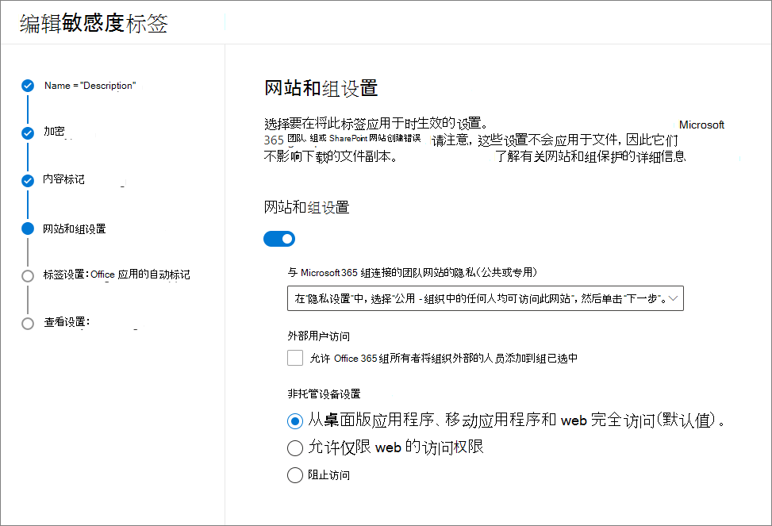

# <a name="use-sensitivity-labels-to-protect-content-in-microsoft-teams-microsoft-365-groups-and-sharepoint-sites"></a>使用敏感度标签保护 Microsoft Teams、Microsoft 365 组和 SharePoint 网站中的内容

>*[Microsoft 365 安全性与合规性许可指南](https://aka.ms/ComplianceSD)。*

除了使用[敏感度标签](sensitivity-labels.md)来分类和保护文档和电子邮件之外，你还可以使用敏感度标签来保护以下容器中的内容：Microsoft Teams 网站、Microsoft 365 组（[以前称为 Office 365 组](https://techcommunity.microsoft.com/t5/microsoft-365-blog/office-365-groups-will-become-microsoft-365-groups/ba-p/1303601)）和 SharePoint 网站。 对于此容器级别分类和保护，请使用以下标签设置：

- 与 Microsoft 365 组连接的团队网站的隐私（公共或专用）
- 外部用户访问
- 非托管设备的访问 

如果你将此敏感度标签应用于受支持的容器，此标签会自动向连接的网站或组应用分类和保护设置。

但是，这些容器中的内容不会继承用于分类和设置的标签，例如标签名称、视觉标记或加密。 这样，用户可以标记 SharePoint 网站或团队网站中的文档，确保[为 SharePoint 和 OneDrive 中的 Office 文件启用敏感度标签](sensitivity-labels-sharepoint-onedrive-files.md)。

> [!NOTE]
> Office 365 内容交付网络 (CDN) 不支持容器的敏感度标签。

## <a name="using-sensitivity-labels-for-microsoft-teams-microsoft-365-groups-and-sharepoint-sites"></a>将敏感度标签用于 Microsoft Teams、Microsoft 365 组和 SharePoint 网站

在你为容器启用敏感度标签并为新设置配置敏感度标签之前，用户可在其应用中查看和应用敏感度标签。 例如，在 Word 中：


为容器启用并配置敏感度标签后，用户还可查看敏感度标签并将其应用于 Microsoft 团队网站、Microsoft 365 组和 SharePoint 网站。 例如，在从 SharePoint 创建新的团队网站时：


## <a name="how-to-enable-sensitivity-labels-for-containers-and-synchronize-labels"></a>如何为容器启用敏感度标签和同步标签

1. 由于此功能使用 Azure AD 功能，因此请按照以下 Azure AD 文档中的说明来启用敏感度标签支持：[在 Azure Active Directory 中向 Microsoft 365 组分配敏感度标签](https://docs.microsoft.com/azure/active-directory/users-groups-roles/groups-assign-sensitivity-labels)。

2. 现在，你需要将敏感度标签同步到 Azure AD。 首先，[连接到 Office 365 安全与合规中心 PowerShell](/powershell/exchange/office-365-scc/connect-to-scc-powershell/connect-to-scc-powershell)。 
    
    例如，在以管理员身份运行的 PowerShell 会话中，使用全局管理员帐户登录：
    
    ```powershell
    Set-ExecutionPolicy RemoteSigned
    $UserCredential = Get-Credential
    $Session = New-PSSession -ConfigurationName Microsoft.Exchange -ConnectionUri https://ps.compliance.protection.outlook.com/powershell-liveid/ -Credential $UserCredential -Authentication Basic -AllowRedirection
    Import-PSSession $Session -DisableNameChecking
    ```

3. 然后运行以下命令，以确保可将敏感度标签与 Microsoft 365 组配合使用：
    
    ```powershell
    Execute-AzureAdLabelSync
    ```

## <a name="how-to-configure-site-and-group-settings"></a>如何配置网站和组设置

你现已可创建或编辑要提供给网站和组使用敏感度标签。 为容器启用敏感度标签后，敏感度标签向导中会显示一个新页面，即“**网站和组设置**”

如果在创建或编辑敏感度标签方面需要帮助，请查看[创建和配置敏感度标签](create-sensitivity-labels.md#create-and-configure-sensitivity-labels)中的说明。

在这个新的“**网站和组设置**”页面中，配置以下设置：

- **连接 Office 365 组的团队网站的隐私**：如果希望你组织中的每个人都可访问应用了此标签的团队网站或组，请保留“**公用 - 组织中的任何人都可访问站点**”的默认设置。
    
    如果要将访问权限限制为仅允许组织中的已批准成员，请选择“**专用**”。
    
    如果希望使用敏感度标签保护容器中的内容，但仍允许用户自行配置隐私设置，请选择“**无 - 让用户选择谁可以访问该网站**”。
    
    “**公用**”或“**专用**”的设置可在你将此标签应用到容器时设置和锁定隐私设置。 你选择的设置将替换之前可能已为团队或组配置的任何隐私设置，并锁定隐私值，因此只有先从容器中删除敏感度标签才能更改它。 在你删除敏感度标签后，标签中的隐私设置仍保留，用户现在可以再次更改它。

- **外部用户访问**：控制组所有者是否可[向组添加来宾](/office365/admin/create-groups/manage-guest-access-in-groups)。

- **未托管的设备**：对于[未托管的设备](/sharepoint/control-access-from-unmanaged-devices)，允许完全访问、仅限 Web 的访问或完全阻止访问。 如果你已在租户级别或针对特定网站配置了此设置，则只有当你在此处指定的设置限制性更强时才会应用。



> [!IMPORTANT]
> 将标签应用于团队、组或网站时，只有这些网站和组设置会生效。 其他标签设置（例如加密和内容标记）不适用于团队、组或网站中的内容。
> 
> 正在逐步向租户推出：当用户创建团队、组和网站时，只有带有网站和组设置的标签才可供选择。 如果当前可以向容器应用未启用网站和组设置的标签，只有标签名称会应用于容器。

如果尚未发布敏感度标签，现可通过[将其添加到敏感度标签策略](create-sensitivity-labels.md#publish-sensitivity-labels-by-creating-a-label-policy)进行发布。 分配有含有此标签的敏感度标签策略的用户，将能够为网站和组选择。

根据标签策略，在向容器应用此标签时，只有策略设置“默认将此标签应用于文档和电子邮件”**** 适用。 其他策略设置都不会应用，包括强制标记、需要用户理由和自定义帮助页面链接。

## <a name="sensitivity-label-management"></a>敏感度标签管理

在创建、修改或删除为网站和组配置的敏感度标签时，请使用以下指南。

### <a name="creating-and-publishing-labels-that-are-configured-for-sites-and-groups"></a>创建和发布为网站和组配置的标签

创建并发布敏感度标签后，团队、组和网站中的用户最长可能需要 24 小时才能看到该标签。 为网站和组设置配置标签后，请按照以下指南为你的用户发布标签：

1. 创建并配置敏感度标签后，将此标签添加到仅应用于少数测试用户的标签策略。

2. 等待 24 小时。

3. 在此等待期之后，使用测试用户帐户之一，创建具有在步骤 1 中创建的标签的团队、Microsoft 365 组或 SharePoint 网站。

4. 如果在此创建操作过程中没有错误，表示可以安全地为租户中的所有用户发布标签。

### <a name="modifying-published-labels-that-are-configured-for-sites-and-groups"></a>修改为网站和组配置的已发布标签

最佳做法是，在为团队、组或网站应用标签后，不要更改敏感度标签的网站和组设置。 如果这样做，最多需要 3 天的时间才能将更改复制到应用了标签的所有容器。 

此外，如果所做的更改包括**外部用户访问**设置：

- 新设置仅适用于新用户，并不适用于现有用户。 例如，如果以前选择了此设置，并且来宾用户访问了网站，则在标签配置中清除此设置后，这些来宾用户仍可访问该网站。

- 组属性 hiddenMembership 和 roleEnabled 的隐私设置不会更新。


### <a name="deleting-published-labels-that-are-configured-for-sites-and-groups"></a>删除为网站和组配置的已发布标签

如果删除已启用网站和组设置的敏感度标签，且该标签包含在一个或多个标签策略中，则此操作可能会导致新团队、组和网站的创建失败。 若要避免这种情况，请使用以下指南：

1. 从包含敏感度标签的所有标签策略中删除该标签。

2. 等待 48 小时。

3. 在此等待期之后，尝试创建团队、组或网站，并确认标签不再可见。

4. 如果敏感度标签不可见，则现在可以安全地删除该标签。

## <a name="how-to-apply-sensitivity-labels-to-containers"></a>如何将敏感度标签应用于容器

现在可将一个或多个敏感度标签应用于以下容器：

- [Azure AD 中的 Microsoft 365 组](#apply-sensitivity-labels-to-microsoft-365-groups)
- [Microsoft Teams 团队网站](#apply-a-sensitivity-label-to-a-new-team)
- [Outlook 网页版中的 Microsoft 365 组](#apply-a-sensitivity-label-to-a-new-group-in-outlook-on-the-web)
- [SharePoint 网站](#apply-a-sensitivity-label-to-a-new-site)

如果需要[将敏感度标签应用于多个网站](#use-powershell-to-apply-a-sensitivity-label-to-multiple-sites)，则可以使用 PowerShell。

### <a name="apply-sensitivity-labels-to-microsoft-365-groups"></a>将敏感度标签应用于 Microsoft 365 组

现在可将一个或多个敏感度标签应用于 Microsoft 365 组。 请返回到 Azure AD 文档查看说明：

- [在 Azure 门户中为新组分配标签](https://docs.microsoft.com/azure/active-directory/users-groups-roles/groups-assign-sensitivity-labels#assign-a-label-to-a-new-group-in-azure-portal)

-  [为 Azure 门户中的现有组分配标签](https://docs.microsoft.com/azure/active-directory/users-groups-roles/groups-assign-sensitivity-labels#assign-a-label-to-an-existing-group-in-azure-portal)

-  [从 Azure 门户中的现有组中删除标签](https://docs.microsoft.com/azure/active-directory/users-groups-roles/groups-assign-sensitivity-labels#remove-a-label-from-an-existing-group-in-azure-portal)。

### <a name="apply-a-sensitivity-label-to-a-new-team"></a>为新团队应用敏感度标签

在 Microsoft Teams 中创建新团队时，用户可以选择敏感度标签。 如果用户从“敏感度”**** 下拉列表中选择标签，隐私设置可能会更改，以反映标签配置。 根据为标签选择的外部用户访问设置，用户可以或不能将组织外部人员添加到团队中。

[了解有关 Teams 的敏感度标签的详细信息](https://docs.microsoft.com/microsoftteams/sensitivity-labels)


创建团队后，敏感度标签将显示在所有频道的右上角。


该服务会自动将相同的敏感度标签应用于 Microsoft 365 组和连接的 SharePoint 团队网站。

### <a name="apply-a-sensitivity-label-to-a-new-group-in-outlook-on-the-web"></a>应用敏感度标签至 Outlook 网页版的新组

在 Outlook 网页版中，创建新组时可选择或更改已发布的标签的“**敏感度**”选项：


### <a name="apply-a-sensitivity-label-to-a-new-site"></a>为新网站应用敏感度标签

管理员和最终用户可以在[创建新式团队网站和通信网站时](/sharepoint/create-site-collection)选择敏感度标签，并展开“高级设置”****：


下拉列表框显示选择的标签名称，帮助图标显示所有标签名称及其工具提示，这可帮助用户确定要应用的正确标签。

在标签应用后，当用户浏览网站时，可以看到标签名称和所应用的策略。 例如，此网站标记为“机密”****，且隐私设置设为“私有”****：


### <a name="use-powershell-to-apply-a-sensitivity-label-to-multiple-sites"></a>使用 PowerShell 将敏感度标签应用于多个网站

你可以将 [Set-SPOSite](/powershell/module/sharepoint-online/set-sposite?view=sharepoint-ps) 和 [Set-SPOTenant](/powershell/module/sharepoint-online/set-spotenant?view=sharepoint-ps) cmdlet 与当前 SharePoint Online 命令行管理程序中的 *SensitivityLabel* 参数一起使用，以将敏感度标签应用于多个网站。 网站可以是任何 SharePoint 网站集或 OneDrive 网站。

请确保你拥有 SharePoint Online 命令行管理程序的 16.0.19418.12000 或更高版本。

1. 使用“**以管理员身份运行**”选项打开 PowerShell 会话。

2. 如果你不知道标签 GUID：[连接到 Office 365 安全与合规中心 PowerShell](https://docs.microsoft.com/powershell/exchange/office-365-scc/connect-to-scc-powershell/connect-to-scc-powershell?view=exchange-ps)，获取敏感度标签及其 GUID 的列表。
    
    ```powershell
    Get-Label |ft Name, Guid
    ```

3. 现在[连接到 Exchange Online PowerShell](https://docs.microsoft.com/powershell/exchange/exchange-online/connect-to-exchange-online-powershell/connect-to-exchange-online-powershell?view=exchange-ps) 并将标签 GUID 存储为变量。 例如： 
    
    ```powershell
    $Id = [GUID]("e48058ea-98e8-4940-8db0-ba1310fd955e")
    ```

4. 创建一个新变量，用于标识在其 URL 中有共同标识字符串的多个网站。 例如：
    
    ```powershell
    $sites = Get-SPOSite -IncludePersonalSite $true -Limit all -Filter "Url -like 'documents" 
    ```

5. 运行以下命令以将标签应用于这些网站。 使用我们的示例：
    
    ```powershell
    $sites | ForEach-Object {Set-SpoTenant $_.url -SensitivityLabel $Id}
    ```

若要为不同的网站应用不同的标签，请为每个网站重复以下命令：`Set-SPOSite -Identity <URL> -SensitivityLabel "<labelguid>"`

## <a name="view-and-manage-sensitivity-labels-in-the-sharepoint-admin-center"></a>在 SharePoint 管理中心中查看和管理敏感度标签

若要查看、排序和搜索已应用的敏感度标签，请使用新 SharePoint 管理中心中的“**活动网站**”页面。 可能需要先添加“**敏感度**”列：


有关从“活动网站”页面管理网站（包括如何添加列）的详细信息，请参阅[管理新 SharePoint 管理中心中的网站](/sharepoint/manage-sites-in-new-admin-center)。

你也可以从此页面更改和应用标签：

1. 单击网站名称以打开“详细信息”窗格。

2. 选择“**策略**”选项卡，然后为“**敏感度**”设置选择“**编辑**”。

3. 从“**编辑敏感度设置**”窗格中，选择要应用于该网站的敏感度标签，然后选择“**保存**”。

## <a name="support-for-sensitivity-labels"></a>敏感度标签支持

以下应用和服务支持为网站和组设置配置的敏感度标签：

- 管理中心：
    - SharePoint 管理中心
    - Azure Active Directory 高级版
    - Microsoft 365 合规中心、Microsoft 365 安全中心、Office 365 安全与合规中心

- 用户应用和服务：
    - SharePoint
    - Teams
    - Outlook 网页版以及 Windows、MacOS、iOS 和 Android 版 Outlook
    - Forms
    - Stream

以下应用和服务目前不支持为网站和组设置配置的敏感度标签：

- 管理中心：
    - Microsoft 365 管理中心
    - Teams 管理中心
    - Exchange 管理中心

- 用户应用和服务：
    - Dynamics 365
    - Yammer
    - Planner
    - Project
    - PowerBI

## <a name="classic-azure-ad-group-classification"></a>经典 Azure AD 组分类

为容器启用敏感度标签后，Microsoft 365 不再支持新 Microsoft 365 组和 SharePoint 网站的旧分类。 但是，除非进行转换以使用敏感度标签，否则支持敏感度标签的现有组和网站仍会显示旧分类值。

有关如何使用 SharePoint 的旧组分类的示例，请参阅 [SharePoint “新式”网站分类](https://docs.microsoft.com/sharepoint/dev/solution-guidance/modern-experience-site-classification)。

这些分类通过使用 Azure AD PowerShell 或 PnP Core 库以及定义 `ClassificationList` 设置值来进行配置。 如果租户定义了分类值，则在 [AzureADPreview PowerShell 模块](https://www.powershellgallery.com/packages/AzureADPreview)中运行以下命令时，将显示这些分类值：

```powershell
   ($setting["ClassificationList"])
```

若要将旧分类转换为敏感度标签，请执行下列操作之一：

- 使用现有标签：通过编辑已发布的现有敏感度标签，指定你希望网站和组使用的标签设置。

- 创建新标签：通过创建和发布与你的现有分类名称相同的新的敏感度标签，指定你希望网站和组使用的标签设置。

则： 

1. 使用 PowerShell 将敏感度标签应用至使用名称映射的现有 Microsoft 365 组和 SharePoint 网站。 相关说明，请参见下一节。

2. 删除现有组和网站中的旧分类。

虽然无法阻止用户在尚不支持敏感度标签的应用和服务中创建新组，但可运行定期 PowerShell 标签来查看用户已使用旧分类创建的新组，并转换这些分类以使用敏感度标签。 

为了帮助管理网站和组的敏感度标签与 Azure AD 分类的共存，请参阅[适用于 Microsoft 365 组的 Azure Active Directory 分类和敏感度标签](migrate-aad-classification-sensitivity-labels.md)。

#### <a name="use-powershell-to-convert-classifications-for-microsoft-365-groups-to-sensitivity-labels"></a>使用 PowerShell 将 Microsoft 365 组的分类转换为敏感度标签

1. 首先，[连接到 Office 365 安全与合规中心 PowerShell](/powershell/exchange/office-365-scc/connect-to-scc-powershell/connect-to-scc-powershell)。 
    
    例如，在以管理员身份运行的 PowerShell 会话中，使用全局管理员帐户登录：
    
    ```powershell
    Set-ExecutionPolicy RemoteSigned
    $UserCredential = Get-Credential
    $Session = New-PSSession -ConfigurationName Microsoft.Exchange -ConnectionUri https://ps.compliance.protection.outlook.com/powershell-liveid/ -Credential $UserCredential -Authentication Basic -AllowRedirection
    Import-PSSession $Session -DisableNameChecking
    ```

2. 通过运行 [ Get-Label ](https://docs.microsoft.com/powershell/module/exchange/get-label?view=exchange-ps) cmdlet 获取敏感度标签及 GUID 列表：
    
    ```powershell
    Get-Label |ft Name, Guid
    ```

3. 记下你想要应用到 Microsoft 365 组的敏感度标签的 Guid。

4. 立即[连接 Exchange Online PowerShell](https://docs.microsoft.com/powershell/exchange/exchange-online/connect-to-exchange-online-powershell/connect-to-exchange-online-powershell?view=exchange-ps)。
    
    例如：
    
    ```powershell
    $UserCredential = Get-Credential
    $Session = New-PSSession -ConfigurationName Microsoft.Exchange -ConnectionUri https://outlook.office365.com/powershell-liveid/ -Credential $UserCredential -Authentication Basic -AllowRedirection
    Import-PSSession $Session
    ```

5. 以下列命令为例，获取当前具有“常规”分类的组列表：

   ```PowerShell
   $Groups= Get-UnifiedGroup | Where {$_.classification -eq "General"}
   ```

6. 对于每个组，添加新的敏感度标签 GUID。 例如：

    ```PowerShell
    foreach ($g in $groups)
    {Set-UnifiedGroup -Identity $g.Identity -SensitivityLabelId "457fa763-7c59-461c-b402-ad1ac6b703cc"}
    ```

7. 对剩下的组分类重复步骤 5 和 6。

## <a name="auditing-sensitivity-label-activities"></a>审核敏感度标签活动

如果有人将文档上传到受敏感度标签保护的网站上，该文档的敏感度标签的[优先级](sensitivity-labels.md#label-priority-order-matters)比该网站应用的敏感度标签高，且不会阻止此操作。 例如，你向 SharePoint 网站应用了“**常规**”标签，并且有人向此网站上传了一个标记为“**机密**”的文档。 对于优先级更低的内容来说，具有更高优先级的敏感度标签会识别敏感度高于此内容的内容，因此该情况可能会带来安全隐患。

虽然此操作未被阻止，但它经过审核，并会自动生成一封面向上传文档的人员和网站管理员的电子邮件。 因此，可识别存在这种标签优先级不一致情况的用户和管理员，并在必要时采取措施。 例如，从网站中删除或移动已上传的文档。 

如果文档的敏感度标签的优先级低于网站应用的敏感度标签，则不会出现安全问题。 例如，标有“**常规**”的文档上传到标有“**机密**”的网站上。 在这种情况中，不生成审核事件和电子邮件。

要搜索此事件的审核日志，请从“**文件和页面活动**”类别中查找“**检测到文档敏感度不匹配**”。 

自动生成的电子邮件具有主题“**检测到不兼容的敏感度标签**”，该电子邮件将说明标记不匹配，并提供指向已上传文档和网站的链接。 此外，它还包含说明用户可以如何更改敏感度标签的文档链接。 目前，无法禁用或自定义这些自动发送的电子邮件。

当有人向网站或组添加敏感度标签或从中删除敏感度标签时，也会审核这些活动，但不会自动生成电子邮件。 

可在“[敏感度标签活动](search-the-audit-log-in-security-and-compliance.md#sensitivity-label-activities)”类别中找到这些审核事件。 有关搜索审核日志的说明，请参阅[在安全与合规中心中搜索审核日志](search-the-audit-log-in-security-and-compliance.md)。

## <a name="how-to-disable-sensitivity-labels-for-containers"></a>如何禁用容器的敏感度标签

你可按照[在 PowerShell 中启用敏感度标签支持](https://docs.microsoft.com/azure/active-directory/users-groups-roles/groups-assign-sensitivity-labels#enable-sensitivity-label-support-in-powershell)中的相同说明，为 Microsoft Teams、Microsoft 365 组和 SharePoint 网站关闭敏感度标签。 但是，若要禁用此功能，请在步骤 5 中指定 `$setting["EnableMIPLabels"] = "False"`。

创建或编辑敏感度标签时，除了隐藏“**网站和组设置**”页面以外，此操作还可恢复容器用于其配置的属性。 为 Microsoft Teams、Microsoft 365 组和 SharePoint 网站启用敏感度标签会将使用的属性从**分类**（用于 [Azure AD 组分类](#classic-azure-ad-group-classification)）切换为**敏感度**。 当禁用容器的敏感度标签时，容器将忽略敏感度属性并再次使用“分类”属性。

这意味着不会强制实施先前应用到容器的网站和组中的任何标签设置，并且容器不再显示标签。

如果这些容器应用了 Azure AD 分类值，则它们将再次恢复为使用分类。 请注意，在启用此功能后创建的任何新网站或组都不会显示标签或具有分类。 对于这些容器以及所有新容器，现在可以应用分类值。 有关详细信息，请参阅 [SharePoint“新式”网站分类](https://docs.microsoft.com/sharepoint/dev/solution-guidance/modern-experience-site-classification)和[为组织中的 Office 组创建分类](https://docs.microsoft.com/office365/enterprise/powershell/manage-office-365-groups-with-powershell)。

## <a name="additional-resources"></a>其他资源

如需有关[通过 Microsoft Teams、O365 组和 SharePoint Online 网站使用敏感度标签](https://techcommunity.microsoft.com/t5/security-privacy-and-compliance/using-sensitivity-labels-with-microsoft-teams-o365-groups-and/ba-p/1221885#M1380)的信息，请参阅网络研讨会的记录和回答的问题。

在录制此网络研讨会时该功能仍处于预览阶段，因此你可能会发现 UI 存在某些差异。 但是，此功能的信息仍准确无误，并且该页面记录了所有新功能。
