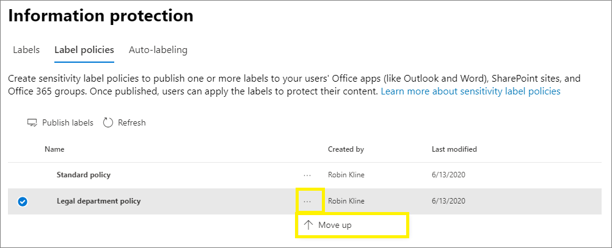

# 了解敏感度标签

>*[Microsoft 365 安全性与合规性许可指南](/office365/servicedescriptions/microsoft-365-service-descriptions/microsoft-365-tenantlevel-services-licensing-guidance/microsoft-365-security-compliance-licensing-guidance)。*

> [!NOTE]
> 如果要查找 Office 应用中可看到的敏感度标签的信息，请参阅 [Office](https://support.microsoft.com/topic/apply-sensitivity-labels-to-your-files-and-email-in-office-2f96e7cd-d5a4-403b-8bd7-4cc636bae0f9)中的文件和电子邮件应用敏感度标签。
>
> 本页上的信息适用于可创建和配置这些标签的 IT 管理员。

组织内人员需要与组织内外的其他人员协作，才能完成工作。也就是说，内容不再一直停留在防火墙后面，而是可跨设备、应用和服务到处漫游。你希望内容的漫游方式不仅安全、受保护，还符合组织的业务和合规性策略。

通过Microsoft 信息保护框架中的灵敏度标签，可以对组织的数据进行分类和保护，同时确保用户工作效率及其协作能力不受影响。

示例显示了 Excel 中功能区 **Home** 选项卡上可用的灵敏度标签。 在此示例中，状态栏上将显示已应用的标签：

若要应用敏感度标签，用户必须使用其 Microsoft 365 工作或学校帐户登录。

> [!NOTE]
> 对于美国政府租户，现在所有平台都已支持敏感度标签。
>
> 如果使用 Azure 信息保护统一标签客户端和扫描程序，请参阅 [Azure 信息保护高级版政府服务说明](/enterprise-mobility-security/solutions/ems-aip-premium-govt-service-description)。

借助敏感度标签，你可以：
  
- **提供包含加密和内容标记的保护设置。** 例如，将“机密”标签应用于文档或电子邮件，该标签将加密内容并应用“机密”水印。 内容标记包括页眉和页脚以及水印，加密还可以限制授权人员对内容执行的操作。

- **跨不同平台和设备保护 Office 应用中的内容。** 受 Office 桌面应用和 Office 网页版中的 Word、Excel、PowerPoint 和 Outlook 支持。 在 Windows、macOS、iOS 和 Android 上受支持。

- 利用 Microsoft 云应用安全性 **保护第三方应用和服务中的内容**。 借助 Cloud App Security，可检测、分类、标记和保护第三方服务和应用（如 SalesForce、Box 或 Dropbox）中的内容，即使第三方应用或服务无法读取或不支持敏感度标签也不例外。

- **保护容器**，包括 Teams、Microsoft 365 组和 SharePoint 网站。 例如，设置隐私设置、外部用户访问权限和外部共享，以及来自非托管设备的访问。

- **将敏感度标签扩展到 Power BI**：启用此功能后，可以在 Power BI 中应用和查看标签，并在数据保存在服务之外时保护数据。

- **将敏感度标签扩展到 Azure 权限中的资产**：当前预览版中打开此功能时，您可以将敏感度标签应用于资产，如 SQL 列、Azure Blob 存储中的文件等。 

- **将敏感度标签扩展到第三方应用程序和服务。** 使用 Microsoft 信息保护 SDK，则第三方应用程序可读取敏感度标签并应用保护设置。

- **对内容进行分类，无需使用任何保护设置。** 你也可以简单地分配一个标签作为对内容进行分类的结果。 这将为用户提供分类到组织标签名称的直观映射，并且可以使用标签生成使用情况报告和查看敏感内容的活动数据。 根据此类信息，稍后随时可以选择应用保护设置。

在上述所有情况下，Microsoft 365 中的敏感度标签都可有助于对正确的内容执行适当的操作。借助敏感度标签，可对整个组织中的数据进行分类，并根据此分类执行保护设置。

有关受敏感度标签支持的这些和其他场景的详细信息，请参阅[敏感度标签的常见场景](get-started-with-sensitivity-labels.md#common-scenarios-for-sensitivity-labels)。 目前正在开发支持敏感度标签的新功能，因此你可能还会发现参考 [Microsoft 365 路线图](https://aka.ms/MIPC/Roadmap)非常有用。

## 什么是敏感度标签

为内容分配敏感度标签时，它就像是应用的标记，并且：

- **可自定义。** 根据组织和业务需求，你可以为组织中不同级别的敏感内容创建类别。 例如，个人、公共、常规、机密、高度机密。

- **清除文本。** 由于标签以明文的方式存储在文件和电子邮件的元数据中，因此第三方应用和服务可以读取它，然后根据需要应用其自己的保护操作。

- **永久。** 由于标签存储在文件和电子邮件的元数据中，因此无论保存或存储在何处，该标签都会与内容一起漫游。 唯一的标签标识将成为应用和实施你配置的策略的基础。

当用户查看时，敏感度标签就像他们使用的应用上的标记一样，可以轻松地集成到其现有的工作流程中。

支持敏感度标签的每个项目都可以应用单一敏感度标签。 文档和电子邮件可同时具有敏感度标签和[保留标签](retention.md#retention-labels)应用。

> [!div class="mx-imgBorder"]
> 

## 敏感度标签有何用途

电子邮件或文档应用有敏感度标签后，系统便会对内容强制执行相应标签的任何已配置的保护设置。可将敏感度标签配置为：

- **加密** 电子邮件和文档，以防止未经授权的人员访问该数据。 你还可以选择哪些用户或组有权执行哪些操作以及执行多长时间。 例如，你可以选择允许组织中的所有用户修改文档，而其他组织中的特定组只能查看该文档。 或者，可允许用户在应用标签时分配对内容的权限，而不是管理员分配权限。 
    
    有关创建或编辑敏感度标签时的“**加密**”设置的详细信息，请参阅 [使用敏感度标签中的加密限制对内容的访问](encryption-sensitivity-labels.md)。

- 使用 Office 应用时 **对内容进行标记**：方法是向已应用标签的电子邮件或文档添加水印、页眉或页脚。 水印可应用于文档，但不能用于电子邮件。 页眉和水印示例：
    
    
    
    需要检查何时应用内容标记？ 请参阅 [Office 应用何时应用内容标记和加密](sensitivity-labels-office-apps.md#when-office-apps-apply-content-marking-and-encryption)。
    
    某些应用程序（而非所有应用）通过使用变量来支持动态标记。 例如，在页眉、页脚或水印中插入标签名称或文档名称。 有关详细信息，请参阅[带变量的动态标记](sensitivity-labels-office-apps.md#dynamic-markings-with-variables)。
    
    字符串长度：水印的长度限制为 255 个字符。 页眉和页脚限制为 1024 个字符，但 Excel 中除外。 对于页眉和页脚，Excel 总限制为 255 个字符，但此限制包括不可见的字符，例如格式代码。 如果超出该限制，则你输入的字符串将不会在 Excel 中显示。

- 启用相应功能以 [将敏感度标签用于 Microsoft Teams、Microsoft 365 组和 SharePoint 网站](sensitivity-labels-teams-groups-sites.md)时，**可保护网站和组等容器中的内容**。
    
    如果启用此功能，则无法为组和网站配置保护设置。 此标签配置不会导致自动标记文档或电子邮件，而是通过控制对存储内容的容器的访问来保护内容。 这些设置包括隐私设置、外部用户访问权限和外部共享，以及来自非托管设备的访问。

- **将标签应用到文本和电子邮件，或推荐的标签内。** 你可以选择要标记的敏感信息类型，标签可以自动应用，也可以提示用户应用你推荐的标签。如果你推荐标签，则提示会显示你选择的任何文本。例如：
    
    
    
    有关创建或编辑敏感度标签时的“**文件和电子邮件的自动标记**”设置的详细信息，请参阅 [将敏感度标签自动应用于内容](apply-sensitivity-label-automatically.md)（对于 Office 应用）和 [在 Azure Purview 中自动标记数据](/azure/purview/create-sensitivity-label)。

### 标记范围

创建灵敏度标签时，系统会要求你配置标签的范围，该范围决定了两件事：
- 可为该标签配置的标签设置
- 用户将可以看到标签的位置

此范围配置使你可以拥有仅适用于文档和电子邮件但不能选择用于容器的敏感度标签。 同样地，仅适用于容器的敏感度标签则不能选择用于文件和电子邮件。 新的和当前处于预览版中，您还可以选择 Azure 权限资产的范围：

默认情况下，始终选择 **"文件和电子邮件"** 范围。 默认情况下，当为租户启用功能时，会选择其他作用域：

- **组和网站**: [为容器启用敏感度标签和同步标签](sensitivity-labels-teams-groups-sites.md#how-to-enable-sensitivity-labels-for-containers-and-synchronize-labels)

- **Azure Purview 素材（预览版）**：[在 Azure Purview 中自动标记内容](/azure/purview/create-sensitivity-label)

如果更改默认值，以便未选择所有作用域，则会看到尚未选择的范围的配置设置的第一页，但无法配置这些设置。 例如，如果未选中“文件和电子邮件”的范围，则不能选择下一页上的选项：

对于具有不可用选项的这些页面，选择 **“下一步”** 继续。 或者，选择 **“返回”** 更改标签的范围。

### 标签优先级（顺序非常重要）

如果在管理中心内创建敏感度标签，标签显示在 **“标签”** 页上 **“敏感度”** 选项卡中的列表内。此列表中的标签顺序非常重要，因为它反映了标签优先级。建议让限制最多的敏感度标签（如“高度机密”）显示在列表最 **下面**，并让限制最少的敏感度标签（如“公开”）显示在列表最 **上面**。

可仅将一个敏感度标签应用于文档、电子邮件或容器等项目。 如果设置的选项需要用户提供将标签更改为较低分类的理由，理由可以是此列表的排序，因为它会标识较低分类。 但是，此选项不适用于共享其父标签优先级的子标签。

子标签的排序与[自动标签](apply-sensitivity-label-automatically.md)结合使用。 将标签配置为自动应用或推荐时，多个匹配项可能会导致出现多个标签。 要确定要应用或推荐的标签，请使用标签排序：选择最不敏感的标签，如果适用，选择最后一个子标签。

### 子标签（对标签进行分组）

使用子标签，你可以对用户在 Office 应用中看到的父标签下的一个或多个标签进行分组。例如，在“保密”下，你的组织可能会对该分类的具体类型使用多种不同的标签。在本示例中，父标签“保密”只是一个没有保护设置的文本标签，而且因为它具有子标签，因此无法应用于内容。相反，用户必须选择“保密”以查看子标签，然后他们可以选择要应用于内容的子标签。

子标签只是向逻辑组中的用户显示标签的一种方式。 子标签不会从其父标签继承任何设置。 为用户发布子标签时，该用户可以将该子标签应用于内容，但不能仅应用父标签。

不要选择父标签作为默认标签，也不要将父标签配置为自动应用（或推荐）。 如果执行此操作，则不会将父标签应用于内容。

子标签如何向用户显示的示例：

### 编辑或删除敏感度标签

如果在管理中心内删除敏感度标签，标签并未从内容中删除，并且将继续对已标记内容强制执行所有保护设置。

如果编辑敏感度标签，应用于内容的标签版本就是对相应内容强制执行的标签。

## 标签策略有何用途

创建灵敏度标签后，需要进行发布，以便组织中的人员和服务可以使用它们。 然后，敏感度标签可以应用于 Office 文档和电子邮件以及其他支持敏感度标签的项目。 

与发布到诸如所有 Exchange 邮箱等位置的保留标签不同，敏感标签发布到用户或组。 然后，支持敏感度标签的应用可以将它们显示为应用标签或可以应用的标签。

配置标签策略时，可以执行以下操作：

- **选择可查看标签的用户和组。** 可以将标签发布到 Azure AD 中任何特定用户或启用电子邮件的安全组、通讯组或 Microsoft 365 组（它们可以具有[动态成员身份](/azure/active-directory/users-groups-roles/groups-create-rule)）。

- 为未标记文档和电子邮件以及新建容器 **指定默认标签**（在已 [为 Microsoft Teams、Microsoft 365 组和 SharePoint 网站启用敏感度标签](sensitivity-labels-teams-groups-sites.md) 时），然后现在 [为 Power BI 内容](/power-bi/admin/service-security-sensitivity-label-default-label-policy) 指定默认标签。 你可以为所有四种类型项目指定相同或不同的标签。 用户可以更改已应用的默认敏感度标签，以更好地匹配其内容或容器的敏感度。
    
    > [!NOTE]
    > 针对使用内置标签的 Office 应用推出：此设置在用户打开现有文档时支持现有文档，以及新建文档。 这种行为更改提供了与 Azure 信息保护统一标记客户端同等的功能。 有关每个应用的推出和最低版本的详细信息，请参阅 word、Excel 和 PowerPoint 的 [功能表](sensitivity-labels-office-apps.md#sensitivity-label-capabilities-in-word-excel-and-powerpoint)。
    
    考虑使用默认标签来设置你想要应用于所有内容的基本级别的保护设置。 但是，如果没有用户培训和其他控件，此设置也会导致标签不准确。 最好不要选择应用加密的标签作为文档的默认标签。 例如，许多组织需要向外部用户发送并与其共享文档，这些用户可能不具有支持加密的应用，或者他们可能未使用可以获得授权的帐户。 有关此方案的详细信息，请参阅[与外部用户共享加密的文档](sensitivity-labels-office-apps.md#sharing-encrypted-documents-with-external-users)。
    
    > [!IMPORTANT]
    > 如果具有 [子标签](#sublabels-grouping-labels)，请注意不要将父标签配置为默认标签。

- **要求提供更改标签的理由。** 如果用户尝试删除标签，或将其替换为有较低订单号的标签，则你可以要求用户提供一个理由来执行此操作。 例如，用户打开一个标记为“机密”（订单号 3）的文档，并将该标签替换为一个名为“公共”（订单号 1）的文档。 对于 Office 应用，当使用内置标签时，每个应用会话都会触发该理由提示，而当使用 Azure 信息保护的统一标签客户端时，每个文件则都会触发。 管理员可以阅读活动资源管理器或网站中的 [更改](data-classification-activity-explorer.md)。

    

- **要求用户将标签应用** 于文档和电子邮件、仅文档、容器及 Power BI 内容。 也称为强制标记，这些选项确保在用户保存文档、发送电子邮件、创建新的组或网站之前，以及当他们为 Power BI 使用未标记的内容时必须应用标签。
    
    该标签可由用户手动分配，由于您配置的条件或默认分配的条件（如上所述的 "默认标签" 选项）而自动分配。当用户需要分配标签时，以下为示例提示：

    
    
    有关文档和电子邮件的强制标签的详细信息，请参阅[要求用户应用标签到他们的电子邮件和文档](sensitivity-labels-office-apps.md#require-users-to-apply-a-label-to-their-email-and-documents)。
    
    对于容器，必须在创建组或网站时分配标签。
    
    有关 Power BI 强制标签的详细信息，请参阅 [Power BI 的强制标签策略](/power-bi/admin/service-security-sensitivity-label-mandatory-label-policy)。
    
    考虑使用此选项帮助增加标签的覆盖范围。 但是，如果没有用户培训，此设置也会导致标记不准确。 此外，除非你还设置了相应的默认标签，否则强制标记可能会使你的用户因更频繁地收到提示而感到沮丧。

- **提供指向自定义帮助页的帮助链接。** 如果用户不确定敏感度标签的含义或应如何使用标签，你可以提供在 Office 应用中 **敏感度标签** 菜单底部显示的“了解更多”URL：

    

创建为用户和组分配新敏感度标签的标签策略后，用户可在其 Office 应用中看到这些标签。 请留出长达 24 小时的时间将最新更改复制到整个组织内。

对于可创建和发布的敏感度标签不存在数量限制，但有一个例外情况：如果标签应用指定用户和权限的加密，则此配置最多支持 500 个标签。 但是，最佳做法是减少管理开销并降低用户复杂程度，尽量将标签的数量保持在最低限度。 事实证明，当用户拥有五个以上的主标签或者每个主标签拥有五个以上的子标签时，实际部署的效率就会显著降低。

### 标签策略优先级（顺序非常重要）

你可以通过在敏感度标签策略中发布敏感度标签来向用户提供敏感度标签，该策略显示在“**标签策略**”页的“**敏感度策略**”选项卡的列表中。 正如敏感度标签（参见[标签优先级（顺序非常重要）](#label-priority-order-matters)）一样，敏感度标签策略的顺序很重要，因为它反映了它们的优先级。 优先级最低的标签策略显示在 **顶部**，优先级最高的标签策略显示在 **底部**。

标签策略包括：

- 一组标签。
- 将分配带有标签策略的用户和组。
- 该作用域的策略和策略设置的范围（如文件和电子邮件的默认标签）。

可以在多个标签策略中包含某个用户，该用户将从这些策略中获取所有敏感度标签和设置。 如果多个策略的设置存在冲突，则应用具有最高优先级 (最低位置) 的策略设置。 换句话说，每个设置的最高优先级优先。

如果看不到你希望用于用户或组的标签或标签策略设置行为，请检查敏感度标签策略的顺序。 可能需要向下移动该策略。 若要重新排序标签策略，请选择某个敏感度标签策略 > 选择右侧的省略号 >“**下移**”或“**上移**”。

> [!NOTE]
> 请记住：如果分配了多个策略的用户的设置发生冲突，将应用优先级最高 (最低位置) 策略中的设置。

## 敏感度标签和 Azure 信息保护

在 Windows 计算机上的 Microsoft 365 应用中使用敏感度标签时，可选择使用 Office 应用或 Azure 信息保护客户端内置的标签。

默认情况下，安装 Azure 信息保护客户端时，将关闭这些应用中的内置标记功能。 有关详细信息（包括如何更改此默认行为），请参阅 [Office 内置标签客户端和 Azure 信息保护客户端](sensitivity-labels-office-apps.md#office-built-in-labeling-client-and-the-azure-information-protection-client)。

即使在 Office 应用中使用内置标签时，也可以将 Azure 信息保护统一标签客户端与灵敏度标签配合使用以实现以下目的：

- 扫描仪发现本地存储的敏感信息，然后（可选）为该内容添加标签

- 文件资源管理器中的右键单击选项让用户可将标签应用于所有文件类型

- 查看器显示文本、图像或 PDF 文档的加密文件

- PowerShell 模块发现本地文件中的敏感信息，然后应用或删除这些文件中的标签和加密

如果你不熟悉 Azure 信息保护，或者你是刚迁移标签的现有 Azure 信息保护客户，请参阅 Azure 信息保护文档中的[选择用于 Windows 计算机的标签客户端](/azure/information-protection/rms-client/use-client#choose-your-windows-labeling-solution)。

### Azure 信息保护标签

> [!NOTE]
> Azure 门户中的 Azure 信息保护标签的标签管理将于 **2021 年 3 月 31 日** 弃用。有关详细信息，请参阅官方 [弃用通知](https://techcommunity.microsoft.com/t5/azure-information-protection/announcing-timelines-for-sunsetting-label-management-in-the/ba-p/1226179)。

如果租户尚未位于统一 [标识平台](/azure/information-protection/faqs#how-can-i-determine-if-my-tenant-is-on-the-unified-labeling-platform)，必须先激活统一标签，才能使用敏感度标签。 有关说明，请参阅 [Azure 信息保护标签迁移到统一敏感度标签](/azure/information-protection/configure-policy-migrate-labels)。 

## 敏感度标签和 Microsoft 信息保护 SDK

由于敏感度标签存储在文档的元数据中，因此第三方应用和服务可以从此标签元数据读取标签元数据并写入内容，以补充标签部署。 此外，软件开发人员可以使用 [Microsoft 信息保护 SDK](/information-protection/develop/overview#microsoft-information-protection-sdk) 在多个平台之间全面支持标签和加密功能。 若要了解详细信息，请参阅[技术社区博客上的“正式发布”公告](https://techcommunity.microsoft.com/t5/Microsoft-Information-Protection/Microsoft-Information-Protection-SDK-Now-Generally-Available/ba-p/263144)。 

你还可以了解[与 Microsoft 信息保护集成的合作伙伴解决方案](https://techcommunity.microsoft.com/t5/Azure-Information-Protection/Microsoft-Information-Protection-showcases-integrated-partner/ba-p/262657)。

## 部署指南

有关部署规划和指南（包括许可信息、权限、部署策略、支持的方案列表和最终用户文档），请参阅 [敏感度标签入门](get-started-with-sensitivity-labels.md)。

如需了解如何使用敏感度标签以遵守数据隐私法规，请参阅[使用 Microsoft 365 为数据隐私法规部署信息保护](../solutions/information-protection-deploy.md) (aka.ms/m365dataprivacy)。
