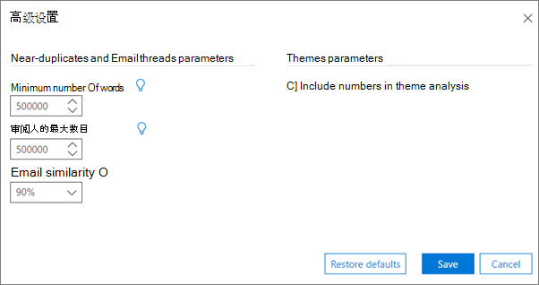

# 在高级电子数据展示中设置分析高级设置

> [!NOTE]
> Advanced eDiscovery requires an Office 365 E3 with the Advanced Compliance add-on or an E5 subscription for your organization. If you don't have that plan and want to try Advanced eDiscovery, you can [sign up for a trial of Office 365 Enterprise E5](https://go.microsoft.com/fwlink/p/?LinkID=698279). 
  
高级电子数据展示可提供分析模块设置的默认高级参数。 下面的过程介绍了可指定的设置。
  
1. 在 "**准备 \> 分析 \> 设置**" 选项卡上，单击页面底部的 "**高级设置**"。 将显示以下面板。 
    
    
  
2. 在 "**临近副本" 和 "电子邮件线程" 参数**中，根据需要选择以下值：
    
  - **最小单词数**：单词的最小数目，在以下情况下，不会将文件提交到接近重复的分析。 
    
  - **最大单词数**：单词的最大数目，超过该数目时不会将文件提交到接近重复的分析。
    
  - **电子邮件相似性**：将两封电子邮件视为相似的最小 resemblance 级别。 值始终等于或大于文档相似性。 默认值为90%。
    
3. 在 "**主题参数**" 中，选中 "将**数字包含在主题分析**中" 复选框，以在分析期间包含处理主题过程中的数字。 
    
4. 单击“保存”****。 
    
## 相关主题

[高级电子数据展示（经典）](office-365-advanced-ediscovery.md)
  
[了解文档相似性](understand-document-similarity-in-advanced-ediscovery.md)
  
[设置分析选项](set-analyze-options-in-advanced-ediscovery.md)
  
[设置忽略文本](set-ignore-text-in-advanced-ediscovery.md)
  
[查看分析结果](view-analyze-results-in-advanced-ediscovery.md)

