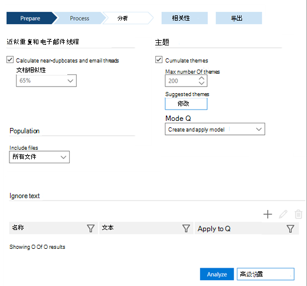

# 设置高级电子数据展示和经典 (分析) 

> [!NOTE]
> 若要使用高级电子数据展示，组织必须订阅随附高级合规性加载项的 Office 365 E3，或订阅 E5。如果没有此计划，但又要试用高级电子数据展示，可以[注册 Office 365 企业版 E5 试用版](https://go.microsoft.com/fwlink/p/?LinkID=698279)。 
  
在高级电子数据展示中，在运行分析之前设置分析选项。
  
## 设置分析选项

打开 **"准备 \> 分析** \> **设置"。** 将显示以下窗口。
  

  
 **近重复项和电子邮件线程** 如果要运行分析，请选中此框。 默认情况下选中此选项。 
  
 **文档相似性** 输入近重复阈值或接受默认值 65%。 
  
 **主题** 选中此框可处理所有文件并为其分配主题。 默认情况下，此复选框未选中。 如果要执行主题处理，请输入以下选项。
  
- **最大主题数** 输入或选择要创建的主题数的值。 默认值为 200。 
    
    > [!NOTE]
    > 增加主题数量会影响性能以及主题的一般化能力。 主题数量越高，主题越精细。 例如，如果一组 50 个主题包含主题，如"Basketball、Clipps、Clippers、Lakers";300 个主题可能包含单独的主题："小马"、"Clippers"、"Lakers"。 如果你对主题"Basketball"没有了解，并且对 ECA 使用此功能，则看到主题"Basketball"可能很有用。 但是，如果处理主题过多，你可能永远不会看到单词"Basketball"，并且可能不知道"小球"和"Clippers"是需要审阅的优秀"篮球"主题，而不是启动和用于发的项目。 
  
- **建议的主题** 你可以建议主题词来控制主题处理。 高级电子数据展示将侧重于这些建议词语，并尝试基于"主题最大数量"设置创建一个或多个相关主题。 
    
    例如，如果建议的单词是"computer"，并且你指定"2"作为"最大主题数"，则高级电子数据展示将尝试生成与单词"computer"相关的两个主题。 例如，这两个主题可能是"计算机软件"和"计算机硬件"。 
    
    
  
1. 若要查看、添加或编辑建议的主题，请单击"修改 **"。**
    
2. 在 **"建议的主题"** 面板中，单击 **"添加**  图标以添加主题。 在 **"添加建议的主题** "面板中，添加用逗号分隔的单词。 
    
3. 在 **"** 主题数量"中，选择一个值以确定高级电子数据展示将尝试为这些字词生成的主题数， (默认值为 1 个主题) 。
    
4. 单击 **"** 保存"，然后关闭对话。 
    
    > [!NOTE]
    > 主题总数包括建议主题。 建议主题总数不能超过主题总数。 如果有许多与总主题相关的建议主题，系统将仅检测到几个"新"主题，因为大多数主题将专用于"建议主题"。 
  
- **模式** 从下拉列表中，选择" **主题"** 选项： 
    
  - **创建和应用模型**：按一段文件按模型计算主题，然后分发其中的文件。
    
  - **创建模型**：从文件段计算主题模型。 划分文件的"应用"过程在另一个时间单独完成。
    
  - **应用模型**：此选项仅在之前创建且尚未应用模型时显示。 这将基于主题划分文件。
    
还可以设置[忽略文本，](set-ignore-text-in-advanced-ediscovery.md)[并设置分析高级设置以](set-analyze-advanced-settings-in-advanced-ediscovery.md)进行分析。 
  
设置这些选项后，单击" **分析"** 以运行。 [显示"查看](view-analyze-results-in-advanced-ediscovery.md) 分析结果"。 
  
## 相关主题

[高级电子数据展示（经典）](office-365-advanced-ediscovery.md)
  
[了解文档相似性](understand-document-similarity-in-advanced-ediscovery.md)
  
[设置忽略文本 ](set-ignore-text-in-advanced-ediscovery.md)
  
[设置分析高级设置](set-analyze-advanced-settings-in-advanced-ediscovery.md)
  
[查看分析结果](view-analyze-results-in-advanced-ediscovery.md)

