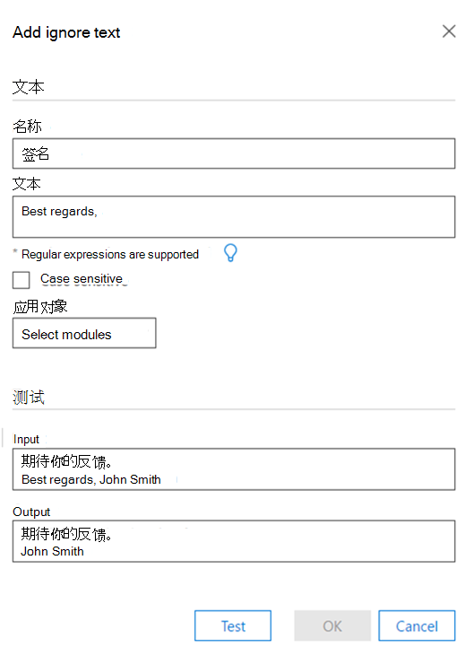
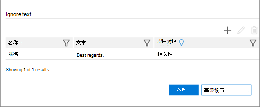

# 设置"忽略文本"选项以在高级电子数据展示和经典 (分析) Set Ignore Text option for Analyze in Advanced eDiscovery (classic)

> [!NOTE]
> 若要使用高级电子数据展示，组织必须订阅随附高级合规性加载项的 Office 365 E3，或订阅 E5。如果没有此计划，但又要试用高级电子数据展示，可以[注册 Office 365 企业版 E5 试用版](https://go.microsoft.com/fwlink/p/?LinkID=698279)。Advanced eDiscovery requires an Office 365 E3 with the Advanced Compliance add-on or an E5 subscription for your organization. If you don't have that plan and want to try Advanced eDiscovery, you can [sign up for a trial of Office 365 Enterprise E5](https://go.microsoft.com/fwlink/p/?LinkID=698279). 
  
忽略文本功能可应用于以下所有或任一高级电子数据展示模块：分析 (近重复项、电子邮件线程、主题) 和相关性。The Ignore Text feature can be applied to all or any of the following Advanced eDiscovery modules: Analyze (Near-duplicates, Email Threads, Themes) and Relevance. 忽略的文本将不会显示在相关性中显示的文件中，并且分析/计算将丢弃忽略的文本。Ignored text will not appear in files displayed in Relevance, and the analysis/calculations will discard the ignored text.
  
如果以前为已经运行的模块定义了"忽略文本"功能，则"忽略文本"设置现在将受到保护，不会进行修改。If the Ignore Text feature was previously defined for modules that have already run, the Ignore Text setting will now be protected from being modified. 但是，相关性模块的"忽略文本"功能仍可随时更改。However, the Ignore Text feature for the Relevance module can still be changed at any time.
  
## 如何应用忽略文本筛选器How Ignore Text filters are applied

将按输入的顺序应用多个忽略文本筛选器。Multiple Ignore Text filters are applied in the order that they were entered. 若要更改应用的顺序，必须删除它们，然后按所需顺序重新输入它们。To change the order in which they are applied, they must be deleted and re-entered in the desired order.
  
例如，如果文本内容为"DAVE BOB ALICE ALICE ALICE 一文"，则下面是"忽略文本"条目的示例以及这些条目产生的结果：For example, if the text content is: "DAVE BOB ALICE CAROL EVE", the following are samples of Ignore Text entries and the results these entries produce:

|**忽略文本条目****Ignore Text entries**   |**结果****Results**   |
|:-----|:-----|
|"ALICE"、"BOB"ALICE", "BOB CAROL"    |"DAVE 一文""DAVE EVE"    |
|"ALICE"、"BOB ALICE ALICE""ALICE", "BOB ALICE CAROL"    |"DAVE BOB 一级 2013"DAVE BOB CAROL EVE"    |
   
第二个"忽略文本"条目未实现，因为在应用了第一个"忽略文本"后找不到该字符串。The second Ignore Text entry is not implemented because the string is not found as such AFTER the first Ignore Text has been applied.
  
## 定义忽略文本时使用正则表达式Use regular expressions when defining Ignore Text

正则表达式支持在定义忽略文本时使用。Regular expressions are supported for use when defining Ignore Text. 以下是正则表达式语法和用法的示例：The following are examples of regular expression syntax and usage:
  
- 若要删除 (忽略) 从 Begin 到行末尾的文本：To remove (ignore) text from Begin until the end of a line:
    
     `Begin(.*)$`
    
    其中"Begin"是行中此字符串的初始匹配项。where "Begin" is the initial occurrence of this string in the line.
    
    例如，对于以下文本：For example, for the following text:
    
    **"这是第一句和第一行****"This is first sentence and first line**
    
    **这是第二句和第二行"****This is second sentence and second line"**
    
    正则表达式第一 (。 \*) $ 将导致：the Regular Expression first(.\*)$ will result in:
    
    **"This is****"This is**
    
    **这是第二句和第二行"****This is second sentence and second line"**
    
- 若要删除自动插入到电子邮件线索末尾的免责声明和法律声明，请执行下列操作：To remove disclaimers and legal statements automatically inserted at the end of email threads:
    
     `Begin(.|\s)*End`
    
    其中，"Begin"和"End"是环绕文本段落的开头和结尾的唯一字符串。where "Begin" and "End" are unique strings at the beginning and end of a wrapped text paragraph. 
    
    例如，以下正则表达式将删除在电子邮件线程中"开始"和"结束"字符串之间的免责声明和法律声明：For example, the following regular expression will remove disclaimers and legal statements that were in the email thread between the Begin and End strings:
    
    **此邮件包含机密信息 (。|\s) \* 如果需要验证，请请求硬拷贝版本****This message contains confidential information (.|\s)\*If verification is required please request a hard-copy version**
    
- 若要删除包含 (字符的免责声明) ：To remove a disclaimer (including special characters): 
    
    例如，对于以下文本 (x's) ：For example, for the following text (with the disclaimer represented here by x's): 
    
    **/\*\ 此消息包含机密信息。xxxx xxxx****/\*\ This message contains confidential information. xxxx xxxx**
    
    **xxxx xxxx xxxx xxxx xxxx xxxx xxxx xxxx xxxx xxxx****xxxx xxxx xxxx xxxx xxxx xxxx xxxx**
    
    \**xxxx xxxx 如果需要验证，请请求硬复制版本。/\*\**\**xxxx xxxx If verification is required, please request a hard-copy version. /\*\**
    
    用于删除上述免责声明的正则表达式应为：the regular expression to remove the above disclaimer should be: 
    
    **\/\\*\\此邮件包含机密信息 \. (。|\s) \* 如果需要验证，请请求硬拷贝版本 \.\/\\*\\****\/\\*\\ This message contains confidential information\.(.|\s)\* If verification is required please request a hard-copy version\. \/\\*\\**
    
- 正则表达式规则：Regular expression rules:
    
  - 除空格之外，不是字母表中的任何字符都必须 () 、"_"和"-"前面必须有" \" 。Any characters that are not part of the alphabet except for space(s), "_" and "-" must be preceded by "\".
    
  - 常规 eExpression 字段的长度可以不受限制。The regular eExpression field can be unlimited length.
    
> [!TIP]
> 有关正则表达式的说明和详细语法，请参阅： [正则表达式语言 - 快速参考](https://msdn.microsoft.com/library/az24scfc%28v=vs.110%29.aspx)。For an explanation and detailed syntax of regular expressions, see: [Regular Expression Language - Quick Reference](https://msdn.microsoft.com/library/az24scfc%28v=vs.110%29.aspx). 
  
## 定义忽略文本规则Define Ignore Text rule

1. 在 **"管理 \> 分析 \> 分析选项** "选项卡的"忽略 **文本** "部分，单击 **+** 图标以添加规则。In the **Manage \> Analyze \> Analyze options** tab, in the **Ignore Text** section, click the **+** icon to add a rule. 
    
2. 在 **"添加忽略文本** "对话框中的 **"** 名称"字段中，键入"忽略文本"规则的名称。In the **Add Ignore Text** dialog, in the **Name** field, type a name for the Ignore Text rule. 
    
    
  
3. 在 **文本框** 中，键入要忽略的文本。In the **Text** box, type the text to be ignored. 文本字段允许无限数量的字符。The text field allows an unlimited number of characters. 
    
    > [!TIP]
    > 如上面的窗口所示，单击 **灯以** 查看忽略文本规则的常见语法准则。As shown in the window above, click **light bulb** to see common syntax guidelines for the Ignore Text rule. 
  
4. 如果需要 **，请** 选中"区分大小写"复选框。Select the **Case sensitive** check box, if desired. 
    
5. 在 **"应用于"** 列表中，选择要应用定义的高级电子数据展示模块。In the **Apply to** list, select the Advanced eDiscovery modules in which to apply the definition. 
    
6. 如果希望对示例文本运行测试，请在"输入"文本框中键入示例文本，然后单击"**测试"。**If you want a test run on sample text, type sample text in the **Input** text box and click **Test**. 结果显示在"输出 **"** 文本框中。The results are displayed in the **Output** text box. 
    
7. 单击 **"确定** "保存"忽略文本"规则。Click **OK** to save the Ignore Text rule. 将显示定义的"忽略文本"规则。The defined Ignore Text rule is displayed. 
    
    
  
## 另请参阅See also

[高级电子数据展示（经典）Advanced eDiscovery (classic)](office-365-advanced-ediscovery.md)
  
[了解文档相似性Understanding document similarity](understand-document-similarity-in-advanced-ediscovery.md)
  
[设置分析选项Setting Analyze options](set-analyze-options-in-advanced-ediscovery.md)
  
[设置 分析高级设置Setting Analyze advanced settings](set-analyze-advanced-settings-in-advanced-ediscovery.md)
  
[查看分析结果Viewing Analyze results](view-analyze-results-in-advanced-ediscovery.md)

