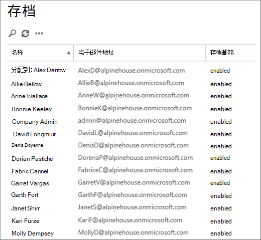
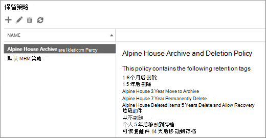

# <a name="set-up-an-archive-and-deletion-policy-for-mailboxes-in-your-organization"></a>为组织中的邮箱设置存档和删除策略

在Microsoft 365中，管理员可以创建存档和删除策略，自动将项目移动到用户的存档邮箱，并自动从邮箱中删除项目。 管理员通过创建分配给邮箱的保留策略来达到此目标，并在特定时间段后将项目移动到用户的存档邮箱，并且也会在项目达到特定期限后从邮箱中删除这些项目。 确定要移动或删除哪些项目以及何时发生这种情况的实际规则称为保留标记。 保留标记链接到保留策略，而保留策略又被分配给用户的邮箱。 保留标记将保留设置应用于用户邮箱中的单个邮件和文件夹。 它定义邮件在邮箱中保留多久，以及当邮件达到指定的保留时间时将采取的操作。 当邮件达到其保留时间时，该邮件将移动到用户的存档邮箱或被删除。
  
本文中的步骤将为名为"House House"的虚构组织设置存档和保留策略。 设置此策略包括以下任务：
  
- 为组织中每个用户启用存档邮箱。 这为用户提供了额外的邮箱存储，并且是必需的，以便保留策略可以将项目移动到存档邮箱。 它还允许用户通过将项目移动到存档邮箱来存储存档信息。

- 创建三个执行以下操作的自定义保留标记：

  - 自动将 3 年的项目移动到用户的存档邮箱。 将项目移动到存档邮箱可释放用户主邮箱中的空间。

  - 自动从"已删除邮件"文件夹中删除 5 年的项目。 这还可以释放用户的主邮箱中的空间。 用户将有机会在必要时恢复这些项目。 有关详细信息，请参阅 [详细信息部分](#more-information) 中的脚注。 

  - 自动 (并永久) 从主邮箱和存档邮箱中删除 7 年的项目。 由于遵从性法规，某些组织需要将电子邮件保留一段时间。 在此时间段过期后，组织可能希望永久删除用户邮箱中的这些项目。

- 创建新的保留策略，并添加新的自定义保留标记。 此外，还会将内置保留标记添加到新的保留策略中。 这包括用户可分配给其邮箱中的项目的个人标记。 您还将添加一个保留标记，用于将项目从用户主邮箱中的"可恢复的项目"文件夹移动到存档邮箱中的"可恢复的项目"文件夹。 这有助于在用户的邮箱处于保留状态时释放用户的"可恢复的项目"文件夹中的空间。

可以按照本文中的某些或所有步骤操作，为自己组织的邮箱设置存档和删除策略。 建议先对几个邮箱测试此过程，然后再对组织的所有邮箱实施此过程。
  
## <a name="before-you-set-up-an-archive-and-deletion-policy"></a>设置存档和删除策略之前

- 您必须是组织的全局管理员才能执行本主题中的步骤。 

- 创建新用户帐户并为其分配Exchange Online许可证时，将自动为该用户创建一个邮箱。 创建邮箱时，会自动为其分配一个名为"默认 MRM 策略"的默认保留策略。 本文将创建一个新的保留策略，然后将它分配给用户邮箱，以替换默认 MRM 策略。 邮箱一次只能分配有一个保留策略。

- 若要了解有关保留标记和保留策略中Exchange Online，请参阅[保留标记和保留策略](/exchange/security-and-compliance/messaging-records-management/retention-tags-and-policies)。

## <a name="step-1-enable-archive-mailboxes-for-users"></a>步骤 1：为用户启用存档邮箱

第一步是为组织中每个用户启用存档邮箱。 必须启用用户的存档邮箱，以便具有"移动到存档"保留操作保留的保留标记可以在保留时间过期后移动项目。
  
> [!NOTE]
> 您可以在此过程期间随时启用存档邮箱，只要在此过程完成之前在某些时候启用存档邮箱。 如果未启用存档邮箱，则不会对分配了存档或删除策略的任何项目执行任何操作。
  
1. 转到 <https://compliance.microsoft.com>。

2. 使用全局管理员帐户登录。
    
3. 在"Microsoft 365 合规中心"中，单击"**信息** 治理"，然后单击"存档 **"** 选项卡。

    将显示您组织中邮箱的列表，以及启用还是禁用相应的存档邮箱。

4. 单击列表中的第一个邮箱，按住 **Shift** 键，然后单击列表中的最后一个邮箱，选择所有邮箱。

    > [!TIP]
    > 此步骤假定未启用任何存档邮箱。 如果有任何邮箱启用了存档，请按住 **Ctrl** 键，然后单击每个已禁用存档邮箱的邮箱。 也可以单击"存档 **邮箱** "列标题，根据存档邮箱是启用还是禁用来对行进行排序，以便更轻松地选择邮箱。
  
5. 在详细信息窗格中的"批量 **编辑"下**，单击"启用 **"。**

    将显示一条警告，指出超过两年的项目将移动到新的存档邮箱。 这是因为新建用户邮箱时为其分配的默认保留策略具有保留期限为 2 年的存档默认策略标记。 您将在步骤 2 创建的自定义存档默认策略标记的保留期限为 3 年。 这意味着，3 年或更旧的项目将移动到存档邮箱。

6. 单击 **"** 是"关闭警告消息并启动此过程以启用每个选定邮箱的存档邮箱。

7. 该过程完成后，单击" **刷新刷新**  更新"存档" **页上** 的列表。

    存档邮箱为组织中所有的用户启用。

    

## <a name="step-2-create-new-retention-tags-for-the-archive-and-deletion-policies"></a>步骤 2：为存档和删除策略创建新的保留标记

在此步骤中，将创建之前描述的三个自定义保留标记。
  
- House 3 年移动到存档 (自定义存档策略) 

- House 7 Year 永久删除 (自定义删除策略) 

- House House Deleted Items 5 Years Delete and Allow Recovery (custom tag for the Deleted Items folder) 

若要创建新的保留标记，请使用 Exchange 组织中<a href="https://go.microsoft.com/fwlink/p/?linkid=2059104" target="_blank"> (EAC</a>) 管理Exchange Online标记。 请务必使用 EAC 的经典版本。
  
1. 转到 [https://admin.protection.outlook.com/ecp/](https://admin.protection.outlook.com/ecp/) ，然后使用凭据登录。
  
2. 在 EAC 中，转到"**合规性管理**  >  **""保留标记"**

    将显示组织的保留标记列表。

### <a name="create-a-custom-archive-default-policy-tag"></a>创建自定义存档默认策略标记
  
首先，使用 DPT (自定义存档默认策略) ，该标记将在 3 年后将项目移动到存档邮箱。
  
1. 在"**保留标记**"页上，单击"**新建** 标记""新建图标"。，然后选择"自动应用于整个邮箱 ( **默认) "。**

2. 在" **自动应用于整个邮箱** 的新建 (默认) 页上，填写以下字段： 

    
  
   1. **名称** 键入新保留标记的名称。 

   2. **保留操作** 选择 **"移动到存档** "，在保留期到期时将项目移动到存档邮箱。

   3. **保留期** 选择 **"当项目达到以下期限 (天数) "，** 然后输入保留期的持续时间。 对于此方案，项目将在 1095 天后移动到存档邮箱， (3 年后) 。

   4. **注释** (可选) 键入说明自定义保留标记用途的注释。

3. 单击 **"保存** "创建自定义存档 DPT。

    新的存档 DPT 显示在保留标记列表中。

### <a name="create-a-custom-deletion-default-policy-tag"></a>创建自定义删除默认策略标记
  
接下来，您将创建另一个自定义 DPT，但此 DPT 将成为在 7 年后永久删除项目的删除策略。
  
1. 在"**保留标记**"页上，单击"**新建** 标记""新建图标"。，然后选择"自动应用于整个邮箱 ( **默认) "。**

2. 在" **自动应用于整个邮箱** 的新建 (默认) 页上，填写以下字段： 

    
  
   1. **名称** 键入新保留标记的名称。 

   2. **保留操作** 选择 **"永久删除** "，在保留期到期时清除邮箱中的项目。

   3. **保留期** 选择 **"当项目达到以下期限 (天数) "，** 然后输入保留期的持续时间。 对于此方案，将在 7 年后的 2555 (清除) 。

   4. **注释** (可选) 键入说明自定义保留标记用途的注释。 

3. 单击 **"保存** "创建自定义删除 DPT。 

    新的删除 DPT 显示在保留标记列表中。

### <a name="create-a-custom-retention-policy-tag-for-the-deleted-items-folder"></a>为"已删除邮件"文件夹创建自定义保留策略标记
  
您将创建的最后一个保留标记是"已删除邮件"文件夹 (RPT) 的自定义保留策略标记。 此标记将在 5 年后删除"已删除邮件"文件夹中的项目，并提供用户可以使用"恢复已删除邮件"工具恢复项目的恢复期。
  
1. 在"**保留标记"** 页上，单击"**新建标记**  "。，然后选择"自动 **应用于默认文件夹"。**

2. 在自动 **应用于默认文件夹的"新建"** 标记页上，填写以下字段：

    
  
   1. **名称** 键入新保留标记的名称。 

   2. **将此标记应用于以下默认文件夹** 在下拉列表中，选择"**已删除邮件"。**

   3. **保留操作** 选择 **"** 删除 (并允许恢复"以在保留期过期时删除项目，但允许用户在已删除项目的保留期（默认为 14 天）内恢复已删除) 。

   4. **保留期** 选择 **"当项目达到以下期限 (天数) "，** 然后输入保留期的持续时间。 对于此方案，将在 1825 天后删除项目， (5 年后) 。

   5. **注释** (可选) 键入说明自定义保留标记用途的注释。 

3. 单击 **"** 保存"为"已删除邮件"文件夹创建自定义 RPT。

    新的 RPT 显示在保留标记列表中。

## <a name="step-3-create-a-new-retention-policy"></a>步骤 3：创建新的保留策略

创建自定义保留标记后，下一步是创建新的保留策略并添加保留标记。 您将添加在步骤 2 中创建的三个自定义保留标记，以及第一部分中提及的内置标记。 在步骤 4 中，将这个新保留策略分配给用户邮箱。
  
1. 在 EAC 中，转到"**合规性管理**  >  **""保留策略"。**

2. 在" **保留策略"页上** ，单击" **新建**  。

3. 在 **"名称** "框中，键入新保留策略的名称;例如 **，House House Archive and Deletion Policy**。

4. 在 **"保留标记"** 下，单击 **"添加新**  "。

    将显示组织中保留标记的列表。 请注意，将显示在步骤 2 中创建的自定义标记。

5. 添加以下屏幕截图中突出显示的 9 个保留标记 (详细信息部分将详细介绍这些标记) 。 [](#more-information) 若要添加保留标记，请选择它，然后单击"添加 **"。**

    
  
    > [!TIP]
    > 按住 **Ctrl** 键，然后单击每个标记，可以选择多个保留标记。 
  
6. 添加保留标记后，单击"确定 **"。**

7. 在" **新建保留策略"** 页上，单击 **"保存** "创建新策略。

    新的保留策略将显示在列表中。 选择它以显示详细信息窗格中链接到它的保留标记。

    
  
## <a name="step-4-assign-the-new-retention-policy-to-user-mailboxes"></a>步骤 4：将新的保留策略分配给用户邮箱

在新建邮箱时，默认情况下会为其分配名为"默认 MRM 策略"的保留策略。 在此步骤中，您将替换此保留策略 (因为邮箱只能分配有一个保留策略) 只需将步骤 3 中创建的新保留策略分配给您组织的用户邮箱。 此步骤假定您将新策略分配给组织的所有邮箱。
  
1. 在 EAC 中，转到"**收件人**  >  **""邮箱"。**

    将显示组织中所有用户邮箱的列表。

2. 单击列表中的第一个邮箱，按住 **Shift** 键，然后单击列表中的最后一个邮箱，选择所有邮箱。 

3. 在 EAC 右侧的详细信息窗格中的"批量编辑"下 **，单击"****更多选项"。**

4. 在“保留策略”下，单击“更新”。

5. 在"**批量分配保留策略**"页上的"选择保留策略"下拉列表中，选择在步骤 3 中创建的保留策略;例如 **，House House Archive and Retention Policy**。

6. 单击 **"保存** "保存新的保留策略分配。

7. 若要验证新保留策略是否分配给了邮箱，可以执行以下操作：

   1. 在"邮箱"页面上 **选择一** 个邮箱，然后单击"编辑  "。。

   2. 在所选用户的邮箱属性页上，单击"**邮箱功能"。**

   分配给邮箱的新策略的名称显示在"保留 **策略"下拉列表** 中。

## <a name="optional-step-5-run-the-managed-folder-assistant-to-apply-the-new-settings"></a> (可选) 步骤 5：运行托管文件夹助理以应用新设置

在步骤 4 中将新的保留策略应用于邮箱后，Exchange Online 可能需要 7 天才能将新的保留设置应用于邮箱。 这是因为名为托管文件夹助理 *的进程至少每* 7 天处理一次邮箱。 无需等待托管文件夹助理运行，您可以通过在 PowerShell 中运行 **Start-ManagedFolderAssistant** cmdlet 来Exchange Online此操作。

 **运行托管文件夹助理时会发生什么情况？** 它通过检查邮箱中的项目并确定它们是否受保留限制来应用保留策略中的设置。 然后，使用相应的保留标记标记要保留的项目，然后对已过其保留时间的项目执行指定的保留操作。
  
下面是连接到 PowerShell Exchange Online，然后在组织每个邮箱上运行托管文件夹助理的步骤。

1. [连接到 Exchange Online PowerShell](/powershell/exchange/connect-to-exchange-online-powershell)。
  
2. 运行以下两个命令，为组织中所有的用户邮箱启动托管文件夹助理。

    ```powershell
    $Mailboxes = Get-Mailbox -ResultSize Unlimited -Filter {RecipientTypeDetails -eq "UserMailbox"}
    ```

    ```powershell
    $Mailboxes.Identity | Start-ManagedFolderAssistant
    ```

就是这么简单。 你已设置 House 组织的存档和删除策略。

> [!NOTE]
> 如前所述，托管文件夹助理至少每 7 天处理一次邮箱。 因此，托管文件夹助理可以更频繁地处理邮箱。 此外，管理员无法预测托管文件夹助理下次处理邮箱的时间，这也是您可能需要手动运行邮箱的一个原因。 但是，如果要暂时阻止托管文件夹助理将新的保留设置应用于邮箱，可以运行命令来临时禁用托管文件夹助理处理 `Set-Mailbox -ElcProcessingDisabled $true` 邮箱。 若要为邮箱重新启用托管文件夹助理，请运行 `Set-Mailbox -ElcProcessingDisabled $false` 命令。 最后，如果邮箱用户具有禁用的帐户，我们不会处理该邮箱的"将项目移动到存档"操作。
  
## <a name="optional-step-6-make-the-new-retention-policy-the-default-for-your-organization"></a> (可选) 步骤 6：将新的保留策略设置为组织的默认策略

在步骤 4 中，您必须将新的保留策略分配给现有邮箱。 但您可以配置Exchange Online，以便新保留策略分配给将来创建的新邮箱。 为此，Exchange Online PowerShell 更新组织的默认邮箱计划。 *邮箱计划* 是自动配置新邮箱的属性的模板。  在此可选步骤中，可以将分配给邮箱计划 (的当前保留策略（默认 MRM 策略) ）替换为在步骤 3 中创建的保留策略。 更新邮箱计划后，新的保留策略将分配给新邮箱。

1. [连接到 Exchange Online PowerShell](/powershell/exchange/connect-to-exchange-online-powershell)。

2. 运行以下命令以显示有关您组织中邮箱计划的信息。

    ```powershell
    Get-MailboxPlan | Format-Table DisplayName,RetentionPolicy,IsDefault
    ```

    请注意设置为默认值的邮箱计划。

3. 运行以下命令，将步骤 3 中创建的新保留策略 (例如 **，House House Archive 和 Retention Policy**) 分配给默认邮箱计划。 本示例假定默认邮箱计划的名称为 **ExchangeOnlineEnterprise**。

    ```powershell
    Set-MailboxPlan "ExchangeOnlineEnterprise" -RetentionPolicy "Alpine House Archive and Retention Policy"
    ```

4. 可以重新运行步骤 2 中的命令，以验证分配给默认邮箱计划的保留策略已更改。

## <a name="more-information"></a>更多信息

- 如何计算保留时间？ 邮箱项目的保留时间从传递日期或项目创建日期开始计算，例如未发送但由用户创建的草稿邮件。 When the Managed Folder Assistant processes items in a mailbox, it stamps a start date and an expiration date for all items that have retention tags with the Delete and Allow Recovery or Permanently Delete retention action. 具有存档标记的项目标记有移动日期。 

- 下表提供了有关添加到按照本主题中的步骤创建的自定义保留策略的每个保留标记的详细信息。

    | 保留标记 | 此标记有什么功能 | 内置还是自定义？ | 类型 |
    |:-----|:-----|:-----|:-----|
    |大本市 3 年移动到存档  <br/> |将 1095 天 (3 年) 移动到存档邮箱。  <br/> |自定义 (请参阅步骤 [2：](#step-2-create-new-retention-tags-for-the-archive-and-deletion-policies) 为存档和删除策略创建新的保留标记)   <br/> |默认策略标记 (存档) ;此标记将自动应用于整个邮箱。  <br/> |
    |大本市 7 年永久删除  <br/> |7 年后永久删除主邮箱或存档邮箱中的项目。  <br/> |自定义 (请参阅步骤 [2：](#step-2-create-new-retention-tags-for-the-archive-and-deletion-policies) 为存档和删除策略创建新的保留标记)   <br/> |默认策略标记 (删除) ;此标记将自动应用于整个邮箱。  <br/> |
    |一号楼删除项目 5 年删除并允许恢复  <br/> |从"已删除邮件"文件夹中删除 5 年的项目。 删除这些项目后，用户可以在 14 天内恢复这些项目。<sup>\*</sup> <br/> |自定义 (请参阅步骤 [2：](#step-2-create-new-retention-tags-for-the-archive-and-deletion-policies) 为存档和删除策略创建新的保留标记)   <br/> |保留策略标记 (已删除项目) ;此标记将自动应用于"已删除邮件"文件夹中的项目。  <br/> |
    |可恢复项目 14 天移动到存档  <br/> |将"可恢复的项目"文件夹中已保留 14 天的项目移动到存档邮箱中的"可恢复的项目"文件夹。  <br/> |内置  <br/> |保留策略标记 (可恢复项目) ;此标记将自动应用于"可恢复的项目"文件夹中的项目。  <br/> |
    |垃圾邮件  <br/> |永久删除"垃圾邮件"文件夹中已保留 30 天的项目。 删除这些项目后，用户可以在 14 天内恢复这些项目。<sup>\*</sup> <br/> |内置  <br/> |保留策略标记 (垃圾邮件) ;此标记将自动应用于"垃圾邮件"文件夹中的项目。  <br/> |
    |1 个月后删除  <br/> |永久删除 30 天的项目。 删除这些项目后，用户可以在 14 天内恢复这些项目。<sup>\*</sup> <br/> |内置  <br/> |个人;用户可以应用此标记。  <br/> |
    |1 年后删除  <br/> |永久删除 365 天的项目。 删除这些项目后，用户可以在 14 天内恢复这些项目。<sup>\*</sup> <br/> |内置  <br/> |个人;用户可以应用此标记。  <br/> |
    |从不删除  <br/> |此标记可防止保留策略删除项目。  <br/> |内置  <br/> |个人;用户可以应用此标记。  <br/> |
    |个人 1 年后移动到存档  <br/> |1 年后将项目移动到存档邮箱。  <br/> |内置  <br/> |个人;用户可以应用此标记。  <br/> |

    > <sup>\*</sup>用户可以使用 Outlook 和 Outlook 网页版 (（以前称为 Outlook Web App) ）中的"恢复已删除邮件"工具在已删除项目的保留期（默认为 Exchange Online 中的 14 天）内恢复已删除项目。 管理员可以使用Windows PowerShell将已删除项目的保留期最长增加至 30 天。 有关详细信息，请参阅[：Recover deleted items in Outlook for Windows](https://support.office.com/article/49e81f3c-c8f4-4426-a0b9-c0fd751d48ce)和 Change the [deleted item retention period for a mailbox in Exchange Online](/exchange/recipients-in-exchange-online/manage-user-mailboxes/change-deleted-item-retention)
  
- 使用 **"可恢复的项目 14 天** 移动到存档"保留标记有助于释放用户主邮箱中"可恢复的项目"文件夹中的存储空间。 当用户的邮箱处于保留状态时，这非常有用，这意味着不会永久删除用户邮箱。 如果不将项目移动到存档邮箱，则可能会达到主邮箱中"可恢复的项目"文件夹的存储配额。 有关此情况以及如何避免此情况的信息，请参阅增加保留邮箱的可恢复 [邮件配额](./increase-the-recoverable-quota-for-mailboxes-on-hold.md)。
