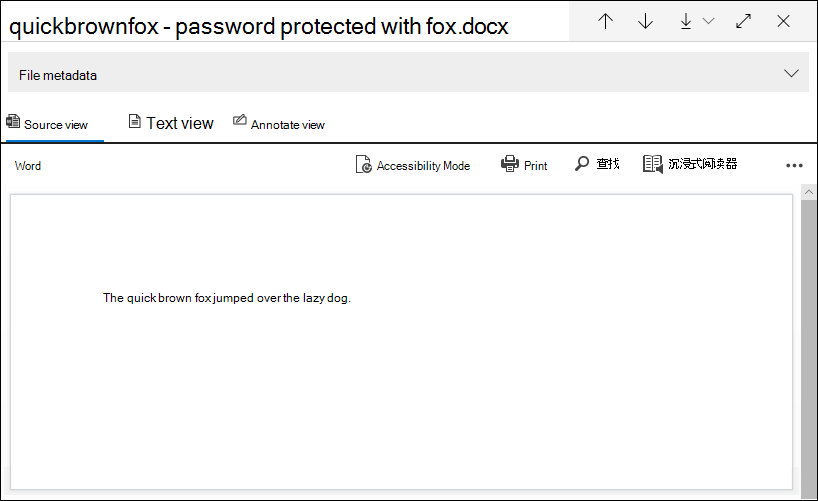

# 单个项目错误修正Advanced eDiscovery

错误修正Advanced eDiscovery用户能够纠正阻止用户正确Advanced eDiscovery内容的数据问题。 例如，由于这些文件被锁定或加密，因此无法处理受密码保护的文件。 以前，只能使用此工作流批量 [修正错误](error-remediation-when-processing-data-in-advanced-ediscovery.md)。 但有时，如果你不确定其中任何文件是否对正在调查的案例作出响应，则修正多个文件的错误没有意义。 在有机会查看文件元数据 (例如文件位置或有权访问) 以帮助你做出响应性决策之前，修正错误可能没有意义。 名为 *单个项目错误* 修正的新功能使电子数据展示管理员能够查看具有处理错误的文件的元数据，并在必要时直接在审阅集修正错误。 本文讨论如何标识、忽略和修正审阅集内出现处理错误的文件。

## 识别包含错误的文档

现在，审阅集内出现处理错误的文档 (横幅) 。 可以修正或忽略该错误。 以下屏幕截图显示了受密码保护的审阅集内 Word 文档的处理错误横幅。 另请注意，您可以查看包含处理错误的文档的文件元数据。

在审阅集内查询文档时，您还可以使用"处理状态"条件搜索具有处理[错误的文档](review-set-search.md)。

### 忽略错误

可以通过单击处理错误横幅中的 **"忽略** "来忽略处理错误。 忽略错误时，文档将从批量 [错误修正工作流中删除](error-remediation-when-processing-data-in-advanced-ediscovery.md)。 忽略错误后，文档横幅将更改颜色并指示已忽略处理错误。 您随时都可以通过单击"还原"来恢复忽略错误 **的决定**。

还可以搜索在查询审阅集内的文档时，使用"忽略处理错误"条件忽略处理错误的所有文档。

## 修正文档出错

有时，您可能需要通过删除密码、解密加密文件或恢复损坏的文档) 然后将修正的文档添加到审阅集来修正文档 (中的处理错误。 这样，您能够查看并导出错误文档以及审阅集内的其他文档。 

若要修正单个文档，请按照以下步骤操作：

1. 单击  >  **"下载原始** 文件"，将文件副本下载到本地计算机。

   

2. 脱机修复文件中的错误。 对于需要解密软件才能删除密码保护的加密文件，请提供密码并保存文件或使用密码破解程序。 修正文件后，转到下一步。

3. 在审阅集内，选择具有已修正处理错误的文件，然后单击"修正 **"。**

   

4. 单击 **"** 浏览"，转到本地计算机上已修复文件的位置，然后选择该文件。

   

    选择修正的文件后，该文件将自动上载到审阅集。 您可以跟踪文件的处理状态。

    

   处理完成后，可以查看已修复的文档。

    

有关修正文档时会发生什么情况的信息，请参阅修正 [文件时会发生什么情况](error-remediation-when-processing-data-in-advanced-ediscovery.md#what-happens-when-files-are-remediated)。

## 搜索修正的文档

可以在审阅集内搜索所有文档，这些文档是通过使用 **Keywords** 条件并指定以下 property：value 对修正的 **：IsFromErrorRemediation：true**。 从审阅集导出文档时，导出加载文件中也提供此属性。
