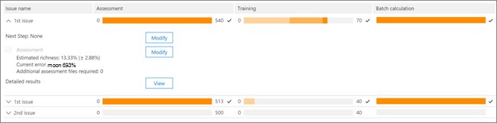
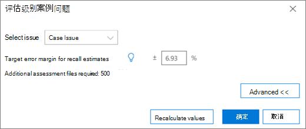
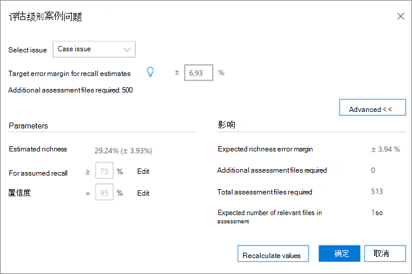
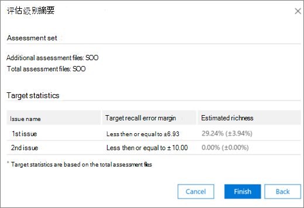

# 中相关性模块中的标记Advanced eDiscovery
  
本节介绍 Advanced eDiscovery 中相关性模块中的评估过程。
  
## 执行评估培训和分析

1. 在" **相关性跟踪 \> "** 选项卡中，单击" **评估** "以启动案例评估。

    例如，在此过程中，将创建一个包含 500 个文件的示例评估集，并显示"标记"选项卡，其中包含"标记"面板、显示的文件内容和其他标记选项。 

    
  
2. 查看示例中的每个文件，确定每个案例问题的文件相关性，然后使用"标记"面板窗格中的"相关性 (R) 、不相关的 (NR) "和"跳过"按钮标记 **文件** 。 

    > [!NOTE]
    >  评估需要 500 个标记文件。 如果文件被"跳过"，你将收到更多要标记的文件。 
  
3. 标记示例中的所有文件后，单击"计算 **"。**

    "评估当前误差范围和丰富程度"的计算并显示在"相关性跟踪"选项卡中，并展开每个问题的详细信息，如下所示。 有关此对话框的更多详细信息，请参阅 ["审阅评估结果"部分](#reviewing-assessment-results) 。

    
  
    > [!TIP]
    > 默认情况下，建议您在问题的评估进度指示器完成时继续执行默认的"下一步"，指示已审阅评估示例并标记了足够的相关文件。 >否则，如果你要查看"跟踪"选项卡结果并控制错误边距和下一步，请单击"下一步"旁边的"修改"，选择"继续 **评估**"，然后单击"确定 **"。** 
  
4. 单击 **"** 评估" **复选框右边的** "修改"可查看并指定每个问题的评估参数。 将显示 **每个问题的** "评估级别"对话框，如以下示例所示： 

    
  
    将计算问题的以下参数，并显示在"评估级别 **"对话框中：** 

    **恢复估计的目标误差量**：根据此值，计算需要审阅的其他文件的估计数量。 用于恢复的边距大于 75%，可信度为 95%。

    **需要其他评估文件**：指示如果尚未满足当前误差区的要求，还需要多少文件。 

5. 若要调整当前误差边距并查看每个问题的不同误差 (的影响) ：

6. 在 **"选择问题** "列表中，选择问题。 

7. 在 **"针对重新调用估计的目标误差边距"中**，输入一个新值。

8. 单击 **"更新** 值"以查看调整的影响。 

9. 单击 **"** 评估 **级别"** 对话框中的"高级"以查看以下其他参数和详细信息： 

    
  
    - **估计丰富** 度：根据当前评估结果估计丰富度

    - **对于假定的调用**：默认情况下，目标误差边距适用于超过 75% 的调用。 如果要 **更改** 此参数并控制不同范围的调用值上的误差范围，请单击"编辑"。 

    - **可信度：** 默认情况下，置信度的建议误差值为 95%。 如果要 **更改** 此参数，请单击"编辑"。

    - **预期的丰富度误差** 范围：在给定更新的值后，这是查看所有其他评估文件后，丰富度的预期误差范围。

    - **需要其他评估文件**：给定更新的值后，需要检查的其他评估文件数量才能达到目标。

    - **所需的评估文件总数**：给定更新的值后，需要审阅的评估文件总数。

    - **评估中的预计相关文件数**：在给定更新值后，查看所有其他评估文件后整个评估中的预期相关文件数。

10. 如果 **参数已更改**，请单击"重新计算值"。 完成后，如果存在一个问题，请单击"确定"以在存在要审阅或修改的多个 (下一步"中保存更改，然后单击"完成) "。  

    如果有多个问题，在审查或调整所有问题后，将显示"评估级别 **：** 摘要"对话框，如以下示例所示。 

    
  
    成功完成评估后，继续执行相关性培训的下一个阶段。

## 查看评估结果

标记评估示例后，评估结果将计算并显示在"相关性跟踪"选项卡中。
  
以下结果显示在展开的"跟踪"显示中：
  
- 评估调用估计的当前误差量

- 估计丰富度

- 需要检查 (其他评估) 

评估当前误差区是由评估建议的错误Advanced eDiscovery。 为"需要其他评估文件"显示的数量对应于该建议。
  
评估进度指示器显示评估的完成级别（假设当前误差线）。 评估正在进行时，用户将标记另一个评估示例。
  
当评估进度指示器显示评估已完成时，这意味着评估示例评审已完成，并且标记了足够的相关文件。 
  
展开的"跟踪"显示显示下一步的建议步骤、评估统计信息以及详细结果的访问权限。
  
当丰富程度非常低时，需要达到最少数量的相关文件以生成有用统计信息所需的其他评估文件数非常高。 Advanced eDiscovery建议继续培训。 评估进度指示器将带底纹，并且没有可用的统计信息。
  
如果没有基于统计的防抖动，则结果的准确性和可信度将较低。 但是，当你无需知道找到的相关文件的百分比时，这些结果可用于查找相关文件。 同样，此状态可用于对低丰富度问题进行训练，其中相关性分数可以加快对与特定问题相关的文件的访问。
  
> [!TIP]
> 在" **相关性 \> 跟踪"** 选项卡中，展开的问题显示提供了以下查看选项： 
> 
> 建议的下一步（如"下一步 **：** 标记"可以绕过 (每个问题) ，方法是单击其右边的"修改"按钮，然后在"下一步"中选择其他 **步骤**。 评估进度指示器未完成时，评估将是下一个建议选项，用于标记更多评估文件并增加统计信息的准确性。 
> 
> 你可以更改误差范围并评估其影响，方法是单击"修改"，在"评估级别"对话框中，更改"用于撤回估计的目标误差范围"，然后单击"更新 **值"。**  此外，在此对话框中，可以通过单击"高级"来查看高级 **选项**。 
> 
> 可以通过单击"查看"来查看其他评估级别统计信息及其 **影响**。 在显示的"详细信息结果"对话框中，如果至少有 500 个标记的评估文件，并且至少有 18 个文件标记为"与问题相关"，则每个问题均会显示统计信息。 
