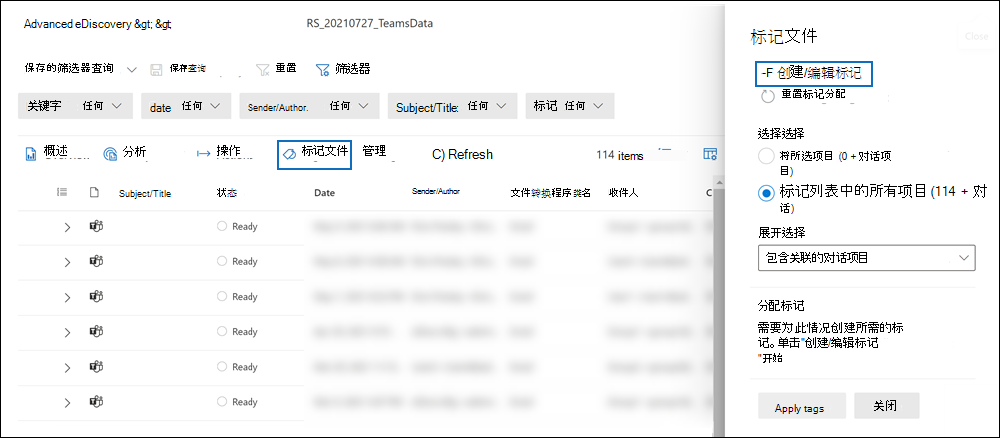
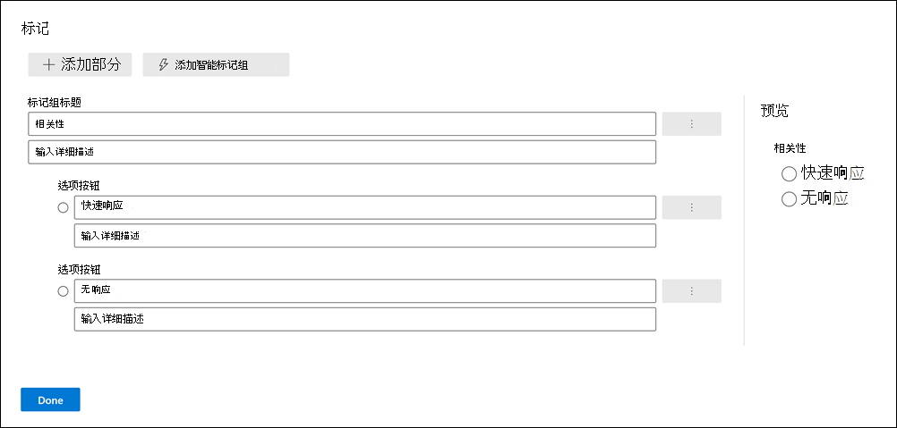
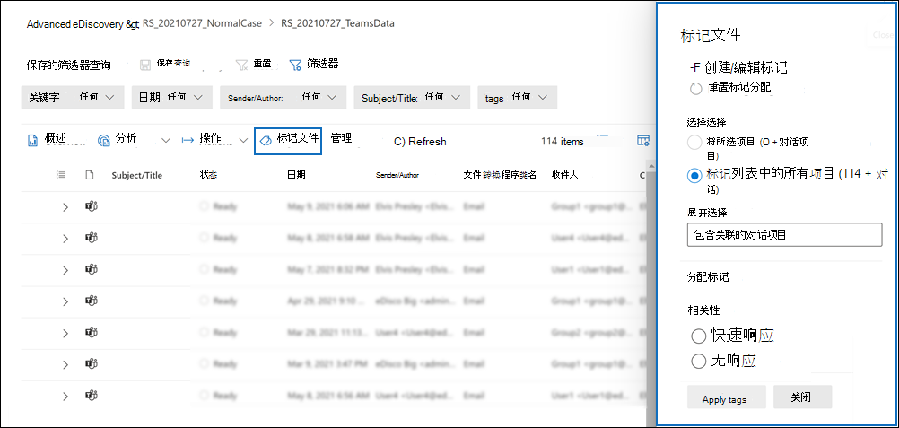

# 标记审阅集内的文档Advanced eDiscovery

组织审阅集内的内容对于完成电子数据展示过程中的各种工作流非常重要。 这包括：

- 剔除不必要的内容

- 确定相关内容

- 确定必须由专家或律师审阅的内容

当专家、律师或其他用户审阅审阅集内容时，可以使用标签来捕获他们有关内容的意见。 例如，如果意图是剔除不必要的内容，用户可以使用标记（如"无响应"）标记文档。 在审阅和标记内容后，可创建审阅集搜索以排除标记为"无响应"的任何内容。 此过程消除了电子数据展示工作流中下一步中无响应的内容。 可以针对每个案例自定义审阅集的标记面板，以便标记支持针对该案例的预定审阅工作流。

> [!NOTE]
> 标记的范围是一个Advanced eDiscovery的情况。 这意味着一个案例只能有一组标记，审阅者可以使用这些标记标记审阅集文档。 不能设置一组不同的标记，以用于同一情况下的不同审阅集。

## 标记类型

Advanced eDiscovery两种类型的标记：

- **单个选项标记**：限制审阅者选择组内的单个标记。 这些类型的标记可用于确保审阅者不会选择冲突标记，如"响应式"和"无响应"。 单个选项标记显示为单选按钮。

- **多个选择标记**：允许审阅选择一个组内的多个标记。 这些类型的标记显示为复选框。

## 标记结构

除了标记类型之外，标记面板中标记组织方式的结构还可用于使标记文档更为直观。 标记按节分组。 审阅集搜索支持按标记和按标记部分搜索。 这意味着您可以创建审阅集搜索来检索用节中的任何标记标记的文档。

您可以通过在节内嵌套标记来进一步组织标记。 例如，如果目的是标识和标记特权内容，可以使用嵌套来明确审阅者可以将文档标记为"Privileged"，然后通过检查相应的嵌套标记来选择特权类型。

## 创建和应用标记

在审阅集内标记项目的过程包含两个步骤。 第一步是创建随后应用于审阅集项目的标记。 创建标记后，您和其他审阅者可以将其应用于审阅集内的项目。 如前所述，Advanced eDiscovery案例只能有一组标记，审阅者可以使用这些标记标记审阅集项目。

### 创建标记

在将标记应用于审阅集内的项目之前，您需要创建一个标记结构。

1. 打开审阅集，转到命令栏，然后选择标记 **文件**。

2. 在"**标记文件"** 飞出页面上，单击 **"创建/编辑标记"。**

   

3. 在" **标记"** 页上，选择" **添加"部分**。

4. 键入标记组标题和可选说明，然后单击"保存 **"。**

5. 选择标记组标题旁边的三点下拉菜单，然后单击添加 **复选框** 或 **添加选项按钮**。

6. 键入复选框或选项按钮的名称和说明。

7. 重复此过程以创建新的标记节、标记选项和复选框。 例如，以下屏幕截图显示了一个名为 **Review** 的标记组，该组由"响应 **式** "和" **无响应"复选框** 组成。

   

### Apply tags

标记结构就位后，审阅者可以通过配置标记设置将标记应用于审阅集内的项目。

1. 在审阅集命令栏中，选择"标记文件"以显示"标记文件" (也称为标记 *面板) 。*

   

2. 在 **"标记文件** "飞出页上，可以设置以下选项来配置如何标记审阅集中显示的项目。 当前应用于审阅集的筛选器或筛选器查询将确定哪些项目显示，因此确定可以应用标记的项目。 有关详细信息，请参阅查询 [和筛选审阅集的内容](review-set-search.md)。

   - **选择选择**。 选择以下选项之一以确定要应用标记的项目的范围。

      - **标记所选项目**：此选项将标记应用于所选的项目。 可以在启动标记面板之前或之后选择项目。 此选项 (标记的) 项目数。此选项将实时显示项目数。

      - **标记列表中的所有项目**：此选项将标记应用于审阅集中显示的所有项目。 此选项显示要标记的项目总数。

   - **展开选择**：使用以下选项标记与审阅集内标记项目相关的其他项目。

      - **包含关联的系列项目**：此选项将同一标记应用于标记的项的关联系列项。  *系列项* 是共享相同 **FamilyId** 元数据属性值的项。 例如，附加到电子邮件的文档与电子邮件共享相同的 **FamilyId。** 因此，如果为此示例选择了此选项，则电子邮件和文档将被标记，即使文档可能不包含在审阅集项列表中。

      - **包含关联的对话项目**：此选项将同一标记应用于与标记的项Teams Yammer对话中的所有项目。 *会话项目* 是共享相同 **ConversationId** 元数据属性值的项目。 对话的所有消息、帖子和相应的脚本文件共享同一 **ConversationId**。 如果选择此选项，则同一对话 (和脚本文件) 中所有项目将被标记，即使其中某些对话项目可能不包含在审阅集项目列表中。 有关对话项目详细信息，请参阅工作流中有关内容Advanced eDiscovery中的"分组["Microsoft Teams。](teams-workflow-in-advanced-ediscovery.md#grouping)

      - **无**：此选项不会将标记应用于系列项目或对话项目。 它仅将标记应用于所选项目或审阅集列表中的所有项目。

   > [!NOTE]
   > 包括关联的系列或对话项目不会更改"标记所选项目"或"标记列表选项中所有项目"中显示的 **项目** 数。 换句话说，不会显示要标记的关联项的数量。

   - **分配标记**：此部分显示 (组组织的标记) 可以应用于文档的标签组。 每个标记组只能应用 (单选按钮标识) 单选标记标记。 但是，你可以应用多个多 (标记，这些标记由复选框) 。

3. 单击 **"应用** 标记"以根据你的设置应用标记。

   为 **标记面板上的** 每个标记组显示"应用标记状态"消息，以指示已启动标记作业。 在作业完成之前 **，"分配** 标记"部分中每个标记组的标记都显示为灰色。

> [!TIP]
> 如果正在配置标记面板上的设置，但想重新开始，请单击"重置标记分配"以清除当前设置。  此控件不适用于已标记的项目，并且不会更改或删除以前标记的项目中的标记。  

#### 监视标记作业

当您标记大量项目 (或选择"标记列表中的所有) 选项时，将创建标记文档作业。  在这种情况下，您可以在"作业"选项卡 **上** 查看此作业的状态。 这有助于跟踪可能需要很长时间才能完成的大型标记作业。 在某些情况下，标记作业可能已完成，但仍显示标记面板中的"应用标记状态"消息。 若要更新标记作业的状态，请单击审阅集命令栏中的"刷新"。

## 删除标记

可以从审阅集的项目中删除标记。 但是，不能删除已应用于审阅集项目的单选标记。 只能将单选标记更改为同一标记组内的另一个单选标记。

若要删除标记：

1. 选择要从中删除标记的项目。

2. 单击 **"标记文件** "以显示标记面板。

3. 在 **"分配标记**"下，取消选择标记，然后单击"应用 **标记"。**

您还可以使用上一过程更改应用于所选项目的标记。 取消选择当前标记后，可以选择其他标记。
